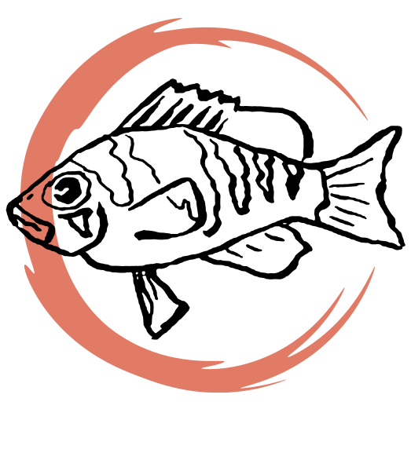

<!-- README.md is generated from README.Rmd (knitr::knit("README.Rmd",output = "README.md")). Please edit that file -->

```{r, include = FALSE}
knitr::opts_chunk$set(
  collapse = TRUE,
  comment = "#>",
  fig.path = "man/figures/README-",
  out.width = "100%"
)
```

# Statistical Exploration 

A [small notebook](https://k-hench.github.io/statistical_explorations/) were I protocol my journeys into the realms of golems, small and large worlds `r emo::ji("wizard")`.

<center>
 
</center>

---

