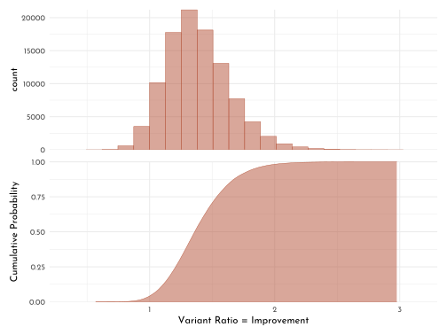

---
output:
  html_document:
      theme: yeti
  pdf_document: default
editor_options: 
  chunk_output_type: console
---

# Bayesian Statistics the Fun Way


by [Will Kurt](https://www.countbayesie.com/)

## Conditioning Probabilities

$$
\begin{eqnarray}
D & = & observed~data\\
H_{1} & = & Hypothesis\\
X & = &prior~belief\\
\end{eqnarray}
$$

Allow us to formulate the *probability of the observed data given our hypothesis and our prior belief*.

$$
P(D | H_{1}, X)
$$

To compare different hypothesis, use the ratio of probabilities (*odds*):

$$
\frac{P(D | H_{1}, X)}{P(D | H_{2}, X)} > 1
$$

## Combining Probailities based on logic

Rules for $AND$ ($\land$), $OR$ ($\lor$) and $NOT$ ($\neg$).

$NOT:$

$$
\begin{eqnarray}
P(X) & = & p\\
\neg P(X) & = & 1 - p
\end{eqnarray}
$$

$AND$

$$
\begin{eqnarray}
P(Y) & = & q \\
P(X) \land P(Y) & = & P(X,Y) = p \times q
\end{eqnarray}
$$

$OR$ (mutually exclusive events):

$$
P(X) \lor P(Y) = P(X),P(Y) = p + q
$$

while:

$$
P(X) \land P(Y) = 0
$$

$OR$ (non-mutually exclusive events):

$$
P(X) \lor P(Y) = P(X) + P(Y) - P(X, Y)
$$

## The binomial distribution

Factorial (`factorial(x)`):

$$
x! = x \times x-1 \times x -2 ...
$$

The binomial coefficient (`choose(n, k)`):

$$
{n \choose k} = \frac{n!}{k! \times (n - k)!}
$$

The binomial distribution (a *Probability Mass Function, PMF*):

$$
B(k;n,p) = {n \choose k} \times p^k \times (1 - p) ^{n-k}
$$


```r
wdh <- 5000

n <- 10
p = 0.5
tibble(k = rbinom(wdh, n , p)) %>% 
  group_by(k) %>% 
  count(name = "nn") %>% 
  ungroup() %>% 
  ggplot(aes(x = k, y = nn/wdh)) +
  geom_bar(stat = "identity", color = clr1, fill = fll1) +
  labs(x = "k", y = glue("B(k; {n}, {p})")) +
  coord_cartesian(xlim = c(-.5, 10.5))
```


```r
n <- 10
p = 1/6
tibble(k = rbinom(wdh, n , p)) %>% 
  group_by(k) %>% 
  count(name = "nn") %>% 
  ungroup() %>% 
  ggplot(aes(x = k, y = nn/wdh)) +
  geom_bar(stat = "identity", color = clr1, fill = fll1) +
  labs(x = "k", y = glue("B(k; {n}, {round(p,2)})")) +
  coord_cartesian(xlim = c(-.5, 10.5))
```


Cumulative probability to have *at least* $x$ successes in $n$ trials (`pbinom(x-1, n, p, lower.tail = FALSE)`):

$$
\sum_{k=x}^n B(k;n,p)
$$

Similarly, *less then* $x$ successes in $n$ trials (`pbinom(x, n, p)`):

$$
\sum_{k=0}^{x-1} B(k;n,p)
$$

## The beta distribution

$$
Beta(p;\alpha,\beta) = \frac{p^{\alpha -1} \times (1 - p)^{\beta - 1}}{beta(\alpha, \beta)}
$$

Example for an $n = 41$, with $\alpha = 14$ (successes) and $\beta = 27$ (fails).


```r
alpha <- 14
beta <- 27
ggplot(tibble(x = seq(0, 1, length.out = 3)), aes(x)) +
 stat_function(fun = function(x){ dbeta(x, shape1 = alpha, shape2 = beta) },
               geom = "area", color = clr1, fill = fll1, n = 500) +
  labs(x = "p", y = "Density")
```


Probability, that chance of sucess is less than 0.5:

$$
\int_{0}^{0.5} Beta(p; 14, 27)
$$


```r
x_cutoff <- 0.5
integrate(function(p){ dbeta(p, 14, 27) }, 0, x_cutoff)
```

```
#> 0.9807613 with absolute error < 5.9e-06
```

```r
ggplot(tibble(x = seq(0, 1, length.out = 3)), aes(x)) +
 stat_function(fun = function(x){ dbeta(x, shape1 = alpha, shape2 = beta) },
               geom = "area", color = clr0, fill = fll0, n = 500) +
 stat_function(xlim = c(0, x_cutoff),
               fun = function(x){ dbeta(x, shape1 = alpha, shape2 = beta) },
               geom = "area", color = clr2, fill = fll2, n = 500) +
  geom_vline(xintercept = x_cutoff, linetype = 3) +
  labs(x = "p", y = "Density")
```


```r
alpha <- 5
beta <- 1195
x_cutoff <- 0.005
integrate(function(p){ dbeta(p, alpha, beta) }, x_cutoff, 1)
```

```
#> 0.2850559 with absolute error < 1e-04
```

```r
ggplot(tibble(x = seq(0, .01, length.out = 3)), aes(x)) +
 stat_function(fun = function(x){ dbeta(x, shape1 = alpha, shape2 = beta) },
               geom = "area", color = clr0, fill = fll0, n = 500) +
 stat_function(xlim = c(x_cutoff, .01),
               fun = function(x){ dbeta(x, shape1 = alpha, shape2 = beta) },
               geom = "area", color = clr2, fill = fll2, n = 500) +
  geom_vline(xintercept = x_cutoff, linetype = 3) +
  labs(x = "p", y = "Density")
```


**Exercises**


```r
# 1)
integrate(function(p){ dbeta(p, 4, 6) }, 0.6, 1)
```

```
#> 0.09935258 with absolute error < 1.1e-15
```

```r
# 2)
integrate(function(p){ dbeta(p, 9, 11) }, 0.45, 0.55)
```

```
#> 0.30988 with absolute error < 3.4e-15
```

```r
# 3)
integrate(function(p){ dbeta(p, 109, 111) }, 0.45, 0.55)
```

```
#> 0.8589371 with absolute error < 9.5e-15
```

```r
ggplot(tibble(x = seq(0, 1, length.out = 3)), aes(x)) +
 stat_function(fun = function(x){ dbeta(x, shape1 = 9, shape2 = 11) },
               geom = "area", color = clr0, fill = fll0, n = 500) +
 stat_function(fun = function(x){ -dbeta(x, shape1 = 109, shape2 = 111) },
               geom = "area", color = clr1, fill = fll1, n = 500) +
  labs(x = "p", y = "Density")
```


## Bayes' Theorem

**conditional probability**

The *probability of A given B* is $P(A | B)$

Dependence updates the product rule of probabilities:

$$
P(A,B) = P(A) \times P(B | A)
$$

(This also holds for independend probabilities, where $P(B) = P(B|A)$)

**Bayes' Theorem** (reversing the condition to calculate the probability of the event we are conditioning on $P(A|B) \rightarrow P(B|A)$)

$$
P(A|B) = \frac{P(A)P(B|A)}{P(B)}
$$

The important parts here are the

-   [*posterior probability* ]{style="color:#54436D"}$P(H|D)$: how strongly we belief in our hypothesis given the data
-   [*likelyhood* ]{style="color:#B35136"}$P(D|H)$: the probability of data if the hypothesis were true
-   [*prior probability* ]{style="color:#E9E5D9"}$P(H)$: how likely our hypothesis is in the first place


Unnormalized posterior

$$
P(H|D) \propto P(H) \times P(D|H)
$$

## Parameter Estimation (I)

**Expectation / mean**

$$
\mu = \sum_{1}^{n}p_{i}x_{i}
$$


```r
n <- 150
mn <- 3
tibble( y = rnorm(n = n, mean = mn),
        n = 1:n,
        cum_y = cumsum(y),
        mean_y = cum_y / n) %>% 
  ggplot(aes(x = n, y = mean_y)) +
  geom_hline(yintercept = mn, linetype = 3) +
  geom_point(aes(y = y), color = clr0, size = .75, alpha = .5) +
  geom_line(color = clr2, size = .75)
```


**Spread, mean absolute deviation**

$$
MAD(x) = \frac{1}{n} \times \sum_{1}^{n} | x_{i} - \mu|
$$

**Spread, variation**

$$
Var(x) = \frac{1}{n} \times \sum_{1}^{n} (x_{i} - \mu) ^{2}
$$

**Spread, standard deviation**

$$
\sigma = \sqrt{\frac{1}{n} \times \sum_{1}^{n} (x_{i} - \mu) ^{2}}
$$

Note that in **R**, `var()` and `sd()` uses $\frac{1}{n-1}$ as denominator for the normalization:


```r
var_k <- function(x){ (1/length(x)) * sum( (x - mean(x)) ^ 2 ) }
sd_k <- function(x){ sqrt(var_k(x)) }

x <- 1:10
n <- length(x)

var(x) * ((n-1)/n) == var_k(x)
```

```
#> [1] TRUE
```

```r
sd(x) * sqrt((n-1)/n) == sd_k(x)
```

```
#> [1] TRUE
```

## The normal distribution

The probability density function (PDF) for the normal distribution (`dnorm()`):

$$
N(\mu, \sigma) = \frac{1}{\sqrt{2\pi    \sigma^2}} \times e ^{- \frac{(x - \mu) ^ 2}{2\sigma^2}}
$$


```r
mu <- 20.6
sigma <- 1.62
x_cutoff <- 18

ggplot(tibble(x = seq(mu - 4 * sigma, mu + 4 * sigma, length.out = 3)), aes(x)) +
 stat_function(fun = function(x){ dnorm(x, mu, sigma) },
               geom = "area", color = clr0, fill = fll0, n = 500) +
 stat_function(fun = function(x){ dnorm(x, mu, sigma) },
               xlim = c(mu - 4 * sigma, x_cutoff),
               geom = "area", color = clr2, fill = fll2, n = 500) +
  geom_vline(xintercept = x_cutoff, linetype = 3) +
  labs(x = "p", y = "Density")
```


```r
integrate(function(x){ dnorm(x, mu, sigma) }, 0, x_cutoff)
```

```
#> 0.05425369 with absolute error < 3.5e-05
```

Known probability mass under a normal distribution in terms of ist standard deviation:

| distance from $\mu$ | probability |
|:-------------------:|:-----------:|
|      $\sigma$       |    68 %     |
|     $2 \sigma$      |    95 %     |
|     $3 \sigma$      |   99.7 %    |


**Excercises**


```r
x <- c(100, 99.8, 101, 100.5,99.7)
mu <- mean(x)
sigma <- sd(x)

x_cutoff <- 100.4

ggplot(tibble(x = seq(mu - 4 * sigma, mu + 4 * sigma, length.out = 3)), aes(x)) +
 stat_function(fun = function(x){ dnorm(x, mu, sigma) },
               geom = "area", color = clr0, fill = fll0, n = 500) +
 stat_function(fun = function(x){ dnorm(x, mu, sigma) },
               xlim = c(x_cutoff, mu + 4 * sigma),
               geom = "area", color = clr2, fill = fll2, n = 500) +
  geom_vline(xintercept = x_cutoff, linetype = 3) +
  labs(x = "p", y = "Density")
```


```r
1 - (integrate(function(x){ dnorm(x, mu, sigma) }, mu - sigma, x_cutoff)[[1]] + (1-.68)/2)
```

```
#> [1] 0.3550062
```

## Cummulative Density and Quantile Function

**Beta distribution example**

Mean of Beta distribution

$$
\mu_{Beta} = \frac{\alpha}{\alpha + \beta}
$$


```r
alpha <- 300
beta <- 39700
mu <- alpha / (alpha + beta)
med <- qbeta(.5, shape1 = alpha, shape2 = beta)
bound_left <- .006
bound_right <- .009
```


## Parameter estimation with prior probabilities


```r
alpha_data <- 2
beta_data <- 3

alpha_prior <- 1
beta_prior <- 41

ggplot(tibble(x = seq(0, 1, length.out = 3)), aes(x)) +
 stat_function(fun = function(x){ dbeta(x, shape1 = alpha_data, shape2 = beta_data) },
               geom = "line", color = clr0,linetype = 1, n = 500) +
  stat_function(fun = function(x){ dbeta(x, shape1 = alpha_prior, shape2 = beta_prior) },
               geom = "line", color = clr0,linetype = 2, n = 500) +
  stat_function(fun = function(x){ dbeta(x, shape1 = alpha_data + alpha_prior,
                                         shape2 = beta_data + beta_prior) },
               geom = "area", color = clr1, fill = fll1, size = .2, n = 500) +
  labs(x = "Probability", y = "Density", caption = "**solid:** data; **dashed:** prior; **filled:** posterior") +
  coord_cartesian(ylim = c(0, 15)) +
  theme(plot.caption = ggtext::element_markdown(halign = .5, hjust = .5))
```


## Monte CarloSimulation


```r
alpha_a <- 36
beta_a <- 114

alpha_b <- 50
beta_b <- 100

alpha_prior <- 3
beta_prior <- 7

ggplot(tibble(x = seq(0, 1, length.out = 3)), aes(x)) +
  stat_function(fun = function(x){ 
    dbeta(x, shape1 = alpha_a + alpha_prior, shape2 = beta_a + beta_prior)
  },
  geom = "area", aes(color = "a", fill = after_scale(clr_alpha(color))), size = .5, n = 500) +
  stat_function(fun = function(x){
    dbeta(x, shape1 = alpha_b + alpha_prior, shape2 = beta_b + beta_prior)
  },
  geom = "area", aes(color = "b", fill = after_scale(clr_alpha(color))), size = .5, n = 500) +
  labs(x = "Probability", y = "Density") +
  scale_color_manual("Variant", values = c(a = clr0, b = clr2))
```


```r
n_trials <- 10^5
mc_simulation <- tibble(samples_a = rbeta(n_trials, alpha_a + alpha_prior, beta_a + beta_prior),
       samples_b = rbeta(n_trials, alpha_b + alpha_prior, beta_b + beta_prior),
       samples_ratio  = samples_b / samples_a)

p_b_superior <- sum(mc_simulation$samples_b > mc_simulation$samples_a)/n_trials
p_b_superior
```

```
#> [1] 0.95964
```

```r
p_hist <- mc_simulation %>% 
  ggplot(aes(x = samples_ratio)) +
  geom_histogram(color = clr2, fill = fll2, size = .2, bins = 20,boundary = 1) +
  theme(axis.text.x = element_blank(),
        axis.title.x = element_blank())

p_ecdf <- mc_simulation %>% 
  ggplot() +
 stat_function(fun = function(x){(ecdf(x = mc_simulation$samples_ratio))(x)},
               xlim = c(range(mc_simulation$samples_ratio)),
  geom = "area",color = clr2, fill = fll2, size = .2, n = 500) +
  labs(x = "Variant Ratio = Improvement", y = "Cumulative Probability")

p_hist / p_ecdf &
  coord_cartesian(xlim = c(0.2,3.3), expand = 0)
```



## Posterior Odds

For compering Hypotheses:

ratio of posterior:

$$
posterior odds = \frac{P(H_1) \times P(D | H_{1})}{P(H_2) \times P(D | H_{2})} = O(H_{1}) \times \frac{P(D | H_{1})}{P(D | H_{2})}
$$

This consists of the *Bayes factor*:

$$
\frac{P(D | H_{1})}{P(D | H_{2})}
$$

and the ratio of prior probabilities

$$
O(H_{1}) = \frac{P(H_1)}{P(H_2)}
$$

rough guide to evaluate poterior odds:


|Posterior odds |Strength of evidence              |
|:--------------|:---------------------------------|
|1 to 3         |Interesting but not conclusive    |
|3 to 20        |Looks like we're onto something   |
|20 to 150      |Strong evidence in favor of $H_1$ |
|> 150          |Overwhelming evidence             |

## Parameter Estimation (II)


```r
dx <- 0.01

bayes_factor <- function(h_top, h_bottom, n_success = 24, n_total = 100){
  (h_top ^ n_success * (1 - h_top) ^ (n_total - n_success)) /
    (h_bottom ^ n_success * (1 - h_bottom) ^ (n_total - n_success))
}

bayes_fs <- tibble(hypothesis = seq(0, 1, by = dx), 
                   bayes_factor = bayes_factor(hypothesis, h_bottom = 0.5)) %>%
  mutate(prior = if_else(between(hypothesis, 0.2, 0.3), .001, 1),
         posterior = prior * bayes_factor,
         posterior_normalized = posterior / sum(posterior))

p_bayes_factor <- bayes_fs %>%
  ggplot(aes(x = hypothesis, y = bayes_factor)) +
  geom_area(color = clr1, fill = fll1, size = .3) +
  theme(axis.text.x = element_blank(), axis.title.x = element_blank())

p_prior <- bayes_fs %>%
  ggplot(aes(x = hypothesis, y = prior)) +
  geom_area(color = clr0, fill = fll0, size = .3) +
  theme(axis.text.x = element_blank(), axis.title.x = element_blank()) 

p_posterior <- bayes_fs %>%
  ggplot(aes(x = hypothesis, y = posterior)) +
  geom_area(color = clr2, fill = fll2, size = .3) +
  theme(axis.text.x = element_blank(), axis.title.x = element_blank()) 

p_posterior_n <- bayes_fs %>%
  ggplot(aes(x = hypothesis, y = posterior_normalized)) +
  geom_area(color = clr2, fill = fll2, size = .3) 


p_bayes_factor  /
  p_prior /
  p_posterior /
  p_posterior_n
```


| hypothesis| bayes_factor| prior| posterior| posterior_normalized|
|----------:|------------:|-----:|---------:|--------------------:|
|       0.24|      1478776| 0.001|  1478.776|            0.0004708|

Probability of true chance is smaller *"one in two"*. 


```r
bayes_fs %>%
  filter(hypothesis < 0.5) %>%
  summarise(p_lower_than_half = sum(posterior_normalized))
```

```
#> # A tibble: 1 x 1
#>   p_lower_than_half
#>               <dbl>
#> 1              1.00
```

*Expectation* of the probability distribution (*sum of expectations weighted by their value*)


```r
sum(bayes_fs$posterior_normalized * bayes_fs$hypothesis)
```

```
#> [1] 0.2402704
```
Or (because of gap) choose most *likely* estimate:


```r
bayes_fs %>%
  filter(posterior_normalized == max(posterior_normalized)) %>%
  knitr::kable()
```


| hypothesis| bayes_factor| prior| posterior| posterior_normalized|
|----------:|------------:|-----:|---------:|--------------------:|
|       0.19|     688568.9|     1|  688568.9|            0.2192415|


```r
bayes_fs %>%
  ggplot(aes(x = hypothesis, y = bayes_factor / sum(bayes_factor))) +
  geom_area(color = clr2, fill = fll2, size = .3) +
  stat_function(fun = function(x){ dbeta(x, shape1 = 24 + 1 , shape2 = 76 + 1) * dx},
                geom = "point", shape = 21, color = clr2, fill = fll2,
                size = 1.5, n = 500)
```


*Exercises*


```r
bayes_fs_e1 <- tibble(hypothesis = seq(0, 1, by = dx), 
                   bayes_factor = bayes_factor(hypothesis, h_bottom = 0.24)) %>%
  mutate(prior = if_else(between(hypothesis, 0.2, 0.3), .001, 1),
         posterior = prior * bayes_factor,
         posterior_normalized = posterior / sum(posterior))

bayes_fs_e1 %>%
  ggplot(aes(x = hypothesis, y = bayes_factor / sum(bayes_factor))) +
  geom_area(color = clr2, fill = fll2, size = .3) +
  stat_function(fun = function(x){ dbeta(x, shape1 = 24 + 1 , shape2 = 76 + 1) * dx},
                geom = "point", shape = 21, color = clr2, fill = fll2,
                size = 1.5, n = 500)
```


```r
bayes_fs_e2 <- tibble(hypothesis = seq(0, 1, by = dx), 
                   bayes_factor = bayes_factor(hypothesis, h_bottom = 0.24)) %>%
  mutate(prior = 1.05 ^ (seq_along(hypothesis) - 1),
         posterior = prior * bayes_factor,
         posterior_normalized = posterior / sum(posterior))

bayes_fs_e2 %>%
  ggplot(aes(x = hypothesis, y = prior)) +
  geom_area(color = clr0, fill = fll0, size = .3) +
  theme(axis.text.x = element_blank(), axis.title.x = element_blank()) 
```


```r
bayes_fs_e2 %>%
  ggplot(aes(x = hypothesis, y = posterior_normalized)) +
  geom_area(color = clr2, fill = fll2, size = .3) 
```


---

<div id="myModal" class="modal">
  <span class="close">&times;</span>
  
  <div id="caption"></div>
</div>

<script src="./js/zoom.js"></script>
