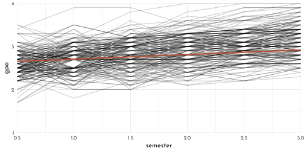
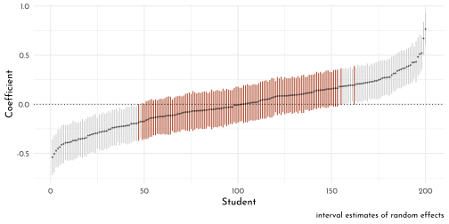
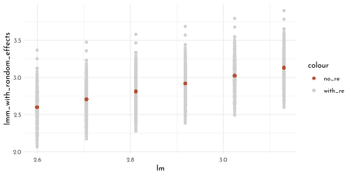
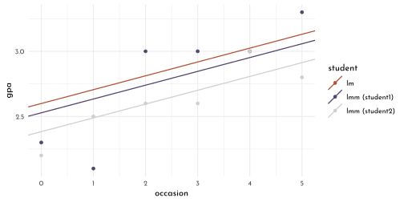
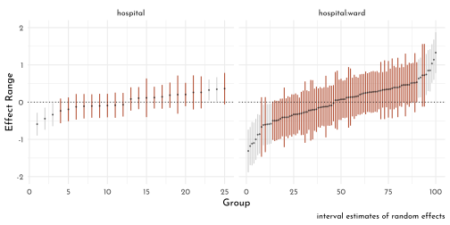
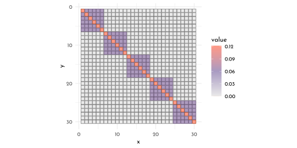

---
output:
  html_document:
    toc: true
    theme: yeti
  pdf_document: default
editor_options: 
  chunk_output_type: console
---

# Mixed Models with R


by [Michael Clark](https://m-clark.github.io/mixed-models-with-R/)


```r
load("data/gpa.RData")
gpa <- gpa %>% as_tibble()
```

## Standard regregression model

$$
gpa = b_{intercept} + b_{occ} \times occasion + \epsilon 
$$

Coefficients $b$ for intercept and effect of time. 

The error $\epsilon$ is assumed to be normally distributed with $\mu = 0$ and some standard deviation $\sigma$.

$$
\epsilon \sim \mathscr{N}(0, \sigma)
$$

alternate notation, with emphasis on the data generating process:

$$
gpa ~ \sim \mathscr{N}(\mu, \sigma)\\
\mu = b_{intercept} + b_{occ} \times occasion
$$

## mixed nodel

### student specific effect (initial depiction)

$$
gpa = b_{intercept} + b_{occ} \times occasion + ( \textit{effect}_{student} + \epsilon )\\
\textit{effect}_{student} \sim \mathscr{N}(0, \tau)
$$

focusing on the coefficients (rather than on sources of error):

$$
gpa = ( b_{intercept} + \textit{effect}_{student} ) + b_{occ} \times occasion + \epsilon
$$

or (shorter)

$$
gpa = b_{int\_student} + b_{occ} \times occasion + \epsilon
$$

$\rightarrow$ this means student specific intercepts...

$$
b_{int\_student} \sim \mathscr{N}(b_{intercept}, \tau)
$$

...that are normally distributed with the mean of the overall intercept (*random intercepts model*)

### as multi-level model

two-part regression model (one at observation level, one at student level) (this is the same as above, just needs 'plugging in')

$$
gpa = b_{int\_student} + b_{occ} \times occasion + \epsilon\\
b_{int\_student} = b_{intercept} + \textit{effect}_{student}
$$

! There is no student-specific effect for $occasion$ (which is termed *fixed effect*), and there is no random component


```r
gpa_lm <- lm(gpa ~ occasion, data = gpa)

gpa %>% 
  ggplot(aes(x = year - 1  + as.numeric(semester)/2, y = gpa, group = student)) +
  geom_line(alpha = .2) +
  geom_abline(slope = gpa_lm$coefficients[[2]],
              intercept =  gpa_lm$coefficients[[1]],
              color = clr2, size = 1) +
  labs(x = "semester") +
  coord_cartesian(ylim = c(1,4), expand = 0)
```



```r
pander::pander(summary(gpa_lm), round = 3)
```


--------------------------------------------------------------
     &nbsp;        Estimate   Std. Error   t value   Pr(>|t|) 
----------------- ---------- ------------ --------- ----------
 **(Intercept)**    2.599       0.018       145.7       0     

  **occasion**      0.106       0.006       18.04       0     
--------------------------------------------------------------


--------------------------------------------------------------
 Observations   Residual Std. Error   $R^2$    Adjusted $R^2$ 
-------------- --------------------- -------- ----------------
     1200             0.3487          0.2136       0.2129     
--------------------------------------------------------------

Table: Fitting linear model: gpa ~ occasion

Student effect not taken into account.

### Mixed Model


```r
gpa_mixed <- lmer(gpa ~ occasion + (1 | student), data = gpa)
```

(Test automatic equation creation)


```r
library(equatiomatic)
# Give the results to extract_eq
extract_eq(gpa_mixed,)
```

$$
\begin{aligned}
  \operatorname{gpa}_{i}  &\sim N \left(\alpha_{j[i]} + \beta_{1}(\operatorname{occasion}), \sigma^2 \right) \\
    \alpha_{j}  &\sim N \left(\mu_{\alpha_{j}}, \sigma^2_{\alpha_{j}} \right)
    \text{, for student j = 1,} \dots \text{,J}
\end{aligned}
$$


----------------------------------------------------------------------
   term      value    se       t     p_value   lower_2.5   upper_97.5 
----------- ------- ------- ------- --------- ----------- ------------
 Intercept   2.599   0.022   119.8      0        2.557       2.642    

 occasion    0.106   0.004   26.1       0        0.098       0.114    
----------------------------------------------------------------------


----------------------------------------------------
  group      effect     variance    sd     var_prop 
---------- ----------- ---------- ------- ----------
 student    Intercept    0.064     0.252    0.523   

 Residual                0.058     0.241    0.477   
----------------------------------------------------

Coefficients (*fixed effects*) for `time` and `intercept` are the same as `lm()`

Getting confidence intervals from a mixed model (since $p$ values are not given (`== 0` ?))


```r
confint(gpa_mixed)
```

```
#>                  2.5 %    97.5 %
#> .sig01      0.22517423 0.2824604
#> .sigma      0.23071113 0.2518510
#> (Intercept) 2.55665145 2.6417771
#> occasion    0.09832589 0.1143027
```


```r
mm_cinf <- mixedup::extract_vc(gpa_mixed)
mm_cinf %>% pander::pander()
```


-------------------------------------------------------------------------------
           &nbsp;              group      effect     variance    sd     sd_2.5 
---------------------------- ---------- ----------- ---------- ------- --------
 **sd_(Intercept)|student**   student    Intercept    0.064     0.252   0.225  

         **sigma**            Residual                0.058     0.241   0.231  
-------------------------------------------------------------------------------

Table: Table continues below

 
-------------------------------------------------
           &nbsp;             sd_97.5   var_prop 
---------------------------- --------- ----------
 **sd_(Intercept)|student**    0.282     0.523   

         **sigma**             0.252     0.477   
-------------------------------------------------

student effect $\tau$ = 0.252 / 0.064 (sd / var)

Percentage of student variation as share of the total variation (*intraclass correlation*): 0.064 / 0.122 = 0.5245902 

### Estimation of random effects

Random effect


```r
mixedup::extract_random_effects(gpa_mixed) %>%  head(5) %>% knitr::kable()
```


|group_var |effect    |group |  value|    se| lower_2.5| upper_97.5|
|:---------|:---------|:-----|------:|-----:|---------:|----------:|
|student   |Intercept |1     | -0.071| 0.092|    -0.251|      0.109|
|student   |Intercept |2     | -0.216| 0.092|    -0.395|     -0.036|
|student   |Intercept |3     |  0.088| 0.092|    -0.091|      0.268|
|student   |Intercept |4     | -0.187| 0.092|    -0.366|     -0.007|
|student   |Intercept |5     |  0.030| 0.092|    -0.149|      0.210|

Random intercept (intercept + random effect)


```r
mm_coefs <- mixedup::extract_coef(gpa_mixed)
mm_coefs %>%  head(5) %>% knitr::kable()
```


|group_var |effect    |group | value|    se| lower_2.5| upper_97.5|
|:---------|:---------|:-----|-----:|-----:|---------:|----------:|
|student   |Intercept |1     | 2.528| 0.095|     2.343|      2.713|
|student   |Intercept |2     | 2.383| 0.095|     2.198|      2.568|
|student   |Intercept |3     | 2.687| 0.095|     2.502|      2.872|
|student   |Intercept |4     | 2.412| 0.095|     2.227|      2.597|
|student   |Intercept |5     | 2.629| 0.095|     2.444|      2.814|


```r
library(merTools)
mm_intervals <- predictInterval(gpa_mixed) %>% as_tibble()
mm_mean_sd <- REsim(gpa_mixed) %>% as_tibble()

sd_level <- .95

mm_mean_sd %>%
  mutate(sd_leveled = sd * qnorm(1 - ((1 - sd_level)/2)),
         sig = (median + sd_leveled) >= 0 & (median - sd_leveled) <= 0) %>% 
  arrange(median) %>% 
  mutate(rank = row_number()) %>% 
  arrange(groupID) %>% 
  ggplot(aes(x = rank)) +
  geom_segment(aes(xend = rank, y = median - sd_leveled, yend = median +  sd_leveled, color = sig)) +
  geom_point(aes(y = median), size = .3, alpha = .5) +
  geom_hline(yintercept = 0, size = .4, linetype = 3) +
  scale_color_manual(values = c(`TRUE` = clr2, `FALSE` = clr0d), guide = "none") +
  labs(x = "Student", y = "Coefficient", caption = "interval estimates of random effects")
```



### Prediction


```r
gpa_predictions <- tibble(lm = predict(gpa_lm),
                            lmm_no_random_effects = predict(gpa_mixed, re.form = NA),
                            lmm_with_random_effects = predict(gpa_mixed)) %>% 
  bind_cols(gpa, .)

gpa_predictions %>% 
  ggplot(aes(x = lm)) +
  geom_point(aes(y = lmm_with_random_effects, color = "with_re")) +
  geom_point(aes(y = lmm_no_random_effects, color = "no_re")) +
  scale_color_manual(values = c(no_re = clr2, with_re = clr0d)) 
```



```r
student_select <- 1:2
gpa_predictions %>%
  filter(student %in% student_select) %>% 
  ggplot(aes(x = occasion)) +
  geom_point(aes(y = gpa, color = student))+
  geom_abline(data = tibble(slope = c(gpa_lm$coefficients[[2]], mm_fixed$value[c(2,2)]), 
                             intercept =  c(gpa_lm$coefficients[[1]], mm_coefs$value[as.numeric(as.character(mm_coefs$group)) %in% student_select]),
                             model = c("lm", as.character(mm_coefs$group[as.numeric(as.character(mm_coefs$group)) %in% student_select]))),
              aes(slope = slope, intercept = intercept, color = model), size = .6) +
  scale_color_manual(values = c(lm = clr2, `1` = clr1, `2` = clr0d), 
                     labels = c( "lm", "lmm (student1)", "lmm (student2)"))
```



### Cluster Level Covariates

If a cluster level covariate is added (eg. sex), $b_{int\_student}$ turns into:

$$
b_{int\_student} = b_{intercept} + b_{sex} \times \textit{sex} + \textit{effect}_{student}
$$

plugging this into the model will result in

$$
gpa = b_{intercept} + b_{occ} \times \textit{occasion} + b_{sex} \times \textit{sex} + ( \textit{effect}_{student} + \epsilon)
$$

## Add random slope


```r
gpa_mixed2 <- lmer(gpa ~ occasion + (1 + occasion | student), data = gpa)

mixedup::extract_fixed_effects(gpa_mixed2) %>% knitr::kable()
```


|term      | value|    se|       t| p_value| lower_2.5| upper_97.5|
|:---------|-----:|-----:|-------:|-------:|---------:|----------:|
|Intercept | 2.599| 0.018| 141.592|       0|     2.563|      2.635|
|occasion  | 0.106| 0.006|  18.066|       0|     0.095|      0.118|

```r
mixedup::extract_vc(gpa_mixed2, ci_level = 0) %>% knitr::kable()
```


|group    |effect    | variance|    sd| var_prop|
|:--------|:---------|--------:|-----:|--------:|
|student  |Intercept |    0.045| 0.213|    0.491|
|student  |occasion  |    0.005| 0.067|    0.049|
|Residual |          |    0.042| 0.206|    0.460|

```r
gpa_mixed2_rc <- mixedup::extract_random_coefs(gpa_mixed2)
```

correlation of the intercepts and slopes (negative, so students with a low starting score tend to increase a little more)


```r
VarCorr(gpa_mixed2) %>% as_tibble() %>% knitr::kable() 
```


|grp      |var1        |var2     |       vcov|      sdcor|
|:--------|:-----------|:--------|----------:|----------:|
|student  |(Intercept) |NA       |  0.0451934|  0.2125875|
|student  |occasion    |NA       |  0.0045039|  0.0671114|
|student  |(Intercept) |occasion | -0.0014016| -0.0982391|
|Residual |NA          |NA       |  0.0423879|  0.2058832|


```r
gpa_lm_separate <- gpa %>% 
  group_by(student) %>% 
  nest() %>% 
  mutate(mod = map(data,function(data){lm(gpa ~ occasion, data = data)})) %>% 
  bind_cols(., summarise_model(.)) 
  
p_intercepts <- ggplot()  +
  geom_density(data = gpa_mixed2_rc %>% filter(effect == "Intercept"),
               aes(x = value, color = "mixed", fill = after_scale(clr_alpha(color)))) +
  geom_density(data = gpa_lm_separate,
               aes(x = intercept, color = "separate", fill = after_scale(clr_alpha(color)))) +
  labs(x = "intercept") +
  xlim(1.5, 4)

p_slopes <- ggplot()  +
  geom_density(data = gpa_mixed2_rc %>% filter(effect == "occasion"),
               aes(x = value, color = "mixed", fill = after_scale(clr_alpha(color)))) +
  geom_density(data = gpa_lm_separate, 
               aes(x = slope, color = "separate", fill = after_scale(clr_alpha(color)))) +
  labs(x = "slope")  +
  xlim(-.2, .4) 

p_intercepts + p_slopes +
  plot_layout(guides = "collect") &
  scale_color_manual("model", values = c(separate = clr0d, mixed = clr2)) &
  theme(legend.position = "bottom")
```


$\rightarrow$ mixed model intercepts and slopes are less extreme

> In both cases the mixed model shrinks what would have been the by-group estimate, which would otherwise overfit in this scenario. This regularizing effect is yet another bonus when using mixed models.


```r
gpa_predictions <- tibble(lmm_with_random_slope = predict(gpa_mixed2)) %>% 
  bind_cols(gpa_predictions, .)

gpa_mixed2_rc_wide <- gpa_mixed2_rc %>% 
  dplyr::select(group_var, group, effect, value) %>% 
  pivot_wider(names_from = effect, values_from = value)

student_select <- 1:2
p_two_students <- gpa_predictions %>%
  filter(student %in% student_select) %>% 
  ggplot(aes(x = occasion)) +
  geom_point(aes(y = gpa, color = student))+
  geom_abline(data = tibble(slope = c(gpa_lm$coefficients[[2]], 
                                            gpa_mixed2_rc_wide$occasion[as.numeric(as.character(gpa_mixed2_rc_wide$group)) %in% student_select]), 
                             intercept =  c(gpa_lm$coefficients[[1]], 
                                            gpa_mixed2_rc_wide$Intercept[as.numeric(as.character(gpa_mixed2_rc_wide$group)) %in% student_select]),
                             model = c("lm", as.character(gpa_mixed2_rc_wide$group[as.numeric(as.character(gpa_mixed2_rc_wide$group)) %in% student_select]))),
              aes(slope = slope, intercept = intercept, color = model), size = .6) +
  scale_color_manual(values = c(lm = clr2, `1` = clr1, `2` = clr0d), 
                     labels = c( "lm", "lmm (student1)", "lmm (student2)"))

p_all_mod <- ggplot(data = gpa_predictions, aes(x = occasion, y = gpa)) +
  geom_abline(data = tibble(slope = c(gpa_mixed2_rc_wide$occasion, gpa_lm$coefficients[[2]]),
                            intercept = c(gpa_mixed2_rc_wide$Intercept, gpa_lm$coefficients[[1]]),
                            modeltype = c(rep("lmm (random slope)", length(gpa_mixed2_rc_wide$Intercept)), "lm")),
              aes(slope = slope, intercept = intercept, color = modeltype), size = .6) +
  scale_color_manual(values = c(`lmm (random slope)` = clr_alpha(clr0d ,.6), lm = clr2))

p_two_students + p_all_mod +
  plot_layout(guides = "collect") &
  xlim(0,5) & ylim(2.2, 4) &
  theme(legend.position = "bottom")
```


## Cross Classified models

Setups where data are grouped by several factors but these are not nested (*all* participants get to see *all* images).
These are *crossed* random effects.


```r
load("data/pupils.RData")

pupils %>%  head() %>% knitr::kable()
```


| PUPIL| primary_school_id| secondary_school_id| achievement|sex    |ses     |primary_denominational |secondary_denominational |
|-----:|-----------------:|-------------------:|-----------:|:------|:-------|:----------------------|:------------------------|
|     1|                 1|                   2|         6.6|female |highest |no                     |no                       |
|     2|                 1|                   1|         5.7|male   |lowest  |no                     |yes                      |
|     3|                 1|                  17|         4.5|male   |2       |no                     |no                       |
|     4|                 1|                   3|         4.4|male   |2       |no                     |no                       |
|     5|                 1|                   4|         5.8|male   |3       |no                     |yes                      |
|     6|                 1|                   4|         5.0|female |4       |no                     |yes                      |


```r
pupils_crossed <- lmer(
  achievement ~ sex + ses +
    ( 1 | primary_school_id ) + ( 1 | secondary_school_id ),
  data = pupils
)

mixedup::extract_fixed_effects(pupils_crossed) %>% knitr::kable()
```


|term       | value|    se|      t| p_value| lower_2.5| upper_97.5|
|:----------|-----:|-----:|------:|-------:|---------:|----------:|
|Intercept  | 5.924| 0.123| 48.303|   0.000|     5.684|      6.164|
|sexfemale  | 0.261| 0.046|  5.716|   0.000|     0.171|      0.350|
|ses2       | 0.132| 0.118|  1.122|   0.262|    -0.098|      0.362|
|ses3       | 0.098| 0.110|  0.890|   0.373|    -0.118|      0.314|
|ses4       | 0.298| 0.105|  2.851|   0.004|     0.093|      0.503|
|ses5       | 0.354| 0.101|  3.514|   0.000|     0.156|      0.551|
|seshighest | 0.616| 0.110|  5.602|   0.000|     0.401|      0.832|

```r
mixedup::extract_vc(pupils_crossed, ci_level = 0) %>% knitr::kable()
```


|group               |effect    | variance|    sd| var_prop|
|:-------------------|:---------|--------:|-----:|--------:|
|primary_school_id   |Intercept |    0.173| 0.416|    0.243|
|secondary_school_id |Intercept |    0.066| 0.257|    0.093|
|Residual            |          |    0.473| 0.688|    0.664|


```r
pupils_varicance_components_random_effects <- REsim(pupils_crossed) %>% as_tibble()

pupils_varicance_components_random_effects %>%
 mutate(sd_leveled = sd * qnorm(1 - ((1 - sd_level)/2)),
         sig = (median + sd_leveled) >= 0 & (median - sd_leveled) <= 0) %>% 
  group_by(groupFctr) %>% 
  arrange(groupFctr, median) %>% 
  mutate(rank = row_number()) %>% 
  arrange(groupFctr, groupID) %>% 
  ungroup() %>% 
  ggplot(aes(x = rank)) +
  geom_segment(aes(xend = rank, y = median - sd_leveled, yend = median +  sd_leveled, color = sig)) +
  geom_point(aes(y = median), size = .3, alpha = .5) +
  geom_hline(yintercept = 0, size = .4, linetype = 3) +
  facet_wrap(groupFctr ~ ., scales = "free_x") +
  scale_color_manual(values = c(`TRUE` = clr2, `FALSE` = clr0d), guide = "none") +
  labs(x = "Group", y = "Effect Range", caption = "interval estimates of random effects")
```


> Note that we have the usual extensions here if desired. As an example, we could also do random slopes for student level characteristics.

## Hierachical structure

These are setups, where different grouping factors are *nested* within each other (eg. cities, counties, states).


```r
load("data/nurses.RData")
nurses %>% head() %>% knitr::kable()
```


| hospital| ward| wardid| nurse| age|sex    | experience| stress|wardtype     |hospsize |treatment |
|--------:|----:|------:|-----:|---:|:------|----------:|------:|:------------|:--------|:---------|
|        1|    1|     11|     1|  36|Male   |         11|      7|general care |large    |Training  |
|        1|    1|     11|     2|  45|Male   |         20|      7|general care |large    |Training  |
|        1|    1|     11|     3|  32|Male   |          7|      7|general care |large    |Training  |
|        1|    1|     11|     4|  57|Female |         25|      6|general care |large    |Training  |
|        1|    1|     11|     5|  46|Female |         22|      6|general care |large    |Training  |
|        1|    1|     11|     6|  60|Female |         22|      6|general care |large    |Training  |


```r
nurses_hierach <- lmer(
  stress ~ age + sex + experience + treatment + wardtype + hospsize +
    ( 1 | hospital) + ( 1 | hospital:ward), # together same as ( 1 | hospital / ward)
  data = nurses
)

mixedup::extract_fixed_effects(nurses_hierach) %>% knitr::kable()
```


|term                 |  value|    se|       t| p_value| lower_2.5| upper_97.5|
|:--------------------|------:|-----:|-------:|-------:|---------:|----------:|
|Intercept            |  5.380| 0.185|  29.128|   0.000|     5.018|      5.742|
|age                  |  0.022| 0.002|  10.053|   0.000|     0.018|      0.026|
|sexFemale            | -0.453| 0.035| -12.952|   0.000|    -0.522|     -0.385|
|experience           | -0.062| 0.004| -13.776|   0.000|    -0.070|     -0.053|
|treatmentTraining    | -0.700| 0.120|  -5.843|   0.000|    -0.935|     -0.465|
|wardtypespecial care |  0.051| 0.120|   0.424|   0.671|    -0.184|      0.286|
|hospsizemedium       |  0.489| 0.202|   2.428|   0.015|     0.094|      0.884|
|hospsizelarge        |  0.902| 0.275|   3.280|   0.001|     0.363|      1.440|

```r
mixedup::extract_vc(nurses_hierach, ci_level = 0) %>% knitr::kable()
```


|group         |effect    | variance|    sd| var_prop|
|:-------------|:---------|--------:|-----:|--------:|
|hospital:ward |Intercept |    0.337| 0.580|    0.500|
|hospital      |Intercept |    0.119| 0.345|    0.177|
|Residual      |          |    0.217| 0.466|    0.323|


```r
nurses_varicance_components_random_effects <- REsim(nurses_hierach) %>% as_tibble()

nurses_varicance_components_random_effects %>%
  mutate(sd_leveled = sd * qnorm(1 - ((1 - sd_level)/2)),
         sig = (median + sd_leveled) >= 0 & (median - sd_leveled) <= 0) %>% 
  group_by(groupFctr) %>% 
  arrange(groupFctr, median) %>% 
  mutate(rank = row_number()) %>% 
  arrange(groupFctr, groupID) %>% 
  ungroup() %>% 
  ggplot(aes(x = rank)) +
  geom_segment(aes(xend = rank, y = median - sd_leveled, yend = median +  sd_leveled, color = sig)) +
  geom_point(aes(y = median), size = .3, alpha = .5) +
  geom_hline(yintercept = 0, size = .4, linetype = 3) +
  facet_wrap(groupFctr ~ ., scales = "free_x") +
  scale_color_manual(values = c(`TRUE` = clr2, `FALSE` = clr0d), guide = "none") +
  ylim(-2,2) +
  labs(x = "Group", y = "Effect Range", caption = "interval estimates of random effects")
```



### Crossed vs. nested


```r
nurses_hierach2 <- lmer(
  stress ~ age + sex + experience + treatment + wardtype + hospsize +
    ( 1 | hospital ) + ( 1 | hospital:wardid ), # needs to be wardid now because ward is duplicated over hospitals (not unique)
  data = nurses
)

nurses_nested <- lmer(
  stress ~ age + sex + experience + treatment + wardtype + hospsize +
    ( 1 | hospital ) + ( 1 | wardid ),
  data = nurses
)
```

Nested:


```r
mixedup::extract_fixed_effects(nurses_hierach2) %>% knitr::kable()
```


|term                 |  value|    se|       t| p_value| lower_2.5| upper_97.5|
|:--------------------|------:|-----:|-------:|-------:|---------:|----------:|
|Intercept            |  5.380| 0.185|  29.128|   0.000|     5.018|      5.742|
|age                  |  0.022| 0.002|  10.053|   0.000|     0.018|      0.026|
|sexFemale            | -0.453| 0.035| -12.952|   0.000|    -0.522|     -0.385|
|experience           | -0.062| 0.004| -13.776|   0.000|    -0.070|     -0.053|
|treatmentTraining    | -0.700| 0.120|  -5.843|   0.000|    -0.935|     -0.465|
|wardtypespecial care |  0.051| 0.120|   0.424|   0.671|    -0.184|      0.286|
|hospsizemedium       |  0.489| 0.202|   2.428|   0.015|     0.094|      0.884|
|hospsizelarge        |  0.902| 0.275|   3.280|   0.001|     0.363|      1.440|

```r
mixedup::extract_vc(nurses_hierach2, ci_level = 0) %>% knitr::kable()
```


|group           |effect    | variance|    sd| var_prop|
|:---------------|:---------|--------:|-----:|--------:|
|hospital:wardid |Intercept |    0.337| 0.580|    0.500|
|hospital        |Intercept |    0.119| 0.345|    0.177|
|Residual        |          |    0.217| 0.466|    0.323|

Crossed:

```r
mixedup::extract_fixed_effects(nurses_nested) %>% knitr::kable()
```


|term                 |  value|    se|       t| p_value| lower_2.5| upper_97.5|
|:--------------------|------:|-----:|-------:|-------:|---------:|----------:|
|Intercept            |  5.380| 0.185|  29.128|   0.000|     5.018|      5.742|
|age                  |  0.022| 0.002|  10.053|   0.000|     0.018|      0.026|
|sexFemale            | -0.453| 0.035| -12.952|   0.000|    -0.522|     -0.385|
|experience           | -0.062| 0.004| -13.776|   0.000|    -0.070|     -0.053|
|treatmentTraining    | -0.700| 0.120|  -5.843|   0.000|    -0.935|     -0.465|
|wardtypespecial care |  0.051| 0.120|   0.424|   0.671|    -0.184|      0.286|
|hospsizemedium       |  0.489| 0.202|   2.428|   0.015|     0.094|      0.884|
|hospsizelarge        |  0.902| 0.275|   3.280|   0.001|     0.363|      1.440|

```r
mixedup::extract_vc(nurses_nested, ci_level = 0) %>% knitr::kable()
```


|group    |effect    | variance|    sd| var_prop|
|:--------|:---------|--------:|-----:|--------:|
|wardid   |Intercept |    0.337| 0.580|    0.500|
|hospital |Intercept |    0.119| 0.345|    0.177|
|Residual |          |    0.217| 0.466|    0.323|

## Residual Structure


```r
rescov <- function(model, data) {
  var.d <- crossprod(getME(model,"Lambdat"))
  Zt <- getME(model,"Zt")
  vr <- sigma(model)^2
  var.b <- vr*(t(Zt) %*% var.d %*% Zt)
  sI <- vr * Diagonal(nrow(data))
  var.y <- var.b + sI
  var.y  %>%
    as.matrix() %>%
    as_tibble() %>% 
    mutate(row = row_number()) %>% 
    pivot_longer(cols = -row, names_to = "column")
}

rescov(gpa_mixed, gpa) %>%
  mutate(x = as.numeric(column),
             y = as.numeric(row)) %>% 
  filter(between(x,0,30),
         between(y,0,30)) %>% 
  ggplot(aes(x = x,
             y = y,
             fill = value)) +
  geom_tile(aes(color = after_scale(clr_darken(fill))), size = .3, width = .9, height = .9) +
  scale_fill_gradientn(colours = c(clr0, clr_lighten(clr1), clr_lighten(clr2))) +
  scale_y_reverse() +
  coord_equal()
```



covariance matrix for a cluster (compound symmetry):

$$
\Sigma = 
\left[
\begin{array}{ccc} 
\color{#B35136}{\sigma^2 + \tau^2} & \tau^2   & \tau^2  & \tau^2 & \tau^2 & \tau^2   \\
\tau^2   & \color{#B35136}{\sigma^2 + \tau^2} & \tau^2 & \tau^2 & \tau^2 & \tau^2    \\
\tau^2   & \tau^2   & \color{#B35136}{\sigma^2 + \tau^2} & \tau^2 & \tau^2 & \tau^2  \\
\tau^2   & \tau^2   & \tau^2 & \color{#B35136}{\sigma^2 + \tau^2} & \tau^2 & \tau^2\\
\tau^2   & \tau^2   & \tau^2  & \tau^2 & \color{#B35136}{\sigma^2 + \tau^2}  & \tau^2 \\
\tau^2   & \tau^2   & \tau^2  & \tau^2   & \tau^2  & \color{#B35136}{\sigma^2 + \tau^2} \\
\end{array}\right]
$$

Types of covariance structures:

> in a standard linear regression model, we have constant variance and no covariance:

$$
\Sigma = 
\left[
\begin{array}{ccc} 
\sigma^2 & 0   & 0   \\
0   & \sigma^2 & 0   \\
0   & 0   & \sigma^2 \\
\end{array}\right]
$$

> next, relax the assumption of equal variances, and estimate each separately.
> In this case of heterogeneous variances, we might see more or less variance over time, for example.

$$
\Sigma = 
\left[
\begin{array}{ccc} 
\sigma_1^2 & 0   & 0   \\
0   & \sigma_2^2 & 0   \\
0   & 0   & \sigma_3^2 \\
\end{array}\right]
$$

> we actually want to get at the underlying covariance/correlation.
> I'll switch to the correlation representation, but you can still think of the variances as constant or separately estimated.
> So now we have something like this, where $\rho$ represents the residual correlation among observations.

$$
\Sigma = \sigma^2
\left[
\begin{array}{ccc} 
1 & \rho_1   & \rho_2   \\
\rho_1   & 1 & \rho_3   \\
\rho_2   & \rho_3   & 1 \\
\end{array}\right]
$$

$\rightarrow$  *unstructured* / *symmetric* correlation structure (*compound symmetry*)

**Autocorrelation** (lag of order one for residuals):

$$
\Sigma = \sigma^2
\left[
\begin{array}{cccc} 
1 & \rho     & \rho^2   & \rho^3   \\
\rho     & 1 & \rho     & \rho^2   \\
\rho^2   & \rho     & 1 & \rho     \\
\rho^3   & \rho^2   & \rho     & 1 \\
\end{array}\right]
$$

### Heterogeneous variance


```r
library(nlme)

gpa_hetero_res <- lme(
  gpa ~ occasion,
  data = gpa,
  random = ~ 1 | student,
  weights = varIdent(form = ~ 1 | occasion)
)

mixedup::extract_fixed_effects(gpa_hetero_res) %>% knitr::kable()
```


|term      | value|    se|      z| p_value| lower_2.5| upper_97.5|
|:---------|-----:|-----:|------:|-------:|---------:|----------:|
|Intercept | 2.599| 0.026| 99.002|       0|     2.547|      2.650|
|occasion  | 0.106| 0.004| 26.317|       0|     0.098|      0.114|

```r
mixedup::extract_vc(gpa_hetero_res, ci_level = 0) %>% knitr::kable()
```


|group    |effect    | variance|    sd| var_prop|
|:--------|:---------|--------:|-----:|--------:|
|student  |Intercept |    0.094| 0.306|    0.404|
|Residual |          |    0.138| 0.372|    0.596|

alternative approach to heterogeneous variance models:


```r
library(glmmTMB)

gpa_hetero_res2 <- glmmTMB(
  gpa ~ occasion + ( 1 | student ) + diag( 0 + occas | student ),
  data = gpa
)
```

Comparing results of {nlme} and {glmmTMB} 


```r
tibble(relative_val = c(1, coef(gpa_hetero_res$modelStruct$varStruct, unconstrained = FALSE))) %>% 
  mutate(absolute_val = (relative_val * gpa_hetero_res$sigma) ^ 2,
         `hetero_res (nlme)` = mixedup::extract_het_var(gpa_hetero_res, scale = 'var', digits = 5) %>%
           unname() %>% as.vector() %>% t() %>% .[,1],
         `hetero_res (glmmTMB)` = mixedup::extract_het_var(gpa_hetero_res2, scale = 'var', digits = 5) %>%
           dplyr::select(-group) %>% unname() %>% as.vector() %>% t() %>% .[,1]) %>% 
  knitr::kable()
```


| relative_val| absolute_val| hetero_res (nlme)| hetero_res (glmmTMB)|
|------------:|------------:|-----------------:|--------------------:|
|    1.0000000|    0.1381504|           0.13815|              0.13790|
|    0.8261186|    0.0942837|           0.09428|              0.09415|
|    0.6272415|    0.0543528|           0.05435|              0.05430|
|    0.4311126|    0.0256764|           0.02568|              0.02568|
|    0.3484013|    0.0167692|           0.01677|              0.01677|
|    0.4324628|    0.0258374|           0.02584|              0.02580|

### Autocorrelation


```r
gpa_autocorr <- lme(
  gpa ~ occasion,
  data = gpa,
  random = ~ 1 | student,
  correlation = corAR1(form = ~ occasion)
)

mixedup::extract_fixed_effects(gpa_autocorr) %>% knitr::kable()
```


|term      | value|    se|       z| p_value| lower_2.5| upper_97.5|
|:---------|-----:|-----:|-------:|-------:|---------:|----------:|
|Intercept | 2.597| 0.023| 113.146|       0|     2.552|      2.642|
|occasion  | 0.107| 0.005|  20.297|       0|     0.097|      0.118|

```r
mixedup::extract_vc(gpa_autocorr, ci_level = 0) %>% knitr::kable()
```


|group    |effect    | variance|    sd| var_prop|
|:--------|:---------|--------:|-----:|--------:|
|student  |Intercept |    0.046| 0.215|    0.381|
|Residual |          |    0.075| 0.273|    0.619|


```r
gpa_autocorr2 <- glmmTMB(
  gpa ~ occasion + ar1( 0 + occas | student ) + ( 1 | student ),
  # occas is cotegorical version of occasion
  data = gpa
)

mixedup::extract_fixed_effects(gpa_autocorr2) %>% knitr::kable()
```


|term      | value|    se|       z| p_value| lower_2.5| upper_97.5|
|:---------|-----:|-----:|-------:|-------:|---------:|----------:|
|Intercept | 2.598| 0.023| 111.077|       0|     2.552|      2.643|
|occasion  | 0.107| 0.005|  19.458|       0|     0.096|      0.118|

```r
mixedup::extract_vc(gpa_autocorr2, ci_level = 0) %>% knitr::kable()
```


|group     | variance|    sd| var_prop|
|:---------|--------:|-----:|--------:|
|student   |    0.093| 0.305|    0.159|
|student.1 |    0.000| 0.000|    0.000|
|Residual  |    0.028| 0.167|    0.048|

## Generalized Linear Mixed Models


```r
load("data/speed_dating.RData")

sdating <- glmer(
  decision ~ sex + samerace + attractive_sc + sincere_sc + intelligent_sc +
    ( 1 | iid),
  data = speed_dating,
  family = binomial
)

mixedup::extract_fixed_effects(sdating) %>% knitr::kable()
```


|term           |  value|    se|      z| p_value| lower_2.5| upper_97.5|
|:--------------|------:|-----:|------:|-------:|---------:|----------:|
|Intercept      | -0.743| 0.121| -6.130|    0.00|    -0.981|     -0.506|
|sexMale        |  0.156| 0.164|  0.954|    0.34|    -0.165|      0.478|
|sameraceYes    |  0.314| 0.075|  4.192|    0.00|     0.167|      0.460|
|attractive_sc  |  0.502| 0.015| 33.559|    0.00|     0.472|      0.531|
|sincere_sc     |  0.089| 0.016|  5.747|    0.00|     0.059|      0.120|
|intelligent_sc |  0.143| 0.017|  8.232|    0.00|     0.109|      0.177|

```r
mixedup::extract_vc(sdating, ci_level = 0) %>% knitr::kable()
```


|group |effect    | variance|    sd| var_prop|
|:-----|:---------|--------:|-----:|--------:|
|iid   |Intercept |    2.708| 1.645|        1|

## Issues/ Considderations

- **small number of clusters**: problematic - similar to number of samples to compute variance / mean or similar (to get to the variance component we need enough groups). This also touches whether something should be a *fixed* or a *random* effect (random is always possible when the number of clusters is large enough)
- **small number of observations within clusters**: no problem, but might prevent random slopes (for `n == 1`)
- **balanced design / missing data**: not really a requirement, so as long as it is not extreme likely not an issue

### Model comparison

Using AIC *can help*, but should not used to *make* the decision---reasoning about the implications of the used models should.


```r
gpa_1 <- lmer(gpa ~ occasion + (1 + occasion | student), data = gpa)
gpa_2 <- lmer(gpa ~ occasion + sex + (1 + occasion | student), data = gpa)
gpa_3 <- lmer(gpa ~ occasion + (1 | student), data = gpa)

list(gpa_1 = gpa_1, gpa_2 = gpa_2, gpa_3 = gpa_3) %>%
  map_df(function(mod) data.frame(AIC = AIC(mod)), .id = 'model') %>% 
  arrange(AIC) %>% 
  mutate(`Δ AIC` = AIC - min(AIC)) %>% 
  knitr::kable()
```


|model |      AIC|      Δ AIC|
|:-----|--------:|----------:|
|gpa_2 | 269.7853|   0.000000|
|gpa_1 | 272.9566|   3.171217|
|gpa_3 | 416.8929| 147.107536|

## Formula summary

|formula                                                                                                 |meaning                                                                                                                                 |
|:-------------------------------------------------------------------------------------------------------|:---------------------------------------------------------------------------------------------------------------------------------------|
|`(1|group)`                                                                                        |random group intercept                                                                                                                  |
|`(x|group)` = `(1+x|group)`                                                                   |random slope of x within group with correlated intercept                                                                                |
|`(0+x|group)` = `(-1+x|group)`                                                                |random slope of x within group: no variation in intercept                                                                               |
|`(1|group) + (0+x|group)`                                                                     |uncorrelated random intercept and random slope within group                                                                             |
|`(1|site/block)` = `(1|site)+(1|site:block)`                                             |intercept varying among sites and among blocks within sites (nested random effects)                                                     |
|`site+(1|site:block)`                                                                              |*fixed* effect of sites plus random variation in intercept among blocks within sites                                                    |
|`(x|site/block)` = `(x|site)+(x|site:block)` = `(1 + x|site)+(1+x|site:block)` |slope and intercept varying among sites and among blocks within sites                                                                   |
|`(x1|site)+(x2|block)`                                                                        |two different effects, varying at different levels                                                                                      |
|`x*site+(x|site:block)`                                                                            |fixed effect variation of slope and intercept varying among sites and random variation of slope and intercept among blocks within sites |
|`(1|group1)+(1|group2)`                                                                       |intercept varying among crossed random effects (e.g. site, year)                                                                        |


|equation                                                        |formula                                           |
|:---------------------------------------------------------------|:-------------------------------------------------|
|$β_0 + β_{1}X_{i} + e_{si}$                                     |n/a (Not a mixed-effects model)                   |
|$(β_0 + b_{S,0s}) + β_{1}X_i + e_{si}$                          |`∼ X + (1∣Subject)`                               |
|$(β_0 + b_{S,0s}) +  (β_{1} + b_{S,1s}) X_i + e_{si}$           |`~ X + (1 + X∣Subject)`                           |
|$(β_0 + b_{S,0s} + b_{I,0i}) + (β_{1} + b_{S,1s}) X_i + e_{si}$ |`∼ X + (1 + X∣Subject) + (1∣Item)`                |
|As above, but $S_{0s}$, $S_{1s}$ independent                    |`∼ X + (1∣Subject) + (0 + X∣ Subject) + (1∣Item)` |
|$(β_0 + b_{S,0s} + b_{I,0i}) + β_{1}X_i + e_{si}$               |`∼ X + (1∣Subject) + (1∣Item)`                    |
|$(β_0 + b_{I,0i}) +  (β_{1} + b_{S,1s})X_i + e_{si}$            |`∼ X + (0 + X∣Subject) + (1∣Item)`                |


---

<div id="myModal" class="modal">
  <span class="close">&times;</span>
  
  <div id="caption"></div>
</div>

<script src="./js/zoom.js"></script>
