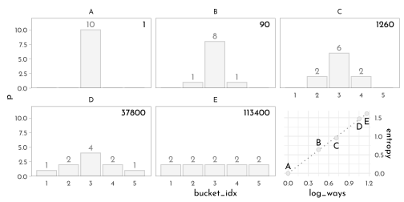
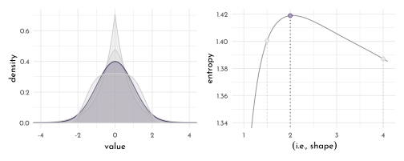
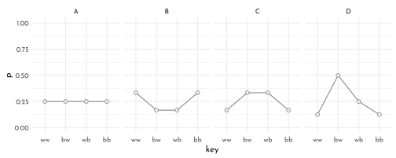
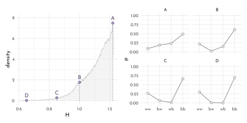
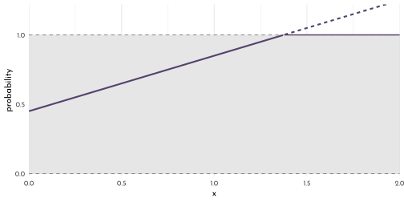
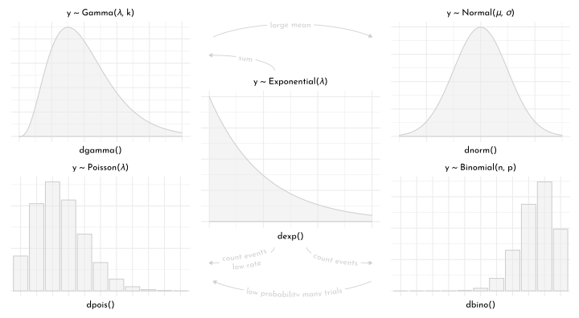
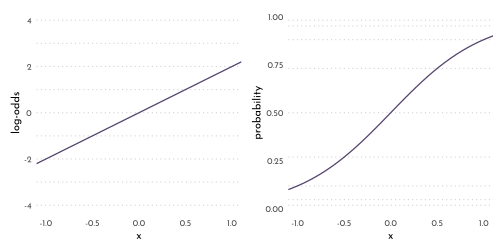
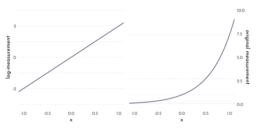

---
output:
  html_document:
  theme: yeti
pdf_document: default
editor_options: 
  chunk_output_type: console
---

# Rethinking: Chapter 10

**Big Entropy and the Generalized Linear Model**


by [Richard McElreath](https://xcelab.net/rm/statistical-rethinking/), building on the Summaries by [Solomon Kurz](https://bookdown.org/content/4857/).

## Maximum Entropy

Recall *information entropy* ($H$):

$$
H(p) =  - \sum_{i} p_{i}~log~p_i
$$


```r
data_bucket <- tibble(
  case_id = LETTERS[1:5],
  p = list(
    c(0,0,10,0,0),
    c(0,1,8,1,0),
    c(0,2,6,2,0),
    c(1,2,4,2,1),
    c(2,2,2,2,2)
  ),
  ways = c(1, 90,1260,37800, 113400),
  log_ways = log(ways)/10) %>%
  mutate(p_norm = map(p, .f = function(q){ q / sum(q)}),
         entropy = map_dbl(p_norm, .f = function(q){ - sum( if_else(q == 0, 0, q * log(q))) }))
```


```r
p <- data_bucket %>% 
  unnest(p) %>% 
  group_by(case_id) %>% 
  mutate(bucket_idx = row_number()) %>% 
  ungroup() %>% 
  ggplot(aes(x = bucket_idx, y = p)) +
  geom_bar(stat = "identity", color = clr0d, fill = fll0) +
  geom_text(data = data_bucket, aes(x = 5.5, y = 11, label = ways),
            hjust = 1, family = fnt_sel) +
    geom_text(data = . %>% filter(p > 0),
              aes(y = p + 1, label = p),
            family = fnt_sel, color = clr0dd) +
  facet_wrap(case_id ~ .) +
  scale_y_continuous(breaks = seq(0,10, length.out = 5), expand = c(0,0)) +
  coord_cartesian(ylim = c(0, 12)) +
  theme(panel.grid.minor = element_blank(),
        panel.grid.major = element_blank(),
        axis.ticks.y = element_line(size = .2, color = clr_dark),
        panel.border = element_rect(color = clr_dark, fill = "transparent"))

pg <- ggplotGrob(p)
p2 <- ggplot(data_bucket, aes(log_ways, entropy))+
  geom_smooth(method = "lm", se = FALSE, color = clr_dark, linetype = 3, size = .6) +
  geom_point(shape = 21, color = clr0d, fill = clr0, size = 2) +
  geom_text(aes(y = entropy + .2 * c(1,1,-1,-1,-1), label = case_id),
            family = fnt_sel) +
  scale_y_continuous(position = "right")

pg$grobs[[which(pg$layout$name == "panel-3-2")]] <- ggplotGrob(p2)
pg$layout$t[[which(pg$layout$name == "panel-3-2")]] <- 18

cowplot::ggdraw(pg)
```



### The Gaussian Family

The *generalized normal distribution*:

$$
Pr(y | \mu, \alpha, \beta) = \frac{\beta}{2\alpha \Gamma (1 / \beta) } e^{-(\frac{|y-\mu|}{\alpha})^\beta}
$$

The normal distribution ($\beta = 2$) has largest entropy for a continuous distribution with a known variance.


```r
alpha_per_beta <- function(beta, variance = 1) {
  sqrt((variance * gamma(1 / beta)) / gamma(3 / beta))
}

beta_select <- c(1, 1.5, 2, 4)

p1 <- crossing(value = seq(from = -5, to = 5, length.out = 501),
         beta  = beta_select) %>% 
  mutate(mu    = 0,
         alpha = alpha_per_beta(beta)) %>% 
  mutate(density = (beta / (2 * alpha * gamma(1 / beta))) * 
           exp(1) ^ (-1 * (abs(value - mu) / alpha) ^ beta),) %>% 
  ggplot(aes(x = value, y = density, group = beta)) +
  geom_area(aes(color = beta == 2, fill = after_scale(clr_alpha(color, .3))),
            position = "dodge") +
  scale_color_manual(values = c(`TRUE` = clr1, `FALSE` = clr0d), guide = "none") +
  coord_cartesian(xlim = c(-4, 4))

p2 <- crossing(value = -8:8,
         beta  = seq(from = .9, to = 4.1, by = .01)) %>% 
  mutate(mu    = 0,
         alpha = alpha_per_beta(beta)) %>% 
  mutate(density = (beta / (2 * alpha * gamma(1 / beta))) * 
           exp(1) ^ (-1 * (abs(value - mu) / alpha) ^ beta)) %>% 
  group_by(beta) %>% 
  summarise(entropy = -sum(density * log(density))) %>% 
  ggplot(aes(x = beta, y = entropy)) +
  geom_line(color = clr_dark) +
  geom_segment(data = . %>% filter(beta %in% beta_select),
               aes(x = beta, xend = beta, y = 0, yend = entropy,
                   color = beta == 2), linetype = 3) +
  geom_point(data = . %>% filter(beta %in% beta_select),
               aes(x = beta, y = entropy,
                   color = beta == 2,
                   fill = after_scale(clr_lighten(color))), shape = 21, size = 2) +
  scale_color_manual(values = c(`TRUE` = clr1, `FALSE` = clr0d), guide = "none") +
  xlab(expression(beta(i.e.*", "*shape))) +
  coord_cartesian(ylim = c(1.34, 1.42))

p1 + p2
```



### The Binomial Distribution


$$
Pr(y_{1}, y_{2}, ..., y_{n}|n,p) = p^{y}(1 - p)^{n-y}
$$

Largest entropy if:

- two unordered events
- constant expected value


```r
data_binom <- tibble(
  distribution = LETTERS[1:4],
  p = list(
  rep(1/4, 4),
  c(2/6, 1/6, 1/6, 2/6),
  c(1/6, 2/6, 2/6, 1/6),
  c(1/8, 4/8, 2/8, 1/8))) %>% 
  mutate(exp_val = map_dbl(p, function(p){ sum( p * c(0, 1, 1, 2))}),
         entropy = map_dbl(p, function(p){ - sum( p * log(p) ) }))

data_binom
```

```
#> # A tibble: 4 x 4
#>   distribution p         exp_val entropy
#>   <chr>        <list>      <dbl>   <dbl>
#> 1 A            <dbl [4]>       1    1.39
#> 2 B            <dbl [4]>       1    1.33
#> 3 C            <dbl [4]>       1    1.33
#> 4 D            <dbl [4]>       1    1.21
```

```r
data_binom %>% 
  unnest(p) %>% 
  group_by(distribution) %>% 
  mutate(x = row_number(),
         key = factor(c("ww", "bw", "wb", "bb")[x],
                            levels = c("ww", "bw", "wb", "bb"))) %>% 
  ungroup() %>% 
  ggplot(aes(x = key, y = p)) +
  geom_line(color = clr0dd, aes(group = distribution)) +
  geom_point(color = clr0dd, fill = clr0, shape = 21, size = 2) +
  facet_wrap(distribution ~ ., nrow = 1) +
  coord_cartesian(ylim = c(0, 1))
```




```r
p <- .7
( A <- c( ( 1 - p ) ^ 2,
          p * ( 1 - p ),
          ( 1 - p ) * p,
          p ^ 2 )  )
```

```
#> [1] 0.09 0.21 0.21 0.49
```


```r
- sum( A * log(A) ) 
```

```
#> [1] 1.221729
```


```r
library(cli)
n <- 1e5
cli_progress_bar("Simulate |", total = n)

set.seed(42)

sim_p <- function( idx, G = 1.4 , n = n){
  x123 <- runif(3)
  x4 <- ( (G) * sum(x123) - x123[2] - x123[3] ) / ( 2 - G )
  z <- sum( c( x123, x4 ) )
  p <- c( x123, x4) / z
  
  cli_progress_update(.envir = .GlobalEnv)
  tibble(idx = idx,
         H = -sum(p * log(p)),
         p = list(p),
         key = list(factor(c("ww", "bw", "wb", "bb"),
                      levels = c("ww", "bw", "wb", "bb"))))
}

H <- map_dfr(1:n, sim_p) %>% 
  mutate(rank = rank(H)) %>% 
  arrange(rank) 

closest_to <- function(x, y){
  dif = abs(y - x)
  dif == min(dif)
}

d_H <- function(x){demp(x, obs = H$H, density.arg.list = list(adjust = .1))}

H_sub <- H %>% 
  mutate(closest_65 = closest_to(H, .65),
         closest_85 = closest_to(H, .85),
         closest_100 = closest_to(H, 1),
         closest_120 = closest_to(H, 1.219),
         density = d_H(H)) %>% 
  filter(closest_65 | closest_85 | closest_100| closest_120) %>% 
  dplyr::select(-starts_with("closest")) %>% 
  mutate(lab = LETTERS[4:1])

p1 <- H %>% 
  ggplot(aes(x = H)) +
  geom_density(adjust = .1, color = clr0d, fill = fll0) +
  geom_segment(data = H_sub, aes(xend = H, y = 0, yend = density),
               color = clr1, linetype = 3)+
  geom_point(data = H_sub, aes(y = density),
               color = clr1, fill = clr_lighten(clr1), shape = 21, size = 2)+
  geom_text(data = H_sub, aes(y = density + .5, label = lab),
               color = clr1, family = fnt_sel) +
  labs(y = "density")

p2 <- H_sub %>% 
  unnest(c(p, key)) %>% 
  ggplot(aes(x = key, y = p)) +
  geom_line(color = clr0dd, aes(group = lab)) +
  geom_point(color = clr0dd, fill = clr0, shape = 21, size = 2) +
  facet_wrap(lab ~ ., nrow = 2) +
  coord_cartesian(ylim = c(0, 1)) +
  labs(x = NULL)

p1 + p2
```



```r
H %>% 
  filter(H == max(H)) %>% 
  .$p %>% .[[1]] %>% round(digits = 5)
```

```
#> [1] 0.08993 0.20986 0.21028 0.48993
```

```r
A
```

```
#> [1] 0.09 0.21 0.21 0.49
```

## Generalized linear Models


```r
tibble(x = seq(from = 0, to = 2, by = .01)) %>%
  mutate(probability = .45 + x * .4) %>% 
  ggplot(aes(x = x, y = probability)) +
  geom_rect(xmin = 0, xmax = 2,
            ymin = 0,  ymax = 1,
            fill = clr0,
            alpha = .1) +
  geom_hline(yintercept = 0:1, linetype = 2, color = clr_dark) +
  geom_line(aes(linetype = probability >= 1),
            color =  clr1,
            size = 1) +
  geom_line(data = . %>% filter(probability >= 1),
               aes(y = 1),
               size = 2/3, color = clr1) +
  scale_y_continuous(breaks = c(0, .5, 1)) +
  coord_cartesian(xlim = c(0, 2),
                  ylim = c(-.02, 1.22),
                  expand = 0)  +
  theme(legend.position = "none")
```



### Meet the Family


```r
p0 <- ggplot()+
  stat_function(fun = function(x){dexp(x)}, xlim = c(0,3),
                geom = "area", color = clr0d, fill = fll0)+
  labs(subtitle = glue("y {mth('\U007E')} Exponential(*{mth('\U03BB')}*)"),
       x = "dexp()") +
  theme(axis.title.y = element_blank(),
        plot.subtitle = element_markdown(hjust = .5))

p1 <- ggplot()+
  stat_function(fun = function(x){dgamma(x, 4, 2)}, xlim = c(0,5),
                geom = "area", color = clr0d, fill = fll0)+
  labs(subtitle = glue("y {mth('\U007E')} Gamma(*{mth('\U03BB')}*, k)"),
       x = "dgamma()") +
  theme(axis.title.y = element_blank(),
        plot.subtitle = element_markdown(hjust = .5))

p2 <- ggplot(tibble(x = 0:10,
              y = dpois(x,lambda = 2.5))) +
  geom_bar(aes(x = as.factor(x), y = y),
           stat = "identity",color = clr0d, fill = fll0)+
  labs(subtitle = glue("y {mth('\U007E')} Poisson(*{mth('\U03BB')}*)"),
       x = "dpois()") +
  theme(axis.title.y = element_blank(),
        plot.subtitle = element_markdown(hjust = .5))

p3 <- ggplot()+
  stat_function(fun = function(x){dnorm(x)}, xlim = c(-3,3),
                geom = "area", color = clr0d, fill = fll0)+
  labs(subtitle = glue("y {mth('\U007E')} Normal(*{mth('\U03BC')}*, *{mth('\U03C3')}*)"),
       x = "dnorm()") +
  theme(axis.title.y = element_blank(),
        plot.subtitle = element_markdown(hjust = .5))

p4 <- ggplot(tibble(x = 0:10,
              y = dbinom(x,size = 10, prob = .85))) +
  geom_bar(aes(x = as.factor(x), y = y),
           stat = "identity",color = clr0d, fill = fll0)+
  labs(subtitle = glue("y {mth('\U007E')} Binomial(n, p)"),
       x = "dbino()") +
  theme(axis.title.y = element_blank(),
        plot.subtitle = element_markdown(hjust = .5))

library(geomtextpath)

n <- 30
lab01 <- tibble(idx = 1:n,
                tau = seq(0, pi *.5, length.out = n) %>% rev(),
                x = sin(tau),
                y = cos(tau),
                lab = "sum") %>% 
  bind_rows(tibble(idx = 1:n,
                tau = seq(-pi * .3, pi *.3, length.out = n),
                x = (sin(tau) + .85) * 1.5,
                y = cos(tau)*2 + 1,
                lab = "large mean"))

a1 <- ggplot(mapping = aes(x = x, y = y, group = lab )) +
  geom_path(data = lab01 %>% filter(idx >= n-1), color = clr0d,
            arrow = arrow(type = "closed",length = unit(4, "pt"))) +
  geom_textpath(data = lab01 %>% filter(idx < n),
                aes(label = lab), color = clr0d,
                family = fnt_sel,
                size = 3.5,
                rich = TRUE,
                linewidth = .4,
                hjust = .5) +
  theme_void()

lab02 <- tibble(idx = 1:n,
                tau = seq(0, pi *.5, length.out = n) %>% rev(),
                x = sin(tau),
                y = cos(tau),
                lab = "count events\nlow rate") %>% 
  bind_rows(tibble(idx = 1:n,
                tau = seq(-pi * .3, pi *.3, length.out = n) %>%  rev(),
                x = (sin(tau) + .85) * 1.5,
                y = cos(tau)*2 + 1,
                lab = "low probability many trials"))%>% 
  bind_rows(tibble(idx = 1:n,
                 tau = seq(0, pi *.5, length.out = n) %>% rev(),
                x = -sin(tau) + 2.5,
                y = cos(tau),
                lab = "count events"))

a2 <- ggplot(mapping = aes(x = x, y = y, group = lab )) +
  geom_path(data = lab02 %>% filter(idx >= n-1), color = clr0d,
            arrow = arrow(type = "closed",length = unit(4, "pt"))) +
  geom_textpath(data = lab02 %>% filter(idx < n),
                aes(label = lab), color = clr0d,
                family = fnt_sel,
                size = 3.5,
                rich = TRUE,
                linewidth = .4,
                hjust = .5) +
  theme_void()+
  scale_y_reverse()
```


```r
layout <- "AFD\nACD\nBCE\nBGE"

p1 + p2 + p0 + p3 + p4 + a1 + a2 +
  plot_layout(design = layout) &
  
  theme(axis.text = element_blank())
```



### Linking linear models to distributions

For this, we need a **link function** - two commonly used ones are:

The **Logit Link**.
Consider the model:

$$
\begin{array}{rclr}
y_{i} & \sim & Binomial(n, p_{i}) & \textrm{[likelihood]}\\
\textrm{logit}(p_{i}) & = & \alpha + \beta x_{i} & \textrm{[linear model]}\\
\end{array}
$$

with the logit function being defined as

$$
\textrm{logit}(p_{i}) = \textrm{log} \frac{p_{i}}{1 - p_{i}}
$$

So, the statement here claims that 

$$
\textrm{log} \frac{p_{i}}{1 - p_{i}} = \alpha + \beta x_{i}
$$

which can be solved for $p_{i}$ to give

$$
p_{i} = \frac{\textrm{exp}(\alpha + \beta x_{i})}{1 + \textrm{exp}(\alpha + \beta x_{i})}
$$

which is known as the **logistic** or **inverse-logit**.


```r
alpha <- 0
beta  <- 4

lines <- tibble(x = seq(from = -1, to = 1, by = .25)) %>% 
  mutate(`log-odds`  = alpha + x * beta,
         probability = exp(alpha + x * beta) / (1 + exp(alpha + x * beta)))

beta  <- 2
d <- tibble(x = seq(from = -1.5, to = 1.5, length.out = 50)) %>% 
  mutate(`log-odds`  = alpha + x * beta,
         probability = exp(alpha + x * beta) / (1 + exp(alpha + x * beta))) 

p1 <- d %>% 
  ggplot(aes(x = x, y = `log-odds`)) +
  geom_hline(data = lines,
             aes(yintercept = `log-odds`),
             color = clr0d, linetype = 3) +
  geom_line(size = .6, color = clr1) +
  coord_cartesian(xlim = c(-1, 1)) +
  theme(panel.grid = element_blank())

p2 <- d %>% 
  ggplot(aes(x = x, y = probability)) +
  geom_hline(data = lines,
             aes(yintercept = probability),
             color = clr0d, linetype = 3) +
  geom_line(size = .6, color = clr1) +
  coord_cartesian(xlim = c(-1, 1)) +
  theme(panel.grid = element_blank())

p1 + p2
```



The **Log Link**.
Consider the model:

$$
\begin{array}{rclr}
y_{i} & \sim & Normal(\mu, \sigma_{i}) & \textrm{[likelihood]}\\
\textrm{log}(\sigma_{i}) & = & \alpha + \beta x_{i} & \textrm{[linear model]}\\
\end{array}
$$

Solving this for $\sigma_{i}$ results in

$$
\sigma_{i} = \textrm{exp}(\alpha + \beta x_{i})
$$


```r
alpha <- 0
beta  <- 2

lines <- tibble(`log-measurement`      = -3:3,
         `original measurement` = exp(-3:3))

d <- tibble(x = seq(from = -1.5, to = 1.5, length.out = 50)) %>% 
  mutate(`log-measurement`      = alpha + x * beta,
         `original measurement` = exp(alpha + x * beta))

p1 <- d %>% 
  ggplot(aes(x = x, y = `log-measurement`)) +
  geom_hline(data = lines,
             aes(yintercept = `log-measurement`),
             color = clr0d, linetype = 3) +
  geom_line(size = .6, color = clr1) +
  coord_cartesian(xlim = c(-1, 1)) +
  theme(panel.grid = element_blank())

p2 <- d %>% 
  ggplot(aes(x = x, y = `original measurement`)) +
  geom_hline(data = lines,
             aes(yintercept = `original measurement`),
             color = clr0d, linetype = 3) +
  geom_line(size = .6, color = clr1) +
    scale_y_continuous(position = "right", limits = c(0, 10)) +
  coord_cartesian(xlim = c(-1, 1)) +
  theme(panel.grid = element_blank())

p1 + p2
```




---


```r
library(rlang)
chapter10_models <- env(
)

write_rds(chapter10_models, "envs/chapter10_models.rds")
```


## Homework

There is no homework in chapter 10 😄.

## {brms} section

There are no new model in this chapter that would need to be translated to {brms} 🤷.

## pymc3 section

---

<div id="myModal" class="modal">
  <span class="close">&times;</span>
  
  <div id="caption"></div>
</div>

<script src="./js/zoom.js"></script>
