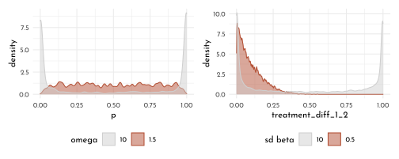
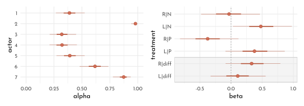
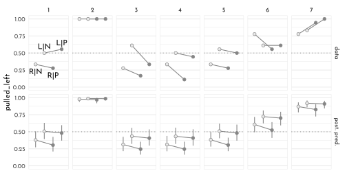
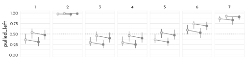
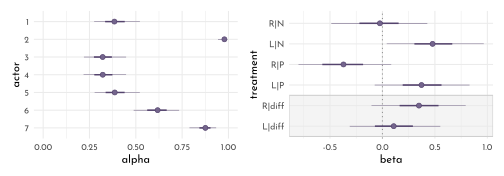
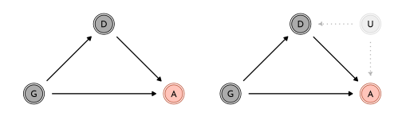
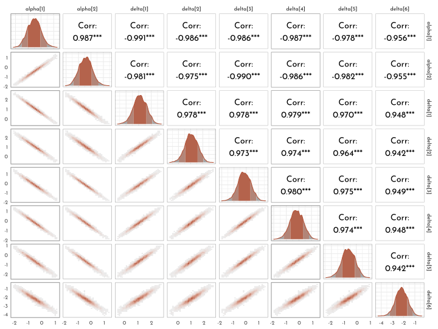
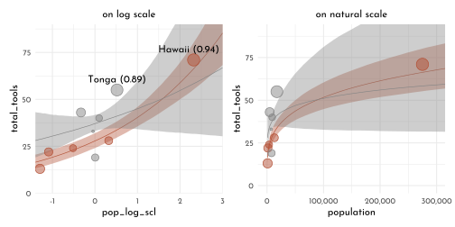
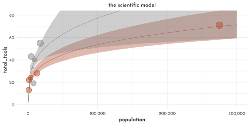

---
output:
  html_document:
  theme: yeti
pdf_document: default
editor_options: 
  chunk_output_type: console
---

# Rethinking: Chapter 11

**God Spiked the Integers**


by [Richard McElreath](https://xcelab.net/rm/statistical-rethinking/), building on the Summaries by [Solomon Kurz](https://bookdown.org/content/4857/).


## Binomial Regression

### Logistic Regression: Prosocial chimpanzees

using a *logit* link function:


```r
library(rethinking)
data(chimpanzees)
```

translating the `prosoc_left` and the `condition` columns into the aggregated column `treatment`:

1. `prosoc_left == 0` and `condition == 0`
2. `prosoc_left == 1` and `condition == 0`
3. `prosoc_left == 0` and `condition == 1`
4. `prosoc_left == 1` and `condition == 1`


```r
data_chimp <- chimpanzees %>% 
  as_tibble() %>% 
  mutate(treatment = 1 + prosoc_left + 2 * condition,
         side_idx = prosoc_left + 1,     # right 1, left 2
         condition_idx = condition + 1)  # no partner 1, partner 2

xtabs(~ treatment + prosoc_left + condition, data_chimp)
```

```
#> , , condition = 0
#> 
#>          prosoc_left
#> treatment   0   1
#>         1 126   0
#>         2   0 126
#>         3   0   0
#>         4   0   0
#> 
#> , , condition = 1
#> 
#>          prosoc_left
#> treatment   0   1
#>         1   0   0
#>         2   0   0
#>         3 126   0
#>         4   0 126
```

$$
\begin{array}{rclr}
L_{i} & \sim & Binomial(1, p_{i}) & \textrm{[likelihood]}\\
\textrm{logit}(p_{i}) & = & \alpha_{ACTOR[i]} + \beta_{TREATMENT[i]} & \textrm{[linear model]}\\
\alpha_{j} & \sim & ... & \textrm{[$\alpha$ prior]}\\
\beta_{k} & \sim & ... & \textrm{[$\beta$ prior]}
\end{array}
$$

$$
Binomial(1, p_{i}) = Bernoulli(p_{i})
$$

Finding the right priors

$$
\begin{array}{rclr}
L_{i} & \sim & Binomial(1, p_{i}) & \textrm{[likelihood]}\\
\textrm{logit}(p_{i}) & = & \alpha & \textrm{[linear model]}\\
\alpha & \sim & Normal(0, \omega) & \textrm{[$\alpha$ prior]}\\
\end{array}
$$

Starting with $\omega = 10$ to demonstrate the effect of flat priors.


```r
model_omega10 <- quap(
  flist = alist(
    pulled_left ~ dbinom( 1, p ),
    logit(p) <-  alpha,
    alpha ~ dnorm( 0, 10 )
  ),
  data = data_chimp
)

model_omega15 <- quap(
  flist = alist(
    pulled_left ~ dbinom( 1, p ),
    logit(p) <-  alpha,
    alpha ~ dnorm( 0, 1.5 )
  ),
  data = data_chimp
)

set.seed(1999)
omega_prior <- extract.prior(model_omega10) %>% 
  as_tibble() %>%
  mutate(omega = 10) %>% 
  bind_rows(extract.prior(model_omega15) %>% 
  as_tibble() %>%
  mutate(omega = 1.5)) %>% 
  mutate(p = inv_logit(alpha))

p1 <- omega_prior %>% 
  ggplot(aes(x = p)) +
  geom_density(adjust = .15,
               aes(color = factor(omega), fill = after_scale(clr_alpha(color)))) +
  scale_color_manual("omega", values = c(`10` = clr0d, `1.5` = clr2)) +
  theme(legend.position = "bottom")
```


```r
model_beta10 <- quap(
  flist = alist(
    pulled_left ~ dbinom( 1, p ),
    logit(p) <-  alpha + beta[treatment],
    alpha ~ dnorm( 0, 1.5 ),
    beta[treatment] ~ dnorm(0,10)
  ),
  data = data_chimp 
)

model_beta05 <- quap(
  flist = alist(
    pulled_left ~ dbinom( 1, p ),
    logit(p) <-  alpha + beta[treatment],
    alpha ~ dnorm( 0, 1.5 ),
    beta[treatment] ~ dnorm(0,0.5)
  ),
  data = data_chimp 
)

extract_logit <- function(model, beta_sd, seed = 42){
  
  set.seed(seed)

  extract.prior(model, n = 1e4) %>% 
  as.data.frame() %>% 
  as_tibble() %>%
  mutate(across(beta.1:beta.4, .fns = function(x){inv_logit(x + alpha)},
                .names = "p_{.col}"),
         beta_sd = beta_sd)
}

data_beta <- list(model_beta10, model_beta05) %>% 
  map2_dfr(.y = c(10, .5),
           .f = extract_logit) %>% 
  mutate(treatment_diff_1_2 = abs(`p_beta.1` - `p_beta.2`))

p2 <- data_beta %>% 
  ggplot(aes(x = treatment_diff_1_2)) +
  geom_density(adjust = .15,
               aes(color = factor(beta_sd), fill = after_scale(clr_alpha(color)))) +
  scale_color_manual("sd beta", values = c(`10` = clr0d, `0.5` = clr2)) +
  theme(legend.position = "bottom")

p1 + p2
```




$$
\begin{array}{rclr}
L_{i} & \sim & Binomial(1, p_{i}) & \textrm{[likelihood]}\\
\textrm{logit}(p_{i}) & = & \alpha_{ACTOR[i]} + \beta_{TREATMENT[i]} & \textrm{[linear model]}\\
\alpha_{j} & \sim & Normal(0, 1.5) & \textrm{[$\alpha$ prior]}\\
\beta_{k} & \sim & Normal(0, 0.5) & \textrm{[$\beta$ prior]}
\end{array}
$$


```r
data_chimp_list <- data_chimp %>% 
  dplyr::select(pulled_left, actor, treatment) %>% 
  mutate(treatment = as.integer(treatment)) %>% 
  as.list()

model_chimp <- ulam(
  flist = alist(
    pulled_left ~ dbinom( 1, p ),
    logit(p) <-  alpha[actor] + beta[treatment],
    alpha[actor] ~ dnorm( 0, 1.5 ),
    beta[treatment] ~ dnorm(0,0.5)
  ),
  data = data_chimp_list,
  chains = 4, cores = 4,
  log_lik = TRUE
)
```


```r
precis(model_chimp, depth = 2) %>% 
  knit_precis()
```


|param    |  mean|   sd|  5.5%| 94.5%|   n_eff| Rhat4|
|:--------|-----:|----:|-----:|-----:|-------:|-----:|
|alpha[1] | -0.46| 0.33| -1.01|  0.07|  734.48|     1|
|alpha[2] |  3.89| 0.76|  2.77|  5.18| 1003.64|     1|
|alpha[3] | -0.76| 0.34| -1.31| -0.24|  759.77|     1|
|alpha[4] | -0.75| 0.35| -1.32| -0.21|  784.36|     1|
|alpha[5] | -0.45| 0.33| -0.98|  0.07|  702.23|     1|
|alpha[6] |  0.47| 0.33| -0.08|  1.00|  694.50|     1|
|alpha[7] |  1.94| 0.43|  1.25|  2.63|  703.21|     1|
|beta[1]  | -0.04| 0.29| -0.48|  0.44|  662.76|     1|
|beta[2]  |  0.48| 0.29|  0.03|  0.95|  612.98|     1|
|beta[3]  | -0.37| 0.29| -0.82|  0.09|  701.51|     1|
|beta[4]  |  0.38| 0.29| -0.09|  0.84|  664.27|     1|

```r
chimp_posterior <- extract.samples(model_chimp) %>% 
  as.data.frame() %>% 
  as_tibble() %>% 
  mutate(across(starts_with("alpha"),.fns = inv_logit, .names = "p_{.col}"))

p1 <- chimp_posterior %>% 
  dplyr::select(starts_with("p")) %>% 
  pivot_longer(everything(),
               names_to = "actor",
               values_to = "p") %>% 
  mutate(actor = str_remove(actor,"p_alpha.") %>% as.integer()) %>% 
  group_by(actor) %>% 
  summarise(p = list(quantile(p, probs = c(.055, .25, .5, .75, .955))),
            breaks = list(c("ll", "l", "m", "h", "hh"))) %>% 
  ungroup() %>% 
  unnest(c(p, breaks)) %>% 
  pivot_wider(names_from = breaks, values_from = p) %>% 
  ggplot(aes(y = factor(actor, levels = 7:1))) +
  geom_linerange(aes(xmin = ll, xmax = hh), lwd = .2, color = clr2) +
  geom_linerange(aes(xmin = l, xmax = h), lwd = .7, color = clr2) +
  geom_point(aes(x = m),
             size = 2, shape = 21,
             color = clr2, fill = clr_lighten(clr2, .2)) +
  labs(y = "actor", x = "alpha") +
  coord_cartesian(xlim = c(0, 1))
```


```r
treatment_labels <- c("R|N", "L|N", "R|P", "L|P", "R|diff", "L|diff")

p2 <- chimp_posterior %>% 
  dplyr::select(starts_with("beta")) %>% 
  mutate(`beta.5` = `beta.1` - `beta.3` ,
         `beta.6` = `beta.2` - `beta.4` ) %>% 
  pivot_longer(everything(),
               names_to = "param",
               values_to = "p") %>% 
  mutate(treatment = treatment_labels[str_remove(param, "beta.") %>% as.integer()]) %>% 
  group_by(treatment) %>% 
  summarise(p = list(quantile(p, probs = c(.055, .25, .5, .75, .955))),
            breaks = list(c("ll", "l", "m", "h", "hh"))) %>% 
  ungroup() %>% 
  unnest(c(p, breaks)) %>% 
  pivot_wider(names_from = breaks, values_from = p) %>% 
  ggplot(aes(y = factor(treatment, levels = rev(treatment_labels)))) +
  geom_rect(data = tibble(x = 1),inherit.aes = FALSE,
            aes(xmin = -Inf, xmax = Inf, ymin = .5, ymax = 2.5),
            color = clr0d, fill = fll0) +
  geom_vline(xintercept = 0, linetype = 3, color = clr_dark) +
  geom_linerange(aes(xmin = ll, xmax = hh), lwd = .2, color = clr2) +
  geom_linerange(aes(xmin = l, xmax = h), lwd = .7, color = clr2) +
  geom_point(aes(x = m),
             size = 2, shape = 21,
             color = clr2, fill = clr_lighten(clr2, .2)) +
  scale_y_discrete() +
  labs(y = "treatment", x = "beta")
```


```r
p1 + p2
```



Posterior prediction plots:


```r
chimp_grid <- crossing(actor = 1:7, treatment = 1:4)

chimp_posterior_predictions <- link(model_chimp, data = chimp_grid) %>% 
  as.matrix() %>% 
  t() %>% 
  as_tibble() %>% 
  bind_cols(chimp_grid, .) %>% 
  pivot_longer(-c(actor, treatment), values_to = "pulled_left") %>% 
  dplyr::select(-name) %>% 
  group_by(actor, treatment) %>% 
  summarise(p = list(quantile(pulled_left, probs = c(.055, .25, .5, .75, .955))),
            breaks = list(c("ll", "l", "m", "h", "hh"))) %>% 
  ungroup() %>% 
  unnest(c(p, breaks)) %>% 
  pivot_wider(names_from = breaks, values_from = p) %>% 
  mutate(type = "post. pred.",
         side = c("L", "R")[2 - (treatment == 1 | treatment == 3)],
         condition = c("N", "P")[1 + (treatment > 2)],
         lab = treatment_labels[treatment])

data_chimp %>% 
  group_by(actor, treatment) %>% 
  summarise(mean_data = mean(pulled_left),
            type = "data") %>% 
  mutate(side = c("L", "R")[2 - (treatment == 1 | treatment == 3)],
         condition = c("N", "P")[1 + (treatment > 2)],
         lab = treatment_labels[treatment]) %>% 
  ggplot(aes(x = treatment, y = mean_data)) +
  geom_hline(yintercept = .5, linetype = 3, color = clr_dark) +
  geom_line(aes(group = side), color = clr0dd) +
  geom_point(aes(shape = condition),
             color = clr0dd, fill = clr0, size = 1.8) +
  geom_text(data = . %>% filter(actor == 1),
            aes(y = mean_data - .2 *  (1.5 - as.numeric(factor(side))),
                label = lab), family = fnt_sel) +
  geom_line(data = chimp_posterior_predictions,
            aes(y = m, group = side), color = clr0dd) +
  geom_segment(data = chimp_posterior_predictions,
               inherit.aes = FALSE,
                  aes(x = treatment, xend = treatment,
                      y = ll, yend = hh),
                  color = clr0dd) +
    geom_point(data = chimp_posterior_predictions,
               inherit.aes = FALSE,
                  aes(x = treatment,
                      y = m, shape = condition),
             color = clr0dd, fill = clr0, size = 1.8) +
  scale_shape_manual(values = c("N" = 21, "P" = 19), guide = "none") +
  facet_grid(type ~ actor) +
  scale_x_discrete(expand = c(.2,.2)) +
  labs(x = NULL, y = "pulled_left") +
  lims(y = c(0,1)) +
  theme(panel.background = element_rect(color = clr0, fill = "transparent"))
```




```r
data_chimp_list2 <- data_chimp %>% 
  dplyr::select(pulled_left,
                actor, 
                side_idx,
                condition_idx)

model_chimp_interaction <- ulam(
  flist = alist(
    pulled_left ~ dbinom( 1, p ),
    logit(p) <-  alpha[actor] + beta_s[side_idx] + beta_c[condition_idx],
    alpha[actor] ~ dnorm( 0, 1.5 ),
    beta_s[side_idx] ~ dnorm(0,0.5),
    beta_c[condition_idx] ~ dnorm(0,0.5)
  ),
  data = data_chimp_list2,
  chains = 4,
  cores = 4,
  log_lik = TRUE
)
```


```r
compare(model_chimp,
        model_chimp_interaction, func = PSIS) %>% 
  knit_precis(param_name = "model")
```


|model                   |   PSIS|    SE| dPSIS|  dSE| pPSIS| weight|
|:-----------------------|------:|-----:|-----:|----:|-----:|------:|
|model_chimp_interaction | 530.71| 19.17|  0.00|   NA|  7.76|   0.66|
|model_chimp             | 532.02| 18.89|  1.31| 1.35|  8.35|   0.34|


```r
chimp_grid2 <- crossing(actor = 1:7, side_idx = 1:2, condition_idx = 1:2)

chimp_interact_posterior_predictions <- link(model_chimp_interaction,
                                             data = chimp_grid2) %>% 
  as.matrix() %>% 
  t() %>% 
  as_tibble() %>% 
  bind_cols(chimp_grid2, .) %>% 
  pivot_longer(-c(actor, side_idx, condition_idx), values_to = "pulled_left") %>% 
  dplyr::select(-name) %>% 
  group_by(actor, side_idx, condition_idx) %>% 
  summarise(p = list(quantile(pulled_left, probs = c(.055, .25, .5, .75, .955))),
            breaks = list(c("ll", "l", "m", "h", "hh"))) %>% 
  ungroup() %>% 
  unnest(c(p, breaks)) %>% 
  pivot_wider(names_from = breaks, values_from = p) %>% 
  mutate(treatment = factor(side_idx + 2 * (condition_idx - 1)))

chimp_interact_posterior_predictions %>% 
  ggplot(aes(x = treatment, y = m)) +
  geom_hline(yintercept = .5, linetype = 3, color = clr_dark) +
  geom_line(aes(y = m, group = factor(side_idx)), color = clr0dd) +
  geom_segment(data = chimp_posterior_predictions,
                  aes(x = treatment, xend = treatment,
                      y = ll, yend = hh),
                  color = clr0dd) +
    geom_point(aes(x = treatment,
                      y = m, shape = factor(condition_idx)),
             color = clr0dd, fill = clr0, size = 1.8) +
  scale_shape_manual(values = c(`1` = 21, `2` = 19), guide = "none") +
  facet_grid(. ~ actor) +
  scale_x_discrete(expand = c(.2,.2)) +
  labs(x = NULL, y = "pulled_left") +
  lims(y = c(0,1)) +
  theme(axis.text.x = element_blank(),
        panel.background = element_rect(color = clr0, fill = "transparent"),
        panel.grid.minor.x = element_blank(),
        panel.grid.major.x = element_blank())
```



Adding log-probability calculations to a Stan model


```r
stan_posterior <- extract.samples(model_chimp, clean = FALSE)
str(stan_posterior)
```

```
#> List of 5
#>  $ alpha  : num [1:2000, 1:7] -0.535 -0.495 -0.276 -0.46 -0.967 ...
#>  $ beta   : num [1:2000, 1:4] -0.2448 -0.4169 0.1607 -0.0796 0.4323 ...
#>  $ log_lik: num [1:2000, 1:504] -0.377 -0.338 -0.637 -0.459 -0.461 ...
#>  $ p      : num [1:2000, 1:504] 0.314 0.287 0.471 0.368 0.369 ...
#>  $ lp__   : num [1:2000(1d)] -265 -272 -266 -267 -271 ...
#>  - attr(*, "source")= chr "ulam posterior: 2000 samples from object"
```

```r
model_chimp_stancode <- stancode(model_chimp)
```

```
#> data{
#>     int pulled_left[504];
#>     int treatment[504];
#>     int actor[504];
#> }
#> parameters{
#>     vector[7] alpha;
#>     vector[4] beta;
#> }
#> model{
#>     vector[504] p;
#>     beta ~ normal( 0 , 0.5 );
#>     alpha ~ normal( 0 , 1.5 );
#>     for ( i in 1:504 ) {
#>         p[i] = alpha[actor[i]] + beta[treatment[i]];
#>         p[i] = inv_logit(p[i]);
#>     }
#>     pulled_left ~ binomial( 1 , p );
#> }
#> generated quantities{
#>     vector[504] log_lik;
#>     vector[504] p;
#>     for ( i in 1:504 ) {
#>         p[i] = alpha[actor[i]] + beta[treatment[i]];
#>         p[i] = inv_logit(p[i]);
#>     }
#>     for ( i in 1:504 ) log_lik[i] = binomial_lpmf( pulled_left[i] | 1 , p[i] );
#> }
```


```r
model_chimp_stan <- stan(model_code = model_chimp_stancode,
  data = data_chimp_list,
  chains = 4, cores = 4)
```


```r
compare(model_chimp,
        model_chimp_stan) %>% 
  knit_precis(param_name = "model")
```


|model            |   WAIC|    SE| dWAIC|  dSE| pWAIC| weight|
|:----------------|------:|-----:|-----:|----:|-----:|------:|
|model_chimp_stan | 531.67| 18.92|   0.0|   NA|  8.21|   0.54|
|model_chimp      | 531.97| 18.87|   0.3| 0.13|  8.32|   0.46|

### Relative Shark and Absolute Deer

Calculating the *proportional odds* relative effect size of switching from treatment two to four (adding a partner):


```r
(prop_odd <- extract.samples(model_chimp) %>%
  as.data.frame() %>% 
  as_tibble() %>% 
  mutate(prop_odds = exp( `beta.4` - `beta.2`)) %>% 
  summarise(average = mean(prop_odds)))
```

```
#> # A tibble: 1 x 1
#>   average
#>     <dbl>
#> 1   0.931
```

So this relates to a 6.88 % change in odds.


### Aggregated binomial: Chimpanzees again, condensed


```r
data_chimp_aggregated <- data_chimp %>% 
  group_by(treatment, actor, side_idx, condition_idx) %>% 
  summarise(left_pulls = sum(pulled_left))  %>% 
  ungroup() %>% 
  mutate(across(everything(), .fns = `as.integer`))
```


```r
model_chimp_aggregated <- ulam(
  flist = alist(
    left_pulls ~ dbinom( 18 , p ),
    logit(p) <- alpha[actor] + beta[treatment],
    alpha[actor] ~ dnorm(0, 1.5),
    beta[treatment] ~ dnorm(0, 0.5)
  ),
  data = data_chimp_aggregated,
  chains = 4,
  cores = 4,
  log_lik = TRUE
)
```


```r
precis(model_chimp_aggregated, depth = 2) %>% 
  knit_precis(param_name = "model")
```


|model    |  mean|   sd|  5.5%| 94.5%|   n_eff| Rhat4|
|:--------|-----:|----:|-----:|-----:|-------:|-----:|
|alpha[1] | -0.46| 0.32| -0.97|  0.07|  795.24|  1.01|
|alpha[2] |  3.87| 0.72|  2.82|  5.10| 1070.21|  1.00|
|alpha[3] | -0.75| 0.33| -1.27| -0.24|  736.57|  1.01|
|alpha[4] | -0.75| 0.33| -1.28| -0.24|  741.50|  1.01|
|alpha[5] | -0.46| 0.32| -0.96|  0.05|  764.71|  1.00|
|alpha[6] |  0.47| 0.33| -0.05|  0.98|  831.35|  1.00|
|alpha[7] |  1.96| 0.41|  1.32|  2.62| 1041.00|  1.01|
|beta[1]  | -0.03| 0.28| -0.49|  0.39|  657.78|  1.01|
|beta[2]  |  0.48| 0.27|  0.04|  0.94|  585.93|  1.01|
|beta[3]  | -0.38| 0.28| -0.80|  0.06|  719.18|  1.01|
|beta[4]  |  0.38| 0.27| -0.07|  0.81|  683.31|  1.00|

```r
clr_current <- clr1
chimp_posterior_aggregated <- extract.samples(model_chimp_aggregated) %>% 
  as.data.frame() %>% 
  as_tibble() %>% 
  mutate(across(starts_with("alpha"),.fns = inv_logit, .names = "p_{.col}"))

p1 <- chimp_posterior_aggregated %>% 
  dplyr::select(starts_with("p")) %>% 
  pivot_longer(everything(),
               names_to = "actor",
               values_to = "p") %>% 
  mutate(actor = str_remove(actor,"p_alpha.") %>% as.integer()) %>% 
  group_by(actor) %>% 
  summarise(p = list(quantile(p, probs = c(.055, .25, .5, .75, .955))),
            breaks = list(c("ll", "l", "m", "h", "hh"))) %>% 
  ungroup() %>% 
  unnest(c(p, breaks)) %>% 
  pivot_wider(names_from = breaks, values_from = p) %>% 
  ggplot(aes(y = factor(actor, levels = 7:1))) +
  geom_linerange(aes(xmin = ll, xmax = hh), lwd = .2, color = clr_current) +
  geom_linerange(aes(xmin = l, xmax = h), lwd = .7, color = clr_current) +
  geom_point(aes(x = m),
             size = 2, shape = 21,
             color = clr_current, fill = clr_lighten(clr_current, .2)) +
  labs(y = "actor", x = "alpha") +
  coord_cartesian(xlim = c(0, 1))
```


```r
p2 <- chimp_posterior_aggregated %>% 
  dplyr::select(starts_with("beta")) %>% 
  mutate(`beta.5` = `beta.1` - `beta.3` ,
         `beta.6` = `beta.2` - `beta.4` ) %>% 
  pivot_longer(everything(),
               names_to = "param",
               values_to = "p") %>% 
  mutate(treatment = treatment_labels[str_remove(param, "beta.") %>% as.integer()]) %>% 
  group_by(treatment) %>% 
  summarise(p = list(quantile(p, probs = c(.055, .25, .5, .75, .955))),
            breaks = list(c("ll", "l", "m", "h", "hh"))) %>% 
  ungroup() %>% 
  unnest(c(p, breaks)) %>% 
  pivot_wider(names_from = breaks, values_from = p) %>% 
  ggplot(aes(y = factor(treatment, levels = rev(treatment_labels)))) +
  geom_rect(data = tibble(x = 1), inherit.aes = FALSE,
            aes(xmin = -Inf, xmax = Inf, ymin = .5, ymax = 2.5),
            color = clr0d, fill = fll0) +
  geom_vline(xintercept = 0, linetype = 3, color = clr_dark) +
  geom_linerange(aes(xmin = ll, xmax = hh), lwd = .2, color = clr_current) +
  geom_linerange(aes(xmin = l, xmax = h), lwd = .7, color = clr_current) +
  geom_point(aes(x = m),
             size = 2, shape = 21,
             color = clr_current, fill = clr_lighten(clr_current, .2)) +
  scale_y_discrete() +
  labs(y = "treatment", x = "beta")
```


```r
p1 + p2
```




```r
compare(model_chimp,
        model_chimp_aggregated,
        func = PSIS) %>% 
  knit_precis(param_name = "model")
```


|model                  |   PSIS|    SE|  dPSIS|   dSE| pPSIS| weight|
|:----------------------|------:|-----:|------:|-----:|-----:|------:|
|model_chimp_aggregated | 113.92|  8.40|   0.00|    NA|  8.25|      1|
|model_chimp            | 532.02| 18.89| 418.11| 39.99|  8.35|      0|

The huge difference in `PSIS` are due to the way the data is organized, which makes the *multiplicity* effect the aggregate model (eg. all they ways 6 successes in 9 trials can be arranged).


```r
#> deviance of aggregated 6 in 9
-2 * dbinom(x = 6 , size = 9, prob = .2, log = TRUE)
```

```
#> [1] 11.79048
```

```r
#> deviance of dis-aggregated
-2 * sum( dbern(x = rep(1:0, c(6, 3)), prob = .2, log = TRUE) )
```

```
#> [1] 20.65212
```

```
Some Pareto k values are high (>0.5). Set pointwise=TRUE to inspect individual points.

.

Warning messages:
1: In compare(model_chimp, model_chimp_aggregated, func = PSIS) :
  Different numbers of observations found for at least two models.
Model comparison is valid only for models fit to exactly the same observations.
Number of observations for each model:
model_chimp 504 
model_chimp_aggregated 28 
```

:::beware
The high Pareto k values result from the fact that the aggregation turns the *leave one out* procedure into a *leave 18 out* procedure here.

> *If you want to calculate WAIC or PSIS, you should use a logistic regression data format, not an aggregated format.*

:::

### Aggregated binomial: Graduate School Admissions


```r
data(UCBadmit) 
data_ucb <- UCBadmit %>% 
  as_tibble() %>% 
  mutate(gid = 3L - as.integer(factor(applicant.gender)))
```

$$
\begin{array}{rclr}
A_{i} & \sim & Binomial(N_{i}, p_{i}) & \textrm{[likelihood]}\\
\textrm{logit}(p_{i}) & = & \alpha_{GID[i]} & \textrm{[linear model]}\\
\alpha_{j} & \sim & Normal(0, 1.5) & \textrm{[$\alpha$ prior]}\\
\end{array}
$$


```r
data_ucb_list <- data_ucb %>% 
  dplyr::select(admit, applications,  gid) %>% 
  as.list()

model_ucb <- ulam(
  flist = alist(
    admit ~ dbinom( applications, p ),
    logit(p) <- alpha[gid],
    alpha[gid] ~ dnorm( 0, 1.5 )
  ),
  data = data_ucb_list,
  chains = 4,
  cores = 4,
  log_lik = TRUE
)
```


```r
precis(model_ucb, depth = 2) %>% 
  knit_precis()
```


|param    |  mean|   sd|  5.5%| 94.5%|   n_eff| Rhat4|
|:--------|-----:|----:|-----:|-----:|-------:|-----:|
|alpha[1] | -0.22| 0.04| -0.28| -0.16| 1509.90|     1|
|alpha[2] | -0.83| 0.05| -0.91| -0.75| 1477.76|     1|

Calculating a contrast to quantify the difference in the posterior between ♀️ and ♂️ applicants.


```r
posterior_usb <- extract.samples(model_ucb) %>% 
  as.data.frame() %>% 
  as_tibble() %>% 
  mutate(diff_absolute = `alpha.1` - `alpha.2`,
         diff_relative = inv_logit(`alpha.1`) - inv_logit(`alpha.2`))

clr_current <- clr2
precis(posterior_usb) %>% 
  knit_precis()
```


|param         |  mean|   sd|  5.5%| 94.5%|histogram     |
|:-------------|-----:|----:|-----:|-----:|:-------------|
|alpha.1       | -0.22| 0.04| -0.28| -0.16|▁▁▂▃▇▇▇▅▃▁▁▁▁ |
|alpha.2       | -0.83| 0.05| -0.91| -0.75|▁▁▁▅▇▃▁▁▁     |
|diff_absolute |  0.61| 0.06|  0.51|  0.71|▁▁▁▂▇▇▅▁▁▁    |
|diff_relative |  0.14| 0.01|  0.12|  0.16|▁▁▁▁▃▇▇▅▂▁▁▁  |

Notice the discrepancy, between <span style="color:#B35136">the model</span> and <span style="color:#858585FF">the data</span>: the model expects ♀️ applicants to do 14% worse than ♂️, however that is only the case in two departments (C and E).


```r
ucb_grid <- crossing(dept = factor(LETTERS[1:6]),
                     gid = 1:2) %>% 
  left_join(data_ucb %>% dplyr::select(dept, gid, applications))

ucb_posterior_predictions <- sim(model_ucb,
                                  data = ucb_grid) %>% 
  as.matrix() %>% 
  t() %>% 
  as_tibble() %>% 
  bind_cols(ucb_grid, .) %>% 
  pivot_longer(-c(dept, gid, applications), values_to = "admit") %>% 
  dplyr::select(-name) %>% 
  group_by(dept, gid, applications) %>% 
  summarise(p = quantile(admit/applications, probs = c(.055, .25, .5, .75, .955)),
            median = median(admit),
            breaks = c("ll", "l", "m", "h", "hh")) %>% 
  ungroup()  %>% 
  pivot_wider(names_from = breaks, values_from = p) %>% 
  mutate(type = "post. pred.",
         x = 2 * (as.integer(as.factor(dept)) - 1) + gid)

library(geomtextpath)
data_ucb %>% 
  group_by(dept, gid) %>% 
  summarise(mean_data = mean(admit/applications),
            type = "data") %>% 
  mutate(x = 2 * (as.integer(dept) - 1) + gid) %>% 
  ggplot(aes(x = x, y = mean_data)) +
  geom_segment(data = ucb_posterior_predictions,
               aes(x = x, xend = x,
                   y = ll, yend = hh),
               color = clr_current) +
  geom_point(data = ucb_posterior_predictions,
             aes(y = m, shape = factor(gid)),
             color = clr_current,
             fill = clr_lighten(clr_current),
             size = 1.8) +
  geom_textline(aes(label = dept, group = dept),
                color = clr0dd, family = fnt_sel) +
  geom_point(aes(shape = factor(gid)),
             color = clr0dd, fill = clr0, size = 1.8) +
  
  scale_shape_manual(values = c(`2` = 21, `1` = 19),
                     guide = "none") +
  scale_x_continuous(breaks = 2 * (1:6) - .5,
                     labels = LETTERS[1:6])+
  labs(x = "department", y = "admit") +
  lims(y = c(0,1)) +
  theme(panel.background = element_rect(color = clr0,
                                        fill = "transparent"), 
        panel.grid.major.x = element_blank())
```


$$
\begin{array}{rclr}
A_{i} & \sim & Binomial(N_{i}, p_{i}) & \textrm{[likelihood]}\\
\textrm{logit}(p_{i}) & = & \alpha_{GID[i]} + \delta_{DEPT[i]}& \textrm{[linear model]}\\
\alpha_{j} & \sim & Normal(0, 1.5) & \textrm{[$\alpha$ prior]}\\
\delta_{k} & \sim & Normal(0, 1.5) & \textrm{[$\delta$ prior]}\\
\end{array}
$$


```r
data_ucb_list2 <- data_ucb %>% 
  mutate(dept_idx = as.numeric(dept)) %>% 
  dplyr::select(dept_idx, admit, applications,  gid) %>% 
  as.list()

model_ucb_dept <- ulam(
  flist = alist(
    admit ~ dbinom( applications, p ),
    logit(p) <- alpha[gid] + delta[dept_idx],
    alpha[gid] ~ dnorm( 0, 1.5 ),
    delta[dept_idx] ~ dnorm( 0, 1.5 )
  ),
  data = data_ucb_list2,
  iter = 4000,
  chains = 4,
  cores = 4,
  log_lik = TRUE
)
```


```r
precis(model_ucb_dept, depth = 2) %>% 
  knit_precis()
```


|param    |  mean|   sd|  5.5%| 94.5%|  n_eff| Rhat4|
|:--------|-----:|----:|-----:|-----:|------:|-----:|
|alpha[1] | -0.53| 0.51| -1.36|  0.30| 735.71|  1.00|
|alpha[2] | -0.43| 0.52| -1.27|  0.39| 733.86|  1.01|
|delta[1] |  1.11| 0.52|  0.28|  1.94| 742.15|  1.00|
|delta[2] |  1.06| 0.52|  0.23|  1.90| 744.28|  1.01|
|delta[3] | -0.15| 0.52| -0.99|  0.69| 736.76|  1.01|
|delta[4] | -0.18| 0.52| -1.02|  0.65| 734.53|  1.01|
|delta[5] | -0.63| 0.52| -1.47|  0.21| 748.80|  1.01|
|delta[6] | -2.18| 0.53| -3.04| -1.32| 772.62|  1.01|


```r
posterior_usb_dept <- extract.samples(model_ucb_dept) %>% 
  as.data.frame() %>% 
  as_tibble() %>% 
  mutate(diff_absolute = `alpha.1` - `alpha.2`,
         diff_relative = inv_logit(`alpha.1`) - inv_logit(`alpha.2`))

precis(posterior_usb_dept %>% dplyr::select(starts_with("diff"))) %>% 
  knit_precis(param_name = "column")
```


|column        |  mean|   sd|  5.5%| 94.5%|histogram       |
|:-------------|-----:|----:|-----:|-----:|:---------------|
|diff_absolute | -0.10| 0.08| -0.23|  0.03|▁▁▁▂▅▇▇▅▂▁▁▁▁   |
|diff_relative | -0.02| 0.02| -0.05|  0.01|▁▁▁▁▂▃▅▇▇▅▂▁▁▁▁ |

Now, ♂️ applicants seem to have minimal worse chances than ♀️ applicants (~2%).

> Why did adding departments to the model change inference about the gender so much?


```r
data_ucb %>% 
  group_by(dept) %>% 
  mutate(all_n = sum(applications)) %>% 
  ungroup() %>% 
  mutate(fraction = round(applications / all_n, digits = 2)) %>% 
  dplyr::select(dept, applicant.gender, fraction) %>% 
  pivot_wider(names_from = dept, values_from = fraction)
```

```
#> # A tibble: 2 x 7
#>   applicant.gender     A     B     C     D     E     F
#>   <fct>            <dbl> <dbl> <dbl> <dbl> <dbl> <dbl>
#> 1 male              0.88  0.96  0.35  0.53  0.33  0.52
#> 2 female            0.12  0.04  0.65  0.47  0.67  0.48
```

There is a causal path $G \rightarrow D \rightarrow A$ which is closed by conditioning on $D$ (this is an example of a **mediation analysis**).
However issues arise if there is an unobserved confound $U$.


```r
dag_ucb <- dagify(
  A ~ D + G,
  D ~ G,
  exposure = "A",
  outcome = "G",
  coords = tibble(name = c("G", "D", "A"),
                  x = c(0, .5, 1),
                  y = c(0, 1, 0)))

dag_ucb_u <- dagify(
  A ~ D + G + U,
  D ~ G + U,
  exposure = "A",
  outcome = "G",
  coords = tibble(name = c("G", "D", "A", "U"),
                  x = c(0, .5, 1, 1),
                  y = c(0, 1, 0, 1)))

p1 <- dag_ucb %>%
  fortify() %>% 
  mutate(stage = if_else(name == "A", "response",
                         if_else(name %in% c("G", "D"),
                                 "predictor", "confounds"))) %>% 
  plot_dag(clr_in = clr_current) 

p2 <- dag_ucb_u %>%
  fortify() %>% 
  mutate(stage = if_else(name == "A", "response",
                         if_else(name %in% c("G", "D"),
                                 "predictor", "confounds"))) %>% 
  plot_dag(clr_in = clr_current) 

p1 + p2 &
  coord_fixed(ratio = .5) &
  scale_y_continuous(limits = c(-.1, 1.1)) &
  scale_x_continuous(limits = c(-.1, 1.1)) &
  theme(plot.title = element_text(hjust = .5, family = fnt_sel),
        plot.tag = element_text(family = fnt_sel))
```




```r
as_draws_df(model_ucb_dept@stanfit) %>% 
  as_tibble() %>% 
  dplyr::select(starts_with("alpha"), 
                starts_with("delta")) %>% 
  ggpairs(
     lower = list(continuous = wrap(my_lower)),
        diag = list(continuous = wrap(my_diag, fill = fll0,
                                      color = clr0d, adjust = .7)),
        upper = list(continuous = wrap(my_upper ,
          size = 5, color = "black", family = "Josefin sans")) ) +
    theme(panel.border = element_rect(color = clr_dark, fill = "transparent"))
```



## Poisson Regression


```r
y <- rbinom( 1e5, 1000, 1/1000)
c(mean(y), var(y))
```

```
#> [1] 0.9969100 0.9949704
```

Models build upon the poisson distribution (for uncountable, or uncoutably large number of trials $N$), are even simpler than binomial or Gaussian model, because there is only a single parameter that describes its shape:

$$
y_{i} \sim
$$


The conventional link function for a Poisson Model is the log link:

$$
\begin{array}{rclr}
y_{i} & \sim & Poisson(\lambda_{i}) & \textrm{[likelihood]}\\
\textrm{log}(\lambda_{i}) & = & \alpha + \beta(x_{i} - \bar{x}) & \textrm{[linear model]}
\end{array}
$$

### Oceanic Tool Complexity


```r
library(sf)
data(Kline)

data_kline <- Kline %>% 
  as_tibble() %>% 
  mutate(pop_log_scl = scale(log(population))[,1],
         condact_idx = 3L - as.integer(factor(contact)))

data_kline_sf <- read_sf("data/pacific.gpkg") %>% 
  left_join(Kline) %>%
  mutate(coords = st_centroid(geom) %>% st_coordinates() %>% as_tibble() ) %>%
  mutate(x = coords$X,
         y = coords$Y) %>% 
  dplyr::select(-coords)
```


```r
library(rnaturalearth)
crs_pac <- 3832
long_lim <- c(100,-140)
lat_lim <- c(-25, 25)
bb <- tibble(x = long_lim[c(1,1,2,2,1)],
       y = lat_lim[c(1,2,2,1,1)]) %>% 
  st_as_sf(coords = c("x","y"), crs = 4326) %>% 
  st_transform(crs = crs_pac) %>% 
  st_combine() %>% 
  st_cast("POLYGON") 

dateline <- tibble(x = c(180,180),
       y = lat_lim) %>% 
  st_as_sf(coords = c("x","y"), crs = 4326) %>% 
  st_transform(crs = crs_pac) %>% 
  st_combine() %>% 
  st_cast("LINESTRING")

equator <- tibble(x = long_lim,
       y = c(0, 0)) %>% 
  st_as_sf(coords = c("x","y"), crs = 4326) %>% 
  st_transform(crs = crs_pac) %>% 
  st_combine() %>% 
  st_cast("LINESTRING")

coast <- read_sf("~/work/geo_store/natural_earth/ne_110m_land.shp") %>%
  st_transform(crs = crs_pac) %>%
  st_intersection(bb)

library(raster)
library(ggspatial)
# library(marmap)
# bat_l <- marmap::getNOAA.bathy(long_lim[1], 180,
#                                lat_lim[1], lat_lim[2], resolution = 5)
# 
# bat_r <- marmap::getNOAA.bathy(-180, long_lim[2],
#                                lat_lim[1], lat_lim[2], resolution = 5)
# 
# bat_l_proj <- projectRaster(marmap::as.raster(bat_l), crs = crs(bb))
# bat_r_proj <- projectRaster(marmap::as.raster(bat_r), crs = crs(bb))
# bat <- mosaic(bat_l_proj, bat_r_proj,tolerance = 0.1, fun = mean)

bat <- raster("data/pacific.tif") %>%
  raster::crop(y = as_Spatial(bb)) %>%
  raster::mask(mask = as_Spatial(bb))

ggplot() +
  geom_raster(data = df_spatial(bat),
              aes(x = x, y = y, fill = band1)) +
  geom_sf(data = bb, fill = "transparent", color = clr0d) +
  geom_sf(data = dateline, size = .3, linetype = 3, color = clr_dark) +
  geom_sf(data = equator, size = .3, linetype = 3, color = clr_dark) +
  geom_sf(data = coast, color = clr0dd, fill = clr0, size = .2) +
  geom_sf(data = data_kline_sf,
          color = clr_current,
          fill = clr_lighten(clr_current),
          size = .4) +
  ggrepel::geom_text_repel(data = data_kline_sf,
                           aes(x = x,
                               y = y,
                               label = culture),
                           family = fnt_sel) +
  annotation_north_arrow(style = north_arrow_fancy_orienteering(text_family = fnt_sel)) +
  annotation_scale(style = "ticks", text_family = fnt_sel) +
  scale_fill_gradientn(colours = c("white", "black") %>% 
                         clr_lighten(.35),
                       guide = "none") +
  coord_sf(crs = crs_pac, expand = 0) +
  theme(panel.grid = element_blank(),
        axis.title = element_blank())
```


```r
data_kline
```

```
#> # A tibble: 10 x 7
#>    culture    population contact total_tools mean_TU pop_log_scl condact_idx
#>    <fct>           <int> <fct>         <int>   <dbl>       <dbl>       <int>
#>  1 Malekula         1100 low              13     3.2    -1.29              1
#>  2 Tikopia          1500 low              22     4.7    -1.09              1
#>  3 Santa Cruz       3600 low              24     4      -0.516             1
#>  4 Yap              4791 high             43     5      -0.329             2
#>  5 Lau Fiji         7400 high             33     5      -0.0443            2
#>  6 Trobriand        8000 high             19     4       0.00667           2
#>  7 Chuuk            9200 high             40     3.8     0.0981            2
#>  8 Manus           13000 low              28     6.6     0.324             1
#>  9 Tonga           17500 high             55     5.4     0.519             2
#> 10 Hawaii         275000 low              71     6.6     2.32              1
```

modeling the idea that:

- the number of tools increases with the log `population` size
- the number of tools increases with the `contact` rate among islands
- the impact of `population` on tool counts is moderated by high `contact` (looking for a positive interaction)

$$
\begin{array}{rclr}
T_{i} & \sim & Poisson(\lambda_{i}) & \textrm{[likelihood]}\\
\textrm{log}(\lambda_{i}) & = & \alpha_{CID[i]} + \beta_{CID[i]}~\textrm{log}~P_{i}& \textrm{[linear model]}\\
\alpha_{j}& \sim & ... & \textrm{[$\alpha$ prior]}\\
\beta_{j}& \sim & ... & \textrm{[$\beta$ prior]}\\
\end{array}
$$

Prior considerations (first for $\alpha$):

$$
\begin{array}{rclr}
T_{i} & \sim & Poisson(\lambda_{i}) & \textrm{[likelihood]}\\
\textrm{log}(\lambda_{i}) & = & \alpha & \textrm{[linear model]}\\
\alpha& \sim & Normal( 0, 10 ) & \textrm{[$\alpha$ prior]}\\
\end{array}
$$


```r
ggplot() +
    stat_function(fun = function(x){dlnorm(x, 3, .5)},
                xlim = c(0, 100), n = 201,
                geom = "area", color = clr_current, fill = fll_current())+
  stat_function(fun = function(x){dlnorm(x, 0, 10)},
                xlim = c(0, 100), n = 201,
                geom = "area", color = clr0d, fill = fll0) +
  geom_richtext(data = tibble(x = c(12.5, 37.5),
                              y = c(.065, .035),
                              lab = c(glue("*{mth('\U03B1')}* {mth('\U007E')} dnorm(0, 10)"),
                                      glue("*{mth('\U03B1')}* {mth('\U007E')} dnorm(3, 0.5)")),
                              prior = c("wide", "narrow")),
                aes(x = x, y = y, color = prior, label = lab ),
                hjust = -.05, size = 5,
                fill = NA, label.color = NA, 
                label.padding = grid::unit(rep(0, 4), "pt"),
                family = fnt_sel) +
  scale_color_manual(values = c(narrow = clr_current, wide = clr0dd),
                     guide = "none") +
  labs(x = "mean number of tools", y = "density")
```


Mean of the <span style="color:#858585FF">narrow curve</span> ($exp(\mu + \sigma^2 / 2)$):


```r
alpha <- rnorm(1e4, 0, 10)
lambda <- exp(alpha)
mean(lambda)
```

```
#> [1] 7.778822e+13
```


```r
tibble(prior = c( "wide", "narrow"),
       mean = c(exp(0 + 10 ^2 /2),
                exp(3 + .5 ^2 /2)))
```

```
#> # A tibble: 2 x 2
#>   prior     mean
#>   <chr>    <dbl>
#> 1 wide   5.18e21
#> 2 narrow 2.28e 1
```


```r
mean_weight <- function(mu, sigma){exp(mu + sigma ^2 /2)}

(prior_tab <- crossing(mu = c(0, 1.5, 3, 4),
         sigma = c(5, 1, .5, .1)) %>% 
  mutate(RN = row_number(),
         mean = map2_dbl(mu, sigma, mean_weight)) )
```

```
#> # A tibble: 16 x 4
#>       mu sigma    RN        mean
#>    <dbl> <dbl> <int>       <dbl>
#>  1   0     0.1     1        1.01
#>  2   0     0.5     2        1.13
#>  3   0     1       3        1.65
#>  4   0     5       4   268337.  
#>  5   1.5   0.1     5        4.50
#>  6   1.5   0.5     6        5.08
#>  7   1.5   1       7        7.39
#>  8   1.5   5       8  1202604.  
#>  9   3     0.1     9       20.2 
#> 10   3     0.5    10       22.8 
#> 11   3     1      11       33.1 
#> 12   3     5      12  5389698.  
#> 13   4     0.1    13       54.9 
#> 14   4     0.5    14       61.9 
#> 15   4     1      15       90.0 
#> 16   4     5      16 14650719.
```

```r
ggplot() +
  (pmap(prior_tab, .f = function(mu, sigma,...){
    force(mu)
    force(sigma)
    return(geom_function(data = tibble(#x = 0:150,
                                       mu = mu),
                  fun = function(x, mu, sigma,...){
                  dlnorm(x, mu, sigma)},
                  aes(color = factor(mu)), 
                  xlim = c(0, 150),
                  n = 201,
                args = list(mu = mu, sigma = sigma)))
  }))  +
  facet_wrap(mu ~ ., scales = "free_y", labeller = label_both) +
  scale_color_manual(values = c(`0` = clr0d, `1.5` = clr1, `3` = clr2, `4` = clr3),
                     guide = "none") +
  labs(x = "mean number of tools", y = "density")
```


Now for the $\beta$ prior:


```r
n <- 100
label_strp <- function(prior){glue("beta {mth('\U007E')} Normal({str_remove(prior,'b')})")}

tibble(idx = 1:n,
       a = rnorm(n, mean = 3, sd = 0.5)) %>% 
  mutate(`b0, 10`  = rnorm(n, mean = 0 , sd = 10),
         `b0, 0.2` = rnorm(n, mean = 0 , sd = 0.2)) %>% 
  pivot_longer(contains("b"),
               values_to = "b",
               names_to = "prior") %>% 
  mutate(prior = label_strp(prior),
         prior = factor(prior, levels = label_strp(c("b0, 10", "b0, 0.2"))) ) %>% 
  expand(nesting(idx, a, b, prior),
         x = seq(from = -2, to = 2, length.out = 100)) %>% 
  ggplot(aes(x = x, y = exp(a + b * x), group = idx)) +
  geom_line(size = .2, color = clr_alpha(clr_current, .25)) +
  labs(x = "log population (std)",
       y = "total tools") +
  coord_cartesian(ylim = c(0, 100)) +
  facet_wrap(~ prior) +
  theme(strip.text = element_markdown())
```


```r
prior <- tibble(idx = 1:n,
                a = rnorm(n, mean = 3, sd = 0.5),
                b = rnorm(n, mean = 0, sd = 0.2)) %>% 
  expand(nesting(idx, a, b),
         x = seq(from = log(100), to = log(200000),
                 length.out = 100))

p1 <- prior %>% 
  ggplot(aes(x = x, y = exp(a + b * x), group = idx)) +
  geom_line(size = .2, color = clr_alpha(clr_current, .25)) +
  geom_hline(yintercept = 100, linetype = 3, size = .6, 
             color = clr_dark) +
  labs(subtitle = glue("alpha {mth('\U007E')} Normal(3, 0.5); beta {mth('\U007E')} Normal(0, 0.2)"),
       x = "log population",
       y = "total tools") +
  coord_cartesian(xlim = c(log(100), log(200000)),
                  ylim = c(0, 500))

p2 <- prior %>% 
  ggplot(aes(x = exp(x), y = exp(a + b * x), group = idx)) +
  geom_line(size = .2, color = clr_alpha(clr_current, .4)) +
  geom_hline(yintercept = 100, linetype = 3, size = .6, 
             color = clr_dark) +
  labs(subtitle = glue("alpha {mth('\U007E')} Normal(3, 0.5); beta {mth('\U007E')} Normal(0, 0.2)"),
       x = "population",
       y = "total tools") +
  coord_cartesian(xlim = c(100, 200000),
                  ylim = c(0, 500))

p1 + p2 & theme(plot.subtitle = element_markdown(size = 8, hjust = .5))
```


Using a log link function, induces diminishing returns due to establishing a log-linear relationship.

Finally, we can create the model(s) - one with *interaction* and one simpler one that is *intercept-only*.


```r
data_kline_list <- data_kline %>% 
  dplyr::select(total_tools,
                pop_log_scl,
                condact_idx) %>% 
  as.list()

#> intercept only
model_ocean_intercept <- ulam(
  flist = alist(
    total_tools ~ dpois(lambda),
    log(lambda) <- alpha,
    alpha ~ dnorm(3, 0.5)
  ),
  data = data_kline_list,
  chains = 4,
  cores = 4,
  log_lik = TRUE
)

#> interaction model
model_ocean_interact <- ulam(
  flist = alist(
    total_tools ~ dpois(lambda),
    log(lambda) <- alpha[condact_idx] + beta[condact_idx] * pop_log_scl,
    alpha[condact_idx] ~ dnorm(3, 0.5),
    beta[condact_idx] ~ dnorm(0, 0.2)
  ),
  data = data_kline_list,
  chains = 4,
  cores = 4,
  log_lik = TRUE
)
```


```r
compare(model_ocean_intercept,
        model_ocean_interact,
        func = PSIS) %>% 
  knit_precis(param_name = "model")
```


|model                 |   PSIS|    SE| dPSIS|   dSE| pPSIS| weight|
|:---------------------|------:|-----:|-----:|-----:|-----:|------:|
|model_ocean_interact  |  84.62| 13.05|  0.00|    NA|  6.60|      1|
|model_ocean_intercept | 143.47| 34.71| 58.85| 33.98|  9.67|      0|

```r
#> Some Pareto k values are high (>0.5). Set pointwise=TRUE to inspect individual points.
#> Some Pareto k values are high (>0.5). Set pointwise=TRUE to inspect individual points.
```

The *effective number of parameters* (`pPSIS` / `pWAIC`) is actually larger for the model with fewer parameters (`model_ocean_intercept`) 😲.

$\rightarrow$ the clear relationship of overfitting and the number of parameters only holds for simple linear regressions with flat priors!

Checking the influential points (with high `Pareto k values`) through **posterior prediction plots**: 


```r
ocean_k_values <- PSIS(model_ocean_interact, pointwise = TRUE) %>% 
  bind_cols(data_kline, .)

n <- 101
ocean_grid <- crossing(pop_log_scl = seq(-1.4, 3, length.out = n),
                        condact_idx = 1:2)

ocean_posterior_predictions <- link(model_ocean_interact,
                                             data = ocean_grid) %>% 
  as.matrix() %>% 
  t() %>% 
  as_tibble() %>% 
  bind_cols(ocean_grid, .) %>% 
  pivot_longer(-c(pop_log_scl, condact_idx), values_to = "total_tools") %>% 
  dplyr::select(-name) %>% 
  group_by(pop_log_scl, condact_idx) %>% 
  summarise(p = list(quantile(total_tools, probs = c(.055, .25, .5, .75, .955))),
            breaks = list(c("ll", "l", "m", "h", "hh"))) %>% 
  ungroup() %>% 
  unnest(c(p, breaks)) %>% 
  pivot_wider(names_from = breaks, values_from = p)  %>%
  mutate(population = exp((pop_log_scl *
                             sd(log(data_kline$population))) +
                            mean(log(data_kline$population))))

p1 <- ocean_posterior_predictions %>% 
  ggplot(aes(x = pop_log_scl, y = total_tools)) +
  geom_smooth(aes(ymin = ll, y = m, ymax = hh,
                  group = factor(condact_idx),
                  color = factor(condact_idx),
                  fill = after_scale(clr_alpha(color))),
              stat = "identity", size = .3) +
  geom_point(data = ocean_k_values,
             aes(color = factor(condact_idx),
                  fill = after_scale(clr_alpha(color)),
                 size = k),
             shape = 21) +
  ggrepel::geom_text_repel(data = ocean_k_values %>% filter(k > .5),
             aes(label = str_c(culture, " (", round(k, digits = 2), ")")),
             family = fnt_sel,nudge_y = 6, min.segment.length = 15) +
  scale_color_manual(values = c(`1` = clr_current, `2` = clr0dd), guide = "none") +
  scale_size_continuous(guide = "none")+
  coord_cartesian(ylim = c(0, 90), x = c(-1.4, 3), expand = 0) +
  labs(subtitle = "on log scale")

p2 <- ocean_posterior_predictions %>% 
  ggplot(aes(x = population, y = total_tools)) +
  geom_smooth(aes(ymin = ll, y = m, ymax = hh,
                  group = factor(condact_idx),
                  color = factor(condact_idx),
                  fill = after_scale(clr_alpha(color))),
              stat = "identity", size = .3) +
  geom_point(data = ocean_k_values,
             aes(color = factor(condact_idx),
                  fill = after_scale(clr_alpha(color)),
                 size = k),
             shape = 21) +
  scale_color_manual(values = c(`1` = clr_current, `2` = clr0dd), guide = "none") +
  scale_size_continuous(guide = "none") +
  scale_x_continuous(breaks = 1e5 * (0:3), labels = scales::comma) +
  coord_cartesian(ylim = c(0, 90),
                  x = c(-1e3, 3e5),
                  expand = 1) +
  labs(subtitle = "on natural scale")

p1 + p2 &
  theme(plot.subtitle = element_text(hjust = .5))
```



Notice how the posterior predictions expect fewer tools for <span style="color:#858585FF">well connected cultures</span> compared to  <span style="color:#B35136">less connected</span> ones at high population sizes (after the mean lines cross).

This asks for a better model that incorporates scientific knowledge (eg. forcing the model to go through the origin for bot culture types).

### Modeling Tool Innovation

$$
\Delta T = \alpha P^{\beta} - \gamma T
$$

Setting $\Delta T$ to 0 at the equilibrium:

$$
\hat{T} = \frac{\alpha P^{\beta}}{\gamma}
$$

Plugging this into a Poisson model:

$$
\begin{array}{rclr}
T_{i} & \sim & Poisson(\lambda_{i}) & \textrm{[likelihood]}\\
\textrm{log}(\lambda_{i}) & = & \alpha P_{i}^{\beta} / \gamma & \textrm{[linear model]}\\
\end{array}
$$


```r
data_kline_list_sc <- data_kline %>% 
  dplyr::select(total_tools,
                population,
                condact_idx) %>% 
  as.list()

model_ocean_scientific <- ulam(
  flist = alist(
    total_tools ~ dpois(lambda),
    lambda <- exp(alpha[condact_idx]) * population^beta[condact_idx] / gamma,
    alpha[condact_idx] ~ dnorm(1, 1),
    beta[condact_idx] ~ dexp(1),
    gamma ~ dexp(1)
  ),
  data = data_kline_list_sc,
  chains = 4,
  cores = 4,
  log_lik = TRUE
)
```


```r
ocean_k_values_sc <- PSIS(model_ocean_scientific, pointwise = TRUE) %>% 
  bind_cols(data_kline, .)

n <- 101
ocean_grid_sc <- crossing(population = seq(0, 3e5, length.out = n),
                        condact_idx = 1:2)

ocean_posterior_predictions_sc <- link(model_ocean_scientific,
                                             data = ocean_grid_sc) %>% 
  as.matrix() %>% 
  t() %>% 
  as_tibble() %>% 
  bind_cols(ocean_grid_sc, .) %>% 
  pivot_longer(-c(population, condact_idx), values_to = "total_tools") %>% 
  dplyr::select(-name) %>% 
  group_by(population, condact_idx) %>% 
  summarise(p = list(quantile(total_tools, probs = c(.055, .25, .5, .75, .955))),
            breaks = list(c("ll", "l", "m", "h", "hh"))) %>% 
  ungroup() %>% 
  unnest(c(p, breaks)) %>% 
  pivot_wider(names_from = breaks, values_from = p)

ocean_posterior_predictions_sc %>% 
  ggplot(aes(x = population, y = total_tools)) +
  geom_smooth(aes(ymin = ll, y = m, ymax = hh,
                  group = factor(condact_idx),
                  color = factor(condact_idx),
                  fill = after_scale(clr_alpha(color))),
              stat = "identity", size = .3) +
  geom_point(data = ocean_k_values_sc,
             aes(color = factor(condact_idx),
                  fill = after_scale(clr_alpha(color)),
                 size = k),
             shape = 21) +
  scale_color_manual(values = c(`1` = clr_current, `2` = clr0dd), guide = "none") +
  scale_size_continuous(guide = "none") +
  scale_x_continuous(breaks = 1e5 * (0:3), labels = scales::comma) +
  coord_cartesian(ylim = c(0, 80),
                  x = c(-1e3, 3e5),
                  expand = 1) +
  labs(subtitle = "the scientific model") +
  theme(plot.subtitle = element_text(hjust = .5))
```



### Negative Binomial (gamma-Poisson) models

This relates to the Poisson distribution, like the Student-t distribution reates to the normal.
The *negative binomial* (aka. *gamma-Poisson*) distribution is just a mixtrue of several different Poisson distributions

### Exposure and the Offset

In Poisson models $\lambda$ is both the expected value, as well as a *rate*: $\lambda = \mu / \tau$.

$$
\begin{array}{rcl}
y_{i} & \sim & Poisson(\lambda_{i}) \\
\textrm{log}(\lambda_{i}) & = & \textrm{log} \frac{\mu_{i}}{\tau_{i}}~=~\alpha + \beta x_{i} \\
\textrm{log}(\lambda_{i}) & = & \textrm{log}~\mu_{i} - \textrm{log}~\tau_{i}~=~\alpha + \beta x_{i} \\
\end{array}
$$

In here $\tau$ are the *exposures* - if different observations $i$ do have different exposures:

$$
\textrm{log}~\mu_{i} = \textrm{log}~\tau_{i} + \alpha + \beta
$$

We can use $\tau$ (needs to be a data column) to scale the expected number of events:

$$
\begin{array}{rcl}
y_{i} & \sim & Poisson(\mu_{i}) \\
\textrm{log}(\mu_{i}) & = & \textrm{log}~\tau_{i} + \alpha + \beta x_{i} \\
\end{array}
$$

The practical gain here is that we can introduce an *offset* (scaling of the rate), if our sampling is uneven over time (eg. varying lengths of observations, area of sampling, intensity of sampling).

To test this we are modelling book-completions by different medieval monasteries (starting with $\lambda_{M1} = 1.5$ books/day and $\lambda_{M2} = .5$ books/day - but tallied in weeks).


```r
n_days <- 30
n_weeks <- 4

books_m1 <- rpois(n_days, 1.5)
books_m2 <- rpois(n_weeks, .5 *7 )

data_books <- tibble(books = c(books_m1, books_m2),
       monastery = rep(0:1, c(n_days,n_weeks)),
       days = rep(c(1,7), c(n_days,n_weeks))) %>%   # exposure
  mutate(days_log = log(days))

model_books <- quap(
  flist = alist(
    books ~ dpois( lambda ),
    log(lambda) <- days_log + alpha + beta * monastery,
    alpha ~ dnorm( 0, 1 ),
    beta ~ dnorm(0 ,1 )
  ),
  data = data_books
)
```

Computing the posterior distributions:


```r
books_posterior <- extract.samples(model_books) %>% 
  as_tibble() %>% 
  mutate(lambda_old = exp(alpha),
         lambda_new = exp(alpha + beta))

precis(books_posterior %>% dplyr::select(starts_with("lambda"))) %>% 
  knit_precis(param_name = "column")
```


|column     | mean|   sd| 5.5%| 94.5%|histogram     |
|:----------|----:|----:|----:|-----:|:-------------|
|lambda_old | 1.24| 0.20| 0.95|  1.58|▁▂▇▇▃▁▁▁▁     |
|lambda_new | 0.45| 0.13| 0.28|  0.67|▁▂▇▇▃▂▁▁▁▁▁▁▁ |

## Multinomial and Categorical Models

---


```r
library(rlang)
chapter11_models <- env(
)

write_rds(chapter11_models, "envs/chapter11_models.rds")
```


## Homework

**E1**


**E2**


**E3**


**E4**


**M1**


**M2**


**M3**


**M4**


**M5**


**M6**


**H1**


**H2**


**H3**


**H4**


**H5**


## {brms} section

## pymc3 section

---

<div id="myModal" class="modal">
  <span class="close">&times;</span>
  
  <div id="caption"></div>
</div>

<script src="./js/zoom.js"></script>
