---
output:
  html_document:
  theme: yeti
pdf_document: default
editor_options: 
  chunk_output_type: console
---

# Rethinking: Chapter 12

**Monsters and Mixtures**


by [Richard McElreath](https://xcelab.net/rm/statistical-rethinking/), building on the Summaries by [Solomon Kurz](https://bookdown.org/content/4857/).

## Over-Dispersed Counts

*Continuous mixture* models to cope with unmeasured sources of variation for count data.


### Beta-Binomial

This is a mixture of binomial distributions which estimates the *distribution* of success (beta-distribution; instead of a single probability).

The beta distribution has two parameters ($\bar{p}$, or $\mu$ the average probability and $\theta$, or $\kappa$ the shape).
It is often alternatively defined in terms of $\alpha$ and $\beta$ (eg. in **R**):

$$
Beta(y | \alpha, \beta) = \frac{y^{\alpha - 1} (1 - y)^{\beta - 1}}{B(\alpha, \beta)}
$$

were $B()$ is the Beta function that computes the normalization.

The connection to $\bar{p}$/$\mu$ and $\theta$/$\kappa$ arises from:

$$
\mu = \frac{\alpha}{\alpha + \beta}
$$

and 

$$
\kappa = \alpha + \beta
$$

With these parameters, the standard deviation of the beta distribution is

$$
\sigma = \sqrt{\mu(1 - \mu) / (\kappa  + 1)}
$$


```r
library(rethinking)

draw_beta <- function(theta = 2, prob = .5){
  ggplot() +
  stat_function(fun = function(x){dbeta2(x,prob = prob, theta = theta)},
                geom = "area", color = clr_current, fill = fll_current()) +
  coord_cartesian(xlim = 0:1, ylim = c(0, 2)) +
  labs(subtitle = glue("p: {prob}; theta: {theta}"),
       y = 'density', x = "probability") +
    theme(plot.subtitle = element_text(hjust = .5))
}

draw_beta() + 
  draw_beta(5) + 
  draw_beta(.5) +
  draw_beta(prob = .25) + 
  draw_beta(5, .25) + 
  draw_beta(.5, .25)
```


```r
data(UCBadmit)

data_ucb <- UCBadmit %>% 
  as_tibble() %>% 
  mutate(gid = 3L - as.integer(factor(applicant.gender)))

rm(UCBadmit)
```

$$
\begin{array}{rclr}
A_{i} & \sim & BetaBinomial(N_{i}, \bar{p}_{i}, \theta) & \textrm{[likelihood]}\\
\textrm{logit}(\bar{p}_{i}) & = & \alpha_{GID[i]} & \textrm{[linear model]}\\
\alpha_{j} & \sim & Normal(0, 1.5) & \textrm{[$\alpha$ prior]}\\
\theta & = & \phi + 2 & \textrm{[$\theta$ prior, forcing $\gt 2$]}\\
\phi & \sim & Exponential(1) & \textrm{[$\phi$ prior]}\\
\end{array}
$$


```r
data_ucb_list <- data_ucb %>% 
  dplyr::select(admit, applications,  gid) %>% 
  as.list()

model_ucb_beta <- ulam(
  flist = alist(
    admit ~ dbetabinom( applications, p_bar, theta ),
    logit(p_bar) <- alpha[gid],
    alpha[gid] ~ dnorm( 0, 1.5 ),
    transpars> theta <<- phi + 2.0,
    phi ~ dexp(1)
  ),
  data = data_ucb_list,
  chains = 4,
  cores = 4,
  log_lik = TRUE
)
```


```r
ucb_posterior_means <- extract.samples(model_ucb_beta) %>% 
  as.data.frame() %>% 
  as_tibble() %>% 
  mutate(alpha.contrast = alpha.1 - alpha.2,
         across(c(alpha.1, alpha.2), .fns = logistic,.names = "p_{.col}"))

precis(ucb_posterior_means) %>% 
  knit_precis(param_name = "column")
```


|column         |  mean|   sd|  5.5%| 94.5%|histogram      |
|:--------------|-----:|----:|-----:|-----:|:--------------|
|alpha.1        | -0.44| 0.42| -1.12|  0.19|▁▁▂▇▇▂▁        |
|alpha.2        | -0.31| 0.44| -1.01|  0.44|▁▁▅▇▃▁▁        |
|phi            |  1.00| 0.82|  0.07|  2.52|▇▅▃▂▁▁▁▁▁▁▁    |
|theta          |  3.00| 0.82|  2.07|  4.52|▇▅▃▂▁▁▁▁▁▁▁    |
|alpha.contrast | -0.14| 0.61| -1.14|  0.83|▁▁▂▅▇▇▂▁▁      |
|p_alpha.1      |  0.40| 0.10|  0.25|  0.55|▁▁▂▃▇▇▇▅▃▁▁▁   |
|p_alpha.2      |  0.43| 0.10|  0.27|  0.61|▁▁▁▃▅▇▇▇▅▂▁▁▁▁ |


```r
p1 <- ggplot() +
  (pmap(
    ucb_posterior_means %>% 
      filter(row_number() < 51) %>% 
      rename(p = 'p_alpha.2'),
    function(p, theta, ...){
      stat_function(fun = function(x){dbeta2(x, prob = p,theta = theta)},
                    color = clr0dd, alpha = .3, n = 301, xlim = 0:1)
      }
    )) +
  stat_function(fun = function(x){
    dbeta2(x,
           prob = mean(ucb_posterior_means$p_alpha.1),
           theta = mean(ucb_posterior_means$theta))
    },
  color = clr_current,
  n = 301, xlim = 0:1,
  geom = "line", size = 1) +
  coord_cartesian(ylim = c(0, 3)) +
  labs(x = "pobability admit", y = 'density',
       subtitle = "distribution of female admission rates")
```


```r
ucb_grid <- distinct(data_ucb, applications, gid, dept)

ucb_mod_val <- link(model_ucb_beta) %>% 
  as_tibble() %>%
  summarise(across(everything(),
                   .fns = function(x){quantile(x, probs = c(.055, .5, .945))})) %>% 
  mutate(percentile = c("lower_89", "median", "upper_89")) %>% 
  pivot_longer(-percentile, names_to = "rowid") %>% 
  pivot_wider(names_from = percentile) %>% 
  bind_cols(ucb_grid, . ) %>% 
  mutate(rn = row_number())

ucb_posterior_predictions <- sim(model_ucb_beta,
                                  data = ucb_grid) %>% 
  as.matrix() %>% 
  t() %>% 
  as_tibble() %>% 
  bind_cols(ucb_grid, .) %>% 
  pivot_longer(-c(dept, gid, applications), values_to = "admit") %>% 
  dplyr::select(-name) %>% 
  group_by(dept, gid, applications) %>% 
  summarise(p = quantile(admit/applications, probs = c(.055, .25, .5, .75, .955)),
            median = median(admit),
            mean = mean(admit/applications),
            breaks = c("ll", "l", "m", "h", "hh")) %>% 
  ungroup()  %>% 
  pivot_wider(names_from = breaks, values_from = p) %>% 
  mutate(type = "post. pred.",
         x = 2 * (as.integer(as.factor(dept)) - 1) + gid)

p2 <- data_ucb %>% 
  group_by(dept, gid) %>% 
  summarise(mean_data = mean(admit/applications),
            type = "data") %>% 
  mutate(x = 2 * (as.integer(dept) - 1) + gid) %>% 
  ggplot(aes(x = x, y = mean_data)) +
      geom_segment(data = ucb_posterior_predictions, 
             aes(xend = x, y = ll, yend = hh), 
             size = 3, color = clr_alpha(clr0dd, .2)) +
  geom_segment(data = ucb_mod_val,
               aes(x = rn, xend = rn,
                   y = lower_89, yend = upper_89),
               color = clr_current) +
  geom_point(data = ucb_posterior_predictions,
             aes(y = mean, shape = factor(gid)),
             color = clr_current,
             fill = clr_lighten(clr_current),
             size = 1.8) +
  geom_point(aes(shape = factor(gid)),
             color = clr0dd, fill = clr0, size = 1.8) +
  scale_shape_manual(values = c(`2` = 21, `1` = 19),
                     guide = "none") +
   scale_x_continuous(breaks = 1:12)+
  labs(x = "case", y = "admission rate",
       subtitle = "posterior validation check") +
  lims(y = c(0,1)) +
  theme(panel.background = element_rect(color = clr0,
                                        fill = "transparent"), 
        panel.grid.major.x = element_blank())

p1 + p2
```

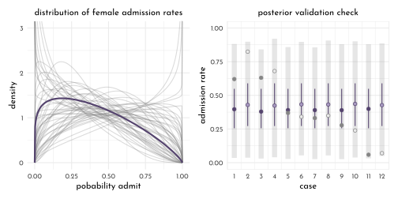

### Negative-Binomial or gamma-Poisson

This equivalent to the beta-binomial, but for Poisson processes.

The gamma-Poisson distribution has two parameters which are recruited from:

- shape($\alpha$)
- scale ($\theta$)
- rate ($\beta$)
- mean ($\mu$)

There are several equivalent ways to define the gamma distribution itself.

$$
Gamma(y | \alpha, \beta) = \frac{\beta^{\alpha} y^{\alpha - 1} e^{-\beta y}}{\Gamma (\alpha)} 
$$

where $\Gamma$ is the Gamma function.

The rate and shape are simply reciprocals ($\phi = 1 / \beta$):

$$
Gamma(y | \alpha, \phi) = \frac{y^{\alpha - 1} e^{-y/\phi}}{\phi^{\alpha} \Gamma (\alpha)} 
$$

It can also be defined in terms of $\mu$

$$
Gamma(y | \mu, \alpha ) = \frac{\left(\frac{\alpha}{\mu}\right)^{\alpha}}{\Gamma(\alpha)} y ^{\alpha - 1} exp(- \frac{\alpha y}{y})
$$

Based on the gamma distribution, the gamma-Poisson (aka. negative binomial) can be expressed as

$$
y_{i} \sim Gamma-Poisson(\mu, \alpha)
$$

where $\mu$ is the mean or rate, taking the place of $\lambda$ from the Poisson distribution.
In the rethinking book, this is noted as:

$$
y_{i} \sim Gamma-Poisson(\lambda_{i}, \phi)
$$

Note, that $\phi$ controls the variance and must thus be positive - it controls how closely the distribution matches a pure Poisson process.
The variance of the gamma-Poisson is $\lambda + \lambda ^ 2 / \phi$)


```r
data(Kline)
data_kline <- Kline %>% 
  as_tibble() %>% 
  mutate(pop_log_std = standardize(log(population)),
         contact_idx = 3L - as.integer(factor(contact)))

rm(Kline)
```


```r
data_kline_list <- data_kline %>% 
  dplyr::select(total_tools,
                population,
                contact_idx) %>% 
  as.list()

model_ocean_sci_gamma <- ulam(
  flist = alist(
    total_tools ~ dgampois( lambda, phi ),
    lambda <- exp(alpha[contact_idx]) * population^beta[contact_idx] / gamma,
    alpha[contact_idx] ~ dnorm(1, 1),
    beta[contact_idx] ~ dexp(1),
    gamma ~ dexp(1),
    phi ~ dexp(1)
  ),
  data = data_kline_list,
  chains = 4,
  cores = 4,
  log_lik = TRUE
)
```


```r
plot_ocean <- function(model, title){
  ocean_k_values_sc <- PSIS(model,
                            pointwise = TRUE) %>% 
    bind_cols(data_kline, .)
  
  n <- 101
  ocean_grid_sc <- crossing(population = seq(0, 3e5, length.out = n),
                            contact_idx = 1:2)
  
  ocean_posterior_predictions_sc <- link(model,
                                         data = ocean_grid_sc) %>% 
    as.matrix() %>% 
    t() %>% 
    as_tibble() %>% 
    bind_cols(ocean_grid_sc, .) %>% 
    pivot_longer(-c(population, contact_idx), values_to = "total_tools") %>% 
    dplyr::select(-name) %>% 
    group_by(population, contact_idx) %>% 
    summarise(p = list(quantile(total_tools, probs = c(.055, .25, .5, .75, .955))),
              breaks = list(c("ll", "l", "m", "h", "hh"))) %>% 
    ungroup() %>% 
    unnest(c(p, breaks)) %>% 
    pivot_wider(names_from = breaks, values_from = p)
  
  ocean_posterior_predictions_sc %>% 
    ggplot(aes(x = population, y = total_tools)) +
    geom_smooth(aes(ymin = ll, y = m, ymax = hh,
                    group = factor(contact_idx),
                    color = factor(contact_idx),
                    fill = after_scale(clr_alpha(color))),
                stat = "identity", size = .3) +
    geom_point(data = ocean_k_values_sc,
               aes(color = factor(contact_idx),
                   fill = after_scale(clr_alpha(color)),
                   size = k),
               shape = 21) +
    scale_color_manual(values = c(`1` = clr_current, `2` = clr0dd), guide = "none") +
    scale_size_continuous(guide = "none") +
    scale_x_continuous(breaks = 1e5 * (0:3), labels = scales::comma) +
    coord_cartesian(ylim = c(0, 80),
                    x = c(-1e3, 3e5),
                    expand = 1) +
    labs(subtitle = title) +
    theme(plot.subtitle = element_text(hjust = .5))  
}

chapter11_models <- read_rds("envs/chapter11_models.rds")

 
plot_ocean(chapter11_models$model_ocean_scientific,
           title = "the scientific model") +
  plot_ocean(model_ocean_sci_gamma,
             title = "the scientific gamma-poisson model")
```

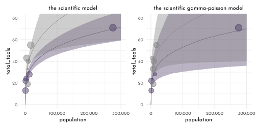

### Over-dispersion, Entropy and Information Criteria 

:::beware
Generally it's not advised to apply WAIC or PSIS to over-dispersed models (beta-Binomial and gamma-Poisson), *''unless you are very sure of what you are doing''*.
That is because in these model types can not easily be dis-aggregated row-wise without changing causal assumptions.
:::

## Zero-Inflated Outcomes

> *Whenever there are different causes for the same observation, then a __mixture model__ may be useful.*

This is used e.g. when several ways can prevent a count from happening (*we count zero scrub jays in the forest either because there are none __or__ because we scared them all away before starting the count.*)

### Zero-Inflated Poisson

Revisiting the monastery example - this time there are also *drinking days*, which prevent monks from producing new manuscripts.


```r
library(ggraph)
library(tidygraph)

rstat_nodes <- data.frame(name = c("A", "B", "C", "D", "E"))
rstat_edges <- data.frame(from = c(1, 1, 2, 3, 3),
                          to = c(2, 3, 4, 4, 5))

flow_grph <- tbl_graph(nodes = rstat_nodes, edges = rstat_edges)  %E>%
  mutate(label  = c("p", "1 - p", "", "" ,"")) %N>%
  mutate(label  = c("", "Drink", "Work", "observe\ny = 0" ,"observe\ny > 0"),
         x_offset = c(0, -.13, .13, 0, 0),
         show_point = row_number() < 4) %N>%
  create_layout(layout = tibble( x = c(.5, 0, 1, 0, 1),
                                 y = c(1, .5, .5, 0, 0)))

edge_labels <- ggraph::get_edges(format = "long")(flow_grph) %>% 
  mutate(node_start = c("from", "to")[1 + (node == from)]) %>% 
  dplyr::select(edge.id, node_start, x, y, label)  %>% 
  filter(label != "") %>% 
  mutate(order = c(1,2, 4,3)) %>% 
  arrange(order)

p1 <- flow_grph %>% 
  ggraph() +
  geom_edge_link(end_cap = ggraph::rectangle(1, .15, "npc"),
                 arrow = arrow(type = "closed", length = unit(4, "pt")),
                 color = clr0dd) +
  geom_node_point(aes(filter = show_point),
                  size = 10, shape = 21, color = clr0dd, fill = clr0) +
  geom_node_text(aes(x = x + x_offset, label = label),
                 family = fnt_sel) +
  geomtextpath::geom_textpath(data = edge_labels,
                              aes(x = x, y = y, label = label, 
                                  group = edge.id),
                              text_only = TRUE,
                              vjust = 1.8,
                              family = fnt_sel) +
  coord_fixed(ratio = .6, ylim = c(-.2, 1.1))
```

The likelihood of observing zero manuscripts is:

$$
\begin{array}{rcl}
Pr(0 | p, \lambda) & = & Pr(\textrm{drink} | p) + Pr(\textrm{work} | p) \times Pr(0 | \lambda) \\
& = & p + (1 - p)~\textrm{exp}(-\lambda)
\end{array}
$$

and the likelihood for non-zero values is:

$$
Pr(y | y > 0, p, \lambda) = Pr(\textrm{drink} | p)(0) + Pr(\textrm{work}|p) Pr(y | \lambda) = (1 - p) \frac{\lambda^{y}\textrm{exp}(-\lambda)}{y}
$$

We are defining those distributions as $ZIPoisson$ (zero-inflated Poisson, with the parameters $p$ probability of 0, and $\lambda$ the mean of the Poisson) to use in the model:

$$
\begin{array}{rclr}
y_{i} & \sim & ZIPoisson(p_{i}, \lambda_{i}) & \textrm{[likelihood]}\\
\textrm{logit}(p_{i}) & = & \alpha_{p} + \beta_{p} x_{i} & \textrm{[linear model #1 ]}\\
\textrm{log}(\lambda_{i}) & = & \alpha_{\lambda} + \beta_{\lambda} x_{i} & \textrm{[linear model #2 ]}\\
\end{array}
$$

$\rightarrow$ we need *two* linear models and *two* link functions for the *two processes* within the ZIPoisson.


```r
p_drink <- .2   # 20% of days
rate_work <- 1  # ~ 1 ms / day

n <- 365

set.seed(42)

data_books <- tibble(drink = rbinom(n , 1, p_drink),
       books = as.integer((1 - drink) * rpois(n , rate_work)))

p2 <- data_books %>% 
  group_by(drink, books) %>% 
  count() %>% 
  ggplot(aes(x = books, y = n)) +
  geom_bar(stat = "identity", width = .66,
           aes(color = factor(drink, levels = 1:0),
               fill = after_scale(clr_alpha(color, .7)))) +
  scale_color_manual("drunk?", values = c(`1` = clr_current, `0` = clr0dd)) +
  theme(panel.grid.major.x = element_blank(),
        panel.grid.minor.x = element_blank(),
        panel.grid.minor.y = element_blank())
```


```r
p1 + p2
```

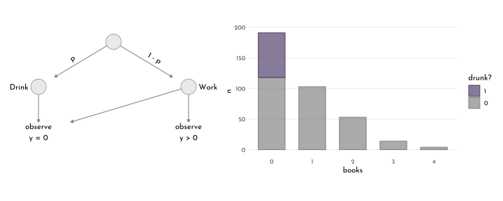


```r
model_books_drunk <- ulam(
  flist = alist(
    books ~ dzipois(p, lambda),
    logit(p) <- alpha_p,
    log(lambda) <- alpha_l,
    alpha_p ~ dnorm(-1.5, 1),
    alpha_l ~ dnorm(1, .5)
  ),
  data = data_books,
  chains = 4,
  cores = 4
)
```


```r
precis(model_books_drunk) %>% 
  knit_precis()
```


|param   |  mean|   sd|  5.5%| 94.5%|  n_eff| Rhat4|
|:-------|-----:|----:|-----:|-----:|------:|-----:|
|alpha_p | -1.37| 0.41| -2.05| -0.84| 458.49|  1.01|
|alpha_l | -0.06| 0.09| -0.21|  0.08| 470.42|  1.01|


```r
books_posterior <- extract.samples(model_books_drunk) %>% 
  as_tibble()

books_posterior %>% 
  summarise(alpha_p = mean(inv_logit(alpha_p)),
            alpha_l = mean(exp(alpha_l)))
```

```
#> # A tibble: 1 × 2
#>   alpha_p alpha_l
#>     <dbl>   <dbl>
#> 1   0.209   0.946
```

$\rightarrow$ we can get an accurate estimate of share of days when the monks are drunk, but we don't know which exact days those are. 

### Zero-Inflated Model in Stan

Here is how to translate the `rethinking::dzipois()` function into `stan`:


```r
model_books_drunk_alt <- ulam(
  flist = alist(
    books | books > 0 ~ custom( log1m(p) + poisson_lpmf(books | lambda) ),
    books | books == 0 ~ custom( log_mix( p, 0, poisson_lpmf(0 | lambda) ) ),
    logit(p) <- alpha_p,
    log(lambda) <- alpha_l,
    alpha_p ~ dnorm(-1.5, 1),
    alpha_l ~ dnorm(1, .5)
  ),
  data = data_books,
  chains = 4,
  cores = 4
)
```


```r
precis(model_books_drunk_alt) %>% 
  knit_precis()
```


|param   |  mean|   sd|  5.5%| 94.5%|  n_eff| Rhat4|
|:-------|-----:|----:|-----:|-----:|------:|-----:|
|alpha_p | -1.39| 0.40| -2.09| -0.86| 519.90|  1.01|
|alpha_l | -0.06| 0.09| -0.21|  0.08| 616.36|  1.00|


```r
stancode(model_books_drunk_alt)
```

```
#> data{
#>     int drink[365];
#>     int books[365];
#> }
#> parameters{
#>     real alpha_p;
#>     real alpha_l;
#> }
#> model{
#>     real p;
#>     real lambda;
#>     alpha_l ~ normal( 1 , 0.5 );
#>     alpha_p ~ normal( -1.5 , 1 );
#>     lambda = alpha_l;
#>     lambda = exp(lambda);
#>     p = alpha_p;
#>     p = inv_logit(p);
#>     for ( i in 1:365 ) 
#>         if ( books[i] == 0 ) target += log_mix(p, 0, poisson_lpmf(0 | lambda));
#>     for ( i in 1:365 ) 
#>         if ( books[i] > 0 ) target += log1m(p) + poisson_lpmf(books[i] | lambda);
#> }
```

## Ordered Categorical Outcomes

> *[For __ordered categories__, unlike counts], the differences in value are not necessarily equal. [...] Just treating ordered categories as continuous measures is not a good idea.*

The general approach is a multinomial prediction problem.
But, we are using a **cumulative link** function to move predictions progressively through the categories in sequence.

### Moral Intuition

The example works on data for the [*trolley problem*](https://en.wikipedia.org/wiki/Trolley_problem).


```r
data(Trolley)

data_trolley <- Trolley %>% 
  as_tibble() %>% 
  mutate(education = factor(as.character(edu),
                            levels = levels(edu)[c(2, 6, 8, 4, 
                                                   7, 1, 5, 3)]),
         education_idx = as.integer(education),
         education_norm = normalize(education_idx),
         sex = 1L + male,
         age_scl = age / max(age))
rm(Trolley)
```


```r
p1 <- data_trolley %>%
  ggplot(aes(x = response)) +
  geom_bar(width = .6,
           color = clr0dd,
           fill = clr_alpha(clr0dd,.7)) +
  theme(panel.grid.major.x = element_blank(),
        panel.grid.minor.x = element_blank(),
        panel.grid.minor.y = element_blank())
```


```r
table(data_trolley$response) / nrow(data_trolley)
```

```
#> 
#>          1          2          3          4          5          6          7 
#> 0.12829809 0.09154079 0.10785498 0.23393756 0.14723061 0.14551863 0.14561934
```

```r
logit <- function(x){ log(x / (1 - x)) }

data_trolley_cumulative <- data_trolley %>% 
  group_by(response) %>% 
  count() %>% 
  ungroup() %>% 
  mutate(pr_k = n / sum(n),
         cum_pr_k = cumsum(pr_k),
         log_cumulative_odds = logit(cum_pr_k),
         cum_pr_k_m1 = lag(cum_pr_k, default = 0))

p2 <- data_trolley_cumulative %>% 
  ggplot(aes(x = response, y = cum_pr_k)) +
  # as_reference(geom_point(size = 5), id = "pnts") +
  # with_blend(
    geom_line(color = clr0dd) +
    # ,bg_layer = "pnts", blend_type = "out") +
  geom_point(color = clr0dd, fill = clr0, shape = 21, size = 2) +
  lims(y = c(0, 1))
```

The log-cumulative-odds, that a response value $y_{i}$ is $\geqslant$ some possible outcome:

$$
\textrm{log} \frac{Pr(y_{i} \leqslant k)}{1 - Pr(y_{i} \leqslant k)} = \alpha_{k}
$$

with an unique intercept $\alpha_{k}$ for each possible outcome value $k$.


```r
p3 <- data_trolley_cumulative %>% 
  filter(log_cumulative_odds != Inf) %>% 
  ggplot(aes(x = response, y = log_cumulative_odds)) +
  # as_reference(geom_point(size = 5), id = "pnts") +
  # with_blend(
    geom_line(color = clr0dd) +
    #,bg_layer = "pnts", blend_type = "out") +
  geom_point(color = clr0dd, fill = clr0, shape = 21, size = 2) 
```


```r
p1 + p2 + p3 &
  scale_x_discrete(limits = factor(1:7))
```


After observing $k$, we can get its likelihood by subtraction:

$$
p_{k} = Pr(y_{i} = k) = Pr(y_{i} \leqslant k) - Pr(y_{i} \leqslant k - 1) 
$$


```r
data_trolley_cumulative %>% 
  ggplot(aes(x = response, y = cum_pr_k)) +
  geom_linerange(aes(ymin = 0, ymax = cum_pr_k),
                 color = clr_dark, linetype = 3) +
  geom_linerange(aes(ymin = cum_pr_k_m1, ymax = cum_pr_k),
                 color = clr_current, size = 2, alpha = .5) +
  geom_text(aes(y = .5 * (cum_pr_k_m1 + cum_pr_k),
                label = response, x = response + .2),
                 color = clr_current, family = fnt_sel) +
  geom_line(color = clr0dd) +
  geom_point(color = clr0dd, fill = clr0, shape = 21, size = 1.5) +
  lims(y = c(0, 1))
```

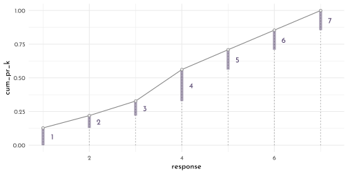

> From the [2019 Lecture](https://youtu.be/zA3Jxv8LOrA?list=PLDcUM9US4XdNM4Edgs7weiyIguLSToZRI&t=1532), at 25:32: *And I know at this point you are saying: 'But I already had that when I started.' Yes, but you would not be able to model the whole thing with a linear model. The whole reason that this literature uses the cumulative link is because it manages the fact that they are all bound together in an ordered way. You __establish the order__ by using a cumulative link.*

So here is the mathematical notation of the *ordered logit*:

$$
\begin{array}{rclr}
R_{i} & \sim & Ordered-logit(\phi_{i}, \kappa) & \textrm{[probability of the data]}\\
\phi_{i} & = & 0 & \textrm{[linear model]}\\
\kappa_{k} & \sim & Normal(0, 1.5) & \textrm{[common prior for each intercept]}\\
\end{array}
$$

But the model can also be expressed more literally:

$$
\begin{array}{rclcr}
R_{i} & \sim & Categorical(p) & &\textrm{[probability of the data]}\\
p_{1} & = & q_{1} & &\textrm{[probabilities of each value $k$]}\\
p_{k} & = & q_{k} - q_{k-1} & \textrm{for}~K \gt k \gt 1 &\\
p_{K} & = & 1 - q_{k-1} & &\\
\textrm{logit}(q_{k}) & = & \kappa_{k} - \phi_{i}& &\textrm{[cumulative logit link]}\\
\phi_{i} & = & \textrm{trems of linear model} & &\textrm{[linear model]}\\
\kappa_{k} & \sim & Normal(0, 1.5) & &\textrm{[common prior for each intercept]}\\
\end{array}
$$


```r
model_trolley <- ulam(
  flist = alist(
    response ~ dordlogit( 0, cutpoints ),
    cutpoints ~ dnorm( 0, 1.5 )
  ),
  data = list(response = data_trolley$response),
  cores = 4, 
  chains = 4
)

model_trolley_quap <- quap(
  flist = alist(
    response ~ dordlogit( 0, c(alpha_1, alpha_2, alpha_3, alpha_4, alpha_5, alpha_6) ),
    c(alpha_1, alpha_2, alpha_3, alpha_4, alpha_5, alpha_6) ~ dnorm( 0, 1.5 )
  ),
  data = data_trolley_cumulative,
  start = list(alpha_1 = -2,
               alpha_2 = -1,
               alpha_3 = 0,
               alpha_4 = 1,
               alpha_5 = 2,
               alpha_6 = 2.5)
)
```


```r
precis(model_trolley, depth = 2) %>% 
  knit_precis()
```


|param        |  mean|   sd|  5.5%| 94.5%|   n_eff| Rhat4|
|:------------|-----:|----:|-----:|-----:|-------:|-----:|
|cutpoints[1] | -1.92| 0.03| -1.97| -1.86| 1691.39|     1|
|cutpoints[2] | -1.27| 0.02| -1.31| -1.23| 2039.57|     1|
|cutpoints[3] | -0.72| 0.02| -0.75| -0.68| 2617.99|     1|
|cutpoints[4] |  0.25| 0.02|  0.22|  0.28| 2675.98|     1|
|cutpoints[5] |  0.89| 0.02|  0.86|  0.93| 2608.58|     1|
|cutpoints[6] |  1.77| 0.03|  1.73|  1.82| 2424.11|     1|

To get the cumulative probabilities back


```r
round(inv_logit(coef(model_trolley)), 3) %>% as.matrix() %>% 
  as.data.frame() %>% 
  knitr::kable()
```


|             |    V1|
|:------------|-----:|
|cutpoints[1] | 0.128|
|cutpoints[2] | 0.220|
|cutpoints[3] | 0.328|
|cutpoints[4] | 0.562|
|cutpoints[5] | 0.709|
|cutpoints[6] | 0.855|

compare to `data_trolley_cumulative$cum_pr_k`:


```r
data_trolley_cumulative
```

```
#> # A tibble: 7 × 6
#>   response     n   pr_k cum_pr_k log_cumulative_odds cum_pr_k_m1
#>      <int> <int>  <dbl>    <dbl>               <dbl>       <dbl>
#> 1        1  1274 0.128     0.128              -1.92        0    
#> 2        2   909 0.0915    0.220              -1.27        0.128
#> 3        3  1071 0.108     0.328              -0.719       0.220
#> 4        4  2323 0.234     0.562               0.248       0.328
#> 5        5  1462 0.147     0.709               0.890       0.562
#> 6        6  1445 0.146     0.854               1.77        0.709
#> 7        7  1446 0.146     1                 Inf           0.854
```

> *But now, we also have a posterior distribution around these values, which provides a measure of uncertainty.*


```r
extract.samples(model_trolley) %>% 
  as.data.frame() %>% 
  as_tibble() %>% 
  mutate(across(everything(), inv_logit),
         cutpoints.7 = 1,
         .draw = row_number())  %>% 
  pivot_longer(-.draw, values_to = "p_cum") %>% 
  group_by(.draw) %>% 
  arrange(.draw, name) %>% 
  mutate(p = p_cum - lag(p_cum, default = 0),
         name = str_sub(name,-1, -1) %>%  as.integer()) %>% 
  group_by(name) %>% 
  summarise(quantiles = list(tibble(p = c(quantile(p, 
                                                   probs = c(.055, .25, .5, .75, .955)),
                                          mean(p)),
                                    quantile = c("ll","l","m","h","hh", "mean")))) %>% 
  unnest(quantiles) %>% 
  pivot_wider(names_from = "quantile", values_from = "p") %>% 
  ggplot(aes(y = factor(name))) +
  geom_linerange(aes(xmin = l, xmax = h),
                 size = 1, color = clr0dd) +
  geom_linerange(aes(xmin = ll, xmax = hh),
                 size = .2, color = clr0dd) +
  geom_point(aes(x = m), shape = 21,
             color = clr0dd, fill = clr0) +
  geom_point(data = data_trolley_cumulative,
             aes(y = response, x = pr_k),
             color = clr_current, shape = 1, size = 3.5) +
  labs(y = "response", x = "p", subtitle = "posterior distribution for pr_k")
```

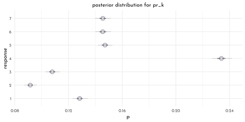

**Adding predictor variables**

We define a linear model $\phi_{i} = \beta x_{i}$ to express the cumulative logit as:

$$
\begin{array}{rcl}
\textrm{log}\frac{Pr(y_{i} -\leqslant k)}{1 - Pr(y_{i} \leqslant k)} & = &\alpha_k - \phi_i\\
\phi_{i} & = & \beta x_{i} 
\end{array}
$$

We need to subtract $\phi$ from $\alpha$, since the log-cumulative odds will shift the sign:


```r
(pk <- dordlogit( 1:7, 0, coef(model_trolley))) %>% round(digits = 2)
```

```
#> [1] 0.13 0.09 0.11 0.23 0.15 0.15 0.15
```


```r
sum(pk * 1:7)
```

```
#> [1] 4.198875
```


```r
(pk <- dordlogit( 1:7, 0, coef(model_trolley) - .5)) %>% round(digits = 2)
```

```
#> [1] 0.08 0.06 0.08 0.21 0.16 0.18 0.22
```


```r
sum(pk * 1:7)
```

```
#> [1] 4.729279
```

Now, to specify the predictors (`action`, `intention`, `contact`) within the model (including an interaction between `intention` and the other two), we write:

$$
\begin{array}{rcl}
\textrm{log}\frac{Pr(y_{i} -\leqslant k)}{1 - Pr(y_{i} \leqslant k)} & = &\alpha_k - \phi_i\\
\phi_{i} & = & \beta_{A} A_{i} + \beta_{C} C_{i} + B_{I,i} I_{i}\\
B_{I,i} & = & \beta_{I} + \beta_{IA} A_{i} + \beta_{IC} C_{i}
\end{array}
$$


```r
data_trolley_list <- data_trolley %>% 
  dplyr::select(response, action,
                intention, contact) %>% 
  as.list()

model_trolley_predict <- ulam(
  flist = alist(
    response ~ dordlogit( phi, cutpoints),
    phi <- beta_a * action + beta_c * contact + B_i * intention,
    B_i <- beta_i + beta_ia * action + beta_ic * contact,
    c(beta_a, beta_c, beta_i, beta_ia, beta_ic) ~ dnorm(0, .5),
    cutpoints ~ dnorm(0, 1.5)
  ),
  data = data_trolley_list,
  chains = 4,
  cores = 4
)
```


```r
library(tidybayes)

trolley_posterior <- extract.samples(model_trolley_predict) %>% 
  as.data.frame() %>% 
  as_tibble() 

trolley_posterior %>% 
  dplyr::select(starts_with("beta")) %>% 
  pivot_longer(everything()) %>%
  mutate(name = factor(name, levels = c("beta_a", "beta_i", "beta_c",
                                        "beta_ia", "beta_ic"))) %>% 
  ggplot(aes(x = value, y = name)) +
  geom_vline(xintercept = 0, linetype = 3, color = clr_dark) +
  stat_gradientinterval(.width = c(.5, .89), size = 1,
                        point_size = 1.5, shape = 21,
                        point_fill = clr_lighten(clr_current), 
                        fill = clr_lighten(clr_current), 
                        color = clr_dark) +
  scale_x_continuous("marginal posterior", breaks = -5:0 / 4) +
  scale_y_discrete(NULL) +
  coord_cartesian(xlim = c(-1.4, 0))
```

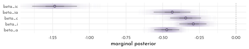


```r
new_trolley <- data_trolley %>% 
  distinct(action, contact, intention) %>% 
  mutate(combination = str_c(action, contact, intention, sep = "_"),
         data_config = row_number())

label_levels <- map2_chr(c(0,1,0),
                         c(0, 0, 1),
                         function(action, contact){
                           glue("action: {action}; contact: {contact}")
                           })

trolley_posterior_prediction <- link(model_trolley_predict, data = new_trolley) %>%
  as.data.frame() %>% 
  as_tibble() %>% 
  mutate(.iter = row_number()) %>% 
  bind_cols(trolley_posterior) %>% 
  pivot_longer(-c(.iter, starts_with("beta"), starts_with("cutpoints"))) %>%
  separate(name, into = c("param", "data_config"), sep = "\\.") %>%
  mutate(data_config = as.integer(data_config)) %>% 
  pivot_wider(names_from = param, values_from = value) %>% 
  filter(.iter < 51) %>% 
  left_join(new_trolley) %>% 
  mutate(p_k = pmap(cur_data(), 
                    .f = function(phi,
                                  cutpoints.1, cutpoints.2, cutpoints.3,
                                  cutpoints.4, cutpoints.5, cutpoints.6,
                                  ...){
                      
                      ct <- c(cutpoints.1, cutpoints.2, cutpoints.3,
                              cutpoints.4, cutpoints.5, cutpoints.6)
                      
                      tibble(pk = pordlogit(1:6, phi, ct),
                             idx = 1:6)}
  )) %>%
  unnest(p_k) %>% 
  mutate(label = factor(glue("action: {action}; contact: {contact}"),
                        levels = label_levels))

p1 <- trolley_posterior_prediction %>% 
  ggplot(aes(x = intention, y = pk)) +
  geom_line(aes(group = str_c(.iter,"_", idx)),
            color = clr_alpha(clr0d, .25)) +
  facet_wrap(label ~ .)
```


```r
p2 <- sim(model_trolley_predict, data = new_trolley)  %>% 
  as.data.frame() %>% 
  as_tibble() %>% 
  set_names(nm = new_trolley$combination) %>% 
  pivot_longer(everything(),
               names_to = "combination") %>% 
  group_by(combination, value) %>% 
  count() %>% 
  ungroup() %>% 
  separate(combination,
           into = c("action", "contact", "intention"),
           sep = "_") %>% 
  mutate(label = factor(glue("action: {action}; contact: {contact}"),
                        levels = label_levels)) %>% 
  ggplot(aes(x = value, y = n)) +
  geom_bar(aes(fill = after_scale(clr_alpha(color)),
               color = intention),
                 position = position_dodge2(padding = .3) ,
           width = .8, stat = "identity") +
  facet_wrap(label ~ .) +
  scale_color_manual(values = c(`0` = clr0d, `1` = clr_current)) +
  theme(legend.position = "bottom")
```


```r
p1 / p2
```


## Ordered Categorical Predictors

Adding `education` as ordered categorical predictor for the trolley model:


```r
levels(data_trolley$education)
```

```
#> [1] "Elementary School"    "Middle School"        "Some High School"    
#> [4] "High School Graduate" "Some College"         "Bachelor's Degree"   
#> [7] "Master's Degree"      "Graduate Degree"
```

We will include the new predictors within the model as series of $\delta$ parameters (excluding the first level, which  will be present the intercept):

$$
\begin{array}{rclr}
\phi_{i} & = & \delta_{1} + \textrm{other stuff} & \textrm{[effect of `Middle School`]}\\
\phi_{i} & = & \delta_{1} + \delta_{2} + \textrm{other stuff} & \textrm{[effect of `some High School`]}\\
\phi_{i} & = & \sum_{j=1}^{7} \delta_{j} + \textrm{other stuff} & \textrm{[effect of highest education]}\\
\phi_{i} & = & \beta_{e} \sum_{j=0}^{E_{i}-1} \delta_{j} + \textrm{other stuff} & \textrm{[using $\beta = 1$ for max education effect ]}
\end{array}
$$

Where $E_{i}$ is the completed education of individual $i$.
For individuals with $E_{i} = 1$, $\beta_{E}$ (the education effect) is ignored, since $\beta_{E}~\delta_{0} = 0$.

Now, we can include the new predictor term in the model:

$$
\begin{array}{rclr}
R_{i} & \sim & Ordered-logit( \phi_{i}, \kappa) & \textrm{[likelihood]}\\
\phi_{i} & = & \beta_{E} \sum_{j=0}^{E_{i}-1} \delta_{j} + \beta_{A} A_{i} + \beta_{I} I_{i} + \beta_{C} C_{i} & \textrm{[model]}\\
\beta_{A},\beta_{I},\beta_{C},\beta_{E} & \sim & Normal(0,1) & \textrm{[$\beta$ priors]}\\
\delta & \sim & Dirichlet(\alpha) & \textrm{[$\delta$ prior]} 
\end{array}
$$

**Introducing the Dirichlet distribution**

The Dirichlet distribution is a multivariate extension of the *beta distribution* (it produces probabilities for multiple event with multiple different outcomes that together sum up to one).


```r
library(gtools)
set.seed(42)
delta <- rdirichlet( 10, alpha = rep(2, 7)) %>% 
  as_tibble() %>% 
  mutate(rn = row_number()) %>% 
  pivot_longer(-rn) %>% 
  mutate(x = str_sub(name, -1, -1) %>% as.integer())

p1 <- delta %>% 
  ggplot(aes(x = x, y = value, group = rn)) +
  geom_line(data = . %>% filter(rn < 10), color = clr0d) +
  geom_line(data = . %>% filter(rn == 10), color = clr_current) +
  geom_point(data = . %>% filter(rn < 10), 
             color = clr0d, fill = clr0,
             size = 2, shape = 21) +
  geom_point(data = . %>% filter(rn == 10),
             color = clr_current, fill = clr_lighten(clr_current),
             size = 2, shape = 21) +
  labs(subtitle = "10 draws from a 7 class dirichlet distribution",
       x = "outcome", y = "probability")

delta3 <- rdirichlet( 500, alpha = c(3, 4, 6)) %>% 
  as_tibble() %>% 
  mutate(rn = row_number())

library(ggtern)
source("bayesian_settings.R")
clr_current <-  clr1
p2 <- delta3 %>% 
  ggtern(mapping = aes(x = V1, y = V2, z = V3)) +
  stat_density_tern(aes(color = ..level.., 
                        fill = after_scale(clr_alpha(color))),
                     geom = 'polygon') +
  scale_color_gradientn(colours = c(clr0, clr_current), guide = "none") +
  scale_T_continuous(breaks = c(.25, .5 ,.75, 1),
                     minor_breaks = c(.125, .375, .625, .875),
                     label = c(0.25, 0.5, .75, 1) %>% sprintf("%.2f",.)) +
    scale_L_continuous(breaks = c(.25, .5 ,.75, 1),
                     minor_breaks = c(.125, .375, .625, .875),
                     label = c(0.25, 0.5, .75, 1) %>% sprintf("%.2f",.)) +
    scale_R_continuous(breaks = c(.25, .5 ,.75, 1),
                     minor_breaks = c(.125, .375, .625, .875),
                     label = c(0.25, 0.5, .75, 1) %>% sprintf("%.2f",.)) +
  labs(subtitle = "density for a 3 class dirichlet distribution") +
  theme_minimal(base_family = fnt_sel) +
  theme(panel.border = element_rect(size = .5, color = clr0d))

list(ggplotGrob(p1), ggplotGrob(p2)) %>%  wrap_plots()
```


```r
data_trolley_list2 <- data_trolley %>% 
  dplyr::select(response, action, intention, contact, education_idx) %>% 
  as.list() %>% 
  c(., list(alpha = rep(2, 7)))
```


```{.r .bg-save}
model_trolley_education <- ulam(
  flist = alist(
    response ~ ordered_logistic( phi, kappa ),
    phi <- beta_e * sum(delta_j[1:education_idx]) +
      beta_a * action + beta_i * intention + beta_c * contact,
    kappa ~ normal( 0, 1.5 ),
    c( beta_a, beta_i, beta_c, beta_e ) ~ normal( 0, 1 ),
    vector[8]: delta_j <<- append_row( 0, delta ),
    simplex[7]: delta ~ dirichlet( alpha )
  ),
  data = data_trolley_list2,
  chains = 4,
  cores = 4
)

write_rds(model_trolley_education, file = "brms/ulam_c12_model_trolley_education.rds")
```


```r
model_trolley_education <- read_rds("brms/ulam_c12_model_trolley_education.rds")
```


```r
precis(model_trolley_education, depth = 2, omit = "kappa") %>% 
  knit_precis()
```


|param    |  mean|   sd|  5.5%| 94.5%|   n_eff| Rhat4|
|:--------|-----:|----:|-----:|-----:|-------:|-----:|
|beta_e   | -0.32| 0.17| -0.59| -0.07|  955.42|     1|
|beta_c   | -0.96| 0.05| -1.03| -0.88| 2336.49|     1|
|beta_i   | -0.72| 0.04| -0.78| -0.66| 2848.95|     1|
|beta_a   | -0.70| 0.04| -0.77| -0.64| 2281.89|     1|
|delta[1] |  0.23| 0.14|  0.05|  0.48| 1478.39|     1|
|delta[2] |  0.14| 0.08|  0.03|  0.30| 2423.27|     1|
|delta[3] |  0.20| 0.11|  0.05|  0.38| 2112.40|     1|
|delta[4] |  0.17| 0.10|  0.04|  0.34| 2282.96|     1|
|delta[5] |  0.04| 0.05|  0.01|  0.11|  945.10|     1|
|delta[6] |  0.10| 0.06|  0.02|  0.21| 2489.65|     1|
|delta[7] |  0.13| 0.08|  0.03|  0.27| 2097.86|     1|


```r
extract.samples(model_trolley_education) %>% 
  as.data.frame() %>% 
  as_tibble() %>% 
  dplyr::select(starts_with("delta")) %>% 
  set_names(nm = levels(data_trolley$education)[2:8]) %>% 
  ggpairs(
    lower = list(continuous = wrap(my_lower, col = clr_current)),
    diag = list(continuous = wrap("densityDiag", fill = fll0,
                                  color = clr_current,
                                  fill = clr_alpha(clr_current), 
                                  adjust = .7)),
    upper = list(continuous = wrap(my_upper , size = 4, 
                                   color = "black", family = fnt_sel)) ) +
  theme(panel.border = element_rect(color = clr_dark,
                                    fill = "transparent"))
```


Comparing how  simply throwing the  ordered categorical predictor into a linear model underestimates the `education` effect:


```r
data_trolley_list3 <- data_trolley %>% 
  dplyr::select(response, action, intention, contact, education_norm) %>% 
  as.list()

model_trolley_education_linear <- ulam(
  flist = alist(
    response ~ ordered_logistic( mu, cutpoints ),
    mu <- beta_e * education_norm + beta_a * action +
      beta_i * intention + beta_c * contact,
    c( beta_a, beta_i, beta_c, beta_e ) ~ normal( 0, 15 ),
    cutpoints ~ normal( 0, 1.5 )
  ),
  data = data_trolley_list3,
  chains = 4,
  cores = 4
)
```


```r
precis(model_trolley_education_linear) %>% 
  knit_precis()
```


|param  |  mean|   sd|  5.5%| 94.5%|   n_eff| Rhat4|
|:------|-----:|----:|-----:|-----:|-------:|-----:|
|beta_e | -0.10| 0.09| -0.25|  0.04| 1723.48|     1|
|beta_c | -0.96| 0.05| -1.04| -0.88| 2115.57|     1|
|beta_i | -0.72| 0.04| -0.78| -0.66| 2385.87|     1|
|beta_a | -0.71| 0.04| -0.77| -0.64| 1934.02|     1|

---


```r
library(rlang)
chapter12_models <- env(
  data_ucb_list = data_ucb_list,
  model_ucb_beta = model_ucb_beta,
  data_kline = data_kline,
  data_kline_list = data_kline_list,
  model_ocean_sci_gamma = model_ocean_sci_gamma,
  data_books = data_books,
  model_books_drunk = model_books_drunk,
  model_books_drunk_alt = model_books_drunk_alt,
  data_trolley = data_trolley,
  data_trolley_cumulative = data_trolley_cumulative,
  model_trolley = model_trolley,
  model_trolley_quap = model_trolley_quap,
  data_trolley_list = data_trolley_list,
  model_trolley_predict = model_trolley_predict,
  data_trolley_list2 = data_trolley_list2,
  model_trolley_education = model_trolley_education,
  data_trolley_list3 = data_trolley_list3,
  model_trolley_education_linear = model_trolley_education_linear
)

write_rds(chapter12_models, "envs/chapter12_models.rds")
```

## Homework

**E1**

In an *un-ordered categorical* variable the ranking of levels is arbitrary (eg. types of fruit: `apple`, `banana`, `oranges`), while in an *ordered categorical* variable the order of categories is meaningful but not even across levels (eg. developmental stages in fish: `egg`, `larvae`, `juvenile`, `adult`).

**E2**

It uses a *cumulative link function* to encode the order of levels.
Here the probability of witnessing the *current event or an event of a lover level* is considered.

**E3**

It will tend to underestimate the rate $\lambda$ of the modeled Poisson process.

**E4**

Over-dispersed counts can occur when an event can be the result of two different processes.
This could be eg. fruit-fall below trees which  could depend on the ripening process as well as on animal intervention.

**M1**


```r
data_uni <- tibble(
  rating = 1:4,
  n = c(12L, 36L, 7L, 41L),
  pr = n / sum(n),
  n_cumulative = cumsum(n),
  pr_cumulative = n_cumulative / sum(n),
  cumulative_odds = pr_cumulative / (1 - pr_cumulative),
  log_cumulative_odds = log(cumulative_odds))
```

**M2**


```r
data_uni %>% 
  ggplot(aes(x = rating, y = pr_cumulative)) +
  geom_linerange(aes(ymin = 0, ymax = pr_cumulative),
                 linetype = 3, color = clr_dark) +
  geom_linerange(aes(ymin = pr_cumulative - pr,
                     ymax = pr_cumulative),
                 size = 2, color = clr_alpha(clr_dark, .4)) +
  geom_line(color = clr0dd) +
  geom_point(shape = 21, size = 2,
             color = clr0dd, fill = clr0) +
  coord_cartesian(ylim = 0:1)
```


**M3**


$$
\begin{array}{rclr}
y_{i} & \sim & ZIBinomial(p_{0,i}, n, p_{i}) & \textrm{[likelihood]}\\
\textrm{logit}(p_{0,i}) & = & \alpha_{p_{0}} + \beta_{p_{0}} x_{i} & \textrm{[linear model #1 ]}\\
\textrm{logit}(p_{i}) & = & \alpha_{p} + \beta_{p} x_{i} & \textrm{[linear model #2 ]}\\
\end{array}
$$

**H1**


```r
data(Hurricanes)

data_hurricane <- Hurricanes %>% 
  as_tibble() %>% 
  mutate(damage_norm_log = log(damage_norm),
         across(c(femininity, damage_norm, damage_norm_log, min_pressure),
                .fns = standardize, .names = "{.col}_std"))

rm(Hurricanes)
```


```r
model_hurricane_intercept <- ulam(
  flist = alist(
    deaths ~ dpois( lambda ),
    log(lambda) <- alpha,
    alpha ~ dnorm(3, 0.5)
  ),
  data = data_hurricane,
  chains = 4,
  cores = 4,
  log_lik = TRUE
)

model_hurricane_fem <- ulam(
  flist = alist(
    deaths ~ dpois( lambda ),
    log(lambda) <- alpha + beta_f * femininity_std,
    alpha ~ dnorm(3, 0.5),
    beta_f ~ dnorm(0, 0.2)
  ),
  data = data_hurricane,
  chains = 4,
  cores = 4,
  log_lik = TRUE
)
```


```r
precis(model_hurricane_intercept) %>% 
  knit_precis()
```


|param | mean|   sd| 5.5%| 94.5%|  n_eff| Rhat4|
|:-----|----:|----:|----:|-----:|------:|-----:|
|alpha | 3.03| 0.02| 2.99|  3.06| 687.29|     1|


```r
precis(model_hurricane_fem) %>% 
  knit_precis()
```


|param  | mean|   sd| 5.5%| 94.5%|   n_eff| Rhat4|
|:------|----:|----:|----:|-----:|-------:|-----:|
|alpha  | 3.00| 0.02| 2.96|  3.04| 1134.56|  1.01|
|beta_f | 0.23| 0.03| 0.19|  0.27| 1093.41|  1.00|


```r
hurricane_k_values <- PSIS(model_hurricane_fem, pointwise = TRUE) %>% 
  bind_cols(data_hurricane, .)

n <- 101
new_hurricane <- tibble(femininity_std = seq(-2, 1.5, length.out = n))

hurricane_posterior_predictions <- link(model_hurricane_fem,
                                             data = new_hurricane) %>% 
  as.matrix() %>% 
  t() %>% 
  as_tibble() %>% 
  bind_cols(new_hurricane, .) %>% 
  pivot_longer(-femininity_std, values_to = "deaths") %>% 
  dplyr::select(-name) %>% 
  group_by(femininity_std) %>% 
  summarise(p = list(quantile(deaths, probs = c(.055, .25, .5, .75, .955))),
            breaks = list(c("ll", "l", "m", "h", "hh"))) %>% 
  ungroup() %>% 
  unnest(c(p, breaks)) %>% 
  pivot_wider(names_from = breaks, values_from = p)

hurricane_posterior_predictions %>% 
  ggplot(aes(x = femininity_std, y = deaths)) +
  geom_smooth(aes(ymin = ll, y = m, ymax = hh),
              stat = "identity", size = .5,
              color = clr0dd, fill = fll0dd) +
  geom_point(data = hurricane_k_values,
             aes(size = k), color = clr_dark, fill = clr0,
             shape = 21) +
  ggrepel::geom_text_repel(data = hurricane_k_values %>% filter(k > .5),
             aes(label = str_c(name, " (", round(k, digits = 2), ")")),
             family = fnt_sel, nudge_y = 8, min.segment.length = 15) +
  scale_size_continuous(guide = "none")
```


**H2**


```r
model_hurricane_fem_gamma <- ulam(
  flist = alist(
    deaths ~ dgampois( lambda, phi ),
    log(lambda) <- alpha + beta_f * femininity_std,
    alpha ~ dnorm(3, 0.5),
    beta_f ~ dnorm(0, 0.2),
    phi ~ dexp(1)
  ),
  data = data_hurricane,
  chains = 4,
  cores = 4,
  log_lik = TRUE
)
```


```r
precis(model_hurricane_fem) %>% 
  knit_precis()
```


|param  | mean|   sd| 5.5%| 94.5%|   n_eff| Rhat4|
|:------|----:|----:|----:|-----:|-------:|-----:|
|alpha  | 3.00| 0.02| 2.96|  3.04| 1134.56|  1.01|
|beta_f | 0.23| 0.03| 0.19|  0.27| 1093.41|  1.00|


```r
precis(model_hurricane_fem_gamma) %>%
  knit_precis()
```


|param  | mean|   sd|  5.5%| 94.5%|   n_eff| Rhat4|
|:------|----:|----:|-----:|-----:|-------:|-----:|
|alpha  | 3.03| 0.15|  2.79|  3.28| 1965.30|     1|
|beta_f | 0.13| 0.12| -0.07|  0.33| 1916.78|     1|
|phi    | 0.45| 0.07|  0.36|  0.56| 1770.07|     1|


**H3**


```r
model_hurricane_fem_dam <- ulam(
  flist = alist(
    deaths ~ dgampois( lambda, phi ),
    log(lambda) <- alpha + beta_f * femininity_std + beta_d * damage_norm_std,
    alpha ~ dnorm(3, 0.5),
    c(beta_f, beta_d) ~ dnorm(0, 0.2),
    phi ~ dexp(1)
  ),
  data = data_hurricane,
  chains = 4,
  cores = 4,
  log_lik = TRUE
)

model_hurricane_fem_dam_i <- ulam(
  flist = alist(
    deaths ~ dgampois( lambda, phi ),
    log(lambda) <- alpha +
      beta_f * femininity_std + 
      beta_d * damage_norm_std +
      beta_fd * femininity_std * damage_norm_std,
    alpha ~ dnorm(3, 0.5),
    c(beta_f, beta_d, beta_fd) ~ dnorm(0, 0.2),
    phi ~ dexp(1)
  ),
  data = data_hurricane,
  chains = 4,
  cores = 4,
  log_lik = TRUE
)


model_hurricane_fem_pres <- ulam(
  flist = alist(
    deaths ~ dgampois( lambda, phi ),
    log(lambda) <- alpha + beta_f * femininity_std + beta_p * min_pressure_std,
    alpha ~ dnorm(3, 0.5),
    c(beta_f, beta_p) ~ dnorm(0, 0.2),
    phi ~ dexp(1)
  ),
  data = data_hurricane,
  chains = 4,
  cores = 4,
  log_lik = TRUE
)

model_hurricane_fem_pres_i <- ulam(
  flist = alist(
    deaths ~ dgampois( lambda, phi ),
    log(lambda) <- alpha +
      beta_f * femininity_std + 
      beta_p * min_pressure_std +
      beta_fp * femininity_std * min_pressure_std,
    alpha ~ dnorm(3, 0.5),
    c(beta_f, beta_p, beta_fp) ~ dnorm(0, 0.2),
    phi ~ dexp(1)
  ),
  data = data_hurricane,
  chains = 4,
  cores = 4,
  log_lik = TRUE
)

model_hurricane_fem_dam_pres <- ulam(
  flist = alist(
    deaths ~ dgampois( lambda, phi ),
    log(lambda) <- alpha +
      beta_f * femininity_std + 
      beta_d * damage_norm_std +
      beta_p * min_pressure_std,
    alpha ~ dnorm(3, 0.5),
    c( beta_f, beta_d, beta_p) ~ dnorm(0, 0.2),
    phi ~ dexp(1)
  ),
  data = data_hurricane,
  chains = 4,
  cores = 4,
  log_lik = TRUE
)

model_hurricane_fem_dam_pres_i <- ulam(
  flist = alist(
    deaths ~ dgampois( lambda, phi ),
    log(lambda) <- alpha +
      beta_f * femininity_std + 
      beta_d * damage_norm_std +
      beta_p * min_pressure_std +
      beta_fd * femininity_std * damage_norm_std +
      beta_fp * femininity_std * min_pressure_std +
      beta_dp * damage_norm_std * min_pressure_std +
      beta_fdp * femininity_std * damage_norm_std * min_pressure_std ,
    alpha ~ dnorm(3, 0.5),
    c( beta_f, beta_d, beta_p, beta_fd, beta_fp, beta_dp, beta_fdp) ~ dnorm(0, 0.2),
    phi ~ dexp(1)
  ),
  data = data_hurricane,
  chains = 4,
  cores = 4,
  log_lik = TRUE
)
```


```r
compare(model_hurricane_fem_gamma,
        model_hurricane_fem_dam,
        model_hurricane_fem_pres,
        model_hurricane_fem_dam_i,
        model_hurricane_fem_pres_i,
        model_hurricane_fem_dam_pres,
        model_hurricane_fem_dam_pres_i) %>% 
  knit_precis(param_name = "model")
```


|model                          |   WAIC|    SE| dWAIC|   dSE| pWAIC| weight|
|:------------------------------|------:|-----:|-----:|-----:|-----:|------:|
|model_hurricane_fem_dam_pres_i | 663.90| 34.36|  0.00|    NA|  7.86|   0.99|
|model_hurricane_fem_dam_pres   | 674.80| 36.09| 10.90|  5.61|  6.71|   0.00|
|model_hurricane_fem_dam_i      | 676.62| 31.40| 12.72|  7.29|  4.16|   0.00|
|model_hurricane_fem_dam        | 677.18| 31.61| 13.28|  7.07|  3.58|   0.00|
|model_hurricane_fem_pres_i     | 695.80| 36.14| 31.90|  6.55|  6.94|   0.00|
|model_hurricane_fem_pres       | 696.36| 36.26| 32.46|  7.10|  5.96|   0.00|
|model_hurricane_fem_gamma      | 708.78| 31.96| 44.88| 10.11|  2.99|   0.00|


```r
precis(model_hurricane_fem_dam_pres_i) %>% 
  knit_precis()
```


|param    |  mean|   sd|  5.5%| 94.5%|   n_eff| Rhat4|
|:--------|-----:|----:|-----:|-----:|-------:|-----:|
|alpha    |  2.64| 0.13|  2.44|  2.85| 1622.29|     1|
|beta_fdp |  0.09| 0.10| -0.07|  0.25| 1341.85|     1|
|beta_dp  |  0.16| 0.11| -0.02|  0.32| 1344.51|     1|
|beta_fp  |  0.11| 0.13| -0.10|  0.31| 2114.63|     1|
|beta_fd  |  0.25| 0.16|  0.00|  0.50| 1617.36|     1|
|beta_p   | -0.44| 0.12| -0.64| -0.24| 1833.15|     1|
|beta_d   |  0.62| 0.15|  0.38|  0.85| 1593.65|     1|
|beta_f   |  0.11| 0.11| -0.07|  0.29| 2518.47|     1|
|phi      |  0.75| 0.13|  0.56|  0.97| 1723.51|     1|


```r
new_hurricane <- crossing(femininity_std = seq(-2, 2, length.out = 15),
                          damage_norm_std = seq(-2,  2, length.out = 5),
                          min_pressure_std = seq(-2, 2, length.out = 5))

hurricne_posterior_pred <- link(model_hurricane_fem_dam_pres_i,
     data = new_hurricane) %>% 
  t() %>% 
  as.data.frame() %>% 
  as_tibble() %>% 
  bind_cols(new_hurricane,. ) %>% 
  pivot_longer(-(c(femininity_std,damage_norm_std,min_pressure_std)), names_to = ".draw") %>% 
  mutate(.draw = str_remove(.draw, "V") %>% as.integer()) %>% 
  group_by(femininity_std, damage_norm_std, min_pressure_std) %>% 
  summarise(probs = list(tibble(p = c(.055, .25, .5, .75, .945),
                           deaths = quantile(value, c(.055, .25, .5, .75, .945)),
                           label = c("ll", "l", "m", "h", "hh")))) %>% 
  ungroup() %>% 
  unnest(probs) 

p1 <- hurricne_posterior_pred %>% 
  dplyr::select(-p) %>% 
  pivot_wider(names_from = "label", values_from = "deaths") %>% 
  ggplot(aes(x = femininity_std, y = m)) +
  geom_ribbon(aes(ymin = ll, ymax = hh), fill = fll0dd) +
  geom_smooth(aes(ymin = l, ymax = h), stat = "identity",
              size = .7, color = clr_dark, fill = fll0dd) +
  facet_grid(damage_norm_std ~ min_pressure_std, 
             labeller = label_both)

p1 + scale_y_continuous(labels = scales::label_comma()) +
  p1 + scale_y_log10() 
```

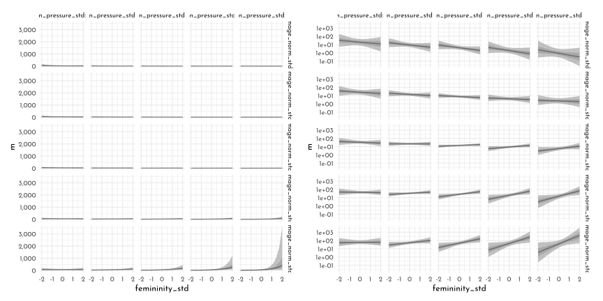


**H4**


```r
model_hurricane_fem_damlog_pres_i <- ulam(
  flist = alist(
    deaths ~ dgampois( lambda, phi ),
    log(lambda) <- alpha +
      beta_f * femininity_std + 
      beta_d * damage_norm_log_std +
      beta_p * min_pressure_std +
      beta_fd * femininity_std * damage_norm_log_std +
      beta_fp * femininity_std * min_pressure_std +
      beta_dp * damage_norm_log_std * min_pressure_std +
      beta_fdp * femininity_std * damage_norm_log_std * min_pressure_std ,
    alpha ~ dnorm(3, 0.5),
    c( beta_f, beta_d, beta_p, beta_fd, beta_fp, beta_dp, beta_fdp) ~ dnorm(0, 0.2),
    phi ~ dexp(1)
  ),
  data = data_hurricane,
  chains = 4,
  cores = 4,
  log_lik = TRUE
)
```

```
#> Running MCMC with 4 parallel chains, with 1 thread(s) per chain...
#> 
#> Chain 1 Iteration:   1 / 1000 [  0%]  (Warmup) 
#> Chain 1 Iteration: 100 / 1000 [ 10%]  (Warmup) 
#> Chain 1 Iteration: 200 / 1000 [ 20%]  (Warmup) 
#> Chain 2 Iteration:   1 / 1000 [  0%]  (Warmup) 
#> Chain 2 Iteration: 100 / 1000 [ 10%]  (Warmup) 
#> Chain 2 Iteration: 200 / 1000 [ 20%]  (Warmup) 
#> Chain 3 Iteration:   1 / 1000 [  0%]  (Warmup) 
#> Chain 3 Iteration: 100 / 1000 [ 10%]  (Warmup) 
#> Chain 3 Iteration: 200 / 1000 [ 20%]  (Warmup) 
#> Chain 4 Iteration:   1 / 1000 [  0%]  (Warmup) 
#> Chain 4 Iteration: 100 / 1000 [ 10%]  (Warmup) 
#> Chain 1 Iteration: 300 / 1000 [ 30%]  (Warmup) 
#> Chain 1 Iteration: 400 / 1000 [ 40%]  (Warmup) 
#> Chain 1 Iteration: 500 / 1000 [ 50%]  (Warmup) 
#> Chain 1 Iteration: 501 / 1000 [ 50%]  (Sampling) 
#> Chain 2 Iteration: 300 / 1000 [ 30%]  (Warmup) 
#> Chain 2 Iteration: 400 / 1000 [ 40%]  (Warmup) 
#> Chain 2 Iteration: 500 / 1000 [ 50%]  (Warmup) 
#> Chain 2 Iteration: 501 / 1000 [ 50%]  (Sampling) 
#> Chain 3 Iteration: 300 / 1000 [ 30%]  (Warmup) 
#> Chain 3 Iteration: 400 / 1000 [ 40%]  (Warmup) 
#> Chain 4 Iteration: 200 / 1000 [ 20%]  (Warmup) 
#> Chain 4 Iteration: 300 / 1000 [ 30%]  (Warmup) 
#> Chain 1 Iteration: 600 / 1000 [ 60%]  (Sampling) 
#> Chain 1 Iteration: 700 / 1000 [ 70%]  (Sampling) 
#> Chain 2 Iteration: 600 / 1000 [ 60%]  (Sampling) 
#> Chain 3 Iteration: 500 / 1000 [ 50%]  (Warmup) 
#> Chain 3 Iteration: 501 / 1000 [ 50%]  (Sampling) 
#> Chain 4 Iteration: 400 / 1000 [ 40%]  (Warmup) 
#> Chain 1 Iteration: 800 / 1000 [ 80%]  (Sampling) 
#> Chain 2 Iteration: 700 / 1000 [ 70%]  (Sampling) 
#> Chain 2 Iteration: 800 / 1000 [ 80%]  (Sampling) 
#> Chain 3 Iteration: 600 / 1000 [ 60%]  (Sampling) 
#> Chain 3 Iteration: 700 / 1000 [ 70%]  (Sampling) 
#> Chain 4 Iteration: 500 / 1000 [ 50%]  (Warmup) 
#> Chain 4 Iteration: 501 / 1000 [ 50%]  (Sampling) 
#> Chain 4 Iteration: 600 / 1000 [ 60%]  (Sampling) 
#> Chain 1 Iteration: 900 / 1000 [ 90%]  (Sampling) 
#> Chain 1 Iteration: 1000 / 1000 [100%]  (Sampling) 
#> Chain 2 Iteration: 900 / 1000 [ 90%]  (Sampling) 
#> Chain 2 Iteration: 1000 / 1000 [100%]  (Sampling) 
#> Chain 3 Iteration: 800 / 1000 [ 80%]  (Sampling) 
#> Chain 4 Iteration: 700 / 1000 [ 70%]  (Sampling) 
#> Chain 4 Iteration: 800 / 1000 [ 80%]  (Sampling) 
#> Chain 1 finished in 0.6 seconds.
#> Chain 2 finished in 0.6 seconds.
#> Chain 3 Iteration: 900 / 1000 [ 90%]  (Sampling) 
#> Chain 3 Iteration: 1000 / 1000 [100%]  (Sampling) 
#> Chain 4 Iteration: 900 / 1000 [ 90%]  (Sampling) 
#> Chain 3 finished in 0.7 seconds.
#> Chain 4 Iteration: 1000 / 1000 [100%]  (Sampling) 
#> Chain 4 finished in 0.7 seconds.
#> 
#> All 4 chains finished successfully.
#> Mean chain execution time: 0.7 seconds.
#> Total execution time: 0.9 seconds.
```


```r
compare(model_hurricane_fem_dam_pres_i,
        model_hurricane_fem_damlog_pres_i) %>% 
  knit_precis(param_name = "model")
```


|model                             |   WAIC|    SE| dWAIC|  dSE| pWAIC| weight|
|:---------------------------------|------:|-----:|-----:|----:|-----:|------:|
|model_hurricane_fem_damlog_pres_i | 646.03| 33.33|  0.00|   NA|  7.97|      1|
|model_hurricane_fem_dam_pres_i    | 663.90| 34.36| 17.87| 4.86|  7.86|      0|


```r
new_hurricane <- crossing(femininity_std = seq(-2, 2, length.out = 15),
                          damage_norm_log_std = seq(-2,  2, length.out = 5),
                          min_pressure_std = seq(-2, 2, length.out = 5))

hurricne_posterior_pred <- link(model_hurricane_fem_damlog_pres_i,
     data = new_hurricane) %>% 
  t() %>% 
  as.data.frame() %>% 
  as_tibble() %>% 
  bind_cols(new_hurricane,. ) %>% 
  pivot_longer(-(c(femininity_std,damage_norm_log_std,min_pressure_std)), names_to = ".draw") %>% 
  mutate(.draw = str_remove(.draw, "V") %>% as.integer()) %>% 
  group_by(femininity_std, damage_norm_log_std, min_pressure_std) %>% 
  summarise(probs = list(tibble(p = c(.055, .25, .5, .75, .945),
                           deaths = quantile(value, c(.055, .25, .5, .75, .945)),
                           label = c("ll", "l", "m", "h", "hh")))) %>% 
  ungroup() %>% 
  unnest(probs) 

p1 <- hurricne_posterior_pred %>% 
  dplyr::select(-p) %>% 
  pivot_wider(names_from = "label", values_from = "deaths") %>% 
  ggplot(aes(x = femininity_std, y = m)) +
  geom_ribbon(aes(ymin = ll, ymax = hh), fill = fll0dd) +
  geom_smooth(aes(ymin = l, ymax = h), stat = "identity",
              size = .7, color = clr_dark, fill = fll0dd) +
  facet_grid(damage_norm_log_std ~ min_pressure_std, 
             labeller = label_both)

p1 + scale_y_continuous(labels = scales::label_comma()) +
  p1 + scale_y_log10() 
```

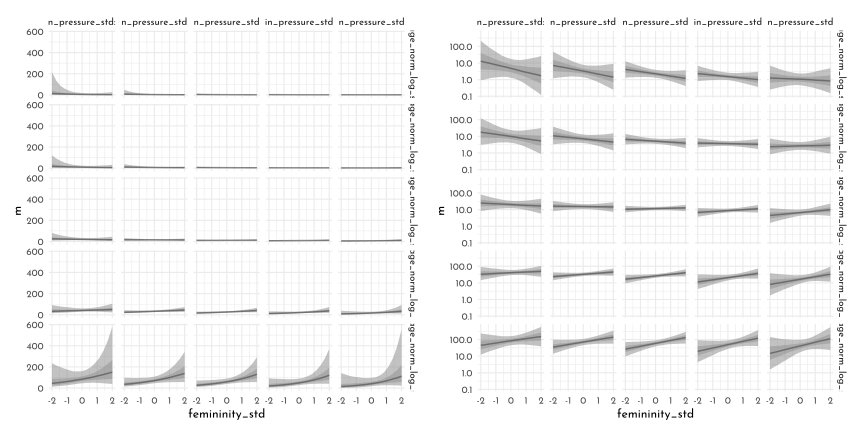

**H5**


```r
data_trolley_list_harm <- data_trolley  %>% 
  dplyr::select(response, contact, sex) %>% 
  as.list()

model_trolley_harm <- ulam(
  flist = alist(
    response ~ dordlogit( phi, cutpoints),
    phi <- beta_c[sex] * contact,
    beta_c[sex] ~ dnorm(0, .5),
    cutpoints ~ dnorm(0, 1.5)
  ),
  data = data_trolley_list_harm,
  chains = 4,
  cores = 4)
```


```r
precis(model_trolley_harm, depth = 2) %>% 
  knit_precis()
```


|param        |  mean|   sd|  5.5%| 94.5%|   n_eff| Rhat4|
|:------------|-----:|----:|-----:|-----:|-------:|-----:|
|beta_c[1]    | -0.77| 0.06| -0.87| -0.67| 2599.91|     1|
|beta_c[2]    | -0.41| 0.06| -0.50| -0.31| 2324.70|     1|
|cutpoints[1] | -2.05| 0.03| -2.10| -2.00| 1461.24|     1|
|cutpoints[2] | -1.39| 0.03| -1.44| -1.35| 1785.28|     1|
|cutpoints[3] | -0.84| 0.02| -0.87| -0.80| 1957.18|     1|
|cutpoints[4] |  0.14| 0.02|  0.11|  0.18| 2034.32|     1|
|cutpoints[5] |  0.79| 0.02|  0.75|  0.83| 1862.68|     1|
|cutpoints[6] |  1.68| 0.03|  1.63|  1.72| 2406.00|     1|


**H6**


```r
data(Fish)

data_fish <- Fish %>% 
  as_tibble() %>% 
  mutate(hours_log = log(hours))
```


```r
model_fish <- ulam(
  flist = alist(
    fish_caught | fish_caught > 0 ~ custom( log1m(p) + poisson_lpmf(fish_caught | lambda) ),
    fish_caught | fish_caught == 0 ~ custom( log_mix( p, 0, poisson_lpmf(0 | lambda) ) ),
    logit(p) <- alpha_p,
    log(lambda) <- hours_log + alpha_l,
    alpha_p ~ dnorm(-1.5, 1),
    alpha_l ~ dnorm(1, .5)
  ),
  data = data_fish,
  chains = 4,
  cores = 4
)
```


```r
precis(model_fish) %>% 
  knit_precis()
```


|param   |  mean|   sd|  5.5%| 94.5%|   n_eff| Rhat4|
|:-------|-----:|----:|-----:|-----:|-------:|-----:|
|alpha_p | -0.78| 0.18| -1.06| -0.48| 1263.09|  1.00|
|alpha_l | -0.14| 0.03| -0.19| -0.09| 1154.07|  1.01|


**H7**


```r
dag <- dagify(
  R ~ E + A,
  E ~ A,
  exposure = "E",
  outcome = "R") %>% 
  tidy_dagitty(.dagitty = .,
               layout = tibble(x = c(0,.5,1),
                               y = c(1,0, 1))) %>%
  mutate(stage = if_else(name == "R", "response",
                         if_else(name %in% c("A", "E"),
                                 "predictor", "confounds")))
plot_dag(dag, clr_in = clr_current) + 
  coord_fixed(ratio = .6)
```

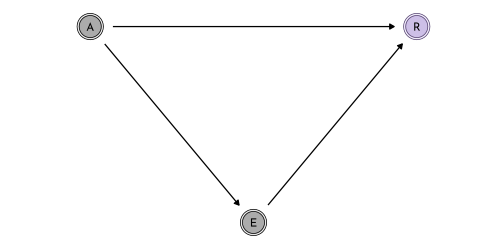


```r
data_trolley_list_age <- data_trolley %>% 
  dplyr::select(response, education_idx, age_scl) %>% 
  as.list() %>% 
  c(., list(alpha = rep(2, 7)))
```


```{.r .bg-save}
model_trolley_education_age <- ulam(
  flist = alist(
    response ~ ordered_logistic( phi, kappa ),
    phi <- beta_e * sum(delta_j[1:education_idx]) +
      beta_a * age_scl,
    kappa ~ normal( 0, 1.5 ),
    c(beta_e, beta_a) ~ normal( 0, 1 ),
    vector[8]: delta_j <<- append_row( 0, delta ),
    simplex[7]: delta ~ dirichlet( alpha )
  ),
  data = data_trolley_list_age,
  chains = 4,
  cores = 4
)

write_rds(model_trolley_education_age, file = "brms/model_trolley_education_age.rds")
```


```r
model_trolley_education_age <- readRDS("brms/model_trolley_education_age.rds")
```


```r
precis(model_trolley_education_age) %>% 
  knit_precis()
```


|param  |  mean|   sd| 5.5%| 94.5%|  n_eff| Rhat4|
|:------|-----:|----:|----:|-----:|------:|-----:|
|beta_a | -0.42| 0.12| -0.6| -0.22| 570.84|  1.01|
|beta_e |  0.16| 0.17| -0.2|  0.34| 264.85|  1.02|

**H8**


```r
data_trolley_list_age_gender <- data_trolley %>% 
  dplyr::select(response, education_idx, age_scl, sex) %>% 
  as.list() %>% 
  c(., list(alpha = rep(2, 7)))

dag <- dagify(
  R ~ E + A + G,
  E ~ A + G,
  exposure = "E",
  outcome = "R") %>% 
  tidy_dagitty(.dagitty = .,
               layout = tibble(x = c(0,.5,1, .5),
                               y = c(1,1, 1, 0))) %>%
  mutate(stage = if_else(name == "R", "response",
                         if_else(name %in% c("A", "E", "G"),
                                 "predictor", "confounds")))
plot_dag(dag, clr_in = clr_current) + 
  coord_fixed(ratio = .6)
```


```{.r .bg-save}
model_trolley_education_age_gender <- ulam(
  flist = alist(
    response ~ ordered_logistic( phi, kappa ),
    phi <- beta_e[sex] * sum(delta_j[1:education_idx]) +
      beta_a[sex] * age_scl,
    kappa ~ normal( 0, 1.5 ),
    beta_e[sex] ~ normal( 0, 1 ),
    beta_a[sex] ~ normal( 0, 1 ),
    vector[8]: delta_j <<- append_row( 0, delta ),
    simplex[7]: delta ~ dirichlet( alpha )
  ),
  data = data_trolley_list_age_gender,
  chains = 4,
  cores = 4
)

write_rds(model_trolley_education_age_gender,
          file = "brms/model_trolley_education_age_gender.rds")
```


```r
model_trolley_education_age_gender <- readRDS("brms/model_trolley_education_age_gender.rds")
```


```r
precis(model_trolley_education_age_gender, depth = 2 ) %>% 
  knit_precis()
```


|param     |  mean|   sd|  5.5%| 94.5%|   n_eff| Rhat4|
|:---------|-----:|----:|-----:|-----:|-------:|-----:|
|kappa[1]  | -2.20| 0.09| -2.35| -2.07|  986.01|  1.00|
|kappa[2]  | -1.55| 0.09| -1.70| -1.42|  998.19|  1.00|
|kappa[3]  | -1.00| 0.09| -1.14| -0.86| 1045.09|  1.00|
|kappa[4]  | -0.01| 0.09| -0.15|  0.13| 1057.49|  1.00|
|kappa[5]  |  0.65| 0.09|  0.51|  0.78| 1083.92|  1.00|
|kappa[6]  |  1.54| 0.09|  1.40|  1.68| 1075.90|  1.00|
|beta_e[1] | -0.70| 0.14| -0.93| -0.49|  869.26|  1.01|
|beta_e[2] |  0.30| 0.14|  0.06|  0.53| 1042.38|  1.00|
|beta_a[1] | -0.06| 0.14| -0.29|  0.17| 1495.12|  1.00|
|beta_a[2] | -0.46| 0.14| -0.69| -0.24| 1842.19|  1.00|
|delta[1]  |  0.18| 0.09|  0.05|  0.34| 1837.60|  1.00|
|delta[2]  |  0.15| 0.09|  0.03|  0.31| 1795.78|  1.00|
|delta[3]  |  0.27| 0.11|  0.10|  0.45| 1370.80|  1.00|
|delta[4]  |  0.09| 0.06|  0.02|  0.19| 1908.61|  1.00|
|delta[5]  |  0.04| 0.03|  0.01|  0.10| 1739.86|  1.00|
|delta[6]  |  0.23| 0.07|  0.12|  0.34| 1930.22|  1.00|
|delta[7]  |  0.04| 0.03|  0.01|  0.09| 2817.29|  1.00|

## {brms} section

### Over-dispersed counts

#### Beta-binomial

> *First, we need to use the `custom_family()` function to define the name and parameters of the beta-binomial distribution for use in `brm()`. Second, we have to define some functions for Stan which are not defined in Stan itself. We’ll save them as `stan_funs`. Third, we’ll make a `stanvar()` statement which will allow us to pass our `stan_funs` to `brm()`.*


```r
beta_binomial2 <- custom_family(
  "beta_binomial2",
  dpars = c("mu", "phi"),
  links = c("logit", "log"),
  lb = c(NA, 2),
  type = "int",
  vars = "vint1[n]"
)

stan_funs <- "
  real beta_binomial2_lpmf(int y, real mu, real phi, int T) {
    return beta_binomial_lpmf(y | T, mu * phi, (1 - mu) * phi);
  }
  int beta_binomial2_rng(real mu, real phi, int T) {
    return beta_binomial_rng(T, mu * phi, (1 - mu) * phi);
  }
"

stanvars <- stanvar(scode = stan_funs, block = "functions")
```

> *Did you notice the `lb = c(NA, 2)` portion of the code defining `beta_binomial2()`? In Bürkner’s vignette, he set the lower bound of `phi` to zero. Since McElreath wanted the lower bound for $\phi$ to be 2, we just set that as the default in the likelihood. We should clarify two more points:*
>
> *First, what McElreath referred to as the shape parameter, $\theta$, Bürkner called the precision parameter, $\phi$. In our exposition, above, we followed Kruschke’s convention and called it $\kappa$. These are all the same thing: $\theta$, $\phi$, and $\kappa$ are all the same thing. Perhaps less confusingly, what McElreath called the `pbar` parameter, $\bar{p}$, Bürkner simply refers to as $\mu$.*
>
> *Second, we’ve become accustomed to using the `y | trials() ~ ...` syntax when defining our formula arguments for binomial models. Here we are replacing `trials()` with `vint()`. From Bürkner’s Define custom response distributions with brms vignette, we read:*

> *To provide information about the number of trials (an integer variable), we are going to use the addition argument `vint()`, which can only be used in custom families. Similarly, if we needed to include additional vectors of real data, we would use `vreal()`. Actually, for this particular example, we could more elegantly apply the addition argument `trials()` instead of `vint()` as in the basic binomial model. However, since the present vignette is meant to give a general overview of the topic, we will go with the more general method.*
>
> *We now have all components together to fit our custom beta-binomial model:*


```r
data_ucb_tib <- data_ucb %>% 
  dplyr::select(admit, applications,  gid) %>% 
  mutate(gid = factor(gid))

brms_c12_model_ucb_beta <- brm(
  data = data_ucb_tib, 
  family = beta_binomial2,  # here's our custom likelihood
  admit | vint(applications) ~ 0 + gid,
  prior = c(prior(normal(0, 1.5), class = b),
            prior(exponential(1), class = phi)),
  iter = 2000, warmup = 1000,
  cores = 4, chains = 4,
  stanvars = stanvars,  # note our `stanvars`
  seed = 42,
  file = "brms/brms_c12_model_ucb_beta")
```


```r
posterior_ucb <- as_draws_df(brms_c12_model_ucb_beta)

posterior_ucb %>% 
  transmute(da = b_gid1 - b_gid2) %>% 
  mean_qi(.width = .89) %>% 
  mutate_if(is.double, round, digits = 3)
```

```
#> # A tibble: 1 × 6
#>       da .lower .upper .width .point .interval
#>    <dbl>  <dbl>  <dbl>  <dbl> <chr>  <chr>    
#> 1 -0.119  -1.04   0.81   0.89 mean   qi
```


```r
p1 <- posterior_ucb %>% 
  mutate(iter  = 1:n(),
         p_bar = inv_logit_scaled(b_gid2)) %>% 
  slice_sample(n = 100) %>% 
  expand(nesting(iter, p_bar, phi),
         x = seq(from = 0, to = 1, by = .005)) %>% 
  mutate(density = pmap_dbl(list(x, p_bar, phi), rethinking::dbeta2)) %>% 
   ggplot(aes(x = x, y = density)) + 
  geom_line(aes(group = iter),
            alpha = .4, color = clr0d) +
    stat_function(fun = rethinking::dbeta2,
                args = list(prob = mean(inv_logit_scaled(posterior_ucb$b_gid2)),
                            theta = mean(posterior_ucb$phi)),
                size = .5, linetype = 2, 
                color = clr_dark,
                xlim = c(0,1))+
  coord_cartesian(ylim = c(0, 3)) +
  labs(subtitle = "distribution of female admission rates",
       x = "probability admit")
```

> *Before we can do our variant of Figure 12.1.b, we’ll need to define a few more custom functions. The `log_lik_beta_binomial2()` and `posterior_predict_beta_binomial2()` functions are required for `brms::predict()` to work with our `family = beta_binomial2` brmfit object. Similarly, `posterior_epred_beta_binomial2()` is required for `brms::fitted()` to work properly. And before all that, we need to throw in a line with the `expose_functions()` function. Just go with it.*


```r
expose_functions(brms_c12_model_ucb_beta,
                 vectorize = TRUE)

# required to use `predict()`
log_lik_beta_binomial2 <- function(i, prep) {
  mu     <- prep$dpars$mu[, i]
  phi    <- prep$dpars$phi
  trials <- prep$data$vint1[i]
  y      <- prep$data$Y[i]
  beta_binomial2_lpmf(y, mu, phi, trials)
}

posterior_predict_beta_binomial2 <- function(i, prep, ...) {
  mu     <- prep$dpars$mu[, i]
  phi    <- prep$dpars$phi
  trials <- prep$data$vint1[i]
  beta_binomial2_rng(mu, phi, trials)
}

# required to use `fitted()`
posterior_epred_beta_binomial2 <- function(prep) {
  mu     <- prep$dpars$mu
  trials <- prep$data$vint1
  trials <- matrix(trials, nrow = nrow(mu), ncol = ncol(mu), byrow = TRUE)
  mu * trials
}
```


```r
p2 <- predict(brms_c12_model_ucb_beta) %>%
  as_tibble() %>% 
  transmute(ll = Q2.5,
            ul = Q97.5) %>%
  bind_cols(
    # the fitted intervals
    fitted(brms_c12_model_ucb_beta) %>% as_tibble(),
    # the original data used to fit the model) %>% 
    brms_c12_model_ucb_beta$data
    ) %>% 
  mutate(case = 1:12) %>% 
  # plot!
  ggplot(aes(x = case)) +
  geom_linerange(aes(ymin = ll / applications, 
                     ymax = ul / applications),
                 color = clr0, 
                 size = 2.5) +
  geom_pointrange(aes(ymin = Q2.5  / applications, 
                      ymax = Q97.5 / applications, 
                      y = Estimate/applications),
                  color = clr0dd,
                  size = 1/2,
                  shape = 1) +
  geom_point(aes(y = admit/applications),
             color = clr_dark,
             size = 2) +
  scale_x_continuous(breaks = 1:12) +
  scale_y_continuous(breaks = 0:5 / 5, limits = c(0, 1)) +
  labs(subtitle = "Posterior validation check",
       caption = expression(italic(Note.)*" A = admittance probability"),
       y = "A") +
  theme(axis.ticks.x = element_blank(),
        legend.position = "none")
```


```r
p1 + p2
```


#### Negative-binomial or gamma-Poisson

> *We have deviated from McElreath’s convention of using $\alpha$ for the model in favor $\beta_{0}$. This is because __brms__ parameterizes the gamma likelihood in terms of $\mu$ and shape and, as we discussed above, shape is typically denoted as $\alpha$.*


```r
get_prior(data = data_kline, 
          family = negbinomial,
          total_tools ~ 1)
```

```
#>                   prior     class coef group resp dpar nlpar bound  source
#>  student_t(3, 3.4, 2.5) Intercept                                  default
#>       gamma(0.01, 0.01)     shape                                  default
```

> *`gamma(0.01, 0.01)` is the __brms__ default for the shape parameter in this model. Within __brms__, priors using the gamma distribution are based on the shape-rate $(\alpha - \phi)$ parameterization.*


```r
ggplot(data = tibble(x = seq(from = 0, to = 60, by = .1)),
       aes(x = x, y = dgamma(x, 0.01, 0.01))) +
  geom_area(fill = clr0d, color = clr0dd) +
  scale_x_continuous(NULL) +
  scale_y_continuous(NULL, breaks = NULL) +
  coord_cartesian(xlim = c(0, 50)) +
  ggtitle(expression(brms~default~gamma(0.01*", "*0.01)~shape~prior))
```


```r
brms_c12_model_ocean_sci_gamma_prep <- brm(
  data = data_kline, 
  family = negbinomial,
  total_tools ~ 1,
  prior = c(prior(normal(3, 0.5), class = Intercept),  # beta_0
            prior(gamma(0.01, 0.01), class = shape)),  # alpha
  iter = 2000, warmup = 1000,
  cores = 4, chains = 4,
  seed = 42,
  file = "brms/brms_c12_model_ocean_sci_gamma_prep")
```


```r
ocean_predictions <- predict(brms_c12_model_ocean_sci_gamma_prep,
                             summary = FALSE)

ocean_predictions %>% 
  as_tibble() %>% 
  set_names(data_kline$culture) %>% 
  pivot_longer(everything(),
               names_to = "culture",
               values_to = "lambda") %>% 
  
  ggplot(aes(x = lambda)) +
  geom_density(color = clr0d, 
               fill = fll0) +
  scale_x_continuous("lambda_culture", breaks = 0:2 * 100) +
  scale_y_continuous(NULL, breaks = NULL) +
  coord_cartesian(xlim = c(0, 210)) +
  facet_wrap(~ culture, nrow = 2)
```

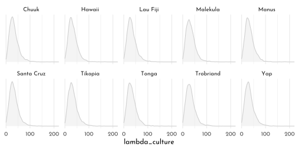


```r
ocean_posterior <- as_draws_df(brms_c12_model_ocean_sci_gamma_prep) %>% 
  as_tibble()

ocean_posterior %>% 
  mutate(mu    = exp(b_Intercept),
         alpha = shape) %>%
  pivot_longer(mu:alpha, names_to = "parameter") %>% 
  ggplot(aes(x = value)) +
  geom_density(color = clr0d, 
               fill = fll0) +
  scale_y_continuous(NULL, breaks = NULL) +
  labs(title = "Behold our gamma parameters!",
       x = "posterior") +
  facet_wrap(~ parameter, scales = "free")
```


$$
\theta = \frac{\mu}{\alpha}
$$

```r
p1 <- ocean_posterior %>% 
  mutate(mu    = exp(b_Intercept),
         alpha = shape) %>%
  mutate(theta = mu / alpha) %>% 
  
  ggplot(aes(x = theta)) +
  geom_density(color = clr0d, 
               fill = fll0) +
  scale_y_continuous(NULL, breaks = NULL) +
  labs(subtitle = glue("We define the scale as *{mth('\U03B8')} = {mth('\U03BC')} / {mth('\U03B1')}*"),
       x = "posterior") +
  coord_cartesian(xlim = c(0, 40)) +
  theme(plot.subtitle = element_markdown())

set.seed(42)

# wrangle to get 200 draws
p2 <- ocean_posterior %>% 
  mutate(iter  = 1:n(),
         alpha = shape,
         theta = exp(b_Intercept) / shape) %>%
  slice_sample(n = 200) %>% 
  expand(nesting(iter, alpha, theta),
         x = 0:250) %>% 
  mutate(density = dgamma(x, shape = alpha, scale = theta)) %>% 
  
  # plot
  ggplot(aes(x = x, y = density)) +
  geom_line(aes(group = iter),
            alpha = .1,
            color = clr0dd) +
  scale_y_continuous(NULL, breaks = NULL) +
  labs(subtitle = glue("200 credible gamma densities for {mth('\U03BB')}"),
       x = mth('\U03BB')) +
  coord_cartesian(xlim = c(0, 170),
                  ylim = c(0, 0.045)) +
  theme(plot.subtitle = element_markdown(),
        axis.title.x = element_markdown())

p1 + p2
```

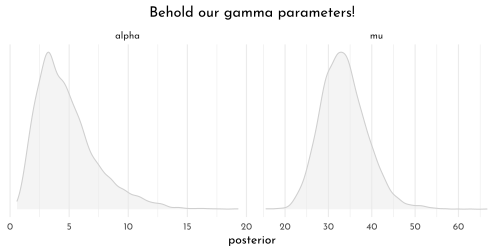


```r
data_kline_f <- data_kline %>% 
  mutate(contact_idx = factor(contact_idx))

brms_c12_model_ocean_sci_gamma <- brm(
  data = data_kline_f, 
  family = negbinomial(link = "identity"),
  bf(total_tools ~ exp(b0) * population^b1 / g,
     b0 + b1 ~ 0 + contact_idx,
     g ~ 1,
     nl = TRUE),
  prior = c(prior(normal(1, 1), nlpar = b0),
            prior(exponential(1), nlpar = b1, lb = 0),
            prior(exponential(1), nlpar = g, lb = 0),
            prior(exponential(1), class = shape)),
  iter = 2000, warmup = 1000,
  chains = 4, cores = 4,
  seed = 42,
  control = list(adapt_delta = .95),
  file = "brms/brms_c12_model_ocean_sci_gamma") 
```


```r
brms_c12_model_ocean_sci_gamma <- add_criterion(brms_c12_model_ocean_sci_gamma, "loo")
loo(brms_c12_model_ocean_sci_gamma)
```

```
#> 
#> Computed from 4000 by 10 log-likelihood matrix
#> 
#>          Estimate  SE
#> elpd_loo    -41.3 1.7
#> p_loo         1.2 0.2
#> looic        82.6 3.3
#> ------
#> Monte Carlo SE of elpd_loo is 0.0.
#> 
#> Pareto k diagnostic values:
#>                          Count Pct.    Min. n_eff
#> (-Inf, 0.5]   (good)     9     90.0%   1674      
#>  (0.5, 0.7]   (ok)       1     10.0%   822       
#>    (0.7, 1]   (bad)      0      0.0%   <NA>      
#>    (1, Inf)   (very bad) 0      0.0%   <NA>      
#> 
#> All Pareto k estimates are ok (k < 0.7).
#> See help('pareto-k-diagnostic') for details.
```


```r
brms_c11_model_ocean_scientific <- readRDS("brms/brms_c11_model_ocean_scientific.rds")
```


```r
new_ocean <- distinct(data_kline_f, contact_idx) %>% 
  expand(contact_idx, 
         population = seq(from = 0, to = 300000, length.out = 100))

p1 <- fitted(brms_c11_model_ocean_scientific,
         newdata = new_ocean,
         probs = c(.055, .945)) %>%
  as_tibble() %>%
  bind_cols(new_ocean) %>%
  ggplot(aes(x = population, group = contact_idx, color = contact_idx)) +
  geom_smooth(aes(y = Estimate,
                  ymin = Q5.5, ymax = Q94.5,
                  fill = after_scale(clr_alpha(color))),
              stat = "identity",
              alpha = 1/4, size = 1/2) +
  geom_point(data = bind_cols(data_kline_f,
                              brms_c11_model_ocean_scientific$criteria$loo$diagnostics),
             aes(y = total_tools, size = pareto_k),
             alpha = 4/5) +
  labs(subtitle = "pure Poisson model",
       y = "total tools")
```


```r
p2 <- fitted(brms_c12_model_ocean_sci_gamma,
         newdata = new_ocean,
         probs = c(.055, .945)) %>%
  as_tibble() %>%
  bind_cols(new_ocean) %>%
  ggplot(aes(x = population,
             group = contact_idx,
             color = contact_idx)) +
  geom_smooth(aes(y = Estimate,
                  ymin = Q5.5, ymax = Q94.5,
                  fill = after_scale(clr_alpha(color))),
              stat = "identity",
              alpha = 1/4, size = 1/2) +
  geom_point(data = bind_cols(data_kline_f,
                              brms_c12_model_ocean_sci_gamma$criteria$loo$diagnostics),
             aes(y = total_tools, size = pareto_k),
             alpha = 4/5) +
  scale_y_continuous(NULL, labels = NULL) +
  labs(subtitle = "gamma-Poisson model")
```


```r
p1 + p2 &
  scale_color_manual(values = c(`1` = clr0dd, `2` = "black"), guide = "none") &
  scale_size_continuous(guide = "none",range = c(2, 5)) &
   coord_cartesian(xlim = range(data_kline_f$population),
                  ylim = range(data_kline_f$total_tools)) 
```

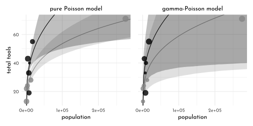


```r
predict(brms_c12_model_ocean_sci_gamma,
        summary = FALSE) %>% 
  as_tibble() %>% 
  set_names(data_kline_f$culture) %>% 
  pivot_longer(everything(),
               names_to = "culture",
               values_to = "lambda") %>% 
  left_join(data_kline_f) %>% 
  ggplot(aes(x = lambda, y = 0)) +
  stat_halfeye(point_interval = mean_qi, .width = .5,
               fill = fll0dd,
               color = "black") +
  geom_vline(aes(xintercept = total_tools),
             color = clr_dark, linetype = 3) +
  scale_x_continuous("lambda_culture", breaks = 0:2 * 100) +
  scale_y_continuous(NULL, breaks = NULL) +
  coord_cartesian(xlim = c(0, 210)) +
  facet_wrap(~ culture, nrow = 2)
```


### Zero-inflated outcomes


```r
brms_c12_model_books_drunk <- brm(
  data = data_books, 
  family = zero_inflated_poisson,
  books ~ 1,
  prior = c(prior(normal(1, 0.5), class = Intercept),
            prior(beta(2, 6), class = zi)),  # the brms default is beta(1, 1)
  iter = 2000, warmup = 1000,
  chains = 4, cores = 4,
  seed = 42,
  file = "brms/brms_c12_model_books_drunk") 
```


```r
priors <- c(prior(beta(1, 1), class = zi),
    prior(beta(2, 6), class = zi))

priors %>% 
  parse_dist(prior)
```

```
#>        prior class coef group resp dpar nlpar bound source .dist .args
#> 1 beta(1, 1)    zi                                    user  beta  1, 1
#> 2 beta(2, 6)    zi                                    user  beta  2, 6
```


```r
priors %>% 
  parse_dist(prior) %>%
  ggplot(aes(y = prior, dist = .dist, args = .args, fill = prior)) +
  stat_dist_halfeye(.width = c(.89, .5),
                    shape = 21,
                    point_fill = clr0d) +
  scale_fill_manual(values = c(clr0d, clr_dark)) +
  scale_x_continuous("zi", breaks = c(0, .5, 1)) +
  ylab(NULL) +
  theme(legend.position = "none")
```

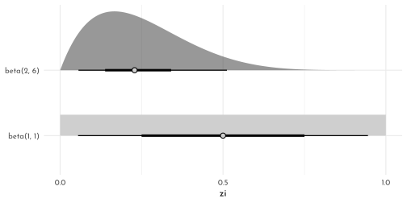


```r
fixef(brms_c12_model_books_drunk)[1, ] %>%
  exp()
```

```
#>  Estimate Est.Error      Q2.5     Q97.5 
#> 0.9496241 1.0937009 0.7959164 1.1318121
```

The **Stan** code from the **brms** model:


```r
brms_c12_model_books_drunk$model
```

```
#> // generated with brms 2.16.1
#> functions {
#>   /* zero-inflated poisson log-PDF of a single response 
#>    * Args: 
#>    *   y: the response value 
#>    *   lambda: mean parameter of the poisson distribution
#>    *   zi: zero-inflation probability
#>    * Returns:  
#>    *   a scalar to be added to the log posterior 
#>    */ 
#>   real zero_inflated_poisson_lpmf(int y, real lambda, real zi) { 
#>     if (y == 0) { 
#>       return log_sum_exp(bernoulli_lpmf(1 | zi), 
#>                          bernoulli_lpmf(0 | zi) + 
#>                          poisson_lpmf(0 | lambda)); 
#>     } else { 
#>       return bernoulli_lpmf(0 | zi) +  
#>              poisson_lpmf(y | lambda); 
#>     } 
#>   }
#>   /* zero-inflated poisson log-PDF of a single response 
#>    * logit parameterization of the zero-inflation part
#>    * Args: 
#>    *   y: the response value 
#>    *   lambda: mean parameter of the poisson distribution
#>    *   zi: linear predictor for zero-inflation part 
#>    * Returns:  
#>    *   a scalar to be added to the log posterior 
#>    */ 
#>   real zero_inflated_poisson_logit_lpmf(int y, real lambda, real zi) { 
#>     if (y == 0) { 
#>       return log_sum_exp(bernoulli_logit_lpmf(1 | zi), 
#>                          bernoulli_logit_lpmf(0 | zi) + 
#>                          poisson_lpmf(0 | lambda)); 
#>     } else { 
#>       return bernoulli_logit_lpmf(0 | zi) +  
#>              poisson_lpmf(y | lambda); 
#>     } 
#>   }
#>   /* zero-inflated poisson log-PDF of a single response
#>    * log parameterization for the poisson part
#>    * Args: 
#>    *   y: the response value 
#>    *   eta: linear predictor for poisson distribution
#>    *   zi: zero-inflation probability
#>    * Returns:  
#>    *   a scalar to be added to the log posterior 
#>    */ 
#>   real zero_inflated_poisson_log_lpmf(int y, real eta, real zi) { 
#>     if (y == 0) { 
#>       return log_sum_exp(bernoulli_lpmf(1 | zi), 
#>                          bernoulli_lpmf(0 | zi) + 
#>                          poisson_log_lpmf(0 | eta)); 
#>     } else { 
#>       return bernoulli_lpmf(0 | zi) +  
#>              poisson_log_lpmf(y | eta); 
#>     } 
#>   }
#>   /* zero-inflated poisson log-PDF of a single response 
#>    * log parameterization for the poisson part
#>    * logit parameterization of the zero-inflation part
#>    * Args: 
#>    *   y: the response value 
#>    *   eta: linear predictor for poisson distribution
#>    *   zi: linear predictor for zero-inflation part 
#>    * Returns:  
#>    *   a scalar to be added to the log posterior 
#>    */ 
#>   real zero_inflated_poisson_log_logit_lpmf(int y, real eta, real zi) { 
#>     if (y == 0) { 
#>       return log_sum_exp(bernoulli_logit_lpmf(1 | zi), 
#>                          bernoulli_logit_lpmf(0 | zi) + 
#>                          poisson_log_lpmf(0 | eta)); 
#>     } else { 
#>       return bernoulli_logit_lpmf(0 | zi) +  
#>              poisson_log_lpmf(y | eta); 
#>     } 
#>   }
#>   // zero-inflated poisson log-CCDF and log-CDF functions
#>   real zero_inflated_poisson_lccdf(int y, real lambda, real zi) { 
#>     return bernoulli_lpmf(0 | zi) + poisson_lccdf(y | lambda); 
#>   }
#>   real zero_inflated_poisson_lcdf(int y, real lambda, real zi) { 
#>     return log1m_exp(zero_inflated_poisson_lccdf(y | lambda, zi));
#>   }
#> }
#> data {
#>   int<lower=1> N;  // total number of observations
#>   int Y[N];  // response variable
#>   int prior_only;  // should the likelihood be ignored?
#> }
#> transformed data {
#> }
#> parameters {
#>   real Intercept;  // temporary intercept for centered predictors
#>   real<lower=0,upper=1> zi;  // zero-inflation probability
#> }
#> transformed parameters {
#> }
#> model {
#>   // likelihood including constants
#>   if (!prior_only) {
#>     // initialize linear predictor term
#>     vector[N] mu = Intercept + rep_vector(0.0, N);
#>     for (n in 1:N) {
#>       target += zero_inflated_poisson_log_lpmf(Y[n] | mu[n], zi);
#>     }
#>   }
#>   // priors including constants
#>   target += normal_lpdf(Intercept | 1, 0.5);
#>   target += beta_lpdf(zi | 2, 6);
#> }
#> generated quantities {
#>   // actual population-level intercept
#>   real b_Intercept = Intercept;
#> }
```

### Ordered categorical outcomes

> *Whereas in `rethinking::ulam()` you indicate the likelihood by `<criterion> ~ dordlogit(0 , c(<the thresholds>)`, in `brms::brm()` you code `family = cumulative`. Here’s how to fit the intercepts-only model.*

#### Describing an ordered distribution with intercepts


```r
# define the start values
inits <- list(`Intercept[1]` = -2,
              `Intercept[2]` = -1,
              `Intercept[3]` = 0,
              `Intercept[4]` = 1,
              `Intercept[5]` = 2,
              `Intercept[6]` = 2.5)

inits_list <- list(inits, inits,
                   inits, inits)

brms_c12_model_trolley <- brm(
  data = data_trolley, 
  family = cumulative,
  response ~ 1,
  prior(normal(0, 1.5), class = Intercept),
  iter = 2000, warmup = 1000,
  cores = 4, chains = 4,
  seed = 42,
  inits = inits_list,  # here we add our start values
  file = "brms/brms_c12_model_trolley")  
```


```r
brms_c12_model_trolley %>% 
  fixef() %>% 
  inv_logit_scaled() %>% 
  round(digits = 3) %>% 
  as.data.frame() %>% 
  knit_precis()
```


|param        | Estimate| Est.Error| Q2.5| Q97.5|
|:------------|--------:|---------:|----:|-----:|
|Intercept[1] |     0.13|      0.51| 0.12|  0.14|
|Intercept[2] |     0.22|      0.51| 0.21|  0.23|
|Intercept[3] |     0.33|      0.50| 0.32|  0.34|
|Intercept[4] |     0.56|      0.50| 0.55|  0.57|
|Intercept[5] |     0.71|      0.50| 0.70|  0.72|
|Intercept[6] |     0.85|      0.51| 0.85|  0.86|

>  But recall that the posterior $SD$ (i.e., the ‘Est.Error’ values) are not valid using that approach. If you really care about them, you’ll need to work with the `as_draws_df()`.


```r
as_draws_df(brms_c12_model_trolley) %>% 
  mutate_all(inv_logit_scaled) %>% 
  pivot_longer(starts_with("b_"), names_to = "param") %>% 
  group_by(param) %>% 
  summarise(mean = mean(value),
            sd   = sd(value),
            ll   = quantile(value, probs = .025),
            ul   = quantile(value, probs = .975)) %>% 
  knitr::kable()
```


|param          |      mean|        sd|        ll|        ul|
|:--------------|---------:|---------:|---------:|---------:|
|b_Intercept[1] | 0.1282508| 0.0033712| 0.1215212| 0.1348983|
|b_Intercept[2] | 0.2198645| 0.0041508| 0.2117238| 0.2278593|
|b_Intercept[3] | 0.3277496| 0.0046961| 0.3184706| 0.3368620|
|b_Intercept[4] | 0.5616384| 0.0049927| 0.5516282| 0.5713468|
|b_Intercept[5] | 0.7088398| 0.0045180| 0.6999152| 0.7175442|
|b_Intercept[6] | 0.8543232| 0.0035578| 0.8474255| 0.8611575|


```r
fixef(brms_c12_model_trolley) %>% 
  as_tibble() %>% 
  rownames_to_column("intercept") %>% 
  mutate(response = str_extract(intercept, "\\d") %>% 
           as.double()) %>% 
  ggplot(aes(x = response, y = Estimate,
             ymin = Q2.5, ymax = Q97.5,
             fill = response)) +
  geom_line(color = clr0dd) +
  geom_point(shape = 21,
             colour = clr0dd, fill = clr0, 
             size = 1.5, stroke = 1) +
  geom_linerange(color = clr0dd) +
  scale_x_continuous(breaks = 1:7, limits = c(1, 7)) +
  ylab("log-cumulative-odds") 
```


#### Adding predictor variables


```r
brms_c12_model_trolley_predict <- brm(
  data = data_trolley, 
  family = cumulative,
  response ~ 1 + action + contact + intention + intention:action + intention:contact,
  prior = c(prior(normal(0, 1.5), class = Intercept),
            prior(normal(0, 0.5), class = b)),
  iter = 2000, warmup = 1000,
  cores = 4, chains = 4,
  seed = 42,
  file = "brms/brms_c12_model_trolley_predict")
```


```r
as_draws_df(brms_c12_model_trolley_predict) %>% 
  as_tibble() %>% 
  select(b_action:`b_contact:intention`) %>% 
  pivot_longer(everything()) %>% 
    ggplot(aes(x = value, y = name)) +
  geom_vline(xintercept = 0, alpha = 1/5, linetype = 3) +
  stat_gradientinterval(.width = .5, size = 1, point_size = 3/2, shape = 21,
                        point_fill = clr0, 
                        fill = clr0dd, 
                        color = clr_dark) +
  scale_x_continuous("marginal posterior", breaks = -5:0 / 4) +
  scale_y_discrete(NULL) +
  coord_cartesian(xlim = c(-1.4, 0))
```

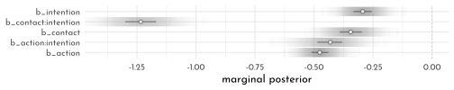


```r
# new_trolley <- d %>% 
#   distinct(action, contact, intention) %>% 
#   mutate(combination = str_c(action, contact, intention, sep = "_"))

trolley_fitted_prep <- fitted(brms_c12_model_trolley_predict,
         newdata = new_trolley,
         summary = FALSE)

trolley_fitted <- rbind(trolley_fitted_prep[, , 1],
      trolley_fitted_prep[, , 2],
      trolley_fitted_prep[, , 3],
      trolley_fitted_prep[, , 4],
      trolley_fitted_prep[, , 5],
      trolley_fitted_prep[, , 6],
      trolley_fitted_prep[, , 7]) %>% 
  as_tibble() %>% 
  set_names(pull(new_trolley, combination)) %>% 
  mutate(response = rep(1:7, each = n() / 7),
         iter     = rep(1:4000, times = 7)) %>% 
  pivot_longer(-c(iter, response),
               names_to = c("action", "contact", "intention"),
               names_sep = "_",
               values_to = "pk") %>% 
  mutate(intention = intention %>% as.integer())
```


```r
p1 <- trolley_fitted %>% 
  # unnecessary for these plots
  filter(response < 7) %>% 
  # this will help us define the three panels of the triptych
  mutate(facet = factor(glue("action: {action}; contact: {contact}"),
                        levels = label_levels)) %>% 
  # these next three lines allow us to compute the cumulative probabilities
  group_by(iter, facet, intention) %>% 
  arrange(iter, facet, intention, response) %>% 
  mutate(probability = cumsum(pk)) %>% 
  ungroup() %>% 
  # these next three lines are how we randomly selected 50 posterior draws
  nest(data = -iter) %>% 
  slice_sample(n = 50) %>%
  unnest(data) %>% 
  # plot!
  ggplot(aes(x = intention, y = probability)) +
  geom_line(aes(group = interaction(iter, response), color = probability),
            alpha = 1/10) +
  geom_point(data = data_trolley %>%  # wrangle the original data to make the dots
               group_by(intention, contact, action) %>% 
               count(response) %>% 
               mutate(probability = cumsum(n / sum(n)),
                      facet = factor(glue("action: {action}; contact: {contact}"),
                        levels = label_levels)) %>% 
               filter(response < 7),
             color = clr_dark) +
  scale_color_gradient(low = clr0,
                        high = clr_dark) +
  scale_x_continuous("intention", breaks = 0:1) +
  scale_y_continuous(breaks = c(0, .5, 1), limits = 0:1) +
  theme(legend.position = "none") +
  facet_wrap(~ facet)


trolley_perdictions <- predict(brms_c12_model_trolley_predict,
                               newdata = new_trolley,
                               ndraws = 1000,
                               scale = "response",
                               summary = FALSE)

p2 <- trolley_perdictions %>% 
  as_tibble() %>% 
  set_names(pull(new_trolley, combination)) %>% 
  pivot_longer(everything(),
               names_to = c("action", "contact", "intention"),
               names_sep = "_",
               values_to = "response") %>% 
  mutate(facet = factor(glue("action: {action}; contact: {contact}"),
                        levels = label_levels)) %>% 
  ggplot(aes(x = response, fill = intention)) +
  geom_bar(width = 1/3, position = position_dodge(width = .4)) +
  scale_fill_manual(values = c(clr0d, clr_dark)) +
  scale_x_continuous("response", breaks = 1:7) +
  theme(legend.position = "none") +
  facet_wrap(~ facet)

p1 + p2 +
  plot_layout(ncol = 1)
```

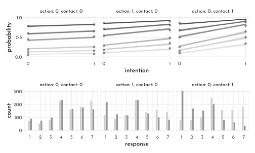


```r
p1 <- trolley_fitted %>% 
  mutate(facet = factor(glue("action: {action}; contact: {contact}"),
                        levels = label_levels)) %>% 
  group_by(iter, facet, intention) %>% 
  summarise(mean_response = sum(pk * response)) %>% 
  ungroup() %>% 
  nest(data = -iter) %>% 
  slice_sample(n = 50) %>%
  unnest(data) %>%

  ggplot(aes(x = intention, y = mean_response)) +
  geom_line(aes(group = iter, color = mean_response),
            alpha = 1/10) +
  scale_color_gradient(low = clr0,
                        high = clr_dark) +
  scale_x_continuous("intention", breaks = 0:1) +
  scale_y_continuous("resopnse", breaks = 1:7, limits = c(1, 7)) +
  theme(legend.position = "none") +
  facet_wrap(~ facet)

p2 <- trolley_fitted %>% 
  mutate(facet = factor(glue("action: {action}; contact: {contact}"),
                        levels = label_levels)) %>% 
  ggplot(aes(x = response, y = pk, fill = factor(intention))) +
  stat_ccdfinterval(.width = .95, justification = 1, size = 1/4, 
                    shape = 21, point_fill = clr0,
                    point_size = 1/3,
                    position = "dodge", width = .75) +
    scale_fill_manual(values = c(clr0d, clr_dark)) +
  scale_x_continuous("resopnse", breaks = 1:7) +
  scale_y_continuous("count", breaks = 0:3 / 10, labels = 0:3 * 100, limits = c(0, NA)) +
  theme(legend.position = "none") +
  facet_wrap(~ facet)

p1 + p2 +
  plot_layout(ncol = 1)
```


### Ordered categorical predictors

> *The __brms__ package has a `rdirichlet()` function, too. Here we use that to make an alternative version of the plot, above.*


```r
set.seed(12)

brms::rdirichlet(n = 1e4,
                 alpha = rep(2, 7)) %>% 
  data.frame() %>% 
  set_names(1:7) %>% 
  pivot_longer(everything()) %>% 
  mutate(name  = name %>% as.double(),
         alpha = str_c("alpha[", name, "]")) %>% 
  
  ggplot(aes(x = value, color = name, group = name, fill= name)) + 
  geom_density(alpha = .8) + 
  scale_fill_gradient(low = clr0,
                        high = clr_dark) +
   scale_color_gradient(low = clr0,
                        high = clr_dark) +
  scale_x_continuous("probability", limits = c(0, 1),
                     breaks = c(0, .5, 1), labels = c("0", ".5", "1"), ) +
  scale_y_continuous(NULL, breaks = NULL) +
  labs(subtitle = expression("Dirichlet"*(2*", "*2*", "*2*", "*2*", "*2*", "*2*", "*2))) +
  theme(legend.position = "none") +
  facet_wrap(~ alpha, nrow = 2)
```

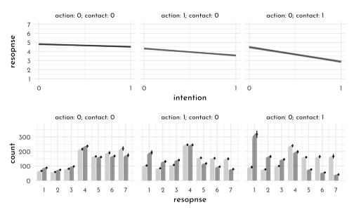

> *When using __brms__, the issue of treating a predictor in the way McElreath covered in this section is referred to as __monotonic effects__. Bürkner outlined the issue in his (2021c) vignette, [Estimating monotonic effects with with brms](https://cran.r-project.org/web/packages/brms/vignettes/brms_monotonic.html), and in his (2020) article with Emmanuel Charpentier, Modelling monotonic effects of ordinal predictors in Bayesian regression models (click [here](https://psyarxiv.com/9qkhj/) for the freely-available preprint).*

> <span style="color:#B35136">*For a single monotonic predictor, $x$, the linear predictor term of observation $n$ looks as follows:*</span>
>
>  <span style="color:#B35136">$$\eta_{n} = bD\sum_{i = 1}^{x_{n}} \zeta_{i}$$</span>
>
> <span style="color:#B35136">*The parameter $b$ can take on any real value, while $\zeta$ is a simplex, which means that it satisfies $\zeta_{i} \in [0, 1]$ and $\sum_{i = 1}^{D} \zeta_{i} = 1$ with $D$ being the number of elements of $\zeta$. Equivalently, $D$ is the number of categories (or highest integer in the data) minus 1, since we start counting categories from zero to simplify the notation.*</span>

> *In this context, $N$ indexes the observations in the hypothetical data and  $\eta$ denotes the linear model for some outcome $y$. Unlike with rethinking, the __brms__ syntax for fitting models with monotonic predictors is fairly simple. Just place your monotonic predictors within the `mo()` function and enter them into the formula.*


```r
# first run-time: ~ 20 min
brms_c12_model_trolley_education  <- brm(
  data = data_trolley,
  family = cumulative,
  response ~ 1 + action + contact + intention + mo(education_idx),  # note the `mo()` syntax
  prior = c(prior(normal(0, 1.5), class = Intercept),
            prior(normal(0, 1), class = b),
            # note the new kinds of prior statements
            prior(normal(0, 0.143), class = b, coef = moeducation_idx),
            prior(dirichlet(2, 2, 2, 2, 2, 2, 2), 
                  class = simo, coef = moeducation_idx1)),
  iter = 2000, warmup = 1000,
  cores = 4, chains = 4,
  seed = 42,
  file = "brms/brms_c12_model_trolley_education")
```


> *If you compare our results to those in the text, you may be surprised by how small our summary values are for `moeducation_idx`. __brms__ and __rethinking__ have an important difference in how they parameterize $\beta_{Education}$. From page 392 in the text, McElreath explained the*

> <span style="color:#B35136">*sum of all the $\delta$ parameters is the maximum education effect. It will be very convenient for interpretation if we call this maximum sum an ordinary coefficient like $\beta_{E}$ and then let the $\delta$ parameters be fractions of it. If we also make a dummy $\delta_0 = 0$ then we can write it all very compactly. Like this:*</span>
> 
> <span style="color:#B35136">$$\phi_{i} = \beta_{E} \sum_{j = 1}^{E_{i} - 1} \delta_{j} + \textrm{other stuff}$$</span>
> 
> <span style="color:#B35136">*where $E_{i}$ is the completed education level of individual $i$. Now the sum of every $\delta_{j}$ is 1, and we can interpret the maximum education effect by looking at $\beta_{E}$.*</span>

> *The current version of __brms__ takes expresses $\beta_{E}$ as an average effect. From Bürkner & Charpentier (2020), we read:*

> <span style="color:#B35136">*If the monotonic effect is used in a linear model, $b$ can be interpreted as the expected average difference between two adjacent categories of $x$, while $\zeta_{i}$ describes the expected difference between the categories $i$ and $i − 1$ in the form of a proportion of the overall difference between lowest and highest categories. Thus, this parameterization has an intuitive interpretation while guaranteeing the monotonicity of the effect (p. 6)*</span>

> *To clarify, the $b$ in this section is what we’re calling $\beta_{E}$ in the current example and Bürkner and Charpentier used $\zeta_{i}$ in place of McElreath’s $\delta_{j}$. The upshot of all this is that if we’d like to compare the summary of our `brms_c12_model_trolley_education` to the results McElreath reported for his `m12.6`, we’ll need to multiply our `moeducation_idx` by 7.*


```r
as_draws_df(brms_c12_model_trolley_education) %>% 
  transmute(bE = bsp_moeducation_idx * 7) %>% 
  median_qi(.width = .89) %>% 
  mutate_if(is.double, round, digits = 2)
```

```
#> # A tibble: 1 × 6
#>      bE .lower .upper .width .point .interval
#>   <dbl>  <dbl>  <dbl>  <dbl> <chr>  <chr>    
#> 1 -0.35  -0.69  -0.12   0.89 median qi
```

> *This parameterization difference between __brms__ and __rethinking__ is also the reason why we set `prior(normal(0, 0.143), class = b, coef = moedu_new)` within `brms_c12_model_trolley_education` where as McElreath used a `Normal(0,1)` prior for all his $\beta$ coefficients, including for his $\beta_{E}$. Because our moedu_new (i.e., $\beta_{E}$) is parameterized as the average of seven $\delta$ parameters, it made sense to divide our hyperparameter for $\sigma$ by 7. That is, $1/7 \approx 0.143$.*

$$
\begin{array}{rcl}
\textrm{response} & \sim & \textrm{Categorical}(p) \\
\textrm{logit}(p_{k}) & = & \alpha_{k} - \phi_{i} \\
\phi_{i} & = & \beta_{a}~action_{i} + \beta_{c}~contact_{i} + \beta_{i}~intetion_{i} + \beta_{e} \textrm{mo}(education\_idx_{i}, \delta)\\
\alpha_{k} & \sim & Normal(0, 1.5) \\
\beta_{a}, \beta_{c}, \beta_{i} & \sim & Normal(0, 1)\\
 \beta_{e} & \sim & Normal(0, 0.143) \\
 \delta & \sim & Dirichlet(2,2,2,2,2,2,2)
\end{array}
$$

> *where $mo(x,\delta)$ is an operator indicating some predictor $x$ is has undergone the monotonic transform and $\delta$ is our vector of simplex parameters $\delta_{1}, .., \delta_{7}$. That is, $\beta_{e}~mo(education\_idx_{i}, \delta)$ is our alternative __brms__-oriented way of expressing McElreath’s $\beta_{e} \sum_{j = 0}^{E_{i}-1} \delta_{j}$. I don’t know that one is better. 🤷 At first contact, I found them both confusing.*


```r
as_draws_df(brms_c12_model_trolley_education) %>%
  as_tibble() %>% 
  select(contains("simo_moeducation_idx1")) %>% 
  ggpairs(
   lower = list(continuous = wrap(my_lower, col = "black")),
    diag = list(continuous = wrap("densityDiag", fill = fll0,
                                  color = "black",
                                  fill = clr_alpha("black"), 
                                  adjust = .7)),
    upper = list(continuous = wrap(my_upper , size = 4, 
                                   color = "black", family = fnt_sel)) ) +
  theme(panel.border = element_rect(color = clr_dark,
                                    fill = "transparent"))
```


```r
brms_c12_model_trolley_education_linear <- brm(
  data = data_trolley, 
  family = cumulative,
  response ~ 1 + action + contact + intention + education_norm,
  prior = c(prior(normal(0, 1.5), class = Intercept),
            prior(normal(0, 1), class = b)),
  iter = 2000, warmup = 1000,
  cores = 4, chains = 4,
  seed = 42,
  file = "brms/model_trolley_education_linear")
```


```r
fixef(brms_c12_model_trolley_education_linear)[7:10, ] %>% 
  as.data.frame() %>% 
  knitr::kable()
```


|               |   Estimate| Est.Error|       Q2.5|      Q97.5|
|:--------------|----------:|---------:|----------:|----------:|
|action         | -0.7050471| 0.0401382| -0.7800204| -0.6257275|
|contact        | -0.9569504| 0.0496886| -1.0559838| -0.8603990|
|intention      | -0.7183681| 0.0356500| -0.7882778| -0.6483887|
|education_norm | -0.1151032| 0.0920943| -0.2956388|  0.0688995|


```r
new_trolley2 <-
  tibble(education_idx   = 1:8,
         action    = 0,
         contact   = 0,
         intention = 0)

trolley_education_fitted <- fitted(brms_c12_model_trolley_education, 
         newdata = new_trolley2) 

trolley_education_fitted_tib <- rbind(trolley_education_fitted[, , 1],
        trolley_education_fitted[, , 2],
        trolley_education_fitted[, , 3],
        trolley_education_fitted[, , 4],
        trolley_education_fitted[, , 5],
        trolley_education_fitted[, , 6],
        trolley_education_fitted[, , 7]) %>% 
  as_tibble %>% 
  mutate(edu      = factor(rep(1:8, times = 7)),
         response = rep(1:7, each = 8))


new_trolley3 <- new_trolley2 %>% 
  mutate(education_norm  = 1:8)

trolley_education_linear_fitted <- fitted(brms_c12_model_trolley_education_linear, 
                                          newdata = new_trolley3) 

trolley_education_linear_fitted_tib <- rbind(trolley_education_linear_fitted[, , 1],
        trolley_education_linear_fitted[, , 2],
        trolley_education_linear_fitted[, , 3],
        trolley_education_linear_fitted[, , 4],
        trolley_education_linear_fitted[, , 5],
        trolley_education_linear_fitted[, , 6],
        trolley_education_linear_fitted[, , 7]) %>% 
  as_tibble() %>% 
  mutate(edu      = factor(rep(1:8, times = 7)),
         response = rep(1:7, each = 8))

bind_rows(trolley_education_fitted_tib,
          trolley_education_linear_fitted_tib) %>% 
  mutate(fit = rep(c("`mo()` syntax",
                     "conventional syntax"), 
                   each = n() / 2)) %>% 
  ggplot(aes(x = response, y = Estimate,
             ymin = Q2.5, ymax = Q97.5,
             color = edu, group = edu)) +
  geom_pointrange(fatten = 3/2, position = position_dodge(width = 3/4)) + 
  scale_color_manual("education",
                     values = scales::colour_ramp(colors = c(clr0d, clr_current))(seq(0,1, length.out = 8))) +
  scale_x_continuous(breaks = 1:7) +
  scale_y_continuous("probability", limits = c(0, .43)) +
  theme(legend.background = element_blank(),
        legend.position = "right") +
  facet_wrap(~ fit)  
```

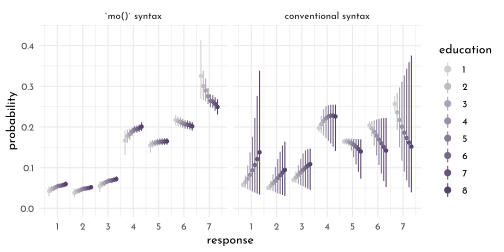


```r
brms_c12_model_trolley_education <- add_criterion(brms_c12_model_trolley_education, "loo")
brms_c12_model_trolley_education_linear <- add_criterion(brms_c12_model_trolley_education_linear, "loo")

loo_compare(brms_c12_model_trolley_education,
            brms_c12_model_trolley_education_linear,
            criterion = "loo") %>%
  print(simplify = FALSE)
```

```
#>                                         elpd_diff se_diff  elpd_loo se_elpd_loo
#> brms_c12_model_trolley_education             0.0       0.0 -18540.6     38.1   
#> brms_c12_model_trolley_education_linear     -4.4       1.7 -18545.0     38.0   
#>                                         p_loo    se_p_loo looic    se_looic
#> brms_c12_model_trolley_education            11.0      0.1  37081.3     76.2
#> brms_c12_model_trolley_education_linear      9.9      0.1  37090.1     76.1
```


```r
model_weights(brms_c12_model_trolley_education,
              brms_c12_model_trolley_education_linear,
              weights = "loo") %>%
  round(digits = 2)
```

```
#>        brms_c12_model_trolley_education brms_c12_model_trolley_education_linear 
#>                                    0.99                                    0.01
```

> *We might explore the monotonic effects of `brms_c12_model_trolley_education` in one more way. If you were reading closely along in the text, you may have noticed that “the sum of every $\delta_{j}$ is 1” (p. 392). When using HMC, this is true for each posterior draw. We can exploit that information to visualize the $\delta_{j}$ parameters in a cumulative fashion.*


```r
as_draws_df(brms_c12_model_trolley_education) %>% 
  select(contains("idx1")) %>% 
  set_names(1:7) %>% 
  mutate(iter = 1:n(), 
         `0`  = 0) %>% 
  pivot_longer(-iter, names_to = "delta") %>% 
  arrange(delta) %>% 
  group_by(iter) %>% 
  mutate(cum_sum = cumsum(value)) %>% 
  ggplot(aes(x = delta, y = cum_sum)) +
  stat_pointinterval(.width = .89, size = 1,
                     color = clr0dd) +
  stat_pointinterval(.width = .5,
                     shape = 21,
                     color = clr0dd,
                     point_color = clr0dd,
                     fill = clr0) +
  scale_x_discrete(NULL, labels = str_c("delta[", 0:7 , "]")) +
  ylab("cumulative sum")
```

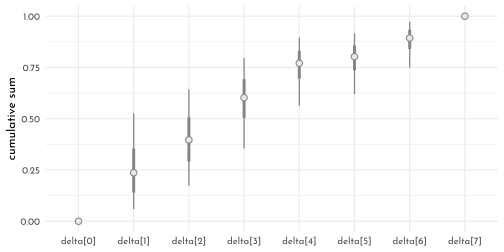

> *This is another way to show that the largest effects of education are when going from Elementary School to Middle School $(\delta_{0} \rightarrow \delta_{1})$ and when going from Some High School to High School Graduate $(\delta_{2} \rightarrow \delta_{3})$.*


```r
data_trolley %>% 
  distinct(edu, education_idx) %>% 
  arrange(education_idx) %>% 
  mutate(`delta[j]` = education_idx - 1)
```

```
#> # A tibble: 8 × 3
#>   edu                  education_idx `delta[j]`
#>   <fct>                        <int>      <dbl>
#> 1 Elementary School                1          0
#> 2 Middle School                    2          1
#> 3 Some High School                 3          2
#> 4 High School Graduate             4          3
#> 5 Some College                     5          4
#> 6 Bachelor's Degree                6          5
#> 7 Master's Degree                  7          6
#> 8 Graduate Degree                  8          7
```

## pymc3 section

---

<div id="myModal" class="modal">
  <span class="close">&times;</span>
  
  <div id="caption"></div>
</div>

<script src="./js/zoom.js"></script>
