---
output:
  html_document:
  theme: yeti
pdf_document: default
editor_options: 
  chunk_output_type: console
---

# Rethinking: Chapter 13

<script type="text/x-mathjax-config">
MathJax.Hub.Register.StartupHook("TeX Jax Ready",function () {
  MathJax.Hub.Insert(MathJax.InputJax.TeX.Definitions.macros,{
    cancel: ["Extension","cancel"]
  });
});
</script>

**Models with Memory**


by [Richard McElreath](https://xcelab.net/rm/statistical-rethinking/), building on the Summaries by [Solomon Kurz](https://bookdown.org/content/4857/) and [Erik Kusch](https://www.erikkusch.com/post/rethinking/statistical-rethinking-chapter-13/).

Advantages of **multilevel models**:

- Improved estimates for repeated sampling
- Improved estimates for imbalanced sampling
- Estimates of variation
- Avoid averaging, retain variation


> *When it comes to regression, multilevel regression deserves to be the default approach. There are certainly contexts in which it would be better to use an old-fashioned single-level model. But the contexts in which multilevel models are superior are much more numerous. Better to begin to build a multilevel analysis and then realize it's unnecessary, than to overlook it.*

:::think
> *The most common synonyms for 'multilevel' are __hierarchical__ and __mixed effects__. The type of parameters that appear in multilevel models are most commonly known as __random effects__, which itself can mean very different things to different analysts and in different contexts.*
:::

## Multilevel tadpoles


```r
library(rethinking)
data(reedfrogs)
data_frogs <- reedfrogs %>% 
  as_tibble() %>% 
  mutate(tank = row_number())

rm(reedfrogs)
```

Old fashioned Single-level model:

$$
\begin{array}{rcllr}
S_{i} & \sim & Binomial(N_{i}, p_{i}) & & \textrm{[likelihood]}\\
\textrm{logit}(p_{i}) & = & \alpha_{TANK[i]} & & \textrm{[unique log-odds for each tank]}\\
\alpha_{j} & \sim & Normal(0, 1.5) & \textrm{for}~j = 1..48 & \textrm{[$\alpha$ prior]}\\
\end{array}
$$


```r
data_frogs_list_1 <- data_frogs %>% 
  dplyr::select(surv, density, tank) %>% 
  as.list()

model_frog_single <- ulam(
  flist = alist(
    surv ~ dbinom( density, p ),
    logit(p) <- alpha[tank],
    alpha[tank] ~ dnorm(0, 1.5)
  ),
  data = data_frogs,
  cores = 4,
  chains = 4,
  log_lik = TRUE
)
```


```r
# not executed because to verbose
precis(model_frog_single, depth = 2) %>%
  knit_precis()
```

Update to multilevel model:

$$
\begin{array}{rclr}
S_{i} & \sim & Binomial(N_{i}, p_{i}) & \textrm{[likelihood]}\\
\textrm{logit}(p_{i}) & = & \alpha_{TANK[i]} & \textrm{[unique log-odds for each tank]}\\
\alpha_{j} & \sim & Normal(\color{#B35136}{\bar{\alpha}}, \color{#B35136}{\sigma}) & \textrm{[adaptive prior]}\\
\color{#B35136}{\bar{\alpha}} & \sim & \color{#B35136}{Normal(0, 1.5)}  &\textrm{[prior for average tank]}\\
\color{#B35136}{\sigma} & \sim & \color{#B35136}{Exponential(1)} & \textrm{[prior for standard deviation of tanks]}\\
\end{array}
$$
The parameters $\bar{\alpha}$ and $\sigma$ represent **hyperparameters** which define the *second level* of the multilevel model.
They come with **hyperpriors**.


```r
model_frog_multi <- ulam(
  flist = alist(
    surv ~ dbinom( density, p ),
    logit(p) <- alpha[tank],
    alpha[tank] ~ dnorm(alpha_bar, sigma),
    alpha_bar ~ dnorm(0, 1.5),
    sigma ~ dexp(1)
  ),
  data = data_frogs,
  cores = 4,
  chains = 4,
  log_lik = TRUE
)
```


```r
compare(model_frog_single,
        model_frog_multi) %>% 
  knit_precis(param_name = "model")
```


|model             |   WAIC|   SE| dWAIC|  dSE| pWAIC| weight|
|:-----------------|------:|----:|-----:|----:|-----:|------:|
|model_frog_multi  | 201.75| 7.38|  0.00|   NA| 21.68|      1|
|model_frog_single | 214.91| 4.41| 13.16| 3.97| 25.71|      0|

:::think
🤓 There are only 21 *effective parameters* (`pWAIC`) in the multilevel model, despite the 48 different tanks.
This is because we used a regularizing prior that *shrinks* the alpha intercepts towards the mean $\bar{\alpha}$. 
:::


```r
frogs_posterior <- extract.samples(model_frog_multi) %>% 
  as.data.frame() %>% 
  as_tibble() %>% 
  pivot_longer(everything(), names_to = "param") %>% 
  filter(!(param %in% c("alpha_bar", "sigma"))) %>% 
  group_by(param) %>% 
  summarize(posterior = list(tibble(value = c(quantile(value,
                                                       probs = c(.055, .25, .5, .75,.945)),
                                              mean(value)),
                                    label = c("ll", "l", "m", "h", "hh", "mean")))) %>% 
  ungroup() %>% 
  unnest(posterior) %>% 
  mutate(value = logistic(value)) %>% 
  pivot_wider(names_from = label, values_from = value ) %>% 
  mutate(tank = str_remove( param, "alpha.") %>% as.integer()) %>% 
  arrange(tank) %>% 
  left_join(data_frogs, .)

posterior_median <- extract.samples(model_frog_multi) %>% 
  as.data.frame() %>% 
  as_tibble() %>% 
  pivot_longer(everything(), names_to = "param") %>% 
  summarize(median = median(value)) %>% 
  .$median %>% 
  logistic()
  
frogs_posterior %>% 
  ggplot(aes(x = tank, color = factor(density))) +
  geom_hline(yintercept = posterior_median, color = clr_dark, linetype = 3) +
  geom_linerange(aes(ymin = ll, ymax = hh), size = .2)+
  geom_linerange(aes(ymin = l, ymax = h), size = .75) +
  geom_point(aes(y = m, fill = after_scale(clr_lighten(color))), shape = 21) +
  geom_point(aes(y = propsurv), shape = 1, size = 2) +
  facet_wrap(density ~ ., scale = "free_x", labeller = label_both) +
  scale_color_manual(values = c(clr0d, clr_dark, clr_current), guide = "none") +
  labs(y = 'survival_prop') +
  theme(panel.border = element_rect(color = clr0d, fill = "transparent"))
```

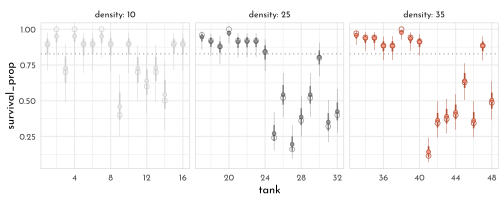

The mean posterior is always closer to the *estimated median survival proportion* of the population than the raw data.
This is an effect called **shrinkage**, resulting from the regularizing priors as an effect of **pooling** information across clusters.

The inferred population distribution of survival:


```r
frogs_hyperposterior <- extract.samples(model_frog_multi) %>% 
  as.data.frame() %>% 
  as_tibble() %>% 
  dplyr::select(alpha_bar, sigma)

p1 <- ggplot() +
  pmap(frogs_hyperposterior %>% filter(row_number() < 100),
       function(alpha_bar, sigma){
         stat_function(fun = dnorm,
                       args = list(mean = alpha_bar, sd = sigma),
                       xlim = c(-3, 4),
                       geom = "line",
                       color = clr0dd, alpha = .4)
       }) +
  labs(y = "density",
       x = "log-odds survival",
       subtitle = "population distribution of survival")

sim_taks <- tibble(logit_p = rnorm(8000,
                         mean = frogs_hyperposterior$alpha_bar,
                         sd = frogs_hyperposterior$sigma),
                   p = inv_logit(logit_p))

p2 <- sim_taks %>% 
  ggplot(aes(x = p)) +
  geom_density(adjust = .1, color = clr0d, fill = fll0) +
  labs(subtitle = "variation of survival in population of tanks")

p1 + p2
```


:::beware
There can be certain issues with the *weakly regularizing priors* for the variance components ($\sigma$) in multilevel models:

- if there only few clusters (e.g. ~ 5), estimating the variance is difficult and a more informative prior might be necessary
- the edge-effects of $log$ and $logit$ link functions can lead to ineffective sampling (lots of *divergent transitions* and small `n_eff` - visible as swings in the trace plot for $\sigma$).
Using a distribution with less mass in the tail compared to the $exponential$ can help here:

$$
\begin{array}{rclr}
S_{i} & \sim & Binomial(N_{i}, p_{i}) & \textrm{[likelihood]}\\
\textrm{logit}(p_{i}) & = & \alpha_{TANK[i]} & \textrm{[linear model]}\\
\alpha_{j} & \sim & Normal(\bar{\alpha}, \sigma) & \textrm{[}~\alpha~\textrm{prior]}\\
\bar{\alpha} & \sim & Normal(0, 1.5) & \textrm{[}~\bar{\alpha}~\textrm{prior]}\\
\sigma & \sim & Half\textrm{-}Normal(0, 1) & \textrm{[}~\sigma~\textrm{prior]}\\
\end{array}
$$
Use `dhalfnorm()` in {rethinking} and `lower = 0` in regular **Stan**.
:::

## Varying Effects and the Underfitting/Overfitting Tade-Off

Simulating data from a multilevel model to compare the estimates from a *no-pooling*, *complete pooling* and *partial-pooling* modeling approach.

The Model

$$
\begin{array}{rclr}
S_{i} & \sim & Binomial(N_{i}, p_{i}) & \textrm{[likelihood]}\\
\textrm{logit}(p_{i}) & = & \alpha_{\color{#B35136}{POND[i]}} & \textrm{[linear model]}\\
\alpha_{j} & \sim & Normal(\bar{\alpha}, \sigma) & \textrm{[}~\alpha~\textrm{prior]}\\
\bar{\alpha} & \sim & Normal(0, 1.5) & \textrm{[}~\bar{\alpha}~\textrm{prior]}\\
\sigma & \sim & Half\textrm{-}Normal(0, 1) & \textrm{[}~\sigma~\textrm{prior]}\\
\end{array}
$$
Assigning values to the parameters and simulating the non-pooled estimates.


```r
set.seed(42)
alpha_bar <- 1.5
sigma <- 1.5
n_ponds <- 60
pond_levels <- c("tiny", "small", "medium", "large")
data_sim <- tibble(pond_idx = 1:n_ponds,
                   n_i = rep(c(5, 10, 25, 35), each = 15),
                   pond_size = rep(pond_levels, each = 15) %>% 
                     factor(levels = pond_levels),
                   true_alpha = rnorm(n = n_ponds, mean = alpha_bar, sd = sigma),
                   surv_i = rbinom(n_ponds, prob = logistic(true_alpha), size = n_i),
                   p_true = inv_logit(true_alpha),
                   p_no_pool = surv_i / n_i)
```

Where `true_alpha` is the true log-odds survival for each pond, `surv_i` are the simulated survivors and `p_no_pool` is the non-pooling estimate of survival.
Remember that we used the *logit* link, so the probability is defined by the logistic function ($p_i = \frac{exp(\alpha_i)}{1 - exp(\alpha_{i})}$) 

Computing the partial-pooling estimates.


```r
data_sim_list <- data_sim %>% 
  dplyr::select(surv_i, n_i, pond_idx)

model_sim_partial <- ulam(
  flist = alist(
    surv_i ~ dbinom(n_i, p),
    logit(p) <- alpha_pond[pond_idx],
    alpha_pond[pond_idx] ~ dnorm(alpha_bar, sigma),
    alpha_bar ~ dnorm(0, 1.5),
    sigma ~ dexp( 1 )
  ),
  data = data_sim_list,
  cores = 4,
  chains = 4,
  log_lik = TRUE
)
```


```r
precis(model_sim_partial, depth = 2) %>% 
  tail() %>% 
  knit_precis()
```


|param          |  mean|   sd|  5.5%| 94.5%|   n_eff| Rhat4|
|:--------------|-----:|----:|-----:|-----:|-------:|-----:|
|alpha_pond[57] |  2.09| 0.52|  1.31|  2.98| 2382.97|     1|
|alpha_pond[58] |  1.61| 0.43|  0.95|  2.33| 4025.40|     1|
|alpha_pond[59] | -2.04| 0.52| -2.91| -1.26| 2461.46|     1|
|alpha_pond[60] |  1.60| 0.44|  0.93|  2.33| 3172.11|     1|
|alpha_bar      |  1.36| 0.23|  0.99|  1.74| 2211.66|     1|
|sigma          |  1.58| 0.21|  1.26|  1.95| 1026.87|     1|


```r
sim_posterior <- extract.samples(model_sim_partial) %>% 
  as.data.frame() %>% 
  as_tibble() %>% 
  pivot_longer(everything(), names_to = "param") %>% 
  filter(!(param %in% c("alpha_bar", "sigma"))) %>% 
  group_by(param) %>% 
  summarize(posterior = list(tibble(value = c(quantile(value,
                                                       probs = c(.055, .25, .5, .75,.945)),
                                              mean(value)),
                                    label = c("ll", "l", "m", "h", "hh", "mean")))) %>% 
  ungroup() %>% 
  unnest(posterior) %>% 
  mutate(value = logistic(value)) %>% 
  pivot_wider(names_from = label, values_from = value ) %>% 
  mutate(pond_idx = str_remove( param, "alpha_pond.") %>% as.integer()) %>% 
  arrange(pond_idx) %>% 
  left_join(data_sim, .) %>% 
  mutate(error_no_pool = abs(p_no_pool - p_true),
          error_part_pool = abs(m - p_true))

error_means <- sim_posterior %>% 
  dplyr::select(pond_size, starts_with("error")) %>% 
    pivot_longer(starts_with("error"), names_to = "model") %>%   
    group_by(pond_size, model) %>% 
  summarise(mean = mean(value)) %>%
  ungroup() %>%
  mutate(model = str_remove(model, "error_"))
  
sim_posterior %>% 
  dplyr::select(pond_idx, pond_size, starts_with("error")) %>% 
    pivot_longer(starts_with("error"), names_to = "model") %>%   
  mutate(model = str_remove(model, "error_")) %>% 
  ggplot(aes(x = pond_idx, color = model)) +
  geom_hline(data = error_means,
             aes(yintercept = mean, color = model),linetype = 3) +
  geom_point(aes(y = value, fill = after_scale(clr_lighten(color))), shape = 21) +
  facet_wrap(pond_size ~ ., scale = "free_x", labeller = label_both, nrow = 1) +
  scale_color_manual(values = c(clr0dd,clr_current), guide = "none") +
  labs(y = 'absolute error') +
  theme(panel.border = element_rect(color = clr0d, fill = "transparent"))
```

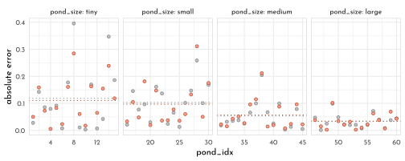

## More than One Type of Cluster

$$
\begin{array}{rclr}
L_{i} & \sim & Binomial(1, p_{i}) & \textrm{[likelihood]}\\
\textrm{logit}(p_{i}) & = & \alpha_{ACTOR[i]} + \color{#B35136}{\gamma_{BLOCK[i]}} + \beta_{TREATMENT[i]} & \textrm{[linear model]}\\
\beta_{j} & \sim & Normal(0, 0.5) ~~ , \textrm{for}~j= 1..4 & \textrm{[}~\beta~\textrm{prior]}\\ 
\alpha_{j} & \sim & Normal(\bar{\alpha}, \sigma_{\alpha}) ~~ , \textrm{for}~j= 1..7 & \textrm{[}~\alpha~\textrm{prior]} \\
\color{#B35136}{\gamma_{j}} & \sim & \color{#B35136}{Normal(0, \sigma_{\gamma}) ~~ , \textrm{for}~j= 1..6} & \textrm{[}~\gamma~\textrm{prior]} \\
\bar{\alpha} & \sim & Normal(0, 1.5) & \textrm{[}~\bar{\alpha}~\textrm{prior]} \\
\sigma_{\alpha} & \sim & Exponential(1) & \textrm{[}~\sigma_{\alpha}~\textrm{prior]} \\
\color{#B35136}{\sigma_{\gamma}} & \sim & \color{#B35136}{Exponential(1)} & \textrm{[}~\sigma_{\gamma}~\textrm{prior]}
\end{array}
$$


```r
data(chimpanzees)

data_chimp <- chimpanzees %>% 
  as_tibble() %>% 
  mutate(treatment = 1L + prosoc_left + 2L * condition,
         side_idx = prosoc_left + 1L,     # right 1, left 2
         condition_idx = condition + 1L)  # no partner 1, partner 2

rm(chimpanzees)
```


```r
data_chimp_list <- data_chimp %>% 
  dplyr::select(pulled_left, actor, block, treatment) %>% 
  as.list()

model_chimp_multicluster <- ulam(
  flist = alist(
    pulled_left ~ dbinom( 1, p ),
    logit(p) <- alpha[actor] + gamma[block] + beta[treatment],
    beta[treatment] ~ dnorm(0,.5),
    ## adaptive priors
    alpha[actor] ~ dnorm( alpha_bar, sigma_alpha ),
    gamma[block] ~ dnorm( 0, sigma_gamma ),
    ## hyper-priors
    alpha_bar ~ dnorm( 0, 1.5 ),
    sigma_alpha ~ dexp(1),
    sigma_gamma ~ dexp(1)
  ),
  data = data_chimp_list,
  cores = 4, 
  chains = 4,
  log_lik = TRUE
)
```


```r
precis(model_chimp_multicluster, depth = 2) %>% 
  knit_precis()
```


|param       |  mean|   sd|  5.5%| 94.5%|   n_eff| Rhat4|
|:-----------|-----:|----:|-----:|-----:|-------:|-----:|
|beta[1]     | -0.13| 0.29| -0.61|  0.32|  239.03|  1.02|
|beta[2]     |  0.36| 0.29| -0.12|  0.81|  373.42|  1.03|
|beta[3]     | -0.50| 0.29| -0.99| -0.06|  435.05|  1.02|
|beta[4]     |  0.26| 0.28| -0.22|  0.72|  453.49|  1.02|
|alpha[1]    | -0.31| 0.35| -0.89|  0.21|  374.70|  1.02|
|alpha[2]    |  4.86| 1.25|  3.11|  6.90|  270.93|  1.03|
|alpha[3]    | -0.59| 0.37| -1.21| -0.05|   73.39|  1.05|
|alpha[4]    | -0.64| 0.34| -1.17| -0.07|  502.17|  1.01|
|alpha[5]    | -0.34| 0.34| -0.89|  0.22|  519.78|  1.01|
|alpha[6]    |  0.57| 0.36|  0.07|  1.18|  163.07|  1.03|
|alpha[7]    |  2.13| 0.43|  1.45|  2.84|  642.20|  1.01|
|gamma[1]    | -0.15| 0.22| -0.56|  0.06|  149.78|  1.03|
|gamma[2]    |  0.03| 0.17| -0.23|  0.33| 1100.80|  1.00|
|gamma[3]    |  0.04| 0.18| -0.21|  0.35|  942.22|  1.01|
|gamma[4]    |  0.01| 0.17| -0.27|  0.30|  991.59|  1.00|
|gamma[5]    | -0.03| 0.18| -0.33|  0.22| 1106.90|  1.01|
|gamma[6]    |  0.10| 0.18| -0.12|  0.44|  400.37|  1.02|
|alpha_bar   |  0.77| 0.84| -0.50|  2.23|   30.19|  1.09|
|sigma_alpha |  2.05| 0.65|  1.22|  3.28|  943.63|  1.00|
|sigma_gamma |  0.19| 0.17|  0.01|  0.50|   84.28|  1.05|

```r
p1 <- precis(model_chimp_multicluster, depth = 2) %>%
  data.frame() %>% 
  rownames_to_column() %>% 
  as_tibble() %>% 
  ggplot(aes(y = rowname)) +
  geom_vline(xintercept = 0, color = clr_dark, linetype = 3) +
  geom_linerange(aes(xmin = `X5.5.`, xmax = `X94.5.`),
                 color = clr0dd) +
  geom_point(aes(x = mean), shape = 21,
             color = clr0dd, fill = clr0) +
  labs(y = "param",
       x = "posterior (mean and 89 percentile)")

p2 <- extract.samples(model_chimp_multicluster) %>% 
  as_tibble() %>% 
  dplyr::select(sigma_alpha, sigma_gamma) %>% 
  pivot_longer(everything(),
               names_sep = "_",
               names_to = c("prefix", "param")) %>% 
  ggplot(aes(x = value, color = param)) +
  geom_density(adjust = .5, aes(fill = after_scale(clr_alpha(color)))) +
  scale_color_manual(values = c(clr0dd, clr_current)) +
  theme(legend.position = c(1,1),
        legend.justification = c(1,1))

p1 + p2
```


```r
model_chimp_singlecluster <- ulam(
  flist = alist(
    pulled_left ~ dbinom( 1, p ),
    logit(p) <- alpha[actor] + beta[treatment],
    beta[treatment] ~ dnorm(0,.5),
    ## adaptive priors
    alpha[actor] ~ dnorm( alpha_bar, sigma_alpha ),
    ## hyper-priors
    alpha_bar ~ dnorm( 0, 1.5 ),
    sigma_alpha ~ dexp(1)
  ),
  data = data_chimp_list,
  cores = 4, 
  chains = 4,
  log_lik = TRUE
)
```


```r
compare(model_chimp_singlecluster,
        model_chimp_multicluster) %>% 
  knit_precis(param_name = "model")
```


|model                     |   WAIC|    SE| dWAIC|  dSE| pWAIC| weight|
|:-------------------------|------:|-----:|-----:|----:|-----:|------:|
|model_chimp_singlecluster | 530.68| 19.18|  0.00|   NA|  8.35|   0.63|
|model_chimp_multicluster  | 531.72| 19.11|  1.04| 1.58| 10.31|   0.37|

**Even more clusters** (partial pooling on the treatment)


```r
model_chimp_treatment <- ulam(
  flist = alist(
    pulled_left ~ dbinom( 1, p ),
    logit(p) <- alpha[actor] + gamma[block] + beta[treatment],
    ## adaptive priors
    beta[treatment] ~ dnorm(0, sigma_beta),
    alpha[actor] ~ dnorm( alpha_bar, sigma_alpha ),
    gamma[block] ~ dnorm( 0, sigma_gamma ),
    ## hyper-priors
    alpha_bar ~ dnorm( 0, 1.5 ),
    sigma_beta ~ dexp(1),
    sigma_alpha ~ dexp(1),
    sigma_gamma ~ dexp(1)
  ),
  data = data_chimp_list,
  cores = 4, 
  chains = 4,
  log_lik = TRUE
)
```


```r
library(ggdist)
extract.samples(model_chimp_treatment) %>% 
  as_tibble() %>% 
  dplyr::select(starts_with("sigma")) %>% 
  pivot_longer(everything(),
               names_sep = "_",
               names_to = c("prefix", "sigma")) %>% 
  ggplot(aes(x = value, y = sigma, color = sigma)) +
  stat_slab(adjust = .75, size = .5, normalize = "xy",
            aes(fill = after_scale(clr_alpha(color)))) +
  scale_color_manual(values = c(clr0dd, clr_dark, clr_current),
                     guide = "none") +
  coord_cartesian(ylim = c(.95, 4.1), expand = 0) +
  theme(legend.position = c(1,1),
        legend.justification = c(1,1))
```

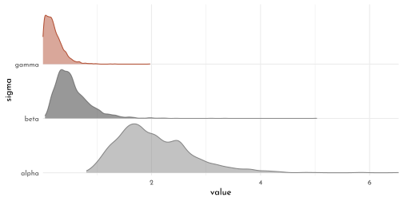


```r
coeftab(model_chimp_multicluster,
        model_chimp_treatment)@coefs %>% 
  as.data.frame() %>% 
  head() %>% 
  knit_precis()
```


|param    | model_chimp_multicluster| model_chimp_treatment|
|:--------|------------------------:|---------------------:|
|beta[1]  |                    -0.13|                 -0.11|
|beta[2]  |                     0.36|                  0.37|
|beta[3]  |                    -0.50|                 -0.44|
|beta[4]  |                     0.26|                  0.26|
|alpha[1] |                    -0.31|                 -0.36|
|alpha[2] |                     4.86|                  4.74|

## Divergent Transitions and Non-Centered Priors

**Divergent transitions** arise from steep gradients within the posterior that leads to issues in the exploration on the basis of a discretized physical simulation.
It can help to **reparameterize**the model - that is re-writing the model in a equivalent notation that allows an alternative numerical approximation.

### The Devil's Funnel

Given the joint distribution of the two variable $v$ and $x$:

Model with **centered parameterization** (definition of $x$ is conditional on another parameter).

$$
\begin{array}{rcl}
v & \sim & Normal(0, 3)\\
x & \sim & Normal(0, \textrm{exp}(v))
\end{array}
$$


```r
model_devils_funnel_centered <- ulam(
  flist = alist(
     v ~ normal( 0, 3 ),
     x ~ normal( 0, exp(v) )
  ),
  data = list(N = 1),
  chains = 4
)
```

```r
#> Warning: 78 of 2000 (4.0%) transitions ended with a divergence.
#> This may indicate insufficient exploration of the posterior distribution.
#> Possible remedies include: 
#>   * Increasing adapt_delta closer to 1 (default is 0.8) 
#>   * Reparameterizing the model (e.g. using a non-centered parameterization)
#>   * Using informative or weakly informative prior distributions 
#> 
#> 14 of 2000 (1.0%) transitions hit the maximum treedepth limit of 10 or 2^10-1 leapfrog steps.
#> Trajectories that are prematurely terminated due to this limit will result in slow exploration.
#> Increasing the max_treedepth limit can avoid this at the expense of more computation.
#> If increasing max_treedepth does not remove warnings, try to reparameterize the model.
```


```r
precis(model_devils_funnel_centered) %>% 
  knit_precis()
```


|param | mean|    sd|   5.5%| 94.5%|  n_eff| Rhat4|
|:-----|----:|-----:|------:|-----:|------:|-----:|
|v     | 1.63|  1.57|  -0.42|  4.42|  68.06|  1.05|
|x     | 1.67| 51.26| -23.70| 27.89| 348.14|  1.01|

$\rightarrow$ note the low `n_eff` (part of 2000 - 4 chains X 500 samples) and high `Rhat4` 😟`


```r
# define the parameter space
parameter_space <- seq(from = -4, to = 4, length.out = 200)

# simulate
p1 <- crossing(v = parameter_space,
               x = parameter_space) %>% 
  mutate(likelihood_v = dnorm(v, mean = 0, sd = 3),
         likelihood_x = dnorm(x, mean = 0, sd = exp(v))) %>% 
  mutate(joint_likelihood = likelihood_v * likelihood_x) %>% 
  
  # plot!
  ggplot(aes(x = x, y = v, color = joint_likelihood)) +
  ggisoband::geom_isobands(aes(z = joint_likelihood,
                               fill = after_scale(clr_alpha(color,.1))), 
                           bins = 51, size = .4) +
  scale_color_gradientn(colours = c(clr0, clr_dark, clr_current)) +
  # geom_raster(interpolate = TRUE) +
  # scale_color_viridis_c(option = "B") +
  labs(subtitle = "Centered parameterization") +
  theme(legend.position = "none")
```

The same model with a **non-centered parameterization** (the embedded parameter is moved out of the definition of $x$) - this is similar to standardizing a variable.

$$
\begin{array}{rcl}
v & \sim & Normal(0, 3) \\
z & \sim & Normal(0, 1) \\
x & = & z~\textrm{exp}(v)
\end{array}
$$


```r
p2 <- crossing(v = parameter_space,
               z = parameter_space / 2) %>% 
  mutate(likelihood_v = dnorm(v, mean = 0, sd = 3),
         likelihood_z = dnorm(z, mean = 0, sd = 1)) %>% 
  mutate(joint_likelihood = likelihood_v * likelihood_z) %>% 
  # plot!
  ggplot(aes(x = z, y = v, color = joint_likelihood)) +
 ggisoband::geom_isobands(aes(z = joint_likelihood, 
                              fill = after_scale(clr_alpha(color,.1))), 
                           bins = 15, size = .4) +
  scale_color_gradientn(colours = c(clr0, clr_dark, clr_current)) +
  # scale_fill_viridis_c(option = "B") +
  labs(subtitle = "Non-centered parameterization") +
  theme(legend.position = "none")

p1 + p2
```

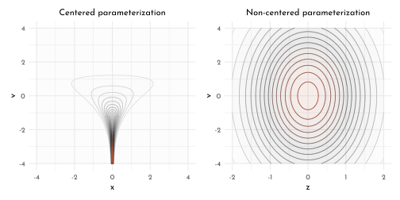


```r
model_devils_funnel_non_centered <- ulam(
  flist = alist(
     v ~ normal( 0, 3 ),
     z ~ normal( 0, 1),
     gq> real[1]:x <<- z * exp(v) 
  ),
  data = list(N = 1),
  chains = 4
)
```


```r
precis(model_devils_funnel_non_centered) %>% 
  knit_precis()
```


|param |  mean|     sd|   5.5%| 94.5%|   n_eff| Rhat4|
|:-----|-----:|------:|------:|-----:|-------:|-----:|
|v     | -0.01|   3.00|  -4.88|  4.59| 1140.87|     1|
|z     |  0.04|   0.98|  -1.55|  1.59| 1412.03|     1|
|x     | 14.83| 414.92| -21.11| 33.61| 1227.91|     1|


```r
extract.samples(model_devils_funnel_non_centered) %>% 
  as.data.frame() %>% 
  as_tibble() %>% 
  ggplot(aes(x = x, y = v)) +
  ggpointdensity::geom_pointdensity(size = .75)+
  scale_color_gradientn(colours = c(clr0, clr_dark, clr_current),
                        guide = 'none') +
  coord_cartesian(xlim = c(-4, 4),
                  ylim = c(-4, 4)) +
  labs(subtitle = "posterior sampled with HMC")
```


### Non-Centered Chimpanzees

The quick and easy way to help with divergent transitions is to increase the stringency of acceptance by selecting an `adapt_delta` that is closer to 1:


```r
set.seed(42)
model_chimp_multicluster_fine <- ulam(
  model_chimp_multicluster,
  chains = 4,
  cores = 4,
  control = list(adapt_delta = 0.99)
)
```


```r
divergent(model_chimp_multicluster)
```

```
#> [1] 51
```

```r
divergent(model_chimp_multicluster_fine)
```

```
#> [1] 0
```


```r
precis(model_chimp_multicluster_fine) %>% 
  knit_precis()
```


|param       | mean|   sd|  5.5%| 94.5%|   n_eff| Rhat4|
|:-----------|----:|----:|-----:|-----:|-------:|-----:|
|alpha_bar   | 0.61| 0.72| -0.49|  1.79| 1053.49|  1.00|
|sigma_alpha | 2.03| 0.67|  1.19|  3.23|  852.96|  1.00|
|sigma_gamma | 0.22| 0.17|  0.03|  0.52|  211.50|  1.02|

This still produces bad (low `n_eff`) though.

The more serious approach is to re-parameterize the model.
For the current model, we need to transform two adaptive priors to move their paramters into a linear model:

$$
\begin{array}{rclr}
L_{i} & \sim & Binomial(1, p_{i}) & \textrm{[likelihood]}\\
\textrm{logit}(p_{i}) & = & \alpha_{ACTOR[i]} + \gamma_{BLOCK[i]} + \beta_{TREATMENT[i]} & \textrm{[linear model]}\\
\beta_{j} & \sim & Normal(0, 0.5) ~~ , \textrm{for}~j= 1..4 & \textrm{[}~\beta~\textrm{prior]}\\ 
\color{#B35136}{\alpha_{j}} & \sim & \color{#B35136}{Normal(\bar{\alpha}, \sigma_{\alpha}) ~~ , \textrm{for}~j= 1..7} & \textrm{[Intercepts for actors]} \\
\color{#B35136}{\gamma_{j}} & \sim & \color{#B35136}{Normal(0, \sigma_{\gamma}) ~~ , \textrm{for}~j= 1..6} & \textrm{[Intercepts for blocks]} \\
\bar{\alpha} & \sim & Normal(0, 1.5) & \textrm{[}~\bar{\alpha}~\textrm{prior]} \\
\sigma_{\alpha} & \sim & Exponential(1) & \textrm{[}~\sigma_{\alpha}~\textrm{prior]} \\
\sigma_{\gamma} & \sim & Exponential(1) & \textrm{[}~\sigma_{\gamma}~\textrm{prior]}
\end{array}
$$

Our task is to reconfigure remove three embedded parameters ($\bar{\alpha}$, $\sigma_{\alpha}$ and $\sigma_{\gamma}$).
To do this we define new variables with $Normal$ distributions.
To reconstruct the original values by reversing the transformations.

The reparamterized model then reads

$$
\begin{array}{rclr}
L_{i} & \sim & Binomial(1, p_{i}) & \textrm{[likelihood]}\\
\textrm{logit}(p_{i}) & = & \color{#B35136}{\underbrace{\bar{\alpha} + z_{ACTOR[i]} \sigma_{\alpha}}_{\alpha_{ACTOR[i]}}} + \color{#B35136}{\underbrace{x_{BLOCK[i]}  \sigma_{\gamma}}_{\gamma_{BLOCK[i]}}}+ \beta_{TREATMENT[i]} & \textrm{[linear model]}\\
\beta_{j} & \sim & Normal(0, 0.5) ~~ , \textrm{for}~j= 1..4 & \textrm{[}~\beta~\textrm{prior]}\\ 
\color{#B35136}{z_{j}} & \sim & \color{#B35136}{Normal(0, 1)} & \textrm{[standardized actor intercepts]} \\
\color{#B35136}{x_{j}} & \sim & \color{#B35136}{Normal(0, 1)} & \textrm{[standardized block intercepts]} \\
\bar{\alpha} & \sim & Normal(0, 1.5) & \textrm{[}~\bar{\alpha}~\textrm{prior]} \\
\sigma_{\alpha} & \sim & Exponential(1) & \textrm{[}~\sigma_{\alpha}~\textrm{prior]} \\
\sigma_{\gamma} & \sim & Exponential(1) & \textrm{[}~\sigma_{\gamma}~\textrm{prior]}
\end{array}
$$

```r
model_chimp_multicluster_reparam <- ulam(
  flist = alist(
    pulled_left ~ dbinom( 1, p ),
    logit(p) <- alpha_bar + z[actor] * sigma_alpha + 
      x[block] * sigma_gamma +
      beta[treatment],
    beta[treatment] ~ dnorm(0,.5),
    ## adaptive priors
    z[actor] ~ dnorm( 0, 1 ),
    x[block] ~ dnorm( 0, 1 ),
    ## hyper-priors
    alpha_bar ~ dnorm( 0, 1.5 ),
    sigma_alpha ~ dexp(1),
    sigma_gamma ~ dexp(1),
    gq> vector[actor]:alpha <<- alpha_bar + z * sigma_alpha,
    gq> vector[block]:gamma <<- x * sigma_gamma
  ),
  data = data_chimp_list,
  cores = 4, 
  chains = 4,
  log_lik = TRUE
)
```


```r
get_n_eff <- function(model, model_lab){
  precis(model, depth = 2) %>% 
  data.frame() %>% 
  rownames_to_column() %>% 
  as_tibble() %>% 
  dplyr::select(rowname, n_eff) %>% 
  set_names(nm = c("param", str_c("n_eff_", model_lab)))
}

get_n_eff(model_chimp_multicluster, "centered") %>% 
  left_join(get_n_eff(model_chimp_multicluster_reparam, "non-centered")) %>% 
  ggplot(aes(x = n_eff_centered, y = `n_eff_non-centered`)) +
  geom_abline(slope = 1, intercept = 0, color = clr_dark, linetype = 3) +
  geom_point(shape = 21, color = clr0dd, fill = clr0) +
  coord_cartesian(xlim = c(0, 2250),
                  ylim = c(0, 2250))
```

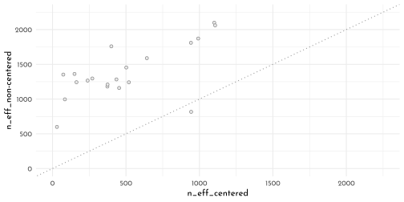


Reparameterization does not need to use a gaussian distribution. 
For example the an exponential distribution would look like this:

$$
\begin{array}{rcl}
x & = & x\lambda\\
z & \sim & Exponential(1)
\end{array}
$$

which replaces $x \sim Exponential(\lambda)$.

## Multilevel Posterior Predictions

### Posterior Prediction for Same Clusters

Using `link()` (quick approach):


```r
chimp <- 2L
data_predict <- list(
  actor = rep(chimp, 4),
  treatment = 1:4,
  block = rep(1L, 4)
)

link(model_chimp_multicluster, data = data_predict) %>% 
  as_tibble() %>% 
  set_names(nm = str_c("treatment", 1:4)) %>% 
  summarise(across(everything(),
                   function(x){list(tibble(mean = mean(x),
                                           pi_lower = PI(x)[1],
                                           pi_upper = PI(x)[2]))})) %>% 
  pivot_longer(everything()) %>% 
  unnest(value)
```

```
#> # A tibble: 4 × 4
#>   name        mean pi_lower pi_upper
#>   <chr>      <dbl>    <dbl>    <dbl>
#> 1 treatment1 0.981    0.944    0.999
#> 2 treatment2 0.989    0.966    0.999
#> 3 treatment3 0.974    0.927    0.998
#> 4 treatment4 0.987    0.962    0.999
```

Using `extract.samples()` (generic approach)


```r
chimp_posterior <- extract.samples(model_chimp_multicluster) %>% 
  as.data.frame() %>% 
  as_tibble()

chimp_posterior %>% 
  ggplot(aes(x = alpha.5)) +
  geom_density(adjust = .5, color = clr0dd, fill = fll0)
```

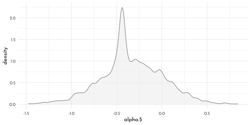


```r
chimp_posterior %>% 
  mutate(across(starts_with("beta"),
                .fns = function(x){inv_logit(alpha.2 + gamma.1 + x)},
                .names = "{.col}_raw")) %>% 
  dplyr::select(ends_with("raw"))%>% 
  summarise(across(everything(),
                   function(x){list(tibble(mean = mean(x),
                                           pi_lower = PI(x)[1],
                                           pi_upper = PI(x)[2]))})) %>% 
  pivot_longer(everything()) %>% 
  unnest(value)
```

```
#> # A tibble: 4 × 4
#>   name        mean pi_lower pi_upper
#>   <chr>      <dbl>    <dbl>    <dbl>
#> 1 beta.1_raw 0.981    0.944    0.999
#> 2 beta.2_raw 0.989    0.966    0.999
#> 3 beta.3_raw 0.974    0.927    0.998
#> 4 beta.4_raw 0.987    0.962    0.999
```

### Posterior Predictions for New Clusters

The average chimp


```r
p1 <- chimp_posterior %>% 
  mutate(across(starts_with("beta"),
                .fns = function(x){inv_logit(alpha_bar + x)},
                .names = "{.col}_raw")) %>% 
  dplyr::select(ends_with("raw"))%>% 
  summarise(across(everything(),
                   function(x){
                     list(tibble(mean = mean(x),
                                 pi_lower = PI(x)[1],
                                 pi_upper = PI(x)[2]))
                     })) %>% 
  pivot_longer(everything()) %>% 
  mutate(treatment = str_extract(name, pattern = "[1-4]") %>% as.integer()) %>% 
  unnest(value) %>% 
  ggplot(aes(x = treatment)) +
  geom_smooth(aes(ymin = pi_lower, y = mean, ymax = pi_upper),
              stat = 'identity',
              color = clr0dd, fill = fll0dd, size = .5) +
  labs(y = "prop_pulled_left",
       x = "treatment",
       subtitle = "average_actor") 

chimp_sim <- chimp_posterior %>% 
  mutate(sim = rnorm(n = n(),
                     mean = alpha_bar,
                     sd = sigma_alpha)) %>% 
  mutate(across(starts_with("beta"),
                .fns = function(x){inv_logit(sim + x)},
                .names = "{.col}_sim"))

p2 <- chimp_sim %>% 
  dplyr::select(ends_with("_sim")) %>% 
  summarise(across(everything(),
                   function(x){
                     list(tibble(mean = mean(x),
                                 pi_lower = PI(x)[1],
                                 pi_upper = PI(x)[2]))
                     })) %>% 
  pivot_longer(everything()) %>% 
  mutate(treatment = str_extract(name, pattern = "[1-4]") %>% as.integer()) %>% 
  unnest(value) %>% 
  ggplot(aes(x = treatment)) +
  geom_smooth(aes(ymin = pi_lower, y = mean, ymax = pi_upper),
              stat = 'identity',
              color = clr0dd, fill = fll0dd, size = .5) +
  labs(y = "prop_pulled_left",
       x = "treatment",
       subtitle = "marginal_of_actor") +
  coord_cartesian(ylim = 0:1) +
  theme(panel.grid.minor.x = element_blank())

p3 <- chimp_sim %>% 
  dplyr::select(ends_with("_sim")) %>%
  mutate(.draw = row_number()) %>%
  filter(row_number() < 101) %>% 
  pivot_longer(ends_with("_sim")) %>%
  mutate(treatment = str_extract(name, pattern = "[1-4]") %>% as.integer()) %>% 
  ggplot(aes(x = treatment, y = value, group = .draw)) +
  geom_line(color = clr_alpha(clr_dark, .4))+
    labs(y = "prop_pulled_left",
       x = "treatment",
       subtitle = "simulated_actors") 

p1 + p2 + p3 &
  scale_x_continuous(breaks = 1:4,
                     labels = c("R|N", "L|N", "R|P", "L|P")) &
  coord_cartesian(ylim = 0:1) &
  theme(panel.grid.minor.x = element_blank())
```


---


```r
library(rlang)
chapter13_models <- env(
)

write_rds(chapter13_models, "envs/chapter13_models.rds")
```

## Homework

**E1**

- $\alpha_{TANK} \sim \textrm{Normal}(0,1)$
- $\cancel{\alpha_{TANK} \sim \textrm{Normal}(0,2)}$

**E2**

$$
\begin{array}{rclr}
y_{i} & \sim & \textrm{Binomial}(1, p_{i}) & \\
\textrm{logit}(p_{i}) & = & \alpha_{GROUP[i]} + \beta x_{i} &\\
\alpha_{GROUP} & \sim & \textrm{Normal}(\bar{\alpha}, \sigma_{\alpha}) &\\
\beta & \sim & \textrm{Normal}(0, 0.5) &\\
\bar{\alpha} & \sim & \textrm{Normal}(0, 1.5) & \textrm{[hyperprior]}\\
\sigma_{\alpha} & \sim & \textrm{Exponential}(1) & \textrm{[hyperprior]}
\end{array}
$$

**E3**

$$
\begin{array}{rclr}
y_{i} & \sim & \textrm{Normal}(\mu_{i}, \sigma) & \\
\textrm{logit}(\mu_{i}) & = & \alpha_{GROUP[i]} + \beta x_{i} &\\
\alpha_{GROUP} & \sim & \textrm{Normal}(\bar{\alpha   }, \sigma_{\alpha}) &\\
\beta & \sim & \textrm{Normal}(0, 1) &\\
\sigma & \sim & \textrm{Exponential}(1) & \\ 
\bar{\alpha} & \sim & \textrm{Normal}(0, 5) & \textrm{[hyperprior]}\\
\sigma_{\alpha} & \sim & \textrm{Exponential}(1) & \textrm{[hyperprior]}
\end{array}
$$

**E4**

$$
\begin{array}{rclr}
y_{i} & \sim & \textrm{Poisson}(\lambda_{i}) & \\
\textrm{log}(\lambda_{i}) & = & \alpha_{GROUP[i]} + \beta x_{i} &\\
\alpha_{GROUP} & \sim & \textrm{Normal}(\bar{\alpha   }, \sigma_{\alpha}) &\\
\beta & \sim & \textrm{Normal}(0, 1) &\\
\bar{\alpha} & \sim & \textrm{Normal}(3, .5) & \textrm{[hyperprior]}\\
\sigma_{\alpha} & \sim & \textrm{Exponential}(1) & \textrm{[hyperprior]}
\end{array}
$$
**E5**

$$
\begin{array}{rclr}
y_{i} & \sim & \textrm{Poisson}(\lambda_{i}) & \\
\textrm{log}(\lambda_{i}) & = & \alpha_{GROUP[i]} + \gamma_{BLOCK[i]} + \beta x_{i} &\\
\alpha_{GROUP} & \sim & \textrm{Normal}(\bar{\alpha}, \sigma_{\alpha}) &\\
\gamma_{BLOCK} & \sim & \textrm{Normal}(0, \sigma_{\gamma}) & \textrm{[ 0 to avoid the ''legs issue'']}\\
\beta & \sim & \textrm{Normal}(0, 1) &\\
\bar{\alpha} & \sim & \textrm{Normal}(3, .5) & \textrm{[hyperprior]}\\
\sigma_{\alpha} & \sim & \textrm{Exponential}(1) & \textrm{[hyperprior]}\\
\sigma_{\gamma} & \sim & \textrm{Exponential}(1) & \textrm{[hyperprior]}
\end{array}
$$


**M1**

Now also include `predation` and `size` as clusters within the model.

We will be using the non-centered model notation:


```r
model_frog_tank <- ulam(
  flist = alist(
    surv ~ dbinom( density, p ),
    logit(p) <- alpha_bar + 
      z_alpha[tank] * sigma_alpha,
    z_alpha[tank] ~ dnorm(0, 1),
    alpha_bar ~ dnorm(0, 1.5),
    sigma_alpha ~ dexp(1),
    gq> vector[tank]:alpha <<- alpha_bar + z_alpha * sigma_alpha
  ),
  data = data_frogs,
  cores = 4,
  chains = 4,
  log_lik = TRUE
)

model_frog_pred <- ulam(
  flist = alist(
    surv ~ dbinom( density, p ),
    logit(p) <- alpha_bar + 
      z_alpha[tank] * sigma_alpha + 
      z_gamma[pred] * sigma_gamma,
    z_alpha[tank] ~ dnorm(0, 1),
    z_gamma[pred] ~ dnorm(0, 1),
    alpha_bar ~ dnorm(0, 1.5),
    c(sigma_alpha, sigma_gamma) ~ dexp(1),
    gq> vector[tank]:alpha <<- alpha_bar + z_alpha * sigma_alpha,
    gq> vector[pred]:gamma <<- z_gamma * sigma_gamma
  ),
  data = data_frogs,
  cores = 4,
  chains = 4,
  log_lik = TRUE
)

model_frog_size <- ulam(
  flist = alist(
    surv ~ dbinom( density, p ),
    logit(p) <- alpha_bar + 
      z_alpha[tank] * sigma_alpha + 
      z_delta[size] * sigma_delta,
    z_alpha[tank] ~ dnorm(0, 1),
    z_delta[size] ~ dnorm(0, 1),
    alpha_bar ~ dnorm(0, 1.5),
    c(sigma_alpha, sigma_delta) ~ dexp(1),
    gq> vector[tank]:alpha <<- alpha_bar + z_alpha * sigma_alpha,
    gq> vector[size]:delta <<- z_delta * sigma_delta
  ),
  data = data_frogs,
  cores = 4,
  chains = 4,
  log_lik = TRUE
)

model_frog_combined <- ulam(
  flist = alist(
    surv ~ dbinom( density, p ),
    logit(p) <- alpha_bar + 
      z_alpha[tank] * sigma_alpha + 
      z_gamma[pred] * sigma_gamma + 
      z_delta[size] * sigma_delta,
    z_alpha[tank] ~ dnorm(0, 1),
    z_gamma[pred] ~ dnorm(0, 1),
    z_delta[size] ~ dnorm(0, 1),
    alpha_bar ~ dnorm(0, 1.5),
    c(sigma_alpha, sigma_gamma, sigma_delta) ~ dexp(1),
    gq> vector[tank]:alpha <<- alpha_bar + z_alpha * sigma_alpha,
    gq> vector[pred]:gamma <<- z_gamma * sigma_gamma,
    gq> vector[size]:delta <<- z_delta * sigma_delta
  ),
  data = data_frogs,
  cores = 4,
  chains = 4,
  log_lik = TRUE
)

data_frogs_ind <- data_frogs %>% 
  mutate(pred_ind = abs(1L - as.integer(pred)))

model_frog_interact <- ulam(
  flist = alist(
    surv ~ dbinom( density, p ),
    logit(p) <- alpha_bar + 
      z_alpha[tank] * sigma_alpha + 
      z_gamma[pred] * sigma_gamma + 
      z_delta[size] * sigma_delta + 
      z_epsilon[size] * pred_ind * sigma_epsilon,
    z_alpha[tank] ~ dnorm(0, 1),
    z_gamma[pred] ~ dnorm(0, 1),
    z_delta[size] ~ dnorm(0, 1),
    z_epsilon[size] ~ dnorm(0, 1),
    alpha_bar ~ dnorm(0, 1.5),
    c(sigma_alpha, sigma_gamma, sigma_delta, sigma_epsilon) ~ dexp(1),
    gq> vector[tank]:alpha <<- alpha_bar + z_alpha * sigma_alpha,
    gq> vector[pred]:gamma <<- z_gamma * sigma_gamma,
    gq> vector[size]:delta <<- z_delta * sigma_delta,
    gq> vector[size]:epsilon <<- z_epsilon  * sigma_epsilon
  ),
  data = data_frogs_ind,
  cores = 4,
  chains = 4,
  log_lik = TRUE
)
```


```r
get_sigma_alpha <- function(model, mod_lab){
  model %>% 
  precis() %>%
  data.frame() %>%
  rownames_to_column() %>% 
  filter(rowname == "sigma_alpha") %>%
  dplyr::select(-rowname) %>% 
  pivot_longer(everything(), names_to = "param") %>% 
  mutate(model = mod_lab)
}

list(model_frog_tank,
        model_frog_pred,
        model_frog_size,
        model_frog_combined,
        model_frog_interact) %>% 
  map2_dfr(.y = c("tank","pred","size","combine", "interact"),
           get_sigma_alpha) %>% 
  pivot_wider(names_from = "param",
              values_from = "value") %>% 
  ggplot(aes(y = model)) +
  geom_vline(xintercept = 0, linetype = 3, color = clr_dark) +
  geom_linerange(aes(xmin = `X5.5.`, xmax = `X94.5.`), 
             color = clr0dd) +
  geom_point(aes(x = mean), 
             color = clr0dd, fill = clr0, 
             shape = 21, size = 2) +
  coord_cartesian(xlim = c(0, 2)) +
  labs(subtitle = "estimates of sigma_alpha",
       x = "sigma_alpha")
```

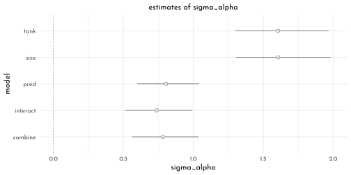

**M2**


```r
compare(model_frog_tank,
        model_frog_pred,
        model_frog_size,
        model_frog_combined,
        model_frog_interact) %>% 
  knit_precis(param_name = "model")
```


|model               |   WAIC|   SE| dWAIC|  dSE| pWAIC| weight|
|:-------------------|------:|----:|-----:|----:|-----:|------:|
|model_frog_combined | 199.97| 8.98|  0.00|   NA| 19.31|   0.29|
|model_frog_interact | 200.08| 9.32|  0.12| 1.95| 19.11|   0.27|
|model_frog_tank     | 200.33| 7.18|  0.36| 5.97| 20.99|   0.24|
|model_frog_pred     | 202.10| 9.61|  2.14| 1.76| 20.43|   0.10|
|model_frog_size     | 202.28| 7.50|  2.31| 5.98| 21.83|   0.09|


```r
p1 <- link(model_frog_pred) %>% 
  as_tibble() %>% 
  summarise(across(everything(),
                   .fns = function(x){list(tibble(val = c(quantile(x,
                                                                   probs = c(.055,.25,.5,.75,.945)),
                                                          mean(x)),
                                                  label = c("ll", "l", "m", "h", "hh", "mean")))})) %>% 
  pivot_longer(everything()) %>% 
  bind_cols(data_frogs,.) %>% 
  unnest(value) %>% 
  pivot_wider(names_from = label, values_from = val) %>% 
  ggplot(aes(x = tank)) +
  labs(subtitle = "predation")


p2 <- link(model_frog_interact) %>% 
  as_tibble() %>% 
  summarise(across(everything(),
                   .fns = function(x){list(tibble(val = c(quantile(x,
                                                                   probs = c(.055,.25,.5,.75,.945)),
                                                          mean(x)),
                                                  label = c("ll", "l", "m", "h", "hh", "mean")))})) %>% 
  pivot_longer(everything()) %>% 
  bind_cols(data_frogs,.) %>% 
  unnest(value) %>% 
  pivot_wider(names_from = label, values_from = val) %>% 
  ggplot(aes(x = tank)) +
  labs(subtitle = "interaction model")

p1 + p2 &
    geom_linerange(aes(ymin = ll, ymax = hh), 
             color = clr0dd) &
  geom_point(aes(y = m), 
             color = clr0dd, fill = clr0, 
             shape = 21, size = 2) &
    geom_point(aes(y = propsurv), 
             color = clr_current, 
             shape = 1, size = 4)
```


```r
# prep_pred <- link(model_frog_pred) %>% 
#   as_tibble() %>% 
#   summarise(across(everything(),
#                    .fns = function(x){list(tibble(val_p = c(quantile(x,
#                                                                    probs = c(.055,.25,.5,.75,.945)),
#                                                           mean(x)),
#                                                   label = c("ll", "l", "m", "h", "hh", "mean") %>%
#                                                     str_c(.,"_pred")))})) %>% 
#   pivot_longer(everything(),
#                values_to = "t_pred")
# 
# prep_interct <- link(model_frog_interact) %>% 
#   as_tibble() %>% 
#   summarise(across(everything(),
#                    .fns = function(x){list(tibble(val_i = c(quantile(x,
#                                                                    probs = c(.055,.25,.5,.75,.945)),
#                                                           mean(x)),
#                                                   label = c("ll", "l", "m", "h", "hh", "mean") %>%
#                                                     str_c(.,"_interact")))})) %>% 
#   pivot_longer(everything(),
#                values_to = "t_interact")
# 
# prep_size <- link(model_frog_size) %>% 
#   as_tibble() %>% 
#   summarise(across(everything(),
#                    .fns = function(x){list(tibble(val_s = c(quantile(x,
#                                                                    probs = c(.055,.25,.5,.75,.945)),
#                                                           mean(x)),
#                                                   label = c("ll", "l", "m", "h", "hh", "mean") %>%
#                                                     str_c(.,"_size")))})) %>% 
#   pivot_longer(everything(),
#                values_to = "t_size")
# 
# posterior_frogs_tripple <- list(prep_pred,
#      prep_size,
#      prep_interct) %>% 
#   reduce(left_join) %>% 
#   bind_cols(data_frogs,. ) %>% 
#   unnest(t_pred) %>% 
#   pivot_wider(names_from = label, values_from = val_p) %>% 
#   unnest(t_size) %>% 
#   pivot_wider(names_from = label, values_from = val_s) %>% 
#   unnest(t_interact) %>% 
#   pivot_wider(names_from = label, values_from = val_i)
# 
# p1 <- posterior_frogs_tripple %>% 
#   ggplot(aes(x = m_pred, y = m_interact)) +
#   geom_linerange(aes(xmin = ll_pred, xmax = hh_pred), 
#              color = clr0dd)+
#   geom_linerange(aes(ymin = ll_interact, ymax = hh_interact), 
#              color = clr0dd) +
#   geom_point(color = clr0dd, fill = clr0, 
#              shape = 21, size = 2)
# 
# p2 <- posterior_frogs_tripple %>% 
#   ggplot(aes(x = m_pred, y = m_size)) +
#   geom_linerange(aes(xmin = ll_pred, xmax = hh_pred), 
#              color = clr0dd)+
#   geom_linerange(aes(ymin = ll_size, ymax = hh_size), 
#              color = clr0dd) +
#   geom_point(color = clr0dd, fill = clr0, 
#              shape = 21, size = 2)
#   
# p1 + p2 &
#   geom_abline(slope = 1, intercept = 0, linetype = 3, color = clr_current)

plot_posterior <- function(model){
  data_prep <- extract.samples(model) %>% 
    data.frame() %>% 
    as_tibble() %>% 
    dplyr::select(c(alpha_bar, starts_with("sigma")))
  
  data_prep %>% 
    pivot_longer(everything()) %>% 
    ggplot(aes(y = name, x = value)) +
    geom_vline(xintercept = 0, linetype = 3, color = clr_dark)+
    stat_slab(adjust = .75, size = .5, normalize = "xy",
              color = clr0dd, fill = fll0) +
    coord_cartesian(ylim = c(.9, ncol(data_prep)+1.1),
                    xlim = c(-2.5, 5),
                    expand = 0)+
    labs(subtitle = deparse(substitute(model)) %>% str_remove("model_frog_"),
         y = NULL, x = NULL)
}


((plot_posterior(model_frog_tank) + theme(axis.text.x = element_blank())) /
(plot_posterior(model_frog_pred) + theme(axis.text.x = element_blank())) /
  plot_posterior(model_frog_size)) |
  ((plot_posterior(model_frog_combined) + theme(axis.text.x = element_blank())) /
  plot_posterior(model_frog_interact))
```


**M3**


```r
model_frog_cauchy <- ulam(
  flist = alist(
    surv ~ dbinom( density, p ),
    logit(p) <- alpha_bar + 
      z_alpha[tank] * sigma_alpha,
    z_alpha[tank] ~ dcauchy(0, 1),
    alpha_bar ~ dnorm(0, 1.5),
    sigma_alpha ~ dexp(1),
    gq> vector[tank]:alpha <<- alpha_bar + z_alpha * sigma_alpha
  ),
  data = data_frogs,
  control = list(adapt_delta = 0.99),
  cores = 4,
  chains = 4,
  max_treedepth = 15,
  log_lik = TRUE
)
```

Cauchy fit


```r
precis(model_frog_cauchy, depth = 2) %>% 
  knit_precis()
```


|param       |  mean|    sd|  5.5%| 94.5%|   n_eff| Rhat4|
|:-----------|-----:|-----:|-----:|-----:|-------:|-----:|
|z_alpha[1]  |  0.54|  0.90| -0.71|  2.10| 1276.94|  1.00|
|z_alpha[2]  |  3.52|  5.91| -0.05| 11.56|  135.29|  1.03|
|z_alpha[3]  | -0.38|  0.65| -1.39|  0.63| 1210.19|  1.00|
|z_alpha[4]  |  4.17|  6.65|  0.05| 16.75|  200.48|  1.01|
|z_alpha[5]  |  0.52|  0.86| -0.63|  1.94| 1198.49|  1.00|
|z_alpha[6]  |  0.53|  0.91| -0.66|  2.07|  933.13|  1.00|
|z_alpha[7]  | 11.30| 48.65|  0.00| 17.05|   49.16|  1.08|
|z_alpha[8]  |  0.60|  1.09| -0.63|  2.35|  339.69|  1.01|
|z_alpha[9]  | -1.67|  0.95| -3.38| -0.40|  243.20|  1.02|
|z_alpha[10] |  0.53|  0.91| -0.60|  1.93|  843.89|  1.00|
|z_alpha[11] | -0.36|  0.72| -1.50|  0.69|  751.96|  1.00|
|z_alpha[12] | -0.78|  0.73| -2.05|  0.27|  589.85|  1.01|
|z_alpha[13] | -0.41|  0.70| -1.58|  0.65| 1080.07|  1.00|
|z_alpha[14] | -1.21|  0.81| -2.59| -0.08|  380.78|  1.01|
|z_alpha[15] |  0.56|  0.94| -0.69|  2.13|  954.72|  1.00|
|z_alpha[16] |  0.52|  0.88| -0.63|  1.99| 1230.22|  1.00|
|z_alpha[17] |  1.40|  1.02|  0.09|  3.12| 1045.03|  1.00|
|z_alpha[18] |  0.80|  0.75| -0.17|  2.10|  811.23|  1.00|
|z_alpha[19] |  0.45|  0.63| -0.45|  1.51|  919.59|  1.00|
|z_alpha[20] |  8.42| 13.35|  0.76| 32.90|  193.79|  1.02|
|z_alpha[21] |  0.81|  0.77| -0.23|  2.10|  817.38|  1.01|
|z_alpha[22] |  0.81|  0.76| -0.21|  2.08| 1144.96|  1.00|
|z_alpha[23] |  0.80|  0.75| -0.19|  2.04| 1139.41|  1.00|
|z_alpha[24] |  0.16|  0.57| -0.69|  1.10|  819.55|  1.00|
|z_alpha[25] | -2.75|  1.01| -4.54| -1.46|  126.32|  1.04|
|z_alpha[26] | -1.36|  0.69| -2.55| -0.44|  175.42|  1.03|
|z_alpha[27] | -3.30|  1.18| -5.37| -1.81|  122.51|  1.05|
|z_alpha[28] | -2.10|  0.85| -3.64| -0.98|  131.11|  1.04|
|z_alpha[29] | -1.36|  0.71| -2.59| -0.44|  169.72|  1.03|
|z_alpha[30] | -0.04|  0.53| -0.87|  0.85| 1098.81|  1.00|
|z_alpha[31] | -2.30|  0.92| -3.83| -1.16|  119.19|  1.04|
|z_alpha[32] | -1.92|  0.80| -3.35| -0.86|  134.78|  1.04|
|z_alpha[33] |  1.79|  1.10|  0.42|  3.83|  894.87|  1.00|
|z_alpha[34] |  1.12|  0.79|  0.10|  2.46|  495.15|  1.01|
|z_alpha[35] |  1.15|  0.79|  0.12|  2.56|  907.07|  1.00|
|z_alpha[36] |  0.50|  0.55| -0.31|  1.38|  822.24|  1.00|
|z_alpha[37] |  0.51|  0.58| -0.30|  1.47|  981.42|  1.00|
|z_alpha[38] | 11.39| 26.01|  1.15| 41.99|  133.00|  1.02|
|z_alpha[39] |  1.13|  0.78|  0.09|  2.47| 1276.52|  1.00|
|z_alpha[40] |  0.78|  0.68| -0.12|  1.92|  994.64|  1.00|
|z_alpha[41] | -3.77|  1.27| -5.86| -2.14|  121.82|  1.04|
|z_alpha[42] | -2.23|  0.85| -3.71| -1.17|  123.56|  1.04|
|z_alpha[43] | -2.09|  0.81| -3.46| -1.06|  123.75|  1.04|
|z_alpha[44] | -1.95|  0.77| -3.30| -0.96|  126.32|  1.04|
|z_alpha[45] | -0.90|  0.57| -1.86| -0.09|  221.86|  1.02|
|z_alpha[46] | -2.23|  0.86| -3.69| -1.15|  118.63|  1.05|
|z_alpha[47] |  0.49|  0.55| -0.33|  1.43| 1069.80|  1.00|
|z_alpha[48] | -1.56|  0.70| -2.77| -0.67|  138.37|  1.03|
|alpha_bar   |  1.49|  0.29|  1.02|  1.95|  224.20|  1.02|
|sigma_alpha |  1.00|  0.25|  0.64|  1.42|  101.59|  1.06|
|alpha[1]    |  2.04|  0.82|  0.91|  3.50| 1431.46|  1.00|
|alpha[2]    |  4.92|  5.28|  1.46| 13.44|  180.91|  1.02|
|alpha[3]    |  1.14|  0.59|  0.22|  2.09| 1227.47|  1.00|
|alpha[4]    |  5.63|  6.96|  1.56| 16.74|  205.68|  1.02|
|alpha[5]    |  2.01|  0.80|  0.94|  3.41| 1577.47|  1.00|
|alpha[6]    |  2.02|  0.84|  0.87|  3.52| 1267.89|  1.00|
|alpha[7]    | 12.04| 42.78|  1.50| 18.39|   49.18|  1.08|
|alpha[8]    |  2.07|  0.92|  0.94|  3.68|  584.52|  1.00|
|alpha[9]    | -0.06|  0.70| -1.19|  1.06| 2418.94|  1.00|
|alpha[10]   |  2.02|  0.84|  0.94|  3.42| 1005.65|  1.00|
|alpha[11]   |  1.16|  0.64|  0.13|  2.17| 1579.65|  1.00|
|alpha[12]   |  0.77|  0.62| -0.21|  1.74| 2058.63|  1.00|
|alpha[13]   |  1.11|  0.64|  0.10|  2.10| 1736.01|  1.00|
|alpha[14]   |  0.36|  0.64| -0.67|  1.36| 2475.54|  1.00|
|alpha[15]   |  2.04|  0.85|  0.89|  3.53| 1118.71|  1.00|
|alpha[16]   |  2.02|  0.82|  0.89|  3.38| 1398.31|  1.00|
|alpha[17]   |  2.86|  0.92|  1.65|  4.52| 1353.29|  1.00|
|alpha[18]   |  2.27|  0.65|  1.39|  3.43| 1537.40|  1.00|
|alpha[19]   |  1.94|  0.56|  1.10|  2.91| 2591.07|  1.00|
|alpha[20]   |  9.77| 13.46|  2.29| 32.70|  194.36|  1.02|
|alpha[21]   |  2.28|  0.65|  1.38|  3.43| 1402.91|  1.00|
|alpha[22]   |  2.29|  0.67|  1.34|  3.45| 1525.88|  1.00|
|alpha[23]   |  2.27|  0.67|  1.38|  3.41| 1417.97|  1.00|
|alpha[24]   |  1.66|  0.49|  0.92|  2.49| 2208.92|  1.00|
|alpha[25]   | -1.06|  0.48| -1.85| -0.30| 3826.69|  1.00|
|alpha[26]   |  0.23|  0.41| -0.44|  0.89| 3298.78|  1.00|
|alpha[27]   | -1.57|  0.54| -2.47| -0.78| 2958.41|  1.00|
|alpha[28]   | -0.46|  0.42| -1.15|  0.20| 3327.90|  1.00|
|alpha[29]   |  0.24|  0.42| -0.45|  0.91| 3811.62|  1.00|
|alpha[30]   |  1.47|  0.46|  0.76|  2.23| 2526.40|  1.00|
|alpha[31]   | -0.64|  0.42| -1.32|  0.03| 3017.64|  1.00|
|alpha[32]   | -0.28|  0.40| -0.93|  0.35| 3732.62|  1.00|
|alpha[33]   |  3.21|  0.94|  1.99|  4.90| 1298.74|  1.00|
|alpha[34]   |  2.58|  0.64|  1.69|  3.70| 1186.97|  1.00|
|alpha[35]   |  2.61|  0.66|  1.68|  3.79| 1683.87|  1.00|
|alpha[36]   |  1.98|  0.46|  1.29|  2.77| 2180.86|  1.00|
|alpha[37]   |  1.99|  0.49|  1.26|  2.85| 1885.35|  1.00|
|alpha[38]   | 12.46| 27.29|  2.72| 38.05|  144.99|  1.01|
|alpha[39]   |  2.59|  0.67|  1.66|  3.76| 2120.85|  1.00|
|alpha[40]   |  2.25|  0.57|  1.45|  3.23| 1897.47|  1.00|
|alpha[41]   | -2.02|  0.56| -2.98| -1.18| 2994.60|  1.00|
|alpha[42]   | -0.58|  0.37| -1.19|  0.01| 3170.95|  1.00|
|alpha[43]   | -0.45|  0.36| -1.02|  0.11| 4132.21|  1.00|
|alpha[44]   | -0.32|  0.34| -0.86|  0.22| 4135.91|  1.00|
|alpha[45]   |  0.67|  0.36|  0.12|  1.22| 3093.76|  1.00|
|alpha[46]   | -0.57|  0.36| -1.17|  0.00| 3838.30|  1.00|
|alpha[47]   |  1.98|  0.46|  1.29|  2.77| 2494.72|  1.00|
|alpha[48]   |  0.05|  0.35| -0.51|  0.61| 3303.74|  1.00|

Gaussian fit


```r
precis(model_frog_tank, depth = 2) %>% 
  knit_precis()
```


|param       |  mean|   sd|  5.5%| 94.5%|   n_eff| Rhat4|
|:-----------|-----:|----:|-----:|-----:|-------:|-----:|
|z_alpha[1]  |  0.49| 0.57| -0.41|  1.45| 1870.38|  1.00|
|z_alpha[2]  |  1.06| 0.69|  0.05|  2.26| 2000.23|  1.00|
|z_alpha[3]  | -0.23| 0.44| -0.90|  0.50| 1991.04|  1.00|
|z_alpha[4]  |  1.07| 0.67|  0.10|  2.23| 1893.13|  1.00|
|z_alpha[5]  |  0.50| 0.56| -0.33|  1.47| 1592.06|  1.00|
|z_alpha[6]  |  0.47| 0.55| -0.34|  1.40| 2138.12|  1.00|
|z_alpha[7]  |  1.06| 0.68|  0.08|  2.19| 1489.88|  1.00|
|z_alpha[8]  |  0.50| 0.58| -0.36|  1.48| 1601.97|  1.00|
|z_alpha[9]  | -0.97| 0.41| -1.62| -0.35| 1105.24|  1.00|
|z_alpha[10] |  0.49| 0.56| -0.34|  1.47| 1731.87|  1.00|
|z_alpha[11] | -0.22| 0.45| -0.91|  0.51| 1473.10|  1.00|
|z_alpha[12] | -0.50| 0.42| -1.15|  0.19| 1447.45|  1.00|
|z_alpha[13] | -0.23| 0.44| -0.89|  0.49| 1237.91|  1.00|
|z_alpha[14] | -0.73| 0.43| -1.43| -0.02| 1022.57|  1.00|
|z_alpha[15] |  0.50| 0.56| -0.36|  1.44| 1870.68|  1.00|
|z_alpha[16] |  0.50| 0.55| -0.34|  1.43| 1805.64|  1.00|
|z_alpha[17] |  0.98| 0.52|  0.23|  1.89| 1676.62|  1.00|
|z_alpha[18] |  0.65| 0.43|  0.04|  1.38| 1158.41|  1.00|
|z_alpha[19] |  0.41| 0.38| -0.18|  1.06| 1078.99|  1.00|
|z_alpha[20] |  1.43| 0.62|  0.52|  2.50| 1760.28|  1.00|
|z_alpha[21] |  0.65| 0.43|  0.03|  1.39| 1756.53|  1.00|
|z_alpha[22] |  0.67| 0.47| -0.03|  1.46| 1312.81|  1.00|
|z_alpha[23] |  0.65| 0.43|  0.00|  1.37| 1349.87|  1.00|
|z_alpha[24] |  0.22| 0.37| -0.33|  0.85| 1059.37|  1.00|
|z_alpha[25] | -1.49| 0.35| -2.07| -0.96|  708.91|  1.00|
|z_alpha[26] | -0.75| 0.30| -1.24| -0.28|  678.36|  1.00|
|z_alpha[27] | -1.76| 0.36| -2.35| -1.19|  680.12|  1.00|
|z_alpha[28] | -1.15| 0.31| -1.67| -0.67|  578.92|  1.01|
|z_alpha[29] | -0.76| 0.30| -1.25| -0.29|  642.74|  1.00|
|z_alpha[30] |  0.06| 0.34| -0.48|  0.62|  899.51|  1.00|
|z_alpha[31] | -1.26| 0.31| -1.80| -0.80|  641.76|  1.00|
|z_alpha[32] | -1.05| 0.31| -1.56| -0.58|  598.01|  1.00|
|z_alpha[33] |  1.14| 0.50|  0.42|  2.00| 1546.38|  1.00|
|z_alpha[34] |  0.84| 0.44|  0.19|  1.61| 1029.88|  1.00|
|z_alpha[35] |  0.85| 0.44|  0.19|  1.58| 1224.98|  1.00|
|z_alpha[36] |  0.45| 0.35| -0.08|  1.02| 1229.36|  1.00|
|z_alpha[37] |  0.45| 0.37| -0.11|  1.06|  766.67|  1.00|
|z_alpha[38] |  1.58| 0.58|  0.71|  2.58| 1654.66|  1.00|
|z_alpha[39] |  0.86| 0.45|  0.20|  1.61| 1364.17|  1.00|
|z_alpha[40] |  0.62| 0.40|  0.03|  1.28| 1126.64|  1.00|
|z_alpha[41] | -1.99| 0.38| -2.64| -1.43|  606.72|  1.00|
|z_alpha[42] | -1.22| 0.28| -1.68| -0.78|  529.53|  1.00|
|z_alpha[43] | -1.15| 0.29| -1.63| -0.70|  572.59|  1.00|
|z_alpha[44] | -1.07| 0.28| -1.53| -0.64|  533.62|  1.00|
|z_alpha[45] | -0.49| 0.28| -0.95| -0.07|  582.37|  1.00|
|z_alpha[46] | -1.22| 0.29| -1.69| -0.76|  491.84|  1.01|
|z_alpha[47] |  0.44| 0.36| -0.11|  1.04|  687.16|  1.00|
|z_alpha[48] | -0.86| 0.26| -1.30| -0.47|  515.20|  1.00|
|alpha_bar   |  1.36| 0.25|  0.97|  1.77|  254.02|  1.02|
|sigma_alpha |  1.61| 0.21|  1.30|  1.97|  487.86|  1.00|
|alpha[1]    |  2.14| 0.89|  0.78|  3.67| 2251.43|  1.00|
|alpha[2]    |  3.06| 1.13|  1.43|  5.04| 2049.97|  1.00|
|alpha[3]    |  1.00| 0.67| -0.03|  2.13| 3233.64|  1.00|
|alpha[4]    |  3.08| 1.09|  1.54|  5.02| 1817.81|  1.00|
|alpha[5]    |  2.16| 0.87|  0.87|  3.64| 1949.71|  1.00|
|alpha[6]    |  2.12| 0.85|  0.89|  3.56| 2576.70|  1.00|
|alpha[7]    |  3.06| 1.12|  1.52|  4.92| 1360.12|  1.00|
|alpha[8]    |  2.15| 0.91|  0.84|  3.69| 2001.80|  1.00|
|alpha[9]    | -0.18| 0.60| -1.17|  0.74| 2376.60|  1.00|
|alpha[10]   |  2.15| 0.87|  0.84|  3.65| 2072.54|  1.00|
|alpha[11]   |  1.00| 0.68| -0.02|  2.12| 3102.50|  1.00|
|alpha[12]   |  0.56| 0.64| -0.42|  1.61| 2703.44|  1.00|
|alpha[13]   |  0.99| 0.66| -0.04|  2.09| 2489.94|  1.00|
|alpha[14]   |  0.20| 0.65| -0.81|  1.27| 2403.15|  1.00|
|alpha[15]   |  2.15| 0.89|  0.78|  3.63| 1975.27|  1.00|
|alpha[16]   |  2.16| 0.87|  0.86|  3.63| 1987.94|  1.00|
|alpha[17]   |  2.93| 0.83|  1.74|  4.33| 2267.23|  1.00|
|alpha[18]   |  2.39| 0.64|  1.47|  3.51| 2108.60|  1.00|
|alpha[19]   |  2.01| 0.56|  1.17|  2.93| 2544.19|  1.00|
|alpha[20]   |  3.65| 1.01|  2.22|  5.40| 1846.68|  1.00|
|alpha[21]   |  2.40| 0.64|  1.43|  3.48| 2515.23|  1.00|
|alpha[22]   |  2.43| 0.72|  1.36|  3.70| 1963.71|  1.00|
|alpha[23]   |  2.39| 0.65|  1.41|  3.52| 2089.73|  1.00|
|alpha[24]   |  1.71| 0.54|  0.89|  2.59| 2633.50|  1.00|
|alpha[25]   | -1.01| 0.46| -1.76| -0.32| 3538.34|  1.00|
|alpha[26]   |  0.17| 0.40| -0.47|  0.80| 3542.02|  1.00|
|alpha[27]   | -1.43| 0.48| -2.20| -0.69| 3041.17|  1.00|
|alpha[28]   | -0.46| 0.41| -1.12|  0.16| 3521.79|  1.00|
|alpha[29]   |  0.15| 0.39| -0.50|  0.79| 3189.08|  1.00|
|alpha[30]   |  1.46| 0.49|  0.71|  2.29| 2432.75|  1.00|
|alpha[31]   | -0.64| 0.41| -1.31| -0.01| 2760.34|  1.00|
|alpha[32]   | -0.30| 0.40| -0.92|  0.33| 2986.85|  1.00|
|alpha[33]   |  3.17| 0.76|  2.09|  4.51| 2773.68|  1.00|
|alpha[34]   |  2.70| 0.66|  1.75|  3.78| 2240.81|  1.00|
|alpha[35]   |  2.70| 0.64|  1.77|  3.81| 2145.08|  1.00|
|alpha[36]   |  2.07| 0.50|  1.33|  2.95| 2937.14|  1.00|
|alpha[37]   |  2.06| 0.53|  1.26|  2.96| 2684.41|  1.00|
|alpha[38]   |  3.89| 0.96|  2.53|  5.58| 1751.60|  1.00|
|alpha[39]   |  2.73| 0.68|  1.74|  3.90| 2693.78|  1.00|
|alpha[40]   |  2.35| 0.56|  1.51|  3.28| 2141.12|  1.00|
|alpha[41]   | -1.80| 0.48| -2.64| -1.08| 3187.34|  1.00|
|alpha[42]   | -0.57| 0.34| -1.11| -0.02| 2881.39|  1.00|
|alpha[43]   | -0.46| 0.34| -1.00|  0.09| 3305.89|  1.00|
|alpha[44]   | -0.34| 0.34| -0.88|  0.18| 2982.16|  1.00|
|alpha[45]   |  0.59| 0.36|  0.03|  1.18| 3413.59|  1.00|
|alpha[46]   | -0.57| 0.35| -1.17| -0.03| 3121.54|  1.00|
|alpha[47]   |  2.06| 0.51|  1.29|  2.92| 2469.40|  1.00|
|alpha[48]   |  0.00| 0.33| -0.53|  0.53| 2517.00|  1.00|


```r
precis(model_frog_cauchy, depth = 2) %>% 
  data.frame() %>% 
  rownames_to_column() %>% 
  dplyr::select(rowname, mean_c = mean,  ll_c = `X5.5.`, hh_c =  X94.5.) %>% 
  as_tibble() %>% 
  left_join(precis(model_frog_tank, depth = 2) %>% 
  data.frame() %>% 
  rownames_to_column() %>% 
  dplyr::select(rowname, mean_g = mean,  ll_g = `X5.5.`, hh_g =  X94.5.) %>% 
  as_tibble()) %>% 
  filter(grepl("^alpha", rowname)) %>% 
    ggplot(aes(x = mean_c, y = mean_g)) +
    geom_abline(slope = 1,
              intercept = 0,
              color = clr_current,
              linetype = 3) +
   geom_linerange(aes(xmin = ll_c, xmax = hh_c), 
              color = clr0dd)+
   geom_linerange(aes(ymin = ll_g, ymax = hh_g), 
              color = clr0dd) +
   geom_point(color = clr0dd, fill = clr0, 
              shape = 21, size = 2) +
  coord_cartesian(xlim = c(-5, 50))
```

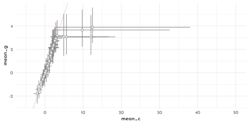

**M4**


```r
model_frog_student <- ulam(
  flist = alist(
    surv ~ dbinom( density, p ),
    logit(p) <- alpha_bar + 
      z_alpha[tank] * sigma_alpha,
    z_alpha[tank] ~ dstudent(nu = 2, 0, 1),
    alpha_bar ~ dnorm(0, 1.5),
    sigma_alpha ~ dexp(1),
    gq> vector[tank]:alpha <<- alpha_bar + z_alpha * sigma_alpha
  ),
  data = data_frogs,
  control = list(adapt_delta = 0.99),
  cores = 4,
  chains = 4,
  max_treedepth = 15,
  log_lik = TRUE
)
```


```r
p1 <- precis(model_frog_student, depth = 2) %>% 
  data.frame() %>% 
  rownames_to_column() %>% 
  dplyr::select(rowname, mean_s = mean,  ll_s = `X5.5.`, hh_s =  X94.5.) %>% 
  as_tibble() %>% 
  left_join(precis(model_frog_tank, depth = 2) %>% 
              data.frame() %>% 
              rownames_to_column() %>% 
              dplyr::select(rowname, mean_g = mean,  ll_g = `X5.5.`, hh_g =  X94.5.) %>% 
              as_tibble()) %>% 
  filter(grepl("^alpha", rowname)) %>% 
  ggplot(aes(x = mean_s, y = mean_g)) +
  geom_abline(slope = 1,
              intercept = 0,
              color = clr_current,
              linetype = 3) +
  geom_linerange(aes(xmin = ll_s, xmax = hh_s), 
                 color = clr0dd)+
  geom_linerange(aes(ymin = ll_g, ymax = hh_g), 
                 color = clr0dd) +
  geom_point(color = clr0dd, fill = clr0, 
             shape = 21, size = 2) 


p2 <- precis(model_frog_student, depth = 2) %>% 
  data.frame() %>% 
  rownames_to_column() %>% 
  dplyr::select(rowname, mean_s = mean,  ll_s = `X5.5.`, hh_s =  X94.5.) %>% 
  as_tibble() %>% 
  left_join(precis(model_frog_cauchy, depth = 2) %>% 
              data.frame() %>% 
              rownames_to_column() %>% 
              dplyr::select(rowname, mean_c = mean,  ll_c = `X5.5.`, hh_c =  X94.5.) %>% 
              as_tibble()) %>% 
  filter(grepl("^alpha", rowname)) %>% 
  ggplot(aes(x = mean_s, y = mean_c)) +
  geom_abline(slope = 1,
              intercept = 0,
              color = clr_current,
              linetype = 3) +
  geom_linerange(aes(xmin = ll_s, xmax = hh_s), 
                 color = clr0dd)+
  geom_linerange(aes(ymin = ll_c, ymax = hh_c), 
                 color = clr0dd) +
  geom_point(color = clr0dd, fill = clr0, 
             shape = 21, size = 2) +
  coord_cartesian(ylim = c(-5, 50),
                  xlim = c(-7, 10))

p1 + p2
```

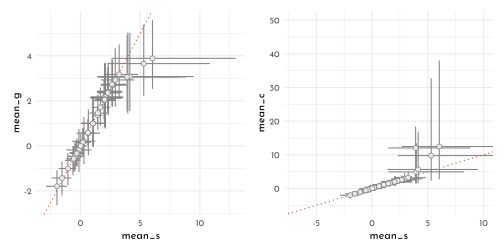

**M5**

Adding a mean $\gamma$ to the cimpanzee model

$$
\begin{array}{rcl}
\gamma_{j} & \sim & \textrm{Normal}(\bar{\gamma}, \sigma_{\gamma})\\
\bar{\gamma} & \sim & \textrm{Normal}(0, 1.5)
\end{array}
$$


```r
model_chimp_multicluster_adapt <- ulam(
  flist = alist(
    pulled_left ~ dbinom( 1, p ),
    logit(p) <- alpha[actor] + gamma[block] + beta[treatment],
    beta[treatment] ~ dnorm(0,.5),
    ## adaptive priors
    alpha[actor] ~ dnorm( alpha_bar, sigma_alpha ),
    gamma[block] ~ dnorm( gamma_bar, sigma_gamma ),
    ## hyper-priors
    alpha_bar ~ dnorm( 0, 1.5 ),
    gamma_bar ~ dnorm( 0, 1.5 ),
    sigma_alpha ~ dexp(1),
    sigma_gamma ~ dexp(1)
  ),
  data = data_chimp_list,
  cores = 4,
  chains = 4,
  log_lik = TRUE
)
```


```r
compare(model_chimp_multicluster,
        model_chimp_multicluster_adapt) %>% 
  knit_precis(param_name = "model")
```


|model                          |   WAIC|    SE| dWAIC|  dSE| pWAIC| weight|
|:------------------------------|------:|-----:|-----:|----:|-----:|------:|
|model_chimp_multicluster       | 531.72| 19.11|  0.00|   NA| 10.31|   0.58|
|model_chimp_multicluster_adapt | 532.36| 19.35|  0.64| 0.57| 10.72|   0.42|


```r
precis(model_chimp_multicluster) %>% 
  knit_precis()
```


|param       | mean|   sd|  5.5%| 94.5%|  n_eff| Rhat4|
|:-----------|----:|----:|-----:|-----:|------:|-----:|
|alpha_bar   | 0.77| 0.84| -0.50|  2.23|  30.19|  1.09|
|sigma_alpha | 2.05| 0.65|  1.22|  3.28| 943.63|  1.00|
|sigma_gamma | 0.19| 0.17|  0.01|  0.50|  84.28|  1.05|


```r
precis(model_chimp_multicluster_adapt) %>% 
  knit_precis()
```


|param       | mean|   sd|  5.5%| 94.5%|  n_eff| Rhat4|
|:-----------|----:|----:|-----:|-----:|------:|-----:|
|alpha_bar   | 0.32| 1.10| -1.39|  2.07| 268.26|  1.02|
|gamma_bar   | 0.36| 1.09| -1.41|  2.12| 189.44|  1.03|
|sigma_alpha | 2.02| 0.66|  1.20|  3.26| 766.25|  1.00|
|sigma_gamma | 0.22| 0.16|  0.05|  0.52| 407.83|  1.00|


```r
bar_alpha_single <- extract.samples(model_chimp_multicluster) %>% 
  as.data.frame() %>% 
  as_tibble() %>% 
  .$alpha_bar %>% 
  quantile(prob = c(.055, .25, .5, .75, .955)) %>% 
  tibble(alpha_bar = .,
            prob = c("ll", "l", "m", "h", "hh"))

extract.samples(model_chimp_multicluster_adapt) %>% 
  as.data.frame() %>% 
  as_tibble() %>% 
  dplyr::select(ends_with("bar")) %>% 
  ggplot(aes(x = alpha_bar, y = gamma_bar)) +
  geom_rect(data = bar_alpha_single %>% 
              pivot_wider(names_from = prob,
                          values_from = alpha_bar),
            inherit.aes = FALSE,
            aes(xmin = ll, xmax = hh,
                ymin = -Inf, ymax = Inf),
            color = "transparent", fill = fll0) +
  geom_rect(data = bar_alpha_single %>% 
              pivot_wider(names_from = prob,
                          values_from = alpha_bar),
            inherit.aes = FALSE,
            aes(xmin = l, xmax = h,
                ymin = -Inf, ymax = Inf),
            color = "transparent", fill = fll0) +
  geom_hex(aes(color = ..count.., fill = after_scale(clr_alpha(color,.85))),
           bins = 40) +
  geom_vline(data = bar_alpha_single %>% 
               pivot_wider(names_from = prob,
                           values_from = alpha_bar),
             aes(xintercept = m),
             color = clr_dark, linetype = 3) +
  scale_color_gradientn(colours = c(clr_dark, clr0, clr_current)) +
  guides(color = guide_colorbar(title.position = "top",
                                barwidth = unit(.9, "npc"),
                                barheight = unit(5, "pt"))) +
  theme(legend.position = "bottom")
```


**M6**


```r
data_y <- list(y = 0)

model_nn <- quap(
  flist = alist(
    y ~ dnorm(mean = mu, sd =  1),
    mu ~ dnorm(mean = 10, sd =  1)
  ),
  data = data_y
)

model_nt <- quap(
  flist = alist(
    y ~ dnorm(mean = mu, sd =  1),
    mu ~ dstudent(nu = 2, mu = 10, sigma =  1)
  ),
  data = data_y
)

model_tn <- quap(
  flist = alist(
    y ~ dstudent(nu = 2, mu = mu, sigma =  1),
    mu ~ dnorm(mean = 10, sd =  1)
  ),
  data = data_y
)

model_tt <- quap(
  flist = alist(
     y ~ dstudent(nu = 2, mu = mu, sigma =  1),
    mu ~ dstudent(nu = 2, mu = 10, sigma =  1)
  ),
  data = data_y
)
```


```r
p1 <- tibble_precis(model_nn) %>% 
  bind_rows(tibble_precis(model_nt)) %>% 
  bind_rows(tibble_precis(model_tn)) %>% 
  bind_rows(tibble_precis(model_tt)) %>% 
  ggplot(aes(y = model, x = mean)) +
  geom_linerange(aes(xmin = `X5.5.`, xmax = `X94.5.`), color = clr0dd) +
  geom_point(shape = 21, fill = clr0, color = clr0dd) +
  labs(y = NULL, x = "mu")

# x_vect <- seq(-5, 20, length.out = 101)
n <- 1e3
dens_fun <- function(type, x = x_vect,
                     mean = 10, sd = 1){
  switch(type,
         "normal" = rnorm(n = n, mean = mean, sd),
         "student" = rstudent(n = n, nu = 2, mu = mean,sigma = sd)
         )
}

p2 <- crossing(y = c("normal", "student"),
         mu = c("normal", "student")) %>% 
  mutate(model = str_c("model_", str_sub(y,1,1),str_sub(mu, 1,1)),
         dist = purrr::map2(y, mu,
                             function(y, mu){
                               tibble(y_dens = dens_fun(type = y, mean = 0),
                                      mu_dens = dens_fun(type = mu))})) %>% 
  unnest(dist) %>%
  pivot_longer(cols = y_dens:mu_dens) %>% 
  mutate(dist = if_else(name == "y_dens", y, mu)) %>% 
  ggplot(aes(y = model)) +
  stat_slab(aes(x = value, 
                color = dist,
                fill = after_scale(clr_alpha(color))),
            size = .5, normalize = "xy", height = .85, trim = FALSE) +
  coord_cartesian(xlim = c(-5, 15)) +
  scale_color_manual(values = c(clr_dark, clr0d)) +
  labs(y = NULL)
  
p1 + p2
```

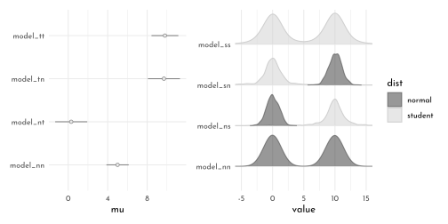

- If the likelihood is $y \sim Normal()$, it is less likely to be pulled from 0 by the prior for $\mu$ compared to when $y \sim Student()$
- When the prior is $\mu \sim Normal()$, then it is more regularizing than with $\mu \sim Student()$ ($\rightarrow$ it pulls harder)

**H1**


```r
data("bangladesh")

data_bangaldesh <- bangladesh %>% 
  as_tibble() %>% 
  mutate(district_idx = as.integer(as.factor(district)))  %>% 
  rename(contraception = use.contraception) 

rm(bangladesh)

tibble(district_idx = sort(unique(data_bangaldesh$district))) %>% 
  mutate(check_increment = district_idx - lag(district_idx,default = 0)) %>% 
  arrange(-check_increment)
```

```
#> # A tibble: 60 × 2
#>    district_idx check_increment
#>           <int>           <dbl>
#>  1           55               2
#>  2            1               1
#>  3            2               1
#>  4            3               1
#>  5            4               1
#>  6            5               1
#>  7            6               1
#>  8            7               1
#>  9            8               1
#> 10            9               1
#> # … with 50 more rows
```

```r
sort(unique(data_bangaldesh$district))
```

```
#>  [1]  1  2  3  4  5  6  7  8  9 10 11 12 13 14 15 16 17 18 19 20 21 22 23 24 25
#> [26] 26 27 28 29 30 31 32 33 34 35 36 37 38 39 40 41 42 43 44 45 46 47 48 49 50
#> [51] 51 52 53 55 56 57 58 59 60 61
```

```r
sort(unique(data_bangaldesh$district_idx))
```

```
#>  [1]  1  2  3  4  5  6  7  8  9 10 11 12 13 14 15 16 17 18 19 20 21 22 23 24 25
#> [26] 26 27 28 29 30 31 32 33 34 35 36 37 38 39 40 41 42 43 44 45 46 47 48 49 50
#> [51] 51 52 53 54 55 56 57 58 59 60
```


```r
data_bangaldesh_list <- data_bangaldesh %>% 
  dplyr::select(woman, district_idx, contraception) %>% 
  as.list()

model_bangladesh_classic <- ulam(
  flist = alist(
    contraception ~ dbinom(1, p),
    logit(p) <- alpha[district_idx],
    alpha[district_idx] ~ dnorm(0, 1.5)
  ),
  data = data_bangaldesh_list,
  cores = 4,
  chain = 4,
  log_lik = TRUE
)

model_bangladesh_multilevel <- ulam(
  flist = alist(
    contraception ~ dbinom(1, p),
    logit(p) <- alpha_bar + z_alpha[district_idx] * sigma_alpha,
    z_alpha[district_idx] ~ dnorm(0, 1),
    alpha_bar ~ dnorm(0, 1.5),
    sigma_alpha ~ dexp(1),
    gq> vector[district_idx]:alpha <<- alpha_bar + z_alpha * sigma_alpha
  ),
  data = data_bangaldesh_list,
  cores = 4,
  chain = 4,
  log_lik = TRUE
)
```


```r
new_districts <- distinct(data_bangaldesh, district_idx)


get_district_posterior <- function(model){
  mod_name <- deparse(substitute(model))
  
  link(model, data = new_districts) %>% 
  data.frame() %>% 
  as_tibble() %>% 
  summarise(across(everything(),
                   function(x){
                     list(tibble(value = quantile(x, prob = c(.055, .25, .5, .75, .955)),
                            lab = c("ll", "l", "m", "h", "hh")))
                     })) %>% 
  pivot_longer(everything()) %>% 
  bind_cols(new_districts, .)  %>% 
  unnest(value) %>% 
  pivot_wider(names_from = lab, values_from = value) %>% 
  mutate(model = mod_name)
}

get_district_posterior(model_bangladesh_classic) %>% 
  bind_rows(get_district_posterior(model_bangladesh_multilevel)) %>% 
  mutate(model_short = str_remove( model, ".*_"),
         xshift = -.33 * (1.5 - as.numeric(as.factor(model_short))),
         x = as.numeric(factor(district_idx)) + xshift) %>%
  ggplot(aes(x = x,
             color = model_short)) +
  geom_linerange(aes(ymin = ll, ymax = hh), size = .2) +
  geom_linerange(aes(ymin = l, ymax = h), size = .5) +
  geom_point(aes(y = m, fill = after_scale(clr_lighten(color))), shape = 21) +
  scale_color_manual(values = c(clr_dark, clr_current)) +
  scale_x_continuous(breaks = 2 * (1:30) - 1 ) +
  coord_cartesian(ylim = 0:1) +
  labs(y = "probability of using contraception", x = "district") +
  theme(legend.position = "bottom",
        panel.grid.major.x = element_blank(),
        panel.grid.minor.x = element_blank())
```

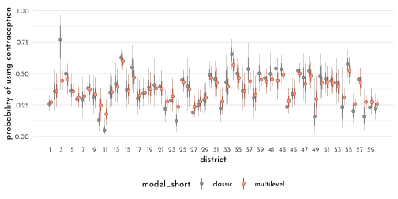

$\rightarrow$ the `model_bangladesh_multilevel` regresses *to the mean* (eg. district no. 3)

**H2**


```r
chapter12_models <- read_rds("envs/chapter12_models.rds")

data_trolley_list3 <- chapter12_models$data_trolley %>%
  mutate(id_idx = as.integer(id)) %>% 
  dplyr::select(response, action, intention, contact, id_idx) %>% 
  as.list()
```


```{.r .bg-save}
model_trolley_predict_multi <- ulam(
  flist = alist(
    response ~ dordlogit( phi, cutpoints ),
    phi <- alpha_bar + z_alpha[id_idx] * sigma_alpha + 
      beta_a * action + beta_c * contact + B_i * intention,
    B_i <- beta_i + beta_ia * action + beta_ic * contact,
    c(beta_a, beta_c, beta_i, beta_ia, beta_ic) ~ dnorm(0, 0.5),
    cutpoints ~ dnorm(0, 1.5),
    alpha_bar ~ dnorm(0, 1),
    z_alpha[id_idx] ~ dnorm(0, 1),
    sigma_alpha ~ dexp(1)
  ),
  data = data_trolley_list3,
  chains = 4,
  cores = 4,
  log_lik = TRUE
)

write_rds(model_trolley_predict_multi,
          file = "brms/ulam_c13_model_trolley_predict_multi.rds")
```


```r
model_trolley_predict_multi <- read_rds("brms/ulam_c13_model_trolley_predict_multi.rds")
```


```r
precis(model_trolley_predict_multi) %>% 
  knit_precis()
```


|param       |  mean|   sd|  5.5%| 94.5%|   n_eff| Rhat4|
|:-----------|-----:|----:|-----:|-----:|-------:|-----:|
|beta_ic     | -1.66| 0.10| -1.82| -1.51| 1513.39|  1.00|
|beta_ia     | -0.55| 0.08| -0.68| -0.42| 1271.30|  1.00|
|beta_i      | -0.39| 0.06| -0.48| -0.29| 1243.37|  1.00|
|beta_c      | -0.46| 0.07| -0.57| -0.34| 1471.66|  1.00|
|beta_a      | -0.65| 0.06| -0.74| -0.57| 1326.95|  1.00|
|alpha_bar   |  0.78| 0.56| -0.10|  1.69| 1204.08|  1.00|
|sigma_alpha |  1.92| 0.08|  1.78|  2.06|  270.67|  1.03|


```r
precis(chapter12_models$model_trolley_predict) %>% 
  knit_precis()
```


|param   |  mean|   sd|  5.5%| 94.5%|   n_eff| Rhat4|
|:-------|-----:|----:|-----:|-----:|-------:|-----:|
|beta_ic | -1.24| 0.10| -1.39| -1.08| 1115.74|     1|
|beta_ia | -0.43| 0.08| -0.56| -0.31| 1266.84|     1|
|beta_i  | -0.29| 0.06| -0.39| -0.20| 1097.48|     1|
|beta_c  | -0.34| 0.07| -0.45| -0.24| 1174.36|     1|
|beta_a  | -0.47| 0.05| -0.56| -0.39| 1232.07|     1|


```r
compare(chapter12_models$model_trolley_predict,
        model_trolley_predict_multi)
```

```
#>                                            WAIC        SE    dWAIC      dSE
#> model_trolley_predict_multi            31055.82 179.48037    0.000       NA
#> chapter12_models$model_trolley_predict 36928.89  80.74662 5873.076 173.6475
#>                                            pWAIC weight
#> model_trolley_predict_multi            356.03065      1
#> chapter12_models$model_trolley_predict  10.79849      0
```


```r
posterior_comparison <- tibble_precis(chapter12_models$model_trolley_predict) %>% 
  bind_rows(tibble_precis(model_trolley_predict_multi))

posterior_comparison %>% 
  ggplot(aes(y = rowname)) +
  geom_vline(xintercept = 0, color = clr_dark, linetype = 3) +
  geom_linerange(aes(xmin = `X5.5.`, xmax = `X94.5.`),
                 color = clr0dd) +
  geom_point(aes(x = mean), 
             color = clr0dd, fill = clr0,
             shape = 21, size = 1.5) +
  facet_wrap(model ~ ., ncol = 1, scales = "free_y")+
  labs(y = NULL)
```


**H3**


```r
data_trolley_list4 <- chapter12_models$data_trolley %>%
  mutate(id_idx = as.integer(id),
         story_idx = as.integer(story)) %>% 
  dplyr::select(response, action, intention, contact, id_idx, story_idx) %>% 
  as.list()
```


```{.r .bg-save}
model_trolley_predict_story <- ulam(
  flist = alist(
    response ~ dordlogit( phi, cutpoints ),
    phi <- alpha_bar + z_alpha[id_idx] * sigma_alpha +
      z_gamma[story_idx] * sigma_gamma +
      beta_a * action + beta_c * contact + B_i * intention,
    B_i <- beta_i + beta_ia * action + beta_ic * contact,
    c(beta_a, beta_c, beta_i, beta_ia, beta_ic) ~ dnorm(0, 0.5),
    cutpoints ~ dnorm(0, 1.5),
    alpha_bar ~ dnorm(0, 1),
    z_alpha[id_idx] ~ dnorm(0, 1),
    sigma_alpha ~ dexp(1),
    z_gamma[story_idx] ~ dnorm(0, 1),
    sigma_gamma ~ dexp(1)
  ),
  data = data_trolley_list4,
  chains = 4,
  cores = 4,
  log_lik = TRUE
)

write_rds(model_trolley_predict_story,
          file = "brms/ulam_c13_model_trolley_predict_story.rds")
```


```r
model_trolley_predict_story <- read_rds("brms/ulam_c13_model_trolley_predict_story.rds")
```


```r
compare(model_trolley_predict_story,
        model_trolley_predict_multi)
```

```
#>                                 WAIC       SE    dWAIC      dSE    pWAIC
#> model_trolley_predict_story 30567.72 180.3282   0.0000       NA 366.6173
#> model_trolley_predict_multi 31055.82 179.4804 488.0974 42.62895 356.0306
#>                                    weight
#> model_trolley_predict_story  1.000000e+00
#> model_trolley_predict_multi 1.025663e-106
```


```r
posterior_comparison <- tibble_precis(model_trolley_predict_story) %>% 
  bind_rows(tibble_precis(model_trolley_predict_multi))

posterior_comparison %>% 
  ggplot(aes(y = rowname)) +
  geom_vline(xintercept = 0, color = clr_dark, linetype = 3) +
  geom_linerange(aes(xmin = `X5.5.`, xmax = `X94.5.`),
                 color = clr0dd) +
  geom_point(aes(x = mean), 
             color = clr0dd, fill = clr0,
             shape = 21, size = 1.5) +
  facet_wrap(model ~ ., ncol = 1, scales = "free_y")+
  labs(y = NULL)
```


**H4**


```r
data_frogs_list <- data_frogs %>% 
  mutate(pred_size_inter = str_c(pred, size, sep = "_") %>% 
           factor(),
         across(c(pred, size, pred_size_inter),
                as.integer,
                .names = "{.col}_idx")) %>% 
  dplyr::select(density, surv, tank, pred_idx,
                size_idx, pred_size_inter_idx) %>% 
  as.list()

model_frog_pred <- ulam(
  flist = alist(
    surv ~ dbinom( density, p ),
    logit(p) <- alpha_bar + 
      z_tank[tank] * sigma_tank +
      z_pred[pred_idx] * sigma_pred,
    ## adaptive priors
    z_tank[tank] ~ dnorm( 0, 1 ),
    z_pred[pred_idx] ~ dnorm( 0, 1 ),
    ## hyper-priors
    alpha_bar ~ dnorm(0, 1.5),
    sigma_tank ~ dexp(1),
    sigma_pred ~ dexp(1),
    gq> vector[tank]:alpha_tank <<- alpha_bar + z_tank * sigma_tank,
    gq> vector[pred_idx]:alpha_pred <<- alpha_bar + z_pred * sigma_pred
  ),
  data = data_frogs_list,
  cores = 4,
  chains = 4,
  log_lik = TRUE
)

model_frog_size <- ulam(
  flist = alist(
    surv ~ dbinom( density, p ),
    logit(p) <- alpha_bar + 
      z_tank[tank] * sigma_tank +
      z_size[size_idx] * sigma_size,
    ## adaptive priors
    z_tank[tank] ~ dnorm( 0, 1 ),
    z_size[size_idx] ~ dnorm( 0, 1 ),
    ## hyper-priors
    alpha_bar ~ dnorm(0, 1.5),
    sigma_tank ~ dexp(1),
    sigma_size ~ dexp(1),
    gq> vector[tank]:alpha_tank <<- alpha_bar + z_tank * sigma_tank,
    gq> vector[size_idx]:alpha_size <<- z_size * sigma_size
  ),
  data = data_frogs_list,
  cores = 4,
  chains = 4,
  log_lik = TRUE
)

model_frog_size_pred <- ulam(
  flist = alist(
    surv ~ dbinom( density, p ),
    logit(p) <- alpha_bar + 
      z_tank[tank] * sigma_tank +
      z_pred[pred_idx] * sigma_pred + 
      z_size[size_idx] * sigma_size,
    ## adaptive priors
    z_tank[tank] ~ dnorm( 0, 1 ),
    z_size[size_idx] ~ dnorm( 0, 1 ),
    z_pred[pred_idx] ~ dnorm( 0, 1 ),
    ## hyper-priors
    alpha_bar ~ dnorm(0, 1.5),
    sigma_size ~ dexp(1),
    sigma_tank ~ dexp(1),
    sigma_pred ~ dexp(1),
    gq> vector[tank]:alpha_tank <<- alpha_bar + z_tank * sigma_tank,
    gq> vector[size_idx]:alpha_size <<- z_size * sigma_size,
    gq> vector[pred_idx]:alpha_pred <<- z_pred * sigma_pred
  ),
  data = data_frogs_list,
  cores = 4,
  chains = 4,
  log_lik = TRUE
)

model_frog_size_pred_inter <- ulam(
  flist = alist(
    surv ~ dbinom( density, p ),
    logit(p) <- alpha_bar + 
      z_tank[tank] * sigma_tank +
      z_pred[pred_idx] * sigma_pred + 
      z_size[size_idx] * sigma_size +
      z_inter[pred_size_inter_idx] * sigma_inter,
    ## adaptive priors
    z_tank[tank] ~ dnorm( 0, 1 ),
    z_size[size_idx] ~ dnorm( 0, 1 ),
    z_pred[pred_idx] ~ dnorm( 0, 1 ),
    z_inter[pred_size_inter_idx] ~ dnorm( 0, 1 ),
    ## hyper-priors
    alpha_bar ~ dnorm(0, 1.5),
    sigma_size ~ dexp(1),
    sigma_tank ~ dexp(1),
    sigma_pred ~ dexp(1),
    sigma_inter ~ dexp(1),
    gq> vector[tank]:alpha_tank <<- alpha_bar + z_tank * sigma_tank,
    gq> vector[size_idx]:alpha_size <<- z_size * sigma_size,
    gq> vector[pred_idx]:alpha_pred <<- z_pred * sigma_pred,
    gq> vector[pred_size_inter_idx]:alpha_inter <<-  z_inter * sigma_inter
  ),
  data = data_frogs_list,
  cores = 4,
  chains = 4,
  log_lik = TRUE
)
```


```r
compare(model_frog_pred,
        model_frog_size,
        model_frog_size_pred,
        model_frog_size_pred_inter)
```

```
#>                                WAIC       SE     dWAIC      dSE    pWAIC
#> model_frog_size_pred       199.4890 8.983376 0.0000000       NA 19.01785
#> model_frog_size_pred_inter 199.7571 9.286128 0.2681206 2.018589 19.08583
#> model_frog_pred            200.4490 9.387933 0.9599531 2.017005 19.70884
#> model_frog_size            201.8626 7.213050 2.3735980 5.750028 21.76818
#>                               weight
#> model_frog_size_pred       0.3573302
#> model_frog_size_pred_inter 0.3124986
#> model_frog_pred            0.2211152
#> model_frog_size            0.1090560
```


```r
tibble_precisposterior_comparison <- tibble_precis(model_frog_pred, depth = 2) %>% 
  bind_rows(tibble_precis(model_frog_size, depth = 2)) %>% 
  bind_rows(tibble_precis(model_frog_size_pred, depth = 2)) %>% 
  bind_rows(tibble_precis(model_frog_size_pred_inter, depth = 2)) %>% 
  mutate(model = str_remove(model, "model_frog_"))

level_cpt <- data_frogs_list %>% as_tibble() %>% 
  mutate(lab = glue("{pred_size_inter_idx}: ({levels(data_frogs$size)[size_idx]} | {levels(data_frogs$pred)[pred_idx]})")) %>% 
  dplyr::select(lab) %>% 
  distinct() %>% 
  .$lab %>% str_c(collapse = "; ") %>% 
  str_c("Interaction Levels: ",.)

posterior_comparison %>%
  filter(grepl("sigma|alpha", rowname) & !grepl("tank", rowname)) %>% 
  ggplot(aes(y = model, color = model)) +
  geom_vline(xintercept = 0, color = clr_dark, linetype = 3) +
  geom_linerange(aes(xmin = `X5.5.`, xmax = `X94.5.`)#,
                 #color = clr0dd
                 ) +
  geom_point(aes(x = mean, color = model, fill = after_scale(clr_lighten(color))), 
             # color = clr0dd, fill = clr0,
             shape = 21, size = 1.5) +
  facet_wrap(rowname ~ .,# ncol = 1,
             scales = "free_y",dir = "v") +
  scale_color_manual(values = c(clr_dark, clr1, clr2, clr3), guide = 'none') +
  labs(y = NULL, x = NULL, caption = level_cpt)
```

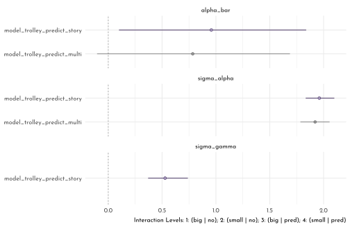


```r
pair_model <- function(model, clr_current = clr_dark){
  p <- extract.samples(model) %>% 
    data.frame() %>% 
    as_tibble() %>% 
    dplyr::select(contains("alpha_pred"),
                  contains("alpha_size"),
                  #contains("sigma")
                  sigma_tank#,
                  # contains("alpha_inter")
    ) %>% 
    set_names(x = ., nm = names(.) %>% str_remove(pattern = "alpha_")) %>% 
    ggpairs( lower = list(continuous = wrap(my_lower, col = clr_current, bins = 25)),
             diag = list(continuous = wrap("densityDiag", fill = fll0,
                                           color = clr_current,
                                           fill = clr_alpha(clr_current), 
                                           adjust = .7)),
             upper = list(continuous = wrap(my_upper , size = 4, 
                                            color = "black", family = fnt_sel)) ) +
    theme(panel.border = element_rect(color = clr_dark,
                                      fill = "transparent"))
  
  ggmatrix_gtable(p)
}

cowplot::plot_grid(
  cowplot::plot_grid(pair_model(model_frog_size, clr_dark),
                     pair_model(model_frog_pred, clr1), ncol = 1),
  pair_model(model_frog_size_pred, clr2),
  pair_model(model_frog_size_pred_inter, clr3),
  nrow = 1, rel_widths = c(.75, 1, 1))
```

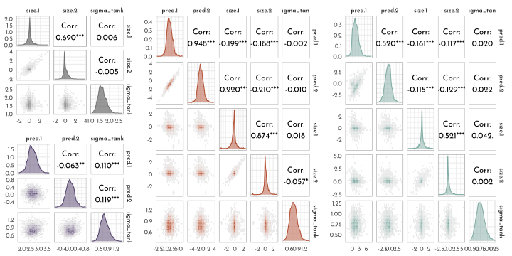


## {brms} section

### Multilevel Tadpoles


```r
brms_c13_model_frog_single <- brm(
  data = data_frogs,
  family = binomial,
  surv | trials(density) ~ 0 + factor(tank),
  prior(normal(0, 1.5), class = b),
  iter = 2000, warmup = 1000,
  chains = 4, cores = 4,
  seed = 42,
  file = "brms/brms_c13_model_frog_single")


library(tidybayes)
fixef(brms_c13_model_frog_single) %>% 
  as_tibble() %>% 
  mutate(p = inv_logit_scaled(Estimate)) %>% 
  pivot_longer(Estimate:p) %>% 
  mutate(name = if_else(name == "p",
                        "expected survival probability",
                        "expected survival log-odds")) %>% 
  ggplot(aes(x = value, color = name)) +
  stat_slab(slab_type = "pdf",
            aes(fill_ramp = stat(cut_cdf_qi(cdf, .width = c(1, .95, 0.66)))),
            color = clr0d, size = .5,
            adjust = .75,
            normalize = "xy",
            trim = FALSE, n = 301) +
  scale_colour_ramp_discrete(from = clr_dark, aesthetics = "fill_ramp", guide = "none")+
  facet_wrap(~ name, scales = "free_x") +
  scale_y_continuous(breaks = NULL) +
  labs(title = "Tank-level intercepts from the no-pooling model",
       subtitle = "Notice now inspecting the distributions of the posterior means can offer\ninsights you might not get if you looked at them one at a time",
       y = "density", x = NULL)
```


> *The syntax for the varying effects follows the __lme4__ style, ( `<varying parameter(s)> | <grouping variable(s)>` ). In this case (`1 | tank`) indicates only the intercept, `1`, varies by `tank`. The extent to which parameters vary is controlled by the prior, `prior(exponential(1), class = sd)`, which is __parameterized in the standard deviation metric__. Do note that last part. It’s common in multilevel software to model in the variance metric, instead.*


```r
brms_c13_model_frog_multi <- brm(
  data = data_frogs, 
  family = binomial,
  surv | trials(density) ~ 1 + (1 | tank),
  prior = c(prior(normal(0, 1.5), class = Intercept),  # bar alpha
            prior(exponential(1), class = sd)),        # sigma
  iter = 5000, warmup = 1000,
  chains = 4, cores = 4,
  sample_prior = "yes",
  seed = 42,
  file = "brms/brms_c13_model_frog_multi")

brms_c13_model_frog_single <- add_criterion(brms_c13_model_frog_single, "waic")
brms_c13_model_frog_multi <- add_criterion(brms_c13_model_frog_multi, "waic")

(w <- loo_compare(brms_c13_model_frog_single, 
                  brms_c13_model_frog_multi,
                  criterion = "waic"))
```

$$\begin{bmatrix} 0 &0 \\-100.080713925655 &3.65719797675975 \\20.9937640102151 &0.806322918256096 \\200.16142785131 &7.3143959535195 \\-7.0516701236133 &1.85830328721338 \\-107.132384049268 &2.30310130945441 \\25.4020567497694 &1.27920271752106 \\214.264768098536 &4.60620261890881 \\ \end{bmatrix}$$

> *The `se_diff` is small relative to the `elpd_diff`. If we convert the $elpd$ difference to the WAIC metric, the message stays the same.*


```r
cbind(waic_diff = w[, 1] * -2,
      se        = w[, 2] *  2)
```

$$\begin{bmatrix} 0 &0 \\14.1033402472266 &3.71660657442677 \\ \end{bmatrix}$$

```r
model_weights(brms_c13_model_frog_single, 
              brms_c13_model_frog_multi,
              weights = "waic") %>% 
  round(digits = 2)
```

```
#> brms_c13_model_frog_single  brms_c13_model_frog_multi 
#>                          0                          1
```

> *...the number of effective parameters for the two models. This, recall, is listed in the column for `p_waic`.*


```r
w[, "p_waic"]
```

```
#>  brms_c13_model_frog_multi brms_c13_model_frog_single 
#>                   20.99376                   25.40206
```


```r
brms_frogs_posterior <- as_draws_df(brms_c13_model_frog_multi) %>% 
  as_tibble()

posterior_median <- coef(brms_c13_model_frog_multi,
                         robust = TRUE)$tank[, , ] %>% 
  data.frame() %>% 
  bind_cols(data_frogs, .) %>%
  mutate(posterior_median = inv_logit_scaled(Estimate))

posterior_median %>%
  ggplot(aes(x = tank)) +
  geom_hline(yintercept = inv_logit_scaled(median(brms_frogs_posterior$b_Intercept)),
             linetype = 3, size = .5, color = clr_dark) +
  geom_point(aes(y = propsurv),
             color = clr_dark, shape = 19, size = 2) +
  geom_point(aes(y = posterior_median),
             shape = 1, size = 2) +
  facet_wrap(density ~ ., labeller = label_both) +
  scale_x_continuous(breaks = c(1, 16, 32, 48)) +
  scale_y_continuous(breaks = 0:5 / 5, limits = c(0, 1)) +
  labs(title = "Multilevel shrinkage!",
       subtitle = "The empirical proportions are in gray while the model-implied proportions are\nthe black circles. The dashed line is the model-implied average survival proportion.") +
  theme(panel.grid.major = element_blank(),
        panel.border = element_rect(fill = "transparent",
                                    color = clr0d))
```


```r
p1 <- brms_frogs_posterior %>% 
  mutate(iter = 1:n()) %>% 
  slice_sample(n = 100) %>% 
  expand(nesting(iter, b_Intercept, sd_tank__Intercept),
         x = seq(from = -4, to = 5, length.out = 100)) %>%
  mutate(density = dnorm(x, mean = b_Intercept, sd = sd_tank__Intercept)) %>% 
  ggplot(aes(x = x, y = density, group = iter)) +
  geom_line(alpha = .2, color = clr_dark) +
  scale_y_continuous(NULL, breaks = NULL) +
  labs(title = "Population survival distribution",
       subtitle = "log-odds scale",
       x = "log-ods survival") +
  coord_cartesian(xlim = c(-3, 4))

p2 <- brms_frogs_posterior %>% 
  slice_sample(n = 8000, replace = TRUE) %>% 
  mutate(sim_tanks = rnorm(n(), mean = b_Intercept, sd = sd_tank__Intercept)) %>% 
  
  ggplot(aes(x = inv_logit_scaled(sim_tanks))) +
  geom_density(size = .5, fill = fll0, color = clr0dd, adjust = 0.1) +
  scale_y_continuous(NULL, breaks = NULL) +
  labs(title = "Probability of survival",
       subtitle = "transformed by the inverse-logit function",
       x = "p")

p1 + p2
```


**Priors for variance components**


```r
brms_c13_model_frog_multi_update <- update(
  brms_c13_model_frog_multi,
  prior = c(prior(normal(0, 1.5), class = Intercept),
            prior(normal(0, 1), class = sd)),
  iter = 5000, warmup = 1000,
  chains = 4, cores = 4,
  sample_prior = "yes",
  seed = 42,
  file = "brms/brms_c13_model_frog_multi_update")
```

> *McElreath mentioned how one might set a lower bound at zero for the half-Normal prior when using `rethinking::ulam()`. There’s no need to do so when using `brms::brm()`. The lower bounds for priors of class = sd are already set to zero by default.*

> *If you’re curious how the exponential and half-Normal priors compare to one another and to their posteriors, you might just plot.*


```r
tibble(`prior_Exponential(1)`        = prior_draws(brms_c13_model_frog_multi) %>% pull(sd_tank),
       `posterior_Exponential(1)`    = as_draws_df(brms_c13_model_frog_multi) %>% pull(sd_tank__Intercept),
       `prior_Half-Normal(0, 1)`     = prior_draws(brms_c13_model_frog_multi_update) %>% pull(sd_tank),
       `posterior_Half-Normal(0, 1)` = as_draws_df(brms_c13_model_frog_multi_update) %>% pull(sd_tank__Intercept)) %>% 
  pivot_longer(everything(),
               names_sep = "_",
               names_to = c("distribution", "prior")) %>% 
  mutate(distribution = factor(distribution, levels = c("prior", "posterior"))) %>% 
  ggplot(aes(x = value, color = distribution)) +
  geom_density(size = .5, adjust = 0.5,
               aes(fill = after_scale(clr_alpha(color)))) +
  scale_color_manual(NULL, values = c(clr0d, clr_dark)) +
  scale_y_continuous(NULL, breaks = NULL) +
  labs(subtitle = "Hierarchical sigma parameter") +
  coord_cartesian(xlim = c(0, 4)) +
  facet_wrap(~ prior) +
  theme(legend.position = "bottom",
        axis.title.x = element_blank(),
        panel.border = element_rect(fill = "transparent",
                                    color = clr0d))
```


### Varying Effects and the Underfitting/Overfitting Trade-Off

**Compute the partial-pooling estimates**

The multi-level partial-pooling model:


```r
brms_c13_model_sim_partial <- brm(
  data = data_sim, 
  family = binomial,
  surv_i | trials(n_i) ~ 1 + ( 1 | pond_idx ),
  prior = c(prior(normal(0, 1.5), class = Intercept),
            prior(exponential(1), class = sd)),
  iter = 2000, warmup = 1000,
  chains = 4, cores = 4,
  seed = 42,
  file = "brms/brms_c13_model_sim_partial")
```


```r
brms_sim_posterior <- coef(brms_c13_model_sim_partial)$pond[, , ] %>% 
  data.frame() %>%
  transmute(p_partpool = inv_logit_scaled(Estimate)) %>%
  bind_cols(data_sim, .) %>% 
  mutate(p_true = inv_logit_scaled(true_alpha),
         no_pool_error   = abs(p_no_pool   - p_true),
         part_pool_error = abs(p_partpool - p_true))

dfline <- brms_sim_posterior %>%
  select(n_i, no_pool_error:part_pool_error) %>%
  pivot_longer(-n_i) %>%
  group_by(name, n_i) %>%
  summarise(mean_error = mean(value)) %>%
  mutate(x    = c( 1, 16, 31, 46),
         xend = c(15, 30, 45, 60))

brms_sim_posterior %>% 
  ggplot(aes(x = pond_idx)) +
  geom_point(aes(y = no_pool_error),
             shape = 19, color = clr0dd, size = 2) +
  geom_point(aes(y = part_pool_error),
             shape = 1, size = 2) +
  geom_segment(data = dfline, 
               aes(x = x, xend = xend, 
                   y = mean_error, yend = mean_error),
               color = rep(c(clr0dd, clr_dark), each = 4),
               linetype = rep(c(1,3), each = 4)) +
  scale_x_continuous(breaks = c(1, 10, 20, 30, 40, 50, 60)) +
  facet_wrap(n_i ~ . , scales = "free_x", nrow = 1, labeller = label_both) +
  labs(title = "Estimate error by model type",
       subtitle = "The horizontal axis displays pond number. The vertical axis measures the absolute error\n in the predicted proportion of survivors, compared to the true value used in the simulation.\nThe higher the point, the worse the estimate. No-pooling shown in gray, Partial pooling\nshown in black. The gray and dashed black lines show the average error for each\nkind of estimate, across each initial density of tadpoles (pond size).",
       y = "absolute error") +
  theme(panel.grid.major = element_blank(),
        plot.subtitle = element_text(size = 10),
        panel.border = element_rect(fill = "transparent",
                                    color = clr0d))
```

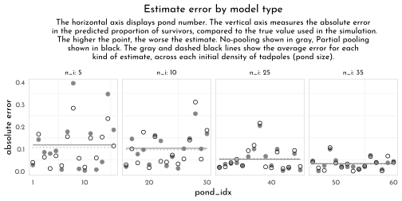

> *If you wanted to quantify the difference in simple summaries, you might execute something like this.*


```r
brms_sim_posterior %>%
  select(n_i, no_pool_error:part_pool_error) %>%
  pivot_longer(-n_i) %>%
  group_by(name) %>%
  summarise(mean_error   = mean(value) %>% round(digits = 3),
            median_error = median(value) %>% round(digits = 3))
```

```
#> # A tibble: 2 × 3
#>   name            mean_error median_error
#>   <chr>                <dbl>        <dbl>
#> 1 no_pool_error        0.077        0.046
#> 2 part_pool_error      0.073        0.043
```

**Repeating the pond simulation**

> *Within the __brms__ workflow, we can reuse a compiled model with `update()`. But first, we’ll simulate new data.*


```r
set.seed(23)
alpha_bar <- 1.5
sigma <- 1.5
n_ponds <- 60
pond_levels <- c("tiny", "small", "medium", "large")
data_sim_new <- tibble(pond_idx = 1:n_ponds,
                   n_i = rep(c(5, 10, 25, 35), each = 15),
                   pond_size = rep(pond_levels, each = 15) %>% 
                     factor(levels = pond_levels),
                   true_alpha = rnorm(n = n_ponds, mean = alpha_bar, sd = sigma),
                   surv_i = rbinom(n_ponds, prob = logistic(true_alpha), size = n_i),
                   p_true = inv_logit(true_alpha),
                   p_no_pool = surv_i / n_i)

brms_c13_model_sim_partial_new <- update(
  brms_c13_model_sim_partial,
  newdata = data_sim_new,
  chains = 4, cores = 4,
  seed = 42,
  file = "brms/brms_c13_model_sim_partial_new")
```

> *Why not plot the first simulation versus the second one?*


```r
bind_rows(as_draws_df(brms_c13_model_sim_partial),
          as_draws_df(brms_c13_model_sim_partial_new)) %>%
  mutate(model = rep(c("original_data", "new_data"), each = n() / 2)) %>% 
  ggplot(aes(x = b_Intercept,
             y = sd_pond_idx__Intercept)) +
  stat_density_2d(geom = "raster", 
                  aes(fill = stat(density)), 
                  contour = FALSE, 
                  n = 200, 
                  alpha = .9) +
  geom_density2d(color = rgb(1,1,1,.75), size = .1) +
  geom_vline(xintercept = alpha_bar,
             color = clr_current, linetype = 3) +
  geom_hline(yintercept = sigma,
             color = clr_current, linetype = 3) +
  scale_fill_gradient(low = clr0, 
                      high = clr_dark) +
  ggtitle("Our simulation posteriors contrast a bit",
          subtitle = "alpha is on the x and sigma is on the y, both in log-odds.\nThe dotted lines intersect at the true values.") +
  coord_cartesian(xlim = c(.7, 2),
                  ylim = c(.9, 1.9), expand = 0) +
  theme(legend.position = "none",
        panel.grid.major = element_blank()) +
  facet_wrap(~ model, ncol = 2)
```

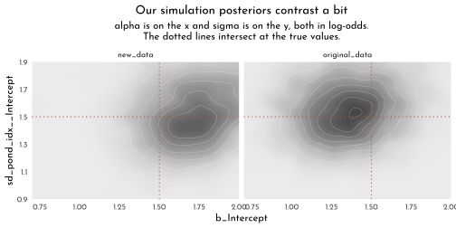

> *If you’d like the `stanfit` portion of your `brm()` object, subset with `$fit.`*


```r
brms_c13_model_sim_partial$fit@stanmodel
```

```
#> S4 class stanmodel 'bbd5b3b656d9a26bdac13a9dd363a8cd' coded as follows:
#> // generated with brms 2.16.1
#> functions {
#> }
#> data {
#>   int<lower=1> N;  // total number of observations
#>   int Y[N];  // response variable
#>   int trials[N];  // number of trials
#>   // data for group-level effects of ID 1
#>   int<lower=1> N_1;  // number of grouping levels
#>   int<lower=1> M_1;  // number of coefficients per level
#>   int<lower=1> J_1[N];  // grouping indicator per observation
#>   // group-level predictor values
#>   vector[N] Z_1_1;
#>   int prior_only;  // should the likelihood be ignored?
#> }
#> transformed data {
#> }
#> parameters {
#>   real Intercept;  // temporary intercept for centered predictors
#>   vector<lower=0>[M_1] sd_1;  // group-level standard deviations
#>   vector[N_1] z_1[M_1];  // standardized group-level effects
#> }
#> transformed parameters {
#>   vector[N_1] r_1_1;  // actual group-level effects
#>   r_1_1 = (sd_1[1] * (z_1[1]));
#> }
#> model {
#>   // likelihood including constants
#>   if (!prior_only) {
#>     // initialize linear predictor term
#>     vector[N] mu = Intercept + rep_vector(0.0, N);
#>     for (n in 1:N) {
#>       // add more terms to the linear predictor
#>       mu[n] += r_1_1[J_1[n]] * Z_1_1[n];
#>     }
#>     target += binomial_logit_lpmf(Y | trials, mu);
#>   }
#>   // priors including constants
#>   target += normal_lpdf(Intercept | 0, 1.5);
#>   target += exponential_lpdf(sd_1 | 1);
#>   target += std_normal_lpdf(z_1[1]);
#> }
#> generated quantities {
#>   // actual population-level intercept
#>   real b_Intercept = Intercept;
#> }
#> 
```

### More than one Type of Cluster

> *⚠️ __WARNING__ ⚠️ I am so sorry, but we are about to head straight into a load of confusion. If you follow along linearly in the text, we won’t have the language to parse this all out until [later] In short, our difficulties will have to do with what are called the centered and the non-centered parameterizations for multilevel models. For the next several models in the text, McElreath used the __centered parameterization__. As we’ll learn [later], this often causes problems when you use Stan to fit your multilevel models. Happily, the solution to those problems is often the __non-centered parameterization__, which is well known among the Stan team. This issue is so well known, in fact, that Bürkner only supports the non-centered parameterization with __brms__ (see [here](https://discourse.mc-stan.org/t/disable-non-centered-parameterization-in-brms/7184/7?u=solomon)). To my knowledge, there is no easy way around this.*

> *Even when using the non-centered parameterization, McElreath’s m13.4 is a bit of an odd model to translate into brms syntax. To my knowledge, it can’t be done with conventional syntax. But we can fit the model with careful use of the non-linear syntax, which might look like this.*


```r
data_chimp_brms <- data_chimp %>% 
  dplyr::select(pulled_left, actor, block, treatment) %>% 
  mutate(across(actor:treatment, factor))

brms_c13_model_chimp_multicluster <- brm(
  data = data_chimp_brms, 
  family = binomial,
  bf(pulled_left | trials(1) ~ alpha + beta,
     alpha ~ 1 + (1 | actor) + (1 | block), 
     beta ~ 0 + treatment,
     nl = TRUE),
  prior = c(prior(normal(0, 0.5), nlpar = beta),
            prior(normal(0, 1.5), class = b, coef = Intercept, nlpar = alpha),
            prior(exponential(1), class = sd, group = actor, nlpar = alpha),
            prior(exponential(1), class = sd, group = block, nlpar = alpha)),
  iter = 2000, warmup = 1000,
  chains = 4, cores = 4,
  seed = 42,
  file = "brms/brms_c13_model_chimp_multicluster")
```

>*The `beta ~ 0 + treatment` part of the formula is our expression of what we wrote above as $\beta_{treatment[i]}$. There’s a lot going on with the `alpha ~ 1 + (1 | actor) + (1 | block)` part of the formula. The initial `1` outside of the parenthesis is $\bar{\alpha}$. The `(1 | actor)` and `(1 | block)` parts correspond to $z_{actor[i]} \sigma_{\alpha}$ and $x_{block[i]} \sigma_{\gamma}$, respectively.*


```r
chimp_posterior <- as_draws_df(brms_c13_model_chimp_multicluster,
                               add_chain = TRUE) %>% 
  as_tibble() %>% 
  mutate(iter = .iteration,
         chain = .chain)

clr_chains <- function(n = 4, alpha = .7, col_start = clr0dd,col = clr2){scales::colour_ramp(colors = c(col_start, col))(seq(0,1,length.out = n))%>% clr_lighten(.2) %>% clr_alpha(alpha = alpha)}


library(bayesplot)
chimp_posterior %>% 
  mcmc_trace(pars = vars(-iter, -lp__),
             facet_args = list(ncol = 4), 
             size = .15) +
    scale_color_manual(values = clr_chains(col_start = "black") ) +
  theme(legend.position = "bottom")
```


> *When you use the `(1 | <group>)` syntax within `brm()`, the group-specific parameters are not shown with `print()`. You only get the hierarchical $\sigma_{<group>}$ summaries, shown here as the two rows for `sd(a_Intercept)`. However, you can get a summary of all the parameters with the `posterior_summary()` function.*


```r
posterior_summary(brms_c13_model_chimp_multicluster) %>%
  round(digits = 2)
```

$$\begin{bmatrix} 0.6 &0.73 &-0.82 &2.04 &-0.13 &0.3 &-0.71 &0.48 &0.4 &0.3 &-0.19 &1.01 &-0.47 &0.3 &-1.06 &0.11 &0.28 &0.3 &-0.3 &0.89 &2.02 \\0.67 &1.08 &3.59 &0.2 &0.17 &0.01 &0.64 &-0.96 &0.74 &-2.44 &0.52 &4.07 &1.4 &1.93 &7.37 &-1.26 &0.73 &-2.74 &0.19 &-1.25 &0.73 \\-2.71 &0.17 &-0.96 &0.73 &-2.42 &0.47 &-0.01 &0.74 &-1.48 &1.42 &1.52 &0.78 &0 &3.09 &-0.17 &0.22 &-0.72 &0.13 &0.04 &0.18 &-0.33 \\0.45 &0.05 &0.18 &-0.3 &0.48 &0.01 &0.18 &-0.38 &0.4 &-0.03 &0.18 &-0.43 &0.32 &0.11 &0.19 &-0.2 &0.59 &-286.93 &3.9 &-295.54 &-280.49 \\ \end{bmatrix}$$


```r
color_scheme_set(
  scales::colour_ramp(colors = c( "white",
                                  str_sub(clr_dark, 1, 7)))(seq(.4,1, length.out = 6))
  )

p1 <- mcmc_plot(brms_c13_model_chimp_multicluster, 
          variable = c("^r_.*", "^b_.*", "^sd_.*"), 
          regex = TRUE,
          outer_size = 0.2,
          inner_size = 1,
          point_size = 2) +
  theme(axis.text.y = element_text(hjust = 0))
```

alternative version (d.i.y.)


```r
p2 <- chimp_posterior %>% 
  pivot_longer(-(lp__:chain)) %>% 
  ggplot(aes(x = value, y = name)) +
  stat_pointinterval(point_interval = mean_qi,
                     .width = c(.89, .5),
                     shape = 21,
                     point_size = 2,
                     point_fill = clr0,
                     color = clr0dd)+
  theme(axis.title = element_blank())

p1 + p2
```


Comparing the group-level sigma parameters


```r
chimp_posterior %>%
  pivot_longer(starts_with("sd")) %>% 
  ggplot(aes(x = value, color = name)) +
  geom_density(size = .5,
               aes(fill = after_scale(clr_alpha(color))),
               adjust = .5) +
  annotate(geom = "text", x = 0.67, y = 2, label = "Block", color = clr_dark) +
  annotate(geom = "text", x = 2.725, y = 0.5, label = "Actor", color = clr0d) +
  scale_color_manual(values = c(clr0d, clr_dark), guide = "none") +
  scale_y_continuous(breaks = NULL) +
  labs(subtitle = "sigma_group", x = NULL, y = "density") +
  coord_cartesian(xlim = c(0, 4))
```


> *Since both the coefficient plots and the density plots indicate there is much more variability among the `actor` parameters than in the `block` parameters, we might fit a model that ignores the variation among the levels of `block`.*


```r
brms_c13_model_chimp_no_block <- brm(
  data = data_chimp_brms, 
  family = binomial,
  bf(pulled_left | trials(1) ~ alpha + beta,
     alpha ~ 1 + (1 | actor), 
     beta ~ 0 + treatment,
     nl = TRUE),
  prior = c(prior(normal(0, 0.5), nlpar = beta),
            prior(normal(0, 1.5), class = b, coef = Intercept, nlpar = alpha),
            prior(exponential(1), class = sd, group = actor, nlpar = alpha)),
  iter = 2000, warmup = 1000,
  chains = 4, cores = 4,
  seed = 42,
  file = "brms/brms_c13_model_chimp_no_block")

brms_c13_model_chimp_multicluster <- add_criterion(brms_c13_model_chimp_multicluster, "waic")
brms_c13_model_chimp_no_block <- add_criterion(brms_c13_model_chimp_no_block, "waic")

loo_compare(brms_c13_model_chimp_multicluster,
            brms_c13_model_chimp_no_block,
            criterion = "waic") %>% 
  print(simplify = FALSE)
```

```
#>                                   elpd_diff se_diff elpd_waic se_elpd_waic
#> brms_c13_model_chimp_no_block        0.0       0.0  -265.6       9.6      
#> brms_c13_model_chimp_multicluster   -0.4       0.8  -266.0       9.7      
#>                                   p_waic se_p_waic waic   se_waic
#> brms_c13_model_chimp_no_block        8.6    0.4     531.3   19.2 
#> brms_c13_model_chimp_multicluster   10.5    0.5     532.1   19.4
```


```r
model_weights(brms_c13_model_chimp_multicluster,
            brms_c13_model_chimp_no_block,
            weights = "waic") %>% 
  round(digits = 2)
```

```
#> brms_c13_model_chimp_multicluster     brms_c13_model_chimp_no_block 
#>                               0.4                               0.6
```

**Even more clusters**


```r
brms_c13_model_chimp_treatment <- brm(
  data = data_chimp_brms, 
  family = binomial,
  pulled_left | trials(1) ~ 1 + (1 | actor) + (1 | block) + (1 | treatment),
  prior = c(prior(normal(0, 1.5), class = Intercept),
            prior(exponential(1), class = sd)),
  iter = 2000, warmup = 1000,
  chains = 4, cores = 4,
  seed = 42,
  file = "brms/brms_c13_model_chimp_treatment")

brms_chimp_posterior <- as_draws_df(brms_c13_model_chimp_treatment)

brms_chimp_posterior %>% 
  pivot_longer(starts_with("sd")) %>% 
  mutate(group = str_remove(name, "sd_") %>% str_remove(., "__Intercept")) %>% 
  mutate(parameter = str_c("sigma[", group,"]")) %>% 
  
  ggplot(aes(x = value, y = parameter)) +
  stat_halfeye(.width = .95, size = 1, fill = clr0d, adjust = 0.1) +
  labs(subtitle = "The variation among treatment levels is small, but the\nvariation among the levels of block is still the smallest.") +
  coord_cartesian(ylim = c(1.5, 3)) +
  theme(axis.text.y = element_text(hjust = 0),
        axis.title = element_blank())
```

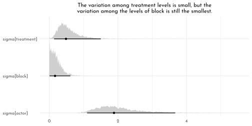


```r
brms_c13_model_chimp_treatment <- add_criterion(brms_c13_model_chimp_treatment, "waic")

loo_compare(brms_c13_model_chimp_multicluster,
            brms_c13_model_chimp_no_block,
            brms_c13_model_chimp_treatment,
            criterion = "waic") %>% 
  print(simplify = FALSE)
```

```
#>                                   elpd_diff se_diff elpd_waic se_elpd_waic
#> brms_c13_model_chimp_no_block        0.0       0.0  -265.6       9.6      
#> brms_c13_model_chimp_multicluster   -0.4       0.8  -266.0       9.7      
#> brms_c13_model_chimp_treatment      -0.9       0.8  -266.6       9.6      
#>                                   p_waic se_p_waic waic   se_waic
#> brms_c13_model_chimp_no_block        8.6    0.4     531.3   19.2 
#> brms_c13_model_chimp_multicluster   10.5    0.5     532.1   19.4 
#> brms_c13_model_chimp_treatment      10.8    0.5     533.1   19.2
```


```r
model_weights(brms_c13_model_chimp_multicluster,
              brms_c13_model_chimp_no_block,
              brms_c13_model_chimp_treatment,
              weights = "loo") %>% 
  round(digits = 2)
```

```
#> brms_c13_model_chimp_multicluster     brms_c13_model_chimp_no_block 
#>                              0.32                              0.49 
#>    brms_c13_model_chimp_treatment 
#>                              0.19
```

###  Divergent Transitions and Non-Centered Priors

**Non-centered chimpanzees**

> *Because we only fit this model using the non-centered parameterization, we won’t be able to fully reproduce McElreath’s Figure 13.6. But we can still plot our effective sample sizes. Recall that unlike the way __rethinking__ only reports `n_eff`, __brms__ now reports both `bulk_ess` and `tail_ess` (see Vehtari, Gelman, et al., 2019). At the moment, __brms__ does not offer a convenience function that allows users to collect those values in a data frame. However you can do so with help from the [__posterior__](https://github.com/stan-dev/posterior) package (Bürkner et al., 2020), which has not made its way to CRAN, yet, but can be downloaded directly from GitHub.*


```r
as_draws_df(brms_c13_model_chimp_multicluster) %>%
  summarise_draws() %>%
  ggplot(aes(x = ess_bulk, y = ess_tail)) +
  geom_abline(linetype = 3, color = clr_dark) +
  geom_point(color = clr0dd, fill = clr0,
             size = 2, shape = 21) +
  xlim(0, 4700) +
  ylim(0, 4700) +
  ggtitle("Effective sample size summaries for b13.4",
          subtitle = "ess_bulk is on the x and ess_tail is on the y") +
  theme(plot.subtitle = element_text(size = 10),
        plot.title = element_text(size = 11.5),
        plot.title.position = "plot")
```

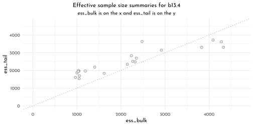

### Multilevel Posterior Predictions

**Posterior prediction for same clusters**


```r
treatment_levels <- c("R|N", "L|N", "R|P", "L|P")

new_chimp <- data_chimp %>% 
  distinct(treatment) %>% 
  mutate(actor = chimp,
         block = 1L)

chimp_2_fit <- fitted(brms_c13_model_chimp_multicluster,
         newdata = new_chimp) %>% 
  as_tibble() %>% 
  bind_cols(new_chimp,.)

chimp_2_data <- data_chimp %>% 
  filter(actor == chimp) %>% 
  group_by(treatment) %>% 
  summarise(prob = mean(pulled_left)) %>% 
  ungroup() 

p1 <- chimp_2_fit %>%
  ggplot(aes(x = treatment, y = Estimate)) +
  geom_smooth(stat = 'identity',
              aes(ymin = Q2.5, ymax = Q97.5),
              fill = clr0dd, color = clr0dd, size = .5) +
  geom_point(data = chimp_2_data,
             aes(y = prob),
             color = clr0dd , fill = clr0, shape = 21) +
  ggtitle("Chimp #2",
          subtitle = "The posterior mean and 95%\nintervals are the blue line\nand orange band, respectively.\nThe empirical means are\nthe charcoal dots.") +
  coord_cartesian(ylim = c(.75, 1))

p2 <- (brms_chimp_posterior_multi <- as_draws_df(brms_c13_model_chimp_multicluster) %>% 
    as_tibble())  %>% 
  transmute(actor_5 = `r_actor__alpha[5,Intercept]`) %>% 
  ggplot(aes(x = actor_5)) +
  geom_density(size = .5, color = clr0dd, fill = fll0) +
  scale_y_continuous(breaks = NULL) +
  ggtitle("Chimp #5's density")

chimp_5_fit <- brms_chimp_posterior_multi %>% 
  pivot_longer(b_beta_treatment1:b_beta_treatment4) %>% 
  mutate(fitted = inv_logit_scaled(b_alpha_Intercept + value +
                                     `r_actor__alpha[1,Intercept]` +
                                     `r_block__alpha[1,Intercept]`),
         treatment = treatment_levels[str_sub(name, -1,-1) %>% as.integer()] %>% 
           factor(levels = treatment_levels)) %>% 
  select(name:treatment) %>%
  group_by(treatment) %>%
  tidybayes::mean_qi(fitted)

chimp_5_data <- data_chimp %>% 
  filter(actor == 5) %>% 
  group_by(treatment) %>% 
  summarise(prob = mean(pulled_left)) %>% 
  ungroup() %>% 
  mutate(treatment = treatment_levels[treatment] %>% 
           factor(levels = treatment_levels))

p3 <- chimp_5_fit %>%
  ggplot(aes(x = treatment, y = fitted)) +
  geom_smooth(stat = 'identity',
              aes(ymin = .lower, ymax = .upper, group = 1),
              fill = clr0dd, color = clr0dd, size = .5) +
  geom_point(data = chimp_5_data,
             aes(y = prob),
             color = clr0dd , fill = clr0, shape = 21) +
    ggtitle("Chimp #5",
          subtitle = "This plot is like the last except\nwe did more by hand.")  +
  coord_cartesian(ylim = 0:1)

p1 + p2 + p3
```


**Posterior prediction for new clusters**


```r
chimp_mean_fitted <- brms_chimp_posterior_multi %>% 
  pivot_longer(b_beta_treatment1:b_beta_treatment4) %>% 
  mutate(fitted = inv_logit_scaled(b_alpha_Intercept + value)) %>% 
  mutate(treatment = treatment_levels[str_sub(name, -1,-1) %>% as.integer()] %>% 
           factor(levels = treatment_levels)) %>% 
  select(name:treatment) %>%
  group_by(treatment) %>%
  # note we're using 80% intervals
  mean_qi(fitted, .width = .89)

p1 <- chimp_mean_fitted %>%
  ggplot(aes(x = treatment, y = fitted, group = 1)) +
  geom_smooth(stat = 'identity',
              aes(ymin = .lower, ymax = .upper, group = 1),
              fill = clr0dd, color = clr0dd, size = .5)+
  labs(subtitle = "Average actor") +
  coord_cartesian(ylim = 0:1)

chimp_marginal_fitted <- brms_chimp_posterior_multi %>% 
  # simulated chimpanzees
  mutate(a_sim = rnorm(n(), mean = b_alpha_Intercept, sd = sd_actor__alpha_Intercept)) %>% 
  pivot_longer(b_beta_treatment1:b_beta_treatment4) %>% 
  mutate(fitted = inv_logit_scaled(a_sim + value),
         treatment = treatment_levels[str_sub(name, -1,-1) %>% as.integer()] %>% 
           factor(levels = treatment_levels)) %>% 
  group_by(treatment) %>%
  # note we're using 80% intervals
  mean_qi(fitted, .width = .8)

p2 <- chimp_marginal_fitted %>%
  ggplot(aes(x = treatment, y = fitted, group = 1)) +
   geom_smooth(stat = 'identity',
              aes(ymin = .lower, ymax = .upper, group = 1),
              fill = clr0dd, color = clr0dd, size = .5)+
  labs(subtitle = "Marginal of actor") +
  coord_cartesian(ylim = 0:1)

n_chimps <- 100
set.seed(42)

chimp_100_random_fitted <- brms_chimp_posterior_multi %>% 
  mutate(iter = 1:n()) %>% 
  slice_sample(n = n_chimps) %>% 
  # simulated chimpanzees
  mutate(a_sim = rnorm(n(), mean = b_alpha_Intercept, sd = sd_actor__alpha_Intercept)) %>% 
  pivot_longer(b_beta_treatment1:b_beta_treatment4) %>% 
  mutate(fitted = inv_logit_scaled(a_sim + value),
         treatment = treatment_levels[str_sub(name, -1,-1) %>% as.integer()] %>% 
           factor(levels = treatment_levels)) %>% 
  select(iter:treatment)

p3 <- chimp_100_random_fitted %>%
  ggplot(aes(x = treatment, y = fitted, group = iter)) +
  geom_line(alpha = .4, color = clr0dd) +
  labs(subtitle = "100 simulated actors") +
  coord_cartesian(ylim = 0:1) 

p1 + p2 + p3
```

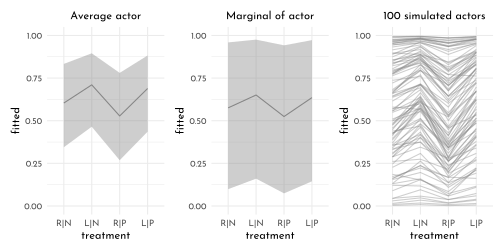

Let’s use `fitted()` this time (alternative approach for new clusters)


```r
new_chimp_treatment <- distinct(data_chimp, treatment)

chimp_mean_fitted2 <- fitted(brms_c13_model_chimp_multicluster,
                             newdata = new_chimp_treatment,
                             re_formula = NA,
                             probs = c(.1, .9)) %>% 
  as_tibble() %>% 
  bind_cols(new_chimp_treatment, .) %>% 
  mutate(treatment = treatment_levels[treatment] %>% 
           factor(levels = treatment_levels))

p4 <- chimp_mean_fitted2 %>%
  ggplot(aes(x = treatment, y = Estimate, group = 1)) +
  geom_smooth(stat = 'identity',
              aes(ymin = Q10, ymax = Q90),
              fill = fll_current(), color = clr_current, size = .5) +
  labs(subtitle = "Average actor") +
  coord_cartesian(ylim = 0:1)

chimp_marginal_fitted2 <- fitted(brms_c13_model_chimp_multicluster,
                                 newdata = new_chimp_treatment,
                                 probs = c(.1, .9),
                                 allow_new_levels = T,
                                 sample_new_levels = "gaussian") %>% 
  as_tibble() %>% 
  bind_cols(new_chimp_treatment,.) %>% 
  mutate(treatment = treatment_levels[treatment] %>% 
           factor(levels = treatment_levels))

p5 <- chimp_marginal_fitted2 %>%
  ggplot(aes(x = treatment, y = Estimate, group = 1)) +
  geom_smooth(stat = 'identity',
              aes(ymin = Q10, ymax = Q90),
              fill = fll_current(), color = clr_current, size = .5) +
  labs(subtitle = "Marginal of actor") +
  coord_cartesian(ylim = 0:1)

new_chimp_random <- new_chimp %>% 
  # define 100 new actors
  expand(actor = str_c("new", 1:n_chimps),
         treatment) %>% 
  # this adds a row number, which will come in handy, later
  mutate(row = 1:n())

set.seed(42)

chimp_100_random_fitted2 <- fitted(brms_c13_model_chimp_multicluster,
                                   newdata = new_chimp_random,
                                   allow_new_levels = TRUE,
                                   sample_new_levels = "gaussian",
                                   summary = FALSE,
                                   ndraws = n_chimps)

p6 <- chimp_100_random_fitted2 %>%
  as_tibble() %>% 
  # name the columns by the `row` values in `nd`
  set_names(pull(new_chimp_random, row)) %>% 
  # add an iteration index
  mutate(iter = 1:n()) %>% 
  # make it long
  pivot_longer(-iter, names_to = "row") %>% 
  mutate(row = as.integer(row)) %>% 
  # add the new data
  left_join(new_chimp_random, by = "row") %>% 
  # extract the numbers from the names of the new actors
  mutate(actor_number = str_extract(actor, "\\d+") %>% as.integer()) %>% 
  # only keep the posterior iterations that match the `actor_number` values
  filter(actor_number == iter) %>% 
  # add the `treatment` labels
  mutate(treatment = treatment_levels[treatment] %>% 
           factor(levels = treatment_levels)) %>% 
  ggplot(aes(x = treatment, y = value, group = actor)) +
  geom_line(alpha = .4, color = clr_current) +
  labs(subtitle = "100 simulated actors")

p4 + p5 + p6
```

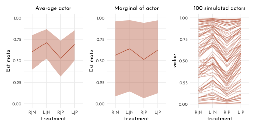

**Post-stratification**

> *If you have estimates $p_{i}$ for each relevant demographic category $i$, the post-stratified prediction for the whole population just re-weights these estimates using the number of individuals $N_{i}$ in each category with the formula*
>
> $$\frac{\sum_{i}N_{i}p_{i}}{\sum_{i}N_{i}}$$
> 
> *Within the multilevel context, this is called __multilevel regression and post-stratification__ (MRP, pronounced “Mister P”).*

### Bonus: Post-stratification in an example

Meet the data


```r
load("data/mrp_data_ch13.rds")
data_names <- d
data_cell_counts <- cell_counts
rm(d, cell_counts)
```


```r
data_cell_counts %>% 
  ggplot(aes(x = n)) +
  geom_histogram(binwidth = 2e3, fill = fll0, color = clr0d) +
  scale_x_continuous(breaks = 0:3 * 1e5,
                     labels = function(x){if_else(x == 0,
                                                  as.character(x),
                                                  str_c(1e-3 * x, "K"))})
```


**Settle the MR part of MRP**


```r
set.seed(42)

tibble(n = rnorm(1e6, -1, 1)) %>% 
  mutate(p = inv_logit_scaled(n)) %>% 
  ggplot(aes(x = p)) +
  geom_density(color = clr0dd, fill = fll0) +
  scale_y_continuous(breaks = NULL)
```

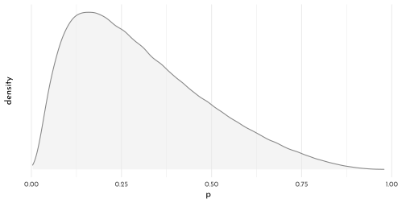


```r
brms_c13_model_names <- brm(
  data = data_names,
  family = binomial,
  kept_name | trials(1) ~ 1 + 
    (1 | age_group) + 
    (1 | decade_married) + 
    (1 | educ_group) + 
    (1 | state_name),
  prior = c(prior(normal(-1, 1), class = Intercept),
            prior(exponential(1), class = sd)),
  iter = 2000, warmup = 1000,
  chains = 4, cores = 4,
  control = list(adapt_delta = .98),
  seed = 42,
  file = "brms/brms_c13_model_names")

fixef(brms_c13_model_names) %>% 
  data.frame() %>% 
  knit_precis()
```


|param     | Estimate| Est.Error| Q2.5| Q97.5|
|:---------|--------:|---------:|----:|-----:|
|Intercept |    -0.74|      0.63|   -2|  0.46|

```r
as_draws_df(brms_c13_model_names) %>% 
  select(starts_with("sd_")) %>% 
  set_names(str_c("sigma[", c("age", "decade~married", "education", "state"), "]")) %>% 
  pivot_longer(everything()) %>% 
  group_by(name) %>%
  median_qi(.width = seq(from = .5, to = .9, by = .1)) %>%
  ggplot(aes(x = value, xmin = .lower, xmax = .upper, y = reorder(name, value))) +
  geom_interval(aes(alpha = .width), color = clr_dark) +
  scale_alpha_continuous("CI width", range = c(.7, .15)) +
  scale_y_discrete() +
  xlim(0, NA) +
  labs(y = NULL, x = NULL)
```


**Post-stratify to put the P in MRP**

> *For simplicity, we will only focus on the results for `age_group` and `state`. However, we will examine the results for each using three estimation methods: the empirical proportions, the naïve results from the multilevel model, and the MRP estimates.*

Estimates by age group


```r
name_levels <- c("raw data", "multilevel", "MRP")


p1 <- data_names %>% # compute the proportions from the data
  group_by(age_group, kept_name) %>%
  summarise(n = n()) %>% 
  group_by(age_group) %>% 
  mutate(prop = n/sum(n),
         type = factor("raw data", levels = name_levels)) %>% 
  filter(kept_name == 1, age_group < 80, age_group > 20) %>%
  ggplot(aes(x = prop, y = age_group)) + 
  geom_point(color = clr0dd, fill = clr0, shape = 21, size = 1.5) +
  scale_x_continuous(breaks = c(0, .5, 1), limits = 0:1) +
  facet_wrap(~ type)

new_names <- distinct(data_names, age_group) %>% arrange(age_group)

p2 <- fitted(brms_c13_model_names,
         re_formula = ~ (1 | age_group),
         newdata = new_names) %>% 
  as_tibble() %>% 
  bind_cols(new_names, .) %>% 
  mutate(prop = Estimate,
         type = factor("multilevel", levels = name_levels)) %>% 
  ggplot(aes(x = prop, xmin = Q2.5, xmax = Q97.5, y = age_group)) + 
  geom_linerange(color = clr0dd, size = .5) +
  geom_point(color = clr0dd,
                  size = 1.5, fill = clr0, shape = 21) +
  scale_x_continuous(breaks = c(0, .5, 1), limits = c(0, 1)) +
  # scale_y_discrete(labels = NULL) +
  facet_wrap(~ type) +
  labs(y = NULL)

age_prop <- data_cell_counts %>% 
  group_by(age_group) %>% 
  mutate(prop = n / sum(n)) %>% 
  ungroup()

names_predicted <- add_predicted_draws(brms_c13_model_names, 
                                       newdata = age_prop %>% 
                                         filter(age_group > 20, 
                                                age_group < 80, 
                                                decade_married > 1969),
                                       allow_new_levels = TRUE)
```

> *Next comes the MRP magic. If we group the results by `age_group` and `.draw`, we can sum the product of the posterior predictions and the weights, which will leave us with 4,000 stratified posterior draws for each of the 11 levels of `age_group`. This is the essence of the post-stratification equation McElreath presented in Section 13.5.3,*
>
> $$\frac{\sum_{i}N_{i}p_{i}}{\sum_{i}N_{i}}$$
> 
> *We will follow Alexander and call these summary values `kept_name_predict`. We then complete the project by grouping by age_group and summarizing each stratified posterior predictive distribution by its mean and 95% interval.*


```r
names_predicted <- names_predicted %>% 
  group_by(age_group, .draw) %>% 
  summarise(kept_name_predict = sum(.prediction * prop)) %>% 
  group_by(age_group) %>% 
  mean_qi(kept_name_predict)

p3 <- names_predicted %>%
  mutate(type = factor("MRP", levels = name_levels)) %>%
  ggplot(aes(x = kept_name_predict, xmin = .lower, xmax = .upper, y = age_group)) + 
  geom_linerange(color = clr_current, size = .5) +
  geom_point(color = clr_current, fill = clr_lighten(clr_current),
                  size = 1.5, shape = 21) +
  scale_x_continuous(breaks = c(0, .5, 1), limits = 0:1) +
  facet_wrap(~ type) +
  labs(y = NULL)

p1 + p2 + p3 +
  plot_annotation(title = "Proportion of women keeping name after marriage, by age",
                  subtitle = "Proportions are on the x-axis and age groups are on the y-axis.")
```


> *Both multilevel and MRP estimates tended to be a little lower than the raw proportions, particularly for women in the younger age groups. Alexander mused this was “likely due to the fact that the survey has an over-sample of highly educated women, who are more likely to keep their name.” The MRP estimates were more precise than the multilevel predictions, which averaged across the grouping variables other than age. All three estimates show something of an inverted U-shape curve across age, which Alexander noted “is consistent with past observations that there was a peak in name retention in the 80s and 90s.”*

**Estimates by US state**

> *Now we turn out attention to variation across states. The workflow, here, will only deviate slightly from what we just did. This time, of course, we will be grouping the estimates by `state_name` instead of by `age_group`.*


```r
library(sf)
us_sf <- read_sf("~/work/geo_store/USA/usa_states_albers_revised.gpkg") %>%
  mutate(statename = str_to_title(name))

p1 <- data_names %>%
  group_by(state_name, kept_name) %>%
  summarise(n = n()) %>%
  group_by(state_name) %>%
  mutate(prop = n/sum(n)) %>%
  filter(kept_name == 1,
         state_name != "puerto rico") %>% 
  mutate(type = factor("raw data", levels = name_levels),
         statename = str_to_title(state_name)) %>%
  left_join(us_sf,.) %>% 
  ggplot(aes(color = prop))
# +
#   geom_sf(aes(fill = after_scale(clr_alpha(color,.8)))) +
#   scale_color_viridis_c("proportion\nkeeping\nname", option = "B", limits = c(0, 0.8)) +
#   theme(legend.position = "none") +
#   facet_wrap(~ type)


new_names_state <- distinct(data_names, state_name)

p2 <- fitted(brms_c13_model_names,
         re_formula = ~ (1 | state_name),
         newdata = new_names_state) %>% 
  as_tibble() %>% 
  bind_cols(new_names_state,.) %>% 
  filter(state_name != "puerto rico") %>% 
  mutate(prop = Estimate,
         type = factor("multilevel", levels = name_levels),
         statename = str_to_title(state_name)) %>%
  left_join(us_sf,.) %>% 
  ggplot(aes(color = prop)) 

state_prop <- data_cell_counts %>% 
  group_by(state_name) %>% 
  mutate(prop = n/sum(n))  %>% 
  ungroup()

p3 <- add_predicted_draws(brms_c13_model_names,
                          newdata = state_prop %>% 
                            filter(age_group > 20, 
                                   age_group < 80, 
                                   decade_married > 1969),
                          allow_new_levels = TRUE) %>%
  group_by(state_name, .draw) %>% 
  summarise(kept_name_predict = sum(.prediction * prop)) %>% 
  group_by(state_name) %>% 
  mean_qi(kept_name_predict) %>% 
  mutate(prop      = kept_name_predict,
         type      = factor("MRP", levels = name_levels),
         statename = str_to_title(state_name)) %>%
  left_join(us_sf,.) %>% 
  ggplot(aes(color = prop)) 

p1 + p2 + p3  +
  plot_annotation(title = "Proportion off Women Keeping Name after Marriage, by State",
                  theme = theme(plot.margin = margin(0.2, 0, 0.01, 0, "cm"))) +
  plot_layout(guides = "collect", nrow = 1) &
  geom_sf(aes(fill = after_scale(clr_alpha(color,.8)))) &
  # scale_color_viridis_c("proportion keeping name", option = "B", limits = c(0, 0.8)) &
  scale_color_gradientn("proportion keeping name", 
                        colours = c(clr_dark, clr0, clr_saturate(clr_current, .3)),
                        limits = c(0, 0.8)) &
  guides(color = guide_colorbar(title.position = "top",
                                barheight = unit(5, "pt"),
                                barwidth = unit(.9, "npc"))) &
  theme(legend.position = "bottom") &
  facet_wrap(~ type) 
```


> *Remember how small the posterior for $\sigma_{state}$ was relative to the other $\sigma_{<group>}$ posteriors? We said that would imply more aggressive regularization across states. You can really see that regularization in the panels showing the multilevel and MRP estimates. They are much more uniform than the proportions from the raw data, which are all over the place. This is why you use multilevel models and/or stratify. When you divide the responses up at the state level, the proportions get jerked all around due to small and unrepresentative samples. Even with the regularization from the multilevel partial pooling, you can still see some interesting differences in the multilevel and MRP panels. Both suggest women keep their maiden names in relatively low proportions in Utah and relatively high proportions in New York. For those acquainted with American culture, this shouldn’t be a great surprise.*

## pymc3 section

---

<div id="myModal" class="modal">
  <span class="close">&times;</span>
  
  <div id="caption"></div>
</div>

<script src="./js/zoom.js"></script>
