---
output:
  html_document:
  theme: yeti
pdf_document: default
editor_options: 
  chunk_output_type: console
---

# Rethinking: Chapter 14

**Adventures in Covariance**


by [Richard McElreath](https://xcelab.net/rm/statistical-rethinking/), building on the Summaries by [Solomon Kurz](https://bookdown.org/content/4857/).

> *This is the essence of the general __exchangeable effects__ strategy: Any batch of parameters with __exchangeable__ index values can and probably should be pooled.*

> *There is a fact that will allow us to squeeze even more information out of the data: Cafés covary in their intercepts and slopes.*

Eg. Cafés with generally short waiting times (intercept) can not improve as much throughout the day (slope) as those that exhibit longer average waiting times.

## Varying Slopes by Construction

### Simulate the Population

Setting averages, standard deviations and correlation of intercept and slope parameters.


```r
alpha <- 3.5      # average morning waiting time
beta <- -1        # average difference between morning and afternoon waiting time
sigma_alpha <- 1  # std dev in intercepts
sigma_beta <- 0.5 # std dev in slopes
rho <- -.7        # correlation between intercepts and slopes
```

Building the 2-dimensional multivariate gaussian distribution from the defined parameters - for this we need the 2-by-2 matrix of variances and covariances (aka. the **covariance matrix** $\Sigma$):

$$
\Sigma = 
\left[
{
\begin{array}{cc}
\textrm{var. of intercepts} & \textrm{covar. of int. and slp.} \\
\textrm{covar. of int. and slp.} & \textrm{var. of slopes}\\
\end{array}
}
\right]
$$

or more concise

$$
\Sigma = 
\left[
{
\begin{array}{cc}
\sigma_{\alpha}^2 & \sigma_{\alpha} \sigma_{\beta} \rho \\
\sigma_{\alpha} \sigma_{\beta} \rho  & \sigma_{\beta}^2 \\
\end{array}
}
\right]
$$

constructing the covariance matrix


```r
Mu <- c(alpha, beta)
cov_ab <- sigma_alpha * sigma_beta * rho

(Sigma <- matrix( c(sigma_alpha, cov_ab, cov_ab, sigma_beta), nrow = 2 ))
```

$$\begin{bmatrix} 1 &-0.35 \\-0.35 &0.5 \\ \end{bmatrix}$$

Alternative covariance matrix construction:


```r
sigmas <- c(sigma_alpha, sigma_beta)           # standard deviations
Rho <- matrix( c(1, rho, rho, 1), nrow = 2 )   # correlation matrix
Sigma <- diag(sigmas) %*% Rho %*% diag(sigmas) # matrix multiplication to get covariance matrix
```

Simulating cafes


```r
library(MASS)
set.seed(42)

n_cafes <- 20
vary_effects <- mvrnorm(n = n_cafes, mu =  Mu, Sigma = Sigma) %>% 
  data.frame() %>% 
  as_tibble() %>% 
  set_names(nm = c("alpha_cafe", "beta_cafe"))

p1 <- vary_effects %>% 
  ggpairs(lower = list(continuous = wrap("dot_no_facet", fill = fll0,
                                        color = clr_dark,
                                        fill = clr_alpha(clr_dark), 
                                        shape = 21, size = 1.5)),
          diag = list(continuous = wrap("densityDiag", fill = fll0,
                                        color = clr_dark,
                                        fill = clr_alpha(clr_dark), 
                                        adjust = .7)),
          upper = list(continuous = wrap(my_upper , size = 4, 
                                         color = "black", family = fnt_sel)) )

library(ellipse)
p2 <- tibble(level = c(.1, .3, .5, .8, .99)) %>% 
  mutate(ellipse = purrr::map(level,
                              function(level){
                                ellipse(Sigma, centre = Mu, level = level) %>% 
                                  data.frame() %>% 
                                  as_tibble() %>% 
                                  set_names(nm = c("alpha_cafe", "beta_cafe")) 
                              })) %>% 
  unnest(ellipse) %>% 
  ggplot(aes(x = alpha_cafe, y = beta_cafe)) +
  geom_path(aes(group = factor(level),
                alpha = -level),
            color = clr_dark, size = .25) +
  geom_point(data = vary_effects, color = clr0dd, fill = clr0, shape = 21, size = 1.5) +
  theme(legend.position = "none")

cowplot::plot_grid(p2, ggmatrix_gtable(p1))
```

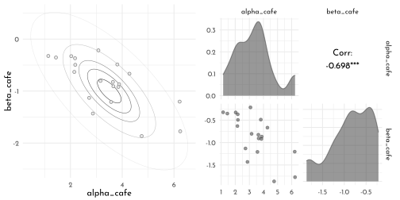

### Simulate Observations


```r
n_visits <- 10
sigma    <-  0.5  # std dev within cafes

set.seed(42)  # used to replicate example


data_cafe <- vary_effects %>% 
  mutate(cafe = 1:n_cafes) %>% 
  expand(nesting(cafe, alpha_cafe, beta_cafe), visit = 1:n_visits) %>% 
  mutate(afternoon = rep(0:1, times = n() / 2)) %>% 
  mutate(mu = alpha_cafe + beta_cafe * afternoon) %>% 
  mutate(waiting_time = rnorm(n = n(), mean = mu, sd = sigma))

data_cafe %>%
  mutate(afternoon = ifelse(afternoon == 0, "M", "A"),
         day       = rep(rep(1:5, each = 2), times = n_cafes)) %>%
  filter(cafe %in% c(12, 19)) %>%
  mutate(cafe = str_c("café #", cafe)) %>% 
  ggplot(aes(x = visit, y = waiting_time, group = day)) +
  geom_line(color = clr0dd) +
  geom_point(aes(color = afternoon), size = 2) +
  scale_color_manual(values = c(clr0dd, clr_current), guide = "none") +
  scale_x_continuous(NULL, breaks = 1:10, labels = rep(c("M", "A"), times = 5)) +
  scale_y_continuous("wait time in minutes", limits = c(0, NA)) +
  facet_wrap(~ cafe, nrow = 1) 
```

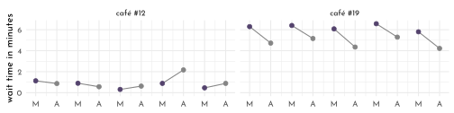


This data is well suited for a *varying slopes* model:

- there are *multiple clusters* (the individual cafes)
- each cluster is observed under a *different conditions*

$\rightarrow$ it is thus possible to estimate both *individual intercepts* as well as *individual slopes* 🤓

Furthermore, this example is *balanced* - but this is not a requirement (in fact in un-balanced designs varying effects model can effectively help with the inference for the lesser sampled clusters due to *partial pooling*).

### The Varying Slopes Model

Here, the *joint population* of slopes and intercepts appears:

$$
\begin{array}{rclr}
W_{i} & \sim & \textrm{Normal}(\mu_{i}, \sigma) & \textrm{[likelihood]}\\
\mu_{i} & = & \alpha_{CAFÉ[i]} + \beta_{CAFÉ[i]} A_{i} & \textrm{[linear model]}\\
\left[\begin{array}{cc}\alpha_{CAFÉ} \\ \beta_{CAFÉ}\end{array} \right] & \sim &\textrm{MVNormal} \left( \left[ \begin{array}{c} \alpha\\ \beta\end{array} \right], S \right) & \textrm{[population of varying effects]}\\
S & = & \left( \begin{array}{cc}\sigma_{\alpha} & 0\\ 0 & \sigma_{\beta}\end{array}\right) R \left( \begin{array}{cc}\sigma_{\alpha} & 0\\ 0 & \sigma_{\beta}\end{array}\right) & \textrm{[construct covariance matrix]}\\
\alpha & \sim & \textrm{Normal}(5, 2) & \textrm{[prior for average intercept]}\\
\beta & \sim & \textrm{Normal}(-1, 0.5) & \textrm{[prior for average slope]}\\
\sigma & \sim & \textrm{Exponential}(1) & \textrm{[prior for stddev within cafés]}\\
\sigma_{\alpha} & \sim & \textrm{Exponential}(1) & \textrm{[prior for stddev among intercepts]}\\
\sigma_{\beta} & \sim & \textrm{Exponential}(1) & \textrm{[prior for stddev among slopes]}\\
R & \sim & \textrm{LKJcorr}(2) & \textrm{[prior for correlation matrix]}\\
\end{array}
$$


$R$ is a prior for the correlation matrix, thus a *distribution of matrices*.
In this case it is a $2\times2$ matrix looking like this (needing just one parameter - $\rho$ - for it's definition):

$$
R = \left(\begin{array}{cc}1 & \rho \\ \rho & 1\end{array}\right)
$$

In general, the $LKJcorr$ distribution can be thought of as weakly informative prior on $\rho$, that is skeptical of extreme correlations (-1 or 1).
It can be used as regularizing prior for correlation matrices.
It's single parameter $\eta$ controls *how* skeptical the prior is (1 would be completely flat).


```r
library(rethinking)

n_matrices <- 1e4
eta_rlk <- function(eta){
  rlkjcorr(n = n_matrices, K = 2, eta = eta) %>% 
  as_tibble() %>% 
  set_names(nm = c("tl", "bl", "tr","br"))
}

p1 <- tibble(eta = c(.5, 1, 2, 4)) %>% 
  mutate(R = purrr::map(eta, eta_rlk)) %>% 
  unnest(R) %>% 
  ggplot(aes(x = bl, group = eta, color = factor(eta))) +
  geom_density(adjust = .65,
               aes(fill = after_scale(clr_alpha(color, .3)))) +
  scale_color_manual("eta", values = c(clr2, clr0d, 
                                      clr_dark, clr_current),
                     guide = guide_legend(nrow = 2,
                                          keyheight = unit(7, "pt"))) +
  labs(x = NULL, subtitle = "LKJcorr distribution for varying eta") +
  theme(legend.position = c(1, 1),
        legend.justification = c(1,1),
        legend.direction = "horizontal")
```

Fitting the model


```r
data_cafe_list <- data_cafe %>% 
  dplyr::select(cafe, visit, afternoon, waiting_time) %>% 
  as.list() 

set.seed(42)
model_cafe <- ulam(
  flist = alist(
    waiting_time ~ normal( mu, sigma ),
    mu <- alpha_cafe[cafe] + beta_cafe[cafe] * afternoon,
    c(alpha_cafe, beta_cafe)[cafe] ~ multi_normal( c(alpha, beta ), Rho, sigma_cafe ),
    alpha ~ normal(5, 2),
    beta ~ normal(-1, 0.5),
    sigma_cafe ~ exponential(1),
    sigma ~ exponential(1),
    Rho ~ lkj_corr(2)
  ),
  data = data_cafe_list,
  cores = 4,
  chains = 4,
  log_lik = TRUE
)
```


```r
p2 <- extract.samples(model_cafe) %>% 
  data.frame() %>% 
  as_tibble() %>% 
  ggplot() +
  geom_vline(xintercept = 0, color =clr_dark, linetype = 3) +
  geom_density(aes(x = Rho.2, color = "posterior",
                   fill = after_scale(clr_alpha(color))),
               adjust = .6) +
  geom_density(data = eta_rlk(eta = 2),
               aes(x = bl, color = "prior",
                   fill = after_scale(clr_alpha(color))),
               adjust = .6) +
  scale_color_manual("", values = c(prior = clr0d,
                                    posterior = clr_current),
                     guide = guide_legend(nrow = 2,
                                          keyheight = unit(7, "pt"))) +
  labs(x = NULL,
       subtitle = "correlation between intercept and slope") +
  theme(legend.position = c(1, 1),
        legend.justification = c(1,1),
        legend.direction = "horizontal")

p1 + p2
```

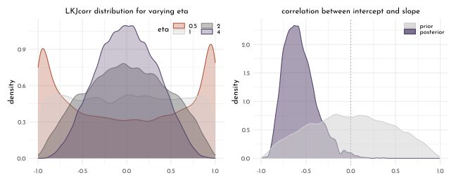

Shrinkage to the inferred prior learned from the variance and covariance of the intercepts and slopes:


```r
un_pooled_params <- data_cafe %>% 
  group_by(cafe, afternoon) %>% 
  summarise(mean = mean(waiting_time)) %>% 
  ungroup() %>%  
  mutate(afternoon = ifelse(afternoon == 0, "Intercept", "Slope")) %>%
  pivot_wider(names_from = afternoon, values_from = mean) %>%  
  mutate(Slope = Slope - Intercept)   

partially_pooled_params <- extract.samples(model_cafe) %>% 
  data.frame() %>% 
  as_tibble() %>% 
  dplyr::select(contains("alpha"), 
                contains("beta")) %>%
  dplyr::select(-c(alpha, beta)) %>% 
  summarise(across(everything(), mean)) %>% 
  pivot_longer(everything(), 
               names_to = c("param", "cafe"), 
               names_sep = "\\.") %>% 
  mutate(param = str_c(param, "_post"),
         cafe = as.integer(cafe)) %>% 
  pivot_wider(names_from = param,
              values_from = value)

posterior_mean_bivariate_gauss <- extract.samples(model_cafe) %>% 
  as_tibble()  %>% 
  dplyr::select(beta, alpha, Rho, sigma_cafe) %>% 
  summarise(mu_est = list(c(mean(alpha), mean(beta))),
            rho_est = mean(Rho[,1,2]),
            salpha_est = mean(sigma_cafe[,1]),
            sbeta_est = mean(sigma_cafe[,2])) %>% 
  mutate(Sigma_est = list(matrix( c(salpha_est ^ 2, cov_ab, cov_ab, sbeta_est ^ 2),
                             ncol = 2))) %>% 
  as.list()

posterior_mean_ellipse <- tibble(level = c(.1, .3, .5, .8, .99)) %>% 
  mutate(ellipse = purrr::map(level,
                              function(level){
                                ellipse(posterior_mean_bivariate_gauss$Sigma_est[[1]],
                                        centre = posterior_mean_bivariate_gauss$mu_est[[1]],
                                        level = level) %>% 
                                  data.frame() %>% 
                                  as_tibble() %>% 
                                  set_names(nm = c("alpha_cafe", "beta_cafe")) 
                              })) %>% 
  unnest(ellipse) %>% 
  mutate(rn = row_number()) %>% 
  arrange(rn)

p1 <- un_pooled_params %>% 
  left_join(partially_pooled_params) %>% 
  ggplot() +
  geom_polygon(data = posterior_mean_ellipse,
               aes(x = alpha_cafe, y = beta_cafe,
                   group = level),
               color = clr_dark, 
               fill = clr_alpha(clr_current, .1),
               size = .2) +
  geom_point(aes(x = Intercept, y = Slope),
             shape = 1, size = 2, color = clr0dd) +
  geom_point(aes(x = alpha_cafe_post, y = beta_cafe_post),
             shape = 21, size = 2, 
             color = clr_current, fill = clr_alpha(clr_current))  +
  geom_segment(aes(x = Intercept, y = Slope,
                   xend = alpha_cafe_post,
                   yend = beta_cafe_post),
               arrow = arrow(type = "closed",
                             length = unit(4, "pt")),
               size = .25) +
  coord_cartesian(xlim = c(0, 7),
                  ylim = c(-2.2, .5),
                  expand = 0)
```

Peripheral points experience stronger *shrinkage* towards the center, but this happens  not in a direction that is straight towards the center (shrinking the slope also results in shrinking the intercept because of the covariance).


```r
sigma_distrib_sim <- mvrnorm(n = 1e4,
            mu = posterior_mean_bivariate_gauss$mu_est[[1]],
            Sigma = posterior_mean_bivariate_gauss$Sigma_est[[1]]) %>% 
  data.frame() %>% 
  as_tibble() %>% 
  set_names(nm = c("alpha", "beta")) %>% 
  mutate(wait_morning = alpha,
         wait_afternon = alpha + beta) %>% 
  dplyr::select(starts_with("wait")) %>% 
  cov(.)

mu_sim <- c(posterior_mean_bivariate_gauss$mu_est[[1]][1],
            sum(posterior_mean_bivariate_gauss$mu_est[[1]]))

sim_mean_ellipse <- tibble(level = c(.1, .3, .5, .8, .99)) %>% 
  mutate(ellipse = purrr::map(level,
                              function(level){
                                ellipse(sigma_distrib_sim,
                                        centre = mu_sim,
                                        level = level) %>% 
                                  data.frame() %>% 
                                  as_tibble() %>% 
                                  set_names(nm = c("wait_morning", "wait_afternoon")) 
                              })) %>% 
  unnest(ellipse) %>% 
  mutate(rn = row_number()) %>% 
  arrange(rn)

p2 <- un_pooled_params %>% 
  left_join(partially_pooled_params) %>%
  mutate(wait_morning_unpooled = Intercept,
         wait_afternnoon_unpooled = Intercept + Slope,
         wait_morning_partpooled = alpha_cafe_post,
         wait_afternnoon_partpooled = alpha_cafe_post + beta_cafe_post) %>% 
  ggplot() +
  geom_polygon(data = sim_mean_ellipse,
               aes(x = wait_morning, y = wait_afternoon,
                   group = level),
               color = clr_dark,
               fill = clr_alpha(clr_current, .1),
               size = .2) +
  geom_abline(slope = 1, intercept = 0,
              linetype  = 3, color = clr_dark) +
  geom_point(aes(x = wait_morning_unpooled, 
                 y = wait_afternnoon_unpooled),
             shape = 1, size = 2, color = clr0dd) +
  geom_point(aes(x = wait_morning_partpooled,
                 y = wait_afternnoon_partpooled),
             shape = 21, size = 2,
             color = clr_current, fill = clr_alpha(clr_current))  +
  geom_segment(aes(x = wait_morning_unpooled,
                   y = wait_afternnoon_unpooled,
                   xend = wait_morning_partpooled,
                   yend = wait_afternnoon_partpooled),
               arrow = arrow(type = "closed",
                             length = unit(4, "pt")),
               size = .25) +
  coord_cartesian(xlim = c(0, 6.5),
                  ylim = c(0, 5.5),
                  expand = 0)

p1 + p2 +
  plot_annotation(subtitle = "shrinkage in two dimensions")
```

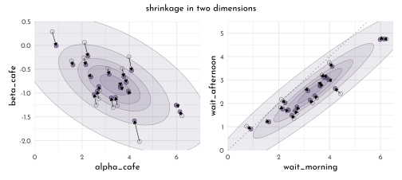

## Advanced Varying Slopes

For models with more than two varying effects (intercept plus multiple slopes for several clusters) we re-examine the *cross-classified* chimp example.

To make the model easier to grasp, it is compartmentalized with sub-models for intercept and slopes.

Starting with the **likelihood**:

$$
\begin{array}{rclr}
L_{i} & \sim & \textrm{Binomial}(1, p_{i}) & \textrm{[likelihood]}\\
\textrm{logit}(p_{i}) & = & \gamma_{\textrm{TID}[i]} + \alpha_{\textrm{ACTOR}[i],\textrm{TID}[i]} + \beta_{\textrm{BLOCK}[i],\textrm{TID}[i]} & \textrm{[linear model]}
\end{array}
$$

- $\gamma_{\textrm{TID}[i]}$ average log-odds for each treatment
- $\alpha_{\textrm{ACTOR}[i],\textrm{TID}[i]}$ effect for each actor in each treatment
- $\beta_{\textrm{BLOCK}[i],\textrm{TID}[i]}$ effect for each block in each treatment

$\rightarrow$ an interaction model that allows the effect of each treatment to vary by actor and block, with every actor potentially responding differently.

Since this results in lots of parameters ($4 + 7 \times 4 + 6 \times 4 = 56$), *pooling is really needed* here.

Now for the **adaptive priors**:

$$
\begin{array}{rclr}
\left[\begin{array}{c}
\alpha_{j, 1}\\ \alpha_{j, 2}\\ \alpha_{j, 3}\\ \alpha_{j, 4}
\end{array} 
\right] & \sim & \textrm{MVNormal} \left(\left[
\begin{array}{c} 0\\ 0\\ 0\\ 0 \end{array} 
\right], S_{\textrm{ACTOR}} \right) & \textrm{[prior for intercept]} \\
\left[\begin{array}{c}
\beta_{j, 1}\\ \beta_{j, 2}\\ \beta_{j, 3}\\ \beta_{j, 4}
\end{array} \right] & \sim & \textrm{MVNormal} \left(\left[
\begin{array}{c} 0\\ 0\\ 0\\ 0 \end{array} 
\right], S_{\textrm{BLOCK}} \right) & \textrm{[prior for slope]} \\
\end{array}
$$

$\rightarrow$ the priors for $\alpha$ and $\beta$ come from two different statistical populations with a specific covariance matrix each that relates the four features for each actor.

Finally the **fixed priors**:

$$
\begin{array}{rcl}
\gamma_{j} & \sim & \textrm{Normal}(0, 1) ~ , \textrm{for}~j = 1,...,4\\
\rho_{\textrm{ACTOR}} & \sim & \textrm{LKJcorr}(4) \\
\rho_{\textrm{BLOCK}} & \sim & \textrm{LKJcorr}(4) \\
\sigma_{\textrm{ACTOR}} & \sim & \textrm{Exponential}(1)\\
\sigma_{\textrm{BLOCK}} & \sim & \textrm{Exponential}(1)
\end{array}
$$

```r
data(chimpanzees)

data_chimp <- chimpanzees %>% 
  as_tibble() %>% 
  mutate(treatment = 1 + prosoc_left + 2 * condition,
         side_idx = prosoc_left + 1,     # right 1, left 2
         condition_idx = condition + 1)  # no partner 1, partner 2

rm(chimpanzees)

data_chimp_list <- data_chimp %>% 
  dplyr::select(pulled_left, treatment, actor, block) %>% 
  as.list()

model_chimp_centered <- ulam(
  flist = alist(
    pulled_left ~ dbinom( 1, p ),
    logit(p) <- gamma[treatment] + alpha[actor, treatment] + beta[block, treatment],
    # adaptive priors
    vector[4]:alpha[actor] ~ multi_normal(0, Rho_actor, sigma_actor),
    vector[4]:beta[block] ~ multi_normal(0, Rho_block, sigma_block),
    # fixed priors
    gamma[treatment] ~ dnorm(0, 1),
    Rho_actor ~ dlkjcorr(4),    # 4 = how skeptical are we of extreme correlations
    Rho_block ~ dlkjcorr(4),
    sigma_actor ~ dexp(1),
    sigma_block ~ dexp(1)
  ),
  data = data_chimp_list,
  chains = 4,
  cores = 4,
  log_lik = TRUE
)
```

Example of troubles in the trace rank plots (subset):


```r
library(bayesplot)

clr_chains <- function(n = 4, alpha = .7, col = clr2){
  scales::colour_ramp(colors = c(clr0dd, col))( seq(0,1, length.out = n) ) %>%
    clr_lighten(.2) %>%
    clr_alpha(alpha = alpha)
  }

model_chimp_centered@stanfit %>% 
  mcmc_rank_overlay(pars = vars(starts_with("alpha[1"),
                                starts_with("alpha[2")),
                    n_bins = 60,
                    facet_args = list(nrow = 2)) +
  scale_color_manual(values = clr_chains(col = clr_current) ) +
  labs(subtitle = "centered model (divergent transitions)") +
  theme(legend.position = "bottom",
        axis.text.x = element_blank())
```

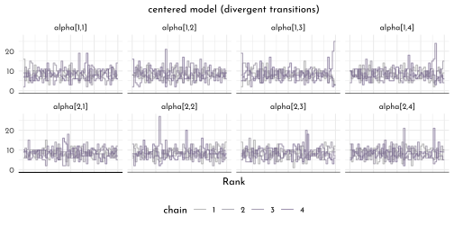

Re-parametereize to deal with the *divergent transitions*


```r
model_chimp_non_centered <- ulam(
  flist = alist(
    pulled_left ~ dbinom( 1, p ),
    logit(p) <- gamma[treatment] + alpha[actor, treatment] + beta[block, treatment],
    # adaptive priors, non-centered
    transpars> matrix[actor, 4]:alpha <- 
      compose_noncentered(sigma_actor, L_Rho_actor, z_actor),
    transpars> matrix[block, 4]:beta <- 
      compose_noncentered(sigma_block, L_Rho_block, z_block),
    matrix[4, actor]:z_actor ~ normal(0, 1),
    matrix[4, block]:z_block ~ normal(0, 1),
    # fixed priors
    gamma[treatment] ~ dnorm(0, 1),
    cholesky_factor_corr[4]:L_Rho_actor ~ lkj_corr_cholesky( 2 ),
    cholesky_factor_corr[4]:L_Rho_block ~ lkj_corr_cholesky( 2 ),
    vector[4]:sigma_actor ~ dexp( 1 ),
    vector[4]:sigma_block ~ dexp( 1 ),
    # compute ordinary correlation matrices from Cholesky factors
    gq> matrix[4,4]:Rho_actor <<- Chol_to_Corr(L_Rho_actor),
    gq> matrix[4,4]:Rho_block <<- Chol_to_Corr(L_Rho_block)
  ),
  data = data_chimp_list,
  chains = 4,
  cores = 4,
  log_lik = TRUE
)
```


```r
model_chimp_non_centered@stanfit %>% 
  mcmc_rank_overlay(pars = vars(starts_with("alpha[1"),
                                starts_with("alpha[2")),
                    n_bins = 60,
                    facet_args = list(nrow = 2)) +
  scale_color_manual(values = clr_chains(col = clr_current) ) +
  labs(subtitle = "non-centered model") +
  theme(legend.position = "bottom",
        axis.text.x = element_blank())
```

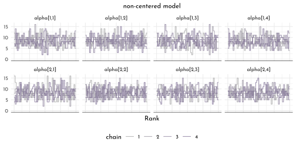


```r
tibble(centered = precis(model_chimp_centered, depth = 3,
                         pars = c("alpha", "beta"))$n_eff,
       non_centered = precis(model_chimp_non_centered, depth = 3,
                             pars = c("alpha", "beta"))$n_eff) %>% 
  ggplot(aes(x = centered, y = non_centered)) +
  geom_abline(slope = 1, intercept = 0, color = clr_dark, linetype = 3) +
  geom_point(color = clr0dd, fill = clr0, shape =21, size = 2) +
  labs(subtitle = "n_eff comparison (effectiveness of sampling in MCMC)")
```

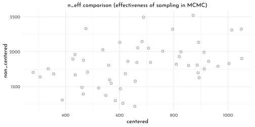


```r
WAIC(model_chimp_non_centered) %>% 
  knit_precis()
```


|param |   WAIC|   lppd| penalty| std_err|
|:-----|------:|------:|-------:|-------:|
|1     | 543.36| -245.4|   26.28|   19.62|

Inspecting the standard deviation parameters to check the strength of regularization on the varying effects:


```r
precis(model_chimp_non_centered, depth = 2, pars = c("sigma_actor", "sigma_block")) %>% 
  knit_precis()
```


|param          | mean|   sd| 5.5%| 94.5%|   n_eff| Rhat4|
|:--------------|----:|----:|----:|-----:|-------:|-----:|
|sigma_actor[1] | 1.39| 0.50| 0.79|  2.27| 1188.76|  1.00|
|sigma_actor[2] | 0.91| 0.39| 0.42|  1.59| 1520.42|  1.00|
|sigma_actor[3] | 1.87| 0.56| 1.12|  2.87| 1709.36|  1.00|
|sigma_actor[4] | 1.59| 0.59| 0.82|  2.64| 1478.77|  1.00|
|sigma_block[1] | 0.43| 0.32| 0.04|  0.99|  943.77|  1.00|
|sigma_block[2] | 0.43| 0.34| 0.04|  1.02|  812.74|  1.01|
|sigma_block[3] | 0.30| 0.27| 0.02|  0.80| 1699.22|  1.00|
|sigma_block[4] | 0.47| 0.38| 0.04|  1.19| 1390.82|  1.00|


```r
treatment_labels <- c("R|N", "L|N", "R|P", "L|P", "R|diff", "L|diff")

chimp_grid <- distinct(.data = data_chimp,
                       actor, treatment) %>% 
  mutate(block = 5L)

chimp_posterior_predictions <- link(model_chimp_non_centered,
                                    data = chimp_grid) %>% 
  as.matrix() %>% 
  t() %>% 
  as_tibble() %>% 
  bind_cols(chimp_grid, .) %>% 
  pivot_longer(-c(actor, treatment), values_to = "pulled_left") %>% 
  dplyr::select(-name) %>% 
  group_by(actor, treatment) %>% 
  summarise(p = list(quantile(pulled_left, probs = c(.055, .25, .5, .75, .955))),
            breaks = list(c("ll", "l", "m", "h", "hh"))) %>% 
  ungroup() %>% 
  unnest(c(p, breaks)) %>% 
  pivot_wider(names_from = breaks, values_from = p) %>% 
  mutate(type = "post. pred.",
         side = c("L", "R")[2 - (treatment == 1 | treatment == 3)],
         condition = c("N", "P")[1 + (treatment > 2)],
         lab = treatment_labels[treatment])

data_chimp %>% 
  group_by(actor, treatment) %>% 
  summarise(mean_data = mean(pulled_left),
            type = "data") %>% 
  mutate(side = c("L", "R")[2 - (treatment == 1 | treatment == 3)],
         condition = c("N", "P")[1 + (treatment > 2)],
         lab = treatment_labels[treatment]) %>% 
  ggplot(aes(x = treatment, y = mean_data)) +
  geom_hline(yintercept = .5, linetype = 3, color = clr_dark) +
  # geom_line(aes(group = side), color = clr_current) +
  geom_text(data = . %>% filter(actor == 1),
            aes(y = mean_data - .5 *  (1.5 - as.numeric(factor(side))),
                label = lab), family = fnt_sel) +
  geom_line(data = chimp_posterior_predictions,
            aes(y = m, group = side), color = clr0dd) +
  geom_segment(data = chimp_posterior_predictions,
               inherit.aes = FALSE,
               aes(x = treatment, xend = treatment,
                   y = ll, yend = hh),
               color = clr0dd) +
  geom_point(data = chimp_posterior_predictions,
             inherit.aes = FALSE,
             aes(x = treatment,
                 y = m, shape = condition),
             color = clr0dd, fill = clr0, size = 1.8) +
  geom_point(aes(shape = condition),
             color = clr_current, fill = clr_lighten(clr_current), size = 1.8) +
  scale_shape_manual(values = c("N" = 21, "P" = 19), guide = "none") +
  facet_grid(. ~ actor, labeller = label_both) +
  scale_x_discrete(expand = c(.2,.2)) +
  labs(x = NULL, y = "pulled_left") +
  lims(y = c(0,1)) +
  theme(panel.background = element_rect(color = clr0, fill = "transparent"))
```

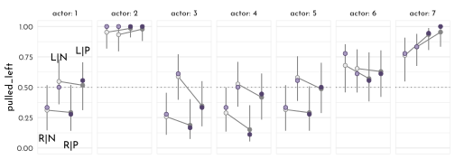


```r
stancode(model_chimp_non_centered)
```

```
#> data{
#>     int pulled_left[504];
#>     int block[504];
#>     int actor[504];
#>     int treatment[504];
#> }
#> parameters{
#>     matrix[4,7] z_actor;
#>     matrix[4,6] z_block;
#>     vector[4] gamma;
#>     cholesky_factor_corr[4] L_Rho_actor;
#>     cholesky_factor_corr[4] L_Rho_block;
#>     vector<lower=0>[4] sigma_actor;
#>     vector<lower=0>[4] sigma_block;
#> }
#> transformed parameters{
#>     matrix[7,4] alpha;
#>     matrix[6,4] beta;
#>     beta = (diag_pre_multiply(sigma_block, L_Rho_block) * z_block)';
#>     alpha = (diag_pre_multiply(sigma_actor, L_Rho_actor) * z_actor)';
#> }
#> model{
#>     vector[504] p;
#>     sigma_block ~ exponential( 1 );
#>     sigma_actor ~ exponential( 1 );
#>     L_Rho_block ~ lkj_corr_cholesky( 2 );
#>     L_Rho_actor ~ lkj_corr_cholesky( 2 );
#>     gamma ~ normal( 0 , 1 );
#>     to_vector( z_block ) ~ normal( 0 , 1 );
#>     to_vector( z_actor ) ~ normal( 0 , 1 );
#>     for ( i in 1:504 ) {
#>         p[i] = gamma[treatment[i]] + alpha[actor[i], treatment[i]] + beta[block[i], treatment[i]];
#>         p[i] = inv_logit(p[i]);
#>     }
#>     pulled_left ~ binomial( 1 , p );
#> }
#> generated quantities{
#>     vector[504] log_lik;
#>     vector[504] p;
#>     matrix[4,4] Rho_actor;
#>     matrix[4,4] Rho_block;
#>     Rho_block = multiply_lower_tri_self_transpose(L_Rho_block);
#>     Rho_actor = multiply_lower_tri_self_transpose(L_Rho_actor);
#>     for ( i in 1:504 ) {
#>         p[i] = gamma[treatment[i]] + alpha[actor[i], treatment[i]] + beta[block[i], treatment[i]];
#>         p[i] = inv_logit(p[i]);
#>     }
#>     for ( i in 1:504 ) log_lik[i] = binomial_lpmf( pulled_left[i] | 1 , p[i] );
#> }
```

## Instruments and Causal Design

### Instrumental Variables

Instrumental variables need to

- be independent of $U$ ($Q \perp \!\!\! \perp U$)
- be *not* independent of $E$ ($Q \not\!\perp\!\!\!\perp E$)
- $Q$ cannot influence $W$, except through $E$ (*exclusive restriction*)


```r
dag1 <- dagify(W ~ U + E,
       E ~ U,
       exposure = "E",
       outcome = "W",
       coords = tibble(name = c("E", "U", "W"),
                     x = c(0, .5, 1),
                     y = c(0, 1, 0)))

p1 <- dag1 %>%
  fortify() %>% 
  mutate(stage = if_else(name == "W", "response",
                         if_else(name %in% c("E"),
                                 "predictor", "confounds"))) %>% 
  plot_dag(clr_in = clr3) + 
  scale_x_continuous(limits = c(-.1, 1.1)) +
  labs(subtitle = "unmeasured confound")

dag2 <- dagify(W ~ U + E,
       E ~ U + Q,
       exposure = "E",
       outcome = "W",
       coords = tibble(name = c("E", "U", "W", "Q"),
                     x = c(0, .5, 1, -.5),
                     y = c(0, 1, 0, 1)))

p2 <- dag2 %>%
  fortify() %>% 
  mutate(stage = if_else(name == "W", "response",
                         if_else(name %in% c("E", "Q"),
                                 "predictor", "confounds"))) %>% 
  plot_dag(clr_in = clr3) +
  scale_x_continuous(limits = c(-.6, 1.1)) +
  labs(subtitle = "instrumental variable")

p1 + p2 &
  scale_y_continuous(limits = c(-.1, 1.1)) &
  coord_fixed(ratio = .6) &
  theme(plot.subtitle = element_text(hjust = .5, family = fnt_sel))
```

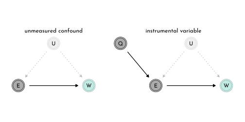


```r
library(dagitty)
instrumentalVariables(dag2)
```

```
#>  Q
```

Simulate education data


```r
set.seed(42)
n <- 500
data_edu_sim <- tibble(u = rnorm(n),
                       q = sample(1:4, size = n, replace = TRUE),
                       e = rnorm(n, u + q),
                       w = rnorm(n, u + 0 * e)) %>% 
  mutate(across(q:w, standardize, .names = "{.col}_std"))

model_edu_confound <- ulam(
  flist = alist(
    w_std ~ dnorm( mu, sigma ),
    mu <- alpha_w + beta_ew * e_std,
    alpha_w ~ dnorm( 0, 0.2 ),
    beta_ew ~ dnorm( 0, 0.5 ),
    sigma ~ dexp(1)
  ),
  data = data_edu_sim,
  cores = 4,
  chain = 4,
  log_lik = TRUE
)

model_edu_bias_amplified <- ulam(
  flist = alist(
    w_std ~ dnorm( mu, sigma ),
    mu <- alpha_w + beta_ew * e_std + beta_qw * q_std,
    alpha_w ~ dnorm( 0, 0.2 ),
    beta_ew ~ dnorm( 0, 0.5 ),
    beta_qw ~ dnorm( 0, 0.5 ),
    sigma ~ dexp(1)
  ),
  data = data_edu_sim,
  cores = 4,
  chain = 4,
  log_lik = TRUE
)
```

Confounded model:


```r
precis(model_edu_confound) %>% 
  knit_precis()
```


|param   | mean|   sd|  5.5%| 94.5%|   n_eff| Rhat4|
|:-------|----:|----:|-----:|-----:|-------:|-----:|
|alpha_w | 0.00| 0.04| -0.07|  0.07| 1970.24|     1|
|beta_ew | 0.35| 0.04|  0.28|  0.41| 1818.55|     1|
|sigma   | 0.94| 0.03|  0.89|  0.99| 2090.88|     1|

Model with **bias amplification**


```r
precis(model_edu_bias_amplified) %>% 
  knit_precis()
```


|param   |  mean|   sd|  5.5%| 94.5%|   n_eff| Rhat4|
|:-------|-----:|----:|-----:|-----:|-------:|-----:|
|alpha_w |  0.00| 0.04| -0.06|  0.06| 2231.11|     1|
|beta_ew |  0.60| 0.05|  0.52|  0.68| 1291.31|     1|
|beta_qw | -0.38| 0.05| -0.47| -0.30| 1258.66|     1|
|sigma   |  0.89| 0.03|  0.85|  0.94| 1672.71|     1|

Using a **generative model**, translating the DAG into mathematical notation:

$$
\begin{array}{rclr}
W_{i} & \sim & \textrm{Normal}(\mu_{w, i}, \sigma_{w}) & \textrm{[likelihood]} \\
\mu_{w,i} & = & \alpha_{w} + \beta_{EW} E_{i} + U_{i} & \textrm{[wage model]} 
\end{array}
$$

Sub-model for the *instrumental variable*

$$
\begin{array}{rclr}
E_{i} & \sim & \textrm{Normal}(\mu_{E,i}, \sigma_{E}) & \textrm{[likelihood]}\\
\mu_{E,i} & = & \alpha_{E} + \beta_{QE} Q_{i} + U_{i} & \textrm{[education model]} \\
\end{array}
$$

A third sub-model for $Q$

$$
\begin{array}{rcl}
Q_{i} & \sim & \textrm{Categorical}([0.25, 0.25, 0.25, 0.25])
\end{array}
$$
The last part of the **generative model** is a sub-model for $U$

$$
\begin{array}{rcl}
U_{i} & \sim & \textrm{Normal}(0, 1) \\
\end{array}
$$

Now, we can translate the *generative model* into a **statistical model** (specifically a **multivariate linear model**)

$$
\begin{array}{rclr}
\left(\begin{array}{cc}
W_{i} \\
E_{i} \end{array}\right)  & \sim & 
\textrm{MVNormal}\left(\left(
\begin{array}{cc}
\mu_{w, i} \\
\mu_{E, i} \end{array}\right), S
\right) & \textrm{[joint wage and education model]}\\
\mu_{w,i} & = & \alpha_{w} + \beta_{EW} E_{i} &\\
\mu_{E,i} & = & \alpha_{E} + \beta_{QE} Q_{i}
\end{array}
$$


```r
model_edu_multivariate <- ulam(
  flist = alist(
    c(w_std, e_std) ~ multi_normal( c(mu_w, mu_e), Rho, Sigma ),
    mu_w <- alpha_w + beta_ew * e_std,
    mu_e <- alpha_e + beta_qe * q_std,
    c( alpha_w, alpha_e ) ~ normal( 0, 0.2 ),
    c( beta_ew, beta_qe ) ~ normal( 0, 0.5 ),
    Rho ~ lkj_corr( 2 ),
    Sigma ~ exponential( 1 ) ),
  data = data_edu_sim,
  cores = 4,
  chain = 4)
```

Marginal posterior for the multivariate model:


```r
precis( model_edu_multivariate, depth = 3 ) %>% 
  knit_precis()
```


|param    | mean|   sd|  5.5%| 94.5%|   n_eff| Rhat4|
|:--------|----:|----:|-----:|-----:|-------:|-----:|
|alpha_e  | 0.00| 0.03| -0.05|  0.05| 1437.03|     1|
|alpha_w  | 0.00| 0.04| -0.07|  0.07| 1614.12|     1|
|beta_qe  | 0.66| 0.03|  0.61|  0.71| 1500.13|     1|
|beta_ew  | 0.02| 0.07| -0.09|  0.13| 1097.50|     1|
|Rho[1,1] | 1.00| 0.00|  1.00|  1.00|     NaN|   NaN|
|Rho[1,2] | 0.44| 0.06|  0.34|  0.53| 1038.75|     1|
|Rho[2,1] | 0.44| 0.06|  0.34|  0.53| 1038.75|     1|
|Rho[2,2] | 1.00| 0.00|  1.00|  1.00|     NaN|   NaN|
|Sigma[1] | 1.00| 0.04|  0.94|  1.06| 1235.09|     1|
|Sigma[2] | 0.75| 0.02|  0.71|  0.79| 1780.82|     1|


```r
set.seed(42)
data_edu_sim_2 <- tibble(u = rnorm(n),
                       q = sample(1:4, size = n, replace = TRUE),
                       e = rnorm(n, u + q),
                       w = rnorm(n, u + 0.2 * e)) %>% 
  mutate(across(q:w, standardize, .names = "{.col}_std"))

model_edu_confound_2 <- ulam(model_edu_confound,
                             data = data_edu_sim_2,
                             cores = 4, chains = 4)
model_edu_multivariate_2 <- ulam(model_edu_multivariate,
                                 data = data_edu_sim_2,
                                 cores = 4, chains = 4)
```

Confounded model (new data):


```r
precis( model_edu_confound_2, depth = 3 ) %>% 
  knit_precis()
```


|param   | mean|   sd|  5.5%| 94.5%|   n_eff| Rhat4|
|:-------|----:|----:|-----:|-----:|-------:|-----:|
|alpha_w | 0.00| 0.04| -0.06|  0.06| 1828.88|     1|
|beta_ew | 0.55| 0.04|  0.48|  0.61| 1769.32|     1|
|sigma   | 0.84| 0.03|  0.80|  0.88| 1986.21|     1|

Multivariate model (new data):


```r
precis( model_edu_multivariate_2, depth = 3 ) %>% 
  knit_precis()
```


|param    | mean|   sd|  5.5%| 94.5%|   n_eff| Rhat4|
|:--------|----:|----:|-----:|-----:|-------:|-----:|
|alpha_e  | 0.00| 0.03| -0.06|  0.05| 1636.45|  1.00|
|alpha_w  | 0.00| 0.04| -0.06|  0.06| 1460.56|  1.00|
|beta_qe  | 0.66| 0.03|  0.61|  0.71| 1433.08|  1.00|
|beta_ew  | 0.25| 0.06|  0.15|  0.35| 1111.10|  1.00|
|Rho[1,1] | 1.00| 0.00|  1.00|  1.00|     NaN|   NaN|
|Rho[1,2] | 0.44| 0.06|  0.35|  0.53| 1061.27|  1.00|
|Rho[2,1] | 0.44| 0.06|  0.35|  0.53| 1061.27|  1.00|
|Rho[2,2] | 1.00| 0.00|  1.00|  1.00|     NaN|   NaN|
|Sigma[1] | 0.89| 0.03|  0.84|  0.95| 1064.18|  1.01|
|Sigma[2] | 0.75| 0.02|  0.71|  0.79| 1821.55|  1.01|

$\rightarrow$ compare the estimates for `beta_ew`.

### Other Designs


DAG for the *front-door criterion*


```r
dag3 <- dagify(W ~ U + Z,
       E ~ U,
       Z ~ E,
       exposure = "E",
       outcome = "W",
       coords = tibble(name = c("E", "U", "W", "Z"),
                     x = c(0, .5, 1, .5),
                     y = c(0, 1, 0, 0)))

dag3 %>%
  fortify() %>% 
  mutate(stage = if_else(name == "W", "response",
                         if_else(name %in% c("E", "Z"),
                                 "predictor", "confounds"))) %>% 
  plot_dag(clr_in = clr3) +
  scale_x_continuous(limits = c(-.1, 1.1)) +
  labs(subtitle = "front-door criterion") +
  scale_y_continuous(limits = c(-.1, 1.1)) +
  coord_fixed(ratio = .5) +
  theme(plot.subtitle = element_text(hjust = .5, family = fnt_sel))
```

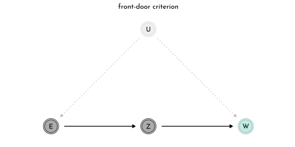

## Social Relations and Correlated Varying Effects


```r
data(KosterLeckie)
data_dyads <- kl_dyads %>% 
  as_tibble()
```


```r
p1 <- data_dyads %>% 
  ggplot(aes(x = giftsAB, y = giftsBA)) +
  geom_point(color = clr0dd, fill = fll0,
             shape = 21, size = 2.5) +
  geom_abline(slope = 1, intercept = 0,
              linetype = 3, color = clr_dark)

library(ggraph)
library(tidygraph)
p2 <- data_dyads %>% 
  dplyr::select(from = hidA, to = hidB, gifts = giftsAB) %>%
  mutate(dir = "AB") %>% 
  bind_rows(data_dyads %>% 
              dplyr::select( from = hidB, to = hidA, gifts = giftsBA) %>%
  mutate(dir = "BA") )  %>%
   as_tbl_graph() %>% 
   ggraph(layout = 'linear', circular = TRUE) +
   geom_edge_arc(aes(filter = gifts != 0,
                     alpha = log10(gifts), width = gifts,
                     color = from), 
                 arrow = arrow(type = "closed",length = unit(4, "pt")),
                 start_cap = ggraph::circle(12, 'pt'),
                 end_cap = ggraph::circle(12, 'pt') ) +
  geom_node_point(shape = 21, size = 8, 
                  color = clr0dd, fill = clr0) +
  geom_node_text(aes(label = name), family = fnt_sel,
                 hjust = .5 , vjust = .4) +
  facet_wrap(dir ~ .) +
  scale_alpha_continuous(range = c(0, 1), limits = c(10, 10)) +
  scale_edge_width_continuous(range = c(.1, 2)) +
  scale_edge_color_gradientn(colours = c(clr_dark, clr0, clr_current)) +
  coord_equal() +
  theme(legend.position = "none")

p1 + p2 + plot_layout(widths = c(.5, 1))
```

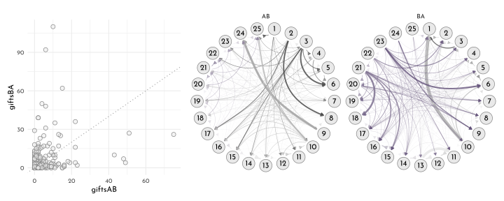

The *Social Relations Model* (SRM):

First Part

$$
\begin{array}{rclr}
y_{A \rightarrow B} & \sim & \textrm{Poisson}(\lambda_{AB}) & \textrm{[likelyhood]}\\
\textrm{log} \lambda_{AB} & = & \alpha + g_{A} + r_{B} + d_{AB} & \textrm{[linear model]}
\end{array}
$$

Second part (reverse)

$$
\begin{array}{rclr}
y_{B \rightarrow A} & \sim & \textrm{Poisson}(\lambda_{BA}) & \textrm{[likelyhood]}\\
\textrm{log} \lambda_{BA} & = & \alpha + g_{B} + r_{A} + d_{BA} & \textrm{[linear model]}
\end{array}
$$

Multi-Normal prior for the households (*giving* vs *receiving*) and the dyads (strength of *AB* vs *BA*):

$$
\begin{array}{rclr}
\left(
\begin{array}{c}
g_{i}\\
r_{i}
\end{array}
\right) & \sim & \textrm{MVNormal}\left(
\left(\begin{array}{c} 0\\0 \end{array}\right),
\left(\begin{array}{cc}
\sigma_{g}^2 & \sigma_{g} \sigma_{r} \rho_{gr}\\
\sigma_{g} \sigma_{r} \rho_{gr} & \sigma_{r}^2 
\end{array}\right)
\right) & \textrm{[household prior]}\\
\left(
\begin{array}{c}
d_{ij}\\
d_{ji}
\end{array}
\right) & \sim & \textrm{MVNormal}\left(
\left(\begin{array}{c} 0\\0 \end{array}\right),
\left(\begin{array}{cc}
\sigma_{d}^2 & \sigma_{d}^2 \rho_{d}\\
\sigma_{d}^2 \rho_{d} & \sigma_{d}^2 
\end{array}\right)
\right) & \textrm{[dyad prior]}
\end{array}
$$


```r
data_dyads_list <- data_dyads %>% 
  dplyr::select(hidA, hidB,did, giftsAB,giftsBA) %>% 
  as.list() %>% 
  c(.,
    n = length(.$hidA),
    n_households = max(.$hidB))

model_dyads <- ulam(
  flist = alist(
    giftsAB ~ poisson( lambda_AB ),
    giftsBA ~ poisson( lambda_BA ),
    log( lambda_AB ) <- alpha + gr[hidA, 1] + gr[hidB, 2] + d[did, 1],
    log( lambda_BA ) <- alpha + gr[hidB, 1] + gr[hidA, 2] + d[did, 2],
    alpha ~ normal( 0, 1 ),
    
    ## gr matrix of varying effects
    vector[2]:gr[n_households] ~ multi_normal(0, Rho_gr, sigma_gr),
    Rho_gr ~ lkj_corr(4),
    sigma_gr ~ exponential(1),
    
    ## dyad effects
    transpars> matrix[n, 2]:d <- 
      compose_noncentered(rep_vector(sigma_d, 2),
                          L_Rho_d, z),
    matrix[2, n]:z ~ normal( 0, 1 ),
    cholesky_factor_corr[2]:L_Rho_d ~ lkj_corr_cholesky(8),
    sigma_d ~ exponential(1),
    
    # compute correlation matrix for dyads
    gq> matrix[2,2]:Rho_d <<- Chol_to_Corr( L_Rho_d )
  ),
  data = data_dyads_list,
  chains = 4,
  cores = 4,
  iter = 2000
)
```


```r
precis(model_dyads,
       depth = 3,
       pars = c("Rho_gr",
                "sigma_gr")) %>% 
  knit_precis()
```


|param       |  mean|   sd|  5.5%| 94.5%|   n_eff| Rhat4|
|:-----------|-----:|----:|-----:|-----:|-------:|-----:|
|Rho_gr[1,1] |  1.00| 0.00|  1.00|  1.00|     NaN|   NaN|
|Rho_gr[1,2] | -0.40| 0.20| -0.71| -0.06| 1381.06|     1|
|Rho_gr[2,1] | -0.40| 0.20| -0.71| -0.06| 1381.06|     1|
|Rho_gr[2,2] |  1.00| 0.00|  1.00|  1.00|     NaN|   NaN|
|sigma_gr[1] |  0.83| 0.14|  0.63|  1.07| 2541.34|     1|
|sigma_gr[2] |  0.42| 0.09|  0.29|  0.58| 1252.74|     1|


```r
dyad_posterior <- extract.samples(model_dyads) %>% 
  as_tibble()

extract_gr <- function(id, layer, posterior){
  tibble(id = id,
         value = list(posterior$alpha + posterior$gr[,id,layer]) )%>% 
    set_names(nm = c("id", c("give","receive")[layer]))
}

p1 <- map_dfr(1:25, extract_gr,
          layer =  1, posterior = dyad_posterior) %>% 
  left_join(map_dfr(1:25, extract_gr,
          layer =  2, posterior = dyad_posterior)) %>% 
  mutate(e_mu_g = purrr::map_dbl(give, function(x){mean(exp(x))}),
         e_mu_r = purrr::map_dbl(receive, function(x){mean(exp(x))}),
         Sigma = map2(give, receive, function(x,y){cov(cbind(x, y))}),
         mu = map2(give, receive, function(x,y){c(mean(x), mean(y))}),
         ellipse = map2(Sigma, mu, function(x,y){
           ellipse(x, centre = y, level = .5 ) %>%
             exp() %>% 
             as_tibble() %>% 
             set_names(nm = c("el_e_mu_g", "el_e_mu_r"))})) %>%
  ggplot(aes(e_mu_g, e_mu_r)) +
  geom_abline(slope = 1, intercept = 0,
              color = clr_dark, linetype = 3) +
  geom_polygon(data = . %>% unnest(ellipse),
               aes(x = el_e_mu_g, y = el_e_mu_r,
                   group = id),
               color = fll0dd, fill = "transparent") +
  geom_point(color = clr0dd, fill = clr0,
             shape = 21, size = 2) +
  coord_equal(xlim = c(0,8.6),
              ylim = c(0,8.6))
```


```r
precis(model_dyads,
       depth = 3,
       pars = c("Rho_d",
                "sigma_d")) %>% 
  knit_precis()
```


|param      | mean|   sd| 5.5%| 94.5%|   n_eff| Rhat4|
|:----------|----:|----:|----:|-----:|-------:|-----:|
|Rho_d[1,1] | 1.00| 0.00| 1.00|  1.00|     NaN|   NaN|
|Rho_d[1,2] | 0.88| 0.03| 0.82|  0.93|  889.96|  1.01|
|Rho_d[2,1] | 0.88| 0.03| 0.82|  0.93|  889.96|  1.01|
|Rho_d[2,2] | 1.00| 0.00| 1.00|  1.00|     NaN|   NaN|
|sigma_d    | 1.10| 0.06| 1.01|  1.20| 1379.58|  1.00|


```r
mean_d <- function(layer){
  dyad_posterior$d[,,layer] %>% 
  t() %>% 
  as_tibble() %>% 
  bind_cols(data_dyads %>% dplyr::select(did),
            . ) %>% 
  pivot_longer(-did) %>% 
  group_by(did) %>% 
  summarise(mean = mean(value)) %>% 
  ungroup() %>% 
  set_names(nm = c("did", c("A", "B")[layer]))
}

p2 <- left_join(mean_d(1),
          mean_d(2)) %>% 
  ggplot(aes(A, B)) +
  geom_hline(yintercept = 0, color = clr_dark, linetype = 3) +
  geom_vline(xintercept = 0, color = clr_dark, linetype = 3) +
    geom_abline(slope = 1, intercept = 0,
              color = clr_dark, linetype = 3) +
  geom_point(color = clr0dd, fill = fll0,
             shape = 21, size = 2)

p1 + p2
```

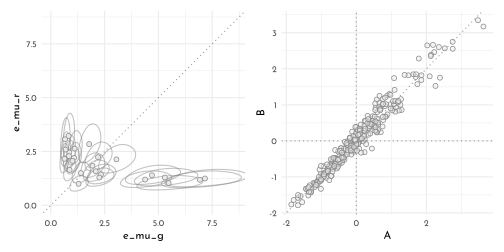

## Continous Categories and the Gaussian Process

### Spatial autocorrelatioin in Oceanic Tools


```r
data(islandsDistMatrix)
island_distances <- islandsDistMatrix %>% 
  (function(x){
    colnames(x) <- c("Ml", "Ti", "SC",
                     "Ya", "Fi", "Tr",
                     "Ch", "Mn", "To",
                     "Ha"); x
  }) %>% 
  round(digits = 1)

islandsDistMatrix %>% 
  data.frame() %>% 
  rownames_to_column(var = "from") %>% 
  as_tibble() %>% 
  mutate(from = fct_reorder(from, row_number())) %>% 
  pivot_longer(-from, names_to = "to", values_to = "dist") %>% 
  mutate(to = str_replace(string = to,pattern = '\\.', replacement = " ") %>% 
           factor(levels = levels(from))) %>%
  filter(as.numeric(from) < as.numeric(to)) %>% 
  as_tbl_graph() %>% 
  ggraph(layout = "kk", weights = sqrt(dist)) +
  geom_edge_link2(aes(color = node.name), 
                  start_cap = ggraph::rectangle(35, 23, 'pt', 'pt'),
                 end_cap = ggraph::rectangle(35, 23, 'pt','pt') )+
  geom_node_label(aes(color = name, label = name),
                  family = fnt_sel) +
  scale_y_reverse() +
  scale_color_manual(values = clr_pal(), guide = 'none')+
  scale_edge_color_manual(values = clr_pal(), guide = 'none') +
  coord_equal()
```

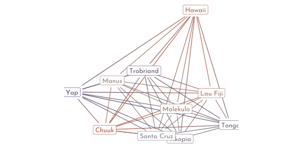

Creating a model in which the number of tools is correlated to those of the neighbor islands.

Building on the *scientific model* developed in chapter 11:

$$
\color{#858585FF}{
\begin{array}{rclr}
T_{i} & \sim  & \textrm{Poisson}(\lambda_{i}) & \textrm{[likelihood]}\\
\lambda_{i} & = & \alpha P_{i}^{\beta} / \gamma & \textrm{[linear model]}
\end{array}}
$$

we update to

$$
\begin{array}{rclr}
T_{i} & \sim  & \textrm{Poisson}(\lambda_{i}) & \textrm{[likelihood]}\\
\lambda_{i} & = & \textrm{exp}(k_{SOCIETY[i]}) \alpha P_{i}^{\beta} / \gamma & \textrm{[linear model]}
\end{array}
$$
with $k_{SOCIENTY}$ as the varying intercept with the multivariate prior:

$$
\begin{array}{rclr}
\left(
\begin{array}{c}
k_{1}\\ k_{2} \\ k_{3} \\ \vdots \\ k_{10}
\end{array}
\right) & \sim  &
 \textrm{MVNormal}\left(\left(\begin{array}{c} 0 \\0\\0\\ \vdots\\0 \end{array} \right) , K \right) &
 \textrm{[prior for intercepts]}\\
K_{ij} & = & \eta~\textrm{exp}(-\rho^{2}D_{ij}^2) + \delta_{ij}~\sigma^{2} & \textrm{[define covariance matrix]}
\end{array}
$$

where $D_{ij}$ is the distance between the $i^{th}$ and $j^{th}$ society (covariance declines exponentially).
The parameter $\rho$ defines the rate of decline, and the fact that we square $D_{ij}$ is simply a modelling choice.


```r
ggplot() +
  stat_function(fun = function(x){exp(-1 * x)},
                geom = "line", xlim = c(0, 4),
                aes(color = glue("exp( {mth('\U03C1')}^2 x )"),
                    linetype = after_stat(color))) +
  stat_function(fun = function(x){exp(-1 * x^2)},
                geom = "line", xlim = c(0, 4),
                aes(color = glue("exp( {mth('\U03C1')}^2 x^2 )"),
                    linetype = after_stat(color))) +
  scale_color_manual("decline shape",
                     values = c(clr_dark, clr_current),
                     guide = guide_legend(title.position = "top")) +
    scale_linetype_manual("decline shape",
                     values = c(3, 1),
                     guide = guide_legend(title.position = "top")) +
  labs(x = "distance", y = 'correlation') +
  theme(legend.text = element_markdown(),
        legend.direction = "horizontal",
        legend.position = c(1, 1),
        legend.justification = c(1 ,1))
```

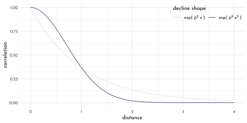

The parameters $\eta^{2}$ and $\delta_{ij}~\sigma^{2}$ are the maximal covariance and the a means to provide extra covariance when $i = j$ (by toggling $\delta_{ij} = 1$ then and $\delta_{ij} = 0$ otherwise).
This is important when there is more than one observation per unit as there will be variance within the units (not within this example though).

So now we also need priors for those parameters (*need to be positive*):

$$
\begin{array}{rclr}
\eta^{2} & \sim & \textrm{Exponential}(2) & \textrm{[prior for max. covariance]}\\
\rho^{2} & \sim & \textrm{Exponential}(0.5) & \textrm{[prior for the decline rate]}
\end{array}
$$

Now, the model fit:


```r
data(Kline2)

data_kline <- Kline2 %>% 
  as_tibble() %>% 
  mutate(pop_log_scl = scale(log(population))[,1],
         contact_idx = 3L - as.integer(factor(contact)),
         culture_idx = row_number())

data_kline_list <- data_kline %>%
  dplyr::select(total_tools, population, culture_idx) %>% 
  as.list() %>% 
  c(., list(d_mat = island_distances))

model_island_distance <- ulam(
  flist = alist(
    total_tools ~ dpois(lambda),
    lambda <- (alpha * population ^ beta / gamma) * exp(k[culture_idx]),
    vector[10]:k ~ multi_normal(0, SIGMA),
    matrix[10, 10]:SIGMA <- cov_GPL2( d_mat, eta_sq, rho_sq, 0.01 ),
    c(alpha, beta, gamma) ~ dexp(1),
    eta_sq ~ dexp(2),
    rho_sq ~ dexp(0.5)
  ),
  data = data_kline_list,
  chains = 4,
  cores = 4,
  iter = 2000
)
```


```r
library(ggmcmc)
ggs(model_island_distance@stanfit, inc_warmup = TRUE) %>%
  mutate(chain = factor(Chain)) %>% 
  # filter(Parameter %in% c("alpha", "beta_c", "beta_a")) %>% 
  ggplot(aes(x = Iteration, y = value)) +
  annotate(geom = "rect", 
           xmin = 0, xmax = 1000, ymin = -Inf, ymax = Inf,
           fill = clr0d, alpha = .3, size = 0) +
  geom_line(aes(color = chain),
            size = .15) +
  scale_color_manual(values = clr_chains() ) +
  facet_wrap(~ Parameter, scales = "free_y", ncol = 5) +
  labs(x = NULL, y = NULL) +
  theme(legend.position = "bottom") 
```


```r
precis(model_island_distance, depth = 3) %>% 
  knit_precis()
```


|param  |  mean|   sd|  5.5%| 94.5%|   n_eff| Rhat4|
|:------|-----:|----:|-----:|-----:|-------:|-----:|
|k[1]   | -0.17| 0.31| -0.66|  0.31|  547.99|  1.00|
|k[2]   | -0.01| 0.30| -0.47|  0.46|  483.06|  1.01|
|k[3]   | -0.06| 0.29| -0.51|  0.38|  462.31|  1.00|
|k[4]   |  0.36| 0.27| -0.04|  0.80|  487.83|  1.01|
|k[5]   |  0.07| 0.26| -0.30|  0.49|  469.88|  1.01|
|k[6]   | -0.38| 0.27| -0.82|  0.01|  515.66|  1.01|
|k[7]   |  0.14| 0.26| -0.25|  0.55|  469.41|  1.01|
|k[8]   | -0.21| 0.27| -0.63|  0.20|  498.61|  1.01|
|k[9]   |  0.26| 0.26| -0.11|  0.66|  434.98|  1.01|
|k[10]  | -0.17| 0.36| -0.73|  0.35|  574.67|  1.01|
|gamma  |  0.61| 0.55|  0.08|  1.65| 1364.72|  1.00|
|beta   |  0.28| 0.08|  0.15|  0.41|  926.52|  1.00|
|alpha  |  1.43| 1.08|  0.25|  3.41| 1801.02|  1.00|
|eta_sq |  0.18| 0.18|  0.03|  0.51|  589.68|  1.00|
|rho_sq |  1.39| 1.77|  0.08|  4.52| 2007.75|  1.00|


```r
island_dist_prior <- extract.prior(model_island_distance, n = 1e4) %>% 
  as_tibble()
```


```r
pm_cov_prior <- tibble(x = seq(0, 10, length.out = 101)) %>% 
  mutate(pm_cov = purrr::map(x, function(x){
    tibble(cov = island_dist_prior$eta_sq *
             exp(- island_dist_prior$rho_sq * x^2),
           .draw = seq_along(island_dist_prior$eta_sq))
  })) %>% 
  unnest(pm_cov) %>% 
  arrange(.draw, x)

pm_cov_prior_mu <- pm_cov_prior %>% 
  group_by(x) %>% 
  summarise(pi = list(tibble(prob = c(quantile(cov,
                                          probs = c(.055, .25, .5, .75, .945)),
                                 mean(cov)),
                        label = c("ll","l","m","h","hh","mean")))) %>% 
  unnest(pi) %>% 
  pivot_wider(names_from = label, values_from = prob)

p1 <- pm_cov_prior_mu %>% 
  ggplot(aes(x = x))  +
  geom_line(data = pm_cov_prior %>% filter(.draw < 51), 
            aes(y = cov, group = .draw),
            color = clr_dark) +
  geom_smooth(stat = 'identity',
              aes(y = mean, ymin = ll, ymax = hh), 
              size = .5, linetype = 2, 
              color = "white", #clr_current %>% clr_alpha(.8),
              fill = fll_current()) +
  labs(x = "distance (10^3 km)", y = "covariance",
       subtitle = "gaussian process prior") +
  lims(y = c(0, 2)) +
  theme(axis.title.x = element_markdown())
```


```r
island_dist_posterior <- extract.samples(model_island_distance)  %>% 
  as_tibble()

pm_cov <- tibble(x = seq(0, 10, length.out = 101)) %>% 
  mutate(pm_cov = purrr::map(x, function(x){
    tibble(cov = island_dist_posterior$eta_sq *
             exp(- island_dist_posterior$rho_sq * x^2),
           .draw = seq_along(island_dist_posterior$eta_sq))
  })) %>% 
  unnest(pm_cov) %>% 
  arrange(.draw, x)

pm_cov_mu <- pm_cov %>% 
  group_by(x) %>% 
  summarise(pi = list(tibble(prob = c(quantile(cov,
                                          probs = c(.055, .25, .5, .75, .945)),
                                 mean(cov)),
                        label = c("ll","l","m","h","hh","mean")))) %>% 
  unnest(pi) %>% 
  pivot_wider(names_from = label, values_from = prob)

p2 <- pm_cov_mu %>% 
  ggplot(aes(x = x))  +
  geom_line(data = pm_cov %>% filter(.draw < 51), 
            aes(y = cov, group = .draw),
            color = clr_dark) +
  geom_smooth(stat = 'identity',
              aes(y = mean, ymin = ll, ymax = hh), 
              size = .5, linetype = 2, 
              color = "white", #clr_current %>% clr_alpha(.8),
              fill = fll_current()) +
  labs(x = "distance (10^3 km)", y = "covariance",
       subtitle = "gaussian process posterior") +
  lims(y = c(0, 2)) +
  theme(axis.title.x = element_markdown())

p1 + p2
```

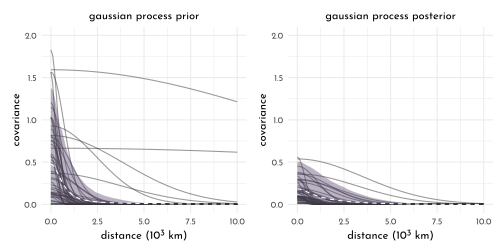


```r
K <- matrix(0, nrow = 10, ncol = 10)

for ( i in 1:10 ) {
  for ( j in 1:10 ) {
    K[i, j] <- median(island_dist_posterior$eta_sq) *
      exp(-median(island_dist_posterior$rho_sq) * islandsDistMatrix[i , j] ^2)
  }
}

diag(K) <- median(island_dist_posterior$eta_sq) + .01
Rho <- round(cov2cor(K), digits = 2) %>% 
  (function(x){colnames(x) <- colnames(island_distances); x}) %>% 
  (function(x){rownames(x) <- colnames(island_distances); x})

Rho %>% 
  data.frame() %>% 
  knit_precis(param_name = "culture")
```


|culture |   Ml|   Ti|   SC|   Ya|   Fi|   Tr|   Ch|   Mn|   To| Ha|
|:-------|----:|----:|----:|----:|----:|----:|----:|----:|----:|--:|
|Ml      | 1.00| 0.78| 0.69| 0.00| 0.29| 0.04| 0.00| 0.00| 0.07|  0|
|Ti      | 0.78| 1.00| 0.86| 0.00| 0.29| 0.04| 0.00| 0.00| 0.05|  0|
|SC      | 0.69| 0.86| 1.00| 0.00| 0.15| 0.10| 0.01| 0.01| 0.02|  0|
|Ya      | 0.00| 0.00| 0.00| 1.00| 0.00| 0.01| 0.15| 0.13| 0.00|  0|
|Fi      | 0.29| 0.29| 0.15| 0.00| 1.00| 0.00| 0.00| 0.00| 0.60|  0|
|Tr      | 0.04| 0.04| 0.10| 0.01| 0.00| 1.00| 0.08| 0.54| 0.00|  0|
|Ch      | 0.00| 0.00| 0.01| 0.15| 0.00| 0.08| 1.00| 0.31| 0.00|  0|
|Mn      | 0.00| 0.00| 0.01| 0.13| 0.00| 0.54| 0.31| 1.00| 0.00|  0|
|To      | 0.07| 0.05| 0.02| 0.00| 0.60| 0.00| 0.00| 0.00| 1.00|  0|
|Ha      | 0.00| 0.00| 0.00| 0.00| 0.00| 0.00| 0.00| 0.00| 0.00|  1|


```r
island_cor_graph <- Rho %>% 
  data.frame() %>% 
  rownames_to_column(var = "from") %>% 
  pivot_longer(-from, names_to = "to", values_to = "cor") %>% 
  as_tbl_graph() %N>% 
  left_join(data_kline %>% 
  mutate(name = colnames(island_distances),
         p_size = exp(logpop/max(logpop) * 1.5) - 2)) 

p1 <- island_cor_graph %>%
  create_layout(layout = . %N>% 
                  as.tibble() %>% 
                  dplyr::select(x = lon2, y = lat)) %>% 
  ggraph() +
  geom_edge_link(aes(alpha = cor ^ 2),
                 color = clr_current,
                 start_cap = ggraph::circle(8,"pt"),
                 end_cap = ggraph::circle(8,"pt")) +
  geom_point(aes(size = p_size, x = x, y = y),
             color = clr_current, fill = fll_current(),
             shape = 21) +
  ggrepel::geom_text_repel(aes(label = culture, x = x, y = y),
                           nudge_y = 2,
                           nudge_x = 1,
                           min.segment.length = unit(.5, "npc"),
                           family = fnt_sel) +
  scale_edge_alpha_identity() +
  theme_minimal(base_family = fnt_sel) +
  labs(x = 'longitude', y = 'latitude') +
  theme(legend.position = "none")
```


```r
tools_interval <- tibble(logpop = seq(6, 14, length.out = 31)) %>% 
  mutate(lambda = purrr::map(logpop, 
                             function(x){
    tibble(lambda = island_dist_posterior$alpha * exp(x) ^ island_dist_posterior$beta /  island_dist_posterior$gamma  )
  })) %>% 
  unnest(lambda) %>% 
  group_by(logpop) %>% 
  summarise(lambda_pi = list(tibble(prob = quantile(lambda, probs = c(.1, .5, .9)),
                               labels = c("l", "m", "h")))) %>% 
  unnest(lambda_pi) %>% 
  ungroup() %>% 
  pivot_wider(names_from = "labels", values_from = "prob") 


p2 <- island_cor_graph %>%
  create_layout(layout = . %N>% 
                  as.tibble() %>% 
                  dplyr::select(x = logpop, y = total_tools)) %>% 
  ggraph() +
  geom_edge_link(aes(alpha = cor ^ 2),
                 color = clr_current,
                 start_cap = ggraph::circle(8, "pt"),
                 end_cap = ggraph::circle(8, "pt")) +
  geom_point(aes(size = p_size, x = x, y = y),
             color = clr_current, fill = fll_current(),
             shape = 21)+
  geom_smooth(data = tools_interval,
              stat = "identity", 
              aes(x = logpop, y = m, ymin = l, ymax = h),
              color = clr_dark,
              fill = clr0d %>% clr_alpha(.3),
              linetype = 3,
              size = .6) +
  ggrepel::geom_text_repel(data = data_kline,
                           aes(x = logpop, y = total_tools, label = culture),
                           family = fnt_sel) +
  coord_cartesian(xlim = c(7, 12.5),
                  ylim = c(10, 70)) +
  scale_edge_alpha_identity() +
  theme_minimal(base_family = fnt_sel) +
  labs(x = 'log population', y = 'total tools') +
  theme(legend.position = "none")

p1 + p2
```

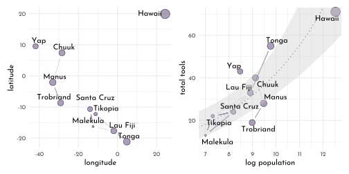

**Non-centered islands**


```r
model_island_distance_non_centered <- ulam(
  flist = alist(
    total_tools ~ dpois(lambda),
    lambda <- (alpha * population ^ beta / gamma) * exp(k[culture_idx]),
    
    # non-centered gaussian prior
    transpars> vector[10]: k <<- L_SIGMA * z,
    vector[10]:z ~ normal(0, 1),
    transpars> matrix[10, 10]: L_SIGMA <<- cholesky_decompose( SIGMA ),
    transpars> matrix[10, 10]: SIGMA <- cov_GPL2( d_mat, eta_sq, rho_sq, 0.01), 
    
    c(alpha, beta, gamma) ~ dexp(1),
    eta_sq ~ dexp(2),
    rho_sq ~ dexp(0.5)
  ),
  data = data_kline_list,
  chains = 4,
  cores = 4,
  iter = 2000,
  log_lik = TRUE
)
```


```r
precis(model_island_distance_non_centered) %>% 
  knit_precis()
```


|param  | mean|   sd| 5.5%| 94.5%|   n_eff| Rhat4|
|:------|----:|----:|----:|-----:|-------:|-----:|
|gamma  | 0.61| 0.62| 0.07|  1.73| 2162.49|     1|
|beta   | 0.28| 0.09| 0.14|  0.42| 1032.31|     1|
|alpha  | 1.39| 1.06| 0.23|  3.38| 3585.91|     1|
|eta_sq | 0.19| 0.17| 0.03|  0.53| 1237.34|     1|
|rho_sq | 1.29| 1.62| 0.08|  4.42| 2031.06|     1|

### Phylogenetic Distance


```r
dag4 <- dagify(G_2 ~ G_1 + U_1,
               B_2 ~ B_1 + U_1 + G_1,
               U_2 ~ U_1,
               exposure = "G_2",
               outcome = "B_2",
               coords = tibble(name = c("G_1", "G_2", "B_1",
                                        "B_2", "U_1", "U_2"),
                               x = c(0, 1, 0, 1, 0, 1),
                               y = c(1, 1, .5, .5, 0, 0)))

p1 <- dag4 %>%
  fortify() %>% 
  mutate(name = str_replace(name, "([A-Z])_([0-9])" , "\\1\\[\\2\\]" ),
         stage = if_else(name == "B[2]", "response",
                         if_else(name %in% c("G[2]"),
                                 "predictor", "confounds"))) %>% 
  plot_dag(clr_in = clr_current) +
  scale_x_continuous(limits = c(-.1, 1.1)) +
  labs(subtitle = "causal timeseries") +
  scale_y_continuous(limits = c(-.1, 1.1)) +
  coord_fixed(ratio = .6) +
  theme(plot.subtitle = element_text(hjust = .5,
                                     family = fnt_sel))

dag5 <- dagify(G ~ M + U,
               B ~ G + U + M,
               M ~ U,
               U ~ P,
               exposure = "G",
               outcome = "B",
               coords = tibble(name = c("G", "B", "M",
                                        "U", "P"),
                               x = c(0, 1, .5, .5, 1),
                               y = c(1, 1, .5, 0,  0)))

p2 <-  dag5 %>%
  fortify() %>% 
  mutate(stage = if_else(name == "B", "response",
                         if_else(name %in% c("G", "M", "P"),
                                 "predictor", "confounds"))) %>% 
  plot_dag(clr_in = clr_current) +
  scale_x_continuous(limits = c(-.1, 1.1)) +
  labs(subtitle = "model with phylogeny") +
  scale_y_continuous(limits = c(-.1, 1.1)) +
  coord_fixed(ratio = .6) +
  theme(plot.subtitle = element_text(hjust = .5,
                                     family = fnt_sel))

p1 + p2
```

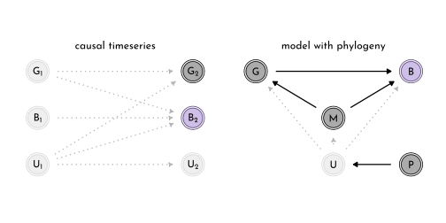


```r
data("Primates301")
data("Primates301_nex")

data_primates <- Primates301 %>% 
  as_tibble() %>% 
  mutate(label = as.character(name),
         across(c(body, brain, group_size),
                function(x){standardize(log(x))},
                .names = "{.col}_log_std"))

library(ggtree)
ggtree(Primates301_nex, layout = 'fan') %>% 
  .$data %>% 
  left_join(data_primates) %>% 
  ggtree(layout = 'fan', size = .2, aes(color = brain_log_std)) %>%
  ggtree::rotate(node = 302) %>%
  ggtree::rotate_tree(angle =  10) +
  geom_tiplab(aes(label = str_replace_all(label,"_", " ")),
              size = 1.5, family = fnt_sel, fontface = 'italic') +
  scale_color_gradientn(colours = clr_pal(c1 = clr_saturate(clr_lighten(clr1),.3),
                                          c2 = clr2),
                        na.value = "black") +
  guides(color = guide_colorbar(title.position = "top",
                                barwidth = unit(.8, "npc"),
                                barheight = unit(5, "pt")))+
  theme(legend.position = "bottom",
        legend.title = element_text(family = fnt_sel),
        legend.text = element_text(family = fnt_sel))
```


Preparation: a ordinary regression without the phylogeny:

$$
\begin{array}{rclr}
B & \sim & \textrm{MVNormal}(\mu, S) & \textrm{[likelihood]}\\
\mu_{i} & = & \alpha + \beta_{G}~ G_{i} + \beta_{M}~M_{i} & \textrm{[linear model]}
\end{array}
$$

with $B$ being a vector of species brain sizes and $S$ being a covariance matrix with one row & column per species in the form of $S = \sigma^{2}~I$ ($\sigma$ is the same standard deviation as always, and $I$ is the *identity matrix*).


```r
data_primates_complete <- data_primates %>% 
  filter(complete.cases(group_size, body, brain)) %>% 
  mutate(label = as.character(name),
         across(c(body, brain, group_size),
                function(x){standardize(log(x))},
                .names = "{.col}_log_std"))

data_primates_list <- data_primates_complete %>% 
  dplyr::select(body_log_std, brain_log_std, group_size_log_std) %>% 
  c(n_spp = nrow(.),
    .,
    list(i_mat = diag(nrow(.))))

model_primates_simple <- ulam(
  flist = alist(
    brain_log_std ~ multi_normal(mu, SIGMA),
    mu <- alpha + beta_m * body_log_std + beta_g * group_size_log_std,
    matrix[n_spp, n_spp]: SIGMA <- i_mat * sigma_sq,
    alpha ~ normal( 0, 1 ),
    c(beta_m, beta_g) ~ normal( 0, 0.5 ),
    sigma_sq ~ exponential(1)
  ),
  data = data_primates_list,
  chains = 4,
  cores = 4
)
```


```r
precis(model_primates_simple) %>% 
  knit_precis()
```


|param    | mean|   sd|  5.5%| 94.5%|   n_eff| Rhat4|
|:--------|----:|----:|-----:|-----:|-------:|-----:|
|alpha    | 0.00| 0.02| -0.03|  0.03| 1937.70|     1|
|beta_g   | 0.12| 0.02|  0.09|  0.16| 1116.39|     1|
|beta_m   | 0.89| 0.02|  0.86|  0.93| 1281.51|     1|
|sigma_sq | 0.05| 0.01|  0.04|  0.06| 1479.59|     1|

The **brownian motion** phylogeny model


```r
library(ape)
tree_trimmed <- keep.tip(Primates301_nex,
                         tip = as.character(data_primates_complete$name))

ggtree(tree_trimmed, layout = 'fan') %>% 
  .$data %>% 
  left_join(data_primates_complete) %>% 
  ggtree(layout = 'fan', size = .2, aes(color = brain_log_std)) %>%
  ggtree::rotate(node = 152) %>%
  ggtree::rotate_tree(angle =  7) +
  geom_tiplab(aes(label = str_replace_all(label,"_", " ")),
              size = 1.5, family = fnt_sel, fontface = 'italic') +
  scale_color_gradientn(colours = clr_pal(c1 = clr_saturate(clr_lighten(clr1),.3),
                                          c2 = clr2),
                        na.value = "black") +
  guides(color = guide_colorbar(title.position = "top",
                                barwidth = unit(.8, "npc"),
                                barheight = unit(5, "pt")))+
  theme(legend.position = "bottom",
        legend.title = element_text(family = fnt_sel),
        legend.text = element_text(family = fnt_sel))
```

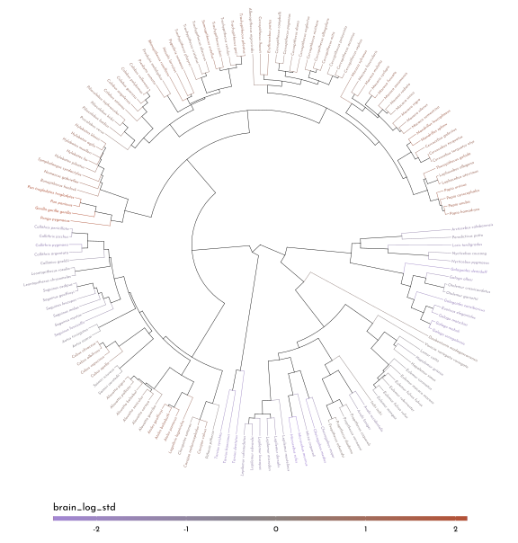


```r
Rho_brownian <- corBrownian(phy = tree_trimmed)
Var_Covar <- vcv(Rho_brownian)
dist_mat <- cophenetic(tree_trimmed)

p1 <- tibble(phyl_distance = as.vector(dist_mat),
       covariance = as.vector(Var_Covar)) %>% 
  ggplot(aes(x = phyl_distance, y = covariance)) +
  geom_point(shape = 21, size = 2,
             color = clr0dd, fill = fll0)

p2 <- dist_mat %>% 
  data.frame() %>% 
  rownames_to_column(var = "from") %>% 
  as_tibble() %>% 
  pivot_longer(-from, names_to = "to", values_to = "phyl_distance") %>% 
  mutate(across(c(from, to), function(str){str_replace_all(str, "_", " ")})) %>% 
  ggplot(aes(x = from, y = to, fill = phyl_distance)) +
      scale_fill_gradientn(colours = c(clr1, clr0),
                        na.value = "black") 

p3 <- Var_Covar %>% 
  data.frame() %>% 
  rownames_to_column(var = "from") %>% 
  as_tibble() %>% 
  pivot_longer(-from, names_to = "to", values_to = "covariance") %>% 
  mutate(across(c(from, to), function(str){str_replace_all(str, "_", " ")})) %>% 
  ggplot(aes(x = from, y = to, fill = covariance)) +
      scale_fill_gradientn(colours = c(clr0, clr2),
                        na.value = "black") 

p1 + (p2 + p3 &
  geom_tile() &
  guides(fill = guide_colorbar(title.position = "top",
                               barheight = unit(4, "pt"),
                               barwidth = unit(150, "pt"))) &
  theme(axis.text.x = element_text(face = "italic", size = 3, angle = 90, hjust = 1),
        axis.text.y = element_text(face = "italic", size = 3),
        axis.title = element_blank(),
        legend.position = "bottom")) +
  plot_layout(widths = c(.5, 1), guides = "collect") &
  theme(legend.position = "bottom")
```


```r
var_covar_sorted <- Var_Covar[as.character(data_primates_complete$name),
                               as.character(data_primates_complete$name)]

data_primates_list2 <- data_primates_complete %>% 
  dplyr::select(body_log_std, brain_log_std, group_size_log_std) %>% 
  c(n_spp = nrow(.),
    .,
    list(var_covar = var_covar_sorted,
         rho = var_covar_sorted / max(var_covar_sorted)))

model_primates_brownian <- ulam(
  flist = alist(
    brain_log_std ~ multi_normal(mu, SIGMA),
    mu <- alpha + beta_m * body_log_std + beta_g * group_size_log_std,
    matrix[n_spp, n_spp]: SIGMA <- rho * sigma_sq,
    alpha ~ normal( 0, 1 ),
    c(beta_m, beta_g) ~ normal( 0, 0.5 ),
    sigma_sq ~ exponential(1)
  ),
  data = data_primates_list2,
  chains = 4,
  cores = 4
)
```


```r
precis(model_primates_brownian) %>% 
  knit_precis()
```


|param    |  mean|   sd|  5.5%| 94.5%|   n_eff| Rhat4|
|:--------|-----:|----:|-----:|-----:|-------:|-----:|
|alpha    | -0.19| 0.17| -0.46|  0.08| 2688.42|     1|
|beta_g   | -0.01| 0.02| -0.04|  0.02| 2386.98|     1|
|beta_m   |  0.70| 0.04|  0.64|  0.76| 2171.25|     1|
|sigma_sq |  0.16| 0.02|  0.14|  0.19| 1897.77|     1|

The **Ornstein-Uhlenbeck process** phylogeny model (dampened random walk, returning to some mean, constraining variation, non-linear):

The *OU process* (aka. *L1 norm*) defines the covariance between two species $i$ and $j$ with an exponential distance kernel:

$$
K(i,j) = \eta^{2}~ \textrm{exp}(-\rho^{2} ~ D_{ij})
$$


```r
data_primates_list3 <- data_primates_complete %>% 
  dplyr::select(body_log_std, brain_log_std, group_size_log_std) %>% 
  c(n_spp = nrow(.),
    .,
    list(dist = dist_mat[as.character(data_primates_complete$name),
                               as.character(data_primates_complete$name)] / 
           max(dist_mat)))

model_primates_OU_process <- ulam(
  flist = alist(
    brain_log_std ~ multi_normal(mu, SIGMA),
    mu <- alpha + beta_m * body_log_std + beta_g * group_size_log_std,
    matrix[n_spp, n_spp]: SIGMA <- cov_GPL1(dist, eta_sq, rho_sq, 0.01),
    alpha ~ normal( 0, 1 ),
    c(beta_m, beta_g) ~ normal( 0, 0.5 ),
    eta_sq ~ half_normal( 1, 0.25 ),
    rho_sq ~ half_normal( 3, 0.25 )
  ),
  data = data_primates_list3,
  chains = 4,
  cores = 4
)
```


```r
precis(model_primates_OU_process) %>% 
  knit_precis()
```


|param  |  mean|   sd|  5.5%| 94.5%|   n_eff| Rhat4|
|:------|-----:|----:|-----:|-----:|-------:|-----:|
|alpha  | -0.07| 0.07| -0.19|  0.05| 1901.13|     1|
|beta_g |  0.05| 0.02|  0.01|  0.09| 1991.85|     1|
|beta_m |  0.83| 0.03|  0.79|  0.88| 2188.88|     1|
|eta_sq |  0.03| 0.01|  0.03|  0.05| 1991.39|     1|
|rho_sq |  2.80| 0.25|  2.39|  3.19| 2310.90|     1|


```r
new_dist <- seq(0, 1, length.out = 31)

prior_eta <- abs(rnorm(1e3, 1, .25))
prior_rho <- abs(rnorm(1e3, 3, 0.25))

prior_OU <- tibble(distance = new_dist) %>% 
  mutate(covariance = purrr::map(distance, 
                                 function(d){
                                   prior_eta  * exp(-prior_rho * d)
                                 })) %>% 
  unnest(covariance) %>% 
  group_by(distance) %>% 
  summarize(pi = list(tibble(prob = c(quantile(covariance, prob = c(.055,.5,.945)),
                                 mean(covariance)),
                        lab = c("l","m","h","mean")))) %>% 
  ungroup() %>% 
  unnest(pi) %>% 
  pivot_wider(names_from = lab, values_from = prob)

extract.samples(model_primates_OU_process) %>% 
  as_tibble() %>% 
  filter(row_number() < 31) %>% 
  mutate(.draw = row_number(),
         covariance = map2(eta_sq, rho_sq,
                           function(e, r){
                             tibble(covariance = e * exp(-r * new_dist),
                                    distance = new_dist)
                           })) %>% 
  unnest(covariance) %>% 
  ggplot(aes(x = distance, y = covariance)) +
  geom_line(aes(group = .draw, 
            color = "posterior")) +
  geom_smooth(data = prior_OU,
              stat = "identity",
              aes(color = "prior", fill = after_scale(clr_alpha(color)),
                  y = mean, ymin = l, ymax = h)) +
  scale_color_manual("",
                     values = c(prior = clr0d,
                                posterior = fll_current())) +
  theme(legend.direction = "horizontal",
        legend.position = c(1, 1),
        legend.justification = c(1,1))
```

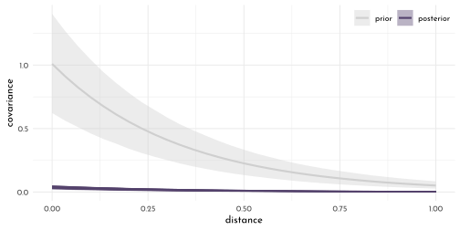


```r
stancode(model_primates_OU_process)
```

```
#> functions{
#> 
#> 
#>     matrix cov_GPL1(matrix x, real sq_alpha, real sq_rho, real delta) {
#>         int N = dims(x)[1];
#>         matrix[N, N] K;
#>         for (i in 1:(N-1)) {
#>           K[i, i] = sq_alpha + delta;
#>           for (j in (i + 1):N) {
#>             K[i, j] = sq_alpha * exp(-sq_rho * x[i,j] );
#>             K[j, i] = K[i, j];
#>           }
#>         }
#>         K[N, N] = sq_alpha + delta;
#>         return K;
#>     }
#> }
#> data{
#>     int n_spp;
#>     vector[151] brain_log_std;
#>     vector[151] group_size_log_std;
#>     vector[151] body_log_std;
#>     matrix[151,151] dist;
#> }
#> parameters{
#>     real alpha;
#>     real beta_g;
#>     real beta_m;
#>     real<lower=0> eta_sq;
#>     real<lower=0> rho_sq;
#> }
#> model{
#>     vector[151] mu;
#>     matrix[n_spp,n_spp] SIGMA;
#>     rho_sq ~ normal( 3 , 0.25 );
#>     eta_sq ~ normal( 1 , 0.25 );
#>     beta_m ~ normal( 0 , 0.5 );
#>     beta_g ~ normal( 0 , 0.5 );
#>     alpha ~ normal( 0 , 1 );
#>     SIGMA = cov_GPL1(dist, eta_sq, rho_sq, 0.01);
#>     for ( i in 1:151 ) {
#>         mu[i] = alpha + beta_m * body_log_std[i] + beta_g * group_size_log_std[i];
#>     }
#>     brain_log_std ~ multi_normal( mu , SIGMA );
#> }
```

---


```r
library(rlang)
chapter14_models <- env(
)

write_rds(chapter14_models, "envs/chapter14_models.rds")
```

## Homework

**E1**

original:

$$
\begin{array}{rcl}
y_{i} & \sim & \textrm{Normal}(\mu_{i}, \sigma)\\
\mu_{i} & = & \alpha_{\textrm{GROUP}[i]} + \beta~x_{i}\\
\alpha_{\textrm{GROUP}} & \sim & \textrm{Normal}(\alpha, \sigma_{\alpha}) \\
\alpha & \sim & \textrm{Normal}(0, 10) \\
\beta & \sim & \textrm{Normal}(0, 1) \\
\sigma & \sim & \textrm{Exponential}(1) \\
\sigma_{\alpha} & \sim & \textrm{Exponential}(1) \\
\end{array}
$$

with varying slopes

$$
\begin{array}{rcl}
y_{i} & \sim & \textrm{Normal}(\mu_{i}, \sigma)\\
\mu_{i} & = & \alpha_{\textrm{GROUP}[i]} + \beta_{\color{#54436D}{GROUP[i]}}~x_{i}\\
\color{#54436D}{\left[\begin{array}{c}\alpha_{GROUP}\\\beta_{GROUP}\end{array}\right]} & 
\sim & 
\color{#54436D}{\textrm{MVNormal}\left(\left[\begin{array}{c}\alpha\\\beta\end{array}\right], S\right)}\\
\color{#54436D}{S} & \sim & \color{#54436D}{\left(\begin{array}{cc}\sigma_{\alpha} & 0 \\ 0 &\sigma_{\beta}\end{array}\right) R \left(\begin{array}{cc}\sigma_{\alpha} & 0 \\ 0 &\sigma_{\beta}\end{array}\right)}\\
\alpha & \sim & \textrm{Normal}(0, 10) \\
\beta & \sim & \textrm{Normal}(0, 1) \\
\sigma & \sim & \textrm{Exponential}(1) \\
\sigma_{\alpha} & \sim & \textrm{Exponential}(1) \\
\color{#54436D}{\sigma_{\beta}} & \sim & \color{#54436D}{\textrm{Exponential}(1)} \\
\color{#54436D}{R} & \sim & \color{#54436D}{\textrm{LKJcorr}(2)}
\end{array}
$$

**E2**

Any system with a positive feedback loop / positive density dependence.
For example Allee effects - if survival of offspring increases with colony size and food availability.

**E3**

When the covariance acts in a very regularizing fashion leading to a strong shrinkage.
This happens when there is little variation between the clusters.

**M1**


```r
set.seed(42)

alpha <- 3.5      # average morning waiting time
beta <- -1        # average difference between morning and afternoon waiting time
sigma_alpha <- 1  # std dev in intercepts
sigma_beta <- 0.5 # std dev in slopes
rho <- 0          # correlation between intercepts and slopes

Mu <- c(alpha, beta)
cov_ab <- sigma_alpha * sigma_beta * rho
Sigma <- matrix(c(sigma_alpha^2, cov_ab, cov_ab, sigma_beta^2), ncol = 2)

n_cafes <- 20
n_visits <- 10
sigma    <-  0.5  # std dev within cafes
```


```r
# simulate observations
set.seed(6)
vary_effects <- mvrnorm(n_cafes, Mu, Sigma) %>%
  data.frame() %>%
  as_tibble() %>%
  set_names(nm = c("alpha_cafe", "beta_cafe"))

data_cafe_resim <- vary_effects %>% 
  mutate(cafe = 1:n_cafes) %>% 
  tidyr::expand(nesting(cafe, alpha_cafe, beta_cafe), 
         visit = 1:n_visits) %>% 
  mutate(afternoon = rep(0:1, times = n() / 2)) %>% 
  mutate(mu = alpha_cafe + beta_cafe * afternoon,
         waiting_time = rnorm(n_visits * n_cafes, mu, sigma))

data_cafe_resim_list <- data_cafe_resim %>% 
   dplyr::select(cafe, afternoon, waiting_time) %>% 
  as.list
```


```r
model_cafe_resim <- ulam(
  flist = alist(
    waiting_time ~ normal( mu, sigma ),
    mu <- alpha_cafe[cafe] + beta_cafe[cafe] * afternoon,
    c(alpha_cafe, beta_cafe)[cafe] ~ multi_normal( c(alpha, beta ), Rho, sigma_cafe ),
    alpha ~ normal(5, 2),
    beta ~ normal(-1, 0.5),
    sigma_cafe ~ exponential(1),
    sigma ~ exponential(1),
    Rho ~ lkj_corr(2)
  ),
  data = data_cafe_resim_list,
  cores = 4,
  chains = 4,
  seed = 42,
  log_lik = TRUE
)
```


```r
set.seed(42)
p2 <- extract.samples(model_cafe_resim) %>% 
  data.frame() %>% 
  as_tibble() %>% 
  ggplot() +
  geom_vline(xintercept = 0, color = clr_dark, linetype = 3) +
  geom_density(aes(x = Rho.2, color = "posterior",
                   fill = after_scale(clr_alpha(color))),
               adjust = .8) +
  geom_density(data = eta_rlk(eta = 2),
               aes(x = bl, color = "prior",
                   fill = after_scale(clr_alpha(color))),
               adjust = .6) +
  scale_color_manual("", values = c(prior = clr0d,
                                    posterior = clr_dark),
                     guide = guide_legend(nrow = 2,
                                          keyheight = unit(7, "pt"))) +
  labs(x = NULL,
       subtitle = "correlation between intercept and slope") +
  theme(legend.position = c(1, 1),
        legend.justification = c(1,1),
        legend.direction = "horizontal")

p1 <- tibble(level = c(.1, .3, .5, .8, .99)) %>% 
  mutate(ellipse = purrr::map(level,
                              function(level){
                                ellipse(Sigma, centre = Mu, level = level) %>% 
                                  data.frame() %>% 
                                  as_tibble() %>% 
                                  set_names(nm = c("alpha_cafe", "beta_cafe")) 
                              })) %>% 
  unnest(ellipse) %>% 
  ggplot(aes(x = alpha_cafe, y = beta_cafe)) +
  geom_path(aes(group = factor(level),
                alpha = -level),
            color = clr_dark, size = .25) +
  geom_point(data = vary_effects, color = clr0dd, fill = clr0, shape = 21, size = 1.5) +
  theme(legend.position = "none")

p1 + p2
```

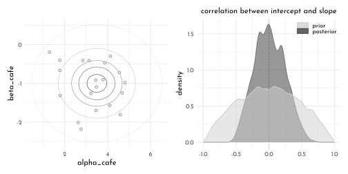


**M2**

$$
\begin{array}{rcl}
W_{i} & \sim & \textrm{Normal}(\mu_{i}, \sigma)\\
\mu_{i} & = & \alpha_{\textrm{CAFE}[i]} + \beta_{\textrm{CAFE}[i]}~A_{i}\\
\alpha_{\textrm{CAFE}} & \sim & \textrm{Normal}(\alpha, \sigma_{\alpha}) \\
\beta_{\textrm{CAFE}} & \sim & \textrm{Normal}(\beta, \sigma_{\beta}) \\
\alpha & \sim & \textrm{Normal}(0, 10) \\
\beta & \sim & \textrm{Normal}(0, 1) \\
\sigma, \sigma_{\alpha}, \sigma_{\beta}  & \sim & \textrm{Exponential}(1) \\
\end{array}
$$


```r
model_cafe_no_covar <- ulam(
  flist = alist(
    waiting_time ~ normal( mu, sigma ),
    mu <- alpha_cafe[cafe] + beta_cafe[cafe] * afternoon,
    alpha_cafe[cafe] ~ normal( alpha,  sigma_alpha ),
    beta_cafe[cafe] ~ normal( beta,  sigma_beta ),
    alpha ~ normal(5, 2),
    beta ~ normal(-1, 0.5),
    sigma ~ exponential(1),
    sigma_alpha ~ exponential(1),
    sigma_beta ~ exponential(1)
  ),
  data = data_cafe_list,
  cores = 4,
  chains = 4,
  seed = 42,
  log_lik = TRUE
)
```


```r
compare(model_cafe,
        model_cafe_no_covar) %>% 
  knit_precis()
```


|param               |   WAIC|   SE| dWAIC| dSE| pWAIC| weight|
|:-------------------|------:|----:|-----:|---:|-----:|------:|
|model_cafe          | 315.92| 21.4|  0.00|  NA| 31.70|   0.85|
|model_cafe_no_covar | 319.43| 21.5|  3.52| 2.9| 32.16|   0.15|

**M3**


```r
chapter11_models <- read_rds("envs/chapter11_models.rds")

data_ucb_list3 <- chapter11_models$data_ucb %>% 
  mutate(male = 2 - gid,
         dept_idx = as.numeric(dept)) %>% 
  dplyr::select(admit, applications, dept_idx, male) %>% 
  as.list()

model_ucb_dept_centered <- ulam(
  flist = alist(
    admit ~ dbinom( applications, p ),
    logit(p) <- alpha_dept[dept_idx] + beta_dept[dept_idx] * male,
    c(alpha_dept, beta_dept)[dept_idx] ~  multi_normal( c(alpha, beta ), Rho, sigma_dept ),
    alpha ~ dnorm( 0, 1 ),
    beta ~ dnorm( 0, 1 ),
    sigma_dept ~ exponential(1),
    Rho ~ lkj_corr(2)
  ),
  data = data_ucb_list3,
  iter = 4000,
  chains = 4,
  cores = 4,
  log_lik = TRUE
)

model_ucb_dept_non_center <- ulam(
  flist = alist(
    admit ~ dbinom( applications, p ),
    logit(p) <- ( alpha_dept_bar + v[dept_idx, 1]) + (beta_dept_bar + v[dept_idx, 2] ) * male,
    transpars > matrix[dept_idx, 2]:v <- compose_noncentered(sigma_dept, L_Rho, z),
    matrix[2, dept_idx]:z ~ dnorm(0, 1),
    alpha_dept_bar ~ dnorm( 0, 1.5 ),
    beta_dept_bar ~ dnorm( 0, 1 ),
    vector[2]:sigma_dept ~ dexp(1),
    cholesky_factor_corr[2]:L_Rho ~ lkj_corr_cholesky(2)
  ),
  data = data_ucb_list3,
  iter = 4000,
  chains = 4,
  cores = 4,
  log_lik = TRUE
)
```


```r
precis(model_ucb_dept_centered, depth = 3) %>% 
  knit_precis()
```


|param         |  mean|   sd|  5.5%| 94.5%|   n_eff| Rhat4|
|:-------------|-----:|----:|-----:|-----:|-------:|-----:|
|beta_dept[1]  | -0.77| 0.27| -1.21| -0.33| 2525.47|     1|
|beta_dept[2]  | -0.21| 0.32| -0.72|  0.29| 4398.76|     1|
|beta_dept[3]  |  0.08| 0.14| -0.15|  0.30| 7234.94|     1|
|beta_dept[4]  | -0.09| 0.14| -0.32|  0.13| 7512.79|     1|
|beta_dept[5]  |  0.11| 0.18| -0.18|  0.41| 6345.83|     1|
|beta_dept[6]  | -0.12| 0.26| -0.54|  0.30| 5586.59|     1|
|alpha_dept[1] |  1.28| 0.26|  0.87|  1.70| 2716.39|     1|
|alpha_dept[2] |  0.74| 0.32|  0.23|  1.25| 4457.76|     1|
|alpha_dept[3] | -0.65| 0.09| -0.78| -0.51| 7406.41|     1|
|alpha_dept[4] | -0.62| 0.10| -0.79| -0.45| 7560.44|     1|
|alpha_dept[5] | -1.13| 0.11| -1.31| -0.95| 6307.85|     1|
|alpha_dept[6] | -2.60| 0.20| -2.93| -2.28| 6130.43|     1|
|alpha         | -0.37| 0.51| -1.15|  0.45| 7013.77|     1|
|beta          | -0.17| 0.22| -0.52|  0.15| 4882.39|     1|
|sigma_dept[1] |  1.47| 0.47|  0.91|  2.29| 5755.02|     1|
|sigma_dept[2] |  0.45| 0.23|  0.18|  0.85| 3000.35|     1|
|Rho[1,1]      |  1.00| 0.00|  1.00|  1.00|     NaN|   NaN|
|Rho[1,2]      | -0.32| 0.33| -0.79|  0.27| 5674.90|     1|
|Rho[2,1]      | -0.32| 0.33| -0.79|  0.27| 5674.90|     1|
|Rho[2,2]      |  1.00| 0.00|  1.00|  1.00|     NaN|   NaN|

```r
precis(model_ucb_dept_non_center, depth = 3) %>% 
  knit_precis()
```


|param          |  mean|   sd|  5.5%| 94.5%|   n_eff| Rhat4|
|:--------------|-----:|----:|-----:|-----:|-------:|-----:|
|z[1,1]         |  1.26| 0.54|  0.45|  2.18| 2702.38|     1|
|z[1,2]         |  0.87| 0.49|  0.11|  1.68| 2517.45|     1|
|z[1,3]         | -0.15| 0.39| -0.77|  0.48| 1915.71|     1|
|z[1,4]         | -0.13| 0.39| -0.75|  0.50| 1982.60|     1|
|z[1,5]         | -0.51| 0.41| -1.17|  0.14| 2019.43|     1|
|z[1,6]         | -1.59| 0.59| -2.57| -0.72| 2376.73|     1|
|z[2,1]         | -1.17| 0.79| -2.45|  0.04| 5147.44|     1|
|z[2,2]         |  0.20| 0.79| -1.05|  1.44| 6469.73|     1|
|z[2,3]         |  0.65| 0.60| -0.25|  1.64| 4955.89|     1|
|z[2,4]         |  0.15| 0.59| -0.77|  1.09| 5035.67|     1|
|z[2,5]         |  0.59| 0.66| -0.42|  1.67| 5732.59|     1|
|z[2,6]         | -0.45| 0.82| -1.76|  0.84| 6312.38|     1|
|alpha_dept_bar | -0.44| 0.57| -1.34|  0.45| 1994.81|     1|
|beta_dept_bar  | -0.17| 0.21| -0.50|  0.14| 3182.53|     1|
|sigma_dept[1]  |  1.47| 0.46|  0.91|  2.28| 3055.78|     1|
|sigma_dept[2]  |  0.45| 0.23|  0.18|  0.84| 2553.50|     1|
|L_Rho[1,1]     |  1.00| 0.00|  1.00|  1.00|     NaN|   NaN|
|L_Rho[1,2]     |  0.00| 0.00|  0.00|  0.00|     NaN|   NaN|
|L_Rho[2,1]     | -0.31| 0.34| -0.80|  0.31| 5547.21|     1|
|L_Rho[2,2]     |  0.88| 0.14|  0.61|  1.00| 4659.42|     1|
|v[1,1]         |  1.71| 0.61|  0.76|  2.68| 2296.12|     1|
|v[1,2]         | -0.59| 0.30| -1.10| -0.14| 3745.01|     1|
|v[2,1]         |  1.18| 0.62|  0.17|  2.18| 2429.83|     1|
|v[2,2]         | -0.04| 0.32| -0.54|  0.47| 6847.96|     1|
|v[3,1]         | -0.20| 0.58| -1.11|  0.70| 1981.49|     1|
|v[3,2]         |  0.25| 0.23| -0.10|  0.62| 3293.03|     1|
|v[4,1]         | -0.18| 0.58| -1.08|  0.72| 2035.30|     1|
|v[4,2]         |  0.07| 0.23| -0.28|  0.45| 3923.55|     1|
|v[5,1]         | -0.69| 0.58| -1.60|  0.21| 2041.55|     1|
|v[5,2]         |  0.28| 0.25| -0.09|  0.71| 4081.96|     1|
|v[6,1]         | -2.16| 0.60| -3.11| -1.23| 2116.32|     1|
|v[6,2]         |  0.05| 0.30| -0.42|  0.51| 5801.23|     1|

```r
compare(model_ucb_dept_centered,
        model_ucb_dept_non_center) %>% 
  knit_precis(param_name = "model")
```


|model                     |  WAIC|   SE| dWAIC|  dSE| pWAIC| weight|
|:-------------------------|-----:|----:|-----:|----:|-----:|------:|
|model_ucb_dept_centered   | 91.71| 4.85|  0.00|   NA|  7.09|   0.56|
|model_ucb_dept_non_center | 92.18| 5.07|  0.47| 0.44|  7.31|   0.44|


**M4**


```r
precis(chapter11_models$model_ocean_scientific, depth = 2) %>% 
  knit_precis()
```


|param    | mean|   sd|  5.5%| 94.5%|   n_eff| Rhat4|
|:--------|----:|----:|-----:|-----:|-------:|-----:|
|alpha[1] | 0.90| 0.69| -0.28|  1.96|  629.57|     1|
|alpha[2] | 0.91| 0.86| -0.51|  2.25|  871.55|     1|
|beta[1]  | 0.26| 0.03|  0.21|  0.32| 1000.66|     1|
|beta[2]  | 0.29| 0.10|  0.13|  0.47|  748.66|     1|
|gamma    | 1.16| 0.79|  0.29|  2.50|  851.27|     1|

```r
precis(model_island_distance, depth = 2) %>% 
  knit_precis()
```


|param  |  mean|   sd|  5.5%| 94.5%|   n_eff| Rhat4|
|:------|-----:|----:|-----:|-----:|-------:|-----:|
|k[1]   | -0.17| 0.31| -0.66|  0.31|  547.99|  1.00|
|k[2]   | -0.01| 0.30| -0.47|  0.46|  483.06|  1.01|
|k[3]   | -0.06| 0.29| -0.51|  0.38|  462.31|  1.00|
|k[4]   |  0.36| 0.27| -0.04|  0.80|  487.83|  1.01|
|k[5]   |  0.07| 0.26| -0.30|  0.49|  469.88|  1.01|
|k[6]   | -0.38| 0.27| -0.82|  0.01|  515.66|  1.01|
|k[7]   |  0.14| 0.26| -0.25|  0.55|  469.41|  1.01|
|k[8]   | -0.21| 0.27| -0.63|  0.20|  498.61|  1.01|
|k[9]   |  0.26| 0.26| -0.11|  0.66|  434.98|  1.01|
|k[10]  | -0.17| 0.36| -0.73|  0.35|  574.67|  1.01|
|gamma  |  0.61| 0.55|  0.08|  1.65| 1364.72|  1.00|
|beta   |  0.28| 0.08|  0.15|  0.41|  926.52|  1.00|
|alpha  |  1.43| 1.08|  0.25|  3.41| 1801.02|  1.00|
|eta_sq |  0.18| 0.18|  0.03|  0.51|  589.68|  1.00|
|rho_sq |  1.39| 1.77|  0.08|  4.52| 2007.75|  1.00|

```r
compare(chapter11_models$model_ocean_scientific,
        model_island_distance_non_centered)
```

```
#>                                             WAIC       SE   dWAIC      dSE
#> model_island_distance_non_centered      67.39234  2.29028  0.0000       NA
#> chapter11_models$model_ocean_scientific 80.01854 11.18399 12.6262 11.19445
#>                                            pWAIC      weight
#> model_island_distance_non_centered      4.022846 0.998190876
#> chapter11_models$model_ocean_scientific 4.906543 0.001809124
```

**M5**


```r
model_primates_OU_process_reverse <- ulam(
  flist = alist(
    group_size_log_std ~ multi_normal(mu, SIGMA),
    mu <- alpha + beta_m * body_log_std + beta_b * brain_log_std,
    matrix[n_spp, n_spp]: SIGMA <- cov_GPL1(dist, eta_sq, rho_sq, 0.01),
    alpha ~ normal( 0, 1 ),
    c(beta_m, beta_b) ~ normal( 0, 0.5 ),
    eta_sq ~ half_normal( 1, 0.25 ),
    rho_sq ~ half_normal( 3, 0.25 )
  ),
  data = data_primates_list3,
  chains = 4,
  cores = 4
)
```


```r
precis(model_primates_OU_process_reverse)
```

```
#>              mean        sd       5.5%      94.5%    n_eff    Rhat4
#> alpha  -0.5053841 0.3456288 -1.0381465 0.05768045 1376.664 1.001963
#> beta_b  0.1966539 0.2548399 -0.2176509 0.59215235 1166.416 1.003252
#> beta_m  0.1782800 0.2290642 -0.1792382 0.55471525 1018.621 1.003373
#> eta_sq  0.9301265 0.1236063  0.7479650 1.13487715 1420.556 1.002007
#> rho_sq  3.0304659 0.2488279  2.6482468 3.41942840 1619.587 1.000517
```

```r
precis(model_primates_OU_process)
```

```
#>               mean          sd        5.5%      94.5%    n_eff     Rhat4
#> alpha  -0.06792699 0.073265723 -0.18708943 0.04727763 1901.133 1.0000575
#> beta_g  0.04932900 0.022629955  0.01361525 0.08654041 1991.855 0.9992546
#> beta_m  0.83344136 0.029704956  0.78608237 0.88026958 2188.879 0.9984471
#> eta_sq  0.03486782 0.006610176  0.02568661 0.04643301 1991.390 1.0002500
#> rho_sq  2.79547319 0.245505138  2.39143175 3.18569015 2310.902 0.9997646
```


**H1**


```r
data("bangladesh")

data_bangaldesh <- bangladesh %>% 
  as_tibble() %>% 
  mutate(district_idx = as.integer(as.factor(district)))  %>% 
  rename(contraception = use.contraception) 

data_bangaldesh_list <- data_bangaldesh %>% 
  dplyr::select(woman, district_idx, contraception, urban) %>% 
  as.list()

model_bangladesh_covar <- ulam(
  flist = alist(
    contraception ~ dbinom(1, p),
    logit(p) <- ( alpha_dist_bar + v[district_idx, 1]) + (beta_dist_bar + v[district_idx, 2] ) * urban,
    transpars > matrix[district_idx, 2]:v <- compose_noncentered(sigma_dist, L_Rho, z),
    matrix[2, district_idx]:z ~ dnorm(0, 1),
    alpha_dist_bar ~ dnorm( 0, 1.5 ),
    beta_dist_bar ~ dnorm( 0, 1 ),
    vector[2]:sigma_dist ~ dexp(1),
    cholesky_factor_corr[2]:L_Rho ~ lkj_corr_cholesky(2),
    gq> matrix[2,2]:Rho <<- Chol_to_Corr(L_Rho)),
  data = data_bangaldesh_list,
  cores = 4,
  chain = 4,
  iter = 4000,
  log_lik = TRUE
)

model_bangladesh_covar_centered <- ulam(
  alist(
    contraception ~ bernoulli(p),
    logit(p) <- alpha[district_idx] + beta[district_idx] * urban,
    c(alpha, beta)[district_idx] ~ multi_normal(c(alpha_bar, beta_bar), Rho, Sigma),
    alpha_bar ~ normal(0, 1),
    beta_bar ~ normal(0, 0.5),
    Rho ~ lkj_corr(2),
    Sigma ~ exponential(1)
  ),
  data = data_bangaldesh_list,
  chains = 4, cores = 4, iter = 4000
)
```


```r
precis(model_bangladesh_covar, depth = 3,
       pars = c("alpha_dist_bar" ,"beta_dist_bar", "sigma_dist","Rho")) %>% 
  knit_precis()
```


|param          |  mean|   sd|  5.5%| 94.5%|   n_eff| Rhat4|
|:--------------|-----:|----:|-----:|-----:|-------:|-----:|
|alpha_dist_bar | -0.71| 0.10| -0.87| -0.55| 4630.22|     1|
|beta_dist_bar  |  0.70| 0.17|  0.43|  0.97| 5150.31|     1|
|sigma_dist[1]  |  0.58| 0.10|  0.43|  0.74| 3147.76|     1|
|sigma_dist[2]  |  0.79| 0.21|  0.48|  1.14| 2553.73|     1|
|Rho[1,1]       |  1.00| 0.00|  1.00|  1.00|     NaN|   NaN|
|Rho[1,2]       | -0.66| 0.17| -0.87| -0.36| 3412.32|     1|
|Rho[2,1]       | -0.66| 0.17| -0.87| -0.36| 3412.32|     1|
|Rho[2,2]       |  1.00| 0.00|  1.00|  1.00|     NaN|   NaN|

```r
precis(model_bangladesh_covar_centered, depth = 3,
       pars = c("alpha_bar" ,"beta_bar", "Sigma","Rho")) %>% 
  knit_precis()
```


|param     |  mean|   sd|  5.5%| 94.5%|   n_eff| Rhat4|
|:---------|-----:|----:|-----:|-----:|-------:|-----:|
|alpha_bar | -0.69| 0.10| -0.85| -0.53| 5812.85|  1.00|
|beta_bar  |  0.64| 0.16|  0.38|  0.90| 3766.35|  1.00|
|Sigma[1]  |  0.58| 0.10|  0.43|  0.74| 1707.52|  1.00|
|Sigma[2]  |  0.79| 0.20|  0.48|  1.13|  904.70|  1.01|
|Rho[1,1]  |  1.00| 0.00|  1.00|  1.00|     NaN|   NaN|
|Rho[1,2]  | -0.65| 0.17| -0.86| -0.34| 1428.75|  1.00|
|Rho[2,1]  | -0.65| 0.17| -0.86| -0.34| 1428.75|  1.00|
|Rho[2,2]  |  1.00| 0.00|  1.00|  1.00|     NaN|   NaN|


```r
alpha_beta_means <- extract.samples(model_bangladesh_covar_centered) %>% 
  as_tibble() %>% 
  summarise(beta_mean = colMeans(beta),
            alpha_mean = colMeans(alpha))

extract.samples(model_bangladesh_covar_centered) %>% 
  as_tibble() %>% 
  dplyr::select(alpha, beta) %>% 
  mutate(across(everything(),as_tibble)) %>% 
   summarise(alpha = alpha %>% pivot_longer(everything(),names_to = "dist", values_to = "alpha"),
         beta = beta %>% pivot_longer(everything(),names_to = "dist", values_to = "beta")) %>% 
  unnest(alpha, beta) %>% 
   dplyr::select(-dist1) %>% 
  ggplot(aes( alpha, beta)) +
      ( (c(1:9, 9.9)/10) %>% purrr::map(.f = function(lvl){
     stat_ellipse(geom = "polygon", 
                  type = "norm", 
                  level = lvl,linetype = 3,
                  size = .2,
                  alpha = .05,
                  color = "black",
                  fill = "black") 
   }) ) +
  geom_point(data = alpha_beta_means, aes(x = alpha_mean, y = beta_mean),
             shape = 21, size = 1.5, color = clr_dark, fill = fll0dd) +
  geom_hline(yintercept = 0, color = clr_dark, linetype = 3) +
  geom_vline(xintercept = 0, color = clr_dark, linetype = 3) +
  coord_cartesian(xlim = c(-2, .6),
                  ylim = c(-.5, 1.6))
```

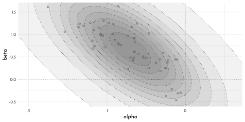

**H2**


```r
dag <- dagify(C ~ A + N,# + U + D,
              N ~ A,
              exposure = "C",
              outcome = "A",
              coords = tibble(name = c("A", "N", "C"),#, "U", "D"),
                              x = c(0, .5, 1),#, 1.5, 1.5),
                              y = c(0, 1, 0))#, 0, 1))
              )

dag %>%
  fortify() %>% 
  mutate(stage = if_else(name == "C", "response",
                         if_else(name %in% c("A", "N", "U", "D"),
                                 "predictor", "confounds"))) %>% 
  plot_dag(clr_in = clr2) +
  scale_x_continuous(limits = c(-.1, 1.1)) +
  labs(subtitle = "instrumental variable") + 
  scale_y_continuous(limits = c(-.1, 1.1)) +
  coord_fixed(ratio = .6) +
  theme(plot.subtitle = element_text(hjust = .5, family = fnt_sel))
```

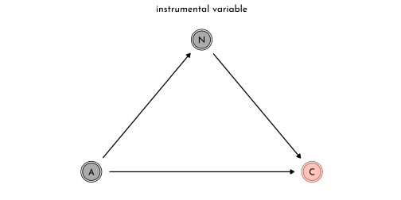


```r
data_bangaldesh_list2 <- data_bangaldesh %>%
  mutate(age_std = standardize(age.centered),
         children_std = standardize(living.children)) %>% 
  dplyr::select(woman, district_idx, contraception, urban, age_std, children_std) %>% 
  as.list()

model_bangladesh_age <- ulam(
  alist(
    contraception ~ bernoulli(p),
    logit(p) <- alpha[district_idx] + beta[district_idx] * urban +
      beta_age * age_std,
    c(alpha, beta)[district_idx] ~ multi_normal(c(alpha_bar, beta_bar), Rho, Sigma),
    alpha_bar ~ normal(0, 1),
    c(beta_bar, beta_age ) ~ normal(0, 0.5),
    Rho ~ lkj_corr(2),
    Sigma ~ exponential(1)
  ),
  data = data_bangaldesh_list2,
  chains = 4, cores = 4, iter = 4000
)

model_bangladesh_age_children <- ulam(
  alist(
    contraception ~ bernoulli(p),
    logit(p) <- alpha[district_idx] + beta[district_idx] * urban +
      beta_age * age_std + beta_children * children_std,
    c(alpha, beta)[district_idx] ~ multi_normal(c(alpha_bar, beta_bar), Rho, Sigma),
    alpha_bar ~ normal(0, 1),
    c(beta_bar, beta_age, beta_children ) ~ normal(0, 0.5),
    Rho ~ lkj_corr(2),
    Sigma ~ exponential(1)
  ),
  data = data_bangaldesh_list2,
  chains = 4, cores = 4, iter = 4000
)
```


```r
precis(model_bangladesh_age) %>% 
  knit_precis()
```


|param     |  mean|   sd|  5.5%| 94.5%|    n_eff| Rhat4|
|:---------|-----:|----:|-----:|-----:|--------:|-----:|
|alpha_bar | -0.69| 0.10| -0.85| -0.53|  5344.89|     1|
|beta_age  |  0.08| 0.05|  0.00|  0.16| 13446.44|     1|
|beta_bar  |  0.63| 0.16|  0.38|  0.89|  4286.55|     1|

```r
precis(model_bangladesh_age_children) %>% 
  knit_precis()
```


|param         |  mean|   sd|  5.5%| 94.5%|   n_eff| Rhat4|
|:-------------|-----:|----:|-----:|-----:|-------:|-----:|
|alpha_bar     | -0.72| 0.10| -0.88| -0.55| 5796.66|     1|
|beta_children |  0.51| 0.07|  0.40|  0.63| 8339.46|     1|
|beta_age      | -0.27| 0.07| -0.38| -0.15| 8690.24|     1|
|beta_bar      |  0.69| 0.16|  0.43|  0.95| 3952.92|     1|

**H3**


```r
data_bangaldesh_list3 <- data_bangaldesh %>%
  mutate(age_std = standardize(age.centered)) %>% 
  dplyr::select(woman, district_idx, contraception, urban,
                age_std, children = living.children) %>% 
  as.list() %>% 
  c(., list(alpha = rep(2,3)))

model_bangladesh_age_ordered <- ulam(
  alist(
    contraception ~ bernoulli(p),
    logit(p) <- alpha_distr[district_idx] + beta_distr[district_idx] * urban +
      beta_age * age_std + beta_children * sum( delta_shell[1:children] ),
    c(alpha_distr, beta_distr)[district_idx] ~ multi_normal(c(alpha_bar, beta_bar), Rho, Sigma),
    alpha_bar ~ normal(0, 1),
    c(beta_bar, beta_age, beta_children ) ~ normal(0, 0.5),
    Rho ~ lkj_corr(2),
    Sigma ~ exponential(1),
    vector[4]: delta_shell <<- append_row( 0 , delta ),
    simplex[3]: delta ~ dirichlet( alpha )
  ),
  data = data_bangaldesh_list3,
  chains = 4, cores = 4, iter = 4000
)
```


```r
precis(model_bangladesh_age_ordered) %>% 
  knit_precis()
```


|param         |  mean|   sd|  5.5%| 94.5%|   n_eff| Rhat4|
|:-------------|-----:|----:|-----:|-----:|-------:|-----:|
|alpha_bar     | -1.55| 0.15| -1.79| -1.31| 2156.56|     1|
|beta_children |  1.26| 0.15|  1.02|  1.51| 2188.79|     1|
|beta_age      | -0.23| 0.06| -0.33| -0.12| 5092.98|     1|
|beta_bar      |  0.69| 0.16|  0.44|  0.94| 4257.01|     1|

```r
precis(model_bangladesh_age_ordered, 3, pars = "delta") %>% 
  knit_precis()
```


|param    | mean|   sd| 5.5%| 94.5%|    n_eff| Rhat4|
|:--------|----:|----:|----:|-----:|--------:|-----:|
|delta[1] | 0.74| 0.08| 0.60|  0.87| 10830.19|     1|
|delta[2] | 0.17| 0.08| 0.05|  0.30| 10823.63|     1|
|delta[3] | 0.09| 0.05| 0.02|  0.19| 12210.01|     1|

**H4**


```r
data("Oxboys")

data_ox <- Oxboys %>% 
  as_tibble() %>% 
  mutate(subject_idx = coerce_index(Subject),
         age_std = standardize(age))

data_ox %>% 
  ggplot(aes(x = age, y = height, group = subject_idx)) +
  geom_line(color = clr_dark)
```

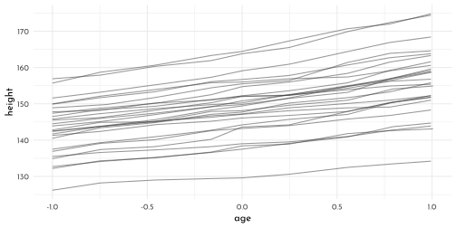


```r
data_ox_list <- data_ox %>% 
  dplyr::select(height, age_std, subject_idx) %>% 
  as.list()

model_ox <- ulam(
  flist = alist(
    height ~ dnorm(mu, sigma),
    mu <- alpha_bar + alpha_age[subject_idx] + (beta_bar + beta_age[subject_idx]) * age_std,
    alpha_bar ~ dnorm(150, 10),
    beta_bar ~ dnorm(0, 10),
    c(alpha_age, beta_age)[subject_idx] ~ multi_normal(0, Rho_idx, Sigma_idx),
    Sigma_idx ~ dexp(1),
    Rho_idx ~ dlkjcorr(1),
    sigma ~ dexp(1)
  ),
  data = data_ox_list,
  cores = 4,
  chains = 4,
  log_lik = TRUE,
  iter = 4000,
  seed = 42
)
```


```r
precis(model_ox, depth = 2, pars = c("alpha_bar", "beta_bar", "Sigma_idx")) %>% 
  knit_precis()
```


|param        |   mean|   sd|   5.5%|  94.5%|   n_eff| Rhat4|
|:------------|------:|----:|------:|------:|-------:|-----:|
|alpha_bar    | 149.47| 1.38| 147.13| 151.61|  317.42|     1|
|beta_bar     |   4.21| 0.21|   3.88|   4.54|  449.01|     1|
|Sigma_idx[1] |   7.39| 0.90|   6.10|   8.91| 5486.74|     1|
|Sigma_idx[2] |   1.07| 0.15|   0.85|   1.34| 4938.46|     1|

**H5**


```r
precis(model_ox, depth = 3, pars = c("Rho_idx")) %>% 
  knit_precis()
```


|param        | mean|   sd| 5.5%| 94.5%|   n_eff| Rhat4|
|:------------|----:|----:|----:|-----:|-------:|-----:|
|Rho_idx[1,1] | 1.00| 0.00| 1.00|  1.00|     NaN|   NaN|
|Rho_idx[1,2] | 0.55| 0.13| 0.32|  0.73| 5832.03|     1|
|Rho_idx[2,1] | 0.55| 0.13| 0.32|  0.73| 5832.03|     1|
|Rho_idx[2,2] | 1.00| 0.00| 1.00|  1.00|     NaN|   NaN|

```r
posterior_rho <- extract.samples(model_ox) %>% 
  as_tibble() %>% 
  dplyr::select(Rho_idx) %>% 
  mutate(Rho_idx = as_tibble(Rho_idx)) %>% 
  unnest(cols = c(Rho_idx)) %>% 
  set_names(nm = c("rho_alpha", "rho_alpha_beta", "rho_beta_alpha", "rho_beta"))

posterior_rho %>% 
  ggplot(aes(x = rho_alpha_beta)) +
  geom_density(adjust = .7, color = clr0d, fill = fll0)+
  labs(x = "rho")
```

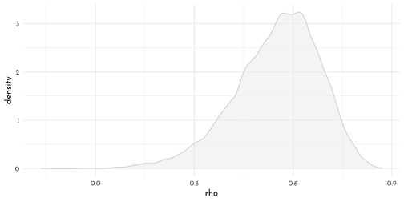

**H6**


```r
posterior_means <- extract.samples(model_ox) %>% 
  as_tibble() %>% 
  dplyr::select(Sigma_idx) %>% 
  mutate(Sigma_idx = as_tibble(Sigma_idx)) %>% 
  unnest(cols = c(Sigma_idx)) %>% 
  set_names(nm = c("sigma_alpha", "sigma_beta")) %>% 
  bind_cols(posterior_rho) %>% 
  bind_cols(
  extract.samples(model_ox) %>% 
  as_tibble() %>% 
  dplyr::select(sigma, alpha_bar, beta_bar)) %>%  
  summarise(across(everything(),mean))

S <- matrix( c( posterior_means$sigma_alpha ^ 2 ,
                posterior_means$sigma_alpha * posterior_means$sigma_beta * posterior_means$rho_alpha_beta,
                posterior_means$sigma_alpha * posterior_means$sigma_beta * posterior_means$rho_alpha_beta,
                posterior_means$sigma_beta ^ 2 ),
             nrow = 2 )

round( S , 2 )
```

$$\begin{bmatrix} 54.62 &4.36 \\4.36 &1.15 \\ \end{bmatrix}$$

```r
set.seed(42)

mvrnorm(n = 11, mu = c(0, 0), Sigma = S) %>% 
  as_tibble() %>% 
  set_names(nm = c("alpha", "beta")) %>% 
  mutate(.draw = row_number(),
         heights = map2(alpha, beta, 
                        function(a,b){
                          tibble(age = seq(-1, 1, length.out = 9),
                                 height = rnorm(9, mean = posterior_means$alpha_bar + a + (posterior_means$beta_bar + b) * age, sd = posterior_means$sigma))
                        })) %>% 
  unnest(heights) %>% 
  ggplot(aes(x = age, y = height, group = .draw))  +
  geom_line(color = clr_dark)
```

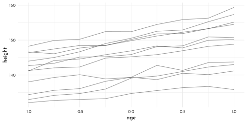

## {brms} section

### Varying Slopes by Construction

**The varying slopes model**

> As it turns out, the shape of the LKJ is sensitive to both $\eta$ and the $K$ dimensions of the correlation matrix. Our simulations only considered the shapes for when $K=2$. We can use a combination of the `parse_dist()` and `stat_dist_halfeye()` functions from the __tidybayes__ package to derive analytic solutions for different combinations of $\eta$ and $K$.


```r
library(tidybayes)
crossing(k   = 2:5,
         eta = 1:4) %>% 
  mutate(prior = str_c("lkjcorr_marginal(", k, ", ", eta, ")"),
         strip = str_c("K = ", k)) %>% 
  parse_dist(prior) %>%
  ggplot(aes(y = eta, dist = .dist, args = .args)) +
  stat_dist_halfeye(.width = c(.5, .95),
                    color = clr_dark,
                    fill = clr0) +
  scale_x_continuous(expression(rho), limits = c(-1, 1),
                     breaks = c(-1, -.5, 0, .5, 1), labels = c("-1", "-.5", "0", ".5", "1")) +
  scale_y_continuous(glue("*{mth('\U03B7')}*"), breaks = 1:4) +
  labs(subtitle = glue("Marginal correlation for the LKJ prior relative to K and *{mth('\U03B7')}*")) +
  facet_wrap(~ strip, ncol = 4) +
  theme(axis.title.y = element_markdown(),
        plot.subtitle = element_markdown(),
        panel.grid = element_blank(),
        panel.border = element_rect(fill = "transparent",
                                    color = clr0d))
```

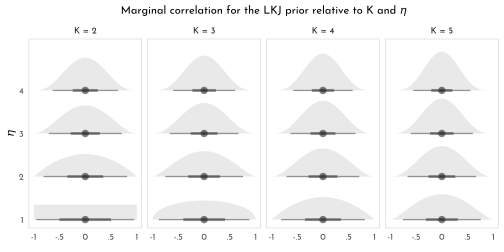


```r
brms_c14_model_cafe <- brm(
  data = data_cafe, 
  family = gaussian,
  waiting_time ~ 1 + afternoon + (1 + afternoon | cafe),
  prior = c(prior(normal(5, 2), class = Intercept),
            prior(normal(-1, 0.5), class = b),
            prior(exponential(1), class = sd),
            prior(exponential(1), class = sigma),
            prior(lkj(2), class = cor)),
  iter = 2000, warmup = 1000,
  chains = 4, cores = 4,
  seed = 42,
  file = "brms/brms_c14_model_cafe")

brms_cafe_posterior <- as_draws_df(brms_c14_model_cafe) %>% 
  as_tibble()

r_2 <-  rlkjcorr(1e4, K = 2, eta = 2) %>%
  as_tibble()

brms_cafe_posterior %>%
  ggplot() +
  geom_density(data = r_2,
               aes(x = V2,
                   color = "prior",
                   fill = after_scale(clr_alpha(color))),
               adjust = .7) +
  geom_density(aes(x = cor_cafe__Intercept__afternoon,
                   color = "posterior", 
                   fill = after_scale(clr_alpha(color))),
               adjust = .7) +
  scale_y_continuous(NULL, breaks = NULL) +
  scale_color_manual("",values = c(clr_dark, clr0d))+
  labs(subtitle = "Correlation between intercepts\nand slopes, prior and posterior",
       x = "correlation")+
  theme(legend.position = c(1,1),
        legend.justification = c(1,1),
        legend.direction = "horizontal")
```

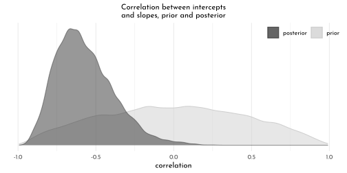


```r
# we select each of the 20 cafe's posterior mean (i.e., Estimate)
# for both `Intercept` and `afternoon`
partially_pooled_params <- coef(brms_c14_model_cafe)$cafe[ , 1, 1:2] %>%
  as_tibble() %>%
  rename(Slope = afternoon) %>%
  mutate(cafe = 1:nrow(.)) %>%
  dplyr::select(cafe, everything())

un_pooled_params <- data_cafe %>%
  group_by(afternoon, cafe) %>%
  summarise(mean = mean(waiting_time)) %>%
  ungroup() %>%
  mutate(afternoon = ifelse(afternoon == 0, "Intercept", "Slope")) %>%
  pivot_wider(names_from = afternoon, values_from = mean) %>%
  mutate(Slope = Slope - Intercept) 

params <-  bind_rows(partially_pooled_params, un_pooled_params) %>%
  mutate(pooled = rep(c("partially", "not"), each = nrow(.)/2))

# preview
params %>%
  slice(c(1:5, 36:40))
```

```
#> # A tibble: 10 × 4
#>     cafe Intercept  Slope pooled   
#>    <int>     <dbl>  <dbl> <chr>    
#>  1     1      2.71 -0.865 partially
#>  2     2      4.10 -0.524 partially
#>  3     3      3.23 -1.10  partially
#>  4     4      2.51 -1.02  partially
#>  5     5      2.64 -0.960 partially
#>  6    16      3.09 -0.486 not      
#>  7    17      3.85 -0.699 not      
#>  8    18      6.03 -1.27  not      
#>  9    19      6.23 -1.48  not      
#> 10    20      2.36 -0.650 not
```

```r
p1 <- ggplot(data = params, aes(x = Intercept, y = Slope)) +
  coord_cartesian(xlim = range(params$Intercept),
                  ylim = range(params$Slope))

partially_pooled_estimates <- coef(brms_c14_model_cafe)$cafe[ , 1, 1:2] %>%
  as_tibble() %>%
  rename(morning = Intercept) %>%
  mutate(afternoon = morning + afternoon,
         cafe      = 1:n()) %>%
  dplyr::select(cafe, everything()) 

un_pooled_estimates <- data_cafe %>%
  group_by(afternoon, cafe) %>% 
  summarise(mean = mean(waiting_time)) %>%
  ungroup() %>% 
  mutate(afternoon = ifelse(afternoon == 0, "morning", "afternoon")) %>%
  pivot_wider(names_from = afternoon, values_from = mean)

estimates <- bind_rows(partially_pooled_estimates, un_pooled_estimates) %>%
  mutate(pooled = rep(c("partially", "not"), each = n() / 2))

p2 <- ggplot(data = estimates, aes(x = morning, y = afternoon)) +
  coord_cartesian(xlim = range(estimates$morning),
                  ylim = range(estimates$afternoon)) 


p1 + p2 + 
  plot_annotation(title = "Shrinkage in two dimensions") +
  plot_layout(guides = "collect") &
    ( (c(1:9, 9.9)/10) %>% purrr::map(.f = function(lvl){
     stat_ellipse(geom = "polygon", 
                  type = "norm", 
                  level = lvl,linetype = 3,
                  size = .2,
                  alpha = .05,
                  color = "black",
                  fill = "black") 
   }) ) &
    geom_line(aes(group = cafe), size = .3) &
  geom_point(aes(group = cafe, fill = pooled),
             shape = 21, size = 2) &
  scale_fill_manual("Pooled?", values = c(clr_dark, clr0))  &
  theme(legend.position = "bottom")
```

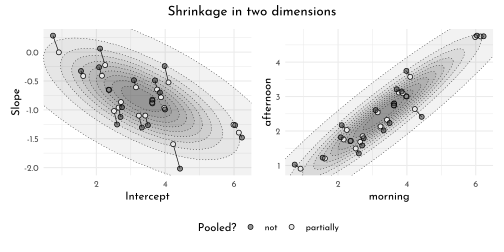

### Advanced varying slopes


```r
data_chimp_f <- data_chimp %>% 
  dplyr::select(pulled_left, treatment, actor, block) %>% 
  mutate(across(-pulled_left, factor))

brms_c14_model_chimp_non_centered <- brm(
  data = data_chimp_f, 
  family = binomial,
  pulled_left | trials(1) ~ 0 + treatment + (0 + treatment | actor) + (0 + treatment | block),
  prior = c(prior(normal(0, 1), class = b),
            prior(exponential(1), class = sd, group = actor),
            prior(exponential(1), class = sd, group = block),
            prior(lkj(2), class = cor, group = actor),
            prior(lkj(2), class = cor, group = block)),
  iter = 2000, warmup = 1000,
  chains = 4, cores = 4,  
  seed = 42,
  file = "brms/brms_c14_model_chimp_non_centered")

library(bayesplot)
as_draws_df(brms_c14_model_chimp_non_centered,
            add_chain = TRUE) %>% 
  as_tibble() %>% 
  dplyr::select(b_treatment1:`cor_block__treatment3__treatment4`,
                chain = `.chain`) %>% 
  mcmc_rank_overlay(n_bins = 30) +
  scale_color_manual(values = clr_chains()) +
  scale_x_continuous(breaks = 0:4 * 1e3,
                     labels = c(0, str_c(1:4, "K"))) +
  coord_cartesian(ylim = c(15, 50)) +
  theme(legend.position = "bottom") +
  facet_wrap(~ parameter, ncol = 4)
```

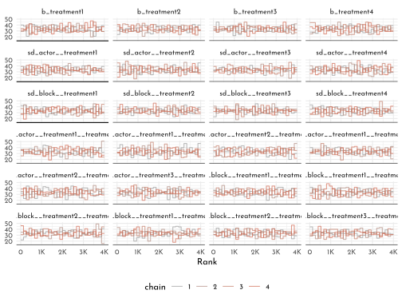


```r
library(posterior)

as_draws_df(brms_c14_model_chimp_non_centered) %>% 
  summarise_draws() %>% 
  pivot_longer(starts_with("ess")) %>% 
  ggplot(aes(x = value)) +
  geom_histogram(binwidth = 250,
                 color = clr0dd, fill = clr0) +
  xlim(0, NA) +
  facet_wrap(~ name)
```

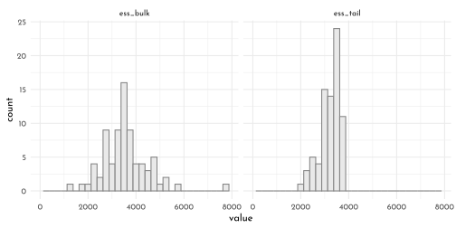


```r
brms_c14_model_chimp_non_centered <- add_criterion(brms_c14_model_chimp_non_centered, "waic")

waic(brms_c14_model_chimp_non_centered)
```

```
#> 
#> Computed from 4000 by 504 log-likelihood matrix
#> 
#>           Estimate   SE
#> elpd_waic   -272.6  9.9
#> p_waic        27.1  1.4
#> waic         545.1 19.7
#> 
#> 1 (0.2%) p_waic estimates greater than 0.4. We recommend trying loo instead.
```


```r
new_chimps <- data_chimp_f %>% 
  distinct(actor, treatment) %>% 
  mutate(block = 5L)

# compute and wrangle the posterior predictions
fitted(brms_c14_model_chimp_non_centered,
       newdata = new_chimps) %>% 
  as_tibble() %>% 
  bind_cols(new_chimps) %>% 
  # add the empirical proportions
  left_join(
    data_chimp_f %>%
      group_by(actor, treatment) %>%
      mutate(proportion = mean(pulled_left)) %>% 
      distinct(actor, treatment, proportion),
    by = c("actor", "treatment")
  ) %>% 
  mutate(labels = factor(treatment_labels[treatment], levels = treatment_labels[1:4]),
         prosoc_left = factor(as.numeric(grepl("L", as.character(labels)))),
         condition = factor(as.numeric(grepl("P", as.character(labels))))) %>% 
  ggplot(aes(x = labels))+
  geom_hline(yintercept = .5, color = clr_dark, size = .4, linetype = 3) +
  # empirical proportions
  geom_line(aes(y = proportion, group = prosoc_left),
            size = 1/4, color = clr0d) +
  geom_point(aes(y = proportion, shape = condition),
             color = clr0d, fill = clr0, size = 2) + 
  # posterior predictions
  geom_line(aes(y = Estimate, group = prosoc_left),
            size = 3/4, color = clr_dark) +
  geom_pointrange(aes(y = Estimate, ymin = Q2.5, ymax = Q97.5, shape = condition),
                  color = clr_dark, fill = "white",
                  fatten = 5, size = 1/3) +
  scale_shape_manual(values = c(21, 19)) +
  scale_x_discrete(NULL, breaks = NULL) +
  scale_y_continuous("proportion left lever", 
                     breaks = 0:2 / 2, labels = c("0", ".5", "1")) +
  facet_wrap(~ actor, nrow = 1, labeller = label_both)  +
  labs(subtitle = "Posterior predictions, in dark gray, against the raw data, in light gray, for\nmodel brms_c14_model_chimp_non_centered, the cross-classified varying effects model.") +
  theme(legend.position = "none",
        panel.border = element_rect(fill = "transparent",
                                    color = clr0d))
```

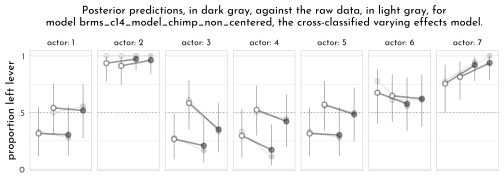

### Instruments and Causal Designs


```r
brms_c14_model_edu_confound <- brm(
  data = data_edu_sim,
  family = gaussian,
  w_std ~ 1 + e_std,
  prior = c(prior(normal(0, 0.2), class = Intercept),
            prior(normal(0, 0.5), class = b),
            prior(exponential(1), class = sigma)),
  iter = 2000, warmup = 1000,
  chains = 4, cores = 4,  
  seed = 42,
  file = "brms/brms_c14_model_edu_confound")

mixedup::extract_fixef(brms_c14_model_edu_confound,
                       ci_level = .89)
```

```
#> # A tibble: 2 × 5
#>   term      value    se lower_5.5 upper_94.5
#>   <chr>     <dbl> <dbl>     <dbl>      <dbl>
#> 1 Intercept 0     0.041    -0.066      0.065
#> 2 e_std     0.346 0.042     0.278      0.414
```

```r
brms_c14_model_edu_bias_amplified <- brm(
  data = data_edu_sim,
  family = gaussian,
  w_std ~ 1 + e_std + q_std,
  prior = c(prior(normal(0, 0.2), class = Intercept),
            prior(normal(0, 0.5), class = b),
            prior(exponential(1), class = sigma)),
  iter = 2000, warmup = 1000,
  chains = 4, cores = 4,  
  seed = 42,
  file = "brms/brms_c14_model_edu_bias_amplified")

mixedup::extract_fixef(brms_c14_model_edu_bias_amplified,
                       ci_level = .89)
```

```
#> # A tibble: 3 × 5
#>   term       value    se lower_5.5 upper_94.5
#>   <chr>      <dbl> <dbl>     <dbl>      <dbl>
#> 1 Intercept -0.001 0.039    -0.062      0.061
#> 2 e_std      0.597 0.053     0.513      0.68 
#> 3 q_std     -0.381 0.053    -0.465     -0.298
```

```r
e_std_model <- bf(e_std ~ 1 + q_std)
w_std_model <- bf(w_std ~ 1 + e_std)

brms_c14_model_edu_multivariate <- brm(
  data = data_edu_sim, 
  family = gaussian,
  e_std_model + w_std_model + set_rescor(TRUE),
  prior = c(# E model
    prior(normal(0, 0.2), class = Intercept, resp = estd),
    prior(normal(0, 0.5), class = b, resp = estd),
    prior(exponential(1), class = sigma, resp = estd),
    
    # W model
    prior(normal(0, 0.2), class = Intercept, resp = wstd),
    prior(normal(0, 0.5), class = b, resp = wstd),
    prior(exponential(1), class = sigma, resp = wstd),
    
    # rho
    prior(lkj(2), class = rescor)),
  iter = 2000, warmup = 1000, 
  chains = 4, cores = 4,
  seed = 42,
  file = "brms/brms_c14_model_edu_multivariate")

mixedup::extract_fixef(brms_c14_model_edu_multivariate,
                       ci_level = .89)
```

```
#> # A tibble: 4 × 5
#>   term            value    se lower_5.5 upper_94.5
#>   <chr>           <dbl> <dbl>     <dbl>      <dbl>
#> 1 estd_Intercept -0.001 0.034    -0.054      0.053
#> 2 wstd_Intercept -0.001 0.043    -0.072      0.07 
#> 3 estd_q_std      0.66  0.034     0.606      0.715
#> 4 wstd_e_std      0.018 0.067    -0.087      0.123
```


```r
brms_c14_model_edu_confound_2 <- update(
  brms_c14_model_edu_confound,
  newdata = data_edu_sim_2,
  iter = 2000, warmup = 1000,
  chains = 4, cores = 4,  
  seed = 42,
  file = "brms/brms_c14_model_edu_confound_2")

brms_c14_model_edu_multivariate_2 <- update(
  brms_c14_model_edu_multivariate,
  newdata = data_edu_sim_2,
  iter = 2000, warmup = 1000,
  chains = 4, cores = 4,  
  seed = 42,
  file = "brms/brms_c14_model_edu_multivariate_2")

bind_rows(
  posterior_summary(brms_c14_model_edu_confound_2)[1:3, ] %>% 
    as_tibble() %>% 
    mutate(param = c("alpha[W]", "beta[EW]", "sigma[W]"),
           fit = "confound_2"),
  posterior_summary(brms_c14_model_edu_multivariate_2)[1:7, ] %>%  
    as_tibble() %>% 
    mutate(param = c("alpha[E]", "alpha[W]", "beta[QE]", "beta[EW]", "sigma[E]", "sigma[W]", "rho"),
           fit = "multivariate_2")) %>% 
  mutate(param = factor(param,
                        levels = c("rho", "sigma[W]", "sigma[E]", "beta[EW]", "beta[QE]", "alpha[W]", "alpha[E]"))) %>%
  ggplot(aes(x = param, y = Estimate, color = fit)) +
  geom_hline(yintercept = 0, linetype = 3,
             color = clr_dark, size = .4) +
  geom_pointrange(aes(ymin = Q2.5, ymax = Q97.5),
                  fatten = 2,
                  position = position_dodge(width = 0.5)) +
  scale_color_manual(NULL, values = c(clr_dark, clr0d)) +
  scale_x_discrete(NULL) +
  ylab("marginal posterior") +
  coord_flip() +
  theme(axis.text.y = element_text(hjust = 0),
        axis.ticks.y = element_blank(),
        legend.position = "bottom")
```

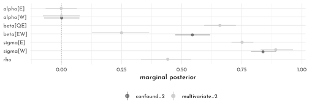

###  Social Relations as Correlated Varying Effects

> *It looks like __brms__ is not set up to fit a model like this, at this time. See the [Social relations model (SRM) thread](https://discourse.mc-stan.org/t/social-relations-model-srm/17121) on the Stan Forums and [issue #502](https://github.com/paul-buerkner/brms/issues/502) on the __brms__ GitHub repo for details. In short, the difficulty is __brms__     is not set up to allow covariances among distinct random effects with the same levels and it looks like this will not change any time soon.*


```r
data_dyads %>% 
  ggplot(aes(x = hidA, y = hidB, label = did)) +
  geom_tile(aes(fill = did,
                color = after_scale(clr_darken(fill))),
            show.legend = FALSE, size = .1) +
  geom_text(size = 2.25, family = fnt_sel) +
  scale_fill_gradient(low = clr0, high = clr_lighten(clr_current,.4),
                      limits = c(1, NA)) +
  scale_x_continuous(breaks = 1:24, expand = c(0,0)) +
  scale_y_continuous(breaks = 2:25, expand = c(0,0)) +
  labs(subtitle = "dyad ids") +
  theme(axis.text = element_text(size = 9),
        axis.ticks = element_blank(),
        panel.grid.major = element_blank())
```

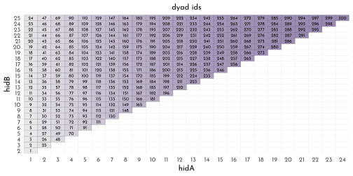


```r
tibble(`sigma_g` = dyad_posterior$sigma_gr[, 1],
       `sigma_r` = dyad_posterior$sigma_gr[, 2],
       `rho_g_r` = dyad_posterior$Rho_gr[, 2, 1]) %>% 
  pivot_longer(everything()) %>% 
  ggplot(aes(x = value, y = name)) +
  geom_vline(xintercept = 0, color = clr_dark, linetype = 3) +
  stat_halfeye(aes( slab_color = name,
                    slab_fill = after_scale(clr_alpha(slab_color)),
                    point_fill = after_scale(slab_color)),
               slab_size = .7,
               .width = .89, color = "black",
               height = 1.5,
               interval_size = .4,
               shape = 21, point_size = 2) + 
  scale_discrete_manual(aesthetics = "slab_color",
                        values = c(clr0, clr_dark, clr_current)) +
  scale_y_discrete(NULL) +
  xlab("marginal posterior") +
  coord_cartesian(ylim = c(1.5, 3.9)) +
  theme(legend.position = "none")
```

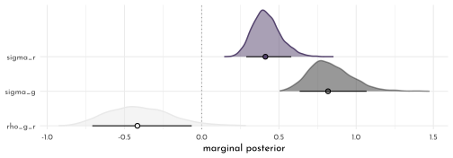


```r
tibble(`sigma_d` = dyad_posterior$sigma_d,
       `rho_d`   = dyad_posterior$Rho_d[, 2, 1]) %>% 
  pivot_longer(everything()) %>% 
  
  ggplot(aes(x = value, y = name, fill = name)) +
  geom_vline(xintercept = 0, color = clr_dark, linetype = 3) +
  stat_halfeye(aes( slab_color = name,
                    slab_fill = after_scale(clr_alpha(slab_color)),
                    point_fill = after_scale(slab_color)),
               slab_size = .7,
               .width = .89, color = "black",
               interval_size = .4,
               shape = 21, point_size = 2) + 
  scale_discrete_manual(aesthetics = "slab_color",
                        values = c(clr0, clr_dark, clr_current)) +
  scale_y_discrete(NULL) +
  xlab("marginal posterior") +
  coord_cartesian(ylim = c(1.5, 2)) +
  theme(legend.position = "none")
```

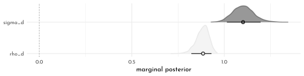

### Continuous Categories and the Gaussian Process

**Spatial autocorrelation in Oceanic tools**


```r
islandsDistMatrix %>%
  data.frame() %>% 
  rownames_to_column("row") %>% 
  pivot_longer(names_to = "column", values_to = "distance", -row) %>% 
  mutate(column = str_replace_all(column, "\\.", " "),
         column = factor(column, levels = colnames(islandsDistMatrix)),
         row    = factor(row,    levels = rownames(islandsDistMatrix)) %>% fct_rev(),
         label  = formatC(distance, format = 'f', digits = 2)) %>%
  ggplot(aes(x = column, y = row)) + 
  geom_tile(aes(fill = distance)) + 
  geom_text(aes(label = label),
            size = 3, family = fnt_sel, color = "#100F14") +
  scale_fill_gradient(low = clr0, high = clr_lighten(clr_current,.3)) +
  scale_x_discrete(NULL, position = "top", expand = c(0, 0)) +
  scale_y_discrete(NULL, expand = c(0, 0)) +
  guides(fill = guide_colorbar(barwidth = unit(7, "pt"))) +
  theme(axis.ticks = element_blank())
```

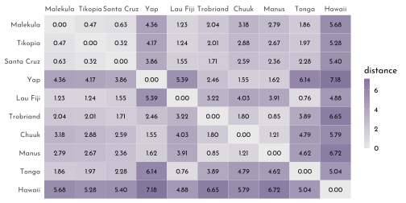

> 👋 *__Heads up__: The __brms__ package is capable of handling a variety of Gaussian process models using the gp() function. As we will see throughout this section, this method will depart in important ways from how McElreath fits Gaussian process models with __rethinking__. Due in large part to these differences, this section and its analogue in the first edition of Statistical rethinking (McElreath, 2015) baffled me, at first. Happily, fellow enthusiasts Louis Bliard and Richard Torkar reached out and helped me hammer this section out behind the scenes. The method to follow is due in large part to their efforts.* 🤝
>
> *The `brms::gp()` function takes a handful of arguments. The first and most important argument, `...`, accepts the names of one or more predictors from the data. When fitting a spatial Gaussian process of this kind, we’ll enter in the latitude and longitude data for each of levels of culture. This will be an important departure from the text. For his `m14.8`, McElreath directly entered in the `Dmat` distance matrix data into `ulam()`. In so doing, he defined $D_{ij}$, the matrix of distances between each of the societies. When using __brms__, we instead estimate the distance matrix from the latitude and longitude variables.*
>
> *Before we practice fitting a Gaussian process with the `brms::gp()` function, we’ll first need to think a little bit about our data. McElreath’s `Dmat` measured the distances in thousands of km. However, the `lat` and `lon2` variables in the data above are in decimal degrees, which means they need to be transformed to keep our model in the same metric as McElreath’s. Turns out that one decimal degree is 111.32km (at the equator). Thus, we can turn both `lat` and `lon2` into 1,000 km units by multiplying each by 0.11132. Here’s the conversion.*


```r
(data_kline_brms <- data_kline %>% 
  mutate(lat_adj  = lat  * 0.11132,
         lon2_adj = lon2 * 0.11132)) %>% 
  dplyr::select(culture, lat, lon2, lat_adj:lon2_adj)
```

```
#> # A tibble: 10 × 5
#>    culture      lat   lon2 lat_adj lon2_adj
#>    <fct>      <dbl>  <dbl>   <dbl>    <dbl>
#>  1 Malekula   -16.3 -12.5   -1.81    -1.39 
#>  2 Tikopia    -12.3 -11.2   -1.37    -1.25 
#>  3 Santa Cruz -10.7 -14     -1.19    -1.56 
#>  4 Yap          9.5 -41.9    1.06    -4.66 
#>  5 Lau Fiji   -17.7  -1.90  -1.97    -0.212
#>  6 Trobriand   -8.7 -29.1   -0.968   -3.24 
#>  7 Chuuk        7.4 -28.4    0.824   -3.16 
#>  8 Manus       -2.1 -33.1   -0.234   -3.68 
#>  9 Tonga      -21.2   4.80  -2.36     0.534
#> 10 Hawaii      19.9  24.4    2.22     2.72
```

> *Note that because this conversion is valid __at the equator__, it is only an approximation for latitude and longitude coordinates for our island societies.*
>
> *Now we’ve scaled our two spatial variables, the basic way to use them in a __brms__ Gaussian process is including `gp(lat_adj, lon2_adj)` into the formula argument within the `brm()` function. Note however that one of the default `gp()` settings is `scale = TRUE`, which scales predictors so that the maximum distance between two points is 1. We don’t want this for our example, so we will set `scale = FALSE` instead.*
>
> *Our Gaussian process model is an extension of the non-linear model from Section 11.2.1.1, `b11.11`. Thus our model here will also use the non-linear syntax. Here’s how we might use __brms__ to fit our amended non-centered version of McElreath’s `m14.8`.*


```r
brms_c14_model_island_distance <- brm(
  data = data_kline_brms, 
  family = poisson(link = "identity"),
  bf(total_tools ~ exp(alpha) * population ^ beta / gamma,
     alpha ~ 1 + gp(lat_adj, lon2_adj, scale = FALSE),
     beta + gamma ~ 1,
     nl = TRUE),
  prior = c(prior(normal(0, 1), nlpar = alpha),
            prior(exponential(1), nlpar = beta, lb = 0),
            prior(exponential(1), nlpar = gamma, lb = 0),
            prior(inv_gamma(2.874624, 2.941204), 
                  class = lscale, coef = gplat_adjlon2_adj, nlpar = alpha),
            prior(exponential(1), 
                  class = sdgp, coef = gplat_adjlon2_adj, nlpar = alpha)),
  iter = 2000, warmup = 1000,
  chains = 4, cores = 4,
  seed = 42,
  sample_prior = TRUE,
  file = "brms/brms_c14_model_island_distance")

posterior_summary(brms_c14_model_island_distance)[1:15, ] %>%
  round(digits = 2)
```

$$\begin{bmatrix} 0.33 &0.86 &-1.41 &1.96 &0.26 &0.08 &0.1 &0.43 &0.67 &0.64 &0.05 &2.45 &0.47 &0.29 &0.16 \\1.22 &1.62 &0.89 &0.5 &3.82 &-0.47 &0.74 &-1.96 &0.91 &0.44 &0.85 &-1.24 &2.12 &-0.6 &0.74 \\-1.96 &1.02 &0.99 &0.68 &-0.26 &2.38 &0.26 &0.75 &-1.17 &1.73 &-1.06 &0.77 &-2.63 &0.44 &0.17 \\0.71 &-1.32 &1.55 &-0.21 &0.87 &-1.94 &1.57 &0.42 &0.92 &-1.51 &2.12 &-0.4 &0.8 &-1.97 &1.14 \\ \end{bmatrix}$$

```r
fixef(brms_c14_model_island_distance, 
      probs = c(.055, .945))["alpha_Intercept", c(1, 3:4)] %>% 
  exp() %>% 
  round(digits = 2)
```

```
#> Estimate     Q5.5    Q94.5 
#>     1.40     0.34     5.30
```

> *Our Gaussian process parameters are different from McElreath’s. From the `gp` section of the __brms__ [reference manual](https://cran.r-project.org/package=brms/brms.pdf) (Bürkner, 2021i), we learn the __brms__ parameterization follows the form*
>
> $$k(x_{i},x_{j})=sdgp^{2}~\textrm{exp}\left(−||x_{i}−x_{j}||^{2}/(2~lscale^{2})\right)$$
>
> *where $k(x_{i},x_{j})$ is the same as McElreath’s $K_{ij}$ and $||xi−xj||^{2}$ is the Euclidean distance, the same as McElreath’s $D_{ij}^{2}$. Thus we could also express the __brms__ parameterization as*
> 
> $$K_{ij} = sdgp^{2}~\textrm{exp}\left(−D_{ij}^{2}/(2lscale^{2})\right)$$
>
> *which is much closer to McElreath’s*
>
> $$K_{ij} = \eta^{2}~ \textrm{exp}(−\rho^{2}~D_{ij}^{2})+\delta_{ij}~\sigma^{2}$$
>
> *On page 470, McElreath explained that the final $\delta_{ij}~\sigma^{2}$ term is mute with the Oceanic societies data. Thus we won’t consider it further. This reduces McElreath’s equation to*
>
> $$K_{ij} = \eta^{2}~ \textrm{exp}(−\rho^{2}~D_{ij}^{2})$$
>
> *Importantly, what McElreath called $\eta$, Bürkner called $sdgp$. While McElreath estimated $\eta^{2}$, __brms__ simply estimated $sdgp$. So we’ll have to square our `sdgp(alpha_gplat_adjlon2_adj)` before it’s on the same scale as `etasq` in the text. Here it is.*


```r
island_dist_posterior_brms <- as_draws_df(brms_c14_model_island_distance) %>% 
  mutate(etasq = sdgp_alpha_gplat_adjlon2_adj^2)

island_dist_posterior_brms %>% 
  mean_hdi(etasq, .width = .89) %>% 
  mutate_if(is.double, round, digits = 3)
```

```
#> # A tibble: 1 × 6
#>   etasq .lower .upper .width .point .interval
#>   <dbl>  <dbl>  <dbl>  <dbl> <chr>  <chr>    
#> 1 0.306  0.005   0.61   0.89 mean   hdi
```

> *Though our posterior is a little bit larger than McElreath’s, we’re in the ballpark. You may have noticed that in our model `brm()` code, above, we just went with the flow and kept the `exponential(1)` prior on $sdgp$. The __brms__ default would have been `student_t(3, 0, 15.6)`.*
>
> *Now look at the denominator of the inner part of Bürkner’s equation, $2lscale^{2}$. This appears to be the __brms__ equivalent to McElreath’s $\rho^{2}$. Or at least it’s what we’ve got. Anyway, also note that McElreath estimated $\rho^{2}$ directly as `rhosq`. If I’m doing the algebra correctly, we might expect*
>
> $$\begin{array}{rclr}\rho^{2} & = & 1 / (2 \times lscale ^2)& \textrm{and thus}\\lscale & = & \sqrt{1 / (2 \times \rho^{2})}\end{array}$$
>
> *To get a sense of this relationship, it might be helpful to plot.*


```r
p1 <- tibble(`rho^2` = seq(from = 0, to = 11, by = 0.01)) %>% 
  mutate(lscale = sqrt(1 / (2 * `rho^2`))) %>%
  ggplot(aes(x = `rho^2`, y = lscale)) +
  geom_hline(yintercept = 0, color = clr_dark, linetype = 3) +
  geom_vline(xintercept = 0, color = clr_dark, linetype = 3) +
  geom_line(color = clr0d) +
  xlab("rho<sup>2</sup>") +
  coord_cartesian(xlim = c(0, 10),
                  ylim = c(0, 10))

p2 <- tibble(lscale = seq(from = 0, to = 11, by = 0.01)) %>% 
  mutate(`rho^2` = 1 / (2 * lscale^2)) %>%
  ggplot(aes(x = lscale, y = `rho^2`)) +
  geom_hline(yintercept = 0, color = clr_dark, linetype = 3) +
  geom_vline(xintercept = 0, color = clr_dark, linetype = 3) +
  geom_line(color = clr_dark) +
  ylab("rho<sup>2</sup>") +
  coord_cartesian(xlim = c(0, 10),
                  ylim = c(0, 10))

p1 + p2 & theme(axis.title.x = element_markdown(),
                axis.title.y = element_markdown())
```

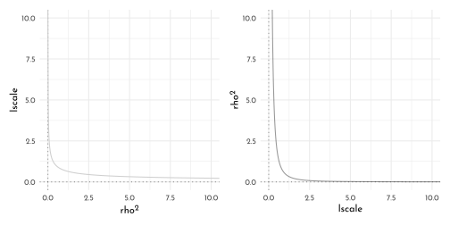

> *The two aren’t quite inverses of one another, but the overall pattern is when one is large, the other is small. Now we have a sense of how they compare and how to covert one to the other, let’s see how our posterior for $lscale$ looks when we convert it to the scale of McElreath’s $\rho^{2}$.*


```r
island_dist_posterior_brms <- island_dist_posterior_brms %>% 
  mutate(rhosq = 1 / (2 * lscale_alpha_gplat_adjlon2_adj^2))

island_dist_posterior_brms %>% 
  mean_hdi(rhosq, .width = .89) %>% 
  mutate_if(is.double, round, digits = 3)
```

```
#> # A tibble: 1 × 6
#>   rhosq .lower .upper .width .point .interval
#>   <dbl>  <dbl>  <dbl>  <dbl> <chr>  <chr>    
#> 1 0.435  0.008  0.923   0.89 mean   hdi
```

> *This is about a third of the size of the McElreath’s $\rho^{2} = 1.31,~89\%~ \textrm{HDI}~[0.08,4.41]$. The plot deepens. If you look back, you’ll see we used a very different prior for $lscale$. Here it is: `inv_gamma(2.874624, 2.941204)`. Use `get_prior()` to discover where that came from.*


```r
get_prior(data = data_kline_brms, 
          family = poisson(link = "identity"),
          bf(total_tools ~ exp(alpha) * population ^ beta / gamma,
             alpha  ~ 1 + gp(lat_adj, lon2_adj, scale = FALSE),
             beta + gamma ~ 1,
             nl = TRUE))
```

```
#>                          prior  class              coef group resp dpar nlpar
#>                         (flat)      b                                   alpha
#>                         (flat)      b         Intercept                 alpha
#>                         (flat) lscale                                   alpha
#>  inv_gamma(2.874624, 2.941204) lscale gplat_adjlon2_adj                 alpha
#>          student_t(3, 0, 15.6)   sdgp                                   alpha
#>          student_t(3, 0, 15.6)   sdgp gplat_adjlon2_adj                 alpha
#>                         (flat)      b                                    beta
#>                         (flat)      b         Intercept                  beta
#>                         (flat)      b                                   gamma
#>                         (flat)      b         Intercept                 gamma
#>  bound       source
#>             default
#>        (vectorized)
#>             default
#>             default
#>             default
#>        (vectorized)
#>             default
#>        (vectorized)
#>             default
#>        (vectorized)
```

> *That is, we used the __brms__ default prior for $lscale$. In a [GitHub exchange](https://github.com/ASKurz/Statistical_Rethinking_with_brms_ggplot2_and_the_tidyverse/issues/8), Bürkner pointed out that __brms__ uses special priors for $lscale$ parameters based on Michael Betancourt’s (2017) vignette, [Robust Gaussian processes in Stan](https://betanalpha.github.io/assets/case_studies/gp_part3/part3.html). We can use the `dinvgamma()` function from the well-named [__invgamma__ package](https://cran.r-project.org/web/packages/invgamma/index.html) (Kahle & Stamey, 2017) to get a sense of what that prior looks like.*


```r
tibble(lscale = seq(from = 0.01, to = 9, by = 0.01)) %>% 
  mutate(density = invgamma::dinvgamma(lscale, 2.874624, 2.941204)) %>% 
  ggplot(aes(x = lscale, y = density)) +
  geom_area(color = clr0dd, fill = fll0) +
  annotate(geom = "text", 
           x = 4.75, y = 0.75,
           label = "inverse gamma(2.87, 2.94)",
           family = fnt_sel) +
  scale_y_continuous(NULL, breaks = NULL) +
  coord_cartesian(xlim = c(0, 8))
```

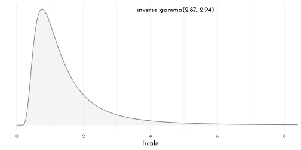

> *Anyways, let’s make the subplots for our version of Figure 14.11 to get a sense of what this all means. Start with the left panel, the prior predictive distribution for the covariance.*


```r
set.seed(42)

p1 <- prior_draws(brms_c14_model_island_distance) %>%
  as_tibble() %>% 
  mutate(iter  = 1:n(),
         etasq = sdgp_alpha_gplat_adjlon2_adj^2,
         rhosq = 1 / (2 * lscale_alpha_1_gplat_adjlon2_adj^2)) %>% 
  slice_sample(n = 100) %>% 
  tidyr::expand(nesting(iter, etasq, rhosq),
         x = seq(from = 0, to = 10, by = .05)) %>% 
  mutate(covariance = etasq * exp(-rhosq * x^2)) %>% 
  ggplot(aes(x = x, y = covariance)) +
  geom_line(aes(group = iter),
            size = 1/4, color = clr_dark) +
  scale_x_continuous("distance (thousand km)", expand = c(0, 0),
                     breaks = 0:5 * 2) +
  coord_cartesian(xlim = c(0, 10),
                  ylim = c(0, 2)) +
  labs(subtitle = "Gaussian process prior")

p2 <-
  island_dist_posterior_brms %>% 
  transmute(iter  = 1:n(),
            etasq = sdgp_alpha_gplat_adjlon2_adj^2,
         rhosq = 1 / (2 * lscale_alpha_gplat_adjlon2_adj^2)) %>% 
  slice_sample(n = 50) %>% 
  tidyr::expand(nesting(iter, etasq, rhosq),
         x = seq(from = 0, to = 10, by = .05)) %>% 
  mutate(covariance = etasq * exp(-rhosq * x^2)) %>% 
  ggplot(aes(x = x, y = covariance)) +
  geom_line(aes(group = iter),
            size = 1/4, color = clr_dark) +
  stat_function(fun = function(x){
    mean(island_dist_posterior_brms$sdgp_alpha_gplat_adjlon2_adj) ^ 2 *
                  exp(-(1 / (2 * mean(island_dist_posterior_brms$lscale_alpha_gplat_adjlon2_adj)^2)) * x^2)
    },
                color = clr_dark, size = 1) +
  scale_x_continuous("distance (thousand km)", expand = c(0, 0),
                     breaks = 0:5 * 2) +
  coord_cartesian(xlim = c(0, 10),
                  ylim = c(0, 2)) +
  labs(subtitle = "Gaussian process posterior")

p1 + p2
```

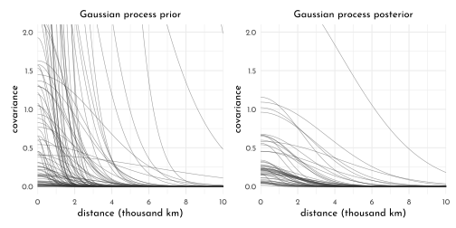

> *Though the Gaussian process parameters from our __brms__ parameterization looked different from McElreath’s, they resulted in a similar decline in spatial covariance.*
>
> *Let’s finish this up and “push the parameters back through the function for K, the covariance matrix”*


```r
k <- matrix(0, nrow = 10, ncol = 10)
for (i in 1:10)
    for (j in 1:10)
        k[i, j] <- median(island_dist_posterior_brms$etasq) * 
  exp(-median(island_dist_posterior_brms$rhosq) * islandsDistMatrix[i, j]^2)

diag(k) <- median(island_dist_posterior_brms$etasq) + 0.01

rho <- round(cov2cor(k), 2)

# add row/col names for convenience
colnames(rho) <- c("Ml", "Ti", "SC", "Ya", "Fi", "Tr", "Ch", "Mn", "To", "Ha")
rownames(rho) <- colnames(rho)

rho %>% round(2) %>% 
  data.frame() %>% 
  knit_precis(param_name = "culture")
```


|culture |   Ml|   Ti|   SC|   Ya|   Fi|   Tr|   Ch|   Mn|   To| Ha|
|:-------|----:|----:|----:|----:|----:|----:|----:|----:|----:|--:|
|Ml      | 1.00| 0.89| 0.85| 0.01| 0.65| 0.34| 0.08| 0.14| 0.40|  0|
|Ti      | 0.89| 1.00| 0.92| 0.01| 0.64| 0.35| 0.12| 0.16| 0.36|  0|
|SC      | 0.85| 0.92| 1.00| 0.02| 0.52| 0.46| 0.18| 0.24| 0.26|  0|
|Ya      | 0.01| 0.01| 0.02| 1.00| 0.00| 0.21| 0.52| 0.49| 0.00|  0|
|Fi      | 0.65| 0.64| 0.52| 0.00| 1.00| 0.07| 0.02| 0.02| 0.81|  0|
|Tr      | 0.34| 0.35| 0.46| 0.21| 0.07| 1.00| 0.42| 0.79| 0.02|  0|
|Ch      | 0.08| 0.12| 0.18| 0.52| 0.02| 0.42| 1.00| 0.65| 0.00|  0|
|Mn      | 0.14| 0.16| 0.24| 0.49| 0.02| 0.79| 0.65| 1.00| 0.00|  0|
|To      | 0.40| 0.36| 0.26| 0.00| 0.81| 0.02| 0.00| 0.00| 1.00|  0|
|Ha      | 0.00| 0.00| 0.00| 0.00| 0.00| 0.00| 0.00| 0.00| 0.00|  1|


```r
rho %>%
  data.frame() %>% 
  mutate(row = data_kline_brms$culture) %>% 
  pivot_longer(-row, values_to = "distance") %>% 
  mutate(column = factor(name, levels = colnames(rho)),
         row    = factor(row, levels = rownames(islandsDistMatrix)) %>% fct_rev(),
         label  = formatC(distance, format = 'f', digits = 2) %>% str_replace(., "0.", ".")) %>%
  # omit this line to keep the diagonal of 1's
  filter(distance != 1) %>% 
  
  ggplot(aes(x = column, y = row)) + 
  geom_tile(aes(fill = distance)) + 
  geom_text(aes(label = label),
            size = 2.75, family = fnt_sel) +
  scale_fill_gradient("rho", low = clr0, high = clr_lighten(clr_current, .3),
                      limits = c(0, 1)) +
  scale_x_discrete(NULL, position = "top", expand = c(0, 0)) +
  scale_y_discrete(NULL, expand = c(0, 0)) +
  guides(fill = guide_colorbar(barwidth = unit(7, "pt"))) +
  theme(axis.ticks = element_blank(),
        panel.grid = element_blank())
```

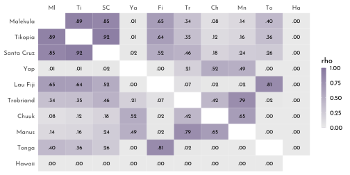

> *As far as I can figure, you still have to get rho into a tidy data frame before feeding it into __ggplot2__. Here’s my attempt at doing so.*


```r
tidy_rho <- rho %>%
  data.frame() %>% 
  rownames_to_column() %>% 
  bind_cols(data_kline_brms %>% dplyr::select(culture, logpop, total_tools, lon2, lat)) %>% 
  pivot_longer(Ml:Ha,
               names_to = "colname", 
               values_to = "correlation") %>%
  mutate(group = str_c(pmin(rowname, colname), pmax(rowname, colname))) %>%
  dplyr::select(rowname, colname, group, culture, everything())  


p1 <- tidy_rho %>%       
  ggplot(aes(x = lon2, y = lat)) +
  geom_line(aes(group = group, alpha = correlation^2),
            color = clr0dd) +
  geom_point(data = data_kline_brms, 
             aes(size = logpop), color = clr0) +
  ggrepel::geom_text_repel(data = data_kline_brms, aes(label = culture), 
                  seed = 14, point.padding = .2, size = 2.75,
                  color = clr0dd, family = fnt_sel) +
  scale_alpha_continuous(range = c(0, 1)) +
  labs(subtitle = "Among societies in geographic space\n",
       x = "longitude",
       y = "latitude") +
  coord_cartesian(xlim = range(data_kline_brms$lon2),
                  ylim = range(data_kline_brms$lat)) +
  theme(legend.position = "none")
 
fit_kline_brms <- island_dist_posterior_brms %>% 
  tidyr::expand(logpop = seq(from = 6, to = 14, length.out = 30),
         nesting(b_alpha_Intercept, b_beta_Intercept, b_gamma_Intercept)) %>%
  mutate(population = exp(logpop)) %>% 
  mutate(lambda = exp(b_alpha_Intercept) * population^b_beta_Intercept / b_gamma_Intercept) %>%
  group_by(logpop) %>% 
  median_qi(lambda, .width = .8)

p2 <- tidy_rho %>% 
  ggplot(aes(x = logpop)) +
  geom_smooth(data = fit_kline_brms,
              aes(y = lambda, ymin = .lower, ymax = .upper),
              stat = "identity",
              fill = fll0, color = clr0d, alpha = .5, size = 1.1) +
  geom_line(aes(y = total_tools, group = group, alpha = correlation^2),
            color = clr0dd) +
  geom_point(data = data_kline_brms, 
             aes(y = total_tools, size = logpop), 
             color = clr0d) +
  ggrepel::geom_text_repel(data = data_kline_brms, 
                  aes(y = total_tools, label = culture), 
                  seed = 14, point.padding = .2, size = 2.75,
                  color = clr_dark, family = fnt_sel) +
  scale_alpha_continuous(range = c(0, 1)) +
  labs(subtitle = "Shown against the relation between\ntotal tools and log pop",
       x = "log population",
       y = "total tools") +
  coord_cartesian(xlim = range(data_kline_brms$logpop),
                  ylim = range(data_kline_brms$total_tools)) +
  theme(legend.position = "none")

p1 + p2 +
  plot_annotation(title = "Posterior median correlations")
```

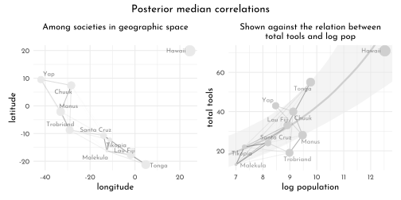

**Dispersion by other names**

> *McElreath remarked it might be a good idea to fit an alternative of this model using the gamma-Poisson likelihood. Let’s take him up on the challenge. Remember that gamma-Poisson models are also referred to as negative binomial models. When using __brms__, you specify this using `family = negbinomial`.*


```r
brms_c14_model_island_distance_gamma_poisson <- brm(
  data = data_kline_brms, 
  family = negbinomial(link = "identity"),
  bf(total_tools ~ exp(alpha) * population ^ beta / gamma,
     alpha  ~ 1 + gp(lat_adj, lon2_adj, scale = FALSE),
     beta + gamma ~ 1,
     nl = TRUE),
  prior = c(prior(normal(0, 1), nlpar = alpha),
            prior(exponential(1), nlpar = beta, lb = 0),
            prior(exponential(1), nlpar = gamma, lb = 0),
            prior(inv_gamma(2.874624, 2.941204), class = lscale,
                  coef = gplat_adjlon2_adj, nlpar = alpha),
            prior(exponential(1), class = sdgp,
                  coef = gplat_adjlon2_adj, nlpar = alpha),
            # default prior
            prior(gamma(0.01, 0.01), class = shape)),
  iter = 2000, warmup = 1000,
  chains = 4, cores = 4,
  seed = 14,
  control = list(adapt_delta = .9),
  file = "brms/brms_c14_model_island_distance_gamma_poisson")
```


```r
brms_c14_model_island_distance <- add_criterion(brms_c14_model_island_distance, "waic")
brms_c14_model_island_distance_gamma_poisson <- add_criterion(brms_c14_model_island_distance_gamma_poisson, "waic")

loo_compare(brms_c14_model_island_distance,
            brms_c14_model_island_distance_gamma_poisson,
            criterion = "waic") %>%
  print(simplify = FALSE)
```

```
#>                                              elpd_diff se_diff elpd_waic
#> brms_c14_model_island_distance                 0.0       0.0   -33.3    
#> brms_c14_model_island_distance_gamma_poisson  -4.0       0.6   -37.3    
#>                                              se_elpd_waic p_waic se_p_waic
#> brms_c14_model_island_distance                 1.3          3.7    0.6    
#> brms_c14_model_island_distance_gamma_poisson   1.8          3.4    0.6    
#>                                              waic  se_waic
#> brms_c14_model_island_distance                66.7   2.6  
#> brms_c14_model_island_distance_gamma_poisson  74.6   3.7
```

> *The WAIC comparison suggests we gain little by switching to the gamma-Poisson. If anything, we may have overfit.*

**Phylogenetic distance**

The naïve model:


```r
data_primates_brms <- data_primates_complete %>% 
  dplyr::select(body_log_std, brain_log_std, group_size_log_std)

brms_c14_model_primates_simple <- brm(
  data = data_primates_brms,
  family = gaussian,
  brain_log_std ~ 1 + body_log_std + group_size_log_std,
  prior = c(prior(normal(0, 1), class = Intercept),
            prior(normal(0, 0.5), class = b),
            prior(exponential(1), class = sigma)),
  iter = 2000, warmup = 1000,
  chains = 4, cores = 4,
  seed = 42,
  file = "brms/brms_c14_model_primates_simple")

as_draws_df(brms_c14_model_primates_simple) %>% 
  mutate(sigma_sq = sigma^2) %>% 
  mean_qi(sigma_sq) %>% 
  mutate_if(is.double, round, digits = 2)
```

```
#> # A tibble: 1 × 6
#>   sigma_sq .lower .upper .width .point .interval
#>      <dbl>  <dbl>  <dbl>  <dbl> <chr>  <chr>    
#> 1     0.05   0.04   0.06   0.95 mean   qi
```

The brownian motion model:


```r
Rho_primates <- var_covar_sorted / max(var_covar_sorted)

brms_14_model_primates_brownian <- brm(
  data = data_primates_brms,
  data2 = list(Rho = Rho_primates),
  family = gaussian,
  brain_log_std ~ 1 + body_log_std + group_size_log_std + fcor(Rho),
  prior = c(prior(normal(0, 1), class = Intercept),
            prior(normal(0, 0.5), class = b),
            prior(exponential(1), class = sigma)),
  iter = 2000, warmup = 1000,
  chains = 4, cores = 4,
  seed = 42,
  file = "brms/brms_14_model_primates_brownian")

as_draws_df(brms_14_model_primates_brownian) %>% 
  transmute(sigma_sq = sigma^2) %>% 
  mean_hdi(sigma_sq, .width = .89) %>% 
  mutate_if(is.double, round, 2)
```

```
#> # A tibble: 1 × 6
#>   sigma_sq .lower .upper .width .point .interval
#>      <dbl>  <dbl>  <dbl>  <dbl> <chr>  <chr>    
#> 1     0.16   0.13   0.19   0.89 mean   hdi
```

> *Sadly for us, __brms__ only supports the exponentiated-quadratic kernel for Gaussian process models, at this time. However, the Ornstein–Uhlenbeck kernel is one of the alternative kernels Bürkner has on his to-do list (see [GitHub issue #234](https://github.com/paul-buerkner/brms/issues/234)).*

### Multilevel Growth Models and the MELSM ([brms only](file:///home/kluk/work/software/Rstuff/other_people_import/Statistical_Rethinking_with_brms_ggplot2_and_the_tidyverse_2_ed/_book/adventures-in-covariance.html#summary-bonus-multilevel-growth-models-and-the-melsm))

Borrow some data


```r
data_longitudinal <- read_csv("data/m_melsm_dat.csv") %>% 
  mutate(day01 = (day - 2) / max((day - 2)))

data_longitudinal %>% 
  count(record_id) %>% 
  ggplot(aes(x = n)) +
  geom_bar(fill = clr0d, color = clr0dd) +
  scale_x_continuous("number of days", limits = c(0, NA))
```

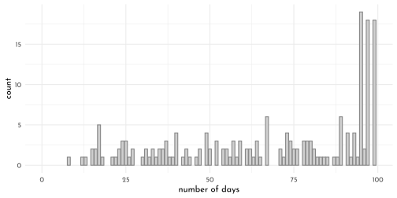


```r
set.seed(14)
data_longitudinal %>% 
  nest(data = c(X1, P_A.std, day, P_A.lag, N_A.lag,
                steps.pm, steps.pmd, N_A.std, day01)) %>% 
  slice_sample(n = 16) %>% 
  unnest(data) %>% 
  ggplot(aes(x = day, y = N_A.lag)) +
  geom_line(color = clr_dark) +
  geom_point(color = clr0d, size = 1/2) +
  ylab("negative affect (standardized)") +
  facet_wrap(~ record_id, labeller = label_both)
```

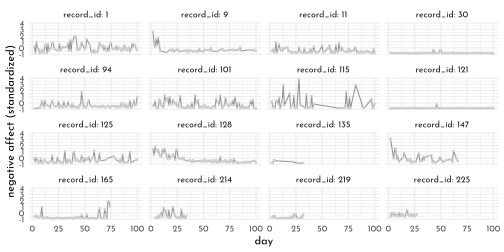

Conventional multilevel growth model

$$
\begin{align*}
\text{NA}_{ij} & \sim \operatorname{Normal}(\mu_{ij}, \sigma) \\
\mu_{ij}       & = \beta_0 + \beta_1 \text{time}_{ij} + \color{#54436D}{u_{0i} + u_{1i} \text{time}_{ij}} \\
\sigma & = \sigma_\epsilon \\
\color{#54436D}{\begin{bmatrix} u_{0i} \\ u_{1i} \end{bmatrix}} & \sim \color{#54436D}{\operatorname{MVNormal}\begin{pmatrix} \begin{bmatrix} 0 \\ 0 \end{bmatrix}, \mathbf S \mathbf R \mathbf S \end{pmatrix}} \\
\mathbf S & = \begin{bmatrix} \sigma_0 & 0 \\ 0 & \sigma_1 \end{bmatrix} \\
\mathbf R & = \begin{bmatrix} 1 & \rho_{12} \\ \rho_{21} & 1 \end{bmatrix} \\
\beta_0   & \sim \operatorname{Normal}(0, 0.2) \\
\beta_1   & \sim \operatorname{Normal}(0, 1) \\
\sigma_0 \text{ and } \sigma_1 & \sim \operatorname{Exponential}(1) \\
\sigma_\epsilon & \sim \operatorname{Exponential}(1) \\
\mathbf R & \sim \operatorname{LKJ}(2),
\end{align*}
$$

```r
brms_c14_model_longitudinal <- brm(
  data = data_longitudinal,
  family = gaussian,
  N_A.std ~ 1 + day01 + (1 + day01 | record_id),
  prior = c(prior(normal(0, 0.2), class = Intercept),
            prior(normal(0, 1), class = b),
            prior(exponential(1), class = sd),
            prior(exponential(1), class = sigma),
            prior(lkj(2), class = cor)),
  iter = 3000, warmup = 1000, 
  chains = 4, cores = 4,
  seed = 42,
  file = "brms/brms_c14_model_longitudinal")
```


```r
new_days <- data_longitudinal %>% 
  distinct(record_id, day01)

fitted(brms_c14_model_longitudinal,
       newdata = new_days) %>% 
  as_tibble() %>% 
  bind_cols(new_days) %>% 
  ggplot(aes(x = day01, y = Estimate, group = record_id)) +
  geom_line(alpha = 1/3, size = 1/3, color = clr_dark) +
  geom_segment(x = 0, xend = 1,
               y = fixef(brms_c14_model_longitudinal)[1, 1],
               yend = fixef(brms_c14_model_longitudinal)[1, 1] +
                 fixef(brms_c14_model_longitudinal)[2, 1],
               size = 1, color = clr2) +
  scale_x_continuous(breaks = c(0, .5, 1)) +
  ylab("negative affect (standardized)")
```


```r
new_days_2 <- data_longitudinal %>% 
  filter(record_id %in% c(30, 115)) %>% 
  dplyr::select(record_id, N_A.std, day01)

bind_cols(
  fitted(brms_c14_model_longitudinal,
         newdata = new_days_2) %>% 
    data.frame(),
  predict(brms_c14_model_longitudinal,
          newdata = new_days_2) %>% 
    data.frame() %>% 
    dplyr::select(Q2.5:Q97.5) %>% 
    set_names("p_lower", "p_upper")) %>% 
  bind_cols(new_days_2)  %>% 
    as_tibble() %>% 
  ggplot(aes(x = day01)) +
  geom_ribbon(aes(ymin = p_lower, ymax = p_upper),
              fill = clr0dd, alpha = 1/2) +
  geom_smooth(aes(y = Estimate, ymin = Q2.5, ymax = Q97.5),
              stat = "identity",
              fill = clr_dark, color = clr_dark, alpha = 1/2, size = 1/2) +
  geom_point(aes(y = N_A.std),
             color = clr_dark) +
  scale_x_continuous(breaks = c(0, .5, 1)) +
  ylab("negative affect (standardized)") +
  facet_wrap(~ record_id)
```

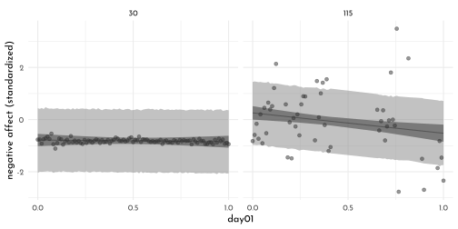

Learn more about your data with the MELSM (*not today...*)

## pymc3 section

---

<div id="myModal" class="modal">
  <span class="close">&times;</span>
  
  <div id="caption"></div>
</div>

<script src="./js/zoom.js"></script>
