---
output:
  html_document:
  theme: yeti
pdf_document: default
editor_options: 
  chunk_output_type: console
---

# Rethinking: Chapter 15

**Missing Data and Other Opportunities**


by [Richard McElreath](https://xcelab.net/rm/statistical-rethinking/), building on the Summaries by [Solomon Kurz](https://bookdown.org/content/4857/).


```r
sim_pancake <- function(){
  pancake <- sample(1:3, size = 1)
  sides <- matrix(c(1, 1, 1, 0, 0, 0),
                  2,3)[, pancake]
  sample(sides)
}

replicate(1e4, sim_pancake()) %>% 
  t() %>% 
  as.data.frame() %>% 
  as_tibble() %>% 
  set_names(nm = c("up", "down")) %>% 
  summarise(burnt_up = sum(up),
            burnt_both = sum(up & down)) %>% 
  mutate(prob_both_burnt = burnt_both/ burnt_up)
```

```
#> # A tibble: 1 × 3
#>   burnt_up burnt_both prob_both_burnt
#>      <dbl>      <int>           <dbl>
#> 1     5074       3357           0.662
```

## Measurement Error


```r
library(rethinking)
data("WaffleDivorce")
data_waffle <- WaffleDivorce %>% 
  as_tibble() %>% 
  mutate(across(.cols = c(Divorce, Marriage, MedianAgeMarriage),
                .fns = standardize,
                .names = "{str_to_lower(.col)}_std"),
         waffle_pop = WaffleHouses / Population,
         divorce_sd = Divorce.SE / sd(Divorce),
         marriage_sd = Marriage.SE / sd(Marriage)) %>% 
  rename(median_age_std = "medianagemarriage_std") 

p1 <- data_waffle %>% 
  ggplot(aes(x = MedianAgeMarriage, y = Divorce))

p2 <- data_waffle %>% 
  ggplot(aes(x = log(Population), y = Divorce))

p1 + p2 &
  geom_pointrange(aes(ymin = Divorce - Divorce.SE,
                      ymax = Divorce + Divorce.SE),
                  fatten = 3,
                  shape = 21,
                  linewidth = .3,
                  fill = clr0,
                  color = clr0dd)
```

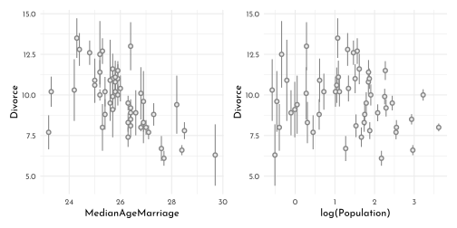

### Error on the Outcome


```r
dag <- dagify(D_obs ~ D + E_D,
       D ~ A + M,
       M ~ A,
       exposure = "M",
       outcome = "D_obs",
       coords = tibble(name = c("A", "M", "D", "D_obs", "E_D"),
                     x = c(0, .5, .5, 1, 1.5),
                     y = c(.5, 1, 0, 0, 0)))

dag %>%
  fortify() %>% 
  mutate(stage = if_else(name == "D_obs", "response",
                         if_else(name %in% c("A", "M"),
                                 "predictor", "confounds")),
         name = str_replace(name, "(.*)_([a-zA-Z]*)","\\1[\\2]")) %>% 
  plot_dag(clr_in = clr_current) +
  scale_x_continuous(limits = c(-.1, 1.6)) +
  scale_y_continuous(limits = c(-.1, 1.1)) +
  coord_fixed(ratio = .5) +
  theme(plot.subtitle = element_text(hjust = .5, family = fnt_sel))
```

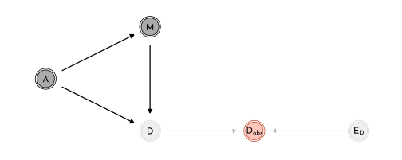

$$
\begin{array}{rclr}
\color{#B35136}{D_{\textrm{OBS}, i}} & \sim & \color{#B35136}{\textrm{Normal}(D_{\textrm{TRUE}}, D_{\textrm{SE}, i})} & \textrm{[distribution of observed values]}\\
\color{#B35136}{D_{\textrm{TRUE},i}} & \sim & \textrm{Normal}(\mu_{i}, \sigma) & \textrm{[distribution of true values]}\\
\mu_{i} & = & \alpha + \beta_{A} ~ A_{i} + \beta_{M} ~ M_{i} & \textrm{[linear model to asses A }\rightarrow\textrm{ D]}\\
\alpha & \sim & \textrm{Normal}(0, 0.2) &&\\
\beta_{A} & \sim & \textrm{Normal}(0, 0.5) &&\\
\beta_{M} & \sim & \textrm{Normal}(0, 0.5) &&\\
\sigma & \sim & \textrm{Exponential}(1) &&\\
\end{array}
$$


```r
data_waffle_list <- data_waffle %>% 
  dplyr::select(divorce_obs = divorce_std, divorce_sd,
                marriage_std, median_age_std, marriage_sd) %>% 
  c(., list(N = nrow(.)))

model_divorce <- ulam(
  flist = alist(
    divorce_obs ~ dnorm( divorce_true, divorce_sd ),
    vector[N]:divorce_true ~ dnorm( mu, sigma ),
    mu <- alpha + beta_age * median_age_std + beta_marriage * marriage_std,
    alpha ~ dnorm( 0, 0.2 ),
    beta_age ~ dnorm( 0, 0.5 ),
    beta_marriage ~ dnorm( 0, 0.5 ),
    sigma ~ dexp(1)
  ),
  data = data_waffle_list,
  cores = 4,
  chains = 4,
  log_lik = TRUE
)
```


```r
precis(model_divorce, depth = 2) %>% 
  knit_precis()
```


|param            |  mean|   sd|  5.5%| 94.5%|   n_eff| Rhat4|
|:----------------|-----:|----:|-----:|-----:|-------:|-----:|
|divorce_true[1]  |  1.18| 0.37|  0.59|  1.76| 2120.60|     1|
|divorce_true[2]  |  0.69| 0.55| -0.17|  1.58| 1996.13|     1|
|divorce_true[3]  |  0.42| 0.35| -0.12|  0.98| 2375.88|     1|
|divorce_true[4]  |  1.41| 0.47|  0.66|  2.18| 2359.62|     1|
|divorce_true[5]  | -0.90| 0.13| -1.11| -0.70| 2994.41|     1|
|divorce_true[6]  |  0.66| 0.41|  0.02|  1.32| 2478.57|     1|
|divorce_true[7]  | -1.36| 0.36| -1.94| -0.77| 3093.85|     1|
|divorce_true[8]  | -0.33| 0.47| -1.10|  0.45| 2626.66|     1|
|divorce_true[9]  | -1.90| 0.61| -2.82| -0.95| 1823.13|     1|
|divorce_true[10] | -0.62| 0.17| -0.89| -0.35| 2365.09|     1|
|divorce_true[11] |  0.77| 0.29|  0.32|  1.23| 2276.66|     1|
|divorce_true[12] | -0.55| 0.48| -1.32|  0.21| 1886.35|     1|
|divorce_true[13] |  0.16| 0.48| -0.61|  0.94| 1645.43|     1|
|divorce_true[14] | -0.87| 0.23| -1.23| -0.51| 2823.17|     1|
|divorce_true[15] |  0.56| 0.30|  0.07|  1.06| 2575.91|     1|
|divorce_true[16] |  0.29| 0.40| -0.33|  0.93| 2920.37|     1|
|divorce_true[17] |  0.50| 0.41| -0.16|  1.16| 2632.67|     1|
|divorce_true[18] |  1.26| 0.36|  0.68|  1.83| 2541.17|     1|
|divorce_true[19] |  0.42| 0.38| -0.18|  1.03| 2512.71|     1|
|divorce_true[20] |  0.40| 0.54| -0.46|  1.30| 1723.19|     1|
|divorce_true[21] | -0.54| 0.32| -1.06| -0.02| 3017.09|     1|
|divorce_true[22] | -1.09| 0.26| -1.50| -0.67| 2994.50|     1|
|divorce_true[23] | -0.27| 0.26| -0.70|  0.15| 2668.85|     1|
|divorce_true[24] | -1.00| 0.30| -1.50| -0.51| 2692.42|     1|
|divorce_true[25] |  0.44| 0.42| -0.21|  1.12| 2152.32|     1|
|divorce_true[26] | -0.04| 0.32| -0.54|  0.47| 3088.87|     1|
|divorce_true[27] | -0.03| 0.50| -0.85|  0.76| 2789.47|     1|
|divorce_true[28] | -0.15| 0.40| -0.81|  0.48| 2779.04|     1|
|divorce_true[29] | -0.27| 0.50| -1.04|  0.55| 2013.86|     1|
|divorce_true[30] | -1.80| 0.24| -2.19| -1.41| 2759.28|     1|
|divorce_true[31] |  0.17| 0.42| -0.48|  0.85| 2360.02|     1|
|divorce_true[32] | -1.66| 0.16| -1.92| -1.40| 2786.49|     1|
|divorce_true[33] |  0.11| 0.25| -0.28|  0.52| 4394.88|     1|
|divorce_true[34] | -0.05| 0.51| -0.91|  0.75| 2082.49|     1|
|divorce_true[35] | -0.12| 0.23| -0.48|  0.25| 3614.20|     1|
|divorce_true[36] |  1.27| 0.41|  0.61|  1.92| 3162.86|     1|
|divorce_true[37] |  0.23| 0.36| -0.36|  0.81| 2302.28|     1|
|divorce_true[38] | -1.02| 0.22| -1.37| -0.67| 2445.56|     1|
|divorce_true[39] | -0.91| 0.55| -1.74| -0.01| 1596.33|     1|
|divorce_true[40] | -0.69| 0.33| -1.22| -0.18| 2408.26|     1|
|divorce_true[41] |  0.24| 0.53| -0.62|  1.06| 2567.16|     1|
|divorce_true[42] |  0.73| 0.34|  0.22|  1.28| 2103.94|     1|
|divorce_true[43] |  0.19| 0.19| -0.12|  0.50| 3015.36|     1|
|divorce_true[44] |  0.80| 0.42|  0.13|  1.48| 2321.58|     1|
|divorce_true[45] | -0.43| 0.54| -1.25|  0.44| 3009.24|     1|
|divorce_true[46] | -0.39| 0.26| -0.80|  0.03| 2700.26|     1|
|divorce_true[47] |  0.13| 0.30| -0.35|  0.62| 2733.99|     1|
|divorce_true[48] |  0.56| 0.47| -0.17|  1.32| 3033.50|     1|
|divorce_true[49] | -0.64| 0.28| -1.08| -0.21| 2805.86|     1|
|divorce_true[50] |  0.85| 0.57| -0.07|  1.74| 1840.04|     1|
|alpha            | -0.05| 0.09| -0.20|  0.10| 1585.93|     1|
|beta_age         | -0.61| 0.16| -0.86| -0.36| 1169.42|     1|
|beta_marriage    |  0.05| 0.17| -0.21|  0.32| 1014.84|     1|
|sigma            |  0.59| 0.10|  0.43|  0.76|  769.88|     1|


```r
d_obs_vs_d_est <-  precis(model_divorce, depth = 2) %>% 
  data.frame() %>% 
  rownames_to_column(var = "param") %>% 
  as_tibble() %>% 
  filter(grepl("divorce_true", param)) %>% 
  bind_cols(data_waffle %>% 
  dplyr::select(Loc, Divorce,divorce_std, divorce_sd, median_age_std ), .)

p1 <- d_obs_vs_d_est %>% 
  ggplot(aes(x = divorce_sd, y =  divorce_std - mean)) +
  geom_hline(yintercept = 0, linetype = 3, color = clr_dark) +
  geom_point(color = clr0dd, fill = clr0, shape = 21, size = 2) +
  ggrepel::geom_text_repel(aes(label = Loc),
                           max.overlaps = 1,
                            family = fnt_sel)

posterior_pred_se <- extract.samples(model_divorce) %>% 
  as_tibble() %>% 
  dplyr::select(alpha, beta_age)  %>% 
  expand(nesting(alpha, beta_age),
         age = seq(from = -3.5, to = 3.5, length.out = 50)) %>% 
  mutate(fitted = alpha + beta_age * age)

library(tidybayes)
p2 <- d_obs_vs_d_est %>% 
  ggplot(aes(x = median_age_std)) +
    stat_lineribbon(data = posterior_pred_se,
                    aes(y = fitted, x = age),
                  .width = .89, size = .25, 
                  color = clr0d, fill = fll0) +
  geom_linerange(aes(ymin = divorce_std, ymax = mean),
                 color = clr0d)+
  geom_point(aes(y = divorce_std), 
             color = clr0dd, fill = clr0, 
             shape = 21, size = 2) +
  geom_point(aes(y = mean), 
             color = clr_current, fill = clr_lighten(clr_current),
             shape = 21, size = 2) +
  ggrepel::geom_text_repel(data = . %>% filter(abs(divorce_std - mean) > .35),
                           aes(y = divorce_std, label = Loc),
                           max.overlaps = 2,
                            family = fnt_sel) +
  coord_cartesian(ylim = c(-2, 2.2), expand = 0)

p1 + p2
```

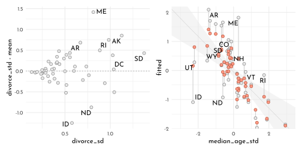

### Error on Both Outcome and Predictor


```r
dag2 <- dagify(D_obs ~ D + E_D,
       D ~ A + M,
       M ~ A,
       M_obs ~ M + E_M,
       exposure = "M",
       outcome = "D_obs",
       coords = tibble(name = c("A", "M", "D", "D_obs", "E_D", "M_obs","E_M"),
                     x = c(0, .5, .5, 1, 1.5, 1, 1.5),
                     y = c(.5, 1, 0, 0, 0, 1, 1)))

dag2 %>%
  fortify() %>% 
  mutate(stage = if_else(name == "D_obs", "response",
                         if_else(name %in% c("A", "M_obs"),
                                 "predictor", "confounds")),
         name = str_replace(name, "(.*)_([a-zA-Z]*)","\\1[\\2]")) %>% 
  plot_dag(clr_in = clr_current) +
  scale_x_continuous(limits = c(-.1, 1.6)) +
  scale_y_continuous(limits = c(-.1, 1.1)) +
  coord_fixed(ratio = .5) +
  theme(plot.subtitle = element_text(hjust = .5, family = fnt_sel))
```

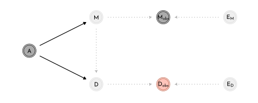

$$
\begin{array}{rclr}
D_{\textrm{OBS}, i} & \sim & \textrm{Normal}(D_{\textrm{TRUE}}, D_{\textrm{SE}, i}) & \textrm{[distribution of observed D values]}\\
D_{\textrm{TRUE},i} & \sim & \textrm{Normal}(\mu_{i}, \sigma) & \textrm{[distribution of true D values]}\\
\mu_{i} & = & \alpha + \beta_{A} ~ A_{i} + \color{#B35136}{\beta_{M} ~ M_{\textrm{TRUE}, i}} & \textrm{[linear model]}\\
\color{#B35136}{M_{\textrm{OBS},i}} & \sim & \color{#B35136}{\textrm{Normal}(M_{\textrm{TRUE},i}, M_{\textrm{SE},i})} & \textrm{[distribution of observed M values]}\\
\color{#B35136}{M_{\textrm{TRUE},i}} & \sim & \color{#B35136}{\textrm{Normal}(0,1)} & \textrm{[distribution of true M values]} \\
\alpha & \sim & \textrm{Normal}(0, 0.2) &&\\
\beta_{A} & \sim & \textrm{Normal}(0, 0.5) &&\\
\beta_{M} & \sim & \textrm{Normal}(0, 0.5) &&\\
\sigma & \sim & \textrm{Exponential}(1) &&\\
\end{array}
$$


```r
model_divorce_error_out <- ulam(
  flist = alist(
    divorce_obs ~ dnorm( divorce_true, divorce_sd ),
    vector[N]:divorce_true ~ dnorm( mu, sigma ),
    mu <- alpha + beta_age * median_age_std + beta_marriage * marriage_true[i],
    marriage_std ~ dnorm( marriage_true, marriage_sd ),
    vector[N]:marriage_true ~ dnorm(0, 1),
    alpha ~ dnorm( 0, 0.2 ),
    beta_age ~ dnorm( 0, 0.5 ),
    beta_marriage ~ dnorm( 0, 0.5 ),
    sigma ~ dexp(1)
  ),
  data = data_waffle_list,
  cores = 4,
  chains = 4,
  log_lik = TRUE
)
```


```r
extract.samples(model_divorce_error_out) %>% 
  as_tibble() %>% 
  dplyr::select(divorce_true, marriage_true) %>% 
  summarise(divorce_true = colMeans(as_tibble(divorce_true)),
            marriage_true = colMeans(as_tibble(marriage_true))) %>% 
    bind_cols(data_waffle %>%
              dplyr::select(Loc, Divorce,divorce_std, divorce_sd,
                            median_age_std, marriage_std ), .) %>%
  ggplot() +
  geom_segment(aes(x = marriage_std, xend = marriage_true,
                   y = divorce_std, yend = divorce_true ),
                 color = clr0d ) +
  geom_point(aes(x = marriage_std,
                 y = divorce_std),
             color = clr0dd, fill = clr0,
             shape = 21, size = 2) +
  geom_point(aes(x = marriage_true,
                 y = divorce_true), 
             color = clr_current, fill = clr_lighten(clr_current),
             shape = 21, size = 2) +
  labs(subtitle = "shrinkage of both marriage rate and divorce rate")
```

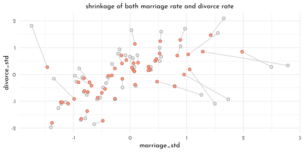

### Measurement Terrors


```r
dag3 <- dagify(D_obs ~ D + E_D,
       D ~ A + M,
       M ~ A,
       M_obs ~ M + E_M,
       E_M ~ P,
       E_D ~ P,
       exposure = "M",
       outcome = "D_obs",
       coords = tibble(name = c("A", "M", "D", "D_obs", "E_D", "M_obs","E_M", "P"),
                     x = c(0, .5, .5, 1, 1.5, 1, 1.5, 2),
                     y = c(.5, 1, 0, 0, 0, 1, 1, .5)))

dag3 %>%
  fortify() %>% 
  mutate(stage = if_else(name == "D_obs", "response",
                         if_else(name %in% c("A", "M_obs", "P"),
                                 "predictor", "confounds")),
         name = str_replace(name, "(.*)_([a-zA-Z]*)","\\1[\\2]")) %>% 
  plot_dag(clr_in = clr_current) +
  coord_fixed(ratio = .6,
              xlim = c(-.1, 2.1),
              ylim = c(-.1, 1.1)) +
  theme(plot.subtitle = element_text(hjust = .5, family = fnt_sel))
```

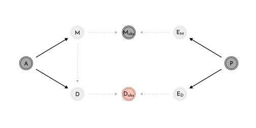


```r
dag4 <- dagify(D_obs ~ D + E_D,
       D ~ A + M,
       M ~ A,
       M_obs ~ M + E_M,
       E_D ~ M,
       exposure = "M",
       outcome = "D_obs",
       coords = tibble(name = c("A", "M", "D", "D_obs", "E_D", "M_obs","E_M"),
                     x = c(0, .5, .5, 1, 1.5, 1, 1.5),
                     y = c(.5, 1, 0, 0, 0, 1, 1)))

dag4 %>%
  fortify() %>% 
  mutate(stage = if_else(name == "D_obs", "response",
                         if_else(name %in% c("A", "M_obs", "P"),
                                 "predictor", "confounds")),
         name = str_replace(name, "(.*)_([a-zA-Z]*)","\\1[\\2]")) %>% 
  plot_dag(clr_in = clr_current) +
  coord_fixed(ratio = .6,
              xlim = c(-.1, 1.6),
              ylim = c(-.1, 1.1)) +
  theme(plot.subtitle = element_text(hjust = .5, family = fnt_sel))
```

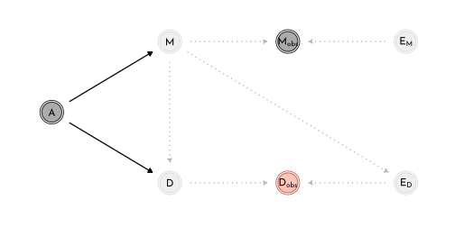


```r
dag5 <- dagify(
  A_obs ~ A + E_A,
  M ~ A,
  D ~ A,
  exposure = "M",
  outcome = "A",
  coords = tibble(name = c("E_A", "A_obs", "A", "M", "D"),
                  x = c( 0, .5, 1, 1.5, 1.5 ),
                  y = c(.5, .5, .5, 1, 0)))

dag5 %>%
  fortify() %>% 
  mutate(stage = if_else(name == "D_obs", "response",
                         if_else(name %in% c("A_obs", "M", "D"),
                                 "predictor", "confounds")),
         name = str_replace(name, "(.*)_([a-zA-Z]*)","\\1[\\2]")) %>% 
  plot_dag(clr_in = clr_current) +
  coord_fixed(ratio = .6,
              xlim = c(-.1, 1.6),
              ylim = c(-.1, 1.1)) +
  theme(plot.subtitle = element_text(hjust = .5, family = fnt_sel))
```

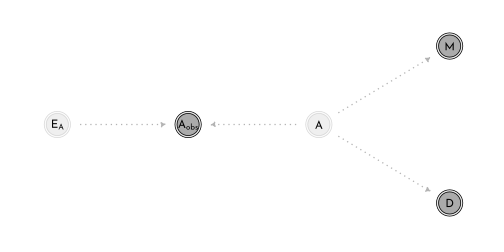


```r
n <- 500
data_sim <- tibble(age = rnorm(n),
       marriage = rnorm(n, mean = -age),
       divorce = rnorm(n, mean = age),
       age_obs = rnorm(n, mean = age))
```

## Missing Data

### DAG ate my Homework


```r
annotate_dag <- function(dag){
  dag %>%
  fortify() %>% 
  mutate(stage = if_else(name == "Hs", "response",
                         if_else(name %in% c("S", "D"),
                                 "predictor", "confounds")),
         name = str_replace(name, "Hs","H^'*'"))
}

dag6 <- dagify(
  Hs ~ H + D,
  H ~ S,
  exposure = "S",
  outcome = "Hs",
  coords = tibble(name = c("S", "H", "D", "Hs"),
                  x = c( 0, 1, 0, 1 ),
                  y = c( 1, 1, 0, 0 ))) %>% 
  annotate_dag()

dag7 <- dagify(
  Hs ~ H + D,
  H ~ S,
  D ~ S,
  exposure = "S",
  outcome = "Hs",
  coords = tibble(name = c("S", "H", "D", "Hs"),
                  x = c( 0, 1, 0, 1 ),
                  y = c( 1, 1, 0, 0 ))) %>% 
  annotate_dag()

dag8 <- dagify(
  Hs ~ H + D,
  H ~ S + X,
  D ~ X,
  exposure = "S",
  outcome = "Hs",
  coords = tibble(name = c("S", "H", "D", "Hs", "X"),
                  x = c( 0, 1, 0, 1, .5 ),
                  y = c( 1, 1, 0, 0, .5 ))) %>% 
  annotate_dag()

dag9 <- dagify(
  Hs ~ H + D,
  H ~ S,
  D ~ H,
  exposure = "S",
  outcome = "Hs",
  coords = tibble(name = c("S", "H", "D", "Hs"),
                  x = c( 0, 1, 0, 1 ),
                  y = c( 1, 1, 0, 0 ))) %>% 
  annotate_dag()

list(dag6, dag7, dag8, dag9)  %>% 
  purrr::map(plot_dag, clr_in = clr_current) %>% 
  wrap_plots(ncol = 2, tag_level = "new") +
  plot_annotation(tag_levels = "a") &
  coord_fixed(ratio = .6,
              xlim = c(-.1, 1.1),
              ylim = c(-.1, 1.1)) &
  theme(plot.subtitle = element_text(hjust = .5, family = fnt_sel),
        plot.tag = element_text(family = fnt_sel))
```

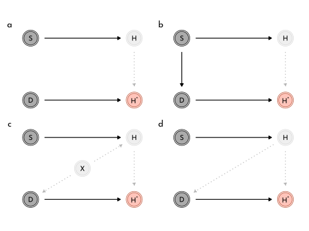


```r
n <- 100
data_homework_a <- tibble(
  study = rnorm(n),
  homework = rbinom(n, size = 10 , inv_logit(study)),
  dog = rbern( n ),
  homework_missing = if_else(dog == 1, NA_integer_ , homework))

data_homework_b <- data_homework_a %>% 
  mutate(dog = as.integer(study > 0),
  homework_missing = if_else(dog == 1, NA_integer_ , homework))

n <- 1e3
set.seed(42)
data_homework_c <- tibble(
  x = rnorm(n),
  study = rnorm(n),
  homework = rbinom(n, size = 10 , inv_logit(2 + study - 2 * x )),
  dog = as.integer(x > 0),
  homework_missing = if_else(dog == 1, NA_integer_ , homework))
```


```r
data_homework_c_list <- data_homework_c %>% 
  dplyr::select(study, homework) %>% 
  as.list()

model_hw_full <- ulam(
  flist = alist(
    homework ~ binomial( 10, p ),
    logit(p) <- alpha + beta_study * study,
    alpha ~ normal( 0, 1 ),
    beta_study ~ normal( 0, 0.5 )
  ),
  data = data_homework_c_list,
  cores = 4,
  chains = 4,
  seed = 42
)
```


```r
precis(model_hw_full) %>% 
  knit_precis()
```


|param      | mean|   sd| 5.5%| 94.5%|   n_eff| Rhat4|
|:----------|----:|----:|----:|-----:|-------:|-----:|
|alpha      | 1.26| 0.02| 1.22|  1.29| 1264.47|     1|
|beta_study | 0.61| 0.03| 0.57|  0.65| 1051.59|     1|


```r
data_homework_c_list2 <- data_homework_c %>%
  filter(!is.na(homework_missing)) %>% 
  dplyr::select(study, homework) %>% 
  as.list()

model_hw_missing <- ulam(
  flist = alist(
    homework ~ binomial( 10, p ),
    logit(p) <- alpha + beta_study * study,
    alpha ~ normal( 0, 1 ),
    beta_study ~ normal( 0, 0.5 )
  ),
  data = data_homework_c_list2,
  cores = 4,
  chains = 4,
  seed = 42
)
```


```r
precis(model_hw_missing) %>% 
  knit_precis()
```


|param      | mean|   sd| 5.5%| 94.5%|  n_eff| Rhat4|
|:----------|----:|----:|----:|-----:|------:|-----:|
|alpha      | 3.06| 0.07| 2.94|  3.18| 767.92|  1.00|
|beta_study | 0.89| 0.06| 0.80|  1.00| 680.65|  1.01|


```r
data_homework_c_list3 <- data_homework_c %>%
  mutate(dog = as.integer(abs(x) < 1 ),
         homework_missing = if_else(dog == 1, NA_integer_ , homework)) %>% 
  filter(!is.na(homework_missing)) %>% 
  dplyr::select(study, homework) %>% 
  as.list()

model_hw_opposite_effect <- ulam(
  flist = alist(
    homework ~ binomial( 10, p ),
    logit(p) <- alpha + beta_study * study,
    alpha ~ normal( 0, 1 ),
    beta_study ~ normal( 0, 0.5 )
  ),
  data = data_homework_c_list3,
  cores = 4,
  chains = 4,
  seed = 42
)
```


```r
precis(model_hw_opposite_effect) %>% 
  knit_precis()
```


|param      | mean|   sd| 5.5%| 94.5%|   n_eff| Rhat4|
|:----------|----:|----:|----:|-----:|-------:|-----:|
|alpha      | 0.73| 0.04| 0.67|  0.79| 1448.69|     1|
|beta_study | 0.35| 0.04| 0.29|  0.41| 1329.66|     1|


```r
data_homework_d <- data_homework_a %>% 
  mutate(dog = as.integer(homework < 5),
  homework_missing = if_else(dog == 1, NA_integer_ , homework))

data_homework_c_list4 <- data_homework_d %>%
  filter(!is.na(homework_missing)) %>% 
  dplyr::select(study, homework) %>% 
  as.list()

model_hw_unfixable <- ulam(
  flist = alist(
    homework ~ binomial( 10, p ),
    logit(p) <- alpha + beta_study * study,
    alpha ~ normal( 0, 1 ),
    beta_study ~ normal( 0, 0.5 )
  ),
  data = data_homework_c_list4,
  cores = 4,
  chains = 4,
  seed = 42
)
```


```r
precis(model_hw_unfixable) %>% 
  knit_precis()
```


|param      | mean|   sd| 5.5%| 94.5%|  n_eff| Rhat4|
|:----------|----:|----:|----:|-----:|------:|-----:|
|alpha      | 0.44| 0.10| 0.29|  0.60| 640.41|  1.01|
|beta_study | 0.50| 0.11| 0.33|  0.68| 727.25|  1.01|

### Imputing Primates


```r
dag10 <- dagify(
  K ~ M + B,
  B ~ U,
  M ~ U,
  exposure = "M",
  outcome = "K",
  coords = tibble(name = c("M", "U", "K", "B"),
                  x = c( 0, .5, .5, 1 ),
                  y = c(1, 1, 0, 1)))

dag10 %>%
  fortify() %>% 
  mutate(stage = if_else(name == "K", "response",
                         if_else(name %in% c("M", "B"),
                                 "predictor", "confounds"))) %>% 
  plot_dag(clr_in = clr_current) +
  coord_fixed(ratio = .6,
              xlim = c(-.1, 1.1),
              ylim = c(-.1, 1.1)) +
  theme(plot.subtitle = element_text(hjust = .5, family = fnt_sel))
```

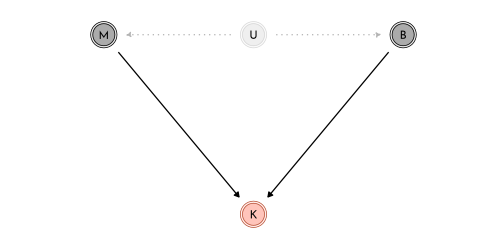


```r
primate_dag <- function(dag){
  dag %>%
  fortify() %>% 
  mutate(stage = if_else(name == "K", "response",
                         if_else(name %in% c("M", "Bs", "Rb"),
                                 "predictor", "confounds")),
         name = str_replace(name, "Bs","B^'*'") %>% 
           str_replace( "Rb","R[B]") )
}

dag11 <- dagify(
  K ~ M + B,
  B ~ U,
  M ~ U,
  Bs ~ B + Rb,
  exposure = "M",
  outcome = "K",
  coords = tibble(name = c("M", "U", "K", "B", "Bs", "Rb"),
                  x = c( 0, .5, .5, 1, 1, .5 ),
                  y = c(.75, .75, 0, .75, 1.5, 1.5))) %>% 
  primate_dag()

dag12 <- dagify(
  K ~ M + B,
  B ~ U,
  M ~ U,
  Bs ~ B + Rb,
  Rb ~ M,
  exposure = "M",
  outcome = "K",
  coords = tibble(name = c("M", "U", "K", "B", "Bs", "Rb"),
                  x = c( 0, .5, .5, 1, 1, .5 ),
                  y = c(.75, .75, 0, .75, 1.5, 1.5))) %>% 
  primate_dag()

dag13 <- dagify(
  K ~ M + B,
  B ~ U,
  M ~ U,
  Bs ~ B + Rb,
  Rb ~ B,
  exposure = "M",
  outcome = "K",
  coords = tibble(name = c("M", "U", "K", "B", "Bs", "Rb"),
                  x = c( 0, .5, .5, 1, 1, .5 ),
                  y = c(.75, .75, 0, .75, 1.5, 1.5))) %>% 
  primate_dag()

list(dag11, dag12, dag13)  %>% 
  purrr::map(plot_dag, clr_in = clr_current) %>% 
  wrap_plots(nrow = 1, tag_level = "new") +
  plot_annotation(tag_levels = "a") &
  coord_fixed(ratio = .6,
              xlim = c(-.1, 1.1),
              ylim = c(-.1, 1.6)) &
  theme(plot.subtitle = element_text(hjust = .5, family = fnt_sel),
        plot.tag = element_text(family = fnt_sel))
```

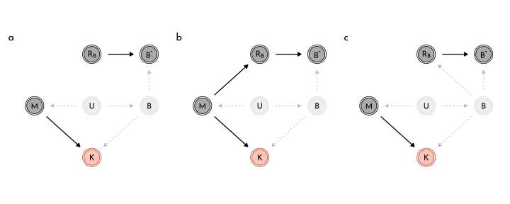


```r
dagify(
  K ~ M + B,
  B ~ U + V,
  M ~ U,
  Bs ~ B + Rb,
  Rb ~ V,
  exposure = "M",
  outcome = "K",
  coords = tibble(name = c("M", "U", "K", "B", "Bs", "Rb", "V"),
                  x = c( 0, .5, .5, 1, 1.5, 1.5, 1.25 ),
                  y = c(.75, .75, 0, .75, .75, 0, .375))) %>% 
  primate_dag() %>% 
  plot_dag(clr_in = clr_current) +
  coord_fixed(ratio = .6,
              xlim = c(-.1, 1.6),
              ylim = c(-.1, .87)) +
  theme(plot.subtitle = element_text(hjust = .5, family = fnt_sel))
```

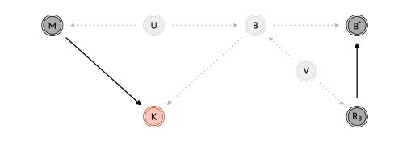

$$
\begin{array}{rclr}
K_{i} & \sim & \textrm{Normal}(\mu_{i}, \sigma) & \textrm{[ distribution for outcome }k\textrm{ ]}\\
\mu_{i} & = & \alpha + \beta_{B} \color{#B35136}{B_{i}} + \beta_{M}~\textrm{log} M_{i} & \textrm{[ linear model ]}\\
\color{#B35136}{B_{i}} & \sim & \color{#B35136}{\textrm{Normal}(\nu, \sigma_{B})} & \textrm{[ distribution of obs/missing }B\textrm{ ]}\\
\alpha & \sim & \textrm{Normal}(0,0.5) & \\
\beta_{B} & \sim & \textrm{Normal}(0,0.5) & \\
\beta_{M} & \sim & \textrm{Normal}(0,0.5) & \\
\sigma & \sim & \textrm{Exponential}(1) & \\
\nu & \sim & \textrm{Normal}(0.5, 1) & \\
\sigma_{B} & \sim & \textrm{Exponential}(1) & \\
\end{array}
$$


```r
data(milk)
data_milk_full <- milk %>% 
  as_tibble() %>% 
  mutate(mass.log = log(mass),
         neocortex.prop = neocortex.perc / 100,
         across(.cols = c(`kcal.per.g`, `neocortex.prop`, `mass.log`),
                .fns = standardize,
                .names = "{str_remove_all(.col, '\\\\..*')}_std"))

data_milk_list <- data_milk_full %>% 
  dplyr::select(species, kcal_std, neocortex_std, mass_std) %>% 
  as.list()

model_primates_imputed <- ulam(
  flist = alist(
    kcal_std ~ dnorm( mu, sigma ),
    mu <- alpha + beta_brain * neocortex_std + beta_mass * mass_std,
    neocortex_std ~ dnorm( nu, sigma_brain ),
    c( alpha, nu ) ~ dnorm( 0, 0.5 ),
    c(beta_brain, beta_mass ) ~ dnorm( 0, 0.5 ),
    sigma_brain ~ dexp(1),
    sigma ~ dexp(1)
  ),
  data = data_milk_list,
  cores = 4,
  chains = 4,
  seed = 42
)
```


```r
precis(model_primates_imputed, depth = 2) %>% 
  knit_precis()
```


|param                    |  mean|   sd|  5.5%| 94.5%|   n_eff| Rhat4|
|:------------------------|-----:|----:|-----:|-----:|-------:|-----:|
|nu                       | -0.06| 0.21| -0.39|  0.28| 2210.15|  1.00|
|alpha                    |  0.03| 0.17| -0.23|  0.29| 2240.59|  1.00|
|beta_mass                | -0.55| 0.20| -0.85| -0.22| 1114.24|  1.00|
|beta_brain               |  0.50| 0.23|  0.11|  0.87|  831.86|  1.01|
|sigma_brain              |  1.01| 0.17|  0.77|  1.33| 1444.15|  1.00|
|sigma                    |  0.84| 0.14|  0.64|  1.08| 1255.77|  1.00|
|neocortex_std_impute[1]  | -0.60| 0.90| -1.99|  0.84| 2237.08|  1.00|
|neocortex_std_impute[2]  | -0.70| 0.94| -2.18|  0.82| 2266.74|  1.00|
|neocortex_std_impute[3]  | -0.70| 0.93| -2.14|  0.80| 2007.44|  1.00|
|neocortex_std_impute[4]  | -0.30| 0.90| -1.73|  1.12| 2470.97|  1.00|
|neocortex_std_impute[5]  |  0.44| 0.90| -0.99|  1.89| 2917.91|  1.00|
|neocortex_std_impute[6]  | -0.20| 0.91| -1.57|  1.25| 2303.80|  1.00|
|neocortex_std_impute[7]  |  0.21| 0.90| -1.22|  1.61| 3195.30|  1.00|
|neocortex_std_impute[8]  |  0.26| 0.89| -1.15|  1.66| 2089.83|  1.00|
|neocortex_std_impute[9]  |  0.50| 0.87| -0.86|  1.91| 2308.11|  1.00|
|neocortex_std_impute[10] | -0.44| 0.88| -1.84|  0.92| 2664.65|  1.00|
|neocortex_std_impute[11] | -0.30| 0.90| -1.75|  1.19| 2810.75|  1.00|
|neocortex_std_impute[12] |  0.15| 0.89| -1.27|  1.53| 2816.22|  1.00|


```r
data_milk_list2 <- data_milk_full %>% 
  filter(!is.na(neocortex_std)) %>% 
  dplyr::select(species, kcal_std, neocortex_std, mass_std) %>% 
  as.list()

model_primates_non_missing <- ulam(
  flist = alist(
    kcal_std ~ dnorm( mu, sigma ),
    mu <- alpha + beta_brain * neocortex_std + beta_mass * mass_std,
    neocortex_std ~ dnorm( nu, sigma_brain ),
    c( alpha, nu ) ~ dnorm( 0, 0.5 ),
    c(beta_brain, beta_mass ) ~ dnorm( 0, 0.5 ),
    sigma_brain ~ dexp(1),
    sigma ~ dexp(1)
  ),
  data = data_milk_list2,
  cores = 4,
  chains = 4,
  seed = 42
)
```


```r
precis(model_primates_non_missing) %>% 
  knit_precis()
```


|param       |  mean|   sd|  5.5%| 94.5%|   n_eff| Rhat4|
|:-----------|-----:|----:|-----:|-----:|-------:|-----:|
|nu          |  0.00| 0.23| -0.37|  0.36| 1778.70|     1|
|alpha       |  0.10| 0.19| -0.20|  0.40| 1423.18|     1|
|beta_mass   | -0.64| 0.26| -1.04| -0.20|  923.00|     1|
|beta_brain  |  0.60| 0.29|  0.12|  1.06|  870.94|     1|
|sigma_brain |  1.03| 0.18|  0.79|  1.37| 1908.36|     1|
|sigma       |  0.87| 0.19|  0.63|  1.22|  871.92|     1|


```r
missing_mean <- coeftab(model_primates_non_missing,
                        model_primates_imputed)@coefs %>% 
  as.data.frame() %>% 
  rownames_to_column(var = "param") %>% 
  as_tibble() %>% 
  filter(param %in% c("beta_brain", "beta_mass")) 

coeftab(model_primates_non_missing,
        model_primates_imputed)@se %>% 
  as.data.frame() %>% 
  rownames_to_column(var = "param") %>% 
  as_tibble() %>% 
  filter(param %in% c("beta_brain", "beta_mass"))  %>% 
  set_names(nm = c("param", names(missing_mean)[2:3]))%>% 
  pivot_longer(-param, names_to = "model", values_to = "se") %>% 
  left_join(missing_mean %>% 
  pivot_longer(-param, names_to = "model", values_to = "mean")) %>% 
  mutate(model = str_remove(model, "model_primates_")) %>% 
  ggplot(aes(y = model)) +
  geom_pointrange(aes(x = mean, xmin = mean - se, xmax = mean+se),
                  color = clr0dd, fill = clr0, shape = 21) +
  facet_grid(param ~ ., switch = "y")  +
  theme(strip.placement = "outside")
```

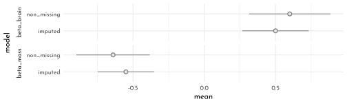


```r
primates_posterior <- extract.samples(model_primates_imputed) %>% 
  as_tibble()

imputed_neocortex <- primates_posterior$neocortex_std_impute %>% 
  as_tibble() %>% 
  pivot_longer(everything()) %>% 
  group_by(name) %>% 
  summarise(pi = list(tibble(value = quantile(value, probs = c(.055, .25, .5, .75, .955)),
                        label = c("ll", "l", "m", "h", "hh")))) %>%
  mutate(name = str_remove(name, "V") %>%  as.integer()) %>% 
  arrange(name) %>% 
  unnest(pi) %>% 
  pivot_wider(names_from = label, values_from = value) %>% 
  bind_cols(data_milk_full %>% filter(is.na(neocortex.perc)),.)

p1 <- data_milk_list %>% 
  as_tibble() %>% 
  filter(!is.na(neocortex_std)) %>% 
  ggplot(aes(x = neocortex_std, y = kcal_std)) +
  geom_pointrange(data = imputed_neocortex,
                  aes(xmin = ll, x = m ,xmax = hh),
                  color = clr0dd, fill = clr0,
                  shape = 21, fatten  = 2.6) +
  geom_point(color = clr_current, size = 1.6)

p2 <- data_milk_list %>% 
  as_tibble() %>% 
  filter(!is.na(neocortex_std)) %>% 
  ggplot(aes(y = neocortex_std, x = mass_std)) +
  geom_pointrange(data = imputed_neocortex,
                  aes(ymin = ll, y = m ,ymax = hh),
                  color = clr0dd, fill = clr0,
                  shape = 21, fatten  = 2.6) +
  geom_point(color = clr_current, size = 1.6)

p1 + p2
```

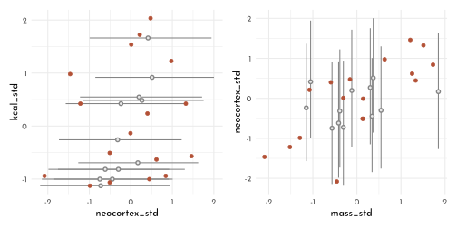

Updating the imputation within the model to take the correlation of `mass_std` and `neocortex_std` into account:

$$
(M_{i}, B_{i}) \sim \textrm{MVNormal}\left(( \mu_{M}, \mu_{B}), S \right)
$$


```r
model_primates_impute_covar <- ulam(
  flist = alist(
    # kcal as function of neocortex and mass
    kcal_std ~ dnorm( mu, sigma ),
    mu <- alpha + beta_brain * neocortex_merge + beta_mass * mass_std,
    
    # mass and neocortex correlation
    mass_neocortex ~ multi_normal( c( mu_mass, mu_neocortex ), Rho_nm, Sigma_nm ),
    matrix[29, 2]:mass_neocortex <<- append_col( mass_std, neocortex_merge ),
    
    # define neocortex_merge as mix of observed and imputed values
    vector[29]:neocortex_merge <- merge_missing( neocortex_std, neocortex_std_impute ),
    
    # priors
    c( alpha, mu_mass, mu_neocortex ) ~ dnorm( 0, 0.5 ),
    c( beta_brain, beta_mass ) ~ dnorm( 0, 0.5 ),
    sigma ~ dexp(1),
    Rho_nm ~ lkj_corr(2),
    Sigma_nm ~ dexp(1)
  ),
  data = data_milk_list,
  cores = 4,
  chains = 4
)
```


```r
precis(model_primates_impute_covar, depth = 3,
       pars = c("beta_mass", "beta_brain", "Rho_nm")) %>% 
  knit_precis()
```


|param       |  mean|   sd|  5.5%| 94.5%|   n_eff| Rhat4|
|:-----------|-----:|----:|-----:|-----:|-------:|-----:|
|beta_mass   | -0.65| 0.22| -0.98| -0.29| 1153.75|     1|
|beta_brain  |  0.59| 0.25|  0.17|  0.96|  938.43|     1|
|Rho_nm[1,1] |  1.00| 0.00|  1.00|  1.00|     NaN|   NaN|
|Rho_nm[1,2] |  0.61| 0.13|  0.37|  0.79| 1300.92|     1|
|Rho_nm[2,1] |  0.61| 0.13|  0.37|  0.79| 1300.92|     1|
|Rho_nm[2,2] |  1.00| 0.00|  1.00|  1.00|     NaN|   NaN|


```r
primates_posterior_covar <- extract.samples(model_primates_impute_covar) %>% 
  as_tibble()

imputed_neocortex_covar <- primates_posterior_covar$neocortex_std_impute %>% 
  as_tibble() %>% 
  pivot_longer(everything()) %>% 
  group_by(name) %>% 
  summarise(pi = list(tibble(value = quantile(value, probs = c(.055, .25, .5, .75, .955)),
                        label = c("ll", "l", "m", "h", "hh")))) %>%
  mutate(name = str_remove(name, "V") %>%  as.integer()) %>% 
  arrange(name) %>% 
  unnest(pi) %>% 
  pivot_wider(names_from = label, values_from = value) %>% 
  bind_cols(data_milk_full %>% filter(is.na(neocortex.perc)),.)

p1 <- data_milk_list %>% 
  as_tibble() %>% 
  filter(!is.na(neocortex_std)) %>% 
  ggplot(aes(x = neocortex_std, y = kcal_std)) +
  geom_pointrange(data = imputed_neocortex_covar,
                  aes(xmin = ll, x = m ,xmax = hh),
                  color = clr0dd, fill = clr0,
                  shape = 21, fatten  = 2.6) +
  geom_point(color = clr_current, size = 1.6)

p2 <- data_milk_list %>% 
  as_tibble() %>% 
  filter(!is.na(neocortex_std)) %>% 
  ggplot(aes(y = neocortex_std, x = mass_std)) +
  geom_pointrange(data = imputed_neocortex_covar,
                  aes(ymin = ll, y = m ,ymax = hh),
                  color = clr0dd, fill = clr0,
                  shape = 21, fatten  = 2.6) +
  geom_point(color = clr_current, size = 1.6)

p1 + p2
```

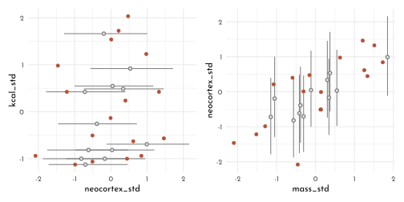


```r
stancode(model_primates_imputed)
```

```
#> functions{
#> 
#> 
#>     vector merge_missing( int[] miss_indexes , vector x_obs , vector x_miss ) {
#>         int N = dims(x_obs)[1];
#>         int N_miss = dims(x_miss)[1];
#>         vector[N] merged;
#>         merged = x_obs;
#>         for ( i in 1:N_miss )
#>             merged[ miss_indexes[i] ] = x_miss[i];
#>         return merged;
#>     }
#> }
#> data{
#>     int species[29];
#>     vector[29] kcal_std;
#>     vector[29] mass_std;
#>     vector[29] neocortex_std;
#>     int neocortex_std_missidx[12];
#> }
#> parameters{
#>     real nu;
#>     real alpha;
#>     real beta_mass;
#>     real beta_brain;
#>     real<lower=0> sigma_brain;
#>     real<lower=0> sigma;
#>     vector[12] neocortex_std_impute;
#> }
#> model{
#>     vector[29] mu;
#>     vector[29] neocortex_std_merge;
#>     sigma ~ exponential( 1 );
#>     sigma_brain ~ exponential( 1 );
#>     beta_brain ~ normal( 0 , 0.5 );
#>     beta_mass ~ normal( 0 , 0.5 );
#>     alpha ~ normal( 0 , 0.5 );
#>     nu ~ normal( 0 , 0.5 );
#>     neocortex_std_merge = merge_missing(neocortex_std_missidx, to_vector(neocortex_std), neocortex_std_impute);
#>     neocortex_std_merge ~ normal( nu , sigma_brain );
#>     for ( i in 1:29 ) {
#>         mu[i] = alpha + beta_brain * neocortex_std_merge[i] + beta_mass * mass_std[i];
#>     }
#>     kcal_std ~ normal( mu , sigma );
#> }
```

### Where is Your God Now?


```r
data(Moralizing_gods)

data_gods <- Moralizing_gods %>% 
  as_tibble()


data_gods %>% 
  group_by(moralizing_gods) %>% 
  count()
```

```
#> # A tibble: 3 × 2
#> # Groups:   moralizing_gods [3]
#>   moralizing_gods     n
#>             <int> <int>
#> 1               0    17
#> 2               1   319
#> 3              NA   528
```

```r
data_gods %>% 
  group_by(moralizing_gods, writing) %>% 
  count() %>%
  pivot_wider(names_from = "writing",
              values_from = "n")
```

```
#> # A tibble: 3 × 3
#> # Groups:   moralizing_gods [3]
#>   moralizing_gods   `0`   `1`
#>             <int> <int> <int>
#> 1               0    16     1
#> 2               1     9   310
#> 3              NA   442    86
```

```r
data_gods %>% 
  ggplot(aes(x = year, y = population)) +
  geom_point(aes(color = factor(moralizing_gods),
                 shape = factor(moralizing_gods)),
             size = 1.5, alpha = .7)+
  scale_shape_manual(values = c(`0` = 1, `1` = 19), na.value = 4)+
  scale_color_manual(values = c(`0` = clr_current, `1` = clr_current), na.value = clr0dd) +
  theme(legend.position = "none")
```

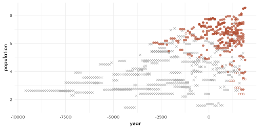


```r
dagify(
  Gs ~ G + Rg,
  Rg ~ W,
  W ~ P,
  P ~ G,
  exposure = "G",
  outcome = "P",
  coords = tibble(name = c("P", "G", "Gs", "W", "Rg"),
                  x = c( 0, .5, 1, .25, .75 ),
                  y = c(1, 1, 1, 0, 0))) %>%
  fortify() %>% 
  mutate(stage = if_else(name == "P", "response",
                         if_else(name %in% c("Gs", "W", "Rg"),
                                 "predictor", "confounds")),
         name = str_replace(name, "Gs","G^'*'") %>% 
           str_replace( "Rg","R[G]")) %>% 
  plot_dag(clr_in = clr_current) +
  coord_fixed(ratio = .35,
              xlim = c(-.1, 1.1),
              ylim = c(-.1, 1.1)) +
  theme(plot.subtitle = element_text(hjust = .5, family = fnt_sel))
```

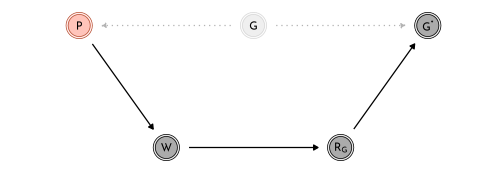


```r
data_gods %>% 
  filter(polity == "Big Island Hawaii") %>% 
  dplyr::select(year, writing,moralizing_gods) %>% 
  t()
```

$$\begin{bmatrix} 1000 &1100 &1200 \\1300 &1400 &1500 \\1600 &1700 &1800 \\0 &0 &0 \\0 &0 &0 \\0 &0 &0 \\NA &NA &NA \\NA &NA &NA \\NA &NA &1 \\ \end{bmatrix}$$

## Categorical Errors and Discrete Absences

### Discrete Cats


```r
dagify(
  Cs ~ C + Rc,
  N ~ C,
  exposure = "Cs",
  outcome = "N",
  coords = tibble(name = c("Rc", "Cs", "C", "N"),
                  x = c( 0, .5, 1, 1.5 ),
                  y = c(0, 0, 0, 0))) %>%
  fortify() %>% 
  mutate(stage = if_else(name == "N", "response",
                         if_else(name %in% c("Cs", "Rc"),
                                 "predictor", "confounds")),
         name = str_replace(name, "Cs","C^'*'") %>% 
           str_replace( "Rc","R[C]")) %>% 
  plot_dag(clr_in = clr_current) +
  coord_fixed(ratio = 1,
              xlim = c(-.1, 1.6),
              ylim = c(-.1, .1)) +
  theme(plot.subtitle = element_text(hjust = .5, family = fnt_sel))
```


$$
\begin{array}{rclr}
N_{i} & \sim & \textrm{Poisson}(\lambda_{i}) & \textrm{[ probability of notes sung ]}\\
\textrm{log}~\lambda_{i} & = & \alpha + \beta~C_{i} & \textrm{[ rate of notes as funtion of cat ]}\\
C_{i} & \sim & \textrm{Bernoulli}(k) & \textrm{[ probability cat is present ]} \\
R_{C, i} & \sim & \textrm{Bernoulli}(r) & \textrm{[ probability of not knowing } C_{i} \textrm{ ]} \\
\end{array}
$$


```r
set.seed(42)

n_houses <- 50
alpha <- 5
beta <- -3
k <- .5
r <- .2

data_cats <- tibble(
  cat = rbern( n_houses, k ),
  notes = rpois( n_houses, alpha + beta * cat ),
  r_c = rbern( n_houses, r ),
  cat_obs = if_else(r_c == 0, cat , -9L)
)
```

The likelihood to observe $N_i$ notes, conditional on $C_i$ is

$$
\begin{array}{rcl}
\textrm{Pr}(N_{i}) & = & (\textrm{probability of cat}) (\textrm{probability of } N_{i} \textrm{ when there is a cat})~+ \\
 & & (\textrm{probability of no cat})  (\textrm{probability of } N_{i} \textrm{ whenthere is no cat}) \\
\textrm{Pr}(N_{i}) & = & \textrm{Pr}(C_{i} = 1)~\textrm{Pr}(N_{i} | C_{i} = 1) + \textrm{Pr}(C_{i} = 0)~\textrm{Pr}(N_{i} | C_{i} = 0) 
\end{array}
$$


```r
model_cat <- ulam(
  flist = alist(
    # singing bird model
    # cat presence is known 
    notes | r_c == 0 ~  poisson(lambda),
    log(lambda) <- alpha + beta * cat_obs,
    
    # cat NA
    notes | r_c == 1 ~ custom(
      log_sum_exp(
        log(k) + poisson_lpmf( notes | exp(alpha + beta)),
        log(1 - k) + poisson_lpmf(notes | exp(alpha)) 
      )
    ),
    # priors
    alpha ~ normal( 0, 1 ),
    beta ~ normal( 0, 0.5 ),
    # sneaking cat model
    cat | r_c == 0 ~ bernoulli(k),
    k ~ beta( 2, 2 )
  ),
  cores = 4,
  chain = 4,
  seed = 42,
  data = data_cats
)
```

$$
\textrm{Pr}(C_{i} = 1 | N_{i} ) =  \frac{\textrm{Pr}(N_{i} | C_{i} = 1 )~\textrm{Pr}(C_{i} = 1)}{\textrm{Pr}(N_{i} | C_{i} = 1)~\textrm{Pr}(C_{i} = 1) + \textrm{Pr}(N_{i} | C_{i} = 0)~\textrm{Pr}(C_{i} = 0)} 
$$


```r
data_cats_list <- data_cats %>% 
  as.list() %>% 
  c(., list(n_houses = n_houses))

model_cat_gq <- ulam(
  flist = alist(
    # singing bird model
    # cat presence is known 
    notes | r_c == 0 ~  poisson(lambda),
    log(lambda) <- alpha + beta * cat_obs,
    
    # cat NA
    notes | r_c == 1 ~ custom(
      log_sum_exp(
        log(k) + poisson_lpmf( notes | exp(alpha + beta)),
        log(1 - k) + poisson_lpmf(notes | exp(alpha)) 
      )
    ),
    # priors
    alpha ~ normal( 0, 1 ),
    beta ~ normal( 0, 0.5 ),
    # sneaking cat model
    cat | r_c == 0 ~ bernoulli(k),
    k ~ beta( 2, 2 ),
    # imputed values
    gq> vector[n_houses]:pr_c1 <- exp(lp_c1) / (exp(lp_c1) + exp(lp_c0)),
    gq> vector[n_houses]:lp_c1 <- log(k) + poisson_lpmf(notes[i] | exp(alpha + beta)),
    gq> vector[n_houses]:lp_c0 <- log(1 - k) + poisson_lpmf(notes[i] | exp(alpha))
  ),
  cores = 4,
  chain = 4,
  seed = 42,
  data = data_cats_list
)
```

Example for a non-binary categorical value (multiple options, eg up to two cats):

```
notes | r_c == 1 ~ custom(
  log_sum_exp(
    binomial_lpmf(2|2, k) + poisson_lpmf( notes | exp(alpha + beta * 2)),
    binomial_lpmf(1|2, k) + poisson_lpmf( notes | exp(alpha + beta * 1)),
    binomial_lpmf(0|2, k) + poisson_lpmf(notes | exp(alpha + beta * 0)) 
  )
```

The extension for multiple categorical variables (eg. cat *and* dog) with missing values expands to the following.

If both cat and dog are NA:

$$
\begin{array}{rcl}
\textrm{Pr}(N_{i}) & = & \textrm{Pr}(C_{i} = 1)~\textrm{Pr}(D_{i} = 1)~\textrm{Pr}(N_{i} | C_{i} = 1, D_{i} = 1)~+\\
&&\textrm{Pr}(C_{i} = 1)~\textrm{Pr}(D_{i} = 0)~\textrm{Pr}(N_{i} | C_{i} = 1, D_{i} = 0)~+ \\
&&\textrm{Pr}(C_{i} = 0)~\textrm{Pr}(D_{i} = 1)~\textrm{Pr}(N_{i} | C_{i} = 0, D_{i} = 1)~+ \\
&&\textrm{Pr}(C_{i} = 0)~\textrm{Pr}(D_{i} = 0)~\textrm{Pr}(N_{i} | C_{i} = 0, D_{i} = 0)
\end{array}
$$

If cat is NA and dog is known present:

$$
\begin{array}{rcl}
\textrm{Pr}(N_{i}) & = & \textrm{Pr}(C_{i} = 1)~\textrm{Pr}(N_{i} | C_{i} = 1, D_{i} = 1) + \textrm{Pr}(C_{i} = 0)~\textrm{Pr}(N_{i} | C_{i} = 0, D_{i} = 1) 
\end{array}
$$

likewise, if dog is NA and cat is known absent:

$$
\begin{array}{rcl}
\textrm{Pr}(N_{i}) & = & \textrm{Pr}(D_{i} = 1)~\textrm{Pr}(N_{i} | C_{i} = 0, D_{i} = 1) + \textrm{Pr}(D_{i} = 0)~\textrm{Pr}(N_{i} | C_{i} = 0, D_{i} = 0) 
\end{array}
$$
(all combinations need to be accounted for though)

---


```r
library(rlang)
chapter15_models <- env(
)

write_rds(chapter15_models, "envs/chapter15_models.rds")
```

## Homework

**E1**

$$
\begin{array}{rcl}
T_{i} & \sim & \textrm{Poisson}(\mu_{i})\\
\textrm{log}~\mu_{i} & = & \alpha + \beta ~ \textrm{log}~P_{\textrm{TRUE},i}\\
P_{\textrm{TRUE}, i} & \sim &  \textrm{Normal}(P_{\textrm{OBS},i}, P_{\textrm{SE}})\\
\alpha & \sim & \textrm{Normal}(0, 1.5)\\
\beta & \sim & \textrm{Normal}(0, 1) \\
P_{SE} & \sim & \textrm{Exponential}(1)
\end{array}
$$

**E2**

$$
\begin{array}{rcl}
T_{i} & \sim & \textrm{Poisson}(\mu_{i})\\
\textrm{log}~\mu_{i} & = & \alpha + \beta ~ P_{\textrm{TRUE},i}\\
P_{\textrm{TRUE}, i} & \sim &  \textrm{Normal}(\overline{P_{\textrm{OBS}}}, P_{\textrm{SE}})\\
\alpha & \sim & \textrm{Normal}(0, 1.5)\\
\beta & \sim & \textrm{Normal}(0, 1) \\
\overline{P_{\textrm{OBS}}} & \sim & \textrm{Normal}(0, 1) \\
P_{SE} & \sim & \textrm{Exponential}(1)
\end{array}
$$

**M1**

$$
\begin{array}{rclr}
K_{i} & \sim & \textrm{Normal}(\mu_{i}, \sigma) & \textrm{[ distribution for outcome }k\textrm{ ]}\\
\mu_{i} & = & \alpha + \beta_{B} \color{#B35136}{B_{i}} + \beta_{M}~\textrm{log} M_{i} & \textrm{[ linear model ]}\\
\color{#B35136}{B_{i}} & \sim & \color{#B35136}{\textrm{Normal}(\nu, \sigma_{B})} & \textrm{[ distribution of obs/missing }B\textrm{ ]}\\
\alpha & \sim & \textrm{Normal}(0,0.5) & \\
\beta_{B} & \sim & \textrm{Normal}(0,0.5) & \\
\beta_{M} & \sim & \textrm{Normal}(0,0.5) & \\
\sigma & \sim & \textrm{Exponential}(1) & \\
\nu & \sim & \textrm{Normal}(0.5, 1) & \\
\sigma_{B} & \sim & \textrm{Exponential}(1) & \\
\end{array}
$$

This imputation model assumes that the data generating process behind brain size in primates is gaussian with the average $\nu$ and a standard deviation of $\sigma_{B}$.
It furthermore assumes that error in measurement is also gaussian, centered on the actual values (0), but with an variance that is equal to the on in the data generating process.
Importantly, the error generating process is assumed to be *random*.

**M2**


```r
data_milk_list2 <- data_milk_full %>%
  dplyr::select(species, kcal_std, 
                neocortex_prop = neocortex.prop, mass_std) %>%
  as.list()

model_primates_beta <- ulam(
  flist = alist(
    kcal_std ~ dnorm( mu, sigma ),
    mu <- alpha + 
      beta_brain * ( neocortex_prop - 0.67 ) +
      beta_mass * mass_std,
    neocortex_prop ~ dbeta2( nu, theta_brain ),
    nu ~ dbeta( 2, 2 ),
    alpha ~ dnorm( 0, 0.5 ),
    beta_brain ~ dnorm( 0, 10 ), 
    beta_mass ~ dnorm( 0, 0.5 ),
    theta_brain ~ dexp(1),
    sigma ~ dexp(1),
    vector[12]:neocortex_prop_impute ~ uniform( 0, 1)
  ),
  data = data_milk_list2,
  cores = 4,
  chains = 4,
  seed = 42
)
```


```r
primates_posterior <- extract.samples(model_primates_beta) %>% 
  as_tibble()

imputed_neocortex <- primates_posterior$neocortex_prop_impute %>% 
  as_tibble() %>% 
  pivot_longer(everything()) %>% 
  group_by(name) %>% 
  summarise(pi = list(tibble(value = quantile(value, probs = c(.055, .25, .5, .75, .955)),
                        label = c("ll", "l", "m", "h", "hh")))) %>%
  mutate(name = str_remove(name, "V") %>%  as.integer()) %>% 
  arrange(name) %>% 
  unnest(pi) %>% 
  pivot_wider(names_from = label, values_from = value) %>% 
  bind_cols(data_milk_full %>% filter(is.na(neocortex.perc)),.)

data_milk_list2 %>% 
  as_tibble() %>% 
  filter(!is.na(neocortex_prop)) %>% 
  ggplot(aes(x = neocortex_prop, y = kcal_std)) +
  geom_pointrange(data = imputed_neocortex,
                  aes(xmin = ll, x = m ,xmax = hh),
                  color = clr0dd, fill = clr0,
                  shape = 21, fatten  = 2.6) +
  geom_point(color = clr_current, size = 1.6)
```

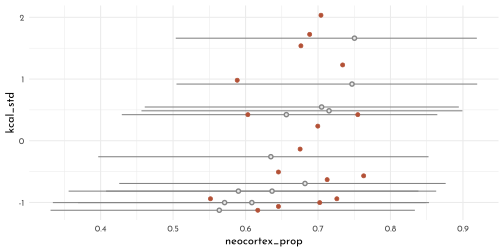

**M3**


```r
model_divorce_double_se <- ulam(
  flist = alist(
    divorce_obs ~ dnorm( divorce_true, divorce_sd * 2.0 ),
    vector[N]:divorce_true ~ dnorm( mu, sigma ),
    mu <- alpha + beta_age * median_age_std + beta_marriage * marriage_std,
    alpha ~ dnorm( 0, 0.2 ),
    beta_age ~ dnorm( 0, 0.5 ),
    beta_marriage ~ dnorm( 0, 0.5 ),
    sigma ~ dexp(1)
  ),
  data = data_waffle_list,
  cores = 4,
  chains = 4,
  log_lik = TRUE
)
```

$\rightarrow$ lots of divergent transitions


```r
model_divorce_double_se_noncentered <- ulam(
  flist = alist(
    divorce_obs ~ dnorm( mu + z_true * sigma, divorce_sd * 2.0 ),
    vector[N]:z_true ~ dnorm( 0, 1 ),
    mu <- alpha + beta_age * median_age_std + beta_marriage * marriage_std,
    alpha ~ dnorm( 0, 0.2 ),
    beta_age ~ dnorm( 0, 0.5 ),
    beta_marriage ~ dnorm( 0, 0.5 ),
    sigma ~ dexp(1)
  ),
  data = data_waffle_list,
  cores = 4,
  chains = 4,
  log_lik = TRUE
)
```


```r
precis(model_divorce) %>% 
  knit_precis()
```


|param         |  mean|   sd|  5.5%| 94.5%|   n_eff| Rhat4|
|:-------------|-----:|----:|-----:|-----:|-------:|-----:|
|alpha         | -0.05| 0.09| -0.20|  0.10| 1585.93|     1|
|beta_age      | -0.61| 0.16| -0.86| -0.36| 1169.42|     1|
|beta_marriage |  0.05| 0.17| -0.21|  0.32| 1014.84|     1|
|sigma         |  0.59| 0.10|  0.43|  0.76|  769.88|     1|

```r
precis(model_divorce_double_se_noncentered) %>% 
  knit_precis()
```


|param         |  mean|   sd|  5.5%| 94.5%|   n_eff| Rhat4|
|:-------------|-----:|----:|-----:|-----:|-------:|-----:|
|alpha         | -0.12| 0.10| -0.28|  0.04| 2738.54|  1.00|
|beta_age      | -0.65| 0.17| -0.91| -0.37| 2324.01|  1.00|
|beta_marriage |  0.19| 0.19| -0.12|  0.48| 2191.71|  1.00|
|sigma         |  0.15| 0.11|  0.01|  0.35|  815.90|  1.01|

**M4**


```r
dagify(
  Z ~ Y,
  Y ~ X,
  exposure = "X",
  outcome = "Y",
  coords = tibble(name = c("X", "Y", "Z"),
                  x = c( 0, .5, 1 ),
                  y = c(0, 0, 0))) %>%
  fortify() %>% 
  mutate(stage = if_else(name == "Y", "response",
                         if_else(name %in% c("Z", "X"),
                                 "predictor", "confounds"))) %>% 
  plot_dag(clr_in = clr_current) +
  coord_fixed(ratio = 1,
              xlim = c(-.1, 1.1),
              ylim = c(-.1, .1)) +
  theme(plot.subtitle = element_text(hjust = .5,
                                     family = fnt_sel))
```


```r
n <- 500
data_sim_dag <- tibble(x = rnorm(n),
                       y = rnorm(n, x),
                       z = rnorm(n , y))

model_sim_dag <- ulam(
  flist =  alist(
    y ~ dnorm( mu , sigma ),
    mu <- alpha + beta_x * x + beta_z * z,
    c(alpha, beta_x, beta_z) ~ dnorm( 0, 1 ),
    sigma ~ dexp(1)
  ),
  data = data_sim_dag,
  chains = 4,
  cores = 4)
```


```r
precis(model_sim_dag) %>% 
  knit_precis()
```


|param  |  mean|   sd|  5.5%| 94.5%|   n_eff| Rhat4|
|:------|-----:|----:|-----:|-----:|-------:|-----:|
|beta_z |  0.45| 0.02|  0.41|  0.48| 1441.44|     1|
|beta_x |  0.51| 0.04|  0.45|  0.57| 1426.12|     1|
|alpha  | -0.01| 0.03| -0.06|  0.04| 1870.59|     1|
|sigma  |  0.72| 0.02|  0.68|  0.75| 1857.25|     1|

**M5**


```r
birds_posterior <- extract.samples(model_cat_gq) %>% 
  as_tibble()

birds_posterior$pr_c1 %>% 
  as_tibble() %>% 
  t() %>% 
  bind_cols(data_cats_list %>% 
              as_tibble() %>% 
  mutate(cat_idx = row_number()), .) %>% 
  pivot_longer(starts_with("..")) %>% 
  group_by(cat_idx) %>% 
  summarise(cat = cat[[1]],
            pi = list(tibble(value = c(quantile(value, probs = c(.055, .25, .5, .75, .955)), mean(value)),
                        labels = c('ll', 'l', 'm', 'h', 'hh', 'mean')))) %>% 
  ungroup() %>% 
  unnest(pi) %>% 
  pivot_wider(names_from = "labels", values_from = "value") %>% 
  mutate(cat_idx = fct_reorder(as.character(cat_idx), mean)) %>% 
  ggplot(aes(x = cat_idx)) +
  geom_linerange(aes(ymin = ll, ymax = hh),
                 color = clr_current, size = .2)+
  geom_point(aes(y = m, shape = factor(cat)),
             color = clr_current, fill = clr_lighten(clr_current, .8)) +
  coord_cartesian(ylim = c(0, 1)) +
  scale_shape_manual(values = c(`0` = 21, `1` = 19), guide = FALSE)
```

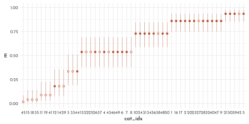

**M6**


```r
n <- 100
data_sim_dog <- tibble(.idx = 1:n,
                       s = rnorm(n),
                       h = rbinom(n, size = 10, inv_logit(s)),
                       d = rbern(n),
                       h_missing = if_else(d == 1, NA_integer_, h))
```


```r
data_sim_dog_list_1 <- data_sim_dog %>% 
  dplyr::select(-.idx) %>% 
  filter(!is.na(h_missing)) %>% 
  as.list()

model_sim_dog_1 <- ulam(
  flist = alist(
    h_missing ~ binomial( 10 , p ),
    logit(p) <- alpha + beta_s * s,
    alpha ~ normal( 0 , 1.5 ),
    beta_s ~ normal( 0 , 0.5 )
  ),
  data = data_sim_dog_list_1,
  chains = 4,
  cores = 4)
```


```r
precis( model_sim_dog_1 ) %>% 
  knit_precis()
```


|param  |  mean|   sd|  5.5%| 94.5%|   n_eff| Rhat4|
|:------|-----:|----:|-----:|-----:|-------:|-----:|
|alpha  | -0.13| 0.10| -0.29|  0.02| 1336.04|     1|
|beta_s |  0.97| 0.12|  0.79|  1.16| 1138.22|     1|


```r
data_sim_dog_list_2 <- data_sim_dog %>% 
  dplyr::select(-.idx) %>% 
  mutate(h_missing = if_else(s > 0, NA_integer_, h)) %>% 
  filter(!is.na(h_missing)) %>% 
  as.list()

model_sim_dog_2 <- ulam(
  flist = alist(
    h_missing ~ binomial( 10 , p ),
    logit(p) <- alpha + beta_s * s,
    alpha ~ normal( 0 , 1.5 ),
    beta_s ~ normal( 0 , 0.5 )
  ),
  data = data_sim_dog_list_2,
  chains = 4,
  cores = 4)
```


```r
precis( model_sim_dog_2 ) %>% 
  knit_precis()
```


|param  |  mean|   sd|  5.5%| 94.5%|  n_eff| Rhat4|
|:------|-----:|----:|-----:|-----:|------:|-----:|
|alpha  | -0.26| 0.13| -0.47| -0.05| 695.29|  1.01|
|beta_s |  0.80| 0.16|  0.55|  1.06| 656.18|  1.01|


```r
n <- 100
data_sim_dog_3 <- tibble(.idx = 1:n,
                       s = rnorm(n),
                       h = rbinom(n, size = 10, inv_logit(s)),
                       d = if_else(h < 5, 1, 0),
                       h_missing = if_else(d == 1, NA_integer_, h),
                       h_dummy = if_else(d == 1, -9L, h))
```


```r
data_sim_dog_list_3 <- data_sim_dog_3 %>% 
  dplyr::select(-.idx) %>% 
  filter(!is.na(h_missing)) %>% 
  as.list()

model_sim_dog_3 <- ulam(
  flist = alist(
    h_missing ~ binomial( 10 , p ),
    logit(p) <- alpha + beta_s * s,
    alpha ~ normal( 0 , 1.5 ),
    beta_s ~ normal( 0 , 0.5 )
  ),
  data = data_sim_dog_list_3,
  chains = 4,
  cores = 4)
```


```r
precis( model_sim_dog_3 ) %>% 
  knit_precis()
```


|param  | mean|   sd| 5.5%| 94.5%|  n_eff| Rhat4|
|:------|----:|----:|----:|-----:|------:|-----:|
|alpha  | 0.42| 0.11| 0.24|  0.59| 929.64|     1|
|beta_s | 0.57| 0.12| 0.37|  0.76| 902.92|     1|


```r
data_sim_dog_list_4 <- data_sim_dog_3 %>% 
  dplyr::select(-.idx, - h_missing) %>% 
   as.list()

stan_sim_dog_4 <- "
data{
int h_dummy[100];
vector[100] s;
}
parameters{
real alpha;
real beta_s;
}
model{
vector[100] p;
beta_s ~ normal( 0 , 0.5 );
alpha ~ normal( 0 , 1.5 );
for ( i in 1:100 ) {
p[i] = alpha + beta_s * s[i];
p[i] = inv_logit(p[i]);
}
for ( i in 1:100 ) {
if ( h_dummy[i] > -1 ) h_dummy[i] ~ binomial( 10 , p[i] );
if ( h_dummy[i] < 0 ) {
vector[5] pv;
for ( j in 0:4 ) pv[j+1] = binomial_lpmf( j | 10 , p[i] );
target += log_sum_exp( pv );
}
}
}
"

model_sim_dog_4 <- stan( model_code = stan_sim_dog_4,
                         data = data_sim_dog_list_4,
                         chains = 4,
                         cores = 4)
```


```r
precis( model_sim_dog_4 ) %>% 
  knit_precis()
```


|param  |  mean|   sd|  5.5%| 94.5%|   n_eff| Rhat4|
|:------|-----:|----:|-----:|-----:|-------:|-----:|
|alpha  | -0.11| 0.08| -0.24|  0.02| 1100.75|     1|
|beta_s |  0.84| 0.10|  0.69|  1.00| 1038.57|     1|


```r
gq_code <- "
generated quantities{
 int H_impute[100];
  for ( i in 1:100 ) {
   real p = inv_logit(alpha + beta_s * s[i]);
   if ( h_dummy[i] > -1 ) H_impute[i] = h_dummy[i];
   if ( h_dummy[i] < 0 ) {
    // compute Pr( h_dummy==j | p , h_dummy < 5 )
    vector[5] lbp;
    real Z;
    for ( j in 0:4 ) lbp[j+1] = binomial_lpmf( j | 10 , p );
    // convert to probabilities by normalizing
    Z = log_sum_exp( lbp );
    for ( j in 1:5 ) lbp[j] = exp( lbp[j] - Z );
    // generate random sample from posterior
    H_impute[i] = categorical_rng( lbp ) - 1;
   }
  }
 }
"

code_new <- concat( stan_sim_dog_4 , gq_code )
model_sim_dog_5 <- stan( model_code = code_new ,
                 data = data_sim_dog_list_4,
                         chains = 4,
                         cores = 4 )
```


```r
sim_dog_5_posterior <- extract.samples(model_sim_dog_5) %>% 
  as_tibble()

sim_dog_5_posterior$H_impute %>% 
  as_tibble() %>% 
  t() %>% 
  bind_cols(data_sim_dog_3,. )  %>% 
              filter(is.na(h_missing)) %>% 
  filter(row_number() < 25) %>% 
  pivot_longer(starts_with('..')) %>% 
  ggplot(aes(x = value)) +
  geom_bar(aes(y = ..count..,
               color = (value == h), fill = after_scale(clr_alpha(color))),
           width = .7) +
  facet_wrap(.idx ~ ., nrow = 4) +
  scale_color_manual(values = c(`TRUE` = clr_current, `FALSE` = clr0d), 
                     guide = FALSE)
```

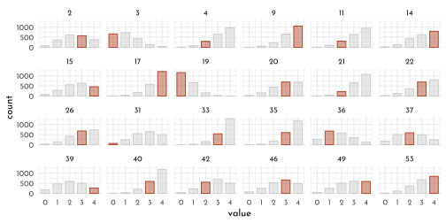

**H1**


```r
data(elephants)

data_elephant <- elephants %>%
  as_tibble() %>% 
  rename_with(everything(), .fn = str_to_lower) %>% 
  mutate(age_cent = age - 20)

data_elephant %>% 
  ggplot(aes(x = age, y = matings)) +
  geom_point(size = 2.5, color = fll_current(), shape = 21,
             fill = clr_alpha(clr_lighten(clr_current)))
```

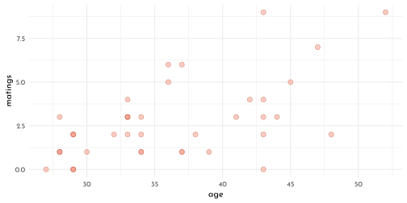

Thinking about the relationship between `age` and `matings`:

Entering the *as is* introduces exponential relationship (caused by the log link):

$$
\textrm{log}~\lambda_{i} = \alpha + \beta A_{i} \Rightarrow \lambda_{i} = \textrm{exp}(\alpha + \beta A_{i}) = \textrm{exp}(\alpha) ~ \textrm{exp}(\beta A_{i})
$$
Alternatively, assuming a logarithmic relationship with increasing / diminishing returns with age (depending if $\beta \gt 1$ or $\beta \lt 1$).

$$
\textrm{log}~\lambda_{i} = \alpha + \textrm{log} \beta A_{i} \Rightarrow \lambda_{i} = \textrm{exp}(\alpha)~A_{i}^{\beta}
$$


```r
model_elephant_logistic <- ulam(
  flist = alist(
    matings ~ dpois(lambda),
    lambda <- exp(alpha) * age_cent ^ beta_age,
    alpha ~ dnorm(0, 1),
    beta_age ~ dnorm(0, 1)
  ),
  data = data_elephant,
  cores = 4,
  chains = 4
)
```


```r
precis(model_elephant_logistic) %>% 
  knit_precis()
```


|param    | mean|   sd|  5.5%| 94.5%|  n_eff| Rhat4|
|:--------|----:|----:|-----:|-----:|------:|-----:|
|alpha    | -1.5| 0.52| -2.30| -0.67| 306.68|     1|
|beta_age |  0.9| 0.18|  0.61|  1.18| 306.55|     1|


```r
new_elephant <- tibble(age_cent = seq(25, 55,
                                 length.out = 31)-20)

elephant_posterior_predict <- link(model_elephant_logistic,
                                   data = new_elephant) %>% 
  as_tibble() %>% 
  t() %>% 
  bind_cols(new_elephant,. ) %>% 
  group_by(age_cent) %>% 
  pivot_longer(-age_cent) %>% 
  summarise(pi = list(tibble(value = quantile(value, prob = c(.055,.5,.955)),
                             label = c("ll","m","hh")))) %>% 
  unnest(pi) %>% 
  pivot_wider(values_from = value, names_from = label) 

p1 <- elephant_posterior_predict %>% 
  ggplot(aes(x = age)) +
  geom_smooth(stat = 'identity',
              aes(x = age_cent + 20, ymin = ll, y = m, ymax = hh),
              color = clr0dd, fill = fll0, size = .4) +
   geom_point(data = data_elephant, aes(y = matings),
              size = 2.5, color = fll_current(), shape = 21,
             fill = clr_alpha(clr_lighten(clr_current)))
```

Including an error-assumption into the model


```r
model_elephant_error <- ulam(
  flist = alist(
    matings ~ dpois(lambda),
    lambda <- exp(alpha) * age_est[i] ^ beta_age,
    age_cent ~ dnorm(age_est, 5),
    vector[41]:age_est ~ dunif(0, 50),
    alpha ~ dnorm(0, 1),
    beta_age ~ dnorm(0, 1)
  ),
  data = data_elephant,
  cores = 4,
  chains = 4
)
```


```r
precis(model_elephant_error) %>% 
  knit_precis()
```


|param    |  mean|   sd|  5.5%| 94.5%|  n_eff| Rhat4|
|:--------|-----:|----:|-----:|-----:|------:|-----:|
|alpha    | -1.31| 0.58| -2.25| -0.39| 975.78|     1|
|beta_age |  0.84| 0.20|  0.52|  1.16| 992.57|     1|


```r
elephant_posterior <- extract.samples(model_elephant_error) %>% 
  as_tibble()

elephant_age_estimates <- elephant_posterior$age_est%>% 
  t()  %>% 
  as_tibble() %>% 
  mutate(elephant_idx = row_number()) %>% 
  pivot_longer(-elephant_idx) %>% 
  group_by(elephant_idx) %>% 
  summarise(pi = list(tibble(value = quantile(value, prob = c(.055, .5, .955)),
                             label = c("ll", "m", "hh")))) %>% 
  unnest(pi) %>% 
  pivot_wider(values_from = value, names_from = label) %>% 
  bind_cols(data_elephant,. ) %>% 
  mutate(jitter = runif(n = n(),-.15, .15))


elephant_error_posterior_predict <- link(model_elephant_error,
                                   data = new_elephant) %>% 
  as_tibble() %>% 
  t() %>% 
  bind_cols(new_elephant,. ) %>% 
  group_by(age_cent) %>% 
  pivot_longer(-age_cent) %>% 
  summarise(pi = list(tibble(value = quantile(value, prob = c(.055,.5,.955)),
                             label = c("ll","m","hh")))) %>% 
  unnest(pi) %>% 
  pivot_wider(values_from = value, names_from = label) 

p2 <- elephant_error_posterior_predict %>% 
  ggplot(aes(x = age)) +
  geom_smooth(stat = 'identity',
              aes(x = age_cent + 20, ymin = ll, y = m, ymax = hh),
              color = clr0dd, fill = fll0, size = .4) +
  
   geom_smooth(data = elephant_posterior_predict,
               stat = 'identity',
              aes(x = age_cent + 20, ymin = ll, y = m, ymax = hh),
              color = clr_lighten(clr_current,.7),
              fill = clr_alpha(clr_lighten(clr_current,.7), .2), size = .4) +
  geom_segment(data = elephant_age_estimates,
               aes(y = matings + jitter, 
                   yend = matings + jitter,
                   xend = m + 20),
               arrow = arrow(type = "closed", length = unit(4, "pt")),
               color = clr0d) +
   geom_point(data = elephant_age_estimates, aes(y = matings + jitter),
              size = 2.5, color = fll_current(), shape = 21,
             fill = clr_alpha(clr_lighten(clr_current))) +
  geom_point(data = elephant_age_estimates,
             aes(x = m + 20, y = matings + jitter))

p1 + p2
```

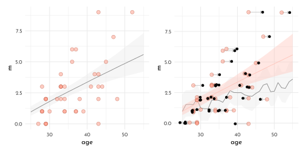

**H2**


```r
model_elephant_error_double <- ulam(
  flist = alist(
    matings ~ dpois(lambda),
    lambda <- exp(alpha) * age_est[i] ^ beta_age,
    age_cent ~ dnorm(age_est, 10),
    vector[41]:age_est ~ dunif(0, 50),
    alpha ~ dnorm(0, 1),
    beta_age ~ dnorm(0, 1)
  ),
  data = data_elephant,
  cores = 4,
  chains = 4
)

model_elephant_error_quad <- ulam(
  flist = alist(
    matings ~ dpois(lambda),
    lambda <- exp(alpha) * age_est[i] ^ beta_age,
    age_cent ~ dnorm(age_est, 20),
    vector[41]:age_est ~ dunif(0, 50),
    alpha ~ dnorm(0, 1),
    beta_age ~ dnorm(0, 1)
  ),
  data = data_elephant,
  cores = 4,
  chains = 4
)

model_elephant_error_100 <- ulam(
  flist = alist(
    matings ~ dpois(lambda),
    lambda <- exp(alpha) * age_est[i] ^ beta_age,
    age_cent ~ dnorm(age_est, 40),
    vector[41]:age_est ~ dunif(0, 100),
    alpha ~ dnorm(0, 1),
    beta_age ~ dnorm(0, 1)
  ),
  data = data_elephant,
  cores = 4,
  chains = 4
)
```


```r
precis(model_elephant_error_double) %>% 
  knit_precis()
```


|param    |  mean|   sd|  5.5%| 94.5%|  n_eff| Rhat4|
|:--------|-----:|----:|-----:|-----:|------:|-----:|
|alpha    | -1.10| 0.56| -2.02| -0.24| 657.24|  1.01|
|beta_age |  0.75| 0.19|  0.46|  1.03| 662.25|  1.01|

```r
precis(model_elephant_error_quad) %>% 
  knit_precis()
```


|param    |  mean|   sd|  5.5%| 94.5%|  n_eff| Rhat4|
|:--------|-----:|----:|-----:|-----:|------:|-----:|
|alpha    | -0.97| 0.56| -1.87| -0.08| 677.29|  1.01|
|beta_age |  0.66| 0.18|  0.38|  0.94| 662.11|  1.01|

```r
precis(model_elephant_error_100) %>% 
  knit_precis()
```


|param    |  mean|   sd|  5.5%| 94.5%|  n_eff| Rhat4|
|:--------|-----:|----:|-----:|-----:|------:|-----:|
|alpha    | -0.95| 0.61| -1.97|  0.01| 767.41|     1|
|beta_age |  0.56| 0.17|  0.31|  0.83| 754.71|     1|


**H3**


```r
set.seed(100)
data_impute <- tibble(x = c(rnorm(10), NA),
       y = c(rnorm(10, x), 100))

precis( lm(y ~ x, data_impute) ) %>% 
  knit_precis()
```


|param       | mean|   sd|  5.5%| 94.5%|
|:-----------|----:|----:|-----:|-----:|
|(Intercept) | 0.24| 0.28| -0.20|  0.68|
|x           | 1.42| 0.52|  0.59|  2.26|

$$
\begin{array}{rcl}
y_{i} & \sim & \textrm{Normal}(\mu_{i}, \sigma)\\
\mu_{i} & = & \alpha + \beta x_{i}\\
x_{i} & \sim & \textrm{Normal}(0, 1)\\
\alpha & \sim & \textrm{Normal}(0, 1)\\
\beta & \sim & \textrm{Normal}(0, 100)\\
\sigma & \sim & \textrm{Exponential}(1)\\
\end{array}
$$


```r
model_impute <- ulam(
  flist = alist(
    y ~ dnorm(mu, sigma),
    mu <- alpha + beta * x,
    x ~ dnorm(0, 1),
    c( alpha, beta ) ~ dnorm(0, 100),
    sigma ~ dexp(1)
  ),
  data = data_impute,
  chains = 4,
  cores = 4,
  iter = 4000,
  control = list(adapt_delta = .99)
)
```


```r
precis(model_impute, depth = 2) %>% 
  knit_precis()
```


|param       |  mean|   sd|  5.5%| 94.5%|   n_eff| Rhat4|
|:-----------|-----:|----:|-----:|-----:|-------:|-----:|
|beta        | 21.74| 3.60| 16.68| 28.12| 2820.88|     1|
|alpha       |  2.20| 2.97| -2.40|  6.96| 3706.15|     1|
|sigma       |  9.44| 1.90|  6.81| 12.85| 2962.53|     1|
|x_impute[1] |  3.85| 0.70|  2.74|  5.00| 2561.12|     1|


```r
extract.samples(model_impute) %>% 
  as_tibble() %>% 
ggpairs(     lower = list(continuous = wrap(my_lower, col = clr_dark)),
        diag = list(continuous = wrap(my_diag, fill = fll0,
                                      col = clr_dark, adjust = .7)),
        upper = list(continuous = wrap(my_upper ,
          size = 3, col = "black", family = fnt_sel)) ) +
    theme(panel.border = element_rect(color = clr_dark, fill = "transparent"))
```

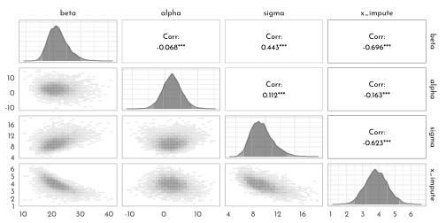


```r
new_impute <- seq(-4, 4, length.out = 31)

impute_summary_prep <-  extract.samples(model_impute) %>% 
  as_tibble() %>% 
  mutate(case = c('positive', 'negative')[2 - (beta > 0)])

impute_summary <-impute_summary_prep %>% 
  mutate(mu = map2(alpha, beta,
                   function(a, b){
           tibble(x = new_impute,
                  y = a + b * new_impute)})) %>% 
  unnest(mu) %>% 
  group_by(case, x) %>% 
  summarise(pi = list(tibble(value = quantile(y, prob = c(.055,.5,.955)),
                             label = c("ll","m","hh")))) %>% 
  unnest(pi) %>% 
  pivot_wider(values_from = value, names_from = label) 

impute_summary %>% 
  ggplot() +
  geom_smooth(stat = 'identity',
              aes(x = x, ymin = ll, y = m ,ymax = hh),
               size = .3, color = clr0dd, fill = fll0)+
  geom_point(data = impute_summary_prep %>%
               group_by(case) %>%
               summarise( x_impute = mean(x_impute)) %>% 
               mutate(y = data_impute$y[is.na(data_impute$x)]),
             aes(x = x_impute, y = y),
             shape = 21,
             color = clr_current, 
             fill = fll_current(), size = 2) +
  geom_point(data = data_impute,aes(x = x, y = y ),
             shape = 21, color = clr0d, fill = fll0, size = 1.5) +
  facet_wrap(case ~ .) +
  coord_cartesian(ylim = c(0, 100))
```

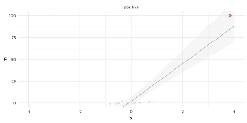

**H4**


```r
data(Primates301)

data_primates <- Primates301 %>% 
  as_tibble() %>% 
  dplyr::select(name, brain, body) %>% 
  filter(complete.cases(brain),
         complete.cases(body)) %>% 
  mutate(across(.cols = brain:body,
                .fns = function(x){x / max(x)},
                .names = "{.col}_scl"),
         across(.cols = brain_scl:body_scl,
                .fns = function(x){x * .1},
                .names = "{.col}_se"))
```

Modeling with the relationship

$$
\begin{array}{rcl}
B_{i} & \sim & \textrm{Log-Normal}(\mu_{i}, \sigma)\\
\mu_{i} & = \alpha + \beta~\textrm{log} M_{i}
\end{array}
$$
which implies

$$
E(B_{i}|M_{i}) = \textrm{exp}(\alpha) M_{i}^{\beta}
$$


```r
model_primates_error_prep <- ulam(
  flist = alist(
    brain_scl ~ dlnorm(mu, sigma),
    mu <- alpha + beta * log(body_scl),
    alpha ~ normal( 0, 1 ),
    beta ~ normal( 0, 1 ),
    sigma ~ exponential(1)
  ),
  data = data_primates,
  chains = 4,
  cores = 4
)
```


```r
precis(model_primates_error_prep) %>% 
  knit_precis()
```


|param | mean|   sd| 5.5%| 94.5%|   n_eff| Rhat4|
|:-----|----:|----:|----:|-----:|-------:|-----:|
|alpha | 0.43| 0.06| 0.33|  0.53|  534.36|     1|
|beta  | 0.78| 0.01| 0.76|  0.81|  535.80|     1|
|sigma | 0.29| 0.02| 0.27|  0.32| 1079.64|     1|


```r
data_primates_list <- data_primates %>% 
  as.list() %>% 
  c(., n_b = length(data_primates$name))

model_primates_error <- ulam(
  flist = alist(
  # brain model
  brain_scl ~ normal( brain_true, brain_scl_se ),
  vector[n_b]:brain_true ~ dlnorm( mu, sigma ),
  mu <- alpha + beta * log( body_true[i] ),
  # body model
  body_scl ~ normal( body_true, body_scl_se ),
  vector[n_b]:body_true ~ normal( 0.5, 1 ),
  # priors
  alpha ~ normal( 0, 1 ),
  beta ~ normal( 0, 1 ),
  sigma ~ exponential(1)
  ),
  data = data_primates_list,
  start=list( body_true = data_primates_list$body_scl,
              brain_true = data_primates_list$brain_scl ),
  cores = 4,
  chains = 4,
  control = list(max_treedepth = 15)
)
```


```r
precis(model_primates_error) %>% 
  knit_precis()
```


|param | mean|   sd| 5.5%| 94.5%|   n_eff| Rhat4|
|:-----|----:|----:|----:|-----:|-------:|-----:|
|alpha | 0.41| 0.06| 0.32|  0.51| 2564.35|     1|
|beta  | 0.78| 0.01| 0.76|  0.81| 2591.35|     1|
|sigma | 0.26| 0.02| 0.23|  0.29| 3159.17|     1|


```r
primates_posterior <- extract.samples(model_primates_error) %>% 
  as_tibble()

p1 <- ggplot() +
  (primates_posterior[1:50, ] %>%
     dplyr::select(alpha, beta) %>% 
     pmap(.f = function(alpha, beta, ...){
       stat_function(fun = function(x){
         exp(alpha) * x ^ beta
       },
       xlim = c(0, 1),
       geom = 'line',
       color = fll0dd, size = .2)
     })) +
  geom_point(data = data_primates,
             aes(x = body_scl, y = brain_scl),
             color = clr_current, fill = fll_current(),
             shape = 21) +
  coord_cartesian(ylim = c(0, 1))
```


```r
primate_estimates <- primates_posterior$brain_true %>% 
  t() %>% 
  as_tibble() %>% 
  mutate(.idx = row_number()) %>% 
  pivot_longer(-.idx, values_to = 'brain_scl') %>% 
  left_join(primates_posterior$body_true %>% 
  t() %>% 
  as_tibble() %>% 
  mutate(.idx = row_number()) %>% 
  pivot_longer(-.idx, values_to = 'body_scl') ) %>% 
  group_by(.idx) %>% 
  summarise(pi = list(tibble(brain_val = quantile(brain_scl, prob = c(.05, .5, .955)),
                             body_val = quantile(body_scl, prob = c(.05, .5, .955)),
                             label = c("ll","m","hh")))) %>% 
  unnest(pi) %>% 
  pivot_wider(names_from = label, values_from = c(brain_val, body_val))


p2 <- tibble(body_scl = seq(0, 1, length.out = 101)) %>% 
  mutate(brain_scl = map_dbl(body_scl,
                             function(x){
                               mean( exp(primates_posterior$alpha) * x ^ primates_posterior$beta )
                             })) %>% 
  ggplot(aes(x = body_scl, y = brain_scl)) +
  geom_line(color = clr0dd) +
  geom_point(data = primate_estimates,
             aes(x = body_val_m,
                 y = brain_val_m),
             color = clr_current, fill = fll_current(),
             shape = 21) +
  geom_point(data = data_primates,
             color = clr0dd, fill = fll0,
             shape = 21, size = 1.75) +
  coord_cartesian(ylim = c(0, 1.05))
```


```r
p3 <- primates_posterior$brain_true %>% 
  t() %>% 
  as_tibble() %>% 
  mutate(.idx = row_number()) %>% 
  pivot_longer(-.idx, values_to = 'brain_scl') %>% 
  left_join(primates_posterior$body_true %>% 
  t() %>% 
  as_tibble() %>% 
  mutate(.idx = row_number()) %>% 
  pivot_longer(-.idx, values_to = 'body_scl') ) %>% 
  ggplot(aes(x = body_scl, y = brain_scl)) +
  stat_ellipse(aes(group = .idx),
               level = .5,
               geom = 'polygon',
               color = clr0d, fill = fll0)  +
 geom_point(data = primate_estimates,
             aes(x = body_val_m,
                 y = brain_val_m),
             color = clr_current, fill = fll_current(),
             shape = 21) 

p1 + p2 + p3
```

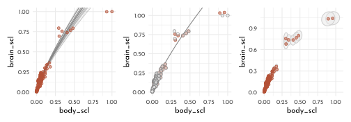

**H5**


```r
Primates301 %>% 
  as_tibble() %>% 
  summarise(across(everything(),
                   function(x){sum(is.na(x))})) %>% 
  t() %>% 
  as.data.frame() %>% 
  rownames_to_column(var = "column") %>% 
  rename(n_na = V1) %>% 
  as_tibble()
```

```
#> # A tibble: 16 × 2
#>    column               n_na
#>    <chr>               <int>
#>  1 name                    0
#>  2 genus                   0
#>  3 species                 0
#>  4 subspecies            267
#>  5 spp_id                  0
#>  6 genus_id                0
#>  7 social_learning        98
#>  8 research_effort       115
#>  9 brain                 117
#> 10 body                   63
#> 11 group_size            114
#> 12 gestation             161
#> 13 weaning               185
#> 14 longevity             181
#> 15 sex_maturity          194
#> 16 maternal_investment   197
```

```r
data_primates_2 <- Primates301 %>% 
  as_tibble() %>% 
  dplyr::select(name, brain, body) %>% 
  filter(complete.cases(body)) %>% 
  mutate(across(.cols = brain:body,
                .fns = function(x){x / max(x, na.rm = TRUE)},
                .names = "{.col}_scl"))


data_primates_2 %>% 
  ggplot(aes(x = body_scl, y = is.na(brain_scl))) +
  geom_point(color = clr0dd, fill = fll0,
             shape = 21, size = 2) +
  coord_cartesian(ylim = c(.9,2.1),
                  xlim = c(-.1, 1.1),
                  expand = 0)
```

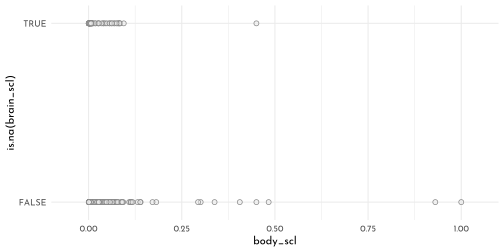


```r
dagify(
  Bs ~ B + Rb,
  Rb ~ M,
  B ~ M,
  exposure = "M",
  outcome = "Bs",
  coords = tibble(name = c("M", "B", "Rb", "Bs"),
                  x = c( 0, 1, 0, 1 ),
                  y = c(1, 1, 0, 0))) %>%
  fortify() %>% 
  mutate(stage = if_else(name == "Bs", "response",
                         if_else(name %in% c("M", "Rb", "Rg"),
                                 "predictor", "confounds")),
         name = str_replace(name, "Bs","B^'*'") %>% 
           str_replace( "Rb","R[B]")) %>% 
  plot_dag(clr_in = clr_current) +
  coord_fixed(ratio = .75,
              xlim = c(-.1, 1.1),
              ylim = c(-.1, 1.1)) +
  theme(plot.subtitle = element_text(hjust = .5,
                                     family = fnt_sel))
```

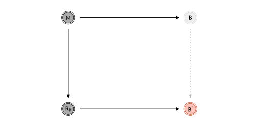


```r
data_primates_2_list <- data_primates_2 %>% 
  dplyr::select(brain_scl, body_scl) %>% 
  as.list()

model_primates_missing_default <- ulam(
  flist = alist(
    brain_scl ~ dlnorm( mu, sigma ),
    mu <- alpha + beta * log( body_scl ),
    alpha ~ normal( 0, 1 ),
    beta ~ normal( 0, 1 ),
    sigma ~ exponential(1)
  ),
  data = data_primates_2_list,
  cores = 4,
  chains = 4,
  start = list( brain_scl_impute = rep( .5, 56 ))
)

model_primates_missing_explicit <- ulam(
  flist = alist(
    brain_scl_merge ~ dlnorm( mu, sigma ),
    mu <- alpha + beta * log( body_scl ),
    brain_scl_merge <- merge_missing( brain_scl, brain_scl_impute ),
    alpha ~ normal( 0, 1 ),
    beta ~ normal( 0, 1 ),
    sigma ~ exponential(1)
  ),
  data = data_primates_2_list,
  cores = 4,
  chains = 4,
  start = list( brain_scl_impute = rep( .5, 56 ))
)
```


```r
precis(model_primates_missing_default) %>% 
  knit_precis()
```


|param | mean|   sd| 5.5%| 94.5%|   n_eff| Rhat4|
|:-----|----:|----:|----:|-----:|-------:|-----:|
|alpha | 0.43| 0.06| 0.34|  0.52|  825.24|     1|
|beta  | 0.78| 0.01| 0.76|  0.81|  972.83|     1|
|sigma | 0.29| 0.02| 0.27|  0.32| 1495.86|     1|

```r
precis(model_primates_missing_explicit) %>% 
  knit_precis()
```


|param | mean|   sd| 5.5%| 94.5%|   n_eff| Rhat4|
|:-----|----:|----:|----:|-----:|-------:|-----:|
|alpha | 0.43| 0.06| 0.33|  0.52| 1148.76|     1|
|beta  | 0.78| 0.01| 0.76|  0.81| 1184.11|     1|
|sigma | 0.29| 0.02| 0.27|  0.32| 1843.00|     1|


```r
data_primates_3_list <-  data_primates %>% 
  dplyr::select(name, brain_scl, body_scl ) %>% 
  as.list()

model_primates_missing_complete_cases <- ulam(
  flist = alist(
    brain_scl ~ dlnorm( mu, sigma ),
    mu <- alpha + beta * log( body_scl ),
    alpha ~ normal( 0, 1 ),
    beta ~ normal( 0, 1 ),
    sigma ~ exponential(1)
  ),
  data = data_primates_3_list,
  cores = 4,
  chains = 4,
  start = list( brain_scl_impute = rep( .5, 56 ))
)
```


```r
precis(model_primates_missing_complete_cases) %>% 
  knit_precis()
```


|param | mean|   sd| 5.5%| 94.5%|  n_eff| Rhat4|
|:-----|----:|----:|----:|-----:|------:|-----:|
|alpha | 0.43| 0.06| 0.34|  0.52| 776.91|     1|
|beta  | 0.78| 0.01| 0.76|  0.81| 751.27|     1|
|sigma | 0.29| 0.02| 0.27|  0.32| 984.91|     1|


```r
primates_impute_posterior <- extract.samples(model_primates_missing_default) %>% 
  as_tibble()

primates_impute_posterior$brain_scl_impute %>% 
  t() %>% 
  as_tibble() %>% 
  mutate(impute_idx = row_number()) %>% 
  pivot_longer(-impute_idx) %>% 
  group_by(impute_idx) %>% 
  summarise(pi = list(tibble(value = quantile(value, prob = c(.055, .25, .5, .75, .955)),
                             label = c("ll", "l", "m", "h", "hh")))) %>% 
  unnest(pi) %>% 
  pivot_wider(values_from = value, names_from = label) %>%
  bind_cols(data_primates_2 %>% 
              filter(is.na(brain_scl)) %>% 
                       dplyr::select(name, body_scl),.) %>% 
  ggplot(aes(x = body_scl)) +
  geom_point(data = data_primates_2,
             aes(y = brain_scl),
             color = clr0dd, fill = fll0, 
             shape = 21) +
  geom_linerange(aes(ymin = l, ymax = h),
                 color = clr_current) +
  geom_point(aes(y = m), color = clr_current,
             fill = clr_lighten(clr_current), shape = 21)
```

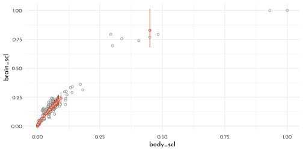

**H6**


```r
data_waffle

model_waffle_init <- ulam(
  flist = alist(
    divorce_obs ~ dnorm( divorce_true, divorce_sd ),
    vector[N]: divorce_true ~ dnorm( mu, sigma ),
    mu <- alpha + beta_age * median_age_std + beta_marriage * marriage_true[i],
    marriage_std ~ dnorm( marriage_true, marriage_sd ),
    vector[N]:marriage_true ~ dnorm(mu_marriage, sigma_marriage),
    mu_marriage <- alpha_marriage + beta_marriage_age *  median_age_std,
    c( alpha, alpha_marriage ) ~ dnorm( 0 ,.2 ),
    c( beta_age, beta_marriage, beta_marriage_age) ~ dnorm( 0, .5 ),
    sigma ~ dexp(1),
    sigma_marriage ~ dexp(1)
  ),
  data = data_waffle_list,
  cores = 4,
  chains = 4
)
```


```r
precis(model_waffle_init) %>% 
  knit_precis()
```


|param             |  mean|   sd|  5.5%| 94.5%|   n_eff| Rhat4|
|:-----------------|-----:|----:|-----:|-----:|-------:|-----:|
|alpha_marriage    | -0.11| 0.08| -0.23|  0.01| 2269.42|  1.00|
|alpha             | -0.03| 0.10| -0.19|  0.13| 1812.57|  1.00|
|beta_marriage_age | -0.67| 0.09| -0.81| -0.53| 1910.76|  1.00|
|beta_marriage     |  0.30| 0.25| -0.10|  0.70|  975.00|  1.00|
|beta_age          | -0.46| 0.19| -0.76| -0.17| 1335.99|  1.00|
|sigma             |  0.56| 0.11|  0.40|  0.74|  678.12|  1.00|
|sigma_marriage    |  0.44| 0.07|  0.34|  0.56| 1015.78|  1.01|


```r
precis(model_divorce_error_out) %>% 
  knit_precis()
```


|param         |  mean|   sd|  5.5%| 94.5%|   n_eff| Rhat4|
|:-------------|-----:|----:|-----:|-----:|-------:|-----:|
|alpha         | -0.04| 0.10| -0.20|  0.12| 1038.56|     1|
|beta_age      | -0.54| 0.16| -0.78| -0.28|  983.30|     1|
|beta_marriage |  0.20| 0.21| -0.13|  0.53|  766.98|     1|
|sigma         |  0.57| 0.11|  0.41|  0.75|  570.34|     1|


```r
get_inferred_true_val <- function(model){
  mod <- rlang::enexpr(model)
  
  extract.samples(model) %>% 
  as_tibble() %>% 
  pluck("marriage_true") %>% 
  as_tibble() %>% 
  t() %>% 
  as_tibble() %>% 
  mutate(.idx = row_number()) %>% 
  pivot_longer(-.idx) %>% 
  mutate(model = as.character(mod))
}

ls_states <- c("DC", "DE", "HI")

p1 <- get_inferred_true_val(model_divorce_error_out) %>% 
  bind_rows(get_inferred_true_val(model_waffle_init) ) %>%
  group_by(.idx, model) %>% 
  summarise(mean = mean(value)) %>% 
  pivot_wider(values_from = mean, names_from = model) %>%
  bind_cols(data_waffle %>% dplyr::select(Loc),. ) %>% 
  ggplot() +
  geom_abline(slope = 1, intercept = 0, linetype = 3, color = clr_dark) +
  geom_point(aes(x = model_divorce_error_out,
                 y = model_waffle_init),
             color = clr0dd, fill = fll0, 
             shape = 21) +
  ggrepel::geom_text_repel(
    data = . %>%  
      filter(Loc %in% ls_states),
    aes(x = model_divorce_error_out,
                 y = model_waffle_init,
                 label = Loc))


p2 <- data_waffle_list  %>%
  bind_cols(data_waffle %>% dplyr::select(Loc),. ) %>% 
  as_tibble() %>% 
  ggplot(aes(x = median_age_std, y = marriage_std)) +
  geom_point(aes(color = Loc %in% ls_states,
                 fill = after_scale(clr_alpha(clr_lighten(color), .3))),
                 shape = 21) +
  scale_color_manual(values = c(`TRUE` = clr_current,
                            `FALSE` = clr0dd),
                     guide = FALSE)

p1 + p2
```

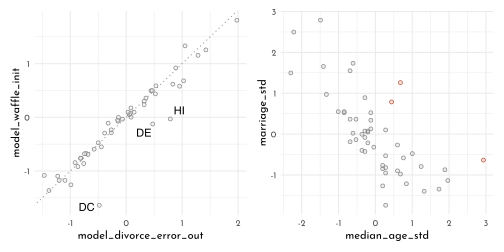


**H7**


```r
data_andrew <- tibble(freq = c( 18 , 19 , 22 , NA , NA , 19 , 20 , 22 ),
       value = seq_along(freq)) %>% 
  dplyr::select(value, freq)

sum(data_andrew$freq, na.rm = TRUE)
```

```
#> [1] 120
```

Parameterizing the number of spins above 120,using a Poisson distribution with a mean of 40:

$$
S \sim \textrm{Poisson}(40) + 120
$$

```r
p <- rdirichlet(1e3, alpha = rep(4, 8))
p1 <- p %>% 
  as_tibble() %>% 
  mutate(.idx = row_number()) %>% 
  pivot_longer(-.idx, 
               names_prefix = "V",
               names_transform = as.integer,
               names_to = "value",
               values_to = "probability")   %>% 
  filter(.idx < 9) %>% 
  ggplot(aes(x = value, y = probability)) +
  geom_line(aes(group = .idx), color = clr0dd,
            size = .4, linetype = 3) +
  geom_point(color = clr0dd, fill = clr0, shape = 21)
```


```r
twicer <- function( p ) {
  o <- order( p )
  if ( p[o][8]/p[o][1] > 2 ) return( TRUE ) else return( FALSE )
}
sum( apply( p , 1 , twicer ) )
```

```
#> [1] 976
```

```r
p <- rdirichlet( 1e3 , alpha = rep(50, 8) )
sum( apply( p , 1 , twicer ) )
```

```
#> [1] 15
```

```r
p2 <- p %>% 
  as_tibble() %>% 
  mutate(.idx = row_number()) %>% 
  pivot_longer(-.idx, 
               names_prefix = "V",
               names_transform = as.integer,
               names_to = "value",
               values_to = "probability")  %>% 
  filter(.idx < 9) %>% 
  ggplot(aes(x = value, y = probability)) +
  geom_line(aes(group = .idx), color = clr0dd,
            size = .4, linetype = 3) +
  geom_point(color = clr0dd, fill = clr0, shape = 21)

p1 + p2 & 
  coord_cartesian(ylim = c(0, .35))
```

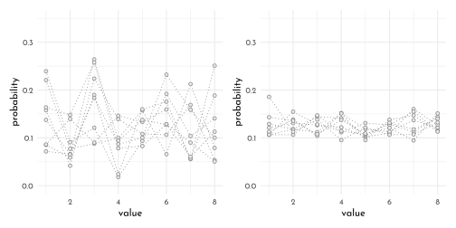


```r
code_andrew <- '
data{
  int N;
  int y[N];
  int y_max; // consider at most this many spins for y4 and y5
  int S_mean;
}
parameters{
  simplex[N] p;
  // probabilities of each outcome
}
model{
  vector[(1+y_max)*(1+y_max)] terms;
  int k = 1;
  p ~ dirichlet( rep_vector(50,N) );
  // loop over possible values for unknown cells 4 and 5
  // this code updates posterior of p
  for ( y4 in 0:y_max ) {
    for ( y5 in 0:y_max ) {
      int Y[N] = y;
      Y[4] = y4;
      Y[5] = y5;
      terms[k] = poisson_lpmf(y4+y5|S_mean-120) + multinomial_lpmf(Y|p);
      k = k + 1;
    }//y5
  }//y4
  target += log_sum_exp(terms);
}
generated quantities{
  matrix[y_max+1,y_max+1] P45; // prob y4,y5 takes joint values
  // now compute Prob(y4,y5|p)
  {
    matrix[(1+y_max),(1+y_max)] terms;
    int k = 1;
    real Z;
    for ( y4 in 0:y_max ) {
      for ( y5 in 0:y_max ) {
        int Y[N] = y;
        Y[4] = y4;
        Y[5] = y5;
        terms[y4+1,y5+1] = poisson_lpmf(y4+y5|S_mean-120) + multinomial_lpmf(Y|p);
      }//y5
    }//y4
    Z = log_sum_exp( to_vector(terms) );
    for ( y4 in 0:y_max )
      for ( y5 in 0:y_max )
        P45[y4+1,y5+1] = exp( terms[y4+1,y5+1] - Z );
  }
}
'

y <- c(18, 19, 22, -1,
       -1, 19, 20, 22)

data_andrew_list <- list(
  N = length(y),
  y = y,
  S_mean = 160,
  y_max = 40 )

model_andrew <- stan(
  model_code = code_andrew,
  data = data_andrew_list,
  chains = 4,
  cores = 4 )
```


```r
andrew_posterior <- extract.samples(model_andrew) %>% 
  as_tibble()

y_max <- data_andrew_list$y_max

extract_k <- function(y4, y5, posterior){
  k <- mean( posterior$P45[,y4+1,y5+1] )/0.01 
  tibble( x = y4 , y = y5 , k = k )
}

andrew_k <- crossing(y4 = 0:y_max, y5 = 0:y_max) %>% 
  pmap_df(extract_k, posterior = andrew_posterior)

p1 <- andrew_k %>% 
  filter(between(x,10, 30),
         between(y,10, 30)) %>% 
  ggplot(aes(x , y, color = k)) +
  geom_point(shape = 21,
             size = 3,
             aes(fill = after_scale(clr_alpha(color,.8))))+
  labs(subtitle = " dirichlet( rep_vector(50, N) )")
```


```r
code_andrew2 <- '
data{
  int N;
  int y[N];
  int y_max; // consider at most this many spins for y4 and y5
  int S_mean;
}
parameters{
  simplex[N] p;
  // probabilities of each outcome
}
model{
  vector[(1+y_max)*(1+y_max)] terms;
  int k = 1;
  p ~ dirichlet( rep_vector(2,N) );
  // loop over possible values for unknown cells 4 and 5
  // this code updates posterior of p
  for ( y4 in 0:y_max ) {
    for ( y5 in 0:y_max ) {
      int Y[N] = y;
      Y[4] = y4;
      Y[5] = y5;
      terms[k] = poisson_lpmf(y4+y5|S_mean-120) + multinomial_lpmf(Y|p);
      k = k + 1;
    }//y5
  }//y4
  target += log_sum_exp(terms);
}
generated quantities{
  matrix[y_max+1,y_max+1] P45; // prob y4,y5 takes joint values
  // now compute Prob(y4,y5|p)
  {
    matrix[(1+y_max),(1+y_max)] terms;
    int k = 1;
    real Z;
    for ( y4 in 0:y_max ) {
      for ( y5 in 0:y_max ) {
        int Y[N] = y;
        Y[4] = y4;
        Y[5] = y5;
        terms[y4+1,y5+1] = poisson_lpmf(y4+y5|S_mean-120) + multinomial_lpmf(Y|p);
      }//y5
    }//y4
    Z = log_sum_exp( to_vector(terms) );
    for ( y4 in 0:y_max )
      for ( y5 in 0:y_max )
        P45[y4+1,y5+1] = exp( terms[y4+1,y5+1] - Z );
  }
}
'

model_andrew2 <- stan(
  model_code = code_andrew2,
  data = data_andrew_list,
  chains = 4,
  cores = 4 )
```


```r
andrew_posterior2 <- extract.samples(model_andrew2) %>% 
  as_tibble()

andrew_k2 <- crossing(y4 = 0:y_max, y5 = 0:y_max) %>% 
  pmap_df(extract_k, posterior = andrew_posterior2)

p2 <- andrew_k2 %>% 
  filter(between(x,0, 40),
         between(y,0, 40)) %>% 
  ggplot(aes(x , y, color = k)) +
  geom_point(shape = 21,
             size = 1,
             aes(fill = after_scale(clr_alpha(color,.8)))) +
  labs(subtitle = " dirichlet( rep_vector(2, N) )")

p1 + p2 &
  scale_color_gradientn(colours = c(clr0, clr_current),
                        guide = "none") &
  labs(x = "number of 4s",
       y = "number of 5s") &
  coord_equal()
```

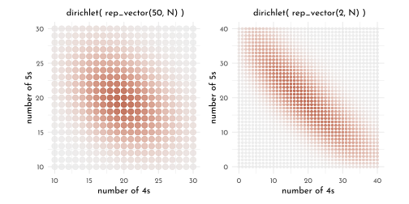


## {brms} section

### Measurement Error

#### Error on the Outcome

> *With __brms__, we accommodate measurement error in the criterion using the `mi()` syntax, following the general form `<response> | mi(<se_response>)`. This follows a missing data logic, resulting in Bayesian missing data imputation for the criterion values. The `mi()` syntax is based on the missing data capabilities for __brms__, which we will cover in greater detail in the second half of this chapter.*


```r
data_waffle_brms <- data_waffle %>% 
  dplyr::select(Loc, divorce_obs = divorce_std,
                divorce_sd, marriage_std,
                median_age_std, marriage_sd)

brms_c15_model_divorce <- brm(
  data = data_waffle_brms, 
  family = gaussian,
  divorce_obs | mi(divorce_sd) ~ 1 +
    median_age_std +
    marriage_std,
  prior = c(prior(normal(0, 0.2), class = Intercept),
            prior(normal(0, 0.5), class = b),
            prior(exponential(1), class = sigma)),
  iter = 2000, warmup = 1000,
  cores = 4, chains = 4,
  seed = 42,
  # note this line
  save_pars = save_pars(latent = TRUE),
  file = "brms/brms_c15_model_divorce")

print(brms_c15_model_divorce)
```

```
#>  Family: gaussian 
#>   Links: mu = identity; sigma = identity 
#> Formula: divorce_obs | mi(divorce_sd) ~ 1 + median_age_std + marriage_std 
#>    Data: data_waffle_brms (Number of observations: 50) 
#>   Draws: 4 chains, each with iter = 2000; warmup = 1000; thin = 1;
#>          total post-warmup draws = 4000
#> 
#> Population-Level Effects: 
#>                Estimate Est.Error l-95% CI u-95% CI Rhat Bulk_ESS Tail_ESS
#> Intercept         -0.06      0.09    -0.24     0.13 1.00     4477     3324
#> median_age_std    -0.61      0.16    -0.92    -0.29 1.00     3686     3307
#> marriage_std       0.06      0.16    -0.26     0.39 1.00     3389     3273
#> 
#> Family Specific Parameters: 
#>       Estimate Est.Error l-95% CI u-95% CI Rhat Bulk_ESS Tail_ESS
#> sigma     0.58      0.11     0.39     0.81 1.00     1278     1962
#> 
#> Draws were sampled using sampling(NUTS). For each parameter, Bulk_ESS
#> and Tail_ESS are effective sample size measures, and Rhat is the potential
#> scale reduction factor on split chains (at convergence, Rhat = 1).
```

```r
posterior_summary(brms_c15_model_divorce) %>% 
  round(digits = 2) %>% 
  as.data.frame() %>% 
  rownames_to_column(var = "param") %>% 
  as_tibble()
```

```
#> # A tibble: 55 × 5
#>    param            Estimate Est.Error  Q2.5 Q97.5
#>    <chr>               <dbl>     <dbl> <dbl> <dbl>
#>  1 b_Intercept         -0.06      0.09 -0.24  0.13
#>  2 b_median_age_std    -0.61      0.16 -0.92 -0.29
#>  3 b_marriage_std       0.06      0.16 -0.26  0.39
#>  4 sigma                0.58      0.11  0.39  0.81
#>  5 Yl[1]                1.16      0.37  0.46  1.9 
#>  6 Yl[2]                0.69      0.56 -0.41  1.78
#>  7 Yl[3]                0.42      0.35 -0.25  1.13
#>  8 Yl[4]                1.41      0.46  0.52  2.32
#>  9 Yl[5]               -0.9       0.13 -1.16 -0.65
#> 10 Yl[6]                0.66      0.41 -0.15  1.48
#> # … with 45 more rows
```


```r
states <- c("AL", "AR", "ME", "NH", "RI", "DC", "VT",
            "AK", "SD", "UT", "ID", "ND", "WY")

divorce_est <- posterior_summary(brms_c15_model_divorce) %>% 
  data.frame() %>% 
  rownames_to_column("term") %>% 
  as_tibble() %>% 
  mutate(divorce_est = Estimate) %>% 
  dplyr::select(term, divorce_est) %>% 
  filter(str_detect(term, "Yl")) %>% 
  bind_cols(data_waffle_brms)

p1 <- divorce_est %>%
  ggplot(aes(x = divorce_sd,
             y = divorce_est - divorce_obs)) +
  geom_hline(yintercept = 0, linetype = 3,
             color = clr_dark) +
  geom_point(color = clr0dd, fill = clr0, shape = 21) +
  ggrepel::geom_text_repel(data = . %>% 
                             filter(Loc %in% states),  
                           aes(label = Loc), 
                           size = 3, seed = 15,
                           family = fnt_sel)

library(tidybayes)
states <- c("AR", "ME", "RI", "ID", "WY", "ND", "MN")


p2 <- as_draws_df(brms_c15_model_divorce) %>%
  as_tibble() %>% 
  expand(nesting(b_Intercept, b_median_age_std),
         median_age_std = seq(from = -3.5, to = 3.5, length.out = 50)) %>% 
  mutate(fitted = b_Intercept +
           b_median_age_std * median_age_std) %>% 
  
  ggplot(aes(x = median_age_std)) +
  stat_lineribbon(aes(y = fitted),
                  .width = .89, size = .2,
                  color = clr0dd, fill = fll0) +
  geom_segment(data = divorce_est,
               aes(xend = median_age_std,
                   y = divorce_obs, yend = divorce_est),
               size = .2) +
  geom_point(data = divorce_est,
             aes(y = divorce_obs),
             color = clr0dd,
             shape = 19) +
  geom_point(data = divorce_est,
             aes(y = divorce_est),
             shape = 21,
             size = 2,
             color = clr0dd, fill = "white",
             stroke = .4) +
  ggrepel::geom_text_repel(data = data_waffle_brms %>%
                             filter(Loc %in% states),  
                  aes(y = divorce_obs, label = Loc), 
                  size = 3, seed = 15, family = fnt_sel) +
  labs(x = "median age marriage (std)",
       y = "divorce rate (std)") +
  coord_cartesian(xlim = range(data_waffle_brms$median_age_std), 
                  ylim = range(data_waffle_brms$divorce_obs))

p1 + p2
```

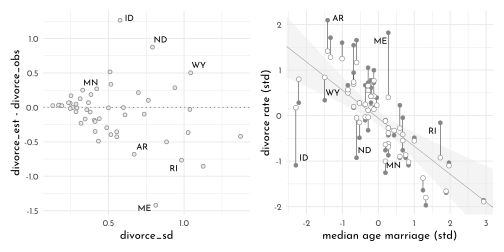

#### Error on Both Outcome and Predictor


```r
brms_c15_model_divorce_error_out <- brm(
  data = data_waffle_brms, 
  family = gaussian,
  divorce_obs | mi(divorce_sd) ~ 1 +
    median_age_std +
    me(marriage_std, marriage_sd),
  prior = c(prior(normal(0, 0.2), class = Intercept),
            prior(normal(0, 0.5), class = b),
            prior(normal(0, 1), class = meanme),
            prior(exponential(1), class = sigma)),
  iter = 2000, warmup = 1000,
  cores = 4, chains = 4,
  seed = 42,
  # note this line
  save_pars = save_pars(latent = TRUE),
  file = "brms/brms_c15_model_divorce_error_out")

posterior_summary(brms_c15_model_divorce_error_out) %>%
 round(digits = 2) %>% 
  as.data.frame() %>% 
  rownames_to_column(var = "param") %>%
  as_tibble()
```

```
#> # A tibble: 107 × 5
#>    param                         Estimate Est.Error  Q2.5 Q97.5
#>    <chr>                            <dbl>     <dbl> <dbl> <dbl>
#>  1 b_Intercept                      -0.03      0.1  -0.22  0.16
#>  2 b_median_age_std                 -0.52      0.16 -0.82 -0.21
#>  3 bsp_memarriage_stdmarriage_sd     0.26      0.22 -0.17  0.69
#>  4 sigma                             0.55      0.11  0.35  0.79
#>  5 Yl[1]                             1.13      0.38  0.39  1.86
#>  6 Yl[2]                             0.72      0.54 -0.29  1.81
#>  7 Yl[3]                             0.43      0.33 -0.21  1.1 
#>  8 Yl[4]                             1.45      0.47  0.54  2.4 
#>  9 Yl[5]                            -0.9       0.13 -1.15 -0.65
#> 10 Yl[6]                             0.71      0.4  -0.05  1.53
#> # … with 97 more rows
```


```r
pull_estimate <- function(model, term_q){
  posterior_summary(model) %>% 
           data.frame() %>% 
           rownames_to_column("term") %>% 
           filter(str_detect(term, term_q)) %>% 
           pull(Estimate)
}

full_join(
  # D
  data_waffle_brms %>%
  dplyr::select(Loc, divorce_obs) %>% 
    mutate(marriage_est = pull_estimate(brms_c15_model_divorce_error_out,
                               "Yl")) %>% 
    pivot_longer(-Loc, values_to = "divorce") %>% 
    mutate(name = if_else(name == "divorce_obs",
                          "observed", "posterior")),
  # M
    data_waffle_brms %>%
  dplyr::select(Loc, marriage_std) %>% 
    mutate(marriage_est = pull_estimate(brms_c15_model_divorce_error_out,
                               "Xme_")) %>% 
    pivot_longer(-Loc, values_to = "marriage") %>% 
    mutate(name = if_else(name == "marriage_std",
                          "observed", "posterior")),
  by = c("Loc", "name"))  %>% 
  ggplot(aes(x = marriage, y = divorce)) +
  geom_line(aes(group = Loc),
            size = .2, color = clr0dd) +
  geom_point(aes(shape = name),
              color = clr0dd,  fill = clr0) +
  scale_shape_manual(values = c(observed = 21, posterior = 19), guide = "none") +
  labs(subtitle = "Shrinkage of both divorce rate and marriage rate")
```

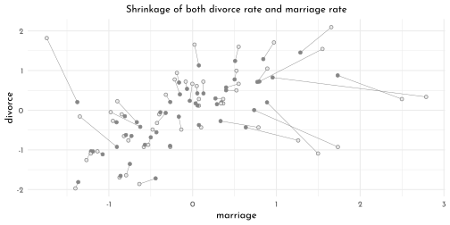

####  Measurement Terrors


```r
data_sim
```

```
#> # A tibble: 500 × 4
#>        age marriage divorce  age_obs
#>      <dbl>    <dbl>   <dbl>    <dbl>
#>  1 -0.172     1.14   0.536  -0.231  
#>  2 -0.564    -1.09  -0.477  -1.24   
#>  3  0.252    -0.922 -0.326  -0.746  
#>  4  0.0798   -1.20  -0.696  -0.113  
#>  5  0.818    -2.20   1.99    0.160  
#>  6 -0.164     1.05   0.143   0.698  
#>  7  0.797     0.413  1.37   -1.88   
#>  8  0.435    -2.03  -1.03    1.51   
#>  9 -0.254    -0.484 -0.240  -0.00495
#> 10 -0.0502   -0.287 -0.0359 -0.800  
#> # … with 490 more rows
```

> *To get a sense of the havoc ignoring measurement error can cause, we’ll fit to models. These aren’t in the text, but, you know, let’s live a little. The first model will include `age`, the true predictor for `divorce`. The second model will include `age_obs` instead, the version of `age` with measurement error added in.*


```r
# the model with age containing no measurement error
brms_c15_model_sim_a <- brm(
  data = data_sim, 
  family = gaussian,
  divorce ~ 1 + age + marriage,
  prior = c(prior(normal(0, 0.2), class = Intercept),
            prior(normal(0, 0.5), class = b),
            prior(exponential(1), class = sigma)),
  iter = 2000, warmup = 1000,
  cores = 4, chains = 4,
  seed = 42,
  # note this line
  save_pars = save_pars(latent = TRUE),
  file = "brms/brms_c15_model_sim_a")

# The model where age has measurement error, but we ignore it
brms_c15_model_sim_b <- brm(
  data = data_sim, 
  family = gaussian,
  divorce ~ 1 + age_obs + marriage,
  prior = c(prior(normal(0, 0.2), class = Intercept),
            prior(normal(0, 0.5), class = b),
            prior(exponential(1), class = sigma)),
  iter = 2000, warmup = 1000,
  cores = 4, chains = 4,
  seed = 42,
  # note this line
  save_pars = save_pars(latent = TRUE),
  file = "brms/brms_c15_model_sim_b")

bind_rows(posterior_summary(brms_c15_model_sim_a) %>%
            data.frame() %>%
            rownames_to_column("term") %>% 
            mutate(model = "model_a"),
          posterior_summary(brms_c15_model_sim_b) %>%
            data.frame() %>%
            rownames_to_column("term") %>% 
            mutate(model = "model_b")) %>% 
  filter(term != "lp__") %>% 
  mutate(term = str_remove(term,"_obs") %>% 
           str_remove("b_") %>% 
           factor(levels = c("Intercept",
                             "age",
                             "marriage",
                             "sigma"))) %>% 
  ggplot(aes(x = Estimate, y = model)) +
  geom_vline(xintercept = 0, linetype = 3,
             color = clr_dark) +
  geom_pointrange(aes(xmin = Q2.5, xmax = Q97.5,
                      color = model)) +
  scale_color_manual(values = c(model_a = clr0dd,
                                model_b = clr0d),
                     guide = "none") +
  labs(x = "marginal posterior",
       y = NULL) +
  facet_wrap(~ term, ncol = 1) +
  theme(panel.background = element_rect(fill = "transparent",
                                        color = clr0d))
```

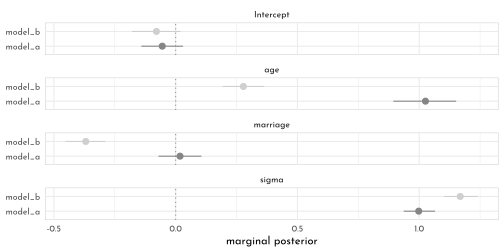

### Missing Data

#### DAG Ate my Homework


```r
data_homework_c_brms <- data_homework_c %>% 
  as_tibble()

p1 <- data_homework_c_brms %>% 
  ggplot(aes(x = study, y = homework)) +
  geom_point(color = fll0dd) +
  scale_y_continuous(breaks = 1:10) +
  labs(subtitle = "true distribution")

p2 <- data_homework_c_brms %>% 
  ggplot(aes(x = study, y = homework_missing)) +
  geom_point(color = fll0dd) +
  scale_y_continuous(breaks = 1:10) +
  labs(subtitle = "missing conditional on x")

p1 + p2
```

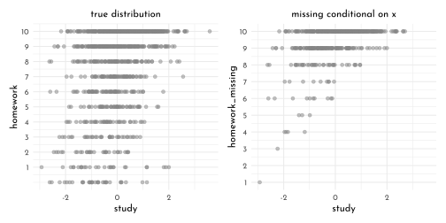


```r
brms_c15_model_hw_full <- brm(
  data = data_homework_c_brms,
  family = binomial,
  homework | trials(10) ~ 1 + study,
  prior = c(prior(normal(0, 1), class = Intercept),
            prior(normal(0, 0.5), class = b)),
  iter = 2000, warmup = 1000, 
  chains = 4, cores = 4,
  seed = 42,
  file = "brms/brms_c15_model_hw_full")

mixedup::extract_fixef(brms_c15_model_hw_full)
```

```
#> # A tibble: 2 × 5
#>   term      value    se lower_2.5 upper_97.5
#>   <chr>     <dbl> <dbl>     <dbl>      <dbl>
#> 1 Intercept 1.25  0.025     1.20       1.30 
#> 2 study     0.609 0.026     0.558      0.661
```

```r
brms_c15_model_hw_missing <- brm(
  data = data_homework_c_brms %>%
    filter(dog == 0),
  family = binomial,
  homework | trials(10) ~ 1 + study,
  prior = c(prior(normal(0, 1), class = Intercept),
            prior(normal(0, 0.5), class = b)),
  iter = 2000, warmup = 1000, 
  chains = 4, cores = 4,
  seed = 42,
  file = "brms/brms_c15_model_hw_missing")

mixedup::extract_fixef(brms_c15_model_hw_missing)
```

```
#> # A tibble: 2 × 5
#>   term      value    se lower_2.5 upper_97.5
#>   <chr>     <dbl> <dbl>     <dbl>      <dbl>
#> 1 Intercept 3.06  0.076     2.92        3.21
#> 2 study     0.895 0.063     0.775       1.02
```


```r
data_homework_c_brms2 <- data_homework_c_brms %>% 
  mutate(dog = ifelse(abs(x) < 1, 1, 0)) %>%
  mutate(homework_missing = ifelse(dog == 1, NA_integer_, homework))

p1 <- data_homework_c_brms2 %>% 
  ggplot(aes(x = study, y = homework)) +
  geom_point(color = fll0dd) +
  scale_y_continuous(breaks = 1:10) +
  labs(subtitle = "true distribution")

p2 <- data_homework_c_brms2 %>% 
  ggplot(aes(x = study, y = homework_missing)) +
  geom_point(color = fll0dd) +
  scale_y_continuous(breaks = 1:10) +
  labs(subtitle = "missing conditional on x")

p1 + p2
```

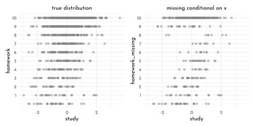


```r
brms_c15_model_hw_missing2 <- brm(
  data = data_homework_c_brms2 %>%
    filter(dog == 0),
  family = binomial,
  homework | trials(10) ~ 1 + study,
  prior = c(prior(normal(0, 1), class = Intercept),
            prior(normal(0, 0.5), class = b)),
  iter = 2000, warmup = 1000, 
  chains = 4, cores = 4,
  seed = 42,
  file = "brms/brms_c15_model_hw_missing2")

mixedup::extract_fixef(brms_c15_model_hw_missing2)
```

```
#> # A tibble: 2 × 5
#>   term      value    se lower_2.5 upper_97.5
#>   <chr>     <dbl> <dbl>     <dbl>      <dbl>
#> 1 Intercept 0.731 0.038     0.655      0.807
#> 2 study     0.354 0.039     0.28       0.431
```

#### Imputing primates


```r
data_milk_brms <- data_milk_full %>% 
  dplyr::select(species, kcal_std,
                neocortex_std, mass_std)
```

> *When writing a multivariate model in __brms__, I find it easier to save the model code by itself and then insert it into the `brm()` function. Otherwise, things start to feel cluttered.*


```r
# here's the primary `k` model
b_model <- bf(kcal_std ~ 1 +
                mi(neocortex_std) +
                mass_std) + 
  # here's the model for the missing `b` data 
  bf(neocortex_std | mi() ~ 1) + 
  # here we set the residual correlations for the two models to zero
  set_rescor(FALSE)
```

> *Note the` mi(neocortex_std)` syntax in the `kcal_std` model. This indicates that the predictor, `neocortex_std`, has missing values that are themselves being modeled. To get a sense of how to specify the priors for such a model in __brms__, use the `get_prior()` function.*


```r
get_prior(data = data_milk_brms, 
          family = gaussian,
          b_model)
```

```
#>                    prior     class            coef group         resp dpar
#>                   (flat)         b                                        
#>                   (flat) Intercept                                        
#>                   (flat)         b                            kcalstd     
#>                   (flat)         b        mass_std            kcalstd     
#>                   (flat)         b mineocortex_std            kcalstd     
#>  student_t(3, -0.3, 2.5) Intercept                            kcalstd     
#>     student_t(3, 0, 2.5)     sigma                            kcalstd     
#>   student_t(3, 0.2, 2.5) Intercept                       neocortexstd     
#>     student_t(3, 0, 2.5)     sigma                       neocortexstd     
#>  nlpar bound       source
#>                   default
#>                   default
#>              (vectorized)
#>              (vectorized)
#>              (vectorized)
#>                   default
#>                   default
#>                   default
#>                   default
```


```r
brms_c15_model_primates_imputed <- brm(
  data = data_milk_brms, 
  family = gaussian,
  b_model,  # here we insert the model
  prior = c(prior(normal(0, 0.5), class = Intercept, resp = kcalstd),
            prior(normal(0, 0.5), class = Intercept, resp = neocortexstd),
            prior(normal(0, 0.5), class = b,         resp = kcalstd),
            prior(exponential(1), class = sigma,     resp = kcalstd),
            prior(exponential(1), class = sigma,     resp = neocortexstd)),
  iter = 2000, warmup = 1000,
  chains = 4, cores = 4,
  seed = 42,
  file = "brms/brms_c15_model_primates_imputed")
```


```r
mixedup::extract_fixef(brms_c15_model_primates_imputed)
```

```
#> # A tibble: 4 × 5
#>   term                     value    se lower_2.5 upper_97.5
#>   <chr>                    <dbl> <dbl>     <dbl>      <dbl>
#> 1 kcalstd_Intercept        0.027 0.162    -0.303      0.345
#> 2 neocortexstd_Intercept  -0.045 0.21     -0.46       0.36 
#> 3 kcalstd_mass_std        -0.526 0.209    -0.93      -0.093
#> 4 kcalstd_mineocortex_std  0.473 0.242    -0.018      0.935
```

```r
posterior_summary(brms_c15_model_primates_imputed) %>%
  round(digits = 2) %>% 
  as.data.frame() %>% 
  rownames_to_column(var = "param") %>% 
  as_tibble()
```

```
#> # A tibble: 19 × 5
#>    param                       Estimate Est.Error   Q2.5  Q97.5
#>    <chr>                          <dbl>     <dbl>  <dbl>  <dbl>
#>  1 b_kcalstd_Intercept             0.03      0.16  -0.3    0.34
#>  2 b_neocortexstd_Intercept       -0.05      0.21  -0.46   0.36
#>  3 b_kcalstd_mass_std             -0.53      0.21  -0.93  -0.09
#>  4 bsp_kcalstd_mineocortex_std     0.47      0.24  -0.02   0.93
#>  5 sigma_kcalstd                   0.86      0.15   0.61   1.18
#>  6 sigma_neocortexstd              1.02      0.18   0.74   1.41
#>  7 Ymi_neocortexstd[2]            -0.54      0.96  -2.42   1.34
#>  8 Ymi_neocortexstd[3]            -0.66      0.99  -2.6    1.29
#>  9 Ymi_neocortexstd[4]            -0.68      0.96  -2.55   1.25
#> 10 Ymi_neocortexstd[5]            -0.27      0.92  -2.06   1.58
#> 11 Ymi_neocortexstd[9]             0.46      0.93  -1.35   2.28
#> 12 Ymi_neocortexstd[14]           -0.15      0.93  -1.9    1.74
#> 13 Ymi_neocortexstd[15]            0.21      0.9   -1.55   2.02
#> 14 Ymi_neocortexstd[17]            0.26      0.92  -1.57   2.1 
#> 15 Ymi_neocortexstd[19]            0.48      0.94  -1.38   2.31
#> 16 Ymi_neocortexstd[21]           -0.43      0.92  -2.21   1.4 
#> 17 Ymi_neocortexstd[23]           -0.28      0.93  -2.1    1.64
#> 18 Ymi_neocortexstd[26]            0.14      0.94  -1.75   1.94
#> 19 lp__                          -81.6       4.03 -90.6  -74.9
```


```r
as_draws_df(brms_c15_model_primates_imputed) %>% 
  dplyr::select(starts_with("Ymi_neocortex")) %>% 
  set_names(filter(data_milk_brms,
                   is.na(neocortex_std)) %>%
              pull(species)) %>% 
  pivot_longer(everything(),
               names_to = "species") %>% 
  ggplot(aes(x = value, 
             y = reorder(species, value))) +
  stat_slab(fill = fll0, height = 1.5,
            slab_color = clr0dd, slab_size = .2) +
  labs(x = "imputed values for b",
       y = NULL) +
  theme(axis.text.y = element_text(hjust = 0, face = 'italic'),
        axis.ticks.y = element_blank())
```

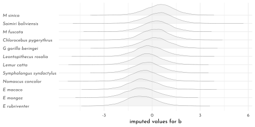


```r
brms_c15_model_primates_drop_na <- brm(
  data = data_milk_brms, 
  family = gaussian,
  kcal_std ~ 1 + neocortex_std + mass_std,
  prior = c(prior(normal(0, 0.5), class = Intercept),
            prior(normal(0, 0.5), class = b),
            prior(exponential(1), class = sigma)),
  iter = 2000, warmup = 1000,
  chains = 4, cores = 4,
  seed = 42,
  file = "brms/brms_c15_model_primates_drop_na")
```

```
#> Warning message:
#> Rows containing NAs were excluded from the model. 
```


```r
bind_rows(fixef(brms_c15_model_primates_imputed) %>%
            data.frame() %>%
            rownames_to_column("term") %>% 
            mutate(fit  ="primates_imputed"),
          fixef(brms_c15_model_primates_drop_na) %>%
            data.frame() %>%
            rownames_to_column("term") %>%  
            mutate(fit  = "primates_drop_na")) %>% 
  slice(c(4:3, 6:7)) %>%
  mutate(term = term %>%
           str_remove("kcalstd_") %>%
           str_remove("^mi") )%>% 
  ggplot(aes(x = Estimate, y = fit)) +
  geom_vline(xintercept = 0, linetype = 3,
             color = clr_dark) +
  geom_pointrange(aes(xmin = Q2.5, xmax = Q97.5),
                  color = clr0dd, fill = clr0,
                  shape = 21, stroke = .6) +
  facet_wrap(. ~ term, ncol = 1) +
  labs(x = "marginal posterior",
       y = NULL) +
  theme(axis.ticks.y = element_blank(),
        strip.background = element_rect(color = "transparent", fill = "transparent"),
        panel.background = element_rect(fill = 'transparent',
                                        color = clr0d))
```

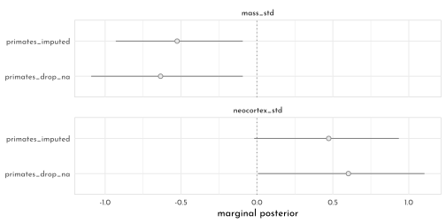


```r
data_milk_brms_imputed <- data_milk_brms %>% 
  mutate(row = row_number()) %>% 
  left_join(
    posterior_summary(brms_c15_model_primates_imputed) %>%
      data.frame() %>% 
      rownames_to_column("term") %>% 
      filter(str_detect(term, "Ymi")) %>% 
      mutate(row = str_extract(term, "(\\d)+") %>%
               as.integer()),
    by = "row") 

p1 <- data_milk_brms_imputed %>% 
  ggplot(aes(y = kcal_std)) +
   geom_pointrange(aes(x = Estimate,
                      xmin = Q2.5, xmax = Q97.5),
                  shape = 21, size = .5, stroke = .75,
                  color = clr_dark, fill = clr0) +
   geom_point(aes(x = neocortex_std),
             color = clr0d) +
  labs(x = "neocortex percent (std)",
       y = "kcal milk (std)") +
  coord_cartesian(xlim = range(data_milk_brms_imputed$neocortex_std, na.rm = T))

p2 <- data_milk_brms_imputed %>% 
  ggplot(aes(x = mass_std)) +
    geom_pointrange(aes(y = Estimate,
                      ymin = Q2.5, ymax = Q97.5),
                  shape = 21, size = .5, stroke = .75,
                  color = clr_dark, fill = clr0) +
  geom_point(aes(y = neocortex_std),
             color = clr0d) +
  labs(x = "log body mass (std)",
       y = "neocortex percent (std)") +
  coord_cartesian(ylim = range(data_milk_brms_imputed$neocortex_std, na.rm = T))

p1 + p2
```

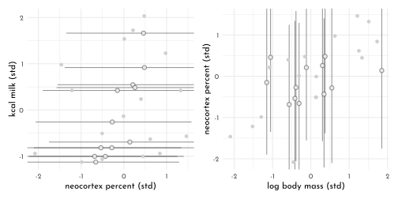


```r
b_model <- mvbf(
  bf(kcal_std ~ 1 + mi(neocortex_std) + mass_std), 
  bf(neocortex_std | mi() ~ 1 + mass_std), 
  rescor = FALSE)

brms_c15_model_primates_impute_covar <- brm(
  data = data_milk_brms, 
  family = gaussian,
  b_model,
  prior = c(prior(normal(0, 0.5), class = Intercept, resp = kcalstd),
            prior(normal(0, 0.5), class = Intercept, resp = neocortexstd),
            prior(normal(0, 0.5), class = b, resp = kcalstd),
            prior(normal(0, 0.5), class = b, resp = neocortexstd),
            prior(exponential(1), class = sigma,     resp = kcalstd),
            prior(exponential(1), class = sigma,     resp = neocortexstd)),
  iter = 2000, warmup = 1000,
  chains = 4, cores = 4,
  seed = 42,
  file = "brms/brms_c15_model_primates_impute_covar")

data_milk_brms_imputed2 <- data_milk_brms %>% 
   mutate(row = row_number()) %>% 
  left_join(
    posterior_summary(brms_c15_model_primates_impute_covar) %>% 
      data.frame() %>% 
      rownames_to_column("term") %>% 
      filter(str_detect(term, "Ymi")) %>% 
      mutate(row = str_extract(term, "(\\d)+") %>% as.integer()),
    by = "row"
  )

p1 <- data_milk_brms_imputed2 %>% 
  ggplot(aes(y = kcal_std)) +
   geom_pointrange(aes(x = Estimate,
                      xmin = Q2.5, xmax = Q97.5),
                  shape = 21, size = .5, stroke = .75,
                  color = clr_dark, fill = clr0) +
   geom_point(aes(x = neocortex_std),
             color = clr0d) +
  labs(x = "neocortex percent (std)",
       y = "kcal milk (std)") +
  coord_cartesian(xlim = range(data_milk_brms_imputed$neocortex_std, na.rm = T))

p2 <- data_milk_brms_imputed2 %>% 
  ggplot(aes(x = mass_std)) +
    geom_pointrange(aes(y = Estimate,
                      ymin = Q2.5, ymax = Q97.5),
                  shape = 21, size = .5, stroke = .75,
                  color = clr_dark, fill = clr0) +
  geom_point(aes(y = neocortex_std),
             color = clr0d) +
  labs(x = "log body mass (std)",
       y = "neocortex percent (std)") +
  coord_cartesian(ylim = range(data_milk_brms_imputed$neocortex_std, na.rm = T))

p1 + p2
```

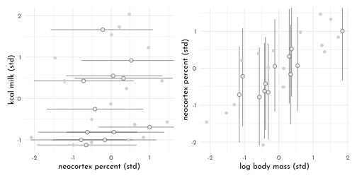

### Categorical Errors and Discrete Absences

#### Discrete Cats

> 😢 *Sadly, this is as far as I’m going in this section. I still haven’t made sense of McElreath’s __weighted average__ approach to missing data and I’m not sure whether it’s even possible with __brms__.*

## pymc3 section

---

<div id="myModal" class="modal">
  <span class="close">&times;</span>
  
  <div id="caption"></div>
</div>

<script src="./js/zoom.js"></script>
