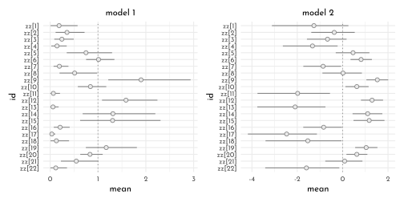
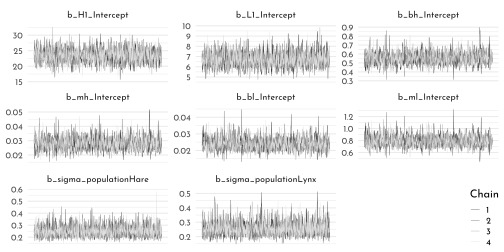

---
output:
  html_document:
  theme: yeti
pdf_document: default
editor_options: 
  chunk_output_type: console
---

# Rethinking: Chapter 16

**Generalized Linear Madness**


by [Richard McElreath](https://xcelab.net/rm/statistical-rethinking/), building on the Summaries by [Solomon Kurz](https://bookdown.org/content/4857/).

## Geometric People


### The Scientific Model

<div class="figure" style="text-align: center">

<p class="caption">(\#fig:unnamed-chunk-1)The 'Vitruvian Can' model of human weight as a function of height.</p>
</div>

The formula for a the volume of a cylinder, with radius as constant proportion of height:

$$
\begin{array}{crl}
V & = & \pi~r^{2} h\\
 & = & \pi~(ph)^{2}h\\
 & = & \pi~p^{2}h^{3}
\end{array}
$$

Weight as proportion of volume:

$$
\begin{array}{crl}
W & = & kV \\
 & = & k~\pi~p^{2}h^{3} 
\end{array}
$$

### The Statistical Model

$$
\begin{array}{rclr}
W_{i} & \sim & \textrm{Log-Normal}(\mu_{i}, \sigma) & \textrm{[distribution of weight]}\\
\textrm{exp}(\mu_{i}) & = & k~\pi~p^{2} h_{i}^{3} & \textrm{[expected median weight]}\\
k & \sim & some~prior & \textrm{[prior relation between weight and volume]}\\
p & \sim & some~prior & \textrm{[prior proportionality of radius to height]}\\
\sigma & \sim & \textrm{Exponential}(1) & \textrm{[our old friend, sigma]}
\end{array}
$$
Since $p$ and $k$ are multiplied in the model they are not *identifiable* by the data.

Using a compound parameter $\theta = kp^{2}$ will prohibit the choice of informed priors, so replacing $k$ and $p$ will not help.

Thinking about the typical shape of humans lead to the choice of the prior for $p$ that is greater than 0 and less than 1, with most of the mass below 0.5 (as most people are less than half as wide as they are tall):

$$
p \sim \textrm{Beta}(2, 18)
$$

The parameter $k$ is simply a conversion of arbitrary *measurement scales* (height to weight).
To assign a prior for $k$ we could look up the typical value for this relationship, *or* we can get rid of the measurement scales by factoring the scales out (here by dividing by a reference value - here, the means of weight and height). 


```r
library(rethinking)
data(Howell1)

data_howell <- Howell1 %>% 
  as_tibble() %>% 
  mutate(across(height:weight,
                .fns = function(x){x/mean(x)},
                .names = "{.col}_norm"))
```

Thinking about the reference case helps with finding a prior, which suggests that $k$ should be greater than 1 (because $p \lt 0.5$):

$$
1 = k~\pi~p^{2}1^{3}
$$

Thus, we choose 

$$
k \sim \textrm{Exponential}(0.5)
$$
Now, for the model:


```r
model_weight <- ulam(
  flist = alist(
    weight_norm ~ dlnorm( mu, sigma ),
    exp( mu ) <- 3.141593 * k * p^2 * height_norm ^ 3,
    p ~ beta( 2, 18 ),
    k ~ exponential( 0.5 ),
    sigma ~ exponential( 1 )
  ),
  data = data_howell,
  chains = 4,
  cores = 4
)
```


```r
p1 <- extract.samples(model_weight) %>% 
  as_tibble() %>% 
  dplyr::select(-sigma) %>% 
  ggpairs( lower = list(continuous = wrap(ggally_points, colour = clr_current,
                                          size = 1.5, alpha = .7)),
           diag = list(continuous = wrap(my_diag, fill = fll0, col = clr1,
                                         color = clr0d, adjust = .7)),
           upper = list(continuous = wrap(my_upper , size = 5,
                                          color = "black", family = fnt_sel)) ) +
  theme(panel.border = element_rect(color = clr_dark, fill = "transparent"))


new_height <- tibble( height_norm = seq(0, max(data_howell$height_norm), length.out = 31))

p2 <- sim(model_weight, data = new_height) %>% 
  t() %>% 
  as_tibble() %>% 
  mutate(idx = row_number()) %>% 
  pivot_longer(-idx) %>% 
  group_by(idx) %>% 
  summarise(pi = list(tibble(value = quantile(value, prob = c(.055, .5, .955)),
                             label = c("ll", "m", "hh")))) %>% 
  unnest(pi) %>% 
  pivot_wider(names_from = label, values_from = value) %>% 
  bind_cols(new_height) %>%
  mutate(across(ll:hh, function(x){x / max(data_howell$weight_norm)}, .names = "{.col}_scl"),
         height_scl = height_norm /  max(data_howell$height_norm)) %>% 
  ggplot(aes(x = height_scl)) +
  geom_smooth(stat = "identity",
              aes(ymin = ll_scl, y = m_scl, ymax = hh_scl),
              color = clr0dd, fill = fll0,
              size = .5) +
  geom_point(data = data_howell %>% 
               mutate(height_scl = height_norm / max(height_norm),
                      weight_scl = weight_norm / max(weight_norm)),
             aes(y = weight_scl),
             color = fll_current(), size = 2) +
  coord_cartesian(ylim = 0:1) +
  labs(y = "weight_scl")

cowplot::plot_grid(ggmatrix_gtable(p1), p2)
```


### GLM in Disguise

Consider what happens when taking the logarithm of the model:

$$
\textrm{log} w_{i} = \mu_{i} = \textrm{log}(k \pi p^{2} h_{i}^{3})
$$
Since, on the logarithm scale multiplication becomes addition, this is

$$
\textrm{log} w_{i} =  \underbrace{\textrm{log}(k) + \textrm{log}(\pi) + 2~\textrm{log}(p)}_{\textrm{intercept}} + 3 ~\textrm{log}(h_{i})
$$

$\rightarrow$ On the log-scale, this *is* a linear regression.

## Hidden Minds and Observed Behavior


```r
data(Boxes)

data_box <- Boxes %>% 
  as_tibble()

precis(data_box) %>% 
  knit_precis(param_name = "column")
```


|column         | mean|   sd| 5.5%| 94.5%|histogram      |
|:--------------|----:|----:|----:|-----:|:--------------|
|y              | 2.12| 0.73|    1|     3|▃▁▁▁▇▁▁▁▁▅     |
|gender         | 1.51| 0.50|    1|     2|▇▁▁▁▁▁▁▁▁▇     |
|age            | 8.03| 2.50|    5|    13|▇▃▅▃▃▃▂▂▂▁     |
|majority_first | 0.48| 0.50|    0|     1|▇▁▁▁▁▁▁▁▁▇     |
|culture        | 3.75| 1.96|    1|     8|▃▂▁▇▁▂▁▂▁▂▁▁▁▁ |

<div class="figure" style="text-align: center">

<p class="caption">(\#fig:unnamed-chunk-6)The 'choice box' - three boxes of differnt color each with a tube to drop a ball into.</p>
</div>


```r
data_box %>% 
  group_by(y) %>% 
  summarise(freq = n() / nrow(data_box))
```

```
#> # A tibble: 3 × 2
#>       y  freq
#>   <int> <dbl>
#> 1     1 0.211
#> 2     2 0.456
#> 3     3 0.332
```

> *A GLM of these choices would infer frequencies of behavior. But we want to infer strategy.*

### The Scientific Model

Assuming that half of the children follow the majority, while the other half chooe the box at random.


```r
set.seed(42)
n <- 30

c(sample(1:3, size = .5 * n, replace = TRUE),
  rep(2, .5 * n)) %>% 
  sample() %>% 
  (function(x){x == 2}) %>% 
  mean()
```

```
#> [1] 0.7
```


We will consider five plausible strategies:

- follow the majority ($[0, 1, 0]$)
- follow the minority ($[0, 0, 1]$) 
- maverick (follow the unchosen, $[1, 0, 0]$)
- random ($[ 1/3,~1/3,~1/3 ]$)
- follow the first

### The Statistical Model

Since the probabilities for each strategy need to sum to one, this is represented by a *simplex* and we can use a (weakly informative) Dirichlet prior for $p$ .

$$
p \sim \textrm{Dirichlet}(~[~4,~4,~4,~4,~4~]~)
$$

Expressing the probability of the data (the likelihood):

> *For each observed choice $y_{i}$, each strategy implies a probability of seeing $y_{i}$. Call this $\textrm{Pr}(y_{i}|s)$. the probability of the data, conditional on assuming a specific strategy $s$.*

To get the *unconditional* probability of the data ($\textrm{Pr}(y_{i})$), we need to use $p$ to average over the unknown strategy $s$: 

$$
\textrm{Pr}(y_{i}) = \sum_{s = 1}^{5} p_{s}~ \textrm{Pr}(y_{i}|s)
$$
$\rightarrow$ *'The probability of $y_{i}$ is the weighted average of the probabilities of $y_{i}$ conditional on each strategy $s$'* (a *mixture*, that *marginalizes* out the unknown strategy)

This gives the model

$$
\begin{array}{rcl}
y_{i} & \sim & \textrm{Categorical}(\theta)\\
\theta_{j} & = & \sum_{s=1}^5 p_{s}~\textrm{Pr}(j|s)~~~\textrm{for}~j = 1\dots3\\
p & \sim & \textrm{Dirichlet}(~[~4,~4,~4,~4,~4~]~)
\end{array}
$$
$\rightarrow$ the vector $\theta$ holds the average probability of each behavior, conditional on $p$.

### Coding up the statistical model

This model needs to written in pure **stan**:


```r
boxes_code <- "
data{
    int N;
    int y[N];
    int majority_first[N];
}
parameters{
    simplex[5] p;
}
model{
    vector[5] phi;
    
    // prior
    p ~ dirichlet( rep_vector(4,5) );
    
    // probability of data
    for ( i in 1:N ) {
        if ( y[i]==2 ) phi[1]=1; else phi[1]=0; // majority
        if ( y[i]==3 ) phi[2]=1; else phi[2]=0; // minority
        if ( y[i]==1 ) phi[3]=1; else phi[3]=0; // maverick
        phi[4]=1.0/3.0;                         // random
        if ( majority_first[i]==1 )             // follow first
            if ( y[i]==2 ) phi[5]=1; else phi[5]=0;
        else
            if ( y[i]==3 ) phi[5]=1; else phi[5]=0;
        
        // compute log( p_s * Pr(y_i|s )
        for ( j in 1:5 ) phi[j] = log(p[j]) + log(phi[j]);
        // compute average log-probability of y_i
        target += log_sum_exp( phi );
    }
}
"

data_box_list <- data_box %>% 
  dplyr::select(y, majority_first) %>% 
  as.list() %>% 
  c(., list(N = nrow(data_box)))

model_boxes <- stan( model_code = boxes_code,
                     data = data_box_list,
                     chains = 4,
                     cores = 4)
```

This allows to get at the assumed *strategies* behind the *behavior*:


```r
labs <- c('1 majority', '2 minority',
          '3 maverick', '4 random',
          '5 follow first')

precis(model_boxes, depth = 2) %>% 
  data.frame() %>% 
  rownames_to_column() %>% 
  as_tibble() %>% 
  mutate(label = factor(labs, levels = rev(labs)) ) %>% 
  ggplot(aes(y = label)) +
  geom_pointrange(aes(xmin = `X5.5.`, x = mean,
                      xmax = `X94.5.`),
                  color = clr0dd, fill = clr0,
                  shape = 21, stroke = .6) +
  theme(axis.title = element_blank(),
        axis.text.y = element_text(hjust = 0))
```


## Ordinary Differntial Nut Cracking


```r
data(Panda_nuts)

data_nuts <- Panda_nuts %>% 
  as_tibble() %>% 
  mutate(age_scl = age / max(age),
         opening_rate = nuts_opened / seconds,
         seconds_norm = normalize(seconds))
```

<div class="figure" style="text-align: center">

<p class="caption">(\#fig:unnamed-chunk-12)The  panda nut (*Panda oleosa*).</p>
</div>

### The Scientific Model

First, assuming that *only strength matters* (which we assume to be a function of mass and thus of age).
The rate of change in mass for animals with terminal growth is given by the differential equation

$$
\frac{\textrm{d}M}{\textrm{d}t}= k (M_{\textrm{max}} - M_{t})
$$
where $k$ measures the skill gain with age.
The solution to this differential equation is 

$$
M_{t} = M_{\textrm{max}} \big(1 - \textrm{exp}(-kt)\big)
$$
Now, we are assuming that strength is proportional to mass ($S_{t} = \beta M_{t}$).
Since there are multiple ways in which increased strength can interact to make nut-cracking easier, we assume *increasing returns* (instead of a simple linear relationship between strength and rate of nut opening $\lambda$.

$$
\begin{array}{rcl}
\lambda & = & \alpha~S_{t}^{\theta}\\
& = & \alpha~\big(\beta M_{\textrm{max}} (1 - \textrm{exp}(-kt))\big)^{\theta}
\end{array}
$$

with $\theta$ greater than 1 (increasing returns).
Rescaling body mass to $M_{max} = 1$ simplifies this to

$$
\lambda = \alpha \beta^{\theta} \big( 1 - \textrm{exp}(-kt)\big)^{\theta}
$$

Here, we can interpret $\alpha\beta^{\theta}$ as the rate of *nuts opened per second* ($\phi$)


$$
\lambda = \phi \big( 1 - \textrm{exp}(-kt)\big)^{\theta}
$$

### Statistical Model

Assuming the number of opened nuts is far smaller than the number of available nuts qualifies the Poisson distribution for the likelihood

$$
\begin{array}{rcl}
n_{i} & \sim & \textrm{Poisson}(\lambda_{i})\\
\lambda_{i} & = & d_{i} \phi\big(1 - \textrm{exp}(-kt_i)\big)^{\theta}
\end{array}
$$
where $n_{i}$ is the number of opened nuts, $d_{i}$ is the duration spent on opening nuts (exposure) and $t_{i}$ is the individual's age at observation $i$.

We'll use the following priors (positive and continuous) based on reasoning about the system

$$
\begin{array}{rcl}
\phi & \sim & \textrm{Log-Normal}\big(\textrm{log}(1), 0.1\big) \\
k & \sim & \textrm{Log-Normal}\big(\textrm{log}(2), 0.25\big) \\
\theta& \sim & \textrm{Log-Normal}\big(\textrm{log}(5), 0.25\big)
\end{array}
$$

Checking the implied growth curve:


```r
n <- 20

data_nut_prior <- tibble(phi = rlnorm(n, log(1), .1),
                         k = rlnorm(n, log(2), .25),
                         theta = rlnorm(n, log(5), .25))

p1 <- ggplot() +
  (pmap(data_nut_prior,
        function(phi, k , theta){
          stat_function(fun = function(x){(1 - exp(-k * x))},
                        geom = "line", xlim = c(0, 1.5),
                        color = fll0dd)
        })) +
  labs(x = "age", y = "body_mass", subtitle = "growth curve")

p2 <- ggplot() +
  (pmap(data_nut_prior,
        function(phi, k , theta){
          stat_function(fun = function(x){phi * (1 - exp(-k * x))^ theta},
                        geom = "line", xlim = c(0, 1.5),
                        color = fll0dd)
        })) +
  labs(x = "age", y = "nuts_per_second", subtitle = "nut opening rate")

p1 + p2 +
  plot_annotation(title = "prior predictive simulation")
```


Now, for the actual model...


```r
data_nut_list <- data_nuts %>% 
  dplyr::select(nuts_opened, age_scl, seconds) %>% 
  as.list()

model_nuts <- ulam(
  flist = alist(
    nuts_opened ~ poisson( lambda ),
    lambda <- seconds * phi  * (1 - exp(-k * age_scl)) ^ theta,
    phi ~ lognormal( log(1), .1 ),
    k ~ lognormal( log(2), .25 ),
    theta ~ lognormal( log(5), .25)
  ),
  data = data_nut_list,
  cores = 4,
  chains = 4
)
```


```r
nuts_posterior <- extract.samples(model_nuts) %>% 
  as_tibble()

ggplot() +
  (pmap(nuts_posterior[1:30, ],
        function(phi, k , theta){
          stat_function(fun = function(x){phi * (1 - exp(-k * (x/ max(data_nuts$age))))^ theta},
                        geom = "line",
                        color = fll0dd)
        })) +
  geom_point(data = data_nuts,
             aes(x = age, y = opening_rate, size = seconds),
             shape = 1, color = clr_alpha(clr_current, .7), stroke = .7) +
  scale_size_continuous(limits = c(0, max(data_nuts$seconds))) +
  labs(x = "age", y = "nuts_per_second",
       subtitle = "posterior predictive distribution") +
  lims(x = c(0, max(data_nuts$age))) +
  theme(legend.position = c(0, 1),
        legend.justification = c(0, 1))
```


## Population Dynamics

Loading the *time series* of hare and lynx populations.


```r
data(Lynx_Hare)

data_lynx_hare <- Lynx_Hare %>% 
  as_tibble()

data_lynx_hare %>% 
  pivot_longer(Lynx:Hare,
               names_to = "population",
               values_to = "n") %>% 
  ggplot(aes(x = Year, y = n, color = population)) +
  geomtextpath::geom_textline(aes(label = population),
                              hjust = .09, family = fnt_sel,
                              linetype = 3) +
  geom_point(aes(fill = after_scale(clr_lighten(color,.85))),
             shape = 21, size = 2) +
  scale_color_manual(values = c(Lynx = clr2, Hare = clr1),
                     guide = "none") +
  labs(y = "thousands of pelts") +
  lims(y = c(0, 80))
```


This kind of fluctuation data could be modeled in a geocentric way using an *autoregressive model* (which consider the previous state using a *lag variable* as predictor).


For the hare this would look like this

$$
\textrm{E}(H_{t}) = \alpha + \beta_{1} H_{t - 1}
$$
where $H_{t}$ is the number of hares at time $t$. 
Adding more *epicycles* - another predictor (such as the Lynx population and deeper lags) in the geocentric model:

$$
\textrm{E}(H_{t}) = \alpha + \beta_{1} H_{t - 1} + \beta_{2} L_{t-1} + \beta_{3} H_{t - 2}
$$

:::beware

Autoregressive models are problematic, even if popular:

- no lag beyond one period makes causal sense
- the model is propagating errors in the measurements of $H_{t}$ and $L_{t}$
- they often lack scientifically interpretable parameters

$\rightarrow$ they can be ok, if you are only interested in forecasting

:::

For these reason, we turn to *ordinary differential equations* (ODE) to model the lynx-hare system instead.

### The Scientific Model

$$
\begin{array}{rcl}
\frac{\textrm{d}H}{\textrm{d}t} &  = &H_{t} \times (\textrm{birth rate}) - H_{t} \times (\textrm{death rate})\\
& = & H_{t} b_{H} - H_{t} m_{H} \\
& = & H_{t} (b_{H} - m_{H})
\end{array}
$$

Including the lynx into the model (via the mortality term)


$$
\frac{\textrm{d}H}{\textrm{d}t} = H_{t} (b_{H} - L_{t}m_{H})
$$

The same goes for the lynx population

$$
\frac{\textrm{d}L}{\textrm{d}t} = L_{t} (H_{t}b_{L} - m_{L})
$$

This coupled set of ODEs is of course the *Lotka-Volterra model*.
Simulating this system by hand:


```r
sim_lynx_hare <- function(n_steps, init, theta, dt = .002){
  L <- rep(NA, n_steps)
  H <- rep(NA, n_steps)
  L[1] <- init[1]
  H[1] <- init[2]
  
  for(i in 2:n_steps){
    H[i] <- H[i-1] + dt * H[i-1] * ( theta[1] - theta[2] * L[i-1] )
    L[i] <- L[i-1] + dt * L[i-1] * ( theta[3] * H[i-1] - theta[4] )
  }
  
  tibble(time = 1:n_steps,
         Hare = H,
         Lynx = L)
}

theta <- c(.5, .05, .025, .5)

data_lynx_hare_sim <- sim_lynx_hare(1e4,
                                    c(data_lynx_hare$Lynx[1],
                                      data_lynx_hare$Hare[1]),
                                    theta)

data_lynx_hare_sim %>%
  pivot_longer(-time, names_to = "population", values_to = "n") %>% 
  ggplot(aes(x = time, y = n, color = population)) +
     geomtextpath::geom_textline(aes(label = population),
                              hjust = .05, family = fnt_sel) +
    scale_color_manual(values = c(Lynx = clr2, Hare = clr1),
                     guide = "none")
```


### The Statistical Model

Unpacking the data transformation of pelts (*"rounded to the nearest hundred and divided by one thousand"*).
Here, we assume a beta-distribution for the trapping success of hares of about 10%.


```r
n <- 1e4
H_t <- 1e4
tibble(p = rbeta(n, 2, 18),
       h = rbinom(n, size = H_t, prob = p),
       h_trans = round(h / 1e3, digits = 2)) %>% 
  ggplot(aes(x = h_trans)) +
  geom_density(adjust = .4, color = clr0dd, fill = fll0) +
  labs(x = " thousands of pelts")
```


$\rightarrow$ *'a wide range of pelt counts are consistent with the same true population size. This makes inference about population size difficult.'*

> *...there is no good way to estimate $p$, not without lots of data at least. So, we're going to just fix it with a strong prior. If this makes you uncomfortable, notice that the model has forced us to realize that we cannot do any better than relative population estimates, unless we have a good estimate of $p$.*

Defining the probabilities of the *observed variables* (the pelts):

$$
\begin{array}{rclr}
h_{t} & \sim & \textrm{Log-Normal}\big(\textrm{log}(p_{H}H_{t}), \sigma_{H}\big) & \textrm{[ prob. observed hare pelts ]}\\
l_{t} & \sim & \textrm{Log-Normal}\big(\textrm{log}(p_{L}L_{t}), \sigma_{L}\big) &  \textrm{[ prob. observed lynx pelts ]}
\end{array}
$$

Then, those of the *unobserved variables*:

$$
\begin{array}{rclr}
H_{1} & \sim & \textrm{Log-Normal}(\textrm{log}~10, 1) & \textrm{[ prior initial hare population ]}\\
L_{1} & \sim & \textrm{Log-Normal}(\textrm{log}~10, 1) & \textrm{[ prior initial lynx population ]}\\
H_{T\gt1} & = & H_{1} + \int_{1}^{T} H_{t}(b_{H} - m_{H}L_{t}) \textrm{d}t & \textrm{[ model for hare population ]}\\
L_{T\gt1} & = & L_{1} + \int_{1}^{T} L_{t}(b_{L}H_{t} - m_{L}) \textrm{d}t & \textrm{[ model for lynx population ]}\\
\sigma_{H} & \sim & \textrm{Exponential}(1) & \textrm{[ prior for measurement dispersion ]}\\
\sigma_{L} & \sim & \textrm{Exponential}(1) & \textrm{[ prior for measurement dispersion ]}\\
p_{H} & \sim & \textrm{Beta}(\alpha_{H}, \beta_{H}) & \textrm{[ prior for hare trap probability ]}\\
p_{L} & \sim & \textrm{Beta}(\alpha_{L}, \beta_{L}) & \textrm{[ prior for lynx trap probability ]}\\
b_{H} & \sim & \textrm{Half-Normal}(1, 0.5) & \textrm{[ prior hare birth rate ]}\\
b_{L} & \sim & \textrm{Half-Normal}(0.05, 0.05) & \textrm{[ prior lynx birth rate ]}\\
m_{H} & \sim & \textrm{Half-Normal}(0.05, 0.05) & \textrm{[ prior hare mortality rate ]}\\
m_{L} & \sim & \textrm{Half-Normal}(1, 0.5) & \textrm{[ prior lynx mortality rate ]}
\end{array}
$$


```r
lynx_hare_code <- "
functions {
  real[] dpop_dt( real t,                 // time
                real[] pop_init,          // initial state {lynx, hares}
                real[] theta,             // parameters
                real[] x_r, int[] x_i) {  // unused
    real L = pop_init[1];
    real H = pop_init[2];
    real bh = theta[1];
    real mh = theta[2];
    real ml = theta[3];
    real bl = theta[4];
    // differential equations
    real dH_dt = (bh - mh * L) * H;
    real dL_dt = (bl * H - ml) * L;
    return { dL_dt , dH_dt };
  }
}
data {
  int<lower=0> N;              // number of measurement times
  real<lower=0> pelts[N,2];    // measured populations
}
transformed data{
  real times_measured[N-1];    // N-1 because first time is initial state
  for ( i in 2:N ) times_measured[i-1] = i;
}
parameters {
  real<lower=0> theta[4];      // { bh, mh, ml, bl }
  real<lower=0> pop_init[2];   // initial population state
  real<lower=0> sigma[2];      // measurement errors
  real<lower=0,upper=1> p[2];  // trap rate
}
transformed parameters {
  real pop[N, 2];
  pop[1,1] = pop_init[1];
  pop[1,2] = pop_init[2];
  pop[2:N,1:2] = integrate_ode_rk45(
    dpop_dt, pop_init, 0, times_measured, theta,
    rep_array(0.0, 0), rep_array(0, 0),
    1e-5, 1e-3, 5e2);
}
model {
  // priors
  theta[{1,3}] ~ normal( 1 , 0.5 );    // bh,ml
  theta[{2,4}] ~ normal( 0.05, 0.05 ); // mh,bl
  sigma ~ exponential( 1 );
  pop_init ~ lognormal( log(10) , 1 );
  p ~ beta(40,200);
  // observation model
  // connect latent population state to observed pelts
  for ( t in 1:N )
    for ( k in 1:2 )
      pelts[t,k] ~ lognormal( log(pop[t,k]*p[k]) , sigma[k] );
}
generated quantities {
  real pelts_pred[N,2];
  for ( t in 1:N )
    for ( k in 1:2 )
      pelts_pred[t,k] = lognormal_rng( log(pop[t,k]*p[k]) , sigma[k] );
}
"

data_lynx_hare_list <- data_lynx_hare %>% 
  dplyr::select(Lynx, Hare) %>% 
  list(pelts = .,
        N = nrow(data_lynx_hare))
```

Apparently, the __stan__ ODE interface has changed and the function `integrate_ode_rk45()` [is deprecated ](https://mc-stan.org/users/documentation/case-studies/convert_odes.html).


```r
model_lynx_hare <- stan(
  model_code = lynx_hare_code,
  data = data_lynx_hare_list,
  chains = 4,
  cores = 4,
  control = list( adapt_delta = .95 )
)
```


```r
lynx_hare_time <- data_lynx_hare %>% dplyr::select(Year) %>% mutate(time = row_number())

lynx_hare_posterior <-  extract.samples(model_lynx_hare)

population_posterior <- function(pop_idx, type, spec){
  lynx_hare_posterior[[type]][,,pop_idx] %>% 
  as_tibble() %>% 
  # t() %>% 
  as_tibble() %>% 
  mutate(.idx = row_number()) %>% 
  pivot_longer(-.idx, names_prefix = "V", names_transform = as.integer, names_to = "time") %>% 
  left_join(lynx_hare_time) %>% 
  mutate(population = spec)
}

p1 <- bind_rows(population_posterior(2, type = "pelts_pred", "Hare"),
          population_posterior(1, type = "pelts_pred", "Lynx")) %>% 
  filter(.idx < 22) %>% 
  ggplot(aes(x = Year, y = value, color = population)) +
  geom_line(aes(group = str_c(population,.idx)),
            alpha = .3) +
  geom_point(data = data_lynx_hare %>%
               pivot_longer(-Year, names_to = "population"),
             aes(fill = after_scale(clr_lighten(color))),
             shape = 21, size = 2.5) +
  scale_color_manual(values = c(Lynx = clr2, Hare = clr1)) +
  labs(y = "thousands of pelts") +
  theme(legend.position = c(1, 1),
        legend.justification = c(1, 1))

p2 <- bind_rows(population_posterior(2, type = "pop", "Hare"),
          population_posterior(1, type = "pop", "Lynx")) %>% 
  filter(.idx < 22) %>% 
  ggplot(aes(x = Year, y = value, color = population)) +
  geom_line(aes(group = str_c(population,.idx)),
            alpha = .6) +
  scale_color_manual(values = c(Lynx = clr2, Hare = clr1)) +
  labs(y = "thousands of animals") +
  theme(legend.position = c(1, 1),
        legend.justification = c(1, 1))

p1 / p2
```


$\rightarrow$ the model contains random sampling/observational error for the pelts, which makes the posterior for pelts much more jagged than for the actual populations.
This is also an illustration of the dangers of modeling time series as if observed data cause observed data in the next step.


---


```r
library(rlang)
chapter16_models <- env(
)

write_rds(chapter16_models, "envs/chapter16_models.rds")
```

## Homework

**E1**

Often, GLMs are rather *geocentric* models where the parameters do no really have causal scientific meaning.
They are simply *devices for measuring associations*.

**E2**

For example typical population dynamic models like the Lotka-Volterra model featured in the final section. 

**E3**

An example is the Poisson *oceanic tools model* covered in the book:

$$
\lambda_{i} = \alpha~P^{\beta} / \gamma
$$
This can be converted into a linear model by taking the logarithm on both sides:

$$
\textrm{log}~\lambda_{i} = \textrm{log}(\alpha) + \beta~\textrm{log}(P) - \textrm{log}(\gamma)
$$

**M1**


```r
model_weight_free <- ulam(
  flist = alist(
    weight_norm ~ dlnorm( mu, sigma ),
    exp( mu ) <- 3.141593 * k * p^2 * height_norm ^ alpha,
    p ~ beta( 2, 18 ),
    k ~ exponential( 0.5 ),
    sigma ~ exponential( 1 ),
    alpha ~ exponential( 1 )
  ),
  data = data_howell,
  chains = 4,
  cores = 4
)
```


```r
precis( model_weight_free ) %>% 
  knit_precis()
```


|param | mean|   sd| 5.5%| 94.5%|   n_eff| Rhat4|
|:-----|----:|----:|----:|-----:|-------:|-----:|
|p     | 0.24| 0.06| 0.16|  0.34|  697.32|     1|
|k     | 5.84| 2.74| 2.51| 10.97|  702.78|     1|
|sigma | 0.13| 0.00| 0.12|  0.13| 1040.66|     1|
|alpha | 2.32| 0.02| 2.29|  2.36| 1250.08|     1|


```r
sim(model_weight_free, data = new_height) %>% 
  t() %>% 
  as_tibble() %>% 
  mutate(idx = row_number()) %>% 
  pivot_longer(-idx) %>% 
  group_by(idx) %>% 
  summarise(pi = list(tibble(value = quantile(value, prob = c(.055, .5, .955)),
                             label = c("ll", "m", "hh")))) %>% 
  unnest(pi) %>% 
  pivot_wider(names_from = label, values_from = value) %>% 
  bind_cols(new_height) %>%
  mutate(across(ll:hh, function(x){x / max(data_howell$weight_norm)}, .names = "{.col}_scl"),
         height_scl = height_norm /  max(data_howell$height_norm)) %>% 
  ggplot(aes(x = height_scl)) +
  geom_smooth(stat = "identity",
              aes(ymin = ll_scl, y = m_scl, ymax = hh_scl),
              color = clr0dd, fill = fll0,
              size = .5) +
  geom_point(data = data_howell %>% 
               mutate(height_scl = height_norm / max(height_norm),
                      weight_scl = weight_norm / max(weight_norm)),
             aes(y = weight_scl),
             color = fll_current(), size = 2) +
  coord_cartesian(ylim = 0:1) +
  labs(y = "weight_scl")
```


**M2**

Prior predictive simulations for the cylinder height model


```r
n <- 50
prior1 <- tibble( p = rbeta( n , 2, 18 ),
                 k = rexp( n, 0.5 ),
                 sigma = rexp( n, 1))

check_prior <- function(prior){
  ggplot()  +
    (pmap(prior,
          function(p, k, sigma){
            stat_function(fun = function(x){
              3.141593 * k * p^2 * x^3
            },
            geom = "line",
            xlim = c(0:1),
            color = clr_dark)
          })) +
    geom_point(data = data_howell %>% 
                 mutate(height_scl = height_norm / max(height_norm),
                        weight_scl = weight_norm / max(weight_norm)),
               aes(x = height_scl,
                   y = weight_scl),
               color = fll_current(),
               size = 2) +
  coord_cartesian(ylim = 0:1)
}

prior2 <- tibble( p = rbeta( n , 4, 18 ),
                 k = rexp( n, 0.25 ),
                 sigma = rexp( n, 1))

prior3 <- tibble( p = rbeta( n , 4, 18 ),
                 k = rlnorm( n, log(7), 0.2 ),
                 sigma = rexp( n, 1))

check_prior(prior1) +
  check_prior(prior2) +
  check_prior(prior3)
```


**M3**

Prior predictive simulations for the lynx/hare model.


```r
n <- 12

theta <- matrix(NA, nrow = n, ncol = 4)

filler <- function(data, idx, mu, sd){
  data[,idx] <- rnorm(n, mu, sd)
  data
  }

theta1 <- theta %>% 
  filler(idx = 1, mu = 1, sd = .5) %>% 
  filler(idx = 3, mu = 1, sd = .5) %>% 
  filler(idx = 2, mu = .05, sd = .05) %>% 
  filler(idx = 4, mu = .05, sd = .05)

theta2 <- theta %>% 
  filler(idx = 1, mu = .5, sd = .05) %>% 
  filler(idx = 3, mu = .025, sd = .05) %>% 
  filler(idx = 2, mu = .05, sd = .05) %>% 
  filler(idx = 4, mu = .5, sd = .05)

sim_run <- function(idx, theta){
  sim_lynx_hare( 1e4 ,
                 c(data_lynx_hare$Lynx[1],
                   data_lynx_hare$Hare[1]),
               theta[idx,] ) %>% 
    mutate(.idx = idx)
}

1:12 %>% 
  map_dfr(sim_run, theta = theta1) %>% 
  pivot_longer(Hare:Lynx,
               names_to = "population",
               values_to = "n") %>% 
  ggplot(aes(x = time, y = n, color = population)) +
    geom_line() +
    facet_wrap(.idx ~ ., scales = "free_y")+
    scale_color_manual(values = c(Lynx = clr2, Hare = clr1)) +
  theme(legend.position = "bottom")
```


```r
theta3 <- theta %>% 
  filler(idx = 1, mu = .5, sd = .1) %>% 
  filler(idx = 3, mu = .025, sd = .05) %>% 
  filler(idx = 2, mu = .05, sd = .05) %>% 
  filler(idx = 4, mu = .5, sd = .1)

1:12 %>% 
  map_dfr(sim_run, theta = theta3) %>% 
  pivot_longer(Hare:Lynx,
               names_to = "population",
               values_to = "n") %>% 
  ggplot(aes(x = time, y = n, color = population)) +
    geom_line() +
    facet_wrap(.idx ~ ., scales = "free_y")+
    scale_color_manual(values = c(Lynx = clr2, Hare = clr1)) +
  theme(legend.position = "bottom")
```


**M4**

$$
\begin{array}{rcl}
V & = &(4/3) \pi r^{3}\\
 & = & (4/3) \pi (h/2)^{3} \\
 & = & (1/6) \pi ~ h^{3}\\
W & =  & k (1/6) \pi ~ h^{3}
\end{array}
$$


```r
model_weight_sphere <- ulam(
  flist = alist(
    weight_norm ~ dlnorm( mu, sigma ),
    exp( mu ) <-  k * 3.141593/6 * height_norm ^ 3,
    k ~ exponential( 0.5 ),
    sigma ~ exponential( 1 )
  ),
  data = data_howell,
  chains = 4,
  cores = 4
)
```


```r
precis(model_weight_sphere) %>% 
  knit_precis()
```


|param | mean|   sd| 5.5%| 94.5%|   n_eff| Rhat4|
|:-----|----:|----:|----:|-----:|-------:|-----:|
|k     | 1.81| 0.02| 1.79|  1.83| 1531.55|     1|
|sigma | 0.21| 0.01| 0.20|  0.22| 1228.88|     1|


```r
sim(model_weight_sphere, data = new_height) %>% 
  t() %>% 
  as_tibble() %>% 
  mutate(idx = row_number()) %>% 
  pivot_longer(-idx) %>% 
  group_by(idx) %>% 
  summarise(pi = list(tibble(value = quantile(value, prob = c(.055, .5, .955)),
                             label = c("ll", "m", "hh")))) %>% 
  unnest(pi) %>% 
  pivot_wider(names_from = label, values_from = value) %>% 
  bind_cols(new_height) %>%
  mutate(across(ll:hh, function(x){x / max(data_howell$weight_norm)}, .names = "{.col}_scl"),
         height_scl = height_norm / max(data_howell$height_norm)) %>% 
  ggplot(aes(x = height_scl)) +
  geom_smooth(stat = "identity",
              aes(ymin = ll_scl, y = m_scl, ymax = hh_scl),
              color = clr0dd, fill = fll0,
              size = .5) +
  geom_point(data = data_howell %>% 
               mutate(height_scl = height_norm / max(height_norm),
                      weight_scl = weight_norm / max(weight_norm)),
             aes(y = weight_scl),
             color = fll_current(), size = 2) +
  coord_cartesian(ylim = 0:1) +
  labs(y = "weight_scl")
```


**H1**


```r
data_nuts_hw <- data_nuts %>% 
  mutate(male_id = as.integer(sex == "m"))
```


```r
data_nut_hw_list <- data_nuts_hw %>% 
  dplyr::select(nuts_opened, age_scl,
                seconds, male_id,
                 id = chimpanzee) %>% 
  as.list()

model_nuts_by_sex <- ulam(
  flist = alist(
    nuts_opened ~ poisson( lambda ),
    lambda <- seconds * (1 + p_male * male_id) *
      phi * (1 - exp(-k * age_scl)) ^ theta,
    phi ~ lognormal( log(1), .1 ),
    p_male ~ exponential( 2 ),
    k ~ lognormal( log(2), .25 ),
    theta ~ lognormal( log(5), .25)
  ),
  data = data_nut_hw_list,
  cores = 4,
  chains = 4
)
```


```r
precis(model_nuts_by_sex) %>% 
  knit_precis()
```


|param  | mean|   sd| 5.5%| 94.5%|  n_eff| Rhat4|
|:------|----:|----:|----:|-----:|------:|-----:|
|phi    | 0.60| 0.05| 0.53|  0.68| 898.65|     1|
|p_male | 0.66| 0.14| 0.46|  0.89| 778.65|     1|
|k      | 5.21| 0.67| 4.13|  6.25| 929.79|     1|
|theta  | 7.70| 1.82| 5.09| 10.87| 995.69|     1|


```r
nuts_posterior_hw <- extract.samples(model_nuts_by_sex) %>% 
  as_tibble()

ggplot() +
  (pmap(nuts_posterior_hw[1:15, ],
        function(phi, k , theta, p_male){
          stat_function(fun = function(x){
            phi * (1 - exp(-k * (x/ max(data_nuts$age))))^ theta},
                        geom = "line",
            aes(color = "f"), alpha = .4)
        })) +
    (pmap(nuts_posterior_hw[1:15, ],
        function(phi, k , theta, p_male){
          stat_function(fun = function(x){
           (1 + p_male)* phi * (1 - exp(-k * (x/ max(data_nuts$age))))^ theta},
                        geom = "line",
            aes(color = "m"), alpha = .4)
        })) +
  geom_point(data = data_nuts,
             aes(x = age, y = opening_rate, size = seconds,
                 color = sex),
             shape = 1, stroke = .7) +
  scale_size_continuous(limits = c(0, max(data_nuts$seconds))) +
  scale_color_manual("sex",
                     values = c(f = clr2, m = clr1)) +
  labs(x = "age", y = "nuts_per_second",
       subtitle = "posterior predictive distribution") +
  lims(x = c(0, max(data_nuts$age))) +
  theme(legend.position = c(0, 1),
        legend.justification = c(0, 1)) 
```


**H2**


```r
model_nuts_by_id <- ulam(
  flist = alist(
    nuts_opened ~ poisson( lambda ),
    lambda <- seconds *
      (phi * z[id] * tau)* (1 - exp(-k * age_scl)) ^ theta,
    phi ~ lognormal( log(1), .1 ),
    z[id] ~ exponential( 1 ),
    tau ~ exponential( 1 ),
    k ~ lognormal( log(2), .25 ),
    theta ~ lognormal( log(5), .25),
    gq> vector[id]:zz <<- z * tau # rescaled
  ),
  data = data_nut_hw_list,
  cores = 4,
  chains = 4,
  control = list(adapt_delta = .99),
  iter = 4000
)
```


```r
precis(model_nuts_by_id) %>% 
  knit_precis()
```


|param | mean|   sd| 5.5%| 94.5%|    n_eff| Rhat4|
|:-----|----:|----:|----:|-----:|--------:|-----:|
|phi   | 1.00| 0.10| 0.85|  1.17| 10152.97|     1|
|tau   | 0.65| 0.21| 0.39|  1.02|  2008.10|     1|
|k     | 3.09| 0.74| 2.00|  4.36|  4645.93|     1|
|theta | 3.18| 0.67| 2.26|  4.36|  5856.62|     1|


```r
p1 <- precis(model_nuts_by_id, depth = 2, pars = "zz") %>% 
  data.frame() %>% 
  rownames_to_column(var = "id") %>% 
  as_tibble() %>% 
  mutate(id = fct_reorder(id, -row_number())) %>% 
  ggplot(aes(y = id)) +
  geom_vline(xintercept = 1,
             color = clr_dark, linetype = 3) +
  geom_pointrange(aes(xmin = `X5.5.`, x = mean, xmax = `X94.5.`),
                  color = clr0dd, shape = 21,
                  fill = clr0, size = .5, stroke = .6) +
  labs(subtitle = "model 1")
```


```r
model_nuts_by_id2 <- ulam(
  flist = alist(
    nuts_opened ~ poisson( lambda ),
    lambda <- seconds *
      exp(phi + z[id] * tau)* (1 - exp(-k * age_scl)) ^ theta,
    phi ~ normal( 0, .5 ),
    z[id] ~ normal( 0, 1 ),
    tau ~ exponential( 1 ),
    k ~ lognormal( log(2), .25 ),
    theta ~ lognormal( log(5), .25),
    gq> vector[id]:zz <<- z * tau # rescaled
  ),
  data = data_nut_hw_list,
  cores = 4,
  chains = 4,
  control = list(adapt_delta = .99),
  iter = 4000
)
```


```r
precis(model_nuts_by_id2) %>% 
  knit_precis()
```


|param |  mean|   sd|  5.5%| 94.5%|   n_eff| Rhat4|
|:-----|-----:|----:|-----:|-----:|-------:|-----:|
|phi   | -0.73| 0.33| -1.26| -0.20| 2247.07|     1|
|tau   |  1.42| 0.35|  0.96|  2.03| 1483.30|     1|
|k     |  2.67| 0.68|  1.71|  3.87| 4247.93|     1|
|theta |  3.08| 0.60|  2.28|  4.14| 5424.21|     1|


```r
p2 <- precis(model_nuts_by_id2, depth = 2, pars = "zz") %>% 
  data.frame() %>% 
  rownames_to_column(var = "id") %>% 
  as_tibble() %>% 
  mutate(id = fct_reorder(id, -row_number())) %>% 
  ggplot(aes(y = id)) +
  geom_vline(xintercept = 0,
             color = clr_dark, linetype = 3) +
  geom_pointrange(aes(xmin = `X5.5.`, x = mean, xmax = `X94.5.`),
                  color = clr0dd, shape = 21,
                  fill = clr0, size = .5, stroke = .6) +
  labs(subtitle = "model 2")

p1 + p2
```



**H3**

Fitting an autoregressive model to the Lynx/Hare data:


```r
data_lynx_hare_lag <- data_lynx_hare %>% 
  mutate(across(Lynx:Hare, lag,
                .names = "{.col}_lag")) %>% 
  filter(complete.cases(Lynx_lag))
```


$$
\begin{array}{rcl}
L_{t} & \sim & \textrm{Log-Normal}(~\textrm{log}~\mu_{L,t}, \sigma_{L} )\\
\mu_{L,t} & = & \alpha_{L} + \beta_{LL}L_{t-1} + \beta_{LH} H_{t-1}\\
H_{t} & \sim & \textrm{Log-Normal}(~\textrm{log}~\mu_{H,t}, \sigma_{H} )\\
\mu_{H,t} & = & \alpha_{H} + \beta_{HH}H_{t-1} + \beta_{HL} L_{t-1}\\
\end{array}
$$


```r
model_lynx_hare_autoregressive <- ulam(
  flist =  alist(
    Hare ~ lognormal( log(mu_h) , sigma_h ),
    Lynx ~ lognormal( log(mu_l) , sigma_l ),
    mu_h <- alpha_h + phi_hh * Hare_lag + phi_hl * Lynx_lag,
    mu_l <- alpha_l + phi_ll * Lynx_lag + phi_lh * Hare_lag,
    c( alpha_h, alpha_l ) ~ normal( 0, 1 ),
    phi_hh ~ normal(1, 0.5),
    phi_hl ~ normal(-1, 0.5),
    phi_ll ~ normal(1, 0.5),
    phi_lh ~ normal(1, 0.5),
    c( sigma_h, sigma_l ) ~ exponential(1)
  ),
  data = data_lynx_hare_lag,
  chains = 4,
  cores = 4 )
```


```r
precis(model_lynx_hare_autoregressive) %>% 
  knit_precis()
```


|param   |  mean|   sd|  5.5%| 94.5%|   n_eff| Rhat4|
|:-------|-----:|----:|-----:|-----:|-------:|-----:|
|alpha_l | -0.82| 0.95| -2.37|  0.75| 1319.86|     1|
|alpha_h |  0.82| 0.97| -0.76|  2.39| 1661.53|     1|
|phi_hh  |  1.15| 0.15|  0.94|  1.40| 1248.92|     1|
|phi_hl  | -0.19| 0.10| -0.34| -0.02| 1216.17|     1|
|phi_ll  |  0.54| 0.09|  0.39|  0.69| 1542.58|     1|
|phi_lh  |  0.25| 0.05|  0.17|  0.33| 1406.61|     1|
|sigma_l |  0.31| 0.06|  0.23|  0.41| 1878.99|     1|
|sigma_h |  0.45| 0.08|  0.34|  0.59| 1274.33|     1|


```r
link(model_lynx_hare_autoregressive) %>% 
  map2_dfr(.y = c("Hare", "Lynx"),
           .f = function(d,pop){
    as_tibble(d) %>%
               mutate(population = pop,
                      idx = row_number())
    }) %>% 
  filter(idx < 22) %>% 
  pivot_longer(c(-idx, -population),
               names_to = "time",
               names_prefix = "V",
               names_transform = as.integer) %>% 
  ggplot(aes(x = time, color = population)) +
  geom_line(aes(y = value, group = str_c(population, idx)),
            alpha = .3) +
  geom_point(data = data_lynx_hare %>%
               pivot_longer(-Year, names_to = "population"),
             aes(x = Year - 1900, y = value,
                 fill = after_scale(clr_lighten(color))),
             shape = 21, size = 2.5) +
  scale_color_manual(values = c(Lynx = clr2, Hare = clr1)) +
  labs(subtitle = "autoregressiv (no interaction)") +
  theme(legend.position = c(1, 1),
        legend.justification = c(1, 1))
```


```r
model_lynx_hare_autoregressive_interact <- ulam(
  flist =  alist(
    Hare ~ lognormal( log(mu_h) , sigma_h ),
    Lynx ~ lognormal( log(mu_l) , sigma_l ),
    mu_h <- alpha_h + phi_hh * Hare_lag +
      phi_hl * Lynx_lag * Hare_lag,
    mu_l <- alpha_l + phi_ll * Lynx_lag +
      phi_lh * Hare_lag * Lynx_lag,
    c( alpha_h, alpha_l ) ~ normal( 0, 1 ),
    phi_hh ~ normal(1, 0.5),
    phi_hl ~ normal(-1, 0.5),
    phi_ll ~ normal(1, 0.5),
    phi_lh ~ normal(1, 0.5),
    c( sigma_h, sigma_l ) ~ exponential(1)
  ),
  data = data_lynx_hare_lag,
  chains = 4,
  cores = 4 )
```


```r
link(model_lynx_hare_autoregressive_interact) %>% 
  map2_dfr(.y = c("Hare", "Lynx"),
           .f = function(d,pop){
    as_tibble(d) %>%
               mutate(population = pop,
                      idx = row_number())
    }) %>% 
  filter(idx < 22) %>% 
  pivot_longer(c(-idx, -population),
               names_to = "time",
               names_prefix = "V",
               names_transform = as.integer) %>% 
  ggplot(aes(x = time, color = population)) +
  geom_line(aes(y = value, group = str_c(population, idx)),
            alpha = .3) +
  geom_point(data = data_lynx_hare %>%
               pivot_longer(-Year, names_to = "population"),
             aes(x = Year - 1900, y = value,
                 fill = after_scale(clr_lighten(color))),
             shape = 21, size = 2.5) +
  scale_color_manual(values = c(Lynx = clr2, Hare = clr1)) +
  labs(subtitle = "autoregressiv (with interaction)")+
  theme(legend.position = c(1, 1),
        legend.justification = c(1, 1))
```


```r
model_lynx_hare_autoregressive_no_intercept <- ulam(
  flist =  alist(
    Hare ~ lognormal( log(mu_h) , sigma_h ),
    Lynx ~ lognormal( log(mu_l) , sigma_l ),
    mu_h <- phi_hh * Hare_lag +
      phi_hl * Lynx_lag * Hare_lag,
    mu_l <- phi_ll * Lynx_lag +
      phi_lh * Hare_lag * Lynx_lag,
    phi_hh ~ normal(1, 0.5),
    phi_hl ~ normal(-1, 0.5),
    phi_ll ~ normal(1, 0.5),
    phi_lh ~ normal(1, 0.5),
    c( sigma_h, sigma_l ) ~ exponential(1)
  ),
  data = data_lynx_hare_lag,
  chains = 4,
  cores = 4 )
```


```r
link(model_lynx_hare_autoregressive_no_intercept) %>% 
  map2_dfr(.y = c("Hare", "Lynx"),
           .f = function(d,pop){
    as_tibble(d) %>%
               mutate(population = pop,
                      idx = row_number())
    }) %>% 
  filter(idx < 22) %>% 
  pivot_longer(c(-idx, -population),
               names_to = "time",
               names_prefix = "V",
               names_transform = as.integer) %>% 
  ggplot(aes(x = time, color = population)) +
  geom_line(aes(y = value, group = str_c(population, idx)),
            alpha = .3) +
  geom_point(data = data_lynx_hare %>%
               pivot_longer(-Year, names_to = "population"),
             aes(x = Year - 1900, y = value,
                 fill = after_scale(clr_lighten(color))),
             shape = 21, size = 2.5) +
  scale_color_manual(values = c(Lynx = clr2, Hare = clr1)) +
  labs(subtitle = "autoregressiv (no intercept)")+
  theme(legend.position = c(1, 1),
        legend.justification = c(1, 1))
```


**H4**


```r
data_lynx_hare_lag2 <- data_lynx_hare %>% 
  mutate(across(Lynx:Hare, lag,
                .names = "{.col}_lag"),
         across(Lynx_lag:Hare_lag, lag,
                .names = "{.col}_2")) %>% 
  filter(complete.cases(Lynx_lag_2))

model_lynx_hare_double_lag <- ulam(
  flist = alist(
    Hare ~ lognormal( log(mu_h) , sigma_h ),
    Lynx ~ lognormal( log(mu_l) , sigma_l ),
    mu_h <- alpha_h + phi_hh * Hare_lag + phi_hl * Lynx_lag +
      phi2_hh * Hare_lag_2 + phi2_hl * Lynx_lag_2,
    mu_l <- alpha_l + phi_ll * Lynx_lag + phi_lh * Hare_lag +
      phi2_ll * Lynx_lag_2 + phi2_lh * Hare_lag_2,
    c(alpha_h, alpha_l) ~ normal(0,1),
    phi_hh ~ normal(1,0.5),
    phi_hl ~ normal(-1,0.5),
    phi_ll ~ normal(1,0.5),
    phi_lh ~ normal(1,0.5),
    phi2_hh ~ normal(0,0.5),
    phi2_hl ~ normal(0,0.5),
    phi2_ll ~ normal(0,0.5),
    phi2_lh ~ normal(0,0.5),
    c(sigma_h, sigma_l) ~ exponential(1)
  ),
  data = data_lynx_hare_lag2,
  chains = 4 ,
  cores = 4 )
```


```r
precis( model_lynx_hare_double_lag ) %>% 
  knit_precis()
```


|param   |  mean|   sd|  5.5%| 94.5%|   n_eff| Rhat4|
|:-------|-----:|----:|-----:|-----:|-------:|-----:|
|alpha_l | -0.48| 0.96| -2.01|  1.04| 1863.78|  1.00|
|alpha_h |  0.40| 1.00| -1.21|  2.02| 1827.79|  1.00|
|phi_hh  |  1.02| 0.20|  0.71|  1.34|  963.47|  1.00|
|phi_hl  | -0.75| 0.34| -1.28| -0.21|  894.35|  1.00|
|phi_ll  |  0.93| 0.24|  0.54|  1.31|  847.18|  1.00|
|phi_lh  |  0.39| 0.13|  0.20|  0.62|  847.50|  1.01|
|phi2_hh |  0.18| 0.28| -0.25|  0.63|  956.31|  1.00|
|phi2_hl |  0.40| 0.16|  0.15|  0.66| 1030.46|  1.00|
|phi2_ll | -0.19| 0.11| -0.36| -0.02| 1087.97|  1.00|
|phi2_lh | -0.24| 0.20| -0.56|  0.07|  772.81|  1.01|
|sigma_l |  0.30| 0.06|  0.22|  0.40|  951.88|  1.00|
|sigma_h |  0.40| 0.08|  0.29|  0.53| 1067.90|  1.00|


```r
link( model_lynx_hare_double_lag ) %>% 
  map2_dfr(.y = c("Hare", "Lynx"),
           .f = function(d,pop){
    as_tibble(d) %>%
               mutate(population = pop,
                      idx = row_number())
    }) %>% 
  filter(idx < 22) %>% 
  pivot_longer(c(-idx, -population),
               names_to = "time",
               names_prefix = "V",
               names_transform = as.integer) %>% 
  ggplot(aes(x = time, color = population)) +
  geom_line(aes(y = value, group = str_c(population, idx)),
            alpha = .3) +
  geom_point(data = data_lynx_hare %>%
               pivot_longer(-Year, names_to = "population"),
             aes(x = Year - 1901, y = value,
                 fill = after_scale(clr_lighten(color))),
             shape = 21, size = 2.5) +
  scale_color_manual(values = c(Lynx = clr2, Hare = clr1)) +
  labs(subtitle = "autoregressiv (double-lag, no intercept)")+
  theme(legend.position = c(1, 1),
        legend.justification = c(1, 1))
```


```r
model_lynx_hare_double_lag_interaction <- ulam(
  flist = alist(
    Hare ~ lognormal( log(mu_h) , sigma_h ),
    Lynx ~ lognormal( log(mu_l) , sigma_l ),
    mu_h <- alpha_h +
      phi_hh * Hare_lag +
      phi_hl * Lynx_lag * Hare_lag +
      phi2_hh * Hare_lag_2 +
      phi2_hl * Lynx_lag_2 * Hare_lag_2,
    mu_l <- alpha_l +
      phi_ll * Lynx_lag + 
      phi_lh * Hare_lag * Lynx_lag +
      phi2_ll * Lynx_lag_2 +
      phi2_lh * Hare_lag_2 * Lynx_lag_2,
    c(alpha_h, alpha_l) ~ normal(0,1),
    phi_hh ~ normal(1,0.5),
    phi_hl ~ normal(-1,0.5),
    phi_ll ~ normal(1,0.5),
    phi_lh ~ normal(1,0.5),
    phi2_hh ~ normal(0,0.5),
    phi2_hl ~ normal(0,0.5),
    phi2_ll ~ normal(0,0.5),
    phi2_lh ~ normal(0,0.5),
    c(sigma_h, sigma_l) ~ exponential(1)
  ),
  data = data_lynx_hare_lag2,
  chains = 4 ,
  cores = 4 )
```


```r
link( model_lynx_hare_double_lag_interaction ) %>% 
  map2_dfr(.y = c("Hare", "Lynx"),
           .f = function(d,pop){
    as_tibble(d) %>%
               mutate(population = pop,
                      idx = row_number())
    }) %>% 
  filter(idx < 22) %>% 
  pivot_longer(c(-idx, -population),
               names_to = "time",
               names_prefix = "V",
               names_transform = as.integer) %>% 
  ggplot(aes(x = time, color = population)) +
  geom_line(aes(y = value, group = str_c(population, idx)),
            alpha = .3) +
  geom_point(data = data_lynx_hare %>%
               pivot_longer(-Year, names_to = "population"),
             aes(x = Year - 1901, y = value,
                 fill = after_scale(clr_lighten(color))),
             shape = 21, size = 2.5) +
  scale_color_manual(values = c(Lynx = clr2, Hare = clr1)) +
  labs(subtitle = "autoregressiv (double-lag, with intercept)")+
  theme(legend.position = c(1, 1),
        legend.justification = c(1, 1))
```


**H5**


```r
data(Mites)

data_mites <- Mites %>% 
  as_tibble() %>% 
  dplyr::select(day, predator, prey)

data_mites %>% 
  pivot_longer(-day, names_to = "population", values_to = "n") %>% 
  ggplot(aes(x = day, y = n, color = population)) +
  geom_line(linetype = 3) +
  geom_point(aes(fill = after_scale(clr_lighten(color))),
             shape = 21, size = 2.5) +
  scale_color_manual(values = c(prey = clr0dd, predator = clr3))+
  theme(legend.position = c(1, 1),
        legend.justification = c(1, 1))
```


```r
sim_mites <- function( n_steps , init , theta , dt = 0.002 ) {
  predator <- rep(NA, n_steps)
  prey <- rep(NA, n_steps)
  
  predator[1] <- init[1]
  prey[1] <- init[2]
  
  for ( i in 2:n_steps ) {
    predator[i] <- predator[i-1] + dt*predator[i-1]*( theta[3]*prey[i-1] - theta[4] )
    prey[i] <- prey[i-1] + dt*prey[i-1]*( theta[1] - theta[2]*predator[i-1] )
  }
  return( cbind(predator, prey) )
}

set.seed(42)

n <- 16
theta <- matrix( NA, n, 4 )
theta_mites <- theta %>% 
  filler(idx = 1, mu = 1.5, sd = 1) %>% 
  filler(idx = 2, mu = .005, sd = .1) %>% 
  filler(idx = 3, mu = .0005, sd = .1) %>% 
  filler(idx = 4, mu = .5, sd = 1)

1:n %>% 
  map_dfr(sim_run, theta = theta_mites) %>% 
  rename(predator = Lynx,
         prey = Hare) %>% 
  pivot_longer(prey:predator,
               names_to = "population",
               values_to = "n") %>% 
  ggplot(aes(x = time, y = n, color = population)) +
    geom_line() +
    facet_wrap(.idx ~ ., scales = "free_y") +
  scale_color_manual(values = c(prey = clr0dd, predator = clr3)) +
  theme(legend.position = "bottom")
```


```r
data_mites_list <- list(
  N = nrow(data_mites),
  mites = as.matrix(data_mites %>% dplyr::select(predator, prey)),
  days = data_mites$day / 7
)

model_mites <- stan(
  file = "stan/mites.stan" ,
  data = data_mites_list,
  chains = 4,
  cores = 4,
  iter = 2000 ,
  control = list( adapt_delta = 0.99 ) )
```


```r
precis(model_mites, depth = 2) %>% 
  knit_precis()
```


|param       |   mean|    sd|   5.5%|  94.5%|  n_eff| Rhat4|
|:-----------|------:|-----:|------:|------:|------:|-----:|
|theta[1]    |   1.25|  0.42|   0.58|   1.96| 732.34|  1.01|
|theta[2]    |   0.01|  0.00|   0.00|   0.01| 664.81|  1.02|
|theta[3]    |   0.25|  0.14|   0.01|   0.43|   2.39|  2.43|
|theta[4]    |   0.00|  0.00|   0.00|   0.00|   2.95|  1.74|
|pop_init[1] | 123.90| 26.36|  88.82| 172.17|   5.69|  1.24|
|pop_init[2] | 236.12| 46.09| 157.65| 307.79|   7.49|  1.17|
|sigma[1]    |   0.82|  0.21|   0.57|   1.21|   2.92|  1.74|
|sigma[2]    |   1.05|  0.15|   0.84|   1.31|  18.25|  1.07|


```r
mites_posterior <- extract.samples(model_mites)

population_posterior_mites <- function(pop_idx, type, spec){
  mites_posterior[[type]][,,pop_idx] %>% 
  as_tibble() %>% 
  as_tibble() %>% 
  mutate(.idx = row_number()) %>% 
  pivot_longer(-.idx, names_prefix = "V",
               names_transform = as.integer,
               names_to = "day") %>% 
  left_join(data_mites %>% dplyr::select(day)) %>% 
  mutate(population = spec)
}

bind_rows(population_posterior_mites(2, type = "pop", "prey"),
          population_posterior_mites(1, type = "pop", "predator")) %>% 
  filter(.idx < 22) %>% 
  ggplot(aes(x = day, y = value, color = population)) +
  geom_line(aes(group = str_c(population,.idx)),
            alpha = .3) +
  geom_point(data = data_mites %>%
               pivot_longer(-day, names_to = "population"),
             aes(x = day / 7,
                 fill = after_scale(clr_lighten(color))),
             shape = 21, size = 2.5) +
  scale_color_manual(values = c(prey = clr0dd, predator = clr3)) +
  labs(y = "mites (n)") +
  theme(legend.position = c(1, 1),
        legend.justification = c(1, 1))
```


> *There are some clear problems here. The cycles don’t look to be of the same width each time, and the model cannot handle that. And the predator cycles are not steep enough. Ecologists know that plain Lotka-Volterra models have trouble with realistic data.* 🤷

## {brms} section

### Geometric People

####  The Statistical Model


```r
c(prior(beta(2, 18), nlpar = p, coef = p),
  prior(exponential(0.5), nlpar = p, coef = k),
  prior(exponential(1), class = sigma, coef = sigma)) %>% 
  parse_dist(prior) %>%
  ggplot(aes(y = 0, dist = .dist, args = .args)) +
  stat_dist_halfeye(.width = .5, size = 1,
                    p_limits = c(0, 0.9995),
                    n = 2e3,
                    normalize = "xy",
                    fill = fll0dd,
                    color = clr_dark) +
  scale_y_continuous(NULL, breaks = NULL) +
  xlab("theta") +
  facet_wrap(~ coef, scales = "free_x") +
  theme(panel.background = element_rect(fill = "transparent",
                                        color = clr0dd,
                                        size = .4))
```


> *By setting up his model formula as `exp(mu) = ...`, McElreath effectively used the log link. It turns out that __brms__ only supports the identity and inverse links for `family = lognormal`. However, we can sneak in the log link by nesting the right-hand side of the formula within `log()`.*


```r
brms_c16_model_weight <- brm(
  data = data_howell,
  family = lognormal,
  bf(weight_norm ~ log(3.141593 * k * p ^ 2 * height_norm ^ 3),
     k + p ~ 1,
     nl = TRUE),
  prior = c(prior(beta(2, 18), nlpar = p, lb = 0, ub = 1),
            prior(exponential(0.5), nlpar = k, lb = 0),
            prior(exponential(1), class = sigma)),
  iter = 2000, warmup = 1000,
  chains = 4, cores = 4,
  seed = 42,
  file = "brms/brms_c16_model_weight")

p1 <- as_draws_df(brms_c16_model_weight) %>% 
  select(k = b_k_Intercept, p = b_p_Intercept) %>% 
  ggpairs( lower = list(continuous = wrap(ggally_points, colour = fll0dd,
                                          size = 1.5, alpha = .7)),
           diag = list(continuous = wrap(my_diag, fill = fll0, col = clr_dark,
                                         color = clr0d, adjust = .7)),
           upper = list(continuous = wrap(my_upper , size = 5,
                                          color = "black", family = fnt_sel)) ) +
  theme(panel.border = element_rect(color = clr_dark, fill = "transparent"))

p2 <- predict(brms_c16_model_weight,
          newdata = new_height,
        probs = c(.055, .955)) %>% 
  as_tibble() %>% 
  bind_cols(new_height,. )  %>%
  mutate(across(c(Estimate, `Q5.5`, `Q95.5`),
                function(x){x / max(data_howell$weight_norm)}, 
                .names = "{.col}_scl"),
         height_scl = height_norm /  max(data_howell$height_norm)) %>% 
    ggplot(aes(x = height_scl)) +
  geom_smooth(stat = "identity",
              aes(ymin = `Q5.5_scl`, y = Estimate_scl, ymax = `Q95.5_scl`),
              color = clr0dd, fill = fll0,
              size = .5) +
  geom_point(data = data_howell %>% 
               mutate(height_scl = height_norm / max(height_norm),
                      weight_scl = weight_norm / max(weight_norm)),
             aes(y = weight_scl),
             color = fll0dd, size = 2) +
  coord_cartesian(ylim = 0:1) +
  labs(y = "weight_scl")

cowplot::plot_grid(ggmatrix_gtable(p1), p2)
```


### Hidden Minds and Observed Behavior

#### The Statistical Model


```r
rdirichlet(n = 1e5, alpha = rep(4, times = 5)) %>% 
  as_tibble() %>% 
  set_names(1:5) %>% 
  pivot_longer(everything()) %>% 
  mutate(name  = name %>% as.double(),
         alpha = str_c("alpha[", name, "]")) %>% 
  
  ggplot(aes(x = value, group = name)) + 
  geom_histogram(fill = fll0dd, binwidth = .02, boundary = 0) +
  scale_x_continuous(expression(italic(p[s])), limits = c(0, 1),
                     breaks = c(0, .2, .5, 1),
                     labels = c("0", ".2", ".5", "1"), ) +
  scale_y_continuous(NULL, breaks = NULL) +
  labs(subtitle = "Dirichlet( 4, 4, 4, 4, 4)") +
  facet_wrap(~ alpha, nrow = 1) +
  theme(panel.background = element_rect(fill = "transparent",
                                        color = clr0d))
```


> *I’m not aware that one can fit this model directly with __brms__. My guess is that if it’s possible, it would require a custom likelihood (see [Bürkner, 2021a](https://cran.r-project.org/web/packages/brms/vignettes/brms_customfamilies.html)).* 

### Ordinary Differential Nut Cracking

#### Statistical Model


```r
set.seed(42)
n <- 1e4
tibble(phi         = rlnorm(n, meanlog = log(1), sdlog = 0.1),
       k = rlnorm(n, meanlog = log(2), sdlog = 0.25),
       theta       = rlnorm(n, meanlog = log(5), sdlog = 0.25)) %>% 
  pivot_longer(everything()) %>% 
  ggplot(aes(x = value)) +
  geom_histogram(fill = fll0dd, bins = 40, boundary = 0) +
  scale_x_continuous("marginal prior", limits = c(0, NA)) +
  scale_y_continuous(NULL, breaks = NULL) +
  facet_wrap(~ name, scales = "free") +
  theme(panel.background = element_rect(fill = 'transparent',
                                        color = clr0d))
```


```r
brms_c16_model_nuts <- brm(
  data = data_nut_list,
  family = poisson(link = identity),
  bf(nuts_opened ~ seconds * phi * (1 - exp(-k * age_scl)) ^ theta,
     phi + k + theta ~ 1,
     nl = TRUE),
  prior = c(prior(lognormal(log(1), 0.1), nlpar = phi, lb = 0),
            prior(lognormal(log(2), 0.25), nlpar = k, lb = 0),
            prior(lognormal(log(5), 0.25), nlpar = theta, lb = 0)),
  iter = 2000, warmup = 1000,
  chains = 4, cores = 4,
  seed = 42,
  file = "brms/brms_c16_model_nuts")
```


```r
n <- 1e4
at <- 0:6 / 4
n_samples <- 50
set.seed(42)

as_draws_df(brms_c16_model_nuts) %>% 
  mutate(iter = 1:n()) %>% 
  slice_sample(n = n_samples) %>% 
  expand(nesting(iter, b_phi_Intercept, b_k_Intercept, b_theta_Intercept),
         age = seq(from = 0, to = 1, length.out = 1e2)) %>% 
  mutate(ns = b_phi_Intercept * (1 - exp(-b_k_Intercept * age))^b_theta_Intercept) %>% 
  
  ggplot() +
  geom_line(aes(x = age, y = ns, group = iter),
            size = 1/4, alpha = 1/2, color = clr_dark) +
  geom_jitter(data = data_nuts,
              aes(x = age_scl, y = nuts_opened / seconds, size = seconds),
              shape = 1, width = 0.01, color = clr0dd) +
  scale_size_continuous(breaks = c(1, 50, 100), limits = c(1, NA)) +
  scale_x_continuous(breaks = at, labels = round(at * max(data_nuts$age))) +
  labs(title = "Posterior predictive distribution for th nut opening model",
       y = "nuts per second") +
  theme(legend.background = element_blank(),
        legend.position = c(0,1),
        legend.justification = c(0,1))
```


### Population dynamics

#### The Statistical Model

> *On page 546, McElreath encouraged us to try the simulation with different values of $H_{t}$ and $p_{t}$. Here we’ll do so with a 3×3 grid of $H_{t} = \{~5,000;~10,000;~15,000~\}$ and $p_{t} \sim \{\textrm{Beta}(2,18),~\textrm{Beta}(10,10),~\textrm{Beta}(18,2)\}$.*


```r
tibble(shape1 = c(2, 10, 18),
       shape2 = c(18, 10, 2)) %>% 
  expand(nesting(shape1, shape2),
         Ht = c(5e3, 1e4, 15e3)) %>% 
  # simulate
  mutate(pt = purrr::map2(shape1, shape2, ~rbeta(n, shape1 = .x, shape2 = .y))) %>% 
  mutate(ht = purrr::map2(Ht, pt, ~rbinom(n, size = .x, prob = .y))) %>% 
  unnest(c(pt, ht)) %>% 
  # wrangle
  mutate(ht    = round(ht / 1000, digits = 2),
         beta  = str_c("p[t] Beta(", shape1, ", ", shape2, ")"),
         Htlab = str_c("H[t] = ", Ht)) %>%
  mutate(beta  = factor(beta,
                        levels = c("p[t] Beta(2, 18)", "p[t] Beta(10, 10)", "p[t] Beta(18, 2)")),
         Htlab = factor(Htlab,
                        levels = c("H[t] = 15000", "H[t] = 10000", "H[t] = 5000"))) %>% 
  
  # plot!
  ggplot(aes(x = ht)) +
  geom_density(aes(color = beta == "p[t] Beta(2, 18)" &
                       Htlab == "H[t] = 10000",
                     fill = after_scale(clr_alpha(color,.6))),
                 size = .3, adjust = .5,
               boundary = 0) +
  geom_vline(aes(xintercept = Ht / 1000), 
             size = .4, linetype = 3, color = clr_dark) +
  scale_color_manual(values = c(clr0d, clr_current),
                     guide = "none") +
  scale_y_continuous(NULL, breaks = NULL) +
  facet_grid(Htlab ~ beta, scales = "free_y")+
  xlab("thousand of pelts (h[t])") 
```


> ⚠️ *The content to follow is going to diverge from the text, a bit. As you can see from the equation, above, McElreath’s statistical model is a beast. We can fit this model with __brms__, but the workflow is more complicated than usual. To make this material more approachable, I am going to divide the remainder of this section into two subsections. In the first subsection, we’ll fit a simplified version of McElreath’s m16.5, which does not contain the measurement-error portion. In the second subsection, we’ll tack on the measurement-error portion and fit the full model.* ⚠️

**The simple Lotka-Volterra model**

This approach is based on a blog post by [Markus Gesmann](https://magesblog.com/post/2021-02-08-fitting-multivariate-ode-models-with-brms/).

> *As far as the statistical model goes, we might express the revision of McElreath’s model omitting the measurement-error portion as*

$$
\begin{array}{rclr}
h_{t} & \sim & \textrm{Log-Normal}\big(\textrm{log}(H_{t}), \sigma_{H}\big) & \textrm{[ prob. observed hare pelts ]}\\
l_{t} & \sim & \textrm{Log-Normal}\big(\textrm{log}(L_{t}), \sigma_{L}\big) &  \textrm{[ prob. observed lynx pelts ]}\\
H_{1} & \sim & \textrm{Log-Normal}(\textrm{log}~10, 1) & \textrm{[ prior initial hare population ]}\\
L_{1} & \sim & \textrm{Log-Normal}(\textrm{log}~10, 1) & \textrm{[ prior initial lynx population ]}\\
H_{T\gt1} & = & H_{1} + \int_{1}^{T} H_{t}(b_{H} - m_{H}L_{t}) \textrm{d}t & \textrm{[ model for hare population ]}\\
L_{T\gt1} & = & L_{1} + \int_{1}^{T} L_{t}(b_{L}H_{t} - m_{L}) \textrm{d}t & \textrm{[ model for lynx population ]}\\
b_{H} & \sim & \textrm{Half-Normal}(1, 0.5) & \textrm{[ prior hare birth rate ]}\\
b_{L} & \sim & \textrm{Half-Normal}(0.05, 0.05) & \textrm{[ prior lynx birth rate ]}\\
m_{H} & \sim & \textrm{Half-Normal}(0.05, 0.05) & \textrm{[ prior hare mortality rate ]}\\
m_{L} & \sim & \textrm{Half-Normal}(1, 0.5) & \textrm{[ prior lynx mortality rate ]}\\
\sigma_{H} & \sim & \textrm{Exponential}(1) & \textrm{[ prior for measurement dispersion ]}\\
\sigma_{L} & \sim & \textrm{Exponential}(1) & \textrm{[ prior for measurement dispersion ]}
\end{array}
$$

> *As for our __brms__, the first issue we need to address is that, at the time of this writing, __brms__ is only set up to fit a univariate ODE model. As Gesmann pointed out, the way around this is to convert the `data_lynx_hare` data into the long format where the pelt values from the `Lynx` and `Hare` columns are all listed in a pelts columns and the two animal populations are differentiated in a population column. We’ll call this long version of the data `data_lynx_hare_long`.*


```r
data_lynx_hare_long <- data_lynx_hare %>%
  pivot_longer(-Year,
               names_to = "population", 
               values_to = "pelts") %>% 
  mutate(delta = if_else(population == "Lynx", 1, 0),
         t     = Year - min(Year) + 1) %>% 
  arrange(delta, Year)
```

> *You’ll note how we converted the information in the `population` column into a dummy variable, delta, which is coded `0 = hares`, `1 = lynxes`. It’s that dummy variable that will allow us to adjust our model formula so we express a bivariate model as if it were univariate. You’ll see. Also notice how we added a `t` index for time. This is because the Stan code to follow will expect us to index time in that way.*
>
> *The next step is to write a script that will tell __brms__ how to tell Stan how to fit a Lotka-Volterra model. In his blog, Gesmann called this `LotkaVolterra`. Our script to follow is a very minor adjustment of his.*


```r
LotkaVolterra <- "
// Sepcify dynamical system (ODEs)
real[] ode_LV(real t,         // time
              real [] y,      // the system rate
              real [] theta,  // the parameters (i.e., the birth and mortality rates)
              real [] x_r,    // data constant, not used here
              int [] x_i) {   // data constant, not used here
  // the outcome
  real dydt[2];
  
  // differential equations
  dydt[1] = (theta[1] - theta[2] * y[2]) * y[1]; // Hare process
  dydt[2] = (theta[3] * y[1] - theta[4]) * y[2]; // Lynx process
  
  return dydt;  // return a 2-element array
              }

// Integrate ODEs and prepare output
real LV(real t, real Hare0, real Lynx0, 
        real brHare, real mrHare, 
        real brLynx, real mrLynx,
        real delta) {
        
  real y0[2];     // Initial values
  real theta[4];  // Parameters
  real y[1, 2];   // ODE solution
  // Set initial values
  y0[1] = Hare0; 
  y0[2] = Lynx0;
  // Set parameters
  theta[1] = brHare; 
  theta[2] = mrHare;
  theta[3] = brLynx; 
  theta[4] = mrLynx;
  // Solve ODEs
  y = integrate_ode_rk45(ode_LV, 
                         y0, 0, rep_array(t, 1), theta,
                         rep_array(0.0, 0), rep_array(1, 1),
                         0.001, 0.001, 100); // tolerances, steps
                         
  // Return relevant population values based on our dummy-variable coding method
  return (y[1, 1] * (1 - delta) + 
          y[1, 2] * delta);
}
"
```

> *Next we define our formula input. To keep from overwhelming the `brm()` code, we’ll save it, here, as an independent object called `lv_formula`.*


```r
lv_formula <- bf(
  pelts ~ log(eta),
  # use our LV() function from above
  nlf(eta ~ LV(t, H1, L1, bh, mh, bl, ml, delta)),
  # initial population state
  H1 ~ 1, L1 ~ 1,
  # hare parameters
  bh ~ 1, mh ~ 1,
  # lynx parameters
  bl ~ 1, ml ~ 1,
  # population-based measurement errors
  sigma ~ 0 + population,
  nl = TRUE
)
```

> *Note our use of the `LV()` function in the `nlf()` line. That’s a function defined in the `LotkaVolterra` script, above, which will allow us to connect the variables and parameters in our formula code to the underlying statistical model. Next we define our priors and save them as an independent object called `lv_priors`.*


```r
lv_priors <- c(
  prior(lognormal(log(10), 1), nlpar = H1, lb = 0),
  prior(lognormal(log(10), 1), nlpar = L1, lb = 0),
  prior(normal(1, 0.5),     nlpar = bh, lb = 0),
  prior(normal(0.05, 0.05), nlpar = bl, lb = 0),
  prior(normal(0.05, 0.05), nlpar = mh, lb = 0),
  prior(normal(1, 0.5),     nlpar = ml, lb = 0),
  prior(exponential(1), dpar = sigma, lb = 0)
)
```


```r
brms_c16_model_lynx_hare_simple <- brm(
  data = data_lynx_hare_long, 
  family = brmsfamily("lognormal", link_sigma = "identity"),
  formula = lv_formula, 
  prior = lv_priors, 
  iter = 2000, warmup = 1000,
  chains = 4, cores = 4,
  inits = 0,
  stanvars = stanvar(scode = LotkaVolterra, block = "functions"),
  file = "brms/brms_c16_model_lynx_hare_simple")
```

> *McElreath recommend we check the chains. Here we’ll pretty them up with help from __bayesplot__.*


```r
library(bayesplot)

color_scheme_set("gray")

col_names <- c("italic(H)[1]", "italic(L)[1]", str_c("italic(", c("b[H]", "m[H]", "b[L]", "m[L]"), ")"), 
               "sigma[italic(H)]", "sigma[italic(L)]", "lp__", "chain", "iter")

as_draws_df(brms_c16_model_lynx_hare_simple) %>% 
  as_tibble() %>% 
  rename(chain = .chain, iter = .iteration) %>% 
  dplyr::select(-.draw) %>% 
  mcmc_trace(pars = vars(-iter, -lp__),
             facet_args = list(labeller = label_parsed), 
             size = .15) +
  scale_x_continuous(breaks = NULL) +
  theme(legend.key.size = unit(0.15, 'in'),
        legend.position = c(.97, .13))
```



> *As Gesmann covered [in his blog](https://magesblog.com/post/2021-02-08-fitting-multivariate-ode-models-with-brms/#plot-posterior-simulations), we need to use the `brms::expose_functions()` function to expose Stan functions to R before we use some of our favorite post-processing functions.*


```r
expose_functions(brms_c16_model_lynx_hare_simple,
                 vectorize = TRUE)
```


```r
predict(brms_c16_model_lynx_hare_simple, 
        summary = FALSE, 
        # how many posterior predictive draws would you like?
        ndraws = 21) %>% 
  data.frame() %>% 
  set_names(1:42) %>% 
  mutate(iter = 1:n()) %>% 
  pivot_longer(-iter, names_to = "row") %>% 
  mutate(row = as.double(row)) %>% 
  left_join(data_lynx_hare_long %>% mutate(row  = 1:n()),
            by = "row") %>% 
  ggplot(aes(x = Year, y = value)) +
  geom_line(aes(group = interaction(iter, population),
                color = population),
            size = 1/3, alpha = 1/2) +
  geom_point(data = . %>% filter(iter == 1),
             aes(x = Year, fill = population, 
                 color = after_scale(clr_lighten(fill))),
             size = 2.5, shape = 21, stroke = .4) +
  scale_color_manual(values = c(clr1, clr2)) +
  scale_fill_manual(values = c(clr1, clr2)) +
  scale_y_continuous("thousands of pelts", breaks = 0:6 * 20) +
  coord_cartesian(ylim = c(0, 120)) +
  theme(legend.position = c(1,1),
        legend.justification = c(1,1))
```


**Add a measurement-error process to the Lotka-Volterra model**

> *Now we have a sense of what the current Lotka-Volterra workflow looks like for __brms__, we’re ready to complicate our model a bit. Happily, we won’t need to update our `LotkaVolterra` code. That’s good as it is. But we will need to make a couple minor adjustments to our model `formula` object, which we now call `lv_formula_error`. Make special note of the first `bf()` line and the last line before we set `nl = TRUE`. That’s where all the measurement-error action is at.*


```r
lv_formula_error <- bf(
  # this is new
  pelts ~ log(eta * p),
  nlf(eta ~ LV(t, H1, L1, bh, mh, bl, ml, delta)),
  H1 ~ 1, L1 ~ 1,
  bh ~ 1, mh ~ 1,
  bl ~ 1, ml ~ 1,
  sigma ~ 0 + population,
  # this is new, too
  p ~ 0 + population,
  nl = TRUE
)
```

> *Update the priors and save them as `lv_priors_error`.*


```r
lv_priors_error <- c(
  prior(lognormal(log(10), 1), nlpar = H1, lb = 0),
  prior(lognormal(log(10), 1), nlpar = L1, lb = 0),
  prior(normal(1, 0.5),     nlpar = bh, lb = 0),
  prior(normal(0.05, 0.05), nlpar = bl, lb = 0),
  prior(normal(0.05, 0.05), nlpar = mh, lb = 0),
  prior(normal(1, 0.5),     nlpar = ml, lb = 0),
  prior(exponential(1), dpar = sigma, lb = 0),
  # here's our new prior setting
  prior(beta(40, 200), nlpar = p, lb = 0, ub = 1)
)
```


```r
brms_c16_model_lynx_hare <- brm(
  data = data_lynx_hare_long, 
  family = brmsfamily("lognormal", link_sigma = "identity"),
  formula = lv_formula_error, 
  prior = lv_priors_error, 
  iter = 2000, warmup = 1000,
  chains = 4, cores = 4,
  inits = 0,
  stanvars = stanvar(scode = LotkaVolterra, block = "functions"),
  file = "brms/brms_c16_model_lynx_hare")
```


```r
p1 <- predict(brms_c16_model_lynx_hare, 
              summary = FALSE, 
              # how many posterior predictive draws would you like?
              ndraws = 21) %>%
  data.frame() %>% 
  set_names(1:42) %>% 
  mutate(iter = 1:n()) %>% 
  pivot_longer(-iter, names_to = "row") %>% 
  mutate(row = as.double(row)) %>% 
  left_join(data_lynx_hare_long %>%
              mutate(row = 1:n()),
            by = "row") %>% 
  ggplot(aes(x = Year, y = value)) +
  geom_line(aes(group = interaction(iter, population), color = population),
            size = 1/3, alpha = 1/2) +
  geom_point(data = . %>% filter(iter == 1),
             aes(x = Year, fill = population, 
                 color = after_scale(clr_lighten(fill))),
             size = 2.5, shape = 21, stroke = .4) +
  scale_color_manual(values = c(clr1, clr2)) +
  scale_fill_manual(values = c(clr1, clr2)) +
  scale_y_continuous("thousands of pelts", breaks = 0:6 * 20) +
  coord_cartesian(ylim = c(0, 120)) +
  theme(legend.position = c(1,1),
        legend.justification = c(1,1),
        axis.text.x = element_blank(),
        axis.title.x = element_blank())
```

> *Our workflow for the second panel will differ a bit from above and a lot from McElreath’s __rethinking__-based workflow. In essence, we won’t get the same kind of output McElreath got when he executed `post <- extract.samples(m16.5)`. Our `brms_lynx_hare_posterior <- as_draws_df(brms_c16_model_lynx_hare)` call only get’s us part of the way there. So we’ll have to be tricky and supplement those results with a little `fitted()` magic.*


```r
brms_lynx_hare_posterior <- as_draws_df(brms_c16_model_lynx_hare)
brms_lynx_hare_fitted <- fitted(brms_c16_model_lynx_hare,
         summary = FALSE)
```

> *Now we’re ready to make our version of the bottom panel of Figure 16.9. The trick is to divide our `fitted()` based results by the appropriate posterior draws from our $p$ parameters. This is a way of hand computing the `post$pop` values McElreath showed off in his __R__ code 16.20 block.*


```r
p2 <- cbind(brms_lynx_hare_fitted[, 1:21]  / brms_lynx_hare_posterior$b_p_populationHare,
            brms_lynx_hare_fitted[, 22:42] / brms_lynx_hare_posterior$b_p_populationLynx) %>% 
  data.frame() %>% 
  set_names(1:42) %>% 
  mutate(iter = 1:n()) %>% 
  pivot_longer(-iter, names_to = "row") %>% 
  mutate(row = as.double(row)) %>% 
  left_join(data_lynx_hare_long %>%
              mutate(row = 1:n()),
            by = "row")  %>% 
  filter(iter < 22) %>% 
  
  # plot!
  ggplot(aes(x = Year, y = value)) +
  geom_line(aes(group = interaction(iter, population), color = population),
            size = 1/3, alpha = 1/2) +
  scale_color_manual(values = c(clr1, clr2), guide = "none") +
  scale_fill_grey(start = 0, end = .5, breaks = NULL) +
  scale_y_continuous("thousands of animals", breaks = 0:5 * 100) +
  coord_cartesian(ylim = c(0, 500))

p1 / p2
```


## pymc3 section

---

<div id="myModal" class="modal">
  <span class="close">&times;</span>
  
  <div id="caption"></div>
</div>

<script src="./js/zoom.js"></script>
