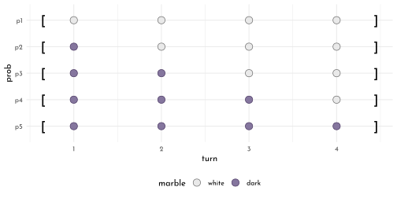

---
output:
  html_document:
  theme: yeti
pdf_document: default
editor_options: 
  chunk_output_type: console
---

# Rethinking: Chapter 2

**Small Worlds and Large Worlds**


by [Richard McElreath](https://xcelab.net/rm/statistical-rethinking/), building on the Summary by [Solomon Kurz](https://bookdown.org/content/4857/)

## Counting possibilities


```r
d <- tibble(p1 = 0,
            p2 = rep(1:0, times = c(1, 3)),
            p3 = rep(1:0, times = c(2, 2)),
            p4 = rep(1:0, times = c(3, 1)),
            p5 = 1)
```


| p1| p2| p3| p4| p5|
|--:|--:|--:|--:|--:|
|  0|  1|  1|  1|  1|
|  0|  0|  1|  1|  1|
|  0|  0|  0|  1|  1|
|  0|  0|  0|  0|  1|


```r
d %>% 
  mutate(turn = 1:4)%>% 
  pivot_longer(p1:p5,
               names_to = "prob",
               values_to = "realization") %>%
  arrange(prob, turn) %>% 
  mutate(prob = factor(prob, levels = c("p5", "p4", "p3", "p2", "p1")),
         marble = c("white", "dark")[realization + 1]) %>% 
  ggplot( aes( x = turn, y = prob ) ) +
  geom_point(shape = 21, size = 4,
             aes( fill = marble, color = after_scale(clr_darken(fill)))) +
  geom_text(data = tibble(x = rep(c(.65, 4.45), each = 5),
                          y = rep(str_c("p",1:5), 2),
                          label = rep(c("[", "]"), each = 5), vjust = .7),
            aes( x = x, y = y, label = label), family = fnt_sel, size = 6)+
  scale_fill_manual(values = c(white = clr0, dark = clrd)) +
  theme(legend.position = "bottom")
```




```r
tibble(draws = 1:3,
       marbles = 4) %>% 
  mutate(possibilities = marbles ^ draws) %>% 
  flextable::flextable()
```

```{=html}
<template id="ef84ce37-4ecc-44b4-a71b-9f258751786e"><style>
.tabwid table{
  border-spacing:0px !important;
  border-collapse:collapse;
  line-height:1;
  margin-left:auto;
  margin-right:auto;
  border-width: 0;
  display: table;
  margin-top: 1.275em;
  margin-bottom: 1.275em;
  border-color: transparent;
}
.tabwid_left table{
  margin-left:0;
}
.tabwid_right table{
  margin-right:0;
}
.tabwid td {
    padding: 0;
}
.tabwid a {
  text-decoration: none;
}
.tabwid thead {
    background-color: transparent;
}
.tabwid tfoot {
    background-color: transparent;
}
.tabwid table tr {
background-color: transparent;
}
</style><div class="tabwid"><style>.cl-91f4ffa4{}.cl-91efdc04{font-family:'DejaVu Sans';font-size:11pt;font-weight:normal;font-style:normal;text-decoration:none;color:rgba(0, 0, 0, 1.00);background-color:transparent;}.cl-91efef96{margin:0;text-align:right;border-bottom: 0 solid rgba(0, 0, 0, 1.00);border-top: 0 solid rgba(0, 0, 0, 1.00);border-left: 0 solid rgba(0, 0, 0, 1.00);border-right: 0 solid rgba(0, 0, 0, 1.00);padding-bottom:5pt;padding-top:5pt;padding-left:5pt;padding-right:5pt;line-height: 1;background-color:transparent;}.cl-91f01bc4{width:54pt;background-color:transparent;vertical-align: middle;border-bottom: 0 solid rgba(0, 0, 0, 1.00);border-top: 0 solid rgba(0, 0, 0, 1.00);border-left: 0 solid rgba(0, 0, 0, 1.00);border-right: 0 solid rgba(0, 0, 0, 1.00);margin-bottom:0;margin-top:0;margin-left:0;margin-right:0;}.cl-91f01be2{width:54pt;background-color:transparent;vertical-align: middle;border-bottom: 2pt solid rgba(102, 102, 102, 1.00);border-top: 0 solid rgba(0, 0, 0, 1.00);border-left: 0 solid rgba(0, 0, 0, 1.00);border-right: 0 solid rgba(0, 0, 0, 1.00);margin-bottom:0;margin-top:0;margin-left:0;margin-right:0;}.cl-91f01bec{width:54pt;background-color:transparent;vertical-align: middle;border-bottom: 2pt solid rgba(102, 102, 102, 1.00);border-top: 2pt solid rgba(102, 102, 102, 1.00);border-left: 0 solid rgba(0, 0, 0, 1.00);border-right: 0 solid rgba(0, 0, 0, 1.00);margin-bottom:0;margin-top:0;margin-left:0;margin-right:0;}</style><table class='cl-91f4ffa4'>
```

```{=html}
<thead><tr style="overflow-wrap:break-word;"><td class="cl-91f01bec"><p class="cl-91efef96"><span class="cl-91efdc04">draws</span></p></td><td class="cl-91f01bec"><p class="cl-91efef96"><span class="cl-91efdc04">marbles</span></p></td><td class="cl-91f01bec"><p class="cl-91efef96"><span class="cl-91efdc04">possibilities</span></p></td></tr></thead><tbody><tr style="overflow-wrap:break-word;"><td class="cl-91f01bc4"><p class="cl-91efef96"><span class="cl-91efdc04">1</span></p></td><td class="cl-91f01bc4"><p class="cl-91efef96"><span class="cl-91efdc04">4</span></p></td><td class="cl-91f01bc4"><p class="cl-91efef96"><span class="cl-91efdc04">4</span></p></td></tr><tr style="overflow-wrap:break-word;"><td class="cl-91f01bc4"><p class="cl-91efef96"><span class="cl-91efdc04">2</span></p></td><td class="cl-91f01bc4"><p class="cl-91efef96"><span class="cl-91efdc04">4</span></p></td><td class="cl-91f01bc4"><p class="cl-91efef96"><span class="cl-91efdc04">16</span></p></td></tr><tr style="overflow-wrap:break-word;"><td class="cl-91f01be2"><p class="cl-91efef96"><span class="cl-91efdc04">3</span></p></td><td class="cl-91f01be2"><p class="cl-91efef96"><span class="cl-91efdc04">4</span></p></td><td class="cl-91f01be2"><p class="cl-91efef96"><span class="cl-91efdc04">64</span></p></td></tr></tbody></table></div></template>
<div class="flextable-shadow-host" id="130f93e9-fd66-4777-91a6-34cca0a0537f"></div>
<script>
var dest = document.getElementById("130f93e9-fd66-4777-91a6-34cca0a0537f");
var template = document.getElementById("ef84ce37-4ecc-44b4-a71b-9f258751786e");
var caption = template.content.querySelector("caption");
if(caption) {
  caption.style.cssText = "display:block;text-align:center;";
  var newcapt = document.createElement("p");
  newcapt.appendChild(caption)
  dest.parentNode.insertBefore(newcapt, dest.previousSibling);
}
var fantome = dest.attachShadow({mode: 'open'});
var templateContent = template.content;
fantome.appendChild(templateContent);
</script>

```


```r
layout_round <- function(round = 1, n = 4, angle = 360, start_angle = 0, p = .5, round_prefix = ""){
  n_round <- n ^ round
  tibble(idx_round = 1:n_round,
         idx_round_sacaled = scales::rescale(idx_round,
                                             from = c(.5, n_round+.5),
                                             to = c(0, 1) * angle/360 + start_angle/360),
         idx_draw = rep(1:n, n_round/n),
         idx_parent = ((idx_round - 1 ) %/% n) + 1,
         name_parent = str_c(round_prefix, round - 1, "_", idx_parent),
         name = str_c(round_prefix, round, "_", idx_round),
         x = sin(idx_round_sacaled * 2 * pi) * round,
         y = cos(idx_round_sacaled * 2 * pi) * round) %>% 
    mutate(marble = c("white", "dark")[1 + ((idx_draw/n) <= p)],
           round_prefix = round_prefix,
           round = round)
}

links_round <- function(round = 1, n = 4, round_prefix = ""){
  n_round <- n ^ round
  n_prev <- n ^ (round - 1)
  tibble(idx_round = 1:n_round,
         idx_parent = ((idx_round - 1 ) %/% n) + 1,
         from = str_c(round_prefix, round - 1, "_", idx_parent),
         to = str_c(round_prefix,round, "_", idx_round),
         round_prefix = round_prefix)
}

round_origin <- origin_round <- function(round_prefix = ""){
  tibble(idx_round = 0,
         idx_round_sacaled = 0,
         idx_draw = 0,
         name = str_c(round_prefix, "0_1"),
               x = 0,
               y = 0,
               marble = NA)
}

marble_graph <- function(n_rounds = 3, n_draws = 4, angle = 360,start_angle = 0, p = .5, round_prefix = ""){
  tbl_graph(nodes = 1:n_rounds %>% map_dfr(layout_round,
                                    n = n_draws, angle = angle, start_angle = start_angle,
                                    p = p, round_prefix = round_prefix) %>%
              bind_rows(round_origin(round_prefix = round_prefix), .),
          edges =  1:n_rounds %>% map_dfr(links_round, round_prefix = round_prefix)) %E>% 
    mutate(marble = .N()$marble[to],
           to_name = .N()$name[to],
           from_name = .N()$name[from])
}
```


```r
marble_graph(p = .25, n_rounds = 3, angle = 180, start_angle = -90) %>%
  ggraph( layout = "manual",
          x = . %N>% as_tibble() %>% .$x,
          y = . %N>% as_tibble() %>% .$y) +
  geom_node_point(aes(fill = marble, color = marble, size = -round), shape = 21) +
  geom_edge_link(aes(color = marble),
                  start_cap = circle(2, 'mm'),
                  end_cap = circle(2, 'mm')) +
  coord_equal() +
  scale_color_manual(values = clr_darken(c(white = clr0, dark = clrd)),
                     na.value = "transparent", guide = "none") +
  scale_fill_manual(values = c(white = clr0, dark = clrd), na.value = "transparent") +
  scale_edge_color_manual(values = c(white = clr_darken(clr0, .2), dark = clrd), guide = "none") +
  scale_size_continuous(range = c(1.5,3), guide = "none") +
  guides(fill = guide_legend(override.aes = list(size = 4)), edge_alpha = "none") +
  labs(title = "p = 0.25") +
  theme(legend.position = "bottom")
```


```r
n_deviders <- 3
n_rounds <- 3
dividers <- tibble(x = rep(0,n_deviders),
       y = x,
       tau = seq(from = 0, to = 2*pi, length.out = n_deviders + 1)[2:(n_deviders+1)],
       xend = sin(tau) * (n_rounds + .1),
       yend = cos(tau) * (n_rounds + .1))

p_trials <- c(.25, .5, .75)
all_conjectures <- tibble(start_angle = c(0, 120, 240),
                          round_prefix = c("r1_" ,"r2_", "r3_"),
                          p = p_trials) %>% 
  pmap(marble_graph, angle = 120) %>%
  reduce(bind_graphs)

na_to_false <- function(x){x[is.na(x)] <- FALSE; x}
na_to_true <- function(x){x[is.na(x)] <- TRUE; x}
tester <- function(x){x$name[x$r1_right]}

trial_sequence <- c("white", "dark")[c(2,1,2)]

selectors <- all_conjectures %N>%
  mutate(r1_right = (round == 1 & marble == trial_sequence[1]) %>% na_to_true(),
         r2_still_in = name_parent %in% name[r1_right],
         r2_right = r2_still_in & (round == 2 & marble == trial_sequence[2]),
         r3_still_in = name_parent %in% name[r2_right],
         r3_right = r3_still_in & (round == 3 & marble == trial_sequence[3]),
         on_path = r1_right | r2_right |r3_right) %>% 
  as_tibble() %>% 
  filter(on_path)

selector_results <- selectors %>% 
    filter(round == n_rounds) %>% 
    group_by(round_prefix) %>% 
    count() %>% 
    ungroup() %>% 
    mutate(tau = seq(from = 0, to = 2*pi,
                     length.out = n_rounds + 1)[2:(n_rounds+1)] - (2*pi)/(n_rounds * 2),
       x = sin(tau) * (n_rounds + .5),
       y = cos(tau) * (n_rounds + .5))

all_conjectures %>% 
 ggraph( layout = "manual",
          x = . %N>% as_tibble() %>% .$x,
          y = . %N>% as_tibble() %>% .$y) +
  geom_node_point(aes(fill = marble, color = marble,
                      size = -round, alpha = name %in% selectors$name),
                  shape = 21) +
  geom_edge_link(aes(color = marble, alpha = to_name %in% selectors$name),
                  start_cap = circle(2, 'mm'),
                  end_cap = circle(2, 'mm')) +
  geom_segment(data = dividers, aes(x = x, y = y, xend = xend, yend = yend),
               color = clr_darken("white",.10)) +
  geom_text(data = selector_results, aes( x = x, y = y, label = n), family = fnt_sel, size = 6) +
  coord_equal() +
  scale_color_manual(values = clr_darken(c(white = clr0, dark = clrd)),
                     na.value = "transparent", guide = "none") +
  scale_fill_manual(values = c(white = clr0, dark = clrd), na.value = "transparent") +
  scale_edge_color_manual(values = c(white = clr_darken(clr0, .2), dark = clrd),
                          guide = "none") +
  scale_size_continuous(range = c(1.5,3), guide = "none") +
  scale_alpha_manual(values = c(`TRUE` = 1, `FALSE` = .2), guide = "none") +
  guides(fill = guide_legend(override.aes = list(size = 4)), edge_alpha = "none") +
  labs(caption = str_c(trial_sequence,collapse = "-")) +
  theme(legend.position = "bottom")
```


```r
html_marbles <- c( glue("<span style='color:{clr0};filter:drop-shadow(0px 0px 1px black)'>\U2B24</span>"),
                    glue("<span style='color:{clr1l};filter:drop-shadow(0px 0px 1px black)'>\U2B24</span>"))

html_conjecture <- function(x){
  str_c("[ ",str_c(html_marbles[c(x)+1], collapse = " ")," ]")
}

tibble(conjectures = list(rep(0,4),
                    rep(1:0, c(1,3)),
                    rep(1:0, c(2,2)),
                    rep(1:0, c(3,1)),
                    rep(1,4)),
       conjecture = map_chr(conjectures, html_conjecture),
       ways =  map_dbl(conjectures, sum),
       p = c(0, p_trials, 1),
       `ways data/prior counts` = c(0, selector_results$n, 0),
       `new count` = map2_chr( `ways data/prior counts`, ways, .f = function(x,y){glue("{x} $\\times$ {y} = {x * y}")}),
       plausibility = (`ways data/prior counts` / sum(`ways data/prior counts`)) %>% round(digits = 2)
      ) %>% 
  rename(`ways to produce <span style='color:#85769EFF;filter:drop-shadow(0px 0px 1px black)'>⬤</span>` = "ways") %>%
  dplyr::select(-conjectures) %>% 
  knitr::kable()
```


|conjecture                                                                                                                                                                                                                                                                                                              | ways to produce <span style='color:#85769EFF;filter:drop-shadow(0px 0px 1px black)'>⬤</span>|    p| ways data/prior counts|new count         | plausibility|
|:-----------------------------------------------------------------------------------------------------------------------------------------------------------------------------------------------------------------------------------------------------------------------------------------------------------------------|--------------------------------------------------------------------------------------------:|----:|----------------------:|:-----------------|------------:|
|[ <span style='color:#E9E5D9;filter:drop-shadow(0px 0px 1px black)'>⬤</span> <span style='color:#E9E5D9;filter:drop-shadow(0px 0px 1px black)'>⬤</span> <span style='color:#E9E5D9;filter:drop-shadow(0px 0px 1px black)'>⬤</span> <span style='color:#E9E5D9;filter:drop-shadow(0px 0px 1px black)'>⬤</span> ]         |                                                                                            0| 0.00|                      0|0 $\times$ 0 = 0  |         0.00|
|[ <span style='color:#85769EFF;filter:drop-shadow(0px 0px 1px black)'>⬤</span> <span style='color:#E9E5D9;filter:drop-shadow(0px 0px 1px black)'>⬤</span> <span style='color:#E9E5D9;filter:drop-shadow(0px 0px 1px black)'>⬤</span> <span style='color:#E9E5D9;filter:drop-shadow(0px 0px 1px black)'>⬤</span> ]       |                                                                                            1| 0.25|                      3|3 $\times$ 1 = 3  |         0.15|
|[ <span style='color:#85769EFF;filter:drop-shadow(0px 0px 1px black)'>⬤</span> <span style='color:#85769EFF;filter:drop-shadow(0px 0px 1px black)'>⬤</span> <span style='color:#E9E5D9;filter:drop-shadow(0px 0px 1px black)'>⬤</span> <span style='color:#E9E5D9;filter:drop-shadow(0px 0px 1px black)'>⬤</span> ]     |                                                                                            2| 0.50|                      8|8 $\times$ 2 = 16 |         0.40|
|[ <span style='color:#85769EFF;filter:drop-shadow(0px 0px 1px black)'>⬤</span> <span style='color:#85769EFF;filter:drop-shadow(0px 0px 1px black)'>⬤</span> <span style='color:#85769EFF;filter:drop-shadow(0px 0px 1px black)'>⬤</span> <span style='color:#E9E5D9;filter:drop-shadow(0px 0px 1px black)'>⬤</span> ]   |                                                                                            3| 0.75|                      9|9 $\times$ 3 = 27 |         0.45|
|[ <span style='color:#85769EFF;filter:drop-shadow(0px 0px 1px black)'>⬤</span> <span style='color:#85769EFF;filter:drop-shadow(0px 0px 1px black)'>⬤</span> <span style='color:#85769EFF;filter:drop-shadow(0px 0px 1px black)'>⬤</span> <span style='color:#85769EFF;filter:drop-shadow(0px 0px 1px black)'>⬤</span> ] |                                                                                            4| 1.00|                      0|0 $\times$ 4 = 0  |         0.00|

## Building a Model


```r
d <- tibble(toss = c("w", "l", "w", "w", "w", "l", "w", "l", "w"),
            n_trials = 1:9,
            sequence = n_trials %>% map_chr(.f = function(x, chr){str_c(chr[1:x], collapse = "")}, chr = toss),
            n_success = cumsum(toss == "w"),
            lag_n_trials = lag(n_trials, default = 0),
            lag_n_success = lag(n_success, default = 0))

sequence_length <- 50
d %>% 
  expand(nesting(n_trials, toss, n_success), 
         p_water = seq(from = 0, to = 1, length.out = sequence_length)) %>% 
  group_by(p_water) %>% 
 # you can learn more about lagging here: https://www.rdocumentation.org/packages/stats/versions/3.5.1/topics/lag or here: https://dplyr.tidyverse.org/reference/lead-lag.html
  mutate(lagged_n_trials  = lag(n_trials, k = 1),
         lagged_n_success = lag(n_success, k = 1)) 
```

```
#> # A tibble: 450 x 6
#> # Groups:   p_water [50]
#>    n_trials toss  n_success p_water lagged_n_trials lagged_n_success
#>       <int> <chr>     <int>   <dbl>           <int>            <int>
#>  1        1 w             1  0                   NA               NA
#>  2        1 w             1  0.0204              NA               NA
#>  3        1 w             1  0.0408              NA               NA
#>  4        1 w             1  0.0612              NA               NA
#>  5        1 w             1  0.0816              NA               NA
#>  6        1 w             1  0.102               NA               NA
#>  7        1 w             1  0.122               NA               NA
#>  8        1 w             1  0.143               NA               NA
#>  9        1 w             1  0.163               NA               NA
#> 10        1 w             1  0.184               NA               NA
#> # … with 440 more rows
```

```r
stat_binom <- function(n_trials, n_success, lag_n_trials, lag_n_success, sequence, ...){
  if(n_trials == 1) {
    g_lag <- stat_function(data = tibble(n_trials = n_trials, sequence = sequence),
                           fun = function(x){1}, xlim = c(0,1), linetype = 3)
  } else {
  g_lag <-  stat_function(data = tibble(n_trials = n_trials, sequence = sequence),
                          fun = function(x){
                  f <- function(x){
                    dbinom(x = lag_n_success, size = lag_n_trials, prob = x)}
                  f(x)/ integrate(f = f,lower = 0, upper = 1)[[1]]},
    xlim = c(0,1), n = 500, linetype = 3)
  } 
  
  g_current <- stat_function(data = tibble(n_trials = n_trials, sequence = sequence),
                             fun = function(x){
                  f <- function(x){
                    dbinom(x = n_success, size = n_trials, prob = x)}
                  f(x)/ integrate(f = f,lower = 0,upper = 1)[[1]]},
                  xlim = c(0,1),n = 500)
  list( g_lag, g_current)
}
```


```r
ggplot() +
    (d %>% pmap(stat_binom) %>% unlist()) +
  facet_wrap(str_c(n_trials,": ", sequence) ~ .)
```


## Making the model go / Bayes' Theorem

$$
Pr(\textit{p} | W, L) = \frac{Pr(W, L | \textit{p}) ~ Pr(\textit{p})}{Pr(W,L)}\\
Posterior = \frac{Probability~of~the~Data \times Prior}{ Average~probability~of~the~Data}
$$


```r
f_posterior_unscaled <- function(f_porior, f_like){ function(x){ f_porior(x) * f_like(x)} }

f_parts <- c("prior", "likelihood", "posterior")

gg_posterior <- function(f_porior, f_like, comp = 1){
  list(
    stat_function(data = tibble(part = factor("prior", levels = f_parts),
                                 comp = comp),
                fun = f_porior,
                xlim = c(0,1), n = 500, geom = "area", color = clr2, fill = fll2),
    stat_function(data = tibble(part = factor("likelihood", levels = f_parts),
                                 comp = comp),
                fun = f_like,
                xlim = c(0,1), n = 500, geom = "area", color = clr2, fill = fll2),
    stat_function(data = tibble(part = factor("posterior", levels = f_parts),
                                 comp = comp),
                fun = f_posterior_unscaled(f_porior = f_porior, f_like = f_like),
                xlim = c(0,1), n = 500, geom = "area", color = clr2, fill = fll2)
  )
}
```


```r
scale_fun <- function(f){
  # marginal likelihood
  function(x){f(x) / integrate(f = f, lower = 0, upper = 1)[[1]]}
  }

f_like_in <- function(x){dbeta(x = x, shape1 = 8, shape2 = 5)}
f_uni <- function(x){1}
f_step <- function(x){if_else(x < .5, 0, 1)}
f_peak <- function(x){if_else(x < .5, (x * 2)^3, ((1 - x) * 2)^3)}
```


```r
ggplot() +
  gg_posterior(f_porior = f_uni, f_like = f_like_in) +
  gg_posterior(f_porior = f_step, f_like = f_like_in, comp = 2) +
  gg_posterior(f_porior = f_peak, f_like = f_like_in, comp = 3) +
  facet_wrap(comp ~ part, scales = "free_y")
```


## Motors: Grid Approximation


```r
grid_approx <- function(n_grid = 20, L = 6, W = 3, prior = function(x){rep(1, length(x))}){
  tibble(p_grid = seq(0, 1, length.out = n_grid),
         prior = prior(p_grid),
         likelihood = dbinom(L, size = W + L, prob = p_grid),
         posterior_unstand = likelihood * prior,
         posterior = posterior_unstand / sum(posterior_unstand))
}

plot_grid_approx <- function(data){
  data %>% 
  ggplot(aes(x = p_grid, y = posterior, color = posterior)) +
  ggforce::geom_link2() +
  geom_point(shape = 21, fill = "white", size = 2.5) +
  scale_color_gradientn(colours = c(clr_darken(clr0), clr2), guide = "none") +
  labs(title = glue("{length(data$p_grid)} grid points"))
}
```


```r
c(4, 7, 15, 60) %>%
  map(grid_approx) %>%
  map(plot_grid_approx) %>%
  wrap_plots(nrow = 1) &
  scale_x_continuous(breaks = c(0, .5, 1))
```


Note how the y scale depends on the number of grid points: the peak reaches ~0.75 for 4 points, but only ~ 0.043 for 60 points.

## Quadratic Approximation


```r
library(rethinking)
map <- purrr::map
conpare_qa <- function(w_in, l_in){
  globe_qa <- quap(
    alist(
      W ~ dbinom( W + L, p ), # binomial likelihood
      p ~ dunif( 0, 1 )       # uniform prior
    ),
    data = list( W = w_in, L = l_in )
  )
  
  qa_results <- precis(globe_qa) %>% 
    as_tibble() %>% 
    mutate(qa = glue("W: {w_in}, L: {l_in}"))
  
  qa_results %>% knitr::kable() %>% print()
  
  ggplot() +
    stat_function(fun = function(x){ dbeta( shape1 =  w_in + 1, shape2 = l_in + 1, x =  x ) / 
        integrate(f = function(x){ dbeta( shape1 = w_in + 1, shape2 = l_in + 1, x = x )},
                  lower = 0, upper = 1)[[1]] },
        xlim = c(0,1), n = 500, geom = "area", color = clr0d, fill = fll0)+
    stat_function(fun = function(x){ dnorm(x = x, mean = qa_results$mean, sd = qa_results$sd )},
                  xlim = c(0,1), n = 500, geom = "line", color = clr2, linetype = 3) +
    labs(title = glue("W: {w_in}, L: {l_in}, n = {w_in + l_in}"), 
         y = "density", x = "proportion water")
}
```


```r
conpare_qa(w_in = 6, l_in = 3) +
conpare_qa(w_in = 12, l_in = 6) +
conpare_qa(w_in = 24, l_in = 12)
```

```
#> 
#> 
#> |      mean|        sd|      5.5%|     94.5%|qa         |
#> |---------:|---------:|---------:|---------:|:----------|
#> | 0.6666666| 0.1571338| 0.4155364| 0.9177967|W: 6, L: 3 |
#> 
#> 
#> |      mean|        sd|      5.5%|     94.5%|qa          |
#> |---------:|---------:|---------:|---------:|:-----------|
#> | 0.6666662| 0.1111104| 0.4890902| 0.8442421|W: 12, L: 6 |
#> 
#> 
#> |      mean|        sd|      5.5%|     94.5%|qa           |
#> |---------:|---------:|---------:|---------:|:------------|
#> | 0.6666669| 0.0785669| 0.5411019| 0.7922319|W: 24, L: 12 |
```


## Marcov Chain Monte Carlo (MCMC)


```r
n_samples <- 1e4
p_init <- rep( NA, n_samples )
p_init[1] <- .5

manual_mcmc <- function(p, W = 6, L = 3){
  for ( i in 2:n_samples ) {
  p_new <- rnorm( n = 1, mean = p[ i - 1], sd =  0.1)
  if ( p_new < 0 ){ p_new <- abs( p_new ) }
  if ( p_new > 1 ){ p_new <- 2 - p_new }
  q0 <- dbinom( W, W + L, p[ i - 1 ] )
  q1 <- dbinom( W, W + L, p_new )
  p[i] <- if_else( runif(1) < q1 / q0, p_new, p[i - 1] )
  }
  p
}

p <- manual_mcmc(p_init)
p_36 <- manual_mcmc(p_init, W = 24, L = 12)

p_p <- tibble(x = p) %>% 
  ggplot() +
  stat_function(fun = function(x){ dbeta( shape1 =  6 + 1, shape2 = 3 + 1, x =  x ) / 
      integrate(f = function(x){ dbeta( shape1 = 6 + 1, shape2 = 3 + 1, x = x )},
                lower = 0, upper = 1)[[1]] },
      xlim = c(0,1), n = 500, geom = "area",
      aes(color = "posterior", fill = after_scale(clr_alpha(color))))+
  geom_density(aes(x = x, color = "MCMC")) +
  scale_color_manual("approach", values = c(posterior = clr0, MCMC = clr2)) +
  labs(y = "density", x = "proportion water", title = "n = 12") +
  theme(legend.position = "bottom")


p_p36 <- tibble(x = p_36) %>% 
  ggplot() +
  stat_function(fun = function(x){ dbeta( shape1 =  24 + 1, shape2 = 12 + 1, x =  x ) / 
      integrate(f = function(x){ dbeta( shape1 = 24 + 1, shape2 = 12 + 1, x = x )},
                lower = 0, upper = 1)[[1]] },
      xlim = c(0,1), n = 500, geom = "area",
      aes(color = "posterior", fill = after_scale(clr_alpha(color))))+
  geom_density(aes(x = x, color = "MCMC")) +
  scale_color_manual("approach", values = c(posterior = clr0, MCMC = clr2)) +
  labs(y = "density", x = "proportion water", title = "n = 36") +
  theme(legend.position = "bottom")

p_p + p_p36
```


---

## Homework

**M1**


```r
plot_grid_approx <- function(data){
  data %>% 
  ggplot(aes(x = p_grid, y = posterior, color = posterior)) +
  ggforce::geom_link2() +
  geom_point(shape = 21, fill = "white", size = 2.5) +
  scale_color_gradientn(colours = c(clr_darken(clr0), clr2), guide = "none") +
  labs(title = glue("{length(data$p_grid)} grid points"))
}
```


```r
tibble(n_grid = rep(c(4,7,20), 3),
       L = rep(c(0,1,2), each = 3),
       W = rep(c(3,3,5), each = 3)) %>%
  pmap(grid_approx) %>%
  map(plot_grid_approx) %>%
  wrap_plots(nrow = 3) &
  scale_x_continuous(breaks = c(0, .5, 1))
```


**M2**


```r
tibble(n_grid = rep(c(4,7,20), 3),
       L = rep(c(0,1,2), each = 3),
       W = rep(c(3,3,5), each = 3)) %>%
  pmap(grid_approx, prior = f_step ) %>%
  map(plot_grid_approx) %>%
  wrap_plots(nrow = 3) &
  scale_x_continuous(breaks = c(0, .5, 1))
```


**M3**

$$
Pr(Earth | Land) = \frac{Pr(Land | Earth) \times Pr(Earth)}{Pr(Land)}
$$


```r
p_l_on_earth <- .3
p_l_on_mars <- 1
p_earth <- .5
average_p_l <- .5 * (p_l_on_earth + p_l_on_mars)
(p_earth_on_l <- p_l_on_earth * p_earth / average_p_l)
```

```
#> [1] 0.2307692
```

**M4** & **M5**


```r
cards <- c("C1b1|C1b2", "C2b1|C2w2", "C3w1|C3w2" )

conjectures <- c("C1b1|C1b2", "C1b2|C1b1", 
                 "C2b1|C2w2", "C2w2|C2b1",
                 "C3w1|C3w2", "C3w2|C3w1")

tibble(cards = c("C1", "C2", "C3"),
       ways = c("C1b1|C1b2 & C1b2|C1b1", "C2b1|C2w2", ""),
       ways_tor_produce_data = c(2, 1, 0),
       plausibility = (ways_tor_produce_data / sum(ways_tor_produce_data)) %>% round(digits = 3),
       other_side = c("b", "w", ""),
       prior = c(2,1,1),
       posterior = ((plausibility * prior) / sum(plausibility * prior)) %>% round(digits = 3))%>% 
  knitr::kable()
```


|cards |ways                            | ways_tor_produce_data| plausibility|other_side | prior| posterior|
|:-----|:-------------------------------|---------------------:|------------:|:----------|-----:|---------:|
|C1    |C1b1&#124;C1b2 & C1b2&#124;C1b1 |                     2|        0.667|b          |     2|       0.8|
|C2    |C2b1&#124;C2w2                  |                     1|        0.333|w          |     1|       0.2|
|C3    |                                |                     0|        0.000|           |     1|       0.0|

**M6**


```r
tibble(cards = c("C1", "C2", "C3"),
       ways = c("C1b1|C1b2 & C1b2|C1b1", "C2b1|C2w2", ""),
       ways_tor_produce_data = c(2, 1, 0),
       plausibility = (ways_tor_produce_data / sum(ways_tor_produce_data)) %>% round(digits = 3),
       other_side = c("b", "w", ""),
       prior = c(1,2,3),
       posterior = ((plausibility * prior) / sum(plausibility * prior)) %>% round(digits = 3))%>% 
  knitr::kable()
```


|cards |ways                            | ways_tor_produce_data| plausibility|other_side | prior| posterior|
|:-----|:-------------------------------|---------------------:|------------:|:----------|-----:|---------:|
|C1    |C1b1&#124;C1b2 & C1b2&#124;C1b1 |                     2|        0.667|b          |     1|       0.5|
|C2    |C2b1&#124;C2w2                  |                     1|        0.333|w          |     2|       0.5|
|C3    |                                |                     0|        0.000|           |     3|       0.0|

**M7**


```r
tibble(cards = c("C1", "C2", "C3"),
       ways = c("C1b1>C2w2 & C1b1>C3w1 & C1b1>C3w2 & C2b1>C2w2 & C2b1>C3w1 & C2b1>C3w2",
                "C2b1>C3w1 & C2b1>C3w2", ""),
       ways_tor_produce_data = c(6, 2, 0),
       plausibility = (ways_tor_produce_data / sum(ways_tor_produce_data)) %>% round(digits = 3))%>% 
  knitr::kable()
```


|cards |ways                                                                  | ways_tor_produce_data| plausibility|
|:-----|:---------------------------------------------------------------------|---------------------:|------------:|
|C1    |C1b1>C2w2 & C1b1>C3w1 & C1b1>C3w2 & C2b1>C2w2 & C2b1>C3w1 & C2b1>C3w2 |                     6|         0.75|
|C2    |C2b1>C3w1 & C2b1>C3w2                                                 |                     2|         0.25|
|C3    |                                                                      |                     0|         0.00|


**H1**

$$
Pr(twin | spec_a) = 0.2 \\
Pr(twin | spec_b) = 0.1 \\
Pr(twin) = 0.15
$$

$$
Pr(spec_a | twin) = \frac{Pr(spec_a) \times Pr(twin | spec_a)}{Pr(twin)} \\
Pr(spec_b | twin) = \frac{Pr(spec_b) \times Pr(twin | spec_b)}{Pr(twin)}
$$


```r
pr_twn_on_a <- .2
pr_twn_on_b <- .1
pr_twn <- (pr_twn_on_a + pr_twn_on_b) /2 

prior_a <- .5

pr_a_on_twn <- (prior_a * pr_twn_on_a) / pr_twn
pr_b_on_twn <- ((1 - prior_a) * pr_twn_on_b) / pr_twn

(p_next_twn <- pr_a_on_twn * pr_twn_on_a + pr_b_on_twn * pr_twn_on_b) %>%
  round(digits = 3)
```

```
#> [1] 0.167
```

**H2**

$$
Pr(spec_a | twin) = \frac{2}{3}
$$


```r
pr_a_on_twn
```

```
#> [1] 0.6666667
```

**H3**

$$
Pr(single | spec_a) = Pr(\neg twin | spec_a) = 1 - Pr(twin | spec_a)
$$

$$
Pr( spec_a | single) = \frac{Pr(single|spec_a)Pr(spec_a)}{Pr(single)}
$$


```r
pr_sgl_on_a <- 1 - pr_twn_on_a
pr_sgl_on_b <- 1 - pr_twn_on_b
pr_sgl <- weighted.mean(x = c(pr_sgl_on_a, pr_sgl_on_b),
                        w = c(pr_a_on_twn, 1- pr_a_on_twn))
prior_a <- pr_a_on_twn

pr_a_on_sgl <- (prior_a * pr_sgl_on_a) / pr_sgl
pr_b_on_sgl <- ((1 - prior_a) * pr_sgl_on_b) / pr_sgl

tibble(pr_a_on_sgl = pr_a_on_sgl, pr_b_on_sgl = pr_b_on_sgl,
       control = pr_a_on_sgl + pr_b_on_sgl) %>%
  round(digits = 4) %>%
  knitr::kable()
```


| pr_a_on_sgl| pr_b_on_sgl| control|
|-----------:|-----------:|-------:|
|        0.64|        0.36|       1|

**H4**


$$
Pr(spec_a | test ) = 0.8 \\
Pr(spec_b | test ) = 0.65 \\
Pr(spec_a | test ) = \frac{Pr( test | spec_a ) \times Pr(spec_a)}{Pr(test_positive)}
$$


```r
pr_testa_on_a <- .8
pr_testb_on_b <- .65
pr_testa_on_b <- 1 - pr_testb_on_b

prior_a <- .5

pr_testa <- weighted.mean(x = c(pr_testa_on_a, pr_testa_on_b),
                        w = c(prior_a, 1- prior_a))

tibble(pr_on_testa = c("A","B"),
       genetic_test = c((prior_a * pr_testa_on_a) / pr_testa,
                        ((1 - prior_a) * pr_testa_on_b) / pr_testa))
```

```
#> # A tibble: 2 x 2
#>   pr_on_testa genetic_test
#>   <chr>              <dbl>
#> 1 A                  0.696
#> 2 B                  0.304
```

```r
prior_a_updated <- (prior_a * pr_testa_on_a) / pr_testa
pr_twn_updated <-  weighted.mean(x = c(pr_twn_on_a, pr_twn_on_b),
                        w = c(prior_a_updated, 1- prior_a_updated))

pr_a_on_twn_updated <- (prior_a_updated * pr_twn_on_a) / pr_twn_updated
pr_b_on_twn_updated <- ((1 - prior_a_updated) * pr_twn_on_b) / pr_twn_updated

tibble(pr_a_on_twn_updated = pr_a_on_twn_updated,
       pr_b_on_twn_updated = pr_b_on_twn_updated,
       control = pr_a_on_twn_updated + pr_b_on_twn_updated) %>%
  round(digits = 4) %>%
  knitr::kable()
```


| pr_a_on_twn_updated| pr_b_on_twn_updated| control|
|-------------------:|-------------------:|-------:|
|              0.8205|              0.1795|       1|

## {brms} section


```r
brms_c2_36_tosses <- brm( data = list(w = 24), 
                          family = binomial(link = "identity"),
                          w | trials(36) ~ 0 + Intercept,
                          prior(beta(1, 1), class = b, lb = 0, ub = 1),
                          seed = 42,
                          file = "brms/brms_c2_36_tosses" )

brms_c2_36_tosses %>% summary()
```

```
#>  Family: binomial 
#>   Links: mu = identity 
#> Formula: w | trials(36) ~ 0 + Intercept 
#>    Data: list(w = 24) (Number of observations: 1) 
#>   Draws: 4 chains, each with iter = 2000; warmup = 1000; thin = 1;
#>          total post-warmup draws = 4000
#> 
#> Population-Level Effects: 
#>           Estimate Est.Error l-95% CI u-95% CI Rhat Bulk_ESS Tail_ESS
#> Intercept     0.66      0.08     0.49     0.80 1.00     1123     1813
#> 
#> Draws were sampled using sampling(NUTS). For each parameter, Bulk_ESS
#> and Tail_ESS are effective sample size measures, and Rhat is the potential
#> scale reduction factor on split chains (at convergence, Rhat = 1).
```

```r
posterior_summary(brms_c2_36_tosses) %>% 
  round(digits = 3) %>% 
  knitr::kable()
```


|            | Estimate| Est.Error|   Q2.5|  Q97.5|
|:-----------|--------:|---------:|------:|------:|
|b_Intercept |    0.657|     0.078|  0.492|  0.798|
|lp__        |   -3.994|     0.744| -6.055| -3.465|

```r
as_draws_df(brms_c2_36_tosses) %>% 
  as_tibble() %>% 
  ggplot(aes(x = b_Intercept)) +
  geom_density(color = clr1, fill = fll1) +
  scale_x_continuous(limits = c(0, 1), expand = c(0, 0)) +
  labs(y = "density", x = "proportion water",
       title = "{brms} posterior probability (n = 36")
```


---

<div id="myModal" class="modal">
  <span class="close">&times;</span>
  
  <div id="caption"></div>
</div>

<script src="./js/zoom.js"></script>
