---
output:
  html_document:
  theme: yeti
pdf_document: default
editor_options: 
  chunk_output_type: console
---

# Rethinking: Chapter 3

**Sampling the Imaginary**


by [Richard McElreath](https://xcelab.net/rm/statistical-rethinking/), building on the Summary by [Solomon Kurz](https://bookdown.org/content/4857/)

$$
Pr(vampire|positive) = \frac{Pr(positive|vampire) \times Pr(vampire)}{Pr(positive)}
$$


```r
pr_positive_on_vamp <- .95
pr_positive_on_mort <- .01
pr_vamp <- .001
pr_positive <- pr_positive_on_vamp * pr_vamp + pr_positive_on_mort * (1 - pr_vamp)
(pr_vamp_on_positive <- pr_positive_on_vamp * pr_vamp /pr_positive)
```

```
#> [1] 0.08683729
```

## Sampling from a grid approximate posterior

*posterior* here means simply 'the probability of *p* conditional on the data':


```r
grid_approx <- function(n_grid = 20, L = 6, W = 3, prior = function(x){rep(1, length(x))}){
  tibble(p_grid = seq(0, 1, length.out = n_grid),
         prior = prior(p_grid),
         likelihood = dbinom(L, size = W + L, prob = p_grid),
         posterior_unstand = likelihood * prior,
         posterior = posterior_unstand / sum(posterior_unstand))
}

grid_data <- grid_approx(n_grid = 10^4)

samples <- tibble(sample = 1:(10^4),
                    proportion_water = sample(x = grid_data$p_grid, size = length(sample),
                  prob = grid_data$posterior, replace = TRUE))

p_scatter <- samples %>% 
  ggplot(aes(x = sample, y = proportion_water)) +
  geom_point(size = .75, shape = 21, color = clr_alpha(clr2,.3), fill = clr_alpha(clr2,.1)) +
  scale_x_continuous(expand = c(0,0))

p_dens <- samples %>% 
  ggplot(aes(x = proportion_water)) +
  geom_density( color = clr2, fill = fll2) +
  scale_x_continuous(limits = c(0,1), expand = c(0, 0)) 

p_scatter + p_dens
```


## Sampling to Summarize

Once the posterior distribution is created, the model is done.

Typical targets / questions:

- intervals of *defined boundaries*
- intervals of *defined probability mass*
- *point estimates*

### Intervals of devined boundaries


```r
sum(grid_data$posterior[grid_data$p_grid < 0.5])
```

```
#> [1] 0.171875
```

```r
sum(samples$proportion_water < .5) / length(samples$proportion_water)
```

```
#> [1] 0.1684
```

```r
sum(samples$proportion_water > .5 & samples$proportion_water < .75) / length(samples$proportion_water)
```

```
#> [1] 0.6077
```

```r
# f_post <-  function(x){dbeta(x = x, shape1 = 9 +1 , shape2 = 6 +1)}
f_post <-  function(x){dbinom(x = 6, size = 9, prob = x)}
f_post_norm <- function(x){ f_post(x) / integrate(f = f_post,lower = 0, upper = 1)[[1]]}
```


```r
plot_intervals <- function(x_bounds = c(0, 1),
                           x_line = as.numeric(NA),
                           f_posterior = f_post_norm,
                           data = samples,
                           ylim = c(0, 3)){
  p_d <- ggplot() +
  stat_function(fun = f_posterior, xlim = c(0,1),
                geom = "area", color = clr0, fill = fll0) +
  stat_function(fun = f_posterior, xlim = x_bounds,
                geom = "area", color = clr2, fill = fll2) +
  labs(y = "density", x = "proportion_water")

p_d_emp <- data %>%
  ggplot(aes(x = proportion_water)) +
  geom_density( color = clr0, fill = fll0) +
  stat_function(fun = function(x){demp(obs = data$proportion_water, x = x)},
                xlim = x_bounds,
                geom = "area", color = clr2, fill = fll2) +
  labs(y = "empirical density")

p_d + p_d_emp  &
  geom_vline(data = tibble(x = x_line),
             aes(xintercept = x), linetype = 3) &
  scale_y_continuous(limits = ylim)&
  scale_x_continuous(limits = c(0, 1))
}
```


```r
plot_intervals(x_bounds = c(0, .5), x_line = .5) /
plot_intervals(x_bounds = c(.5, .75), x_line = c(.5, .75))
```


### Intervals of defined mass

aka.:

- ***compatibility interval***
- *credible interval*
- *percentile interval*

special form: *highest posterior density interval (HPDI)*


```r
qnt_80 <- quantile(samples$proportion_water, probs = .8)
qnt_80_inner <- quantile(samples$proportion_water, probs = c(.1, .9))
plot_intervals(x_bounds = c(0, qnt_80), x_line = qnt_80)/
plot_intervals(x_bounds = qnt_80_inner, x_line = qnt_80_inner)
```

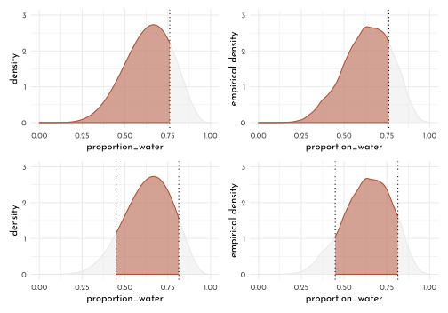


```r
library(rethinking)
map <- purrr::map

grid_data_skew <- grid_approx(L = 3, W = 0, n_grid = 10^4)

samples_skew <- tibble(sample = 1:(10^4),
                       proportion_water = sample(x = grid_data_skew$p_grid, size = length(sample),
                                                 prob = grid_data_skew$posterior, replace = TRUE))

f_post_skew <-  function(x){dbinom(x = 3, size = 3, prob = x)}
f_post_norm_skew <- function(x){ f_post_skew(x) / integrate(f = f_post_skew, lower = 0, upper = 1)[[1]]}

qnt_50_inner <- PI(samples_skew$proportion_water, prob = .5)
qnt_50_high_dens <- HPDI(samples_skew$proportion_water, prob = .5)

plot_intervals(x_bounds = qnt_50_inner, x_line = qnt_50_inner,
               f_posterior = f_post_norm_skew, data = samples_skew, ylim = c(0, 4)) /
  plot_intervals(x_bounds = qnt_50_high_dens, x_line = qnt_50_high_dens,
               f_posterior = f_post_norm_skew, data = samples_skew, ylim = c(0, 4)) 
```

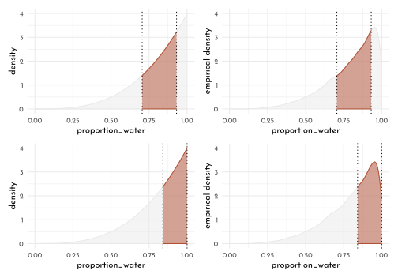

## Point estimates


```r
point_estimates <- tibble(proportion_water= list(mean, median, chainmode) %>%
                            map_dbl(.f = function(f, vals){ f(vals) },
                                    vals = samples_skew$proportion_water),
                          statistic = c("mean", "median", "mode"))

p_point_estimates <- ggplot() +
  stat_function(fun = f_post_norm_skew, xlim = c(0,1),
                geom = "area", color = clr0, fill = fll0) +
  geom_vline(data = point_estimates, 
             aes(xintercept = proportion_water, linetype = statistic),
             color = clr1) +
  labs(y = "density")

f_loss <- function(x){
    map_dbl(x, function(x){ sum( grid_data_skew$posterior  * abs( x - grid_data_skew$p_grid))
    })}

f_loss_quad <- function(x){
    map_dbl(x, function(x){ sum( grid_data_skew$posterior  * ( x - grid_data_skew$p_grid) ^ 2)
    })}

p_loss <- ggplot() +
  stat_function(fun = f_loss,
    xlim = c(0,1),
    geom = "area", color = clr0, fill = fll0) +
  geom_point(data = tibble(x = point_estimates$proportion_water[2],
                           y = f_loss(point_estimates$proportion_water[2])),
             aes(x = x, y = y), shape = 1, size = 3, color = clr1) +
  labs(x = "poportion_water", y = "expected proportional loss")

p_loss_quad <- ggplot() +
  stat_function(fun = f_loss_quad,
    xlim = c(0,1),
    geom = "area", color = clr0, fill = fll0) +
  geom_point(data = tibble(x = point_estimates$proportion_water[2],
                           y = f_loss_quad(point_estimates$proportion_water[2])),
             aes(x = x, y = y), shape = 1, size = 3, color = clr1) +
  labs(x = "poportion_water", y = "expected proportional loss")

p_point_estimates + p_loss + p_loss_quad +
  plot_layout(guide = "collect") & theme(legend.position = "bottom")
```


## sample to simulate prediction

binomial likelihood

$$
Pr(W | N ,p) = \frac{N!}{W! (N -W)!} p^{W}(1 - p)^{N-W}
$$


```r
dbinom( 0:2, size = 2, prob = .7)
```

```
#> [1] 0.09 0.42 0.49
```

```r
rbinom( 10, size = 2, prob = .7)
```

```
#>  [1] 2 2 2 1 2 2 0 2 2 2
```

```r
create_dummy_w <- function(size, prob){
  tibble(x = rbinom(10^5, size = size, prob = prob),
         size = size,
         prob = prob)
}

dummy_w <- create_dummy_w(size = 9, prob = .7)

dummy_w %>% 
  group_by(x) %>% 
  count() %>% 
  ungroup() %>% 
  ggplot(aes(x = factor(x), y =  n)) +
  geom_bar(stat = "identity", color = clr1, fill = fll1, width = .6) +
  labs(y = "count", x = "dummy water count")
```


```r
tibble(size = rep(c(3,6,9), each = 3),
       prob = rep(c(.3,.6,.9), 3)) %>% 
  pmap_dfr(create_dummy_w) %>% 
  group_by(x, size , prob) %>% 
  count() %>% 
  ungroup() %>% 
  ggplot(aes(x = factor(x), y =  n)) +
  geom_bar(stat = "identity", color = clr1, fill = fll1, width = .6) +
  facet_grid(prob ~ size, scales = "free",
             space = "free_x", labeller = label_both) +
  labs(y = "count", x = "dummy water count") +
  theme(panel.background = element_rect(color = clr0d, fill = clr_alpha(clr0d,.2)))
```

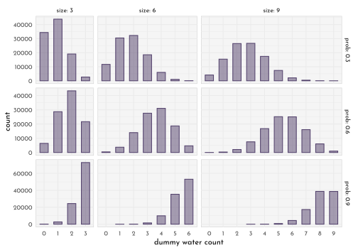


```r
grid_data <- grid_approx(n_grid = 10^4 + 1, L = 6, W = 3,
                         prior = function(x){rep(1, length(x))}) %>% 
  mutate(idx = 1:(10^4 + 1))

grid_data %>% 
  ggplot(aes(x = p_grid))+
  geom_line(aes(y = posterior, color = "posterior")) +
  scale_color_manual(values = c(posterior = clr1), guide = "none") +
  theme(legend.position = "bottom")
```

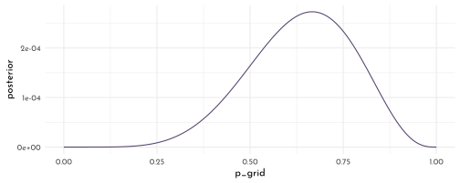


```r
samples <- grid_data %>% 
  slice_sample(n = 10^5 , weight_by = posterior, replace = TRUE) %>% 
  mutate(w = purrr::map_dbl(p_grid, rbinom, n = 1, size = 9),
         seq = map(w, .f = function(x){sample(x = rep(c("W","L"), c(x, 9-x)),
                                                    size = 9,
                                                    replace = FALSE)}),
         max_run_length = map_dbl(seq,.f = function(x){rle(x)$lengths %>% max()}),
         n_switches = map_dbl(seq,.f = function(x){(rle(x)$lengths %>% length()) -1}))

p_posterior <- grid_data %>% 
  ggplot(aes(x = p_grid, y = posterior)) +
  geom_area(color = clr0d, fill = fll0) +
  geom_segment(data = grid_data %>% filter(idx %in% (1+ (1:9)*1000)),
               aes(xend = p_grid,
                   yend = 0, size = posterior),
               color = fll1) +
  geom_point(data = grid_data %>% filter(idx %in% (1+ (1:9)*1000)),
               color = clr1) +
  scale_size_continuous(range = c(.1, 1), guide = "none") +
  labs(x = "probability of water", y = "density", title = "Posterior Probability")

simulate_binom <- function(probability, n_draws = 10^5, size = 9) {
  rbinom(n_draws, size = size, prob = probability) 
}

d_small <- tibble(probability = seq(from = .1, to = .9, by = .1)) %>% 
  mutate(draws = purrr::map(probability, simulate_binom)) %>% 
  unnest(draws)

p_small <- d_small %>% 
  ggplot(aes(x = draws)) +
  geom_bar(stat = "count", color = clr1, fill = fll1, width = .6) +
  facet_wrap(probability ~ ., nrow = 1)+
  labs(title = "Sampling Distributions")

p_posterior_predictive <- samples %>% 
  ggplot(aes(x = factor(w))) +
  geom_bar(stat = "count",
           aes(color = w == 6 ,
               fill = after_scale(clr_alpha(color, .3))),
           width = .6) +
  scale_color_manual(values = c(`TRUE` = clr1, `FALSE` = clr0d), guide = "none") +
  labs(x = "number of water samples", title = "Posterior Predictive Distribution")
```


```r
p_posterior / 
  p_small /
  p_posterior_predictive
```


```r
sum( samples$w == 6 ) / length( samples$w )
```

```
#> [1] 0.19894
```


```r
globe_data <- c("w", "l", "w", "w", "w", "l", "w", "l", "w")
globe_run_length <- rle(globe_data)$lengths %>% max()
globe_n_switches <- (rle(globe_data)$lengths %>% length()) -1 

p_run_length <- samples %>% 
  ggplot(aes(x = factor(max_run_length))) +
  geom_bar(stat = "count", aes(color = max_run_length == globe_run_length, 
                               fill = after_scale(clr_alpha(color))), width = .6) +
  scale_color_manual(values = c(`TRUE` = clr2, `FALSE` = clr0d), guide = "none") +
  labs(x = "longest run length")

p_switches <- samples %>% 
  ggplot(aes(x = factor(n_switches))) +
  geom_bar(stat = "count", aes(color = n_switches == globe_n_switches, 
                               fill = after_scale(clr_alpha(color))), width = .6) +
  scale_color_manual(values = c(`TRUE` = clr2, `FALSE` = clr0d), guide = "none") +
  labs(x = "number of switches")
p_run_length + p_switches
```

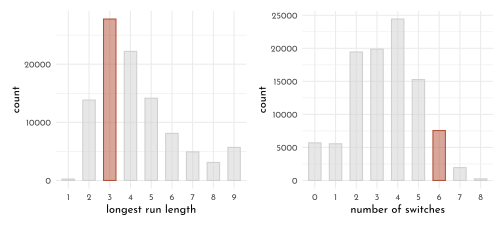

---

## Homework


```r
n <- 1e4
easy_data <- tibble(p_grid = seq( from = 0, to = 1, length.out = n ),
                    prior = rep(1 , n),
                    likelihood = dbinom( 6, size = 9, prob = p_grid),
                    posterior_unscaled = likelihood * prior,
                    posterior = posterior_unscaled / sum(posterior_unscaled),
                    cummulative_posterior = cumsum(posterior))
```


```r
easy_data %>% 
  ggplot(aes(x = p_grid)) +
  geom_line(aes(y = prior / sum(prior), color = "prior")) +
  geom_line(aes(y = likelihood / sum(likelihood),
                color = "likelihood")) +
  geom_line(aes(y = posterior, color = "posterior"), linetype = 3) +
  geom_line(aes(y = cummulative_posterior / sum(cummulative_posterior),
                color = "cummulative_posterior"), linetype = 3) +
  scale_color_manual(values = c(prior = clr1, likelihood = clr0d,
                                posterior = clr2, cummulative_posterior = "black")) +
  theme(axis.title.y = element_blank(),
        axis.text.y = element_blank(),
        legend.position = "bottom")
```


```r
set.seed( 100 )
easy_samples <- easy_data %>% 
  slice_sample(n = n, weight_by = posterior, replace = TRUE)

easy_samples  %>% 
  ggplot(aes(x = p_grid)) +
  geom_density(color = clr0d, fill = fll0) +
  scale_x_continuous(limits = c(0,1)) +
  geom_vline(data = tibble(x = c(.2, .8)), aes(xintercept = x), linetype = 3)
```

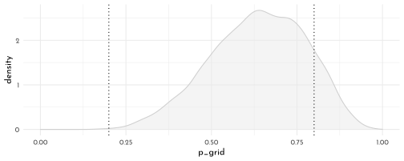

**E1**


```r
mean(easy_samples$p_grid <= .2)
```

```
#> [1] 5e-04
```

**E2**


```r
mean(easy_samples$p_grid > .8)
```

```
#> [1] 0.1219
```

**E3**


```r
mean( easy_samples$p_grid > .2 &  easy_samples$p_grid < .8)
```

```
#> [1] 0.8776
```

**E4**


```r
quantile(easy_samples$p_grid , probs = .2)
```

```
#>       20% 
#> 0.5145315
```

**E5**


```r
quantile(easy_samples$p_grid , probs = .8)
```

```
#>       80% 
#> 0.7618962
```

**E6**


```r
HPDI(easy_samples$p_grid, prob = .66)
```

```
#>     |0.66     0.66| 
#> 0.5138514 0.7886789
```

```r
p_e6 <- easy_samples %>% 
  ggplot(aes(x = p_grid)) +
  geom_density(color = clr0d, fill = fll0) +
  stat_function(fun = function(x){demp(x = x, obs = easy_samples$p_grid)},
                geom = "area",
                xlim = HPDI(easy_samples$p_grid, prob = .66),
                color = clr2, fill = fll2) +
  scale_color_manual(values = c(posterior = clr2), guide = "none") +
  theme(legend.position = "bottom")
```

**E7**


```r
PI(easy_samples$p_grid, prob = .66)
```

```
#>       17%       83% 
#> 0.4972327 0.7745775
```

```r
p_e7 <- easy_samples %>% 
  ggplot(aes(x = p_grid)) +
  geom_density(color = clr0d, fill = fll0) +
  stat_function(fun = function(x){demp(x = x, obs = easy_samples$p_grid)},
                geom = "area",
                xlim = PI(easy_samples$p_grid, prob = .66),
                color = clr2, fill = fll2) +
  scale_color_manual(values = c(posterior = clr2), guide = "none") +
  theme(legend.position = "bottom")

p_e6 + p_e7
```

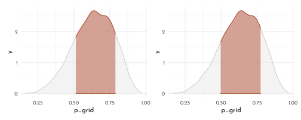

**M1**


```r
grid_data <- grid_approx(n_grid = 10^4 + 1, L = 8, W = 7,
                         prior = function(x){rep(1, length(x))}) %>% 
  mutate(idx = 1:(10^4 + 1))

grid_data %>% 
  ggplot(aes(x = p_grid))+
  geom_line(aes(y = posterior, color = "posterior")) +
  scale_color_manual(values = c(posterior = clr2), guide = "none") +
  theme(legend.position = "bottom")
```


**M2**


```r
samples <- grid_data %>% 
  slice_sample(n = 10^5 , weight_by = posterior, replace = TRUE) %>% 
  mutate(w = purrr::map_dbl(p_grid, rbinom, n = 1, size = 15))

HPDI(samples$p_grid, prob = .9)
```

```
#>   |0.9   0.9| 
#> 0.3329 0.7218
```

**M3**


```r
p_posterior <- grid_data %>% 
  ggplot(aes(x = p_grid, y = posterior)) +
  geom_area(color = clr0d, fill = fll0) +
  geom_segment(data = grid_data %>% filter(idx %in% (1+ (1:9)*1000)),
               aes(xend = p_grid,
                   yend = 0, size = posterior),
               color = fll2) +
  geom_point(data = grid_data %>% filter(idx %in% (1+ (1:9)*1000)),
               color = clr2) +
  scale_size_continuous(range = c(.1, 1), guide = "none") +
  labs(x = "probability of water", y = "density", title = "Posterior Probability")

d_small <- tibble(probability = seq(from = .1, to = .9, by = .1)) %>% 
  mutate(draws = purrr::map(probability, simulate_binom, size = 15)) %>% 
  unnest(draws)

p_small <- d_small %>% 
  ggplot(aes(x = draws)) +
  geom_bar(stat = "count", color = clr2, fill = fll2, width = .6) +
  facet_wrap(probability ~ ., nrow = 1)+
  labs(title = "Sampling Distributions")

p_posterior_predictive <- samples %>% 
  ggplot(aes(x = factor(w))) +
  geom_bar(stat = "count",
           aes(color = w == 8 ,
               fill = after_scale(clr_alpha(color, .3))),
           width = .6) +
  scale_color_manual(values = c(`TRUE` = clr2, `FALSE` = clr0d), guide = "none") +
  labs(x = "number of water samples", title = "Posterior Predictive Distribution")
```


```r
p_posterior / 
  p_small /
  p_posterior_predictive
```


```r
sum( samples$w == 8 ) / length( samples$w )
```

```
#> [1] 0.14738
```

**M4**


```r
samples <- grid_data %>% 
  slice_sample(n = 10^5 , weight_by = posterior, replace = TRUE) %>% 
  mutate(w = purrr::map_dbl(p_grid, rbinom, n = 1, size = 9))

samples %>% 
  ggplot(aes(x = factor(w))) +
  geom_bar(stat = "count",
           aes(color = w == 6 ,
               fill = after_scale(clr_alpha(color, .3))),
           width = .6) +
  scale_color_manual(values = c(`TRUE` = clr2, `FALSE` = clr0d), guide = "none") +
  labs(x = "number of water samples", title = "Posterior Predictive Distribution")
```


```r
sum( samples$w == 6 ) / length( samples$w )
```

```
#> [1] 0.17634
```

**M5**


```r
grid_data <- grid_approx(n_grid = 10^4 + 1, L = 8, W = 7,
                         prior = function(x){if_else(x < .5, 0, 1)}) %>% 
  mutate(idx = 1:(10^4 + 1))
```


```r
samples <- grid_data %>% 
  slice_sample(n = 10^5 , weight_by = posterior, replace = TRUE) %>% 
  mutate(w = purrr::map_dbl(p_grid, rbinom, n = 1, size = 15))

HPDI(samples$p_grid, prob = .9)
```

```
#>   |0.9   0.9| 
#> 0.5000 0.7117
```


```r
p_posterior <- grid_data %>% 
  ggplot(aes(x = p_grid, y = posterior)) +
  geom_area(color = clr0d, fill = fll0) +
  geom_segment(data = grid_data %>% filter(idx %in% (1+ (1:9)*1000)),
               aes(xend = p_grid,
                   yend = 0, size = posterior),
               color = fll2) +
  geom_point(data = grid_data %>% filter(idx %in% (1+ (1:9)*1000)),
               color = clr2) +
  scale_size_continuous(range = c(.1, 1), guide = "none") +
  labs(x = "probability of water", y = "density", title = "Posterior Probability")

d_small <- tibble(probability = seq(from = .1, to = .9, by = .1)) %>% 
  mutate(draws = purrr::map(probability, simulate_binom, size = 15)) %>% 
  unnest(draws)

p_small <- d_small %>% 
  ggplot(aes(x = draws)) +
  geom_bar(stat = "count", color = clr2, fill = fll2, width = .6) +
  facet_wrap(probability ~ ., nrow = 1)+
  labs(title = "Sampling Distributions")

p_posterior_predictive <- samples %>% 
  ggplot(aes(x = factor(w))) +
  geom_bar(stat = "count",
           aes(color = w == 8 ,
               fill = after_scale(clr_alpha(color, .3))),
           width = .6) +
  scale_color_manual(values = c(`TRUE` = clr2, `FALSE` = clr0d), guide = "none") +
  labs(x = "number of water samples", title = "Posterior Predictive Distribution")
```


```r
p_posterior / 
  p_small /
  p_posterior_predictive
```

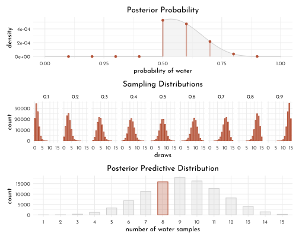

```r
sum( samples$w == 8 ) / length( samples$w )
```

```
#> [1] 0.15846
```

**M6**


```r
random_tosses <- function(n, n_grid = 1e4, n_posterior_sample = 1e4,
                          prior = function(x){rep(1, length(x))}){
  
  grid_data <- tibble(p_grid = seq(0, 1, length.out = n_grid),
                      prior = prior(p_grid),
                      likelihood = dbinom(rbinom(1, size = n, prob = .7),
                                          size = n, prob = p_grid),
                      posterior_unstand = likelihood * prior,
                      posterior = posterior_unstand / sum(posterior_unstand))
  
  samples <- grid_data %>% 
    slice_sample(n = n_posterior_sample, weight_by = posterior, replace = TRUE)
  
  tibble(n = n,
         grid_data = list(grid_data),
         samples = list(samples),
         hpdi = list(HPDI(samples[[1]]$p_grid, prob = .99)),
         hpdi_width = diff(hpdi[[1]]))
}


c(c(1:10),((1:100) *30)) %>% 
  map_dfr(random_tosses) %>% 
  ggplot(aes(x = n, y = hpdi_width)) +
  geom_point(aes(color = hpdi_width < .05)) +
  geom_hline(yintercept = .05, color = "black", linetype = 3) +
  scale_color_manual(values = c(`FALSE` = clr0d, `TRUE` = clr2),
                     guide = "none")
```

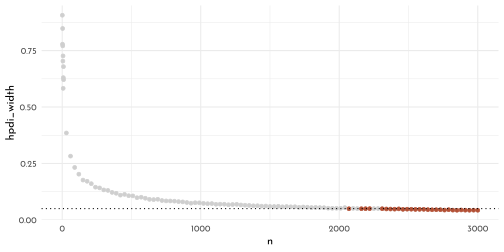

**H1**


```r
library(rethinking)
data(homeworkch3)

n_grid <- 1e4 + 1
grid_data <- tibble(p_grid = seq(0, 1, length.out = n_grid),
                    prior = (function(x){rep(1, length(x))})(p_grid),
                    likelihood = dbinom(sum(birth1 + birth2),
                                        size = length(c(birth1, birth2)),
                                        prob = p_grid),
                    posterior_unstand = likelihood * prior,
                    posterior = posterior_unstand / sum(posterior_unstand))

samples <- grid_data %>% 
  slice_sample(n = 1e5,
               weight_by = posterior, replace = TRUE)

(mode_posterior <- chainmode(samples$p_grid))
```

```
#> [1] 0.5547754
```

```r
grid_data %>% 
  ggplot(aes(x = p_grid, y = posterior)) +
  geom_area(color = clr0d, fill = fll0, size = .5) +
  geom_vline(xintercept = mode_posterior, color = clr2, linetype = 3)
```

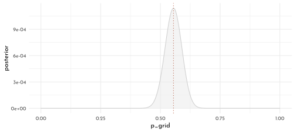

**H2**


```r
(percentile_intervals <- tibble(boundary = c("lower", "upper"),
       p50 = HPDI(samples$p_grid, prob = .5),
       p89 = HPDI(samples$p_grid, prob = .89),
       p97 = HPDI(samples$p_grid, prob = .97))) %>% 
  knitr::kable()
```


|boundary |    p50|    p89|    p97|
|:--------|------:|------:|------:|
|lower    | 0.5306| 0.4977| 0.4775|
|upper    | 0.5778| 0.6090| 0.6274|

```r
grid_data %>% 
  ggplot(aes(x = p_grid, y = posterior)) +
  stat_function(fun = function(x){demp(x = x, obs = samples$p_grid)},
                geom = "line", color = clr0d, xlim = c(0,1), n = 501) +
  stat_function(fun = function(x){demp(x = x, obs = samples$p_grid)},
                geom = "area", color = clr2, fill = clr_alpha(fll2,.2),
                xlim = percentile_intervals$p50, n = 501) +
  stat_function(fun = function(x){demp(x = x, obs = samples$p_grid)},
                geom = "area", color = clr2, fill = clr_alpha(fll2,.2),
                xlim = percentile_intervals$p89, n = 501) +
  stat_function(fun = function(x){demp(x = x, obs = samples$p_grid)},
                geom = "area", color = clr2, fill = clr_alpha(fll2,.2),
                xlim = percentile_intervals$p97, n = 501)
```


**H3**


```r
random_births <- grid_data %>% 
  slice_sample(n = 1e4,
               weight_by = posterior, replace = TRUE) %>% 
  mutate(births = map(p_grid, .f = function(x){rbinom(n = 200, size = 1, prob = x)}),
         n_boys = map_dbl(births, sum),
         n_girls = 200 - n_boys,
         n_boys_firstborn = map_dbl(births, function(x){ sum(x[1:100]) }))

sum(random_births$n_boys < sum(birth1 + birth2)) / sum(birth1 + birth2)
```

```
#> [1] 43.45946
```

```r
p_all <- random_births %>% 
  ggplot(aes(x = n_boys)) +
  geom_density(color = clr0d, fill = fll0) +
  geom_vline(xintercept = sum(birth1 + birth2),
             color = clr2, linetype = 3) +
  scale_x_continuous(limits = c(0, 200)) 

p_first <- random_births %>% 
  ggplot(aes(x = n_boys_firstborn)) +
  geom_density(color = clr0d, fill = fll0) +
  geom_vline(xintercept = sum(birth1),
             color = clr2, linetype = 3) +
  scale_x_continuous(limits = c(0, 100)) 

p_all + p_first
```

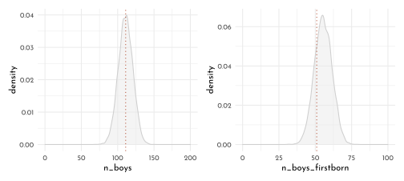

**H5**


```r
births_first_girl <- tibble(birth1 = birth1,
                            birth2 = birth2) %>% 
  filter(birth1 == 0)

n_first_girl <- length(births_first_girl$birth2)

random_births <- grid_data %>% 
  slice_sample(n = 1e4,
               weight_by = posterior, replace = TRUE) %>% 
  mutate(births = map(p_grid, .f = function(x){rbinom(n = n_first_girl, size = 1, prob = x)}),
         n_boys = map_dbl(births, sum),
         n_girls = n_first_girl - n_boys)

sum(random_births$n_boys < sum(births_first_girl$birth2)) / 1e4
```

```
#> [1] 0.9991
```

```r
random_births %>% 
  ggplot(aes(x = n_boys)) +
  geom_density(color = clr0d, fill = fll0) +
  geom_vline(xintercept = sum(births_first_girl$birth2),
             color = clr2, linetype = 3) +
  scale_x_continuous(limits = c(0, n_first_girl),
                     expand = c(0, 0)) 
```

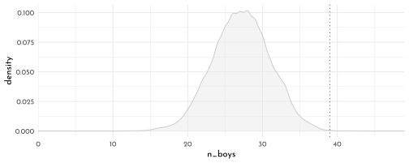

## {brms} section


```r
brms_c3_6in9 <- brm(data = list(w = 6),
                    family = binomial(link = "identity"),
                    w | trials(9) ~ 0 + Intercept,
                    # this is a flat prior
                    prior(beta(1, 1), class = b, lb = 0, ub = 1),
                    iter = 5000, warmup = 1000,
                    seed = 42,
                    file = "brms/brms_c3_6in9")

posterior_summary(brms_c3_6in9) %>% 
  round(digits = 3) %>% 
  knitr::kable()
```


|            | Estimate| Est.Error|   Q2.5|  Q97.5|
|:-----------|--------:|---------:|------:|------:|
|b_Intercept |    0.637|     0.140|  0.346|  0.879|
|lp__        |   -3.310|     0.748| -5.392| -2.780|

```r
n_trials <- 9
samples_brms <- fitted(brms_c3_6in9, 
                       summary = FALSE,
                       scale = "linear") %>% 
  as_tibble() %>% 
  set_names(nm = "p") %>% 
  mutate(w = rbinom(n(), size = n_trials,  prob = p))

p_brms_posterior <- samples_brms %>% 
  ggplot(aes(x = p)) +
  geom_density(color = clr1, fill = fll1) +
  scale_x_continuous(limits = c(0, 1), expand = c(0, 0)) +
  labs(y = "density", x = "proportion water",
       title = "{brms} posterior probability (6 in 9)")

p_brms_posterior_predictive <- samples_brms %>% 
  ggplot(aes(x = factor(w))) +
    geom_bar(stat = "count",
           aes(color = w == 6 ,
               fill = after_scale(clr_alpha(color, .3))),
           width = .6) +
  scale_color_manual(values = c(`TRUE` = clr1, `FALSE` = clr0d), guide = "none") +
  labs(y = "count", x = "number of water samples",
       title = "posterior predictive distribution")

p_brms_posterior + p_brms_posterior_predictive
```


---

<div id="myModal" class="modal">
  <span class="close">&times;</span>
  
  <div id="caption"></div>
</div>

<script src="./js/zoom.js"></script>
