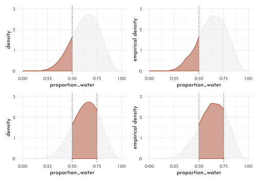

---
output:
  html_document:
  theme: yeti
pdf_document: default
editor_options: 
  chunk_output_type: console
---

# Rethinking: Chapter 3

**Sampling the Imaginary**


by [Richard McElreath](https://xcelab.net/rm/statistical-rethinking/), building on the Summary by [Solomon Kurz](https://bookdown.org/content/4857/)

$$
Pr(vampire|positive) = \frac{Pr(positive|vampire) \times Pr(vampire)}{Pr(positive)}
$$


```r
pr_positive_on_vamp <- .95
pr_positive_on_mort <- .01
pr_vamp <- .001
pr_positive <- pr_positive_on_vamp * pr_vamp + pr_positive_on_mort * (1 - pr_vamp)
(pr_vamp_on_positive <- pr_positive_on_vamp * pr_vamp /pr_positive)
```

```
#> [1] 0.08683729
```

## Sampling from a grid approximate posterior

*posterior* here means simply 'the probability of *p* conditional on the data':


```r
grid_approx <- function(n_grid = 20, L = 6, W = 3, prior = function(x){rep(1, length(x))}){
  tibble(p_grid = seq(0, 1, length.out = n_grid),
         prior = prior(p_grid),
         likelihood = dbinom(L, size = W + L, prob = p_grid),
         posterior_unstand = likelihood * prior,
         posterior = posterior_unstand / sum(posterior_unstand))
}

grid_data <- grid_approx(n_grid = 10^4)

samples <- tibble(sample = 1:(10^4),
                    proportion_water = sample(x = grid_data$p_grid, size = length(sample),
                  prob = grid_data$posterior, replace = TRUE))

p_scatter <- samples %>% 
  ggplot(aes(x = sample, y = proportion_water)) +
  geom_point(size = .75, shape = 21, color = clr_alpha(clr2,.3), fill = clr_alpha(clr2,.1)) +
  scale_x_continuous(expand = c(0,0))

p_dens <- samples %>% 
  ggplot(aes(x = proportion_water)) +
  geom_density( color = clr2, fill = fll2) +
  scale_x_continuous(limits = c(0,1), expand = c(0, 0)) 

p_scatter + p_dens
```


## Sampling to Summarize

Once the posterior distribution is created, the model is done.

Typical targets / questions:

- intervals of *defined boundaries*
- intervals of *defined probability mass*
- *point estimates*

### Intervals of devined boundaries


```r
sum(grid_data$posterior[grid_data$p_grid < 0.5])
```

```
#> [1] 0.171875
```

```r
sum(samples$proportion_water < .5) / length(samples$proportion_water)
```

```
#> [1] 0.1651
```

```r
sum(samples$proportion_water > .5 & samples$proportion_water < .75) / length(samples$proportion_water)
```

```
#> [1] 0.6058
```

```r
# f_post <-  function(x){dbeta(x = x, shape1 = 9 +1 , shape2 = 6 +1)}
f_post <-  function(x){dbinom(x = 6, size = 9, prob = x)}
f_post_norm <- function(x){ f_post(x) / integrate(f = f_post,lower = 0, upper = 1)[[1]]}
```


```r
plot_intervals <- function(x_bounds = c(0, 1),
                           x_line = as.numeric(NA),
                           f_posterior = f_post_norm,
                           data = samples,
                           ylim = c(0, 3)){
  p_d <- ggplot() +
  stat_function(fun = f_posterior, xlim = c(0,1),
                geom = "area", color = clr0, fill = fll0) +
  stat_function(fun = f_posterior, xlim = x_bounds,
                geom = "area", color = clr2, fill = fll2) +
  labs(y = "density", x = "proportion_water")

p_d_emp <- data %>%
  ggplot(aes(x = proportion_water)) +
  geom_density( color = clr0, fill = fll0) +
  stat_function(fun = function(x){demp(obs = data$proportion_water, x = x)},
                xlim = x_bounds,
                geom = "area", color = clr2, fill = fll2) +
  labs(y = "empirical density")

p_d + p_d_emp  &
  geom_vline(data = tibble(x = x_line),
             aes(xintercept = x), linetype = 3) &
  scale_y_continuous(limits = ylim)&
  scale_x_continuous(limits = c(0, 1))
}
```


```r
plot_intervals(x_bounds = c(0, .5), x_line = .5) /
plot_intervals(x_bounds = c(.5, .75), x_line = c(.5, .75))
```




### Intervals of defined mass

aka.:

- ***compatibility interval***
- *credible interval*
- *percentile interval*

special form: *highest posterior density interval (HPDI)*


```r
qnt_80 <- quantile(samples$proportion_water, probs = .8)
qnt_80_inner <- quantile(samples$proportion_water, probs = c(.1, .9))
plot_intervals(x_bounds = c(0, qnt_80), x_line = qnt_80)/
plot_intervals(x_bounds = qnt_80_inner, x_line = qnt_80_inner)
```


```r
library(rethinking)
map <- purrr::map

grid_data_skew <- grid_approx(L = 3, W = 0, n_grid = 10^4)

samples_skew <- tibble(sample = 1:(10^4),
                       proportion_water = sample(x = grid_data_skew$p_grid, size = length(sample),
                                                 prob = grid_data_skew$posterior, replace = TRUE))

f_post_skew <-  function(x){dbinom(x = 3, size = 3, prob = x)}
f_post_norm_skew <- function(x){ f_post_skew(x) / integrate(f = f_post_skew, lower = 0, upper = 1)[[1]]}

qnt_50_inner <- PI(samples_skew$proportion_water, prob = .5)
qnt_50_high_dens <- HPDI(samples_skew$proportion_water, prob = .5)

plot_intervals(x_bounds = qnt_50_inner, x_line = qnt_50_inner,
               f_posterior = f_post_norm_skew, data = samples_skew, ylim = c(0, 4)) /
  plot_intervals(x_bounds = qnt_50_high_dens, x_line = qnt_50_high_dens,
               f_posterior = f_post_norm_skew, data = samples_skew, ylim = c(0, 4)) 
```


---

<div id="myModal" class="modal">
  <span class="close">&times;</span>
  
  <div id="caption"></div>
</div>

<script src="./js/zoom.js"></script>
