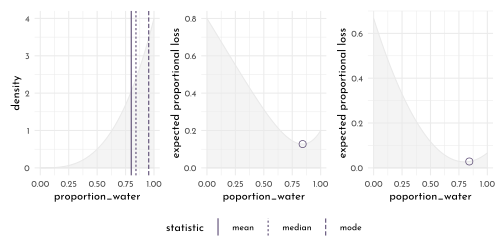
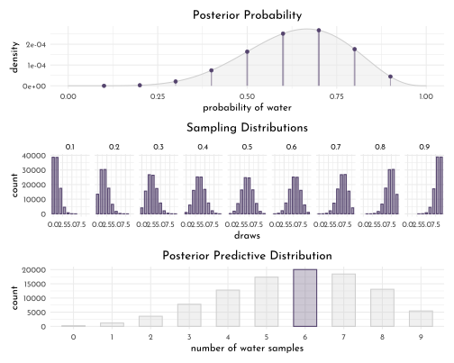
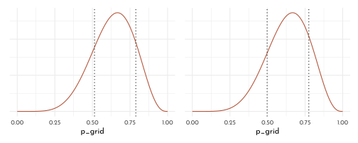
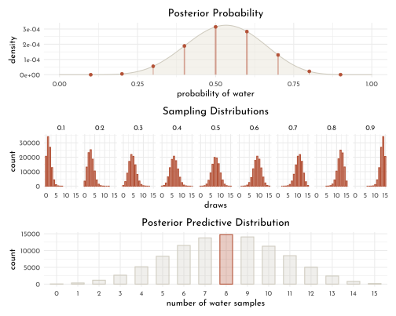
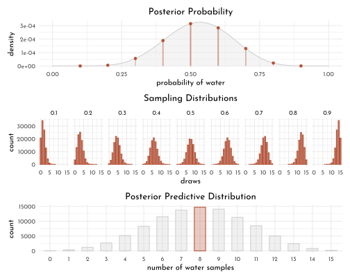

---
output:
  html_document:
  theme: yeti
pdf_document: default
editor_options: 
  chunk_output_type: console
---

# Rethinking: Chapter 3

**Sampling the Imaginary**


by [Richard McElreath](https://xcelab.net/rm/statistical-rethinking/), building on the Summary by [Solomon Kurz](https://bookdown.org/content/4857/)

$$
Pr(vampire|positive) = \frac{Pr(positive|vampire) \times Pr(vampire)}{Pr(positive)}
$$


```r
pr_positive_on_vamp <- .95
pr_positive_on_mort <- .01
pr_vamp <- .001
pr_positive <- pr_positive_on_vamp * pr_vamp + pr_positive_on_mort * (1 - pr_vamp)
(pr_vamp_on_positive <- pr_positive_on_vamp * pr_vamp /pr_positive)
```

```
#> [1] 0.08683729
```

## Sampling from a grid approximate posterior

*posterior* here means simply 'the probability of *p* conditional on the data':


```r
grid_approx <- function(n_grid = 20, L = 6, W = 3, prior = function(x){rep(1, length(x))}){
  tibble(p_grid = seq(0, 1, length.out = n_grid),
         prior = prior(p_grid),
         likelihood = dbinom(L, size = W + L, prob = p_grid),
         posterior_unstand = likelihood * prior,
         posterior = posterior_unstand / sum(posterior_unstand))
}

grid_data <- grid_approx(n_grid = 10^4)

samples <- tibble(sample = 1:(10^4),
                    proportion_water = sample(x = grid_data$p_grid, size = length(sample),
                  prob = grid_data$posterior, replace = TRUE))

p_scatter <- samples %>% 
  ggplot(aes(x = sample, y = proportion_water)) +
  geom_point(size = .75, shape = 21, color = clr_alpha(clr2,.3), fill = clr_alpha(clr2,.1)) +
  scale_x_continuous(expand = c(0,0))

p_dens <- samples %>% 
  ggplot(aes(x = proportion_water)) +
  geom_density( color = clr2, fill = fll2) +
  scale_x_continuous(limits = c(0,1), expand = c(0, 0)) 

p_scatter + p_dens
```


## Sampling to Summarize

Once the posterior distribution is created, the model is done.

Typical targets / questions:

- intervals of *defined boundaries*
- intervals of *defined probability mass*
- *point estimates*

### Intervals of devined boundaries


```r
sum(grid_data$posterior[grid_data$p_grid < 0.5])
```

```
#> [1] 0.171875
```

```r
sum(samples$proportion_water < .5) / length(samples$proportion_water)
```

```
#> [1] 0.1797
```

```r
sum(samples$proportion_water > .5 & samples$proportion_water < .75) / length(samples$proportion_water)
```

```
#> [1] 0.5976
```

```r
# f_post <-  function(x){dbeta(x = x, shape1 = 9 +1 , shape2 = 6 +1)}
f_post <-  function(x){dbinom(x = 6, size = 9, prob = x)}
f_post_norm <- function(x){ f_post(x) / integrate(f = f_post,lower = 0, upper = 1)[[1]]}
```


```r
plot_intervals <- function(x_bounds = c(0, 1),
                           x_line = as.numeric(NA),
                           f_posterior = f_post_norm,
                           data = samples,
                           ylim = c(0, 3)){
  p_d <- ggplot() +
  stat_function(fun = f_posterior, xlim = c(0,1),
                geom = "area", color = clr0, fill = fll0) +
  stat_function(fun = f_posterior, xlim = x_bounds,
                geom = "area", color = clr2, fill = fll2) +
  labs(y = "density", x = "proportion_water")

p_d_emp <- data %>%
  ggplot(aes(x = proportion_water)) +
  geom_density( color = clr0, fill = fll0) +
  stat_function(fun = function(x){demp(obs = data$proportion_water, x = x)},
                xlim = x_bounds,
                geom = "area", color = clr2, fill = fll2) +
  labs(y = "empirical density")

p_d + p_d_emp  &
  geom_vline(data = tibble(x = x_line),
             aes(xintercept = x), linetype = 3) &
  scale_y_continuous(limits = ylim)&
  scale_x_continuous(limits = c(0, 1))
}
```


```r
plot_intervals(x_bounds = c(0, .5), x_line = .5) /
plot_intervals(x_bounds = c(.5, .75), x_line = c(.5, .75))
```


### Intervals of defined mass

aka.:

- ***compatibility interval***
- *credible interval*
- *percentile interval*

special form: *highest posterior density interval (HPDI)*


```r
qnt_80 <- quantile(samples$proportion_water, probs = .8)
qnt_80_inner <- quantile(samples$proportion_water, probs = c(.1, .9))
plot_intervals(x_bounds = c(0, qnt_80), x_line = qnt_80)/
plot_intervals(x_bounds = qnt_80_inner, x_line = qnt_80_inner)
```


```r
library(rethinking)
map <- purrr::map

grid_data_skew <- grid_approx(L = 3, W = 0, n_grid = 10^4)

samples_skew <- tibble(sample = 1:(10^4),
                       proportion_water = sample(x = grid_data_skew$p_grid, size = length(sample),
                                                 prob = grid_data_skew$posterior, replace = TRUE))

f_post_skew <-  function(x){dbinom(x = 3, size = 3, prob = x)}
f_post_norm_skew <- function(x){ f_post_skew(x) / integrate(f = f_post_skew, lower = 0, upper = 1)[[1]]}

qnt_50_inner <- PI(samples_skew$proportion_water, prob = .5)
qnt_50_high_dens <- HPDI(samples_skew$proportion_water, prob = .5)

plot_intervals(x_bounds = qnt_50_inner, x_line = qnt_50_inner,
               f_posterior = f_post_norm_skew, data = samples_skew, ylim = c(0, 4)) /
  plot_intervals(x_bounds = qnt_50_high_dens, x_line = qnt_50_high_dens,
               f_posterior = f_post_norm_skew, data = samples_skew, ylim = c(0, 4)) 
```


## Point estimates


```r
point_estimates <- tibble(proportion_water= list(mean, median, chainmode) %>%
                            map_dbl(.f = function(f, vals){ f(vals) },
                                    vals = samples_skew$proportion_water),
                          statistic = c("mean", "median", "mode"))

p_point_estimates <- ggplot() +
  stat_function(fun = f_post_norm_skew, xlim = c(0,1),
                geom = "area", color = clr0, fill = fll0) +
  geom_vline(data = point_estimates, 
             aes(xintercept = proportion_water, linetype = statistic),
             color = clr1) +
  labs(y = "density")

f_loss <- function(x){
    map_dbl(x, function(x){ sum( grid_data_skew$posterior  * abs( x - grid_data_skew$p_grid))
    })}

f_loss_quad <- function(x){
    map_dbl(x, function(x){ sum( grid_data_skew$posterior  * ( x - grid_data_skew$p_grid) ^ 2)
    })}

p_loss <- ggplot() +
  stat_function(fun = f_loss,
    xlim = c(0,1),
    geom = "area", color = clr0, fill = fll0) +
  geom_point(data = tibble(x = point_estimates$proportion_water[2],
                           y = f_loss(point_estimates$proportion_water[2])),
             aes(x = x, y = y), shape = 1, size = 3, color = clr1) +
  labs(x = "poportion_water", y = "expected proportional loss")

p_loss_quad <- ggplot() +
  stat_function(fun = f_loss_quad,
    xlim = c(0,1),
    geom = "area", color = clr0, fill = fll0) +
  geom_point(data = tibble(x = point_estimates$proportion_water[2],
                           y = f_loss_quad(point_estimates$proportion_water[2])),
             aes(x = x, y = y), shape = 1, size = 3, color = clr1) +
  labs(x = "poportion_water", y = "expected proportional loss")

p_point_estimates + p_loss + p_loss_quad +
  plot_layout(guide = "collect") & theme(legend.position = "bottom")
```



## sample to simulate prediction


binomial likelihood

$$
Pr(W | N ,p) = \frac{N!}{W! (N -W)!} p^{W}(1 - p)^{N-W}
$$


```r
dbinom( 0:2, size = 2, prob = .7)
```

```
#> [1] 0.09 0.42 0.49
```

```r
rbinom( 10, size = 2, prob = .7)
```

```
#>  [1] 2 2 1 2 2 1 1 0 1 2
```

```r
create_dummy_w <- function(size, prob){
  tibble(x = rbinom(10^5, size = size, prob = prob),
         size = size,
         prob = prob)
}
dummy_w <- create_dummy_w(size = 9, prob = .7)

dummy_w %>% 
  group_by(x) %>% 
  count() %>% 
  ungroup() %>% 
  ggplot(aes(x = factor(x), y =  n)) +
  geom_bar(stat = "identity", color = clr1, fill = fll1, width = .6) +
  labs(y = "count", x = "dummy water count")
```


```r
tibble(size = rep(c(3,6,9), each = 3),
       prob = rep(c(.3,.6,.9),3)) %>% 
  pmap_dfr(create_dummy_w) %>% 
  group_by(x, size , prob) %>% 
  count() %>% 
  ungroup() %>% 
  ggplot(aes(x = factor(x), y =  n)) +
  geom_bar(stat = "identity", color = clr1, fill = fll1, width = .6) +
  facet_grid(prob ~ size, scales = "free",
             space = "free_x", labeller = label_both) +
  labs(y = "count", x = "dummy water count") +
  theme(panel.background = element_rect(color = clr0d, fill = clr_alpha(clr0d,.2)))
```


```r
f_posterior <- function(x){dbinom(x = 6, size = 9, prob = x)}
f_posterior_dens <- function(x){ f_posterior(x) / integrate(f = f_posterior, lower = 0, upper = 1)[[1]]}

grid_points <- grid_points <- tibble(x = seq(.1,.9, by = .1),
                      y = f_posterior_dens(x))

p_posterior <- ggplot() +
  stat_function(fun = f_posterior_dens,
                geom = "area", color = clr0d, fill = fll0,xlim = c(0,1)) +
  geom_segment(data = grid_points, aes(x = x, xend = x, y = 0, yend = y),
               color = clr1, linetype = 3) +
  geom_point(data = grid_points, aes(x = x, y = y),
               color = clr1) +
  labs(x = "probability of water", y = "density")

simulate_binom <- function(probability, n_draws = 10^5, size = 9) {
  rbinom(n_draws, size = size, prob = probability) 
}

d_small <- tibble(probability = seq(from = .1, to = .9, by = .1)) %>% 
  mutate(draws = purrr::map(probability, simulate_binom)) %>% 
  unnest(draws)

p_small <- d_small %>% 
  ggplot(aes(x = draws)) +
  geom_bar(stat = "count", color = clr1, fill = fll1, width = .6) +
  facet_wrap(probability ~ ., nrow = 1)

dist_posterior <- tibble(n_water = rbinom(10^4, size = 9, prob = samples$proportion_water),
                         seq = map(n_water, .f = function(x){sample(x = rep(c("W","L"), c(x, 9-x)),
                                                                    size = 9,
                                                                    replace = FALSE)}),
                         max_run_length = map_dbl(seq,.f = function(x){rle(x)$lengths %>% max()}),
                         n_switches = map_dbl(seq,.f = function(x){(rle(x)$lengths %>% length()) -1})) 

p_posterior_predictive <- dist_posterior %>% 
  ggplot(aes(x = factor(n_water))) +
  geom_bar(stat = "count", color = clr1, fill = fll1, width = .6) +
  labs(x = "number of water samples")
```


```r
p_posterior / 
  p_small /
  p_posterior_predictive
```


```r
globe_data <- c("w", "l", "w", "w", "w", "l", "w", "l", "w")
globe_run_length <- rle(globe_data)$lengths %>% max()
globe_n_switches <- (rle(globe_data)$lengths %>% length()) -1 

p_run_length <- dist_posterior %>% 
  ggplot(aes(x = factor(max_run_length))) +
  geom_bar(stat = "count", aes(color = max_run_length == globe_run_length, 
                               fill = after_scale(clr_alpha(color))), width = .6) +
  scale_color_manual(values = c(`TRUE` = clr2, `FALSE` = clr0d), guide = "none") +
  labs(x = "longest run length")

p_switches <- dist_posterior %>% 
  ggplot(aes(x = factor(n_switches))) +
  geom_bar(stat = "count", aes(color = n_switches == globe_n_switches, 
                               fill = after_scale(clr_alpha(color))), width = .6) +
  scale_color_manual(values = c(`TRUE` = clr2, `FALSE` = clr0d), guide = "none") +
  labs(x = "number of switches")
p_run_length + p_switches
```



---

## Homework


```r
n <- 10^4
set.seed( 100 )
easy_data <- tibble(p_grid = seq( from = 0, to = 1, length.out = n ),
                    prior = rep(1 , n),
                    likelihood = dbinom( 6, size = 9, prob = p_grid),
                    posterior_unscaled = likelihood * prior,
                    posterior = posterior_unscaled / sum(posterior_unscaled),
                    samples = sample( p_grid, prob = posterior, size = n, replace = TRUE),
                    cummulative_posterior = cumsum(posterior))
```


```r
easy_data %>% 
ggplot(aes(x = p_grid)) +
  geom_line(aes(y = prior / sum(prior), color = "prior")) +
  geom_line(aes(y = likelihood / sum(likelihood),
                color = "likelihood")) +
  geom_line(aes(y = posterior, color = "posterior"), linetype = 3) +
  geom_line(aes(y = cummulative_posterior / sum(cummulative_posterior),
                color = "cummulative_posterior"), linetype = 3) +
  scale_color_manual(values = c(prior = clr1, likelihood = clr0d,
                                posterior = clr2, cummulative_posterior = "black")) +
  theme(axis.title.y = element_blank(),
        axis.text.y = element_blank(),
        legend.position = "bottom")
```


**E1**


```r
sum( easy_data$posterior[easy_data$p_grid < .2] )
```

```
#> [1] 0.0008635326
```

**E2**


```r
sum( easy_data$posterior[easy_data$p_grid > .8] )
```

```
#> [1] 0.120821
```

**E3**


```r
sum( easy_data$posterior[easy_data$p_grid > .2 & easy_data$p_grid < .8] )
```

```
#> [1] 0.8783154
```

**E4**


```r
quantile(easy_data$samples, probs = .2)
```

```
#>       20% 
#> 0.5145315
```

```r
max( easy_data$p_grid[easy_data$cummulative_posterior <= .2] )
```

```
#> [1] 0.5162516
```

**E5**


```r
quantile(easy_data$samples, probs = .8)
```

```
#>       80% 
#> 0.7618962
```

```r
min( easy_data$p_grid[easy_data$cummulative_posterior >= .8] )
```

```
#> [1] 0.7605761
```

**E6**


```r
HPDI(easy_data$samples, prob = .66)
```

```
#>     |0.66     0.66| 
#> 0.5138514 0.7886789
```

```r
p_e6 <- easy_data %>% 
  ggplot(aes(x = p_grid)) +
  geom_line(aes(y = posterior, color = "posterior")) +
  geom_vline(data = tibble(x = HPDI(easy_data$samples, prob = .66)),
             aes(xintercept = x), linetype = 3) +
  scale_color_manual(values = c(posterior = clr2), guide = "none") +
  theme(axis.title.y = element_blank(),
        axis.text.y = element_blank(),
        legend.position = "bottom")
```

**E7**


```r
PI(easy_data$samples, prob = .66)
```

```
#>       17%       83% 
#> 0.4972327 0.7745775
```

```r
p_e7 <- easy_data %>% 
  ggplot(aes(x = p_grid)) +
  geom_line(aes(y = posterior, color = "posterior")) +
  geom_vline(data = tibble(x = PI(easy_data$samples, prob = .66)),
             aes(xintercept = x), linetype = 3) +
  scale_color_manual(values = c(posterior = clr2), guide = "none") +
  theme(axis.title.y = element_blank(),
        axis.text.y = element_blank(),
        legend.position = "bottom")

p_e6 + p_e7
```


**M1**


```r
grid_data <- grid_approx(n_grid = 10^4, L = 8, W = 7)

grid_data %>% 
  ggplot(aes(x = p_grid))+
  geom_line(aes(y = posterior, color = "posterior")) +
  scale_color_manual(values = c(posterior = clr2), guide = "none") +
  theme(legend.position = "bottom")
```



**M2**


```r
samples <- tibble(sample = 1:(10^5),
                  proportion_water = sample(x = grid_data$p_grid, size = length(sample),
                                            prob = grid_data$posterior, replace = TRUE))

HPDI(samples$proportion_water, prob = .9)
```

```
#>      |0.9      0.9| 
#> 0.3325333 0.7212721
```

**M3**


```r
f_posterior <- function(x){dbinom(x = 8, size = 15, prob = x)}
f_posterior_dens <- function(x){ f_posterior(x) / integrate(f = f_posterior, lower = 0, upper = 1)[[1]]}

grid_points <- grid_points <- tibble(x = seq(.1, .9, by = .1),
                      y = f_posterior_dens(x))

p_posterior <- ggplot() +
  stat_function(fun = f_posterior_dens,
                geom = "area", color = clr0d, fill = fll0,xlim = c(0,1)) +
  geom_segment(data = grid_points, aes(x = x, xend = x, y = 0, yend = y),
               color = clr1, linetype = 3) +
  geom_point(data = grid_points, aes(x = x, y = y),
               color = clr1) +
  labs(x = "probability of water", y = "density")

simulate_binom <- function(probability, n_draws = 10^5, size = 15) {
  rbinom(n_draws, size = size, prob = probability) 
}

d_small <- tibble(probability = seq(from = .1, to = .9, by = .1)) %>% 
  mutate(draws = purrr::map(probability, simulate_binom)) %>% 
  unnest(draws)

p_small <- d_small %>% 
  ggplot(aes(x = draws)) +
  geom_bar(stat = "count", color = clr1, fill = fll1, width = .6) +
  facet_wrap(probability ~ ., nrow = 1)

dist_posterior <- tibble(n_water = rbinom(10^4, size = 15, prob = samples$proportion_water),
                         seq = map(n_water, .f = function(x){sample(x = rep(c("W","L"), c(x, 15-x)),
                                                                    size = 15,
                                                                    replace = FALSE)}),
                         max_run_length = map_dbl(seq,.f = function(x){rle(x)$lengths %>% max()}),
                         n_switches = map_dbl(seq,.f = function(x){(rle(x)$lengths %>% length()) -1})) 

p_posterior_predictive <- dist_posterior %>%
  ggplot(aes(x = factor(n_water))) +
  geom_bar(stat = "count", aes(color = n_water == 8 ,
                               fill = after_scale(clr_alpha(color, .3))),
           width = .6) +
  scale_color_manual(values = c(`TRUE` = clr1, `FALSE` = clr0d), guide = "none") +
  labs(x = "number of water samples")
```


```r
p_posterior / 
  p_small /
  p_posterior_predictive
```


```r
sum( dist_posterior$n_water == 8 ) / length( dist_posterior$n_water )
```

```
#> [1] 0.1462
```

**M4**


```r
dist_posterior <- tibble(n_water = rbinom(10^4, size = 9, prob = samples$proportion_water),
                         seq = map(n_water, .f = function(x){sample(x = rep(c("W","L"), c(x, 9-x)),
                                                                    size = 9,
                                                                    replace = FALSE)}),
                         max_run_length = map_dbl(seq,.f = function(x){rle(x)$lengths %>% max()}),
                         n_switches = map_dbl(seq,.f = function(x){(rle(x)$lengths %>% length()) -1})) 

dist_posterior %>%
  ggplot(aes(x = factor(n_water))) +
  geom_bar(stat = "count", aes(color = n_water == 6 ,
                               fill = after_scale(clr_alpha(color, .3))),
           width = .6) +
  scale_color_manual(values = c(`TRUE` = clr1, `FALSE` = clr0d), guide = "none") +
  labs(x = "number of water samples")
```



```r
sum( dist_posterior$n_water == 6 ) / length( dist_posterior$n_water )
```

```
#> [1] 0.175
```

**M5**


```r
grid_data <- grid_approx(n_grid = 10^4, L = 8, W = 7, prior = function(x){if_else(x < .5, 0, 1)})

grid_data %>% 
  ggplot(aes(x = p_grid))+
  geom_line(aes(y = posterior, color = "posterior")) +
  scale_color_manual(values = c(posterior = clr1), guide = "none") +
  theme(legend.position = "bottom")
```




```r
samples <- tibble(sample = 1:(10^5),
                  proportion_water = sample(x = grid_data$p_grid, size = length(sample),
                                            prob = grid_data$posterior, replace = TRUE))

HPDI(samples$proportion_water, prob = .9)
```

```
#>      |0.9      0.9| 
#> 0.5000500 0.7127713
```


```r
#<<CURRENT STATUS>>#
f_posterior <- function(x){dbinom(x = 8, size = 15, prob = x)}
f_posterior_dens <- function(x){ f_posterior(x) / integrate(f = f_posterior, lower = 0, upper = 1)[[1]]}

grid_points <- grid_points <- tibble(x = seq(.1, .9, by = .1),
                      y = f_posterior_dens(x))

p_posterior <- ggplot() +
  stat_function(fun = f_posterior_dens,
                geom = "area", color = clr0d, fill = fll0,xlim = c(0,1)) +
  geom_segment(data = grid_points, aes(x = x, xend = x, y = 0, yend = y),
               color = clr2, linetype = 3) +
  geom_point(data = grid_points, aes(x = x, y = y),
               color = clr2) +
  labs(x = "probability of water", y = "density")

simulate_binom <- function(probability, n_draws = 10^5, size = 15) {
  rbinom(n_draws, size = size, prob = probability) 
}

d_small <- tibble(probability = seq(from = .1, to = .9, by = .1)) %>% 
  mutate(draws = purrr::map(probability, simulate_binom)) %>% 
  unnest(draws)

p_small <- d_small %>% 
  ggplot(aes(x = draws)) +
  geom_bar(stat = "count", color = clr2, fill = fll2, width = .6) +
  facet_wrap(probability ~ ., nrow = 1)

dist_posterior <- tibble(n_water = rbinom(10^4, size = 15, prob = samples$proportion_water),
                         seq = map(n_water, .f = function(x){sample(x = rep(c("W","L"), c(x, 15-x)),
                                                                    size = 15,
                                                                    replace = FALSE)}),
                         max_run_length = map_dbl(seq,.f = function(x){rle(x)$lengths %>% max()}),
                         n_switches = map_dbl(seq,.f = function(x){(rle(x)$lengths %>% length()) -1})) 

p_posterior_predictive <- dist_posterior %>%
  ggplot(aes(x = factor(n_water))) +
  geom_bar(stat = "count", aes(color = n_water == 8 ,
                               fill = after_scale(clr_alpha(color, .3))),
           width = .6) +
  scale_color_manual(values = c(`TRUE` = clr2, `FALSE` = clr0d), guide = "none") +
  labs(x = "number of water samples")
```


```r
p_posterior / 
  p_small /
  p_posterior_predictive
```


```r
sum( dist_posterior$n_water == 8 ) / length( dist_posterior$n_water )
```

```
#> [1] 0.1561
```


---

<div id="myModal" class="modal">
  <span class="close">&times;</span>
  
  <div id="caption"></div>
</div>

<script src="./js/zoom.js"></script>
