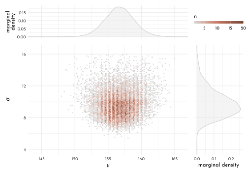
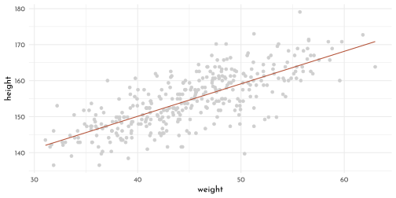
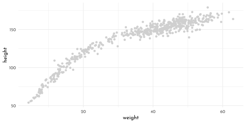
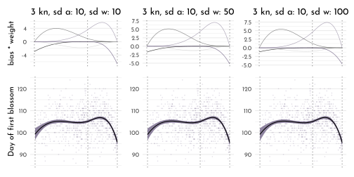
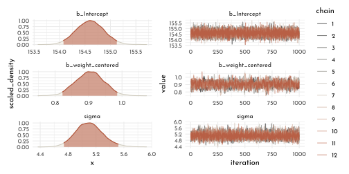

---
output:
  html_document:
  theme: yeti
pdf_document: default
editor_options: 
  chunk_output_type: console
---

# Rethinking: Chapter 4

**Geocentric Models**


by [Richard McElreath](https://xcelab.net/rm/statistical-rethinking/), building on the Summaries by [Solomon Kurz](https://bookdown.org/content/4857/) and [Jake Thompson](https://sr2-solutions.wjakethompson.com/linear-models.html).

## Why normal distributions are normal

### Normal by addition


```r
n_people <- 1e3
position <- crossing(person = 1:n_people,
                     step   = 0:16) %>% 
  mutate(deviation = map_dbl(step, ~if_else(. == 0, 0, runif(1, -1, 1)))) %>% 
  group_by(person) %>%
  mutate(position = cumsum(deviation)) %>% 
  ungroup()

p_all_steps <- position %>% 
  ggplot(aes(x = step, y = position, group = person)) +
  geom_line(aes(color = person == n_people)) +
  geom_point(data = position %>%  filter(person == n_people), aes(color = "TRUE"), size = 1) +
  geom_vline(data = tibble(step = c(4, 8, 16)),
             aes(xintercept = step), linetype = 3, color = rgb(0,0,0,.5)) +
  scale_color_manual(values = c(`TRUE` = clr2, `FALSE` = clr_alpha(clr0d, .05)), guide = "none") +
  scale_x_continuous(breaks = c(0,4,8,16)) +
  theme(panel.grid.major.x = element_blank(),
        panel.grid.minor.x = element_blank())

plot_steps <- function(step_nr, data = position, add_ideal = FALSE){
  data_step <- data %>% 
    filter(step == step_nr) 
  
  p <- data_step %>% 
    ggplot(aes(x = position)) +
    geom_density(adjust = .2, color = clr0d, fill = fll0) +
    scale_x_continuous(limits = c(-6, 6)) +
    labs(title = glue("{step_nr} steps"))
  
  if(add_ideal){p <- p  +
    stat_function(fun = function(x){dnorm(x, mean = 0, sd = sd(data_step$position))},
                  n = 501, color = clr2, linetype = 3)}
  
  p
}
p_all_steps /
(plot_steps(step_nr = 4) + plot_steps(step_nr = 8) + plot_steps(step_nr = 16, add_ideal = TRUE))
```


## Normal by multiplication and by log-multiplication


```r
normal_by_multiplication <- function(effect_size = 0.1,
                                     x_scale = ggplot2::scale_x_continuous(),
                                     x_lab = "normal"){
  tibble(person = 1:n_people,
       growth = replicate(length(person), prod(1 + runif(12, 0, effect_size)))) %>% 
  ggplot(aes(x = growth)) +
  geom_density(color = clr0d, fill = fll0)  +
  labs(title = glue("effect size: {effect_size}"), x = glue("growth ({x_lab})")) +
  x_scale
}

normal_by_multiplication(effect_size = .01) +
  normal_by_multiplication(effect_size = .1) +
  normal_by_multiplication(effect_size = .5)+
  normal_by_multiplication(effect_size = .5, x_scale = scale_x_log10(), x_lab = "log10") +
  plot_layout(nrow = 1)
```


### using the Gaussian distribution

- part of the *exponential family*
- probability density function
- $\mu$: mean
- $\sigma$: standard deviation
- $\tau$: precision

$$
p( y | \mu, \sigma) = \frac{1}{\sqrt{2\pi\sigma^2}} exp \left( \frac{(y-\mu)^2}{2\sigma^2} \right)\\
\tau = 1 / \sigma^2 \\
p( y | \mu, \tau) = \sqrt{\frac{\tau}{2\pi}}exp(-\tfrac{1}{2}\tau(y - \mu)^2)
$$

## A language for describing models

*The first line defines the likelihood used in Bayes' theorem, the other lines describe the priors used. The tilde means that the relationships are **stochastic*.**

re-describing the globe-toss model:

> *The count $W$ is distributed binomially with a sample size $N$ and the probabiliy $p$.*
> *The prior for $p$ is assumed to be uniform between zero and one*

$$
W \sim Binomial(N, p)\\
p \sim Uniform(0, 1)
$$

Substituting in Bayes' theorem:

$$
Pr(p | w, n) = \frac{Binomial(w|n,p)~Uniform(p|0,1)}{\int Binomial(w|n,p)~Uniform(p|0,1) dp}
$$


```r
w <-  6
n <-  9
grid_data <- tibble(p_grid = seq(0,1, length.out = 101),
       likelihood = dbinom(w, n, p_grid),
       prior = dunif(p_grid, 0, 1),
       posterior_unstand = likelihood * prior,
       posterior = posterior_unstand / sum(posterior_unstand))

grid_data %>%
  pivot_longer(cols = c(prior, likelihood, posterior),
               names_to = "bayes_part",
               values_to = "p") %>% 
  mutate(bayes_part = factor(bayes_part, levels = names(clr_bayes))) %>% 
  ggplot(aes(x = p_grid)) +
  geom_area(aes(y = p, color = bayes_part, fill = after_scale(clr_alpha(color)))) +
  scale_color_manual(values = clr_bayes, guide = "none") +
  facet_wrap(bayes_part ~ ., scales = "free_y")
```


### Gaussian model of height

#### The data


```r
library(rethinking)
data(Howell1)

(data <- as_tibble(Howell1)) %>% 
  precis() %>% as_tibble(rownames = NA) %>% knitr::kable()
```


|       |        mean|         sd|      5.5%|     94.5%|histogram     |
|:------|-----------:|----------:|---------:|---------:|:-------------|
|height | 138.2635963| 27.6024476| 81.108550| 165.73500|▁▁▁▁▁▁▁▂▁▇▇▅▁ |
|weight |  35.6106176| 14.7191782|  9.360721|  54.50289|▁▂▃▂▂▂▂▅▇▇▃▂▁ |
|age    |  29.3443934| 20.7468882|  1.000000|  66.13500|▇▅▅▃▅▂▂▁▁     |
|male   |   0.4724265|  0.4996986|  0.000000|   1.00000|▇▁▁▁▁▁▁▁▁▇    |


```r
(data_adults <- data %>% filter(age >= 18)) %>% 
  precis() %>% as_tibble(rownames = NA) %>% knitr::kable()
```


|       |      mean|         sd|     5.5%|     94.5%|histogram       |
|:------|---------:|----------:|--------:|---------:|:---------------|
|height | 154.59709|  7.7423321| 142.8750| 167.00500|▁▃▇▇▅▇▂▁▁       |
|weight |  44.99049|  6.4567081|  35.1375|  55.76588|▁▅▇▇▃▂▁         |
|age    |  41.13849| 15.9678551|  20.0000|  70.00000|▂▅▇▅▃▇▃▃▂▂▂▁▁▁▁ |
|male   |   0.46875|  0.4997328|   0.0000|   1.00000|▇▁▁▁▁▁▁▁▁▇      |


```r
data_adults %>% 
  ggplot(aes(x = height)) +
  geom_density(adjust = .5, color = clr0d, fill = fll0) +
  scale_x_continuous(limits = c(130,185))
```


#### The model

$$
\begin{array}{cccr} 
h_i & \stackrel{iid}{\sim} & Normal(\mu, \sigma) & \textrm{[likelihood]}\\
\mu & \sim & Normal(178, 20) & \textrm{[$\mu$ prior]}\\
\sigma & \sim & Uniform(0,50) & \textrm{[$\sigma$ prior]}
\end{array}
$$

where, $iid$ means *"independent and identically distributed"*.

**Prior predictive simulation**

(*'what does the model think before seeing the data?'*)


```r
n_samples <- 1e4
prior_simulation <- tibble(
  sample_mu = rnorm(n_samples, 178, 20),
  sample_sigma = runif(n_samples, 0, 50),
  prior_h = rnorm(n_samples, sample_mu, sample_sigma),
  bad_mu = rnorm(n_samples, 178, 100),
  bad_prior = rnorm(n_samples, bad_mu, sample_sigma)
)

p_mu <- ggplot() +
    stat_function(fun = function(x){dnorm(x = x, mean = 178, sd = 20)},
                  xlim = c(100,250), color = clr0d, fill = fll0, geom = "area") +
    labs(title = glue("*\U03BC* {mth('\U007E')} dnorm( 178, 20 )"), 
         y = "density", x = "*\U03BC*")

p_sigma <- ggplot() +
    stat_function(fun = function(x){dunif(x = x, min = 0, max = 50)},
                  xlim = c(-5, 55),
                  color = clr1, fill = fll1, geom = "area") +
    labs(title = glue("*{mth('\U03C3')}* {mth('\U007E')} dunif( 0, 50 )"), 
         y = "density", x = glue("*{mth('\U03C3')}*"))

p_prior_sim <- prior_simulation %>% 
  ggplot(aes(x = prior_h)) +
  geom_density(color = clr2, fill = fll2, adjust = .4) +
  scale_x_continuous(limits = c(0,356), breaks = c(0,73,178,283)) +
  labs(title =  glue("*h<sub>i</sub>* {mth('\U007E')} dnorm( *\U03BC*, {mth('\U03C3')} )"),
       x = "height")

p_bad_prior <- prior_simulation %>% 
  ggplot(aes(x = bad_prior)) +
  geom_density(color = clr2, fill = fll2, adjust = .4) +
  scale_x_continuous(limits = c(-222,578),
                     breaks = c(-128,0,178,484), expand = c(0,0)) +
  geom_vline(data = tibble(h = c(0,272)), aes(xintercept = h), linetype = 3)+
  labs(title =  glue("*h<sub>i</sub>* {mth('\U007E')} dnorm( *\U03BC*, {mth('\U03C3')} )<br>*\U03BC* {mth('\U007E')} dnorm( 178, 100 )"),
       x = "height")

p_mu + p_sigma +
  p_prior_sim + p_bad_prior &
  theme(plot.title = element_markdown(),
        axis.title.x = element_markdown())
```


#### grid approximation of the posterior distribution


```r
n_grid <- 101

grid_data <- cross_df(list(mu = seq(from = 152, to = 157, length.out = n_grid),
                           sigma = seq(from = 6.5, to = 9, length.out = n_grid))) %>%
  mutate(log_likelihood = map2_dbl(.x = mu, .y = sigma, .f = function(x, y){
    dnorm(x = data_adults$height, mean = x, sd = y, log = TRUE) %>% sum()
  }),
  prior_mu = dnorm(mu, mean = 178, sd = 20, log = TRUE),
  prior_sigma = dunif(sigma, min = 0, max = 50, log = TRUE),
  product = log_likelihood + prior_mu + prior_sigma,
  probability = exp(product - max(product)))

grid_data %>% 
  ggplot(aes(x = mu, y = sigma, z = probability)) +
  geom_raster(aes(fill = probability)) +
  geom_contour(color = rgb(1,1,1,.1)) +
  coord_cartesian(xlim = range(grid_data$mu),
              ylim = range(grid_data$sigma)) +
  scale_fill_gradientn(colours = clr_grd5 %>% clr_alpha(alpha = .8),
                       limits = c(0,1)) +
  coord_cartesian(xlim = range(grid_data$mu),
                  ylim = range(grid_data$sigma),
                  expand = 0) +
  guides(fill = guide_colorbar(title.position = "top",
                               barwidth = unit(.9,"npc"),
                               barheight = unit(5, "pt"))) +
  labs(x = " *\U03BC*", y = glue("*{mth('\U03C3')}*"))+
  theme(legend.position = "bottom",
        axis.title.x = element_markdown(),
        axis.title.y = element_markdown())
```


**Sampling from the posterior distribution**


```r
n_posterior_sample <- 1e4
samples <- grid_data %>% 
  slice_sample(n = n_posterior_sample, weight_by = probability, replace = TRUE)

p_samples <- samples %>% 
  group_by(mu, sigma) %>% 
  count() %>% 
  ungroup() %>% 
  ggplot(aes(x = mu, y = sigma, color = n)) +
  geom_point(size = .4) +
  scale_color_gradientn(colours = clr_grd5 %>% clr_alpha(alpha = .8)) +
  coord_cartesian(xlim = buffer_range(grid_data$mu),
                  ylim = buffer_range(grid_data$sigma),
                  expand = 0) +
  guides(color = guide_colorbar(title.position = "top",
                               barwidth = unit(.2,"npc"),
                               barheight = unit(5, "pt"))) +
  labs(x = " *\U03BC*", y = glue("*{mth('\U03C3')}*"))+
  theme(legend.position = "bottom",
        axis.title.x = element_markdown(),
        axis.title.y = element_markdown())
  
p_mu_dens <- samples %>% 
  ggplot(aes(x = mu)) +
  geom_density(color = clr0d, fill = fll0) +
  scale_x_continuous(limits = buffer_range(grid_data$mu), expand = c(0, 0)) +
  labs(y = "marginal<br>density") +
  theme(axis.title.x = element_blank(),
        axis.text.x = element_blank(),
        axis.title.y = element_markdown())

p_sigma_dens <- samples %>% 
  ggplot(aes(x = sigma)) +
  geom_density(color = clr0d, fill = fll0) +
  scale_x_continuous(limits = buffer_range(grid_data$sigma), expand = c(0, 0)) +
  labs(y = "marginal density") +
  coord_flip() +
  theme(axis.title.y = element_blank(),
        axis.text.y = element_blank())

p_mu_dens  + patchwork::guide_area() +
  p_samples + p_sigma_dens +
  plot_layout(guides = "collect", widths = c(1,.3), heights = c(.3,1))
```


Exploration of long tail for $\sigma$ when original sample size is small:


```r
heights_subset <- sample(data_adults$height, size = 20)
grid_data_subset <- cross_df(list(mu = seq(from = 145, to = 165, length.out = n_grid),
                           sigma = seq(from = 4.5, to = 16, length.out = n_grid))) %>%
  mutate(log_likelihood = map2_dbl(.x = mu, .y = sigma, .f = function(x, y){
    dnorm(x = heights_subset, mean = x, sd = y, log = TRUE) %>% sum()
  }),
  prior_mu = dnorm(mu, mean = 178, sd = 20, log = TRUE),
  prior_sigma = dunif(sigma, min = 0, max = 50, log = TRUE),
  product = log_likelihood + prior_mu + prior_sigma,
  probability = exp(product - max(product)))

samples_subset <- grid_data_subset %>% 
  slice_sample(n = n_posterior_sample, weight_by = probability, replace = TRUE)

p_samples <- samples_subset %>% 
  group_by(mu, sigma) %>% 
  count() %>% 
  ungroup() %>% 
  ggplot(aes(x = mu, y = sigma, color = n)) +
  geom_point(size = .4) +
  scale_color_gradientn(colours = clr_grd4 %>% clr_alpha(alpha = .8)) +
  coord_cartesian(xlim = buffer_range(grid_data_subset$mu),
                  ylim = buffer_range(grid_data_subset$sigma),
                  expand = 0) +
  guides(color = guide_colorbar(title.position = "top",
                               barwidth = unit(.2,"npc"),
                               barheight = unit(5, "pt"))) +
  labs(x = " *\U03BC*", y = glue("*{mth('\U03C3')}*"))+
  theme(legend.position = "bottom",
        axis.title.x = element_markdown(),
        axis.title.y = element_markdown())
  
p_mu_dens <- samples_subset %>% 
  ggplot(aes(x = mu)) +
  geom_density(color = clr0d, fill = fll0) +
  scale_x_continuous(limits = buffer_range(grid_data_subset$mu), expand = c(0, 0)) +
  labs(y = "marginal<br>density") +
  theme(axis.title.x = element_blank(),
        axis.text.x = element_blank(),
        axis.title.y = element_markdown())

p_sigma_dens <- samples_subset %>% 
  ggplot(aes(x = sigma)) +
  geom_density(color = clr0d, fill = fll0) +
  scale_x_continuous(limits = buffer_range(grid_data_subset$sigma), expand = c(0, 0)) +
    labs(y = "marginal density") +
  coord_flip() +
  theme(axis.title.y = element_blank(),
        axis.text.y = element_blank())

p_mu_dens  + patchwork::guide_area() +
  p_samples + p_sigma_dens +
  plot_layout(guides = "collect", widths = c(1,.3), heights = c(.3,1))
```



#### Quadratic approximation of the posterior distribution

$$
\begin{array}{cccr} 
h_i & \stackrel{iid}{\sim} & Normal(\mu, \sigma) & \verb|height ~ dnorm(mu, sigma)|\\
\mu & \sim & Normal(178, 20) & \verb|mu ~ dnorm(178, 20)|\\
\sigma & \sim & Uniform(0,50) & \verb|sigma ~ dunif(0, 50)|
\end{array}
$$


```r
model_spec <- alist(
  height ~ dnorm(mu, sigma),
  mu ~ dnorm(178, 20),
  sigma ~ dunif(0, 50)
)

# "maximum a priori estimate"
map_starting_points <-  list(
  mu = mean(data_adults$height),
  sigma = sd(data_adults$height)
)

model_heights_quap_weak_prior <- quap(flist = model_spec,
                                      data =  data_adults,
                                      start = map_starting_points)

precis(model_heights_quap_weak_prior) %>%
  as_tibble(rownames = NA) %>%
  round(digits = 2) %>% 
  knitr::kable()
```


|   mean|   sd|   5.5%|  94.5%|
|------:|----:|------:|------:|
| 154.61| 0.41| 153.95| 155.27|
|   7.73| 0.29|   7.27|   8.20|

Comparing how a stronger prior for $\mu$ (narrower distribution) forces a larger estimate of $\sigma$ to compensate for this.


```r
quap(
  flist = alist(
    height ~ dnorm( mu , sigma ),
    mu ~ dnorm( 178, 0.1 ),
    sigma ~ dunif( 0, 50 )
  ),
  data =  data_adults,
  start = map_starting_points) %>%
  precis() %>% 
  as_tibble(rownames = NA) %>%
  round(digits = 2) %>% 
  knitr::kable()
```


|   mean|   sd|   5.5%|  94.5%|
|------:|----:|------:|------:|
| 177.86| 0.10| 177.70| 178.02|
|  24.52| 0.93|  23.03|  26.00|

The *variance-covariance* matrix of the quadratic aprroximation for sampling the multi-dimensional gaussian distribution:


```r
vcov_mod_heights <- vcov(model_heights_quap_weak_prior)
vcov_mod_heights %>%
  round(digits = 6) %>% 
  knitr::kable()
```


|      |       mu|    sigma|
|:-----|--------:|--------:|
|mu    | 0.169740| 0.000218|
|sigma | 0.000218| 0.084906|

```r
diag(vcov_mod_heights)
```

```
#>         mu      sigma 
#> 0.16973961 0.08490582
```

```r
round(cov2cor(vcov_mod_heights), digits = 5)
```

$$\begin{bmatrix} 1 &0.00182 \\0.00182 &1 \\ \end{bmatrix}$$

sampling from the multi-dimensional posterior distribution


```r
posterior_sample <- extract.samples(model_heights_quap_weak_prior, n = 1e4) %>% 
  as_tibble()

precis(posterior_sample) %>%
  as_tibble() %>%
  knitr::kable()
```


|       mean|        sd|       5.5%|      94.5%|histogram      |
|----------:|---------:|----------:|----------:|:--------------|
| 154.608693| 0.4091753| 153.950385| 155.258785|▁▁▅▇▂▁▁        |
|   7.735728| 0.2944356|   7.257201|   8.205518|▁▁▁▁▂▅▇▇▃▁▁▁▁▁ |

## Linear Prediction


```r
ggplot(data_adults,
       aes(height, weight)) +
  geom_point(shape = 21, size = 1.5, color = clr1, fill = fll1)
```


$$
\begin{array}{cccr} 
h_i & {\sim} & Normal(\mu, \sigma) & \textrm{[likelihood]}\\
\mu_i & = & \alpha + \beta (x_i - \bar{x}) & \textrm{[linear model]}\\ % alternatively \overline{x}
\alpha & \sim & Normal(178, 20) & \textrm{[$\alpha$ prior]}\\
\beta & \sim & Normal(0, 10) & \textrm{[$\beta$ prior]}\\
\sigma & \sim & Uniform(0,50) & \textrm{[$\sigma$ prior]}
\end{array}
$$

The current prior for $\beta$ is a bad choice, because it allows *negative* as well as unreasonably high and low dependencies of $h$ (height) on $x$ (weight):


```r
set.seed(2971)
N <- 100
linear_priors <- tibble(n = 1:N,
                        alpha = rnorm( n = N, mean =  178, sd = 20 ),
                        beta_1 = rnorm( n = N, mean = 0, sd = 10),
                        beta_2 = rlnorm( n = N, mean = 0, sd = 1)) %>% 
  expand(nesting(n, alpha, beta_1, beta_2), weight = range(data_adults$weight)) %>% 
  mutate(height_1 = alpha + beta_1 * (weight - mean(data_adults$weight)),
         height_2 = alpha + beta_2 * (weight - mean(data_adults$weight)))

p_lin_pr <- ggplot(linear_priors, aes(x = weight, y = height_1, group = n)) +
  labs(title = glue("{mth('*\U03B2* ~')} Normal(0, 10)"), y = "height") 

p_log_pr <- ggplot(linear_priors, aes(x = weight, y = height_2, group = n)) +
  labs(title = glue("{mth('*\U03B2* ~')} Log-Normal(0, 1)"), y = "height") 

p_lnorm <- ggplot() +
  stat_function(fun = function(x){dlnorm(x = x, meanlog = 0, sdlog = 1)},
                xlim = c(0,5), geom = "area", color = clr2, fill = fll2, n = 501) +
  labs(title = "Log-Norm(0, 0.1)", y = "density")

(p_lin_pr + p_log_pr &
    geom_hline(data = tibble(height = c(0, 272), type = 1:2),
               aes(yintercept = height, linetype = factor(type)), size = .4) &
    geom_line(color = clr2, alpha = .25) &
    scale_linetype_manual(values = c(`1` = 3, `2` = 1), guide = "none") &
    coord_cartesian(xlim = range(data_adults$weight), ylim = c(-100, 400)) &
    theme(plot.title = element_markdown())) +
  p_lnorm
```


The log-normal prior seems more sensible, so we update the model priors as such:

$$
\begin{array}{cccr} 
\beta & \sim & Log-Normal(0, 1) & \textrm{[$\beta$ prior]}\\
\end{array}
$$

### Finding the posterior Distribution


```r
xbar <- mean(data_adults$weight)
model_hight <- quap(
  flist = alist(
    height ~ dnorm( mu, sigma ),
    mu <- alpha + beta * ( weight - xbar ),
    alpha ~ dnorm( 178, 20 ),
    beta ~ dlnorm( 0, 1 ),
    sigma ~ dunif( 0, 50)
  ),
  data = data_adults
)
```

Table of marginal distributions of the parameters after training the model on the data


```r
centered_remember_hw <- precis(model_hight) %>% 
  round(digits = 3) %>% 
  as_tibble(rownames = NA)

centered_remember_hw %>% 
  knitr::kable()
```


|      |    mean|    sd|    5.5%|   94.5%|
|:-----|-------:|-----:|-------:|-------:|
|alpha | 154.602| 0.270| 154.170| 155.034|
|beta  |   0.903| 0.042|   0.836|   0.970|
|sigma |   5.072| 0.191|   4.766|   5.377|

We also need thevariance-covariance matrix to fully describe the audratic approximation completely:


```r
model_hight %>% 
  vcov() %>% 
  round(digits = 2) %>% 
  as.data.frame(row.names = row.names(.)) %>% 
  knitr::kable()
```


|      | alpha| beta| sigma|
|:-----|-----:|----:|-----:|
|alpha |  0.07|    0|  0.00|
|beta  |  0.00|    0|  0.00|
|sigma |  0.00|    0|  0.04|

```r
model_hight_smp <- extract.samples(model_hight)  %>% 
  as_tibble() 

model_hight_smp_mean <- model_hight_smp %>% 
  summarise(across(.cols = everything(), mean))

model_hight_smp %>%
  ggpairs(
        lower = list(continuous = wrap(ggally_points, colour = clr1, size = .2, alpha = .1)),
        diag = list(continuous = wrap("densityDiag", fill = fll1, color = clr1, adjust = .5)),
        upper = list(continuous = wrap(ggally_cor, size = 5, color = "black", family = "Josefin sans")))
```


Plotting the posterior distribution against the data


```r
ggplot(data_adults, aes(x  = weight, y = height)) +
  geom_point(color = clr0d) +
  stat_function(fun = function(x){model_hight_smp_mean$alpha + model_hight_smp_mean$beta * (x - xbar)},
                color = clr2, n = 2)
```



A demonstration of the the effect of sample size on the uncertainty of the linear fit


```r
sub_model <- function(N = 10){
  data_inner <- data_adults[1:N,]
  xbar <- mean(data_inner$weight)
  
  model_hight_inner <- quap(
    flist = alist(
      height ~ dnorm( mu, sigma ),
      mu <- alpha + beta * ( weight - xbar ),
      alpha ~ dnorm( 178, 20 ),
      beta ~ dlnorm( 0, 1 ),
      sigma ~ dunif( 0, 50)
    ),
    data = data_inner
  )
  
  model_hight_smp_inner <- extract.samples(model_hight_inner)  %>% 
    as_tibble()  %>% 
    sample_n(20)
  
  ggplot(data_inner, aes(x = weight, y = height)) +
    geom_point(color = clr0d) +
    (purrr::map(1:20, function(i){stat_function(
      fun = function(x){model_hight_smp_inner$alpha[i] + model_hight_smp_inner$beta[i] * (x - xbar)},
      color = clr2, n = 2, alpha = .1)})) +
    labs(title = glue("N: {N}"))
}

sub_model(10) + sub_model(50) +
  sub_model(150)  + sub_model(352) 
```


adding intervals


```r
mu_at_50 <- model_hight_smp %>% 
  mutate(mu_at_50 = alpha + beta * (50 - xbar))

p_density <- mu_at_50 %>% 
  ggplot(aes(x = mu_at_50)) +
  geom_density(adjust = .5, color = clr0d, fill = fll0) +
  stat_function(fun = function(x){demp(x, obs = mu_at_50$mu_at_50, density.arg.list = list(adjust = .5))},
                xlim = mu_at_50$mu_at_50 %>% PI(), geom = "area", fill = fll2, color = clr2) +
  geom_vline(data = tibble(weights = mu_at_50$mu_at_50 %>% PI()), aes(xintercept = weights), linetype  = 3)+
  scale_x_continuous(glue("{mth('*\U03BC*')} | weight = 50"), limits = c(157.7, 160.8)) +
  theme(axis.title.x = element_markdown())

mu_at_50$mu_at_50 %>% PI()
```

```
#>       5%      94% 
#> 158.5857 159.6717
```


```r
weight_seq <- seq(from = 25, to = 70, by = 1)
model_hight_mu <- link(model_hight, data = data.frame(weight = weight_seq)) %>% 
  as_tibble() %>% 
  set_names(nm = weight_seq) %>% 
  pivot_longer(cols = everything(), names_to = "weight", values_to = "height") %>% 
  mutate(weight = as.numeric(weight)) 

p_dots <- model_hight_mu %>% 
  ggplot(aes(x = weight, y = height)) +
  geom_point(aes(color = weight == 50), alpha = .1, size = .3) +
  scale_color_manual(values = c(`TRUE` = clr2, `FALSE` = clr0d), guide = "none")

model_hight_mu_interval <- model_hight_mu %>% 
  group_by(weight) %>% 
  summarise(mean = mean(height),
            PI_lower = PI(height)[1],
            PI_upper = PI(height)[2]) %>% 
  ungroup()

p_interval <- model_hight_mu_interval %>% 
  ggplot(aes(x = weight)) +
  geom_point(data = data_adults, aes(y = height), color = clr0, size = .3) +
  geom_ribbon(aes(ymin = PI_lower, ymax = PI_upper), fill = clr2, alpha = .35) +
  geom_line(aes(y = mean))

p_density + p_dots + p_interval
```


Prediction intervals


```r
model_hight_sd <- sim(model_hight, data = data.frame(weight = weight_seq), n = 1e4) %>% 
  as_tibble() %>% 
  set_names(nm = weight_seq) %>% 
  pivot_longer(cols = `25`:`70`, names_to = "weight", values_to = "height") %>% 
  mutate(weight = as.numeric(weight)) 

model_hight_sd %>% 
  group_by(weight) %>% 
  summarise(mean = mean(height),
            PI_lower = PI(height)[1],
            PI_upper = PI(height)[2]) %>% 
  ungroup() %>% 
  ggplot(aes(x = weight)) +
  geom_ribbon(aes(ymin = PI_lower, ymax = PI_upper), fill = clr0d, alpha = .35)  +
  geom_point(data = data_adults, aes(y = height), color = rgb(0,0,0,.5), size = .6) +
  geom_ribbon(data = model_hight_mu_interval,
              aes(ymin = PI_lower, ymax = PI_upper), fill = clr1, alpha = .35) +
  geom_line(data = model_hight_mu_interval,
              aes(y = mean))
```


## Curves from lines

The full data (including kids) is clearly curved in shape:


```r
ggplot(data = data, aes(x = weight, y = height)) +
  geom_point(color = clr0d)
```




We will work on standardized $x$ values to prevent *"numerical glitches"* by transforming $x$ via $x_s = (\frac{x - \bar{x}}{sd(x)})$:

:::columns
:::column1st
quadratic polynomial fit
$$
\begin{array}{cccr} 
h_i & {\sim} & Normal(\mu, \sigma) & \textrm{[likelihood]}\\
\mu_i & = & \alpha + \beta_1 x_i +  \beta_2 x_i ^ 2& \textrm{[linear model]}\\ % alternatively \overline{x}
\alpha & \sim & Normal(178, 20) & \textrm{[$\alpha$ prior]}\\
\beta_1 & \sim & Log-Normal(0, 1) & \textrm{[$\beta_1$ prior]}\\
\beta_2 & \sim & Normal(0, 1) & \textrm{[$\beta_2$ prior]}\\
\sigma & \sim & Uniform(0,50) & \textrm{[$\sigma$ prior]}
\end{array}
$$
:::   
:::column2nd
cubic polynomial fit
$$
\begin{array}{cccr} 
h_i & {\sim} & Normal(\mu, \sigma) & \textrm{[likelihood]}\\
\mu_i & = & \alpha + \beta_1 x_i + \beta_2 x_i ^ 2 + \beta_3 x_i ^ 3 & \textrm{[linear model]}\\ % alternatively \overline{x}
\alpha & \sim & Normal(178, 20) & \textrm{[$\alpha$ prior]}\\
\beta_1 & \sim & Log-Normal(0, 1) & \textrm{[$\beta_1$ prior]}\\
\beta_2 & \sim & Normal(0, 1) & \textrm{[$\beta_2$ prior]}\\
\beta_3 & \sim & Normal(0, 1) & \textrm{[$\beta_3$ prior]}\\
\sigma & \sim & Uniform(0,50) & \textrm{[$\sigma$ prior]}
\end{array}
$$
:::
:::


```r
plot_model_intervals <- function(mod, data,
                                 weight_seq = list(weight_s = seq(from = min(data_model$weight_s),
                                                                  to = max(data_model$weight_s),
                                                                  length.out = 70))){
  model_hight_mu_interval <- link(mod, data = weight_seq) %>% 
    as_tibble() %>% 
    set_names(nm = weight_seq$weight_s ) %>% 
    pivot_longer(cols = everything(), names_to = "weight_s", values_to = "height") %>% 
    mutate(weight_s = as.numeric(weight_s)) %>% 
    group_by(weight_s) %>% 
    summarise(mean = mean(height),
              PI_lower = PI(height)[1],
              PI_upper = PI(height)[2]) %>% 
    ungroup()
  
  model_hight_sd <- sim(mod, data = weight_seq, n = 1e4) %>% 
    as_tibble() %>% 
    set_names(nm = weight_seq$weight_s) %>% 
    pivot_longer(cols = everything(), names_to = "weight_s", values_to = "height") %>% 
    mutate(weight_s = as.numeric(weight_s)) 
  
  model_hight_sd %>% 
    group_by(weight_s) %>% 
    summarise(mean = mean(height),
              PI_lower = PI(height)[1],
              PI_upper = PI(height)[2]) %>% 
    ungroup() %>% 
    ggplot(aes(x = weight_s)) +
    geom_ribbon(aes(ymin = PI_lower, ymax = PI_upper), fill = clr0d, alpha = .35)  +
    geom_point(data = data, aes(y = height), color = rgb(0,0,0,.25), size = .4) +
    geom_ribbon(data = model_hight_mu_interval,
                aes(ymin = PI_lower, ymax = PI_upper), fill = clr1, alpha = .35) +
    geom_line(data = model_hight_mu_interval,
              aes(y = mean))
}

data_model <-  data %>% 
  mutate(weight_s = (weight - mean(weight))/sd(weight),
         weight_s2 = weight_s ^ 2,
         weight_s3 = weight_s ^ 3)

model_hight_s1 <- quap(
  flist = alist(
    height ~ dnorm( mu, sigma ),
    mu <- alpha + beta *  weight_s ,
    alpha ~ dnorm( 178, 20 ),
    beta ~ dlnorm( 0, 1 ),
    sigma ~ dunif( 0, 50)
  ),
  data = data_model
)

model_hight_s2 <- quap(
  flist = alist(
    height ~ dnorm( mu, sigma ),
    mu <- alpha + beta1 *  weight_s + beta2 *  weight_s2,
    alpha ~ dnorm( 178, 20 ),
    beta1 ~ dlnorm( 0, 1 ),
    beta2 ~ dnorm( 0, 1 ),
    sigma ~ dunif( 0, 50)
  ),
  data = data_model
)

model_hight_s3 <- quap(
  flist = alist(
    height ~ dnorm( mu, sigma ),
    mu <- alpha + beta1 *  weight_s + beta2 *  weight_s2 + beta3 *  weight_s3,
    alpha ~ dnorm( 178, 20 ),
    beta1 ~ dlnorm( 0, 1 ),
    beta2 ~ dnorm( 0, 1 ),
    beta3 ~ dnorm( 0, 1 ),
    sigma ~ dunif( 0, 50)
  ),
  data = data_model
)
```


```r
plot_model_intervals(model_hight_s1, data_model) +
plot_model_intervals(model_hight_s2, data_model,
                     weight_seq = tibble(weight_s = seq(from = min(data_model$weight_s),
                                                      to = max(data_model$weight_s),
                                                      length.out = 70),
                                       weight_s2 = weight_s ^ 2)) +
plot_model_intervals(model_hight_s3, data_model,
                     weight_seq = tibble(weight_s = seq(from = min(data_model$weight_s),
                                                      to = max(data_model$weight_s),
                                                      length.out = 70),
                                       weight_s2 = weight_s ^ 2,
                                       weight_s3 = weight_s ^ 3))
```


```r
plot_model_intervals(model_hight_s3, data_model,
                     weight_seq = tibble(weight_s = seq(from = min(data_model$weight_s),
                                                      to = max(data_model$weight_s),
                                                      length.out = 70),
                                       weight_s2 = weight_s ^ 2,
                                       weight_s3 = weight_s ^ 3)) +
  scale_x_continuous("weight [kg]", 
                     breaks = (seq(5,65, length.out = 5) - mean(data_model$weight)) /  sd(data_model$weight),
    labels = seq(5,65, length.out = 5)) +
  labs(y = "height [cm]")
```


## Splines

Loading the *Hanami* data (<span style='fontfamily:UnYetgul'>花見</span>), containing the historical dates of first annual cherry tree blossom.


```r
data(cherry_blossoms)
precis(cherry_blossoms) %>% as_tibble() %>% knitr::kable()
```


|        mean|          sd|      5.5%|      94.5%|histogram       |
|-----------:|-----------:|---------:|----------:|:---------------|
| 1408.000000| 350.8845964| 867.77000| 1948.23000|▇▇▇▇▇▇▇▇▇▇▇▇▁   |
|  104.540508|   6.4070362|  94.43000|  115.00000|▁▂▅▇▇▃▁▁        |
|    6.141886|   0.6636479|   5.15000|    7.29470|▁▃▅▇▃▂▁▁        |
|    7.185151|   0.9929206|   5.89765|    8.90235|▁▂▅▇▇▅▂▂▁▁▁▁▁▁▁ |
|    5.098941|   0.8503496|   3.78765|    6.37000|▁▁▁▁▁▁▁▃▅▇▃▂▁▁▁ |


```r
cherry_blossoms %>% 
  ggplot(aes(x = year, y = doy)) +
  geom_point(color = clr2, alpha = .3) +
  labs(y = "Day of first blossom")
```


```r
data_cherry <- cherry_blossoms %>% 
  filter(complete.cases(doy)) %>%
  as_tibble()

n_knots <- 15
knot_list <- quantile(data_cherry$year, probs = seq(0, 1, length.out = n_knots))
```


```r
library(splines)
b_spline_cherry <- bs(data_cherry$year,
                      knots = knot_list[-c(1, n_knots)],
                      degree = 3,
                      intercept = TRUE)

b_spline_tib <- b_spline_cherry %>% 
  as_tibble() %>%
  set_names(nm = str_pad(1:17, width = 2, pad = 0)) %>% 
  bind_cols(select(data_cherry, year)) %>% 
  pivot_longer(cols = -year, names_to = "bias_function", values_to = "bias")

ggplot() +
  geom_vline(data = tibble(year = knot_list),
             aes(xintercept = year),
             linetype = 3, color = "black") +
  geom_line(data = b_spline_tib, aes(x = year, y = bias,
                                     color = as.numeric(bias_function)
                                     , group = bias_function), 
            size = 1, alpha = .75) +
  scale_color_gradientn(colours = c("black", clr0d, clr2), guide = "none")+
  theme(panel.grid.minor.x = element_blank(),
        panel.grid.major.x = element_blank())
```


B-spline model:

$$
\begin{array}{cccr} 
D_i & \sim & Normal( \mu_i, \sigma) & \textrm{[likelihood]}\\
\mu_i & = & \alpha + \sum_{k=1}^K w_k B_{k,i} & \textrm{[linear model]}\\
\alpha & \sim & Normal(100, 10) & \textrm{[$\alpha$ prior]}\\
w_i & \sim & Normal(0, 10) & \textrm{[w prior]}\\
\sigma & \sim & Exponential(1) & \textrm{[$\sigma$ prior]}

\end{array}
$$


```r
model_cherry <- quap(
  alist(
    D ~ dnorm(mu, sigma),
    mu <- a + B %*% w,
    a ~ dnorm(100, 10),
    w ~ dnorm(0, 10),
    sigma ~ dexp(1)
  ),
  data = list(D = data_cherry$doy, B = b_spline_cherry),
  start = list(w = rep(0, ncol(b_spline_cherry)))
)

precis(model_cherry, depth = 2) %>% round(digits = 2) %>% as_tibble(rownames = NA) %>%  knitr::kable()
```


|      |   mean|   sd|   5.5%|  94.5%|
|:-----|------:|----:|------:|------:|
|w[1]  |  -3.02| 3.86|  -9.19|   3.15|
|w[2]  |  -0.83| 3.87|  -7.01|   5.36|
|w[3]  |  -1.06| 3.58|  -6.79|   4.67|
|w[4]  |   4.85| 2.88|   0.25|   9.44|
|w[5]  |  -0.84| 2.87|  -5.43|   3.76|
|w[6]  |   4.32| 2.91|  -0.33|   8.98|
|w[7]  |  -5.32| 2.80|  -9.79|  -0.84|
|w[8]  |   7.85| 2.80|   3.37|  12.33|
|w[9]  |  -1.00| 2.88|  -5.61|   3.60|
|w[10] |   3.04| 2.91|  -1.61|   7.69|
|w[11] |   4.67| 2.89|   0.05|   9.29|
|w[12] |  -0.15| 2.87|  -4.74|   4.43|
|w[13] |   5.56| 2.89|   0.95|  10.18|
|w[14] |   0.72| 3.00|  -4.08|   5.51|
|w[15] |  -0.80| 3.29|  -6.06|   4.46|
|w[16] |  -6.96| 3.38| -12.36|  -1.57|
|w[17] |  -7.67| 3.22| -12.82|  -2.52|
|a     | 103.35| 2.37|  99.56| 107.13|
|sigma |   5.88| 0.14|   5.65|   6.11|


```r
cherry_samples <- extract.samples(model_cherry) %>% 
  as.data.frame() %>% 
  as_tibble() %>% 
  set_names(nm = c("a", "sigma", str_pad(1:17, 2,pad = 0)))

cherry_samples_mu <- cherry_samples %>% 
  summarise(across(everything(), mean)) %>% 
  pivot_longer(cols = everything(),
               names_to = "bias_function", values_to ="weight")
```


```r
ggplot() +
  geom_vline(data = tibble(year = knot_list),
             aes(xintercept = year),
             linetype = 3, color = "black") +
  geom_line(data = b_spline_tib %>% left_join(cherry_samples_mu),
            aes(x = year, y = bias * weight,
                color = as.numeric(bias_function)
                , group = bias_function), 
            size = 1, alpha = .75) +
  scale_color_gradientn(colours = c("black", clr0d, clr2), guide = "none") +
  theme(panel.grid.minor.x = element_blank(),
        panel.grid.major.x = element_blank())
```


```r
model_cherry_samples <- link(model_cherry) %>% 
  as_tibble()%>% 
  set_names(nm = data_cherry$year) %>% 
  pivot_longer(cols = everything(), names_to = "year", values_to = "doy") %>% 
  mutate(year = as.numeric(year))  %>% 
  arrange(year)

model_cherry_stats <- model_cherry_samples %>% 
  group_by(year) %>% 
  nest() %>% 
  mutate(mean = map_dbl(data, function(data){mean(data$doy)}),
         PI_lower = map_dbl(data, function(data){PI(data$doy)[1]}),
         PI_upper = map_dbl(data, function(data){PI(data$doy)[2]}))

model_cherry_stats %>% 
  ggplot(aes(x = year)) +
  geom_vline(data = tibble(year = knot_list),
             aes(xintercept = year),
             linetype = 3, color = "black") +
    geom_point(data = cherry_blossoms, aes(y = doy), color = clr2, alpha = .3) +
  geom_ribbon(aes(ymin = PI_lower, ymax = PI_upper), fill = clr2, alpha = .35) +
  geom_line(aes(y = mean)) +
  labs(y = "Day of first blossom") +
  theme(panel.grid.minor.x = element_blank(),
        panel.grid.major.x = element_blank())
```


---

## Homework

**E1**

$$
\begin{array}{cccr} 
y_i & \sim & Normal( \mu, \sigma) & \textrm{[likelihood]}\\
\mu & \sim & Normal(0, 10) & \textrm{[$\mu$ prior]}\\
\sigma & \sim & Exponential(1) & \textrm{[$\sigma$ prior]}
\end{array}
$$

**E2**

There are two parameters:

- $\mu$
- $\sigma$

**E3**

$$
\begin{array}{rcl} 
Pr( \mu, \sigma | y ) & = & \frac{Normal( y | \mu, \sigma ) Pr(y)}{Pr(\mu, \sigma)} \\
Pr( \mu, \sigma | y ) & = & \frac{\prod_i Pr( y_i | \mu, \sigma) Normal( \mu | 0, 10) Exponential(\sigma | 1) }{ \int\int\prod_i Pr( y_i | \mu, \sigma) Normal( \mu | 0, 10) Exponential(\sigma | 1)d\mu d\sigma}
\end{array}
$$

**E4**

$$
\begin{array}{cccr} 
y_i & \sim & Normal( \mu, \sigma) & \textrm{[likelihood]}\\
\mu_i & = & \alpha + \beta x_i & \textrm{[linear model]}\\
\alpha & \sim & Normal(0, 10) & \textrm{[$\alpha$ prior]}\\
\beta & \sim & Normal(0, 1) & \textrm{[$\beta$ prior]}\\
\sigma & \sim & Exponential(2) & \textrm{[$\sigma$ prior]}
\end{array}
$$

**E5**

There are three parameters

- $\alpha$
- $\beta$
- $\sigma$

**M1**

$$
\begin{array}{cccr} 
y_i & \sim & Normal( \mu, \sigma) & \textrm{[likelihood]}\\
\mu & \sim & Normal(0, 10) & \textrm{[$\mu$ prior]}\\
\sigma & \sim & Exponential(1) & \textrm{[$\sigma$ prior]}
\end{array}
$$

Using grid approximation


```r
n <- 5e3
sample_data <- tibble(y = rnorm(n = n, # sample size 
                                mean = rnorm(n = n, mean = 0, sd = 10), # mu prior
                                sd = rexp(n = n, rate = 1))) # sigma prior

sample_data %>% 
  ggplot(aes(x = y)) +
  geom_density(color = clr0d, fill = fll0) +
  stat_function(fun = function(x){dnorm(x = x, mean = 0, sd = 10 )}, geom = "line", linetype = 3, color = clr1) +
  scale_x_continuous(limits = c(-50, 50)) +
  labs(y = "density")
```


**M2**


```r
quap_formula <- alist(
    y ~ dnorm(mu, sigma),  # likelihood
    mu ~ dnorm(0, 10),     # mu prior
    sigma ~ exp(1)         # sigma prior
  )
```

**M3**

$$
\begin{array}{cccr} 
y_i & \sim & Normal( \mu, \sigma) & \textrm{[likelihood]}\\
\mu_i & = & \alpha + \beta x_i & \textrm{[linear model]}\\
\alpha & \sim & Normal(0, 10) & \textrm{[$\alpha$ prior]}\\
\beta & \sim & Uniform(0, 1) & \textrm{[$\beta$ prior]}\\
\sigma & \sim & Exponential(1) & \textrm{[$\sigma$ prior]}
\end{array}
$$

**M4**

$$
\begin{array}{cccr} 
h_i & \sim & Normal( \mu, \sigma) & \textrm{[likelihood]} \\
\mu_i & = & \alpha + \beta h_i & \textrm{[linear model]} \\
\alpha & \sim & Normal(150, 5) & \textrm{[$\alpha$ prior, starting size]} \\
\beta & \sim & Uniform(0, 10) & \textrm{[$\beta$ prior, yearly growth]} \\
\sigma & \sim & Normal(0, 8) & \textrm{[$\sigma$ prior, size variation]}
\end{array}
$$

**M5**

No, the chosen prior for $\beta$ already covers this information: $\beta \sim Uniform(0, 10)$ is always positive, forcing a positive growth per year.

**M6**

Limiting the variance of height to 64cm could be done in different ways: by choosing a uniform prior with fixed boundaries [eg. $Uniform(0,64)$], or by limiting the variance of an unbound distribution [eg. $\sigma$ for a normal distribution. 99.7% of the mass is within $3 \sigma$, so $Normal(32, 10)$ would do as well].

**M7**


```r
model_uncentered <- quap(
  flist = alist(
    height ~ dnorm( mu, sigma ),
    mu <- alpha + beta * weight,
    alpha ~ dnorm( 178, 20),
    beta ~ dlnorm( 0, 1 ),
    sigma ~ dunif( 0, 50 )
  ),
  data = data_adults
)


precis(model_uncentered) %>% 
  round(digits = 3) %>% 
  as_tibble(rownames = NA) %>%
  knitr::kable()
```


|      |    mean|    sd|    5.5%|   94.5%|
|:-----|-------:|-----:|-------:|-------:|
|alpha | 114.534| 1.898| 111.501| 117.567|
|beta  |   0.891| 0.042|   0.824|   0.957|
|sigma |   5.073| 0.191|   4.767|   5.378|

```r
model_uncentered %>% 
  vcov() %>% 
  round(digits = 2) %>% 
  as.data.frame(row.names = row.names(.)) %>% 
  knitr::kable()
```


|      | alpha|  beta| sigma|
|:-----|-----:|-----:|-----:|
|alpha |  3.60| -0.08|  0.01|
|beta  | -0.08|  0.00|  0.00|
|sigma |  0.01|  0.00|  0.04|

compare to the centered version:


```r
centered_remember_hw %>%
  knitr::kable()
```


|      |    mean|    sd|    5.5%|   94.5%|
|:-----|-------:|-----:|-------:|-------:|
|alpha | 154.602| 0.270| 154.170| 155.034|
|beta  |   0.903| 0.042|   0.836|   0.970|
|sigma |   5.072| 0.191|   4.766|   5.377|

```r
model_hight %>% 
  vcov() %>% 
  round(digits = 2) %>% 
  as.data.frame(row.names = row.names(.)) %>% 
  knitr::kable()
```


|      | alpha| beta| sigma|
|:-----|-----:|----:|-----:|
|alpha |  0.07|    0|  0.00|
|beta  |  0.00|    0|  0.00|
|sigma |  0.00|    0|  0.04|

The un-centered model shows higher covariances between $\alpha$ and all other parameters.


```r
model_uncentered_mu <- link(model_uncentered, data = data.frame(weight = weight_seq)) %>% 
  as_tibble() %>% 
  set_names(nm = weight_seq) %>% 
  pivot_longer(cols = everything(), names_to = "weight", values_to = "height") %>% 
  mutate(weight = as.numeric(weight)) 

model_uncentered_mu_interval <- model_uncentered_mu %>% 
  group_by(weight) %>% 
  summarise(mean = mean(height),
            PI_lower = PI(height)[1],
            PI_upper = PI(height)[2]) %>% 
  ungroup()

model_uncentered_sd <- sim(model_uncentered, data = data.frame(weight = weight_seq), n = 5e3) %>% 
  as_tibble() %>% 
  set_names(nm = weight_seq) %>% 
  pivot_longer(cols = `25`:`70`, names_to = "weight", values_to = "height") %>% 
  mutate(weight = as.numeric(weight)) 

p_1 <- model_uncentered_sd %>% 
  group_by(weight) %>% 
  summarise(mean = mean(height),
            PI_lower = PI(height)[1],
            PI_upper = PI(height)[2]) %>% 
  ungroup() %>% 
  ggplot(aes(x = weight)) +
  geom_ribbon(aes(ymin = PI_lower, ymax = PI_upper), fill = clr0d, alpha = .35)  +
  geom_point(data = data_adults, aes(y = height), color = rgb(0,0,0,.5), size = .6) +
  geom_ribbon(data = model_uncentered_mu_interval,
              aes(ymin = PI_lower, ymax = PI_upper), fill = clr1, alpha = .35) +
  geom_line(data = model_uncentered_mu_interval,
              aes(y = mean))+
  labs(title = " uncentered")

p_2 <- model_hight_sd %>% 
  group_by(weight) %>% 
  summarise(mean = mean(height),
            PI_lower = PI(height)[1],
            PI_upper = PI(height)[2]) %>% 
  ungroup() %>% 
  ggplot(aes(x = weight)) +
  geom_ribbon(aes(ymin = PI_lower, ymax = PI_upper), fill = clr0d, alpha = .35)  +
  geom_point(data = data_adults, aes(y = height), color = rgb(0,0,0,.5), size = .6) +
  geom_ribbon(data = model_hight_mu_interval,
              aes(ymin = PI_lower, ymax = PI_upper), fill = clr1, alpha = .35) +
  geom_line(data = model_hight_mu_interval,
              aes(y = mean))+
  labs(title = " centered")

p_1 + p_2
```


Hmm 🤔`: I can't see a difference - maybe that is the point?

**M8**


```r
spline_check <- function(n_knots = 15, inner = TRUE){
  knot_list <- quantile(data_cherry$year, probs = seq(0, 1, length.out = n_knots))
  
  b_spline_cherry <- bs(data_cherry$year,
                        knots = knot_list[-c(1, n_knots)],
                        degree = 3,
                        intercept = TRUE)
  
  b_spline_tib <- b_spline_cherry %>% 
    as_tibble() %>%
    set_names(nm = str_pad(1:(n_knots+2), width = 2, pad = 0)) %>% 
    bind_cols(select(data_cherry, year)) %>% 
    pivot_longer(cols = -year, names_to = "bias_function", values_to = "bias")
  
  model_cherry <- quap(
    alist(
      D ~ dnorm(mu, sigma),
      mu <- a + B %*% w,
      a ~ dnorm(100, prior_sd_a),
      w ~ dnorm(0, prior_sd_w),
      sigma ~ dexp(1)
    ),
    data = list(D = data_cherry$doy, B = b_spline_cherry),
    start = list(w = rep(0, ncol(b_spline_cherry)))
  )
  
  cherry_samples <- extract.samples(model_cherry) %>% 
    as.data.frame() %>% 
    as_tibble() %>% 
    set_names(nm = c("a", "sigma", str_pad(1:(n_knots+2), 2,pad = 0)))
  
  cherry_samples_mu <- cherry_samples %>% 
    summarise(across(everything(), mean)) %>% 
    pivot_longer(cols = everything(),
                 names_to = "bias_function", values_to ="weight")
  
  model_cherry_samples <- link(model_cherry) %>% 
    as_tibble()%>% 
    set_names(nm = data_cherry$year) %>% 
    pivot_longer(cols = everything(), names_to = "year", values_to = "doy") %>% 
    mutate(year = as.numeric(year))  %>% 
    arrange(year)
  
  model_cherry_stats <- model_cherry_samples %>% 
    group_by(year) %>% 
    nest() %>% 
    mutate(mean = map_dbl(data, function(data){mean(data$doy)}),
           PI_lower = map_dbl(data, function(data){PI(data$doy)[1]}),
           PI_upper = map_dbl(data, function(data){PI(data$doy)[2]}))
  
  p_splines_pure <- ggplot() +
    geom_vline(data = tibble(year = knot_list),
               aes(xintercept = year),
               linetype = 3, color = rgb(0,0,0,.5)) +
    geom_line(data = b_spline_tib %>% left_join(cherry_samples_mu),
              aes(x = year, y = bias * weight,
                  color = as.numeric(bias_function)
                  , group = bias_function), 
              size = .3, alpha = .75) +
    scale_color_gradientn(colours = c("black", clr0d, clr1), guide = "none") +
    theme(panel.grid.minor.x = element_blank(),
          panel.grid.major.x = element_blank(), 
          axis.title.x = element_blank(),
          axis.text.x = element_blank()) +
    labs(title = glue("{n_knots} kn, sd a: {prior_sd_a}, sd w: {prior_sd_w}"))
  
  p_splines_fitted <- model_cherry_stats %>% 
    ggplot(aes(x = year)) +
    geom_vline(data = tibble(year = knot_list),
               aes(xintercept = year),
               linetype = 3, color = rgb(0,0,0,.5)) +
    geom_point(data = cherry_blossoms, aes(y = doy), color = clr1, alpha = .1, size = .2) +
    geom_ribbon(aes(ymin = PI_lower, ymax = PI_upper), fill = clr1, alpha = .65) +
    geom_line(aes(y = mean)) +
    labs(y = "Day of first blossom") +
    theme(panel.grid.minor.x = element_blank(),
          panel.grid.major.x = element_blank(),
          axis.title.x = element_blank(),
          axis.text.x = element_blank())
  
  if(inner){ 
    p_splines_pure <- p_splines_pure + theme(axis.title.y = element_blank())
    p_splines_fitted <- p_splines_fitted + theme(axis.title.y = element_blank())
  }
  
  p_splines_pure + p_splines_fitted + plot_layout(ncol = 1, heights = c(.5, 1))
}

set.seed(14)
prior_sd_a = 10
prior_sd_w <- 10
p1 <- spline_check(n_knots = 3, inner = FALSE)

prior_sd_w <-  50
p2 <- spline_check(n_knots = 3, inner = TRUE)
set.seed(42)
prior_sd_w <-  100
p3 <- spline_check(n_knots = 3, inner = TRUE)

p1 | p2 | p3
```


```r
set.seed(41)
prior_sd_w <- 10
p1 <- spline_check(n_knots = 10, inner = FALSE)

prior_sd_w <-  50
p2 <- spline_check(n_knots = 10, inner = TRUE)

prior_sd_w <-  100
p3 <- spline_check(n_knots = 10, inner = TRUE)

p1 | p2 | p3
```




```r
set.seed(42)
prior_sd_w <- 10
p1 <- spline_check(n_knots = 30, inner = FALSE)

prior_sd_w <-  50
p2 <- spline_check(n_knots = 30, inner = TRUE)

prior_sd_w <-  100
p3 <- spline_check(n_knots = 30, inner = TRUE)

p1 | p2 | p3
```


They control the division of data and the initial scale for the weighting

**H1**


```r
model_hight_smp %>% 
  mutate(mu_at_50 = alpha + beta * (50 - xbar),
         `46.95` = alpha + beta * (46.95 - xbar),
         `43.72` = alpha + beta * (43.72 - xbar),
         `64.78` = alpha + beta * (64.78 - xbar),
         `32.59` = alpha + beta * (32.59 - xbar),
         `54.63` = alpha + beta * (54.63 - xbar)) %>% 
  dplyr::select(`46.95`:`54.63` ) %>% 
  pivot_longer(cols = everything(), names_to = "weight", values_to = "height") %>% 
  group_by(weight) %>% 
  nest() %>% 
  ungroup() %>% 
  mutate(median_weight = map_dbl(data, function(x){median(x$height)}),
         mean_weight = map_dbl(data, function(x){mean(x$height)}),
         lower_89 = map_dbl(data, function(x){PI(x$height)[[1]]}),
         upper_89 = map_dbl(data, function(x){PI(x$height)[[2]]}),
         individual = 1:5) %>% 
  dplyr::select(individual, weight,median_weight:upper_89) %>% 
  mutate(across(everything(), .fns = ~ round(as.numeric(.x), digits = 5))) %>% 
  knitr::kable()
```


| individual| weight| median_weight| mean_weight| lower_89| upper_89|
|----------:|------:|-------------:|-----------:|--------:|--------:|
|          1|  46.95|      156.3742|    156.3739| 155.9302| 156.8173|
|          2|  43.72|      153.4580|    153.4585| 153.0147| 153.8970|
|          3|  64.78|      172.4641|    172.4671| 171.0703| 173.8520|
|          4|  32.59|      143.4179|    143.4127| 142.4567| 144.3474|
|          5|  54.63|      163.3039|    163.3058| 162.5306| 164.0879|

**H2**


```r
data_children <- data %>% 
  filter(age < 18)

ggplot(data_children,
       aes(weight, height)) +
  geom_point(shape = 21, size = 1.5, color = clr1, fill = fll1)
```


```r
xbar_children <- mean(data_children$weight)
model_hight_children <- quap(
  flist = alist(
    height ~ dnorm( mu, sigma ),
    mu <- alpha + beta * ( weight - xbar_children ),
    alpha ~ dnorm( 178, 20 ),
    beta ~ dlnorm( 0, 1 ),
    sigma ~ dunif( 0, 50)
  ),
  data = data_children
)

precis(model_hight_children) %>% 
  round(digits = 3) %>% 
  as_tibble(rownames = NA)
```

```
#> # A tibble: 3 x 4
#>     mean    sd `5.5%` `94.5%`
#> *  <dbl> <dbl>  <dbl>   <dbl>
#> 1 108.   0.609 107.    109.  
#> 2   2.72 0.068   2.61    2.83
#> 3   8.44 0.431   7.75    9.13
```

```r
model_hight_children %>% 
  vcov() %>% 
  cov2cor() %>% 
  round(digits = 2) %>% 
  as.data.frame(row.names = row.names(.)) %>% 
  knitr::kable()
```


|      | alpha|  beta| sigma|
|:-----|-----:|-----:|-----:|
|alpha |  1.00|  0.00|  0.01|
|beta  |  0.00|  1.00| -0.01|
|sigma |  0.01| -0.01|  1.00|

a)


```r
model_hight_smp_children <- extract.samples(model_hight_children)  %>% 
  as_tibble() 

model_hight_smp_mean_children <- model_hight_smp_children %>% 
  summarise(across(.cols = everything(), mean))

ggplot(data_children, aes(x  = weight, y = height)) +
  geom_point(color = clr0d) +
  stat_function(fun = function(x){model_hight_smp_mean_children$alpha + model_hight_smp_mean_children$beta * (x - xbar_children)},
                color = clr2, n = 2)
```


```r
model_hight_smp_mean_children %>% 
  knitr::kable()
```


|    alpha|     beta|   sigma|
|--------:|--------:|-------:|
| 108.3763| 2.716742| 8.44416|

A child get  27.1674225128912 cm taller per 10 kg weight.

b)


```r
weight_seq_children <- seq(from = 2, to = 45, by = 1)
model_hight_mu_children <- link(model_hight_children, data = data.frame(weight = weight_seq_children)) %>% 
  as_tibble() %>% 
  set_names(nm = weight_seq_children) %>% 
  pivot_longer(cols = everything(), names_to = "weight", values_to = "height") %>% 
  mutate(weight = as.numeric(weight)) 

model_hight_mu_interval_children <- model_hight_mu_children %>% 
  group_by(weight) %>% 
  summarise(mean = mean(height),
            PI_lower = PI(height)[1],
            PI_upper = PI(height)[2]) %>% 
  ungroup()

model_hight_sd_children <- sim(model_hight_children, data = data.frame(weight = weight_seq_children), n = 1e4) %>% 
  as_tibble() %>% 
  set_names(nm = weight_seq_children) %>% 
  pivot_longer(cols = `2`:`45`, names_to = "weight", values_to = "height") %>% 
  mutate(weight = as.numeric(weight)) 

model_hight_sd_children %>% 
  group_by(weight) %>% 
  summarise(mean = mean(height),
            PI_lower = PI(height)[1],
            PI_upper = PI(height)[2]) %>% 
  ungroup() %>% 
  ggplot(aes(x = weight)) +
  geom_ribbon(aes(ymin = PI_lower, ymax = PI_upper), fill = clr0d, alpha = .35)  +
  geom_point(data = data_children, aes(y = height), color = rgb(0,0,0,.5), size = .6) +
  geom_ribbon(data = model_hight_mu_interval_children,
              aes(ymin = PI_lower, ymax = PI_upper), fill = clr1, alpha = .35) +
  geom_line(data = model_hight_mu_interval_children,
              aes(y = mean))
```


c)

The model seems to be systematically overestimate the height for the more extreme weights (very light and rather heavy).
The relationship does not appear to be linear in the first place, so a non-lnear fit would be better - ideally one that is biologically motivated.

**H3**


```r
data_log <- data %>% 
  mutate(weight_log = log10(weight))
xbar_log <- mean(data_log$weight_log)
model_hight_log <- quap(
  flist = alist(
    height ~ dnorm( mu, sigma ),
    mu <- alpha + beta * ( weight_log - xbar_log ),
    alpha ~ dnorm( 179, 20 ),
    beta ~ dlnorm( 0, 1 ),
    sigma ~ dunif( 0, 50)
  ),
  data = data_log
)

precis(model_hight_log) %>% 
  round(digits = 3) %>% 
  as_tibble(rownames = NA)
```

```
#> # A tibble: 3 x 4
#>     mean    sd `5.5%` `94.5%`
#> *  <dbl> <dbl>  <dbl>   <dbl>
#> 1 138.   0.22  138.    139.  
#> 2 108.   0.881 107.    110.  
#> 3   5.14 0.156   4.89    5.38
```

```r
model_hight_log %>% 
  vcov() %>% 
  cov2cor() %>% 
  round(digits = 2) %>% 
  as.data.frame(row.names = row.names(.)) %>% 
  knitr::kable()
```


|      | alpha| beta| sigma|
|:-----|-----:|----:|-----:|
|alpha |     1|    0|     0|
|beta  |     0|    1|     0|
|sigma |     0|    0|     1|

a)


```r
model_hight_smp_log <- extract.samples(model_hight_log)  %>% 
  as_tibble() 

model_hight_smp_mean_log <- model_hight_smp_log %>% 
  summarise(across(.cols = everything(), mean))

ggplot(data_log, aes(x  = weight_log, y = height)) +
  geom_point(color = clr0d) +
  stat_function(fun = function(x){model_hight_smp_mean_log$alpha + model_hight_smp_mean_log$beta * (x - xbar_log)},
                color = clr2, n = 2)
```


```r
weight_seq_log <- log10(seq(from = 2, to = 70, by = 1))
model_hight_mu_log <- link(model_hight_log, data = data.frame(weight_log = weight_seq_log)) %>% 
  as_tibble() %>% 
  set_names(nm = weight_seq_log) %>% 
  pivot_longer(cols = everything(), names_to = "weight_log", values_to = "height") %>% 
  mutate(weight_log = as.numeric(weight_log)) 

model_hight_mu_interval_log <- model_hight_mu_log %>% 
  group_by(weight_log) %>% 
  summarise(mean = mean(height),
            PI_lower = PI(height, prob = .97)[1],
            PI_upper = PI(height, prob = .97)[2]) %>% 
  ungroup()

model_hight_sd_log <- sim(model_hight_log, data = data.frame(weight_log = weight_seq_log), n = 1e4) %>% 
  as_tibble() %>% 
  set_names(nm = weight_seq_log) %>% 
  pivot_longer(cols = everything(), names_to = "weight_log", values_to = "height") %>% 
  mutate(weight_log = as.numeric(weight_log)) 

model_hight_sd_log %>% 
  group_by(weight_log) %>% 
  summarise(mean = mean(height),
            PI_lower = PI(height, prob = .97)[1],
            PI_upper = PI(height, prob = .97)[2]) %>% 
  ungroup() %>% 
  ggplot(aes(x = 10^(weight_log))) +
  geom_ribbon(aes(ymin = PI_lower, ymax = PI_upper), fill = clr0d, alpha = .35)  +
  geom_point(data = data, aes(x = weight, y = height), color = rgb(0,0,0,.5), size = .6) +
  geom_ribbon(data = model_hight_mu_interval_log,
              aes(ymin = PI_lower, ymax = PI_upper), fill = clr1, alpha = .35) +
  geom_line(data = model_hight_mu_interval_log,
              aes(y = mean), linetype = 3)
```


**H4**


```r
N <- 25
cubic_priors <- tibble(n = 1:N,
                        alpha = rnorm( n = N, mean =  -128, sd = 20 ),
                        beta_1 = rnorm( n = N, mean = 11, sd = .1),
                        beta_2 = rnorm( n = N, mean = -.1, sd = .01)) %>% 
  expand(nesting(n, alpha, beta_1, beta_2),
         weight = range(data_adults$weight)) %>% 
  mutate(height = alpha + 
           beta_1 * (weight - mean(data_adults$weight)) +
           beta_2 * (weight - mean(data_adults$weight))^2)

ggplot(cubic_priors, aes(x = weight, y = height, group = n)) +
    pmap(cubic_priors, function(alpha, beta_1, beta_2, ...){
      stat_function(fun = function(x){alpha + beta_1 * x + beta_2 * x^2}, 
                    color = fll1, alpha = .1,
                    n = 100, lwd = .2, geom = "line")
    }) +
    geom_hline(data = tibble(height = c(0, 272), type = 1:2),
               aes(yintercept = height, linetype = factor(type)), size = .4) +
    scale_linetype_manual(values = c(`1` = 3, `2` = 1), guide = "none") +
    coord_cartesian(xlim = range(data_adults$weight), ylim = c(-100, 400)) +
    theme(plot.title = element_markdown())
```


**H5**


```r
cherry_blossoms_tib <- cherry_blossoms %>%
  as_tibble() %>% 
  filter(!is.na(temp) & !is.na(doy)) %>% 
  mutate(temp_s = (temp - mean(temp, na.rm = TRUE))/sd(temp, na.rm = TRUE))

temp_bar <- mean(cherry_blossoms_tib$temp, na.rm = TRUE)
temp_sd <- sd(cherry_blossoms_tib$temp, na.rm = TRUE)

cherry_blossoms_tib %>% 
  as_tibble() %>% 
  ggplot(aes(x = temp, y = doy)) +
  geom_point(size = 1.2, color = fll2)
```


$$
\begin{array}{cccr} 
d_i & \sim & Normal( \mu, \sigma) & \textrm{[likelihood]}\\
\mu_i & = & \alpha + \beta x_i & \textrm{[linear model]}\\
\alpha & \sim & Normal(105, 10) & \textrm{[$\alpha$ prior]}\\
\beta & \sim & Normal(0, 10) & \textrm{[$\beta$ prior]}\\
\sigma & \sim & Exponential(1) & \textrm{[$\sigma$ prior]}
\end{array}
$$


```r
model_temp <- quap(
  flist = alist(
    doy ~ dnorm( mu, sigma ),
    mu <- alpha + beta * temp_s,
    alpha ~ dnorm( 105, 10 ),
    beta ~ dnorm( 0, 10 ),
    sigma ~ dexp( 1 )
  ),
  data = cherry_blossoms_tib
)

temp_seq <- (seq(from = 4.5, to = 8.4, by = .1) - temp_bar) / temp_sd

model_temp_mu <- link(model_temp, data = data.frame(temp_s = temp_seq)) %>% 
  as_tibble() %>% 
  set_names(nm = temp_seq) %>% 
  pivot_longer(cols = everything(), names_to = "temp_s", values_to = "doy") %>% 
  mutate(temp_s = as.numeric(temp_s),
         temp = temp_s * temp_sd + temp_bar) 

model_temp_mu_interval <- model_temp_mu %>% 
  group_by(temp) %>% 
  summarise(mean = mean(doy),
            PI_lower = PI(doy)[1],
            PI_upper = PI(doy)[2]) %>% 
  ungroup()

model_temp_sd <- sim(model_temp, data = data.frame(temp_s = temp_seq), n = 1e4) %>% 
  as_tibble() %>% 
  set_names(nm = temp_seq) %>% 
  pivot_longer(cols = everything(), names_to = "temp_s", values_to = "doy") %>% 
  mutate(temp_s = as.numeric(temp_s),
         temp = temp_s * temp_sd + temp_bar) 

model_temp_sd %>% 
  group_by(temp) %>% 
  summarise(mean = mean(doy),
            PI_lower = PI(doy)[1],
            PI_upper = PI(doy)[2]) %>% 
  ungroup() %>% 
  ggplot(aes(x = temp)) +
  geom_ribbon(aes(ymin = PI_lower, ymax = PI_upper), fill = clr0d, alpha = .35)  +
  geom_point(data = cherry_blossoms_tib, aes(y = doy), color = rgb(0,0,0,.5), size = .6) +
  geom_ribbon(data = model_temp_mu_interval,
              aes(ymin = PI_lower, ymax = PI_upper), fill = clr1, alpha = .35) +
  geom_line(data = model_temp_mu_interval,
              aes(y = mean))
```


**H6**


```r
n_knots <- 15
knot_list <- quantile(data_cherry$year, probs = seq(0, 1, length.out = n_knots))

b_spline_cherry <- bs(data_cherry$year,
                      knots = knot_list[-c(1, n_knots)],
                      degree = 3,
                      intercept = TRUE)

prior_predictive <- function(n = 100, prior_w = function(knots){rnorm(n = knots + 2, 0, 10)}){
  tibble(.draw = 1:n,
         alpha = rnorm(n, 100, 10),
         w = purrr::map(seq_len(n),  # random weighting of knots
                        function(x, knots){
                          w <- prior_w(knots)
                          w
                        },
                        knots = n_knots)) %>% 
    mutate(mu = purrr::map2(alpha, w, .f = function(alpha, w, b){
      mu <- alpha + b %*% w
      mu %>%
        as_tibble(.name_repair = ~"mu") %>%
        mutate(year = data_cherry$year, .before = 1)
    }, b = b_spline_cherry))  %>%
    unnest(cols = mu)
}


p1 <- prior_predictive(n = 50) %>% 
  ggplot(aes(x = year, y = mu))  +
  labs(title = "weight sd: 10")

p2 <- prior_predictive(n = 50, prior_w = function(knots){rnorm(n = knots + 2, mean = 0, sd = .3)}) %>%
  ggplot(aes(x = year, y = mu)) +
  labs(title = "weight sd: 0.3")

p1 + p2 &
  geom_vline(data = tibble(year = knot_list),
             aes(xintercept = year),
             linetype = 3, color = "black") &
  geom_line(aes(group = .draw, color = .draw), alpha = .2) &
  scale_color_gradientn(colours = c("black", clr0d, clr2), guide = "none") &
  theme(panel.grid.minor.x = element_blank(),
        panel.grid.major.x = element_blank())
```


**H7**

This one is missing...

**H8**


```r
set.seed(42)
model_cherry2 <- quap(
  alist(
    D ~ dnorm(mu, sigma),
    mu <- B %*% w,
    w ~ dnorm(0, 10),
    sigma ~ dexp(1)
  ),
  data = list(D = data_cherry$doy, B = b_spline_cherry),
  start = list(w = rep(0, ncol(b_spline_cherry))),
               control = list(maxit = 5000)
)

precis(model_cherry2, depth = 2) %>% round(digits = 2) %>% as_tibble(rownames = NA) %>%  knitr::kable()
```


|      |   mean|   sd|   5.5%|  94.5%|
|:-----|------:|----:|------:|------:|
|w[1]  |  92.84| 3.22|  87.69|  97.98|
|w[2]  | 102.76| 3.09|  97.83| 107.69|
|w[3]  | 100.43| 2.75|  96.03| 104.83|
|w[4]  | 108.34| 1.64| 105.71| 110.96|
|w[5]  | 101.56| 1.68|  98.88| 104.24|
|w[6]  | 106.97| 1.74| 104.19| 109.75|
|w[7]  |  97.56| 1.53|  95.12|  99.99|
|w[8]  | 110.64| 1.53| 108.19| 113.08|
|w[9]  | 101.68| 1.68|  99.00| 104.36|
|w[10] | 105.75| 1.73| 102.99| 108.52|
|w[11] | 107.37| 1.70| 104.66| 110.08|
|w[12] | 102.67| 1.65| 100.02| 105.31|
|w[13] | 108.15| 1.69| 105.44| 110.86|
|w[14] | 103.77| 1.87| 100.78| 106.75|
|w[15] | 101.31| 2.34|  97.57| 105.05|
|w[16] |  95.98| 2.44|  92.08|  99.87|
|w[17] |  92.12| 2.30|  88.45|  95.80|
|sigma |   5.95| 0.15|   5.71|   6.18|

```r
cherry_samples <- extract.samples(model_cherry2) %>% 
  as.data.frame() %>% 
  as_tibble() %>% 
  set_names(nm = c("sigma", str_pad(1:17, 2,pad = 0)))

cherry_samples_mu <- cherry_samples %>% 
  summarise(across(everything(), mean)) %>% 
  pivot_longer(cols = everything(),
               names_to = "bias_function", values_to ="weight")

model_cherry_samples <- link(model_cherry2) %>% 
  as_tibble()%>% 
  set_names(nm = data_cherry$year) %>% 
  pivot_longer(cols = everything(), names_to = "year", values_to = "doy") %>% 
  mutate(year = as.numeric(year))  %>% 
  arrange(year)

model_cherry_stats <- model_cherry_samples %>% 
  group_by(year) %>% 
  nest() %>% 
  mutate(mean = map_dbl(data, function(data){mean(data$doy)}),
         PI_lower = map_dbl(data, function(data){PI(data$doy)[1]}),
         PI_upper = map_dbl(data, function(data){PI(data$doy)[2]}))

model_cherry_stats %>% 
  ggplot(aes(x = year)) +
  geom_vline(data = tibble(year = knot_list),
             aes(xintercept = year),
             linetype = 3, color = "black") +
    geom_point(data = cherry_blossoms, aes(y = doy), color = clr2, alpha = .3) +
  geom_ribbon(aes(ymin = PI_lower, ymax = PI_upper), fill = clr2, alpha = .35) +
  geom_line(aes(y = mean)) +
  labs(y = "Day of first blossom") +
  theme(panel.grid.minor.x = element_blank(),
        panel.grid.major.x = element_blank())
```


## {brms} section

### linear model of adult height

**finding the posterior with {brms}**


```r
brms_c4_adult_heights <- brm(data = data_adults, 
                             family = gaussian,
                             height ~ 1,
                             prior = c(prior(normal(178, 20), class = Intercept),
                                       prior(uniform(0, 50), class = sigma)),
                             iter = 31000,
                             warmup = 30000,
                             chains = 7,
                             cores = 7,
                             seed = 4,
                             file = "brms/brms_c4_adult_heights")

posterior_summary(brms_c4_adult_heights,probs = c(.055, .945)) %>% 
  round(digits = 3) %>% 
  knitr::kable()
```


|            |  Estimate| Est.Error|      Q5.5|     Q94.5|
|:-----------|---------:|---------:|---------:|---------:|
|b_Intercept |   154.604|     0.418|   153.947|   155.275|
|sigma       |     7.742|     0.304|     7.276|     8.250|
|lp__        | -1226.924|     1.058| -1228.772| -1225.927|

```r
brms_summary_plot <- function(mod, n_chains = 4){
  bayes_data <- bayesplot::mcmc_areas_data(mod, prob = .95) %>% 
  filter(parameter != "lp__")
bayes_chains_data <- bayesplot::mcmc_trace_data(mod) %>% 
  filter(parameter != "lp__")

p_dens <- bayes_data %>% 
  filter(interval == "outer") %>% 
  ggplot(aes(x = x, y = scaled_density)) +
  geom_area(color = clr0d, fill = fll0) +
  geom_area(data = bayes_data %>% 
  filter(interval == "inner"), color = clr2, fill = fll2) +
  facet_wrap(parameter ~ . , scales = "free", ncol = 1)

p_chains <- bayes_chains_data %>% 
  ggplot(aes(x = iteration, y = value, group = chain)) +
  geom_line(aes(color = chain), alpha = .6) +
  facet_wrap(parameter ~ . , scales = "free", ncol = 1) +
  scale_color_manual(values = scales::colour_ramp(colors = c("black",clr0d,clr2))(seq(0,1,length.out = n_chains)))
p_dens + p_chains
}

brms_summary_plot(brms_c4_adult_heights)
```


**sampling from the posterior**


```r
# equivalent to `rethinking::extract.samples()`
brms_post <- as_draws_df(brms_c4_adult_heights) %>% 
  as_tibble()

head(brms_post)
```

```
#> # A tibble: 6 x 6
#>   b_Intercept sigma   lp__ .chain .iteration .draw
#>         <dbl> <dbl>  <dbl>  <int>      <int> <int>
#> 1        154.  8.07 -1227.      1          1     1
#> 2        154.  7.84 -1227.      1          2     2
#> 3        155.  8.21 -1228.      1          3     3
#> 4        154.  7.99 -1227.      1          4     4
#> 5        155.  7.77 -1226.      1          5     5
#> 6        154.  7.93 -1227.      1          6     6
```

```r
select(brms_post, b_Intercept:sigma) %>% 
  cov() %>% 
  cov2cor()
```

$$\begin{bmatrix} 1 &-0.0192241582730429 \\-0.0192241582730429 &1 \\ \end{bmatrix}$$

```r
brms_post %>%
  dplyr::select(-(lp__:.draw)) %>% 
  pivot_longer(cols = everything()) %>% 
  group_by(name) %>% 
  summarise(quantiles = list(tibble(quant = quantile(value, probs = c(.5, .025, .75)), 
                                                perc = str_c("q",names(quant)))) )%>% 
  unnest(quantiles) %>% 
  pivot_wider(names_from = perc, values_from = quant) %>% 
  mutate(across(.cols = -name, ~ round(.x, digits = 2))) %>% 
  knitr::kable()
```


|name        |   q50%|  q2.5%|   q75%|
|:-----------|------:|------:|------:|
|b_Intercept | 154.59| 153.80| 154.89|
|sigma       |   7.73|   7.18|   7.94|

```r
posterior_summary(brms_post)
```

$$\begin{bmatrix} 154.603681717344 &0.417698657902289 &153.797143321477 &155.411872045528 &7.7417412324536 &0.304409842943225 \\7.17548730321122 &8.38470302045445 &-1226.92435306886 &1.05809371424477 &-1229.68670608237 &-1225.89312495532 \\2.5 &1.11817376920787 &1 &4 &500.5 &288.711081398222 \\25.975 &975.025 &2000.5 &1154.84486692658 &100.975 &3900.025 \\ \end{bmatrix}$$

**the height model with a predictor**


```r
data_adults <- data_adults %>% 
  mutate(weight_centered = weight - mean(weight))

brms_c4_heights_x <- brm(data = data_adults, 
                         family = gaussian,
                         height ~ 1 + weight_centered,
                         prior = c(prior(normal(178, 20), class = Intercept),
                                   prior(lognormal(0, 1), class = b),
                                   prior(uniform(0, 50), class = sigma)),
                         iter = 28000, warmup = 27000,
                         chains = 7, cores = 7,
                         seed = 42,
                         file = "brms/brms_c4_heights_x")

brms_summary_plot(brms_c4_heights_x, n_chains = 12)
```



*Logs and exps* (`m4.3b`)


```r
brms_c4_heights_x_log <- brm(data = data_adults, 
                             family = gaussian,
                             bf(height ~ alpha + exp(logbeta) * weight_centered,
                                alpha ~ 1,
                                logbeta ~ 1,
                                nl = TRUE),
                             prior = c(prior(normal(178, 20), class = b, nlpar = alpha),
                                       prior(normal(0, 1), class = b, nlpar = logbeta),
                                       prior(uniform(0, 50), class = sigma)),
                             iter = 31000, warmup = 30000,
                             chains = 7, cores = 7,
                             seed = 42,
                             file = "brms/brms_c4_heights_x_log")
```


```r
posterior_summary(brms_c4_heights_x)[1:3, ] %>% 
  round(digits = 2)%>% 
  as.data.frame()
```

```
#>                   Estimate Est.Error   Q2.5  Q97.5
#> b_Intercept         154.60      0.27 154.08 155.12
#> b_weight_centered     0.90      0.04   0.82   0.99
#> sigma                 5.11      0.20   4.74   5.52
```

```r
vcov(brms_c4_heights_x) %>% 
  cov2cor() %>% 
  round(3) %>% 
  as.data.frame()
```

```
#>                 Intercept weight_centered
#> Intercept           1.000          -0.003
#> weight_centered    -0.003           1.000
```

```r
brms_posterior_samples <- as_draws_df(brms_c4_heights_x) %>% 
  as_tibble() %>%
  select(-(lp__:.draw))

brms_posterior_samples %>%
  cov() %>%
  cov2cor() %>% 
  round(digits = 3)%>% 
  as.data.frame()
```

```
#>                   b_Intercept b_weight_centered sigma
#> b_Intercept             1.000            -0.003 0.006
#> b_weight_centered      -0.003             1.000 0.000
#> sigma                   0.006             0.000 1.000
```

```r
ggpairs(brms_posterior_samples,
        lower = list(continuous = wrap(ggally_points, colour = clr1, size = .3, alpha = .1)),
        diag = list(continuous = wrap("densityDiag", fill = fll1, color = clr1, adjust = .5)),
        upper = list(continuous = wrap(ggally_cor, size = 5, color = "black", family = "Josefin sans")))
```


```r
weight_seq <- tibble(weight = 25:70) %>% 
  mutate(weight_centered = weight - mean(data_adults$weight))

brms_model_hight_mu <- fitted(brms_c4_heights_x,
                              summary = FALSE,
                              newdata = weight_seq) %>%
  as_tibble() %>%
  set_names(nm = weight_seq$weight_centered) %>% 
  pivot_longer(cols = everything(), names_to = "weight_centered", values_to = "height") %>% 
  mutate(weight_centered = as.numeric(weight_centered)) 
  
brms_model_hight_mu_interval <- brms_model_hight_mu %>% 
  group_by(weight_centered) %>% 
  summarise(mean = mean(height),
            PI_lower = PI(height)[1],
            PI_upper = PI(height)[2]) %>% 
  ungroup()

brms_model_hight_samples <- predict(brms_c4_heights_x,
                              summary = FALSE,
                              newdata = weight_seq) %>%
  as_tibble() %>%
  set_names(nm = weight_seq$weight_centered) %>% 
  pivot_longer(cols = everything(), names_to = "weight_centered", values_to = "height") %>% 
  mutate(weight_centered = as.numeric(weight_centered)) 
  
brms_model_hight_samples_interval <- brms_model_hight_samples %>% 
  group_by(weight_centered) %>% 
  summarise(mean = mean(height),
            PI_lower = PI(height)[1],
            PI_upper = PI(height)[2]) %>% 
  ungroup()

data_adults %>%
  ggplot(aes(x = weight_centered, y = height)) +
  geom_point(shape = 21, size = 2, color = clr1, fill = fll1) +
  geom_abline(intercept = fixef(brms_c4_heights_x)[1], 
              slope     = fixef(brms_c4_heights_x)[2])
```


```r
brms_model_hight_mu_interval %>% 
  ggplot(aes(x = weight_centered)) +
  geom_ribbon(data = brms_model_hight_samples_interval,
              aes(ymin = PI_lower, ymax = PI_upper), fill = clr0d, alpha = .35)  +
  geom_point(data = data_adults, aes(y = height), color = rgb(0,0,0,.5), size = .6) +
  geom_ribbon(aes(ymin = PI_lower, ymax = PI_upper), fill = clr1, alpha = .35)  +
  geom_line(aes(y = mean))
```


```r
brms_c4_curve_x <- brm(data = data_model, 
      family = gaussian,
      height ~ 1 + weight_s + weight_s2,
      prior = c(prior(normal(178, 20), class = Intercept),
                prior(lognormal(0, 1), class = b, coef = "weight_s"),
                prior(normal(0, 1), class = b, coef = "weight_s2"),
                prior(uniform(0, 50), class = sigma)),
      iter = 30000, warmup = 29000,
      chains = 4, cores = 4,
      seed = 4,
      file = "brms/brms_c4_curve_x")

brms_summary_plot(brms_c4_curve_x, n_chains = 4)
```


```r
weight_seq <- tibble(weight_s = seq(from = -2.5, to = 2.5, length.out = 30)) %>% 
  mutate(weight_s2 = weight_s^2)

fitd_quad <- fitted(brms_c4_curve_x, 
                    newdata = weight_seq,
                    probs = c(.055, .955)) %>%
  data.frame() %>%
  bind_cols(weight_seq) %>% 
  as_tibble()

pred_quad <- predict(brms_c4_curve_x, 
                     newdata = weight_seq,
                     probs = c(.055, .955)) %>%
  data.frame() %>%
  bind_cols(weight_seq) %>% 
  as_tibble()

ggplot(data = data_model, 
       aes(x = weight_s)) +
  geom_ribbon(data = pred_quad, 
              aes(ymin = Q5.5, ymax = Q95.5), fill = clr0d, alpha = .35) +
  geom_smooth(data = fitd_quad,
              aes(y = Estimate, ymin = Q5.5, ymax = Q95.5),
              stat = "identity", color = clr1, fill = fll1, alpha = .35, size = .2) +
  geom_point(aes(y = height), color = rgb(0,0,0,.5), size = .6)
```


```r
num_knots <- 15
knot_list <- quantile(data_cherry$year, probs = seq(from = 0, to = 1, length.out = num_knots))
B <- bs(data_cherry$year,
        knots = knot_list[-c(1, num_knots)], 
        degree = 3, 
        intercept = TRUE)

data_cherry_B <- data_cherry %>% mutate(B = B)
data_cherry_B %>% glimpse()
```

```
#> Rows: 827
#> Columns: 6
#> $ year       <int> 812, 815, 831, 851, 853, 864, 866, 869, 889, 891, 892, 894,…
#> $ doy        <int> 92, 105, 96, 108, 104, 100, 106, 95, 104, 109, 108, 106, 10…
#> $ temp       <dbl> NA, NA, NA, 7.38, NA, 6.42, 6.44, NA, 6.83, 6.98, 7.11, 6.9…
#> $ temp_upper <dbl> NA, NA, NA, 12.10, NA, 8.69, 8.11, NA, 8.48, 8.96, 9.11, 8.…
#> $ temp_lower <dbl> NA, NA, NA, 2.66, NA, 4.14, 4.77, NA, 5.19, 5.00, 5.11, 5.5…
#> $ B          <bs[,17]> <bs[26 x 17]>
```

```r
brms_c4_cherry_spline <- brm(data = data_cherry_B,
      family = gaussian,
      doy ~ 1 + B,
      prior = c(prior(normal(100, 10), class = Intercept),
                prior(normal(0, 10), class = b),
                prior(exponential(1), class = sigma)),
      iter = 2000, warmup = 1000, chains = 4, cores = 4,
      seed = 4,
      file = "brms/brms_c4_cherry_spline")
```


```r
brms_posterior_samples <- as_draws_df(brms_c4_cherry_spline)
years_seq <- tibble(year = seq(from = min(data_cherry$year), to = max(data_cherry$year), by = 10))

fitd_quad <- fitted(brms_c4_cherry_spline, 
                    probs = c(.055, .955)) %>%
  data.frame() %>%
  bind_cols(data_cherry_B) %>% 
  as_tibble()

pred_quad <- predict(brms_c4_cherry_spline, 
                    probs = c(.055, .955)) %>%
  data.frame() %>%
  bind_cols(data_cherry_B) %>% 
  as_tibble()

ggplot(data = data_cherry, 
       aes(x = year)) +
  geom_vline(data = tibble(year = knot_list), aes(xintercept = year), 
             linetype = 3, color = rgb(0,0,0,.4)) +
  geom_point(aes(y = doy), color = rgb(0,0,0,.5), size = .6) +
  geom_ribbon(data = pred_quad, 
              aes(ymin = Q5.5, ymax = Q95.5), fill = clr0d, alpha = .35) +
  geom_smooth(data = fitd_quad,
              aes(y = Estimate, ymin = Q5.5, ymax = Q95.5),
              stat = "identity", color = clr1, fill = fll1, alpha = .35, size = .2) +
  geom_hline(yintercept = fixef(brms_c4_cherry_spline)[1, 1], color = clr1, linetype = 2) +
  theme(panel.grid.minor.x = element_blank(),
        panel.grid.major.x = element_blank())
```


```r
get_prior(data = data_cherry,
          family = gaussian,
          doy ~ 1 + s(year))
```

```
#>                   prior     class    coef group resp dpar nlpar bound
#>                  (flat)         b                                    
#>                  (flat)         b syear_1                            
#>  student_t(3, 105, 5.9) Intercept                                    
#>    student_t(3, 0, 5.9)       sds                                    
#>    student_t(3, 0, 5.9)       sds s(year)                            
#>    student_t(3, 0, 5.9)     sigma                                    
#>        source
#>       default
#>  (vectorized)
#>       default
#>       default
#>  (vectorized)
#>       default
```

Using a *thin plate* spline


```r
brms_c4_cherry_smooth <- brm(data = data_cherry,
                             family = gaussian,
                             doy ~ 1 + s(year),
                             prior = c(prior(normal(100, 10), class = Intercept),
                                       prior(normal(0, 10), class = b),
                                       prior(student_t(3, 0, 5.9), class = sds),
                                       prior(exponential(1), class = sigma)),
                             iter = 2000, warmup = 1000,
                             chains = 4, cores = 4,
                             seed = 4,
                             control = list(adapt_delta = .99),
                             file = "brms/brms_c4_cherry_smooth")
```


```r
fitted(brms_c4_cherry_smooth,
       probs = c(.055, .945)) %>% 
  data.frame() %>% 
  bind_cols(select(data_cherry, year, doy)) %>% 
  as_tibble() %>% 
  ggplot(aes(x = year, y = doy, ymin = Q5.5, ymax = Q94.5)) +
  geom_vline(data = tibble(year = knot_list), aes(xintercept = year), 
             linetype = 3, color = rgb(0,0,0,.4)) +
  geom_point(aes(y = doy), color = rgb(0,0,0,.5), size = .6) +
  geom_smooth(aes(y = Estimate, ymin = Q5.5, ymax = Q94.5),
              stat = "identity", color = clr1, fill = fll1, alpha = .35, size = .2) +
  geom_hline(yintercept = fixef(brms_c4_cherry_smooth)[1, 1], color = clr1, linetype = 2) +
  labs(subtitle = "brms smooth using s(year) (thin plate)",
       y = "day in year") +
  theme(panel.grid.minor.x = element_blank(),
        panel.grid.major.x = element_blank())
```


```r
brms_c4_cherry_smooth2 <- brm(data = data_cherry,
                              family = gaussian,
                              doy ~ 1 + s(year, bs = "bs", k = 19),
                              prior = c(prior(normal(100, 10), class = Intercept),
                                        prior(normal(0, 10), class = b),
                                        prior(student_t(3, 0, 5.9), class = sds),
                                        prior(exponential(1), class = sigma)),
                              iter = 2000, warmup = 1000, chains = 4, cores = 4,
                              seed = 4,
                              control = list(adapt_delta = .99),
                              file = "brms/brms_c4_cherry_smooth2")

fitted(brms_c4_cherry_smooth2,
       probs = c(.055, .945)) %>% 
  data.frame() %>% 
  bind_cols(select(data_cherry, year, doy)) %>% 
  as_tibble() %>% 
  ggplot(aes(x = year, y = doy, ymin = Q5.5, ymax = Q94.5)) +
  geom_vline(data = tibble(year = knot_list), aes(xintercept = year), 
             linetype = 3, color = rgb(0,0,0,.4)) +
  geom_point(aes(y = doy), color = rgb(0,0,0,.5), size = .6) +
  geom_smooth(aes(y = Estimate, ymin = Q5.5, ymax = Q94.5),
              stat = "identity", color = clr1, fill = fll1, alpha = .35, size = .2) +
  geom_hline(yintercept = fixef(brms_c4_cherry_smooth2)[1, 1], color = clr1, linetype = 2) +
  labs(subtitle = "brms smooth using s(year) (B-spline)",
       y = "day in year") +
  theme(panel.grid.minor.x = element_blank(),
        panel.grid.major.x = element_blank())
```


Add-on about matrix-columns ([4.7 Second bonus](https://bookdown.org/content/4857/geocentric-models.html#second-bonus-group-predictors-with-matrix-columns))


```r
n <- 100

# how many continuous x predictor variables would you like?
k <- 10

# simulate a dichotomous dummy variable for z
# simulate an n by k array for X
set.seed(4)

data_matrix_columns <- tibble(z = sample(0:1, size = n, replace = T),
                              X = array(runif(n * k, min = 0, max = 1), dim = c(n, k)))

# set the data-generating parameter values
a     <- 1
theta <- 5
b     <- 1:k
sigma <- 2

# simulate the criterion
data_matrix_columns <- data_matrix_columns %>% 
  mutate(y = as.vector(a + X %*% b + theta * z + rnorm(n, mean = 0, sd = sigma)))

# data_matrix_columns %>% glimpse()
# data_matrix_columns$X[1,]

brms_c4_matrix_column <- brm(data = data_matrix_columns,
                             family = gaussian,
                             y ~ 1 + z + X,
                             prior = c(prior(normal(0, 2), class = Intercept),
                                       prior(normal(0, 10), class = b),
                                       prior(exponential(1), class = sigma)),
                             iter = 2000, warmup = 1000, chains = 4, cores = 4,
                             seed = 4,
                             file = "brms/brms_c4_matrix_column")

summary(brms_c4_matrix_column)
```

```
#>  Family: gaussian 
#>   Links: mu = identity; sigma = identity 
#> Formula: y ~ 1 + z + X 
#>    Data: data_matrix_columns (Number of observations: 100) 
#>   Draws: 4 chains, each with iter = 2000; warmup = 1000; thin = 1;
#>          total post-warmup draws = 4000
#> 
#> Population-Level Effects: 
#>           Estimate Est.Error l-95% CI u-95% CI Rhat Bulk_ESS Tail_ESS
#> Intercept     0.95      1.19    -1.47     3.34 1.00     6928     3291
#> z             4.74      0.42     3.91     5.56 1.00     7389     3032
#> X1            0.57      0.75    -0.86     2.04 1.00     6798     3312
#> X2            0.90      0.69    -0.47     2.26 1.00     6421     2949
#> X3            3.41      0.75     1.96     4.90 1.00     7375     3214
#> X4            2.81      0.73     1.36     4.25 1.00     6712     3469
#> X5            5.74      0.72     4.32     7.12 1.00     6621     3588
#> X6            6.40      0.73     4.97     7.82 1.00     6552     3228
#> X7            8.49      0.73     7.06     9.90 1.00     7098     3335
#> X8            8.40      0.69     7.04     9.76 1.00     8718     3363
#> X9            8.82      0.81     7.27    10.39 1.00     8378     3273
#> X10           9.32      0.73     7.88    10.78 1.00     8260     2894
#> 
#> Family Specific Parameters: 
#>       Estimate Est.Error l-95% CI u-95% CI Rhat Bulk_ESS Tail_ESS
#> sigma     1.99      0.16     1.71     2.32 1.00     5722     3433
#> 
#> Draws were sampled using sampling(NUTS). For each parameter, Bulk_ESS
#> and Tail_ESS are effective sample size measures, and Rhat is the potential
#> scale reduction factor on split chains (at convergence, Rhat = 1).
```


  ---

<div id="myModal" class="modal">
  <span class="close">&times;</span>
  
  <div id="caption"></div>
</div>

<script src="./js/zoom.js"></script>
