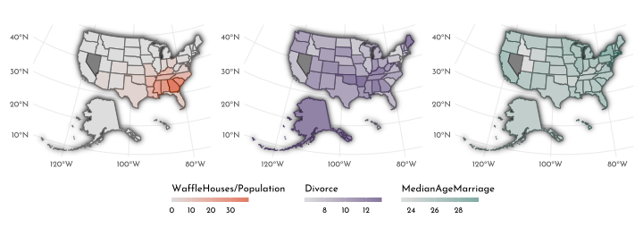
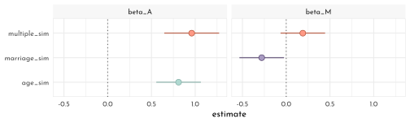
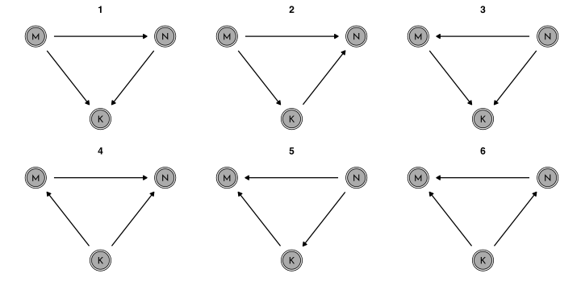
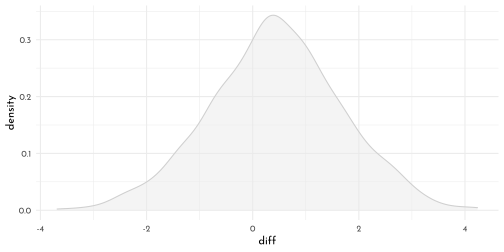
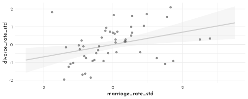
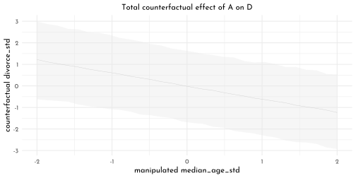
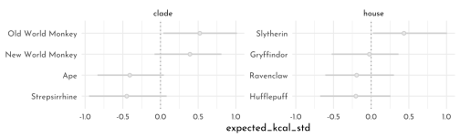
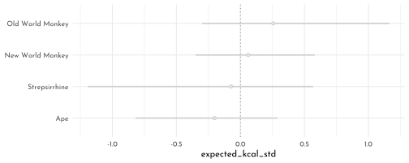

---
output:
  html_document:
  theme: yeti
pdf_document: default
editor_options: 
  chunk_output_type: console
---

# Rethinking: Chapter 5

**Spurious waffles**


by [Richard McElreath](https://xcelab.net/rm/statistical-rethinking/), building on the Summaries by [Solomon Kurz](https://bookdown.org/content/4857/) and [Jake Thompson](https://sr2-solutions.wjakethompson.com/linear-models.html).


```r
library(sf)
library(rethinking)
library(ggfx)

data(WaffleDivorce)

WaffleDivorce <- WaffleDivorce %>% as_tibble()

usa <- read_sf("~/work/geo_store/USA/usa_states_albers_revised.gpkg") %>% 
  left_join(WaffleDivorce, by = c(name = "Location" ))

p_waffle <- usa %>% 
  ggplot(aes(fill = WaffleHouses / Population)) +
  scale_fill_gradientn(colours = c(clr0d, clr2) %>%
                         clr_lighten(.3))

p_divorce <- usa %>% 
  ggplot(aes(fill = Divorce))+
  scale_fill_gradientn(colours = c(clr0d, clr1) %>%
                         clr_lighten(.3))

p_age <- usa %>% 
  ggplot(aes(fill = MedianAgeMarriage))+
  scale_fill_gradientn(colours = c(clr_lighten(clr0d, .3), clr3))
```


```r
p_waffle +
  p_divorce +
  p_age +
  plot_layout(guides = "collect") & 
  with_shadow(geom_sf(aes(color = after_scale(clr_darken(fill)))),
              x_offset = 0, y_offset = 0, sigma = 3) & 
  guides(fill = guide_colorbar(title.position = "top",
                               barheight = unit(5,"pt"))) &
  theme(legend.position = "bottom")
```



Age Model: first model (divorce rate depends on age at marriage)

$$
\begin{array}{cccr} 
D_i & {\sim} & Normal(\mu, \sigma) & \textrm{[likelihood]}\\
\mu_i & = & \alpha + \beta_{A} A_{i} & \textrm{[linear model]}\\
\alpha & \sim & Normal(0, 0.2) & \textrm{[$\alpha$ prior]}\\
\beta_{A} & \sim & Normal(0, 0.5) & \textrm{[$\beta$ prior]}\\
\sigma & \sim & Exponential(1) & \textrm{[$\sigma$ prior]}
\end{array}
$$


```r
data_waffle <- WaffleDivorce %>% 
  mutate(across(.cols = c(Divorce, Marriage, MedianAgeMarriage),
                .fns = standardize,
                .names = "{str_to_lower(.col)}_std"),
         waffle_pop = WaffleHouses / Population) %>% 
  rename(median_age_std = "medianagemarriage_std") 

sd(data_waffle$MedianAgeMarriage)
```

```
#> [1] 1.24363
```

```r
model_age <- quap(
  flist = alist(
    divorce_std ~ dnorm( mu, sigma ) ,
    mu <- alpha + beta_A * median_age_std ,
    alpha ~ dnorm( 0, 0.2 ),
    beta_A ~ dnorm( 0, 0.5 ),
    sigma ~ dexp( 1 )
  ),
  data = data_waffle
)

set.seed(10)
age_priors <- extract.prior(model_age) %>% 
  as_tibble()

prior_prediction_range <- c(-2, 2)
age_prior_predictions <- link(model_age,
                        post = age_priors,
                        data = list(median_age_std = prior_prediction_range)) %>% 
  as_tibble() %>% 
  set_names(nm = as.character(prior_prediction_range)) %>% 
  mutate(.draw = row_number())

age_prior_predictions %>% 
  filter(.draw < 51) %>% 
  ggplot() +
  geom_segment(aes(x = -2, xend = 2, y = `-2`, yend = `2`, group = .draw),
               color = clr2, alpha = .2) +
  labs(x = "median age of marriage (std)", 
       y = "divorce rate (std)")
```


```r
age_seq <- seq(min(data_waffle$median_age_std),
               max(data_waffle$median_age_std),
               length.out = 101)
model_age_posterior_prediction_samples <- link(model_age, data = data.frame(median_age_std = age_seq)) %>% 
  as_tibble() %>% 
  set_names(nm = age_seq) %>% 
  pivot_longer(cols = everything(), names_to = "median_age_std", values_to = "divorce_std") %>% 
  mutate(median_age_std = as.numeric(median_age_std),
         MedianAgeMarriage = median_age_std * sd(data_waffle$MedianAgeMarriage) +
           mean(data_waffle$MedianAgeMarriage),
         Divorce = divorce_std * sd(data_waffle$Divorce) +
           mean(data_waffle$Divorce)) 

model_age_posterior_prediction_pi <- model_age_posterior_prediction_samples %>% 
  group_by(median_age_std, MedianAgeMarriage) %>% 
  summarise(mean = mean(Divorce),
            PI_lower = PI(Divorce)[1],
            PI_upper = PI(Divorce)[2]) %>% 
  ungroup()

model_age_posterior_prediction_simulation <- sim(model_age,
                                                 data = data.frame(median_age_std = age_seq), 
                                                 n = 5e3) %>% 
  as_tibble() %>% 
  set_names(nm = age_seq) %>% 
  pivot_longer(cols = everything(), names_to = "median_age_std", values_to = "divorce_std") %>% 
  mutate(median_age_std = as.numeric(median_age_std),
         MedianAgeMarriage = median_age_std * sd(data_waffle$MedianAgeMarriage) +
           mean(data_waffle$MedianAgeMarriage),
         Divorce = divorce_std * sd(data_waffle$Divorce) +
           mean(data_waffle$Divorce))
  
model_age_posterior_prediction_simulation_pi <- model_age_posterior_prediction_simulation %>% 
  group_by(median_age_std, MedianAgeMarriage) %>% 
  summarise(mean = mean(Divorce),
            PI_lower = PI(Divorce)[1],
            PI_upper = PI(Divorce)[2]) %>% 
  ungroup()

p_age <- ggplot(mapping = aes(x = MedianAgeMarriage)) +
  geom_ribbon(data = model_age_posterior_prediction_simulation_pi,
              aes(ymin = PI_lower, ymax = PI_upper), fill = clr0d, alpha = .35)  +
  geom_smooth(data = model_age_posterior_prediction_pi, stat = "identity",
              aes(y = mean, ymin = PI_lower, ymax = PI_upper),
              color = clr3, fill = fll3, size = .4) +
  geom_point(data = data_waffle, aes(y = Divorce), color = rgb(0,0,0,.5), size = .6) +
  labs(y = " divorce")
```

Marriage Model: alternative model (divorce rate depends on marriage rate)

$$
\begin{array}{cccr} 
D_i & {\sim} & Normal(\mu, \sigma) & \textrm{[likelihood]}\\
\mu_i & = & \alpha + \beta_{M} M_{i} & \textrm{[linear model]}\\
\alpha & \sim & Normal(0, 0.2) & \textrm{[$\alpha$ prior]}\\
\beta_{M} & \sim & Normal(0, 0.5) & \textrm{[$\beta$ prior]}\\
\sigma & \sim & Exponential(1) & \textrm{[$\sigma$ prior]}
\end{array}
$$


```r
model_marriage <- quap(
  flist = alist(
    divorce_std ~ dnorm( mu, sigma ) ,
    mu <- alpha + beta_M * marriage_std ,
    alpha ~ dnorm( 0, 0.2 ),
    beta_M ~ dnorm( 0, 0.5 ),
    sigma ~ dexp( 1 )
  ),
  data = data_waffle
)
```


```r
marriage_seq <- seq(min(data_waffle$marriage_std),
               max(data_waffle$marriage_std),
               length.out = 101)
model_marriage_posterior_prediction_samples <- link(model_marriage,
                                               data = data.frame(marriage_std = marriage_seq)) %>% 
  as_tibble() %>% 
  set_names(nm = marriage_seq) %>% 
  pivot_longer(cols = everything(), names_to = "marriage_std", values_to = "divorce_std") %>% 
  mutate(marriage_std = as.numeric(marriage_std),
         Marriage = marriage_std * sd(data_waffle$Marriage) +
           mean(data_waffle$Marriage),
         Divorce = divorce_std * sd(data_waffle$Divorce) +
           mean(data_waffle$Divorce)) 

model_marriage_posterior_prediction_pi <- model_marriage_posterior_prediction_samples %>% 
  group_by(marriage_std, Marriage) %>% 
  summarise(mean = mean(Divorce),
            PI_lower = PI(Divorce)[1],
            PI_upper = PI(Divorce)[2]) %>% 
  ungroup()

model_marriage_posterior_prediction_simulation <- sim(model_marriage,
                                                 data = data.frame(marriage_std = marriage_seq), 
                                                 n = 5e3) %>% 
  as_tibble() %>% 
  set_names(nm = marriage_seq) %>% 
  pivot_longer(cols = everything(), names_to = "marriage_std", values_to = "divorce_std") %>% 
  mutate(marriage_std = as.numeric(marriage_std),
         Marriage = marriage_std * sd(data_waffle$Marriage) +
           mean(data_waffle$Marriage),
         Divorce = divorce_std * sd(data_waffle$Divorce) +
           mean(data_waffle$Divorce))
  
model_marriage_posterior_prediction_simulation_pi <- model_marriage_posterior_prediction_simulation %>% 
  group_by(marriage_std, Marriage) %>% 
  summarise(mean = mean(Divorce),
            PI_lower = PI(Divorce)[1],
            PI_upper = PI(Divorce)[2]) %>% 
  ungroup()

p_marriage <- ggplot(mapping = aes(x = Marriage)) +
  geom_ribbon(data = model_marriage_posterior_prediction_simulation_pi,
              aes(ymin = PI_lower, ymax = PI_upper), fill = clr0d, alpha = .35)  +
  geom_smooth(data = model_marriage_posterior_prediction_pi, stat = "identity",
              aes(y = mean, ymin = PI_lower, ymax = PI_upper),
              color = clr1, fill = fll1, size = .2) +
  geom_point(data = data_waffle, aes(y = Divorce), color = rgb(0,0,0,.5), size = .6) +
  labs(y = " divorce")
```

Waffle Model:


```r
model_waffle <- quap(
  flist = alist(
    divorce_std ~ dnorm( mu, sigma ) ,
    mu <- alpha + beta_W * waffle_pop ,
    alpha ~ dnorm( 0, 0.2 ),
    beta_W ~ dnorm( 0, 0.5 ),
    sigma ~ dexp( 1 )
  ),
  data = data_waffle
)

waffle_seq <- seq(min(data_waffle$waffle_pop),
               max(data_waffle$waffle_pop),
               length.out = 101)
model_waffle_posterior_prediction_samples <- link(model_waffle,
                                               data = data.frame(waffle_pop = waffle_seq)) %>% 
  as_tibble() %>% 
  set_names(nm = waffle_seq) %>% 
  pivot_longer(cols = everything(), names_to = "waffle_pop", values_to = "divorce_std") %>% 
  mutate(waffle_pop = as.numeric(waffle_pop),
         Divorce = divorce_std * sd(data_waffle$Divorce) +
           mean(data_waffle$Divorce)) 

model_waffle_posterior_prediction_pi <- model_waffle_posterior_prediction_samples %>% 
  group_by(waffle_pop) %>% 
  summarise(mean = mean(Divorce),
            PI_lower = PI(Divorce)[1],
            PI_upper = PI(Divorce)[2]) %>% 
  ungroup()

p_waffle <- ggplot(mapping = aes(x = waffle_pop)) +
  geom_smooth(data = model_waffle_posterior_prediction_pi, stat = "identity",
              aes(y = mean, ymin = PI_lower, ymax = PI_upper),
              color = clr2, fill = fll2, size = .2) +
  geom_point(data = data_waffle, aes(y = Divorce), color = rgb(0,0,0,.5), size = .6) +
  labs(y = " divorce")
```


```r
p_waffle + 
p_marriage + theme(axis.title.y = element_blank(), axis.text.y = element_blank()) +
  p_age + theme(axis.title.y = element_blank(), axis.text.y = element_blank()) &
  lims(y = c(4, 15))
```


## Directed Acyclic Graphs


```r
dag1 <- dagify(
  D ~ A + M,
  M ~ A,
  exposure = "A",
  outcome = "M") %>% 
  tidy_dagitty(.dagitty = .,layout = tibble(x = c(0,1,.5), y = c(1,1, .4))) %>%
  mutate(stage = if_else(name == "D", "response",
                         if_else(name %in% c("A", "M"),
                                 "predictor", "confounds")))

dag2 <- dagify(
  D ~ A,
  M ~ A,
  exposure = "A",
  outcome = "M") %>% 
  tidy_dagitty(.dagitty = .,layout = tibble(x = c(0,.5,1), y = c(1, .4, 1))) %>%
  mutate(stage = if_else(name == "D", "response",
                         if_else(name %in% c("A", "M"),
                                 "predictor", "confounds")))

plot_dag(dag1, clr_in = clr3) + 
  plot_dag(dag2, clr_in = clr3) &
  scale_y_continuous(limits = c(.35, 1.05)) &
  coord_equal()
```


DAG notation:

- $Y \perp \!\!\! \perp X | Z$: *"$Y$ is independent of $X$ conditional on $Z$"*
- $D \not\!\perp\!\!\!\perp A$: "*$D$ is associated with $A$"*

Check pair wise correlations with `cor()`:


```r
data_waffle %>% 
  dplyr::select(divorce_std,marriage_std, median_age_std) %>% 
  cor() %>% 
  as.data.frame(row.names = row.names(.)) %>% 
  round(digits = 2) %>% 
  knitr::kable()
```


|               | divorce_std| marriage_std| median_age_std|
|:--------------|-----------:|------------:|--------------:|
|divorce_std    |        1.00|         0.37|          -0.60|
|marriage_std   |        0.37|         1.00|          -0.72|
|median_age_std |       -0.60|        -0.72|           1.00|


```r
library(dagitty)

dagitty('dag{ D <- A -> M -> D}') %>% 
  impliedConditionalIndependencies()

dagitty('dag{ D <- A -> M }') %>% 
  impliedConditionalIndependencies()
```

```
#> D _||_ M | A
```

## Multiple Regression notion

$$
\begin{array}{cccr} 
D_i & {\sim} & Normal(\mu, \sigma) & \textrm{[likelihood]}\\
\mu_i & = & \alpha + \beta_{M} M_{i} + \beta_{A} A_{i} & \textrm{[linear model]}\\
\alpha & \sim & Normal(0, 0.2) & \textrm{[$\alpha$ prior]}\\
\beta_{M} & \sim & Normal(0, 0.5) & \textrm{[$\beta_M$ prior]}\\
\beta_{A} & \sim & Normal(0, 0.5) & \textrm{[$\beta_A$ prior]}\\
\sigma & \sim & Exponential(1) & \textrm{[$\sigma$ prior]}
\end{array}
$$

or compact notion 

$$
\mu_i = \alpha + \sum_{j = 1}^{n} \beta_jx_{ji}
$$

or even *matrix* notion

$$
m = Xb
$$


```r
model_multiple <- quap(
  flist = alist(
      divorce_std ~ dnorm( mu, sigma ) ,
    mu <- alpha + beta_M * marriage_std + beta_A * median_age_std,
    alpha ~ dnorm( 0, 0.2 ),
    beta_A ~ dnorm( 0, 0.5 ),
    beta_M ~ dnorm( 0, 0.5 ),
    sigma ~ dexp( 1 )
  ),
  data = data_waffle
)

precis(model_multiple) %>% 
  round(digits = 2) %>% 
  as.matrix() %>% 
  knitr::kable()
```


|       |  mean|   sd|  5.5%| 94.5%|
|:------|-----:|----:|-----:|-----:|
|alpha  |  0.00| 0.10| -0.16|  0.16|
|beta_A | -0.61| 0.15| -0.85| -0.37|
|beta_M | -0.07| 0.15| -0.31|  0.18|
|sigma  |  0.79| 0.08|  0.66|  0.91|


```r
ct <- coeftab(model_age, model_marriage, model_multiple,se = TRUE)
plot_coeftab(ct)
```


`beta_A` doesn't really change, it only grows more uncertain, yet `beta_M` is only associated with divorce, when marriage rate is missing from the model.

> "Once we know the median age at marriage for a State, there is little to no additional predictive power in also knowing the rate of marriage at that State."

$\rightarrow$ $D \perp \!\!\! \perp M | A$

simulating the divorcee example


```r
n <- 50
data_divorce_sim <- tibble(median_age_std = rnorm(n),
                           marriage_std = rnorm(n, mean = -median_age_std),
                           divorce_std = rnorm(n, mean = median_age_std),
                           divorce_codep = rnorm(n, mean = median_age_std + marriage_std))

p1 <- ggpairs(data_divorce_sim %>% dplyr::select(-divorce_codep),
        lower = list(continuous = wrap(ggally_points, colour = clr1, size = .9, alpha = .7)),
        diag = list(continuous = wrap("densityDiag", fill = fll1, color = clr1, adjust = 1)),
        upper = list(continuous = wrap(ggally_cor, size = 5, color = "black", family = "Josefin sans")))
p2 <- ggpairs(data_divorce_sim %>% dplyr::select(-divorce_std),
        lower = list(continuous = wrap(ggally_points, colour = clr2, size = .9, alpha = .7)),
        diag = list(continuous = wrap("densityDiag", fill = fll2, color = clr2, adjust = 1)),
        upper = list(continuous = wrap(ggally_cor, size = 5, color = "black", family = "Josefin sans")))

cowplot::plot_grid(ggmatrix_gtable(p1), ggmatrix_gtable(p2))
```


simulating the right DAG ($D \perp \!\!\! \perp M | A$)


```r
model_multiple_sim <- quap(
  flist = alist(
      divorce_std ~ dnorm( mu, sigma ) ,
    mu <- alpha + beta_M * marriage_std + beta_A * median_age_std,
    alpha ~ dnorm( 0, 0.2 ),
    beta_A ~ dnorm( 0, 0.5 ),
    beta_M ~ dnorm( 0, 0.5 ),
    sigma ~ dexp( 1 )
  ),
  data = data_divorce_sim
)

model_age_sim <- quap(
  flist = alist(
      divorce_std ~ dnorm( mu, sigma ) ,
    mu <- alpha + beta_A * median_age_std,
    alpha ~ dnorm( 0, 0.2 ),
    beta_A ~ dnorm( 0, 0.5 ),
    sigma ~ dexp( 1 )
  ),
  data = data_divorce_sim
)

model_marriage_sim <- quap(
  flist = alist(
      divorce_std ~ dnorm( mu, sigma ) ,
    mu <- alpha + beta_M * marriage_std,
    alpha ~ dnorm( 0, 0.2 ),
    beta_M ~ dnorm( 0, 0.5 ),
    sigma ~ dexp( 1 )
  ),
  data = data_divorce_sim
)
```


```r
ct_sim <- coeftab(model_age_sim, model_marriage_sim, model_multiple_sim, se = TRUE)
plot_coeftab(ct_sim)
```



simulating the left DAG ($D \not\!\perp\!\!\!\perp M | A$)


```r
model_multiple_sim_codep <- quap(
  flist = alist(
      divorce_codep ~ dnorm( mu, sigma ) ,
    mu <- alpha + beta_M * marriage_std + beta_A * median_age_std,
    alpha ~ dnorm( 0, 0.2 ),
    beta_A ~ dnorm( 0, 0.5 ),
    beta_M ~ dnorm( 0, 0.5 ),
    sigma ~ dexp( 1 )
  ),
  data = data_divorce_sim
)

model_age_sim_codep <- quap(
  flist = alist(
      divorce_codep ~ dnorm( mu, sigma ) ,
    mu <- alpha + beta_A * median_age_std,
    alpha ~ dnorm( 0, 0.2 ),
    beta_A ~ dnorm( 0, 0.5 ),
    sigma ~ dexp( 1 )
  ),
  data = data_divorce_sim
)

model_marriage_sim_codep <- quap(
  flist = alist(
      divorce_codep ~ dnorm( mu, sigma ) ,
    mu <- alpha + beta_M * marriage_std,
    alpha ~ dnorm( 0, 0.2 ),
    beta_M ~ dnorm( 0, 0.5 ),
    sigma ~ dexp( 1 )
  ),
  data = data_divorce_sim
)
```


```r
ct_sim_codep <- coeftab(model_age_sim_codep, model_marriage_sim_codep, model_multiple_sim_codep,
                        se = TRUE)
plot_coeftab(ct_sim_codep)
```


### Visualizations for multivariate regressions

- *Predictor residual plots.* useful for understanding the model, but not much else
- *Posterior prediction plots.* checking fit and assessing predictions
- *Counterfactual plots.* implied predictions for imaginary experiments

#### Predictor residual plots

predictor residual plot for *marriage rate*


```r
pred_res_marriage <- quap(
  flist = alist(
    marriage_std ~ dnorm( mu, sigma ) ,
    mu <- alpha + beta_AM * median_age_std,
    alpha ~ dnorm( 0, 0.2 ),
    beta_AM ~ dnorm( 0, 0.5 ),
    sigma ~ dexp( 1 )
  ),
  data = data_waffle
)

residuals_marriage <- link(pred_res_marriage) %>% 
  as_tibble() %>% 
  set_names(nm = seq_along(data_waffle$median_age_std)) %>% 
  pivot_longer(cols = everything(),
               names_to = "row_idx", 
               values_to = "fit_marriage") %>%
  group_by(row_idx) %>% 
  summarise(mean_marriage = mean(fit_marriage),
            lower_pi = PI(fit_marriage)[1],
            upper_pi = PI(fit_marriage)[2]) %>% 
  ungroup() %>% 
  mutate(row_idx = as.numeric(row_idx)) %>% 
  left_join(data_waffle %>%  mutate(row_idx = row_number()),. ) %>% 
  mutate(residual_marriage  = marriage_std - mean_marriage)

p_11 <- residuals_marriage %>% 
  ggplot(aes(x = median_age_std)) +
  geom_segment(aes(xend = median_age_std, y = mean_marriage, yend = marriage_std),
               color = rgb(0,0,0,.6), linetype = 3) +
  geom_line(aes(y = mean_marriage), color = clr1) +
  geom_point(aes(y = marriage_std),
             color = clr1, fill = clr_lighten(clr1, .35), shape = 21) +
  geom_text(data = residuals_marriage %>% filter(Loc %in% c("DC", "HI", "ND", "ME", "WY")),
            aes(x = median_age_std - .1, y = marriage_std, label = Loc), hjust = 1) 

pred_res_marriage_mu <- quap(
  flist = alist(
    divorce_std ~ dnorm( mu, sigma ) ,
    mu <- alpha + beta * residual_marriage,
    alpha ~ dnorm( 0, 0.2 ),
    beta ~ dnorm( 0, 0.5 ),
    sigma ~ dexp( 1 )
  ),
  data = residuals_marriage
)

seq_res <- seq(min(residuals_marriage$residual_marriage), max(residuals_marriage$residual_marriage), length.out = 101)

residual_lm_posterior <- link(pred_res_marriage_mu, data = data.frame(residual_marriage = seq_res)) %>% 
  as_tibble() %>% 
  set_names(nm = seq_res) %>% 
  pivot_longer(cols = everything(), names_to = "residual_marriage", values_to = "divorce_std") %>% 
  mutate(residual_marriage = as.numeric(residual_marriage)) %>% 
  group_by(residual_marriage) %>% 
  summarise(mean = mean(divorce_std),
            PI_lower = PI(divorce_std)[1],
            PI_upper = PI(divorce_std)[2]) %>% 
  ungroup()

p_12 <- ggplot(mapping = aes(x = residual_marriage)) +
  geom_vline(xintercept = 0, lty = 3, color = rgb(0,0,0,.6)) +
  geom_smooth(data = residual_lm_posterior, aes(y = mean, ymin = PI_lower, ymax = PI_upper),
              stat = "identity", color = clr1, fill = fll1, size = .4) +
  geom_point(data = residuals_marriage, aes(y = divorce_std),
             color = clr1, fill = clr_lighten(clr1,.35), shape = 21) +
  geom_text(data = residuals_marriage %>% filter(Loc %in% c("DC", "HI", "ND", "ME", "WY")),
            aes(y = divorce_std - .4, label = Loc)) +
  labs(y = "divorce_rate (std)")
```

predictor residual plot for *age at marriage*


```r
pred_res_age <- quap(
  flist = alist(
    median_age_std ~ dnorm( mu, sigma ) ,
    mu <- alpha + beta_MA * marriage_std,
    alpha ~ dnorm( 0, 0.2 ),
    beta_MA ~ dnorm( 0, 0.5 ),
    sigma ~ dexp( 1 )
  ),
  data = data_waffle
)

residuals_age <- link(pred_res_age) %>% 
  as_tibble() %>% 
  set_names(nm = seq_along(data_waffle$marriage_std)) %>% 
  pivot_longer(cols = everything(),
               names_to = "row_idx", 
               values_to = "fit_age") %>%
  group_by(row_idx) %>% 
  summarise(mean_age = mean(fit_age),
            lower_pi = PI(fit_age)[1],
            upper_pi = PI(fit_age)[2]) %>% 
  ungroup() %>% 
  mutate(row_idx = as.numeric(row_idx)) %>% 
  left_join(data_waffle %>%  mutate(row_idx = row_number()),. ) %>% 
  mutate(residual_age  = median_age_std - mean_age)

p_21 <- residuals_age %>% 
  ggplot(aes(x = marriage_std)) +
  geom_segment(aes(xend = marriage_std, y = mean_age, yend = median_age_std),
               color = rgb(0,0,0,.6), linetype = 3) +
  geom_line(aes(y = mean_age), color = clr2) +
  geom_point(aes(y = median_age_std),
             color = clr2, fill = clr_lighten(clr2, .35), shape = 21) +
  geom_text(data = residuals_marriage %>% filter(Loc %in% c("DC", "HI", "ID")),
            aes(x = marriage_std - .1, y = median_age_std, label = Loc), hjust = 1) 

pred_res_age_mu <- quap(
  flist = alist(
    divorce_std ~ dnorm( mu, sigma ) ,
    mu <- alpha + beta * residual_age,
    alpha ~ dnorm( 0, 0.2 ),
    beta ~ dnorm( 0, 0.5 ),
    sigma ~ dexp( 1 )
  ),
  data = residuals_age
)

seq_res_age <- seq(min(residuals_age$residual_age), max(residuals_age$residual_age), length.out = 101)

residual_lm_posterior_age <- link(pred_res_age_mu, data = data.frame(residual_age = seq_res_age)) %>% 
  as_tibble() %>% 
  set_names(nm = seq_res_age) %>% 
  pivot_longer(cols = everything(), names_to = "residual_age", values_to = "divorce_std") %>% 
  mutate(residual_age = as.numeric(residual_age)) %>% 
  group_by(residual_age) %>% 
  summarise(mean = mean(divorce_std),
            PI_lower = PI(divorce_std)[1],
            PI_upper = PI(divorce_std)[2]) %>% 
  ungroup()

p_22 <- ggplot(mapping = aes(x = residual_age)) +
  geom_vline(xintercept = 0, lty = 3, color = rgb(0,0,0,.6)) +
  geom_smooth(data = residual_lm_posterior_age, aes(y = mean, ymin = PI_lower, ymax = PI_upper),
              stat = "identity", color = clr2, fill = fll2, size = .4) +
  geom_point(data = residuals_age, aes(y = divorce_std),
             color = clr2, fill = clr_lighten(clr2,.35), shape = 21) +
  geom_text(data = residuals_age %>% filter(Loc %in% c("DC", "HI", "ID")),
            aes(y = divorce_std - .4, label = Loc)) +
  labs(y = "divorce_rate (std)")
```


```r
p_11 + p_21 +
  p_12 + p_22
```


#### Posterior Preediction Plots


```r
posterior_prediction <- link(model_multiple) %>% 
  as_tibble() %>% 
    set_names(nm = seq_along(data_waffle$divorce_std)) %>% 
  pivot_longer(cols = everything(),
               names_to = "row_idx", 
               values_to = "divorce_predicted") %>%
  group_by(row_idx) %>% 
  summarise(divorce_predicted_mean = mean(divorce_predicted),
            lower_pi = PI(divorce_predicted)[1],
            upper_pi = PI(divorce_predicted)[2]) %>% 
  ungroup() %>% 
  mutate(row_idx = as.numeric(row_idx)) %>% 
  left_join(data_waffle %>%  mutate(row_idx = row_number()), . ) 

posterior_simmulation <- sim(model_multiple) %>% 
  as_tibble() %>% 
    set_names(nm = seq_along(data_waffle$divorce_std)) %>% 
  pivot_longer(cols = everything(),
               names_to = "row_idx", 
               values_to = "divorce_predicted") %>%
  group_by(row_idx) %>% 
  summarise(lower_pi = PI(divorce_predicted)[1],
            upper_pi = PI(divorce_predicted)[2]) %>% 
  ungroup() %>% 
  mutate(row_idx = as.numeric(row_idx)) %>% 
  left_join(data_waffle %>%  mutate(row_idx = row_number()), . ) 

ggplot(mapping = aes(x = divorce_std)) +
  geom_abline(slope = 1, size = .7, lty = 3, color = rgb(0,0,0,.6)) +
  geom_linerange(data = posterior_prediction,
                aes(ymin = lower_pi, ymax =  upper_pi,
                     color = Loc %in% c("ID", "UT")))+
  geom_point(data = posterior_prediction,
             aes(y = divorce_predicted_mean,
                     color = Loc %in% c("ID", "UT"),
                 fill = after_scale(clr_lighten(color ,.5))), 
             shape = 21, size = 1.5)+
  geom_text(data = posterior_prediction %>% filter(Loc %in% c("ID", "ME", "RI", "UT")),
            aes(x = divorce_std - .15, y = divorce_predicted_mean, label = Loc)) +
  scale_color_manual(values = c(`TRUE` = clr2, `FALSE` = clr0d), guide = "none")
```


Regressions tend to under-estimate variable in the high end of the range and over-estimate in the low end of the range.
This is normal, they *"pull towards the mean"*.

The labeled States however (ID, ME, RI, UT), are not well predicted by the Model (eg. due to additional social factors).


Simulating spurious association


```r
N <- 100
data_spurious <- tibble(x_real = rnorm(N),
                        x_spur = rnorm(N, x_real),
                        y = rnorm(N, x_real))

ggpairs(data_spurious,
        lower = list(continuous = wrap(ggally_points, colour = clr3, size = .9, alpha = .7)),
        diag = list(continuous = wrap("densityDiag", fill = fll3, color = clr3, adjust = 1)),
        upper = list(continuous = wrap(ggally_cor, size = 5, color = "black", family = "Josefin sans")))
```


```r
model_spurious <- quap(
  flist = alist(
    y ~ dnorm(mu, sigma),
    mu <- alpha + beta_r * x_real + beta_s * x_spur,
    alpha ~ dnorm(0, .2),
    beta_r ~ dnorm(0, .5),
    beta_s ~ dnorm(0, .5),
    sigma ~ dexp(1)
  ),
  data = data_spurious
)

precis(model_spurious) %>% 
  as.matrix() %>% 
  round(digits = 2) %>% 
  knitr::kable()
```


|       | mean|   sd|  5.5%| 94.5%|
|:------|----:|----:|-----:|-----:|
|alpha  | 0.09| 0.09| -0.06|  0.24|
|beta_r | 0.87| 0.14|  0.64|  1.10|
|beta_s | 0.09| 0.11| -0.09|  0.27|
|sigma  | 1.06| 0.07|  0.94|  1.17|

Note, how the estimated mean for `beta_s` is close to 0 (0.09) -- despite the correlation shown above 🤔`.

#### Counterfactual Plots


```r
model_counterfactual <- quap(
  flist = alist(
    # A -> D <- M
    divorce_std ~ dnorm( mu, sigma ) ,
    mu <- alpha + beta_M * marriage_std + beta_A * median_age_std,
    alpha ~ dnorm( 0, 0.2 ),
    beta_A ~ dnorm( 0, 0.5 ),
    beta_M ~ dnorm( 0, 0.5 ),
    sigma ~ dexp( 1 ),
    # A -> M
    marriage_std ~ dnorm( mu_M, sigma_M ),
    mu_M <- alpha_M + beta_AM * median_age_std,
    alpha_M ~ dnorm( 0, 0.2 ),
    beta_AM ~ dnorm( 0, 0.5 ),
    sigma_M ~ dexp(1)
  ),
  data = data_waffle
)

precis(model_counterfactual) %>% 
  as.matrix() %>% 
  round(digits = 2) %>% 
  knitr::kable()
```


|        |  mean|   sd|  5.5%| 94.5%|
|:-------|-----:|----:|-----:|-----:|
|alpha   |  0.00| 0.10| -0.16|  0.16|
|beta_A  | -0.61| 0.15| -0.85| -0.37|
|beta_M  | -0.07| 0.15| -0.31|  0.18|
|sigma   |  0.79| 0.08|  0.66|  0.91|
|alpha_M |  0.00| 0.09| -0.14|  0.14|
|beta_AM | -0.69| 0.10| -0.85| -0.54|
|sigma_M |  0.68| 0.07|  0.57|  0.79|

Note, that `marriage_std` and `median_age_std` are strongly negatively correlated (-0.69)


```r
A_seq <- seq(-2, 2, length.out = 30)

unpack_sim <- function(x, seq = A_seq){
  nms <- names(x)
  purrr::map(.x = nms, .f = function(y, x, seq_in = seq){
    x[[y]] %>% 
          as_tibble() %>% 
      set_names(nm = seq_along(seq_in)) %>% 
      pivot_longer(cols = everything(),
                   names_to = "row_idx", 
                   values_to = "value") %>% 
      mutate(parameter = y)
    }, x = x) %>% 
    purrr::reduce(bind_rows)
}

data_sim <- sim(fit = model_counterfactual,
                data = tibble(median_age_std = A_seq),
                vars = c("marriage_std", "divorce_std")) %>% 
  unpack_sim()

data_sim_pi <- data_sim %>% 
  group_by(row_idx, parameter) %>% 
  summarise(mean = mean(value),
            PI_lower = PI(value)[1],
            PI_upper = PI(value)[2]) %>% 
  ungroup() %>% 
  mutate(row_idx = as.numeric(row_idx),
         median_age_std = A_seq[row_idx]) %>% 
  arrange(parameter, median_age_std)

data_sim_pi %>% 
  ggplot() +
  geom_smooth(aes(x = median_age_std, y = mean, ymin = PI_lower, ymax = PI_upper,
                  color = parameter, fill = after_scale(clr_alpha(color))),
              stat = "identity", size = .4) +
  scale_color_manual(values = c(clr0d, clr3), guide = "none") +
  labs(y = "counterfactual value", title = "Counterfactual effects of age at marriage on") +
  facet_wrap(parameter ~ .)
```


Numerical operations (eg. simulating the causal effect of raising the median age of marriage from 20 to 30):


```r
A_seq2 <-  (c(20, 30) - mean(data_waffle$MedianAgeMarriage)) / sd(data_waffle$MedianAgeMarriage)

data_sim_num <- sim(fit = model_counterfactual,
                data = tibble(median_age_std = A_seq2),
                vars = c("marriage_std", "divorce_std")) %>% 
  unpack_sim(seq = A_seq2)

data_sim_num %>% 
  filter(parameter == "divorce_std") %>%
  dplyr::select(-parameter) %>% 
  mutate(pair = (row_number() + 1) %/% 2) %>% 
  pivot_wider(names_from = row_idx, values_from = value) %>% 
  mutate(effect = `2` - `1`) %>% 
  summarise(mean = mean(effect))
```

```
#> # A tibble: 1 x 1
#>    mean
#>   <dbl>
#> 1 -4.59
```

...A change of four and a half standard deviations is quite extreme!


```r
M_seq <- A_seq

data_sim_M <- sim(fit = model_counterfactual,
                data = tibble(marriage_std = M_seq,
                              median_age_std  = 0),
                vars = c("divorce_std")) %>% 
  as_tibble() %>% 
  set_names(nm = seq_along(M_seq)) %>% 
  pivot_longer(cols = everything(),
               names_to = "row_idx", 
               values_to = "divorce_std") 

data_sim_M_pi <- data_sim_M %>% 
  group_by(row_idx) %>% 
  summarise(mean = mean(divorce_std),
            PI_lower = PI(divorce_std)[1],
            PI_upper = PI(divorce_std)[2]) %>% 
  ungroup() %>% 
  mutate(row_idx = as.numeric(row_idx),
         marriage_std = M_seq[row_idx])

data_sim_M_pi %>% 
  ggplot() +
  geom_smooth(aes(x = marriage_std, y = mean, ymin = PI_lower, ymax = PI_upper),
              color = clr1, fill = fll1,
              stat = "identity", size = .4) +
  scale_color_manual(values = c(clr0d, clr3), guide = "none") +
  labs(y = "counterfactual value",
       title = "Counterfactual effects of marriage rate on divorce rate") +
  lims(y = c(-2, 2))
```


## Masked relationship

Loading the milk data


```r
data(milk)
data_milk <- milk %>% 
  filter(complete.cases(.)) %>% 
  as_tibble() %>% 
  mutate(`mass.log` = log(mass),
         across(.cols = c(`kcal.per.g`, `neocortex.perc`, `mass.log`),
                .fns = standardize,
                .names = "{str_remove_all(.col, '\\\\..*')}_std"))

data_milk %>%
  precis() %>% 
  as.matrix() %>%
  as.data.frame() %>% 
  filter(!is.na(mean)) %>% 
  mutate(across(.cols = mean:`94.5%`,  function(x){round(as.numeric(x), digits = 2)})) %>% 
  knitr::kable()
```


|               |  mean|    sd|  5.5%| 94.5%|histogram      |
|:--------------|-----:|-----:|-----:|-----:|:--------------|
|kcal.per.g     |  0.66|  0.17|  0.47|  0.93|▇▂▁▁▁▂▁▁▁▁▁    |
|perc.fat       | 36.06| 14.71| 15.08| 54.45|▂▁▁▂▃▃▂▅▃▁▇▂   |
|perc.protein   | 16.26|  5.60|  9.28| 23.79|▂▅▅▅▅▂▂▅▇▂     |
|perc.lactose   | 47.68| 13.59| 30.35| 68.31|▂▇▅▅▂▇▅▁▅▂     |
|mass           | 16.64| 23.58|  0.30| 57.89|▇▁▁▁▁▁▁▁       |
|neocortex.perc | 67.58|  5.97| 58.41| 75.59|▂▁▂▅▁▅▅▅▇▅▂▂   |
|mass.log       |  1.50|  1.93| -1.26|  4.05|▂▁▂▂▂▂▅▂▇▁▂▂▅▅ |
|kcal_std       |  0.00|  1.00| -1.09|  1.55|▃▇▁▃▁▂▂        |
|neocortex_std  |  0.00|  1.00| -1.54|  1.34|▁▁▂▃▁▇▃▂       |
|mass_std       |  0.00|  1.00| -1.43|  1.32|▁▂▂▃▃▁▇        |

### Bi-variate models

:::columns
:::column1st
Neocortex effect on caloric content of milk
$$
\begin{array}{cccr} 
K_i & {\sim} & Normal(\mu_i, \sigma) & \textrm{[likelihood]}\\
\mu_i & = & \alpha + \beta_{N} N_{i} & \textrm{[linear model]}\\
\alpha & \sim & Normal(0, 0.2) & \textrm{[$\alpha$ prior]}\\
\beta_{N} & \sim & Normal(0, 0.5) & \textrm{[$\beta_N$ prior]}\\
\sigma & \sim & Exponential(1) & \textrm{[$\sigma$ prior]}
\end{array}
$$
:::   
:::column2nd
Mothers weight effect on caloric content of milk
$$
\begin{array}{cccr} 
K_i & {\sim} & Normal(\mu_i, \sigma) & \textrm{[likelihood]}\\
\mu_i & = & \alpha + \beta_{M} M_{i} & \textrm{[linear model]}\\
\alpha & \sim & Normal(0, 0.2) & \textrm{[$\alpha$ prior]}\\
\beta_{M} & \sim & Normal(0, 0.5) & \textrm{[$\beta_M$ prior]}\\
\sigma & \sim & Exponential(1) & \textrm{[$\sigma$ prior]}
\end{array}
$$
:::
:::

Model implementation (neocortex, draft)


```r
model_milk_draft <- quap(
  flist = alist(
    kcal_std ~ dnorm(mu, sigma),
    mu <- alpha + beta_N * neocortex_std,
    alpha ~ dnorm(0, 1),
    beta_N ~ dnorm(0, 1),
    sigma ~ dexp(1)
  ),
  data = data_milk
)

prior_milk_draft <- extract.prior(model_milk_draft) %>% 
  as_tibble()

seq_prior <- c(-2, 2)

prior_prediction_milk_draft <- link(model_milk_draft,
                             post = prior_milk_draft,
                             data = tibble(neocortex_std = seq_prior)) %>% 
  as_tibble() %>% 
    set_names(nm = seq_prior)

p_draft <- prior_prediction_milk_draft %>% 
  filter(row_number() <= 50) %>% 
  ggplot() +
  geom_segment(aes(x = -2, xend = 2, y = `-2`, yend = `2`), alpha = .6, color = clr0d)
```

Model implementation (neocortex)


```r
model_milk_cortex <- quap(
  flist = alist(
    kcal_std ~ dnorm(mu, sigma),
    mu <- alpha + beta_N * neocortex_std,
    alpha ~ dnorm(0, .2),
    beta_N ~ dnorm(0, .5),
    sigma ~ dexp(1)
  ),
  data = data_milk
)

precis(model_milk_cortex) %>% 
  as.matrix() %>%
  round(digits = 2) %>% 
  knitr::kable()
```


|       | mean|   sd|  5.5%| 94.5%|
|:------|----:|----:|-----:|-----:|
|alpha  | 0.00| 0.15| -0.24|  0.24|
|beta_N | 0.13| 0.21| -0.21|  0.47|
|sigma  | 0.93| 0.15|  0.69|  1.18|


```r
prior_milk_cortex <- extract.prior(model_milk_cortex) %>% 
  as_tibble()

prior_prediction_milk_cortex <- link(model_milk_cortex,
                             post = prior_milk_cortex,
                             data = tibble(neocortex_std = seq_prior)) %>% 
  as_tibble() %>% 
    set_names(nm = seq_prior)

p_cortex <- prior_prediction_milk_cortex %>% 
  filter(row_number() <= 50) %>% 
  ggplot() +
  geom_segment(aes(x = -2, xend = 2, y = `-2`, yend = `2`),
               alpha = .6, color = clr0d)
```


```r
p_draft + p_cortex &
  coord_cartesian(xlim = c(-2, 2),
                  ylim = c(-2, 2)) &
  labs(x = "neocortex_std", y = "kcal_std")
```


```r
seq_cortex <- seq(min(data_milk$neocortex_std) - .15, max(data_milk$neocortex_std) + .15, length.out = 51)

model_milk_cortex_posterior_prediction_samples <- link(model_milk_cortex,
                                               data = data.frame(neocortex_std = seq_cortex)) %>% 
  as_tibble() %>% 
  set_names(nm = seq_cortex) %>% 
  pivot_longer(cols = everything(),
               names_to = "neocortex_std",
               values_to = "kcal_std") %>% 
  mutate(neocortex_std = as.numeric(neocortex_std)) 

model_milk_cortex_posterior_prediction_pi <- model_milk_cortex_posterior_prediction_samples %>% 
  group_by(neocortex_std) %>% 
  summarise(mean = mean(kcal_std),
            PI_lower = PI(kcal_std)[1],
            PI_upper = PI(kcal_std)[2]) %>% 
  ungroup()

p_cortex <- ggplot(mapping = aes(x = neocortex_std)) +
  geom_smooth(data = model_milk_cortex_posterior_prediction_pi, stat = "identity",
              aes(y = mean, ymin = PI_lower, ymax = PI_upper),
              color = clr2, fill = fll2, size = .2) +
  geom_point(data = data_milk, aes(y = kcal_std), color = rgb(0,0,0,.5), size = 1.6) +
  labs(x = "neocprtex_std", y = "kcal_std")
```

Model implementation (mothers weight)


```r
model_milk_weight <- quap(
  flist = alist(
    kcal_std ~ dnorm(mu, sigma),
    mu <- alpha + beta_M * mass_std,
    alpha ~ dnorm(0, .2),
    beta_M ~ dnorm(0, .5),
    sigma ~ dexp(1)
  ),
  data = data_milk
)

precis(model_milk_weight) %>% 
  as.matrix() %>%
  round(digits = 2) %>% 
  knitr::kable()
```


|       |  mean|   sd|  5.5%| 94.5%|
|:------|-----:|----:|-----:|-----:|
|alpha  |  0.00| 0.15| -0.23|  0.23|
|beta_M | -0.30| 0.20| -0.62|  0.03|
|sigma  |  0.89| 0.15|  0.65|  1.12|


```r
seq_weight <- seq(min(data_milk$mass_std) - .15, max(data_milk$mass_std) + .15, length.out = 51)

model_milk_weight_posterior_prediction_samples <- link(model_milk_weight,
                                               data = data.frame(mass_std = seq_weight)) %>% 
  as_tibble() %>% 
  set_names(nm = seq_weight) %>% 
  pivot_longer(cols = everything(),
               names_to = "mass_std",
               values_to = "kcal_std") %>% 
  mutate(mass_std = as.numeric(mass_std)) 

model_milk_weight_posterior_prediction_pi <- model_milk_weight_posterior_prediction_samples %>% 
  group_by(mass_std) %>% 
  summarise(mean = mean(kcal_std),
            PI_lower = PI(kcal_std)[1],
            PI_upper = PI(kcal_std)[2]) %>% 
  ungroup()

p_weight <- ggplot(mapping = aes(x = mass_std)) +
  geom_smooth(data = model_milk_weight_posterior_prediction_pi, stat = "identity",
              aes(y = mean, ymin = PI_lower, ymax = PI_upper),
              color = clr2, fill = fll2, size = .2) +
  geom_point(data = data_milk, aes(y = kcal_std), color = rgb(0,0,0,.5), size = 1.6) +
  labs(x = "mass_std", y = "kcal_std")
```


```r
p_cortex + p_weight
```


Model implementation (necocortex and mothers weight)

$$
\begin{array}{cccr} 
K_i & {\sim} & Normal(\mu_i, \sigma) & \textrm{[likelihood]}\\
\mu_i & = & \alpha + \beta_{N} N_{i} + \beta_{M} M_{i} & \textrm{[linear model]}\\
\alpha & \sim & Normal(0, 0.2) & \textrm{[$\alpha$ prior]}\\
\beta_{N} & \sim & Normal(0, 0.5) & \textrm{[$\beta_N$ prior]}\\
\beta_{M} & \sim & Normal(0, 0.5) & \textrm{[$\beta_M$ prior]}\\
\sigma & \sim & Exponential(1) & \textrm{[$\sigma$ prior]}
\end{array}
$$


```r
model_milk_multi <- quap(
  flist = alist(
    kcal_std ~ dnorm(mu, sigma),
    mu <- alpha + beta_N * neocortex_std + beta_M * mass_std,
    alpha ~ dnorm(0, .2),
    beta_N ~ dnorm(0, .5),
    beta_M ~ dnorm(0, .5),
    sigma ~ dexp(1)
  ),
  data = data_milk
)

precis(model_milk_multi) %>% 
  as.matrix() %>%
  round(digits = 2) %>% 
  knitr::kable()
```


|       |  mean|   sd|  5.5%| 94.5%|
|:------|-----:|----:|-----:|-----:|
|alpha  |  0.00| 0.13| -0.20|  0.20|
|beta_N |  0.64| 0.23|  0.27|  1.01|
|beta_M | -0.75| 0.23| -1.12| -0.37|
|sigma  |  0.69| 0.12|  0.49|  0.88|


```r
ct_milk <- coeftab(model_milk_cortex, model_milk_weight, model_milk_multi,
                        se = TRUE)
plot_coeftab(ct_milk)
```


```r
data_milk %>% 
  dplyr::select(kcal_std, neocortex_std, mass_std) %>% 
  ggpairs(lower = list(continuous = wrap(ggally_points, colour = clr2, size = .9, alpha = .7)),
          diag = list(continuous = wrap("densityDiag", fill = fll2, color = clr2, adjust = 1)),
          upper = list(continuous = wrap(ggally_cor, size = 5, color = "black", family = "Josefin sans")))
```


```r
dag1 <- dagify(
  K ~ M + N,
  N ~ M,
  exposure = "M",
  outcome = "K") %>% 
  tidy_dagitty(.dagitty = .,layout = tibble(x = c(0,1,.5), y = c(1,1, .4))) %>%
  mutate(stage = if_else(name == "K", "response",
                         if_else(name %in% c("M", "N"),
                                 "predictor", "confounds")))

dag2 <- dagify(
  K ~ M + N,
  M ~ N,
  exposure = "M",
  outcome = "K") %>% 
  tidy_dagitty(.dagitty = .,layout = tibble(x = c(0,1,.5), y = c(1,1, .4))) %>%
  mutate(stage = if_else(name == "K", "response",
                         if_else(name %in% c("M", "N"),
                                 "predictor", "confounds")))

dag3 <- dagify(
  K ~ M + N,
  M ~ U,
  N ~ U,
  exposure = "M",
  outcome = "K") %>% 
  tidy_dagitty(.dagitty = .,layout = tibble(x = c(0,1,.5, .5), y = c(1,1, 1,.4))) %>%
  mutate(stage = if_else(name == "K", "response",
                         if_else(name %in% c("M", "N"),
                                 "predictor", "confounds")))

plot_dag(dag1, clr_in = clr3) + 
  plot_dag(dag2, clr_in = clr3) +
  plot_dag(dag3, clr_in = clr3) +
  plot_layout(nrow = 1) +
  plot_annotation(tag_levels = "a") &
  scale_y_continuous(limits = c(.35, 1.05)) &
  coord_equal() & 
  theme(plot.tag = element_text(family = fnt_sel))
```


Counterfactual plots for DAG c)


```r
data_sim_mass <- link(fit = model_milk_multi,
                       data = tibble(mass_std = 0,
                                     neocortex_std  = seq_cortex),
                       vars = c("kcal_std")) %>% 
  as_tibble() %>% 
  set_names(nm = seq_along(seq_cortex)) %>% 
  pivot_longer(cols = everything(),
               names_to = "row_idx", 
               values_to = "kcal_std") 

data_sim_mass_pi <- data_sim_mass %>% 
  group_by(row_idx) %>% 
  summarise(mean = mean(kcal_std),
            PI_lower = PI(kcal_std)[1],
            PI_upper = PI(kcal_std)[2]) %>% 
  ungroup() %>% 
  mutate(row_idx = as.numeric(row_idx),
         neocortex_std = seq_cortex[row_idx])

p_mass <- data_sim_mass_pi %>% 
  ggplot() +
  geom_smooth(aes(x = neocortex_std, y = mean, ymin = PI_lower, ymax = PI_upper),
              color = clr2, fill = fll2,
              stat = "identity", size = .4) +
  scale_color_manual(values = c(clr0d, clr3), guide = "none") +
  labs(y = "counterfactual kcal",
       title = "kcal at mass_std = 0") 
```


```r
data_sim_cortex <- link(fit = model_milk_multi,
                       data = tibble(mass_std = seq_weight,
                                     neocortex_std  = 0),
                       vars = c("kcal_std")) %>% 
  as_tibble() %>% 
  set_names(nm = seq_along(seq_weight)) %>% 
  pivot_longer(cols = everything(),
               names_to = "row_idx", 
               values_to = "kcal_std") 

data_sim_cortex_pi <- data_sim_cortex %>% 
  group_by(row_idx) %>% 
  summarise(mean = mean(kcal_std),
            PI_lower = PI(kcal_std)[1],
            PI_upper = PI(kcal_std)[2]) %>% 
  ungroup() %>% 
  mutate(row_idx = as.numeric(row_idx),
         mass_std = seq_weight[row_idx])

p_cortex <- data_sim_cortex_pi %>% 
  ggplot() +
  geom_smooth(aes(x = mass_std, y = mean, ymin = PI_lower, ymax = PI_upper),
              color = clr2, fill = fll2,
              stat = "identity", size = .4) +
  scale_color_manual(values = c(clr0d, clr3), guide = "none") +
  labs(y = "counterfactual kcal",
       title = "kcal at neocortex_std = 0") 
```


```r
p_mass + p_cortex &
  coord_cartesian(ylim = c(-1, 2))
```


### Simulate a masking relationship

DAG a) ($M \rightarrow K \leftarrow N \leftarrow M$)


```r
n <- 100
data_milk_sim1 <- tibble(mass_std = rnorm(n = n),
                         neocortex_std = rnorm(n = n, mean = mass_std),
                         kcal_std = rnorm(n = n, mean = neocortex_std - mass_std))
```


```r
data_milk_sim1 %>% 
  dplyr::select(kcal_std, neocortex_std, mass_std) %>% 
  ggpairs(lower = list(continuous = wrap(ggally_points, colour = clr0d, size = .9, alpha = .7)),
          diag = list(continuous = wrap("densityDiag", fill = fll0, color = clr0d, adjust = 1)),
          upper = list(continuous = wrap(ggally_cor, size = 5, color = "black", family = "Josefin sans")))
```


DAG b) ($N \rightarrow M \rightarrow K \leftarrow N$)


```r
data_milk_sim2 <- tibble(neocortex_std = rnorm(n = n),
                         mass_std = rnorm(n = n, mean = neocortex_std),
                         kcal_std = rnorm(n = n, mean = neocortex_std - mass_std))
```

DAG c) ($U \rightarrow N \rightarrow M \rightarrow K \leftarrow N \leftarrow U$)


```r
data_milk_sim3 <- tibble(unsampled = rnorm(n = n),
                         neocortex_std = rnorm(n = n, mean = unsampled),
                         mass_std = rnorm(n = n, mean = unsampled),
                         kcal_std = rnorm(n = n, mean = neocortex_std - mass_std))
```


```r
model_milk_cortex_sim <- quap(
  flist = alist(
    kcal_std ~ dnorm(mu, sigma),
    mu <- alpha + beta_N * neocortex_std,
    alpha ~ dnorm(0, .2),
    beta_N ~ dnorm(0, .5),
    sigma ~ dexp(1)
  ),
  data = data_milk_sim1
)

model_milk_weight_sim <- quap(
  flist = alist(
    kcal_std ~ dnorm(mu, sigma),
    mu <- alpha + beta_M * mass_std,
    alpha ~ dnorm(0, .2),
    beta_M ~ dnorm(0, .5),
    sigma ~ dexp(1)
  ),
  data = data_milk_sim1
)

model_milk_multi_sim <- quap(
  flist = alist(
    kcal_std ~ dnorm(mu, sigma),
    mu <- alpha + beta_N * neocortex_std + beta_M * mass_std,
    alpha ~ dnorm(0, .2),
    beta_N ~ dnorm(0, .5),
    beta_M ~ dnorm(0, .5),
    sigma ~ dexp(1)
  ),
  data = data_milk_sim1
)
```


```r
ct_milk_sim <- coeftab(model_milk_cortex_sim, model_milk_weight_sim, model_milk_multi_sim,
                        se = TRUE)
plot_coeftab(ct_milk_sim)
```


Computing the *Marcov Equivalence Set*


```r
dag_milk <- dagitty("dag{
        M -> K <- N
        M -> N}")

coordinates(dag_milk) <- list( x = c( M = 0, N = 1, K = .5),
                               y = c( M = 1, N = 1, K = .3))

dag_milk %>% 
  node_equivalent_dags() %>% 
  mutate(stage = "predictor") %>% 
  plot_dag() +
  coord_cartesian(xlim = c(-.1, 1.1),
                  ylim = c(.2, 1.1))+
  facet_wrap(~ dag)
```



## Categorical Variables

### Indicator vs. Index variable (binary categories)

Taking gender into account for the height model (but not caring about weight).


```r
data(Howell1)
data_height <- as_tibble(Howell1) %>% 
  mutate(sex = if_else(male == 1, 2, 1))
```

:::columns
:::column1st
Modeling as *dummy/indicator variable*
$$
\begin{array}{cccr} 
h_i & {\sim} & Normal(\mu_i, \sigma) & \textrm{[likelihood]}\\
\mu_i & = & \alpha + \beta_{m} m_{i} & \textrm{[linear model]}\\
\alpha & \sim & Normal(178, 20) & \textrm{[$\alpha$ prior]}\\
\beta_{m} & \sim & Normal(0, 10) & \textrm{[$\beta_N$ prior]}\\
\sigma & \sim & Uniform(0,50) & \textrm{[$\sigma$ prior]}
\end{array}
$$
:::   
:::column2nd
Modeling as *index variable*
$$
\begin{array}{ccccr} 
h_i & {\sim} & Normal(\mu_i, \sigma) & &\textrm{[likelihood]}\\
\mu_i & = & \alpha_{\textrm{sex}[i]} & &\textrm{[linear model]}\\
\alpha_j & \sim & Normal(178, 20) & \textrm{for}~j = 1..2 & \textrm{[$\alpha$ prior]}\\
\sigma & \sim & Uniform(0,50) & &\textrm{[$\sigma$ prior]}
\end{array}
$$
:::
:::

Demonstrating that in the *indicator variable* approach, the uncertainty of estimates is higher for the *male* type (coded as `1`), since this one is influenced by the uncertainty of two priors:


```r
indicator_prior <- tibble(mu_female = rnorm(1e4, 178, 20),
       mu_male = rnorm(1e4, 178, 20) + rnorm(1e4, 0, 10))

indicator_prior %>% 
  precis() %>% 
  as.matrix() %>% 
  knitr::kable()
```


|          |mean     |sd       |5.5%     |94.5%    |histogram       |
|:---------|:--------|:--------|:--------|:--------|:---------------|
|mu_female |177.7964 |19.99779 |145.6110 |209.8597 |▁▁▁▁▂▃▇▇▇▅▃▁▁▁▁ |
|mu_male   |177.5124 |22.49842 |141.7337 |213.0894 |▁▁▁▃▇▇▂▁▁▁      |


```r
indicator_long <- indicator_prior %>% 
  pivot_longer(cols = everything(),
               names_to = "sex",
               values_to = "height",
               names_transform = list(sex = function(str){str_remove(string = str, "mu_")}))

ggplot(indicator_long) +
  geom_density(data = indicator_long %>%  dplyr::select(-sex),
               aes(x = height, y = ..count..), color = clr0d, fill = fll0) +
  geom_density(aes(x = height, y = ..count..,
                   color = sex, fill = after_scale(clr_alpha(color)))) +
  facet_wrap(sex ~ . ) +
  scale_color_manual(values = c(clr1, clr2), guide = "none")
```


Implementing the *index variable* approach:


```r
model_hight <- quap(
  flist = alist(
    height ~ dnorm(mu, sigma),
    mu <- alpha[sex],
    alpha[sex] ~ dnorm(178, 20),
    sigma ~ dunif(0,50)
  ),
  data = data_height
)

precis(model_hight, depth = 2) %>%
  as.matrix() %>% 
  round(digits = 2) %>% 
  knitr::kable()
```


|         |   mean|   sd|   5.5%|  94.5%|
|:--------|------:|----:|------:|------:|
|alpha[1] | 134.91| 1.61| 132.34| 137.48|
|alpha[2] | 142.58| 1.70| 139.86| 145.29|
|sigma    |  27.31| 0.83|  25.99|  28.63|


```r
hight_posterior_samples <- extract.samples(model_hight) %>% 
  as_tibble() %>% 
  mutate(diff_sex = alpha[ ,1] - alpha[ ,2] )
```

The expected difference between the considered types is called a *contrast*:


```r
hight_posterior_samples %>% 
  precis() %>% 
  as.matrix() %>%
  knitr::kable()
```


|         |mean       |sd       |5.5%      |94.5%      |histogram       |
|:--------|:----------|:--------|:---------|:----------|:---------------|
|sigma    |27.307086  |0.822027 |25.99673  |28.620850  |▁▁▁▁▁▁▃▅▇▇▃▂▁▁▁ |
|alpha.1  |134.933243 |1.599303 |132.39721 |137.457066 |▁▁▁▂▅▇▇▅▂▁▁▁▁   |
|alpha.2  |142.592035 |1.708900 |139.84870 |145.308164 |▁▁▁▁▁▂▃▇▇▇▃▂▁▁▁ |
|diff_sex |-7.658793  |2.341238 |-11.38310 |-3.867645  |▁▁▁▂▇▇▃▁▁▁      |


```r
p_contrast1 <- hight_posterior_samples %>% 
  ggplot() +
  geom_density(aes(x = alpha[,1], color = "female", fill = after_scale(clr_alpha(color))))+
  geom_density(aes(x = alpha[,2], color = "male", fill = after_scale(clr_alpha(color)))) +
  geom_errorbarh(data = tibble(start = median(hight_posterior_samples$alpha[,1]),
                             end = median(hight_posterior_samples$alpha[,2])),
                 aes(y = 0, xmin = start, xmax = end), height = .01) +
  scale_color_manual(values = c(clr1, clr2), guide = "none") +
  lims(y = c(-.01,.25))+
  labs(x = "height") +
  theme(axis.title.y = element_blank(),
        axis.text.y = element_blank())

p_contrast2 <- hight_posterior_samples %>% 
  ggplot() +
  geom_density(aes(x = alpha[,2] - alpha[,1]), color = clr0d, fill = fll0) +
  labs(x = "contrast height(male-female)") +
    lims(y = c(-.01,.25))+
  theme(axis.title.y = element_blank(),
        axis.text.y = element_blank())

p_contrast1 + p_contrast2 + plot_layout(widths = c(1,.66))
```


### Multiple categories

Taking the broad taxonomic unit into account for the milk model (but not caring about neocortex od weight).


```r
houses <- c("Gryffindor", "Hufflepuff", "Ravenclaw", "Slytherin")
set.seed(63)
data_milk_clade <- milk %>% 
  as_tibble() %>% 
  mutate(kcal_std = standardize(`kcal.per.g`),
         clade_id = as.integer(clade),
         house_id = sample(rep(1:4, each = 8), size = length(clade)),
         house = houses[house_id])
```

$$
\begin{array}{ccccr} 
K_i & {\sim} & Normal(\mu_i, \sigma) & &\textrm{[likelihood]}\\
\mu_i & = & \alpha_{\textrm{CLADE}[i]} & &\textrm{[linear model]}\\
\alpha_j & \sim & Normal(0, 0.5) & \textrm{for}~j = 1..4 & \textrm{[$\alpha$ prior]}\\
\sigma & \sim & Exponential(1) & &\textrm{[$\sigma$ prior]}
\end{array}
$$


```r
model_milk_clade <- quap(
  flist = alist(
    kcal_std ~ dnorm(mu, sigma),
    mu <- alpha[clade_id],
    alpha[clade_id] ~ dnorm(0, 0.5),
    sigma ~ dexp(1)
  ),
  data = data_milk_clade
)
```


```r
precis(model_milk_clade, depth = 2, pars = "alpha") %>% 
  as_tibble_rn() %>%
  mutate(clade_id = str_remove_all(param, pattern =  "[a-z\\[\\]]*") %>% as.integer(),
         clade = fct_reorder(levels(data_milk$clade)[clade_id], clade_id)) %>% 
  ggplot(aes(y = clade)) +
  geom_vline(xintercept = 0, lty = 3, color = rgb(0,0,0,.6)) +
  geom_linerange(aes(xmin = `5.5%`,
                     xmax =`94.5%`), color = clr0d, fill = clr0) +
  geom_point(aes(x = mean),
             shape = 21, size = 3, color = clr0d, fill = clr0) +
  scale_y_discrete("", limits = rev(levels(data_milk$clade))) +
  labs(x = "expected kcal_std")
```


adding another categorical variable:

$$
\begin{array}{ccccr} 
K_i & {\sim} & Normal(\mu_i, \sigma) & &\textrm{[likelihood]}\\
\mu_i & = & \alpha_{\textrm{CLADE}[i]} + \alpha_{\textrm{HOUSE}[i]} & &\textrm{[linear model]}\\
\alpha_{\textrm{CLADE},j} & \sim & Normal(0, 0.5) & \textrm{for}~j = 1..4 & \textrm{[$\alpha_{\textrm{CLADE}}$ prior]}\\
\alpha_{\textrm{HOUSE},j} & \sim & Normal(0, 0.5) & \textrm{for}~j = 1..4 & \textrm{[$\alpha_{\textrm{CLADE}}$ prior]}\\
\sigma & \sim & Exponential(1) & &\textrm{[$\sigma$ prior]}
\end{array}
$$


```r
model_milk_house <- quap(
  flist = alist(
    kcal_std ~ dnorm(mu, sigma),
    mu <- alpha_clade[clade_id] + alpha_house[house_id],
    alpha_clade[clade_id] ~ dnorm(0, 0.5),
    alpha_house[house_id] ~ dnorm(0, 0.5),
    sigma ~ dexp(1)
  ),
  data = data_milk_clade
)
```


```r
precis(model_milk_house, depth = 2, pars = "alpha") %>% 
  as_tibble_rn() %>%
  mutate(type = str_remove(param, pattern =  "alpha_") %>% str_remove("\\[[0-9]\\]"),
         idx = str_extract(param, "[0-9]") %>% as.integer(),
         name = if_else(type == "clade",
                        levels(data_milk$clade)[idx],
                        houses[idx])) %>% 
  ggplot(aes(y = name, color = type)) +
  geom_vline(xintercept = 0, lty = 3, color = rgb(0,0,0,.6)) +
  geom_linerange(aes(xmin = `5.5%`,
                     xmax =`94.5%`)) +
  geom_point(aes(x = mean, fill = after_scale(clr_lighten(color))),
             shape = 21, size = 3 ) +
  scale_color_manual(values = c(clade = clr0d, house = clr3), guide = "none") +
  facet_grid(type ~ . , scales = "free_y", switch = "y") +
  labs(x = "expected kcal_std") +
  theme(axis.title.y = element_blank(),
        strip.placement = "outside")
```


```r
library(rlang)
chapter5_models <- env(
  data_waffle = data_waffle,
  model_age = model_age,
  model_marriage = model_marriage,
  model_waffle = model_waffle,
  model_multiple = model_multiple,
  data_divorce_sim = data_divorce_sim,
  model_multiple_sim = model_multiple_sim,
  model_age_sim = model_age_sim,
  model_marriage_sim = model_marriage_sim,
  model_multiple_sim_codep = model_multiple_sim_codep,
  model_age_sim_codep = model_age_sim_codep,
  model_marriage_sim_codep = model_marriage_sim_codep,
  pred_res_marriage = pred_res_marriage,
  residuals_marriage = residuals_marriage,
  pred_res_marriage_mu = pred_res_marriage_mu,
  pred_res_age = pred_res_age,
  residuals_age = residuals_age,
  pred_res_age_mu = pred_res_age_mu,
  data_spurious = data_spurious,
  model_spurious = model_spurious,
  model_counterfactual = model_counterfactual,
  data_milk = data_milk,
  model_milk_draft = model_milk_draft,
  model_milk_cortex = model_milk_cortex,
  model_milk_weight = model_milk_weight,
  model_milk_multi = model_milk_multi,
  data_milk_sim1 = data_milk_sim1,
  model_milk_cortex_sim = model_milk_cortex_sim,
  model_milk_weight_sim = model_milk_weight_sim,
  model_milk_multi_sim = model_milk_multi_sim,
  data_height = data_height,
  model_hight = model_hight,
  data_milk_clade = data_milk_clade,
  model_milk_clade = model_milk_clade,
  model_milk_house = model_milk_house
)

write_rds(chapter5_models, "envs/chapter5_models.rds")
```

## Homework

**E1**

$$
\begin{array}{ccclr} 
1) & \mu_i & = & \alpha + \beta x_{i} &\textrm{[simple linear regression]}\\
2) & \mu_i & = & \beta_{x} x_{i} + \beta_{z} z_{i} &\textrm{[multiple linear regression]}\\
3) & \mu_i & = & \alpha + \beta (x_{i} - z_{i}) &\textrm{[simple linear regression]}\\
4) & \mu_i & = & \alpha + \beta_{x} x_{i} + \beta_{z} z_{i} &\textrm{[multiple linear regression]}\\
\end{array}
$$

**E2**

$$
\begin{array}{cclr} 
d_i & = & \alpha + \beta_{y} y_i + \beta_{p} p_{i}& \textrm{[linear model]}\\
\end{array}
$$

**E3**

$$
\begin{array}{ccclr} 
1) & t_i & = & \alpha_{f} + \beta_{ff} f_i & \textrm{[linear model]}\\
2) & t_i & = & \alpha_{s} + \beta_{ss} s_{i} & \textrm{[linear model]}\\
3) & t_i & = & \alpha + \beta_{f} f_i + \beta_{s} s_{i} & \textrm{[linear model]}\\
\end{array}
$$

- $\beta_{f} \ge 0$
- $\beta_{ss} \ge 0$
- $t \sim f$ ($\beta_{f} \gt \beta_{ff}$)
- $t \sim s$ ($\beta_{s} \gt \beta_{ss}$)
- $f \sim -s$

**E4**

- 1), 3), 4) and 5)

(models should contain $k - 1$ indicator variables)

**M1**


```r
n <- 100
data_spurious2 <- tibble(u = rnorm(n),
                         x = rnorm(n, mean = u),
                         y = rnorm(n, mean = -u),
                         z = rnorm(n, mean = u) )

data_spurious2 %>%  
  ggpairs()
```


```r
model_spurious2a <- quap(
  flist = alist(
    z ~ dnorm(mu, sigma),
    mu <- alpha + beta_x * x,
    alpha ~ dnorm(0, .2),
    beta_x ~ dnorm(0, .75),
    sigma ~ dexp(1)),
  data = data_spurious2
  )

model_spurious2b <- quap(
  flist = alist(
    z ~ dnorm(mu, sigma),
    mu <- alpha + beta_y * y,
    alpha ~ dnorm(0, .2),
    beta_y ~ dnorm(0, .75),
    sigma ~ dexp(1)),
  data = data_spurious2
  ) 

model_spurious2c <- quap(
  flist = alist(
    z ~ dnorm(mu, sigma),
    mu <- alpha + beta_x * x + beta_y * y,
    alpha ~ dnorm(0, .2),
    beta_x ~ dnorm(0, .75),
    beta_y ~ dnorm(0, .75),
    sigma ~ dexp(1)),
  data = data_spurious2
  )
```


```r
ct_spur <- coeftab(model_spurious2a, model_spurious2b, model_spurious2c,
                        se = TRUE)
plot_coeftab(ct_spur)
```


**M2**


```r
data_masked <- tibble(u = rnorm(n),
                      x = rnorm(n, mean = u),
                      y = rnorm(n, mean = u),
                      z = rnorm(n, mean = x-y) )

data_masked %>%  
  ggpairs()
```


```r
model_masked_a <- quap(
  flist = alist(
    z ~ dnorm(mu, sigma),
    mu <- alpha + beta_x * x,
    alpha ~ dnorm(0, .2),
    beta_x ~ dnorm(0, .75),
    sigma ~ dexp(1)),
  data = data_masked
  )

model_masked_b <- quap(
  flist = alist(
    z ~ dnorm(mu, sigma),
    mu <- alpha + beta_y * y,
    alpha ~ dnorm(0, .2),
    beta_y ~ dnorm(0, .75),
    sigma ~ dexp(1)),
  data = data_masked
  ) 

model_masked_c <- quap(
  flist = alist(
    z ~ dnorm(mu, sigma),
    mu <- alpha + beta_x * x + beta_y * y,
    alpha ~ dnorm(0, .2),
    beta_x ~ dnorm(0, .75),
    beta_y ~ dnorm(0, .75),
    sigma ~ dexp(1)),
  data = data_masked
  )
```


```r
ct_masked <- coeftab(model_masked_a, model_masked_b, model_masked_c,
                        se = TRUE)
plot_coeftab(ct_masked)
```


**M3**


```r
dag <- dagify(
  D ~ A,
  M ~ A,
  exposure = "A",
  outcome = "M") %>% 
  tidy_dagitty(.dagitty = .,layout = tibble(x = c(0,.5,1), y = c(1, .4, 1))) %>%
  mutate(stage = if_else(name == "D", "response",
                         if_else(name %in% c("A", "M"),
                                 "predictor", "confounds")))

plot_dag(dag, clr_in = clr3) + 
  scale_y_continuous(limits = c(.35, 1.05)) +
  coord_equal()
```


**M4**


```r
data_waffle_lds <- data_waffle %>% 
  left_join(read_tsv("data/lds_by_state_2019.tsv")) %>% 
  mutate(lds_std = standardize(lds_perc),
         lds_perc_log10 = log10(lds_perc),
         lds_log10_std = standardize(lds_perc_log10))

data_waffle_lds %>% 
  dplyr::select(lds_perc, lds_perc_log10) %>% 
  pivot_longer(everything()) %>% 
  ggplot(aes(x = value)) +
  geom_histogram(bins = 10, color = clr0d, fill = fll0) +
  facet_wrap(name ~ ., scales = "free")
```


```r
model_lds <- quap(
  flist = alist(
    divorce_std ~ dnorm(mu, sigma),
    mu <- alpha + beta_age * median_age_std + beta_marriage * marriage_std + beta_lds * lds_log10_std,
    alpha ~ dnorm(0, .2),
    beta_age ~ dnorm(0, .5),
    beta_marriage ~ dnorm(0, .5),
    beta_lds ~ dnorm(0, .5),
    sigma ~ dexp(1)
  ),
  data = data_waffle_lds
)

precis(model_lds)
```

```
#>                        mean         sd       5.5%       94.5%
#> alpha         -1.107414e-06 0.09381855 -0.1499413  0.14993905
#> beta_age      -6.980063e-01 0.15085492 -0.9391016 -0.45691097
#> beta_marriage  7.808701e-02 0.16279768 -0.1820951  0.33826916
#> beta_lds      -2.954843e-01 0.14942569 -0.5342954 -0.05667314
#> sigma          7.511727e-01 0.07463009  0.6318994  0.87044597
```


```r
precis(model_lds, depth = 2, pars = "beta") %>% 
  as_tibble_rn() %>%
  mutate(type = str_remove(param, pattern =  "beta_")) %>% 
  ggplot(aes(y = type)) +
  geom_vline(xintercept = 0, lty = 3, color = rgb(0,0,0,.6)) +
  geom_linerange(aes(xmin = `5.5%`,
                     xmax =`94.5%`), color = clr0d) +
  geom_point(aes(x = mean), color = clr0d, fill = clr0,
             shape = 21, size = 3 ) +
  theme(axis.title.y = element_blank())
```


```r
posterior_prediction <- link(model_lds) %>% 
  as_tibble() %>% 
    set_names(nm = seq_along(data_waffle$divorce_std)) %>% 
  pivot_longer(cols = everything(),
               names_to = "row_idx", 
               values_to = "divorce_predicted") %>%
  group_by(row_idx) %>% 
  summarise(divorce_predicted_mean = mean(divorce_predicted),
            lower_pi = PI(divorce_predicted)[1],
            upper_pi = PI(divorce_predicted)[2]) %>% 
  ungroup() %>% 
  mutate(row_idx = as.numeric(row_idx)) %>% 
  left_join(data_waffle %>%  mutate(row_idx = row_number()), . ) 

posterior_simmulation <- sim(model_lds) %>% 
  as_tibble() %>% 
    set_names(nm = seq_along(data_waffle$divorce_std)) %>% 
  pivot_longer(cols = everything(),
               names_to = "row_idx", 
               values_to = "divorce_predicted") %>%
  group_by(row_idx) %>% 
  summarise(lower_pi = PI(divorce_predicted)[1],
            upper_pi = PI(divorce_predicted)[2]) %>% 
  ungroup() %>% 
  mutate(row_idx = as.numeric(row_idx)) %>% 
  left_join(data_waffle %>%  mutate(row_idx = row_number()), . ) 

ggplot(mapping = aes(x = divorce_std)) +
  geom_abline(slope = 1, size = .7, lty = 3, color = rgb(0,0,0,.6)) +
  geom_linerange(data = posterior_prediction,
                aes(ymin = lower_pi, ymax =  upper_pi,
                     color = Loc %in% c("ID", "UT")))+
  geom_point(data = posterior_prediction,
             aes(y = divorce_predicted_mean,
                     color = Loc %in% c("ID", "UT"),
                 fill = after_scale(clr_lighten(color ,.5))), 
             shape = 21, size = 1.5)+
  geom_text(data = posterior_prediction %>% filter(Loc %in% c("ID", "ME", "RI", "UT")),
            aes(x = divorce_std - .15, y = divorce_predicted_mean, label = Loc)) +
  scale_color_manual(values = c(`TRUE` = clr2, `FALSE` = clr0d), guide = "none")
```


**M5**


```r
dag1 <- dagify(
  O ~ W + E + P,
  W ~ P,
  E ~ P,
  exposure = "P",
  outcome = "O") %>% 
  tidy_dagitty(.dagitty = .,layout = tibble(x = c(0,.5,1, .5), y = c(1,1, 1,.4))) %>%
  mutate(stage = if_else(name == "O", "response",
                         if_else(name %in% c("W", "E", "P"),
                                 "predictor", "confounds")))
plot_dag(dag1, clr_in = clr3) + 
  # plot_dag(dag2, clr_in = clr3) &
  # scale_y_continuous(limits = c(.35, 1.05)) &
  coord_equal()
```


with 

- $o$ as obesity rate
- $p$ as gasoline price
- $e$ as money spend on eating out
- $w$ as average distance walked

$$
\begin{array}{cclr}
o_i & \sim & Normal(\mu_i, \sigma) & \textrm{[likelyhood]}\\
\mu_i & = & \alpha_{p} + \beta_{p} p_i & \textrm{[linear model (price only)]}\\
\mu_i & = & \alpha_{w} + \beta_{w} w_i & \textrm{[linear model (walking)]}\\
\mu_i & = & \alpha_{e} + \beta_{e} e_i & \textrm{[linear model (eating out)]}\\
\mu_i & = & \alpha_{m} + \beta_{pp} + \beta_{ww} w_i + p_i + \beta_{ee} e_i & \textrm{[linear model]}\\
\end{array}
$$

**H1**


```r
dagitty('dag{ M -> A -> D }') %>% 
  impliedConditionalIndependencies()
```

```
#> D _||_ M | A
```

This reads as *conditional on $A$, $D$ is independent from $M$*.

given the results from `model_multiple`, this seems plausible as the multiple model greatly reduces the effect of `beat_M`:


```r
precis(model_multiple) %>% 
  round(digits = 2) %>% 
  as.matrix() %>% 
  knitr::kable()
```


|       |  mean|   sd|  5.5%| 94.5%|
|:------|-----:|----:|-----:|-----:|
|alpha  |  0.00| 0.10| -0.16|  0.16|
|beta_A | -0.61| 0.15| -0.85| -0.37|
|beta_M | -0.07| 0.15| -0.31|  0.18|
|sigma  |  0.79| 0.08|  0.66|  0.91|

```r
plot_coeftab(ct) +
  scale_color_manual(values = rep(clr0d, 3), guide = "none")
```


Actually this one is a *markov equivalent* of the dag investigated in the main text (and all members of that set are consistent with the model):


```r
dag_h1 <- dagitty('dag{ M -> A -> D }') 

coordinates(dag_h1) <- list( x = c( M = 0, A = 1, D = .5),
                               y = c( M = 1, A = 1, D = .3))

dag_h1 %>% 
  node_equivalent_dags() %>% 
  mutate(stage = "predictor") %>% 
  plot_dag() +
  coord_equal(xlim = c(-.1, 1.1),
                  ylim = c(.2, 1.1))+
  facet_wrap(~ dag)
```


**H2**


```r
model_counterfactual_marriage <- quap(
  flist = alist(
    # A -> D
    divorce_std ~ dnorm( mu, sigma ) ,
    mu <- alpha + beta_A * median_age_std,
    alpha ~ dnorm( 0, 0.2 ),
    beta_A ~ dnorm( 0, 0.5 ),
    sigma ~ dexp( 1 ),
    # M -> A
    median_age_std ~ dnorm( mu_A, sigma_A ),
    mu_A <- alpha_A + beta_MA * marriage_std,
    alpha_A ~ dnorm( 0, 0.2 ),
    beta_MA ~ dnorm( 0, 0.5 ),
    sigma_A ~ dexp(1)
  ),
  data = data_waffle
)

precis(model_counterfactual_marriage) %>% 
  as.matrix() %>% 
  round(digits = 2) %>% 
  knitr::kable()
```


|        |  mean|   sd|  5.5%| 94.5%|
|:-------|-----:|----:|-----:|-----:|
|alpha   |  0.00| 0.10| -0.16|  0.16|
|beta_A  | -0.57| 0.11| -0.74| -0.39|
|sigma   |  0.79| 0.08|  0.66|  0.91|
|alpha_A |  0.00| 0.09| -0.14|  0.14|
|beta_MA | -0.69| 0.10| -0.85| -0.54|
|sigma_A |  0.68| 0.07|  0.57|  0.79|

```r
M_seq <- seq(-2, 2, length.out = 30)

data_sim <- sim(fit = model_counterfactual_marriage,
                data = tibble(marriage_std = M_seq),
                vars = c("median_age_std", "divorce_std")) %>% 
  unpack_sim()

data_sim_pi <- data_sim %>% 
  group_by(row_idx, parameter) %>% 
  summarise(mean = mean(value),
            PI_lower = PI(value)[1],
            PI_upper = PI(value)[2]) %>% 
  ungroup() %>% 
  mutate(row_idx = as.numeric(row_idx),
         marriage_std = M_seq[row_idx]) %>% 
  arrange(parameter, marriage_std)

data_sim_pi %>% 
  ggplot() +
  geom_smooth(aes(x = marriage_std, y = mean, ymin = PI_lower, ymax = PI_upper,
                  color = parameter, fill = after_scale(clr_alpha(color))),
              stat = "identity", size = .4) +
  scale_color_manual(values = c(clr0d, clr3), guide = "none") +
  # labs(y = "counterfactual value", title = "Counterfactual effects of age at marriage on") +
  facet_wrap(parameter ~ .)
```


```r
M_seq2 <- c(data_waffle$median_age_std, data_waffle$median_age_std/2)

m_rate_california <- which(data_waffle$Location == "Idaho")
M_seq2 <- c(data_waffle$median_age_std[m_rate_california], data_waffle$median_age_std[m_rate_california]/2)

data_sim2 <- sim(fit = model_counterfactual_marriage,
                data = tibble(marriage_std = M_seq2),
                vars = c("median_age_std", "divorce_std")) %>% 
  data.frame() %>% 
  pivot_longer(cols = everything()) %>% 
  separate(name, into = c("param", "rn"), sep = '\\.', convert = TRUE) %>% 
  mutate(group = c("org", "half")[1 + (rn > (length(M_seq2)/2))]) %>% 
  filter(param == "divorce_std") %>% 
  dplyr::select(-rn) %>% 
  # mutate(value = value * sd(data_waffle$Divorce) + mean(data_waffle$Divorce)) %>% 
  pivot_wider(names_from = group, values_from = value) %>% 
  unnest() %>% 
  mutate(diff = half - org)

data_sim2 %>% 
  ggplot(aes(x = diff)) +
  geom_density(fill = fll0, color = clr0d)
```



```r
data_sim2 %>% 
  ggplot() +
  geom_density(aes(x = org, color = "orgiginal", fill = after_scale(clr_alpha(color)))) +
  geom_density(aes(x = half, color = "half", fill = after_scale(clr_alpha(color)))) +
  scale_color_manual(values = c(original = clr0d, half = clr3)) +
  labs(x = "divorce_std") +
  theme(legend.position = "bottom")
```


```r
mean(data_sim2$diff)
```

```
#> [1] 0.4763069
```

Halfing a states marriage rate would on average increase the divorce rate by ~ 0 standard deviations.

**H3**


```r
dag1 <- dagify(
  K ~ M + N,
  N ~ M,
  exposure = "M",
  outcome = "K") %>% 
  tidy_dagitty(.dagitty = .,layout = tibble(x = c(0,1,.5), y = c(1,1,.4))) %>%
  mutate(stage = if_else(name == "K", "response",
                         if_else(name %in% c("M", "N"),
                                 "predictor", "confounds")))
plot_dag(dag1, clr_in = clr3) + 
  coord_equal()
```


```r
model_counterfactual_milk <- quap(
  flist = alist(
    # M -> K <- N
    kcal_std ~ dnorm( mu, sigma ) ,
    mu <- alpha + beta_MK * mass_std + beta_NK * neocortex_std,
    alpha ~ dnorm( 0, 0.2 ),
    beta_MK ~ dnorm( 0, 0.5 ),
    beta_NK ~ dnorm( 0, 0.5 ),
    sigma ~ dexp( 1 ),
    # M -> N
    neocortex_std ~ dnorm( mu_N, sigma_N ),
    mu_N <- alpha_N + beta_MN * mass_std,
    alpha_N ~ dnorm( 0, 0.2 ),
    beta_MN ~ dnorm( 0, 0.5 ),
    sigma_N ~ dexp(1)
  ),
  data = data_milk
)

precis(model_counterfactual_milk) %>% 
  as.matrix() %>% 
  round(digits = 2) %>% 
  knitr::kable()
```


|        |  mean|   sd|  5.5%| 94.5%|
|:-------|-----:|----:|-----:|-----:|
|alpha   |  0.00| 0.13| -0.20|  0.20|
|beta_MK | -0.75| 0.23| -1.12| -0.37|
|beta_NK |  0.64| 0.23|  0.27|  1.01|
|sigma   |  0.69| 0.12|  0.49|  0.88|
|alpha_N |  0.00| 0.12| -0.19|  0.19|
|beta_MN |  0.68| 0.15|  0.44|  0.93|
|sigma_N |  0.63| 0.11|  0.46|  0.80|

```r
W_seq <- seq(-2, 2, length.out = 30)

data_sim <- sim(fit = model_counterfactual_milk,
                data = tibble(mass_std = W_seq),
                vars = c("neocortex_std", "kcal_std")) %>% 
  unpack_sim()

data_sim_pi <- data_sim %>% 
  group_by(row_idx, parameter) %>% 
  summarise(mean = mean(value),
            PI_lower = PI(value)[1],
            PI_upper = PI(value)[2]) %>% 
  ungroup() %>% 
  mutate(row_idx = as.numeric(row_idx),
         mass_std = M_seq[row_idx]) %>% 
  arrange(parameter, mass_std)

data_sim_pi %>% 
  ggplot() +
  geom_smooth(aes(x = mass_std, y = mean, ymin = PI_lower, ymax = PI_upper,
                  color = parameter, fill = after_scale(clr_alpha(color))),
              stat = "identity", size = .4) +
  scale_color_manual(values = c(clr0d, clr3), guide = "none") +
  # labs(y = "counterfactual value", title = "Counterfactual effects of age at marriage on") +
  facet_wrap(parameter ~ .)
```


```r
M_seq2 <- (log(c(15, 30)) - mean(log(milk$mass))) / sd(log(milk$mass))

data_sim2 <- sim(fit = model_counterfactual_milk,
                data = tibble(mass_std = M_seq2),
                vars = c("neocortex_std", "kcal_std")) %>% 
  data.frame() %>% 
  pivot_longer(cols = everything()) %>% 
  separate(name, into = c("param", "rn"), sep = '\\.', convert = TRUE) %>% 
  mutate(group = c("org", "double")[1 + (rn > (length(M_seq2)/2))]) %>% 
  filter(param == "kcal_std") %>% 
  dplyr::select(-rn) %>% 
  # mutate(value = value * sd(data_waffle$Divorce) + mean(data_waffle$Divorce)) %>% 
  pivot_wider(names_from = group, values_from = value) %>% 
  unnest() %>% 
  mutate(diff = double - org)

data_sim2 %>% 
  ggplot(aes(x = diff)) +
  geom_density(fill = fll0, color = clr0d)
```


```r
data_sim2 %>% 
  ggplot() +
  geom_density(aes(x = org, color = "orgiginal", fill = after_scale(clr_alpha(color)))) +
  geom_density(aes(x = double, color = "double", fill = after_scale(clr_alpha(color)))) +
  scale_color_manual(values = c(original = clr0d, double = clr3)) +
  labs(x = "kcal_std") +
  theme(legend.position = "bottom")
```


```r
quantile(data_sim2$diff, probs = c(.05, .5, .95))
```

```
#>         5%        50%        95% 
#> -2.0362310 -0.0628029  1.7214482
```

```r
mean(data_sim2$diff)
```

```
#> [1] -0.09856929
```

Following the paths of the dag to get the causal effect.
To then get to the magnitude of the contrast, scale by `max - min`.


```r
prec_out <- precis(model_counterfactual_milk)
# ((M -> N) * (M -> K) ) + (M -> K) * delta_input
(prec_out["beta_MN", "mean"] * prec_out["beta_NK", "mean"] + prec_out["beta_MK", "mean"] ) * diff(M_seq2)
```

```
#> [1] -0.1264984
```

**H4**


```r
data_south <- data_waffle %>% 
  dplyr::select(Location, South, ends_with("_std"))
```


```r
dag <- dagify(
  D ~ M + A + S,
  M ~ A,
  A ~ S,
  exposure = "A",
  outcome = "M") %>% 
  tidy_dagitty(.dagitty = .,
               layout = tibble(x = c(0,.5, .5, 1),
                               y = c(1, .6, 1.4, 1))) %>%
  mutate(stage = if_else(name == "D", "response",
                         if_else(name %in% c("A", "M", "S"),
                                 "predictor", "confounds")))

plot_dag(dag, clr_in = clr3) + 
  scale_y_continuous(limits = c(.5, 1.5)) +
  coord_equal()
```


```r
dagitty('dag{ D <- A -> M;  D <- S -> A; M -> D  }') %>% 
  impliedConditionalIndependencies()
```

```
#> M _||_ S | A
```


```r
model_south_multi <- quap(
  flist = alist(
    marriage_std ~ dnorm(mu, sigma),
    mu <- alpha  + beta_SD * South + beta_AD * median_age_std,
    alpha ~ dnorm(0, .2),
    beta_SD ~ dnorm(0,.5),
    beta_AD ~ dnorm(0,.5),
    sigma ~ dexp(1)
  ),
  data = data_south
)

precis(model_south_multi) %>% 
  as.matrix() %>% 
  round(digits = 2) %>% 
  knitr::kable()
```


|        |  mean|   sd|  5.5%| 94.5%|
|:-------|-----:|----:|-----:|-----:|
|alpha   |  0.04| 0.10| -0.12|  0.19|
|beta_SD | -0.17| 0.19| -0.48|  0.14|
|beta_AD | -0.71| 0.10| -0.87| -0.56|
|sigma   |  0.68| 0.07|  0.57|  0.78|

`M` *could be* independent of `S` (large spread around zero)


```r
precis(model_south_multi)["beta_SD", ] %>% round(digits = 2)
```

```
#>          mean   sd  5.5% 94.5%
#> beta_SD -0.17 0.19 -0.48  0.14
```

Additional scenario (from [Jake Thompson](https://sr2-solutions.wjakethompson.com/more-linear-models.html))


```r
dag_coords <- tibble(name = c("S", "A", "M", "D"),
                     x = c(1, 1, 2, 3),
                     y = c(3, 1, 2, 1)/2)

dagify(D ~ A + M,
       M ~ A + S,
       A ~ S,
       coords = dag_coords) %>%
  fortify() %>% 
  mutate(stage = if_else(name == "D", "response",
                         if_else(name %in% c("A", "M", "S"),
                                 "predictor", "confounds"))) %>% 
  plot_dag(clr_in = clr3) + 
  scale_y_continuous(limits = c(.3, 1.7)) +
  coord_equal()
```


```r
div_dag <- dagitty("dag{S -> M -> D; S -> A -> D; A -> M}")
impliedConditionalIndependencies(div_dag)
```

```
#> D _||_ S | A, M
```


```r
model_south_multi2 <- quap(
  flist = alist(
    divorce_std ~ dnorm(mu, sigma),
    mu <- alpha + beta_S * South + beta_A * median_age_std + beta_M * marriage_std,
    alpha ~ dnorm(0, .2),
    beta_S ~ dnorm(0,.5),
    beta_A ~ dnorm(0,.5),
    beta_M ~ dnorm(0,.5),
    sigma ~ dexp(1)
  ),
  data = data_south
)

precis(model_south_multi2) %>% 
  as.matrix() %>% 
  round(digits = 2) %>% 
  knitr::kable()
```


|       |  mean|   sd|  5.5%| 94.5%|
|:------|-----:|----:|-----:|-----:|
|alpha  | -0.08| 0.11| -0.25|  0.09|
|beta_S |  0.35| 0.22|  0.01|  0.69|
|beta_A | -0.56| 0.15| -0.80| -0.32|
|beta_M | -0.04| 0.15| -0.28|  0.19|
|sigma  |  0.76| 0.08|  0.64|  0.88|

```r
precis(model_south_multi2)["beta_S", ] %>% round(digits = 2)
```

```
#>        mean   sd 5.5% 94.5%
#> beta_S 0.35 0.22 0.01  0.69
```


## {brms} section

### Age at marriage Model

Note the `sample_prior = TRUE` to also sample from the prior (as well as from the posterior).
Prior samples are extracted with `prior_draws()`.


```r
brms_c5_model_age <- brm(
  data = data_waffle, 
  family = gaussian,
  divorce_std ~ 1 + median_age_std,
  prior = c(prior(normal(0, 0.2), class = Intercept),
            prior(normal(0, 0.5), class = b),
            prior(exponential(1), class = sigma)),
  iter = 2000, warmup = 1000, 
  sample_prior = TRUE,
  chains = 4, cores = 4,
  seed = 42,
  file = "brms/brms_c5_model_age")

brms_age_prior <- prior_draws(brms_c5_model_age) %>% as_tibble()

brms_age_prior %>% 
  slice_sample(n = 50)  %>% 
  rownames_to_column("draw") %>% 
  expand(nesting(draw, Intercept, b),
         a = c(-2, 2)) %>% 
  mutate(d = Intercept + b * a) %>% 
  ggplot(aes(a,d, group = draw)) +
  geom_line(color = clr0d %>% clr_alpha()) +
  labs(x = "median_age_std",
       y = "divorce_rate_std")
```


Getting to the posterior predictions with `fitted()`:


```r
nd <- tibble(median_age_std = seq(from = -3, to = 3.2, length.out = 30))

# now use `fitted()` to get the model-implied trajectories
fitted(object = brms_c5_model_age,
       newdata = nd) %>% 
  as_tibble() %>% 
  bind_cols(nd) %>% 
  ggplot(aes(x = median_age_std)) +
  geom_smooth(aes(y = Estimate, ymin = Q2.5, ymax = Q97.5),
              stat = "identity",
              color = clr0d, fill = fll0) + 
  geom_point(data = data_waffle, aes(y = divorce_std), color = clr_dark )+
  labs(x = "median_age_std",
       y = "divorce_rate_std")
```


$\rightarrow$ The posterior for `median_age_std` ($\beta_{age}$) is reliably negative (look at `Estimate` and `95%` quantiles  )...


```r
print(brms_c5_model_age)
```

```
#>  Family: gaussian 
#>   Links: mu = identity; sigma = identity 
#> Formula: divorce_std ~ 1 + median_age_std 
#>    Data: data_waffle (Number of observations: 50) 
#>   Draws: 4 chains, each with iter = 2000; warmup = 1000; thin = 1;
#>          total post-warmup draws = 4000
#> 
#> Population-Level Effects: 
#>                Estimate Est.Error l-95% CI u-95% CI Rhat Bulk_ESS Tail_ESS
#> Intercept          0.00      0.10    -0.20     0.20 1.00     3936     2758
#> median_age_std    -0.57      0.11    -0.79    -0.34 1.00     3906     3129
#> 
#> Family Specific Parameters: 
#>       Estimate Est.Error l-95% CI u-95% CI Rhat Bulk_ESS Tail_ESS
#> sigma     0.82      0.08     0.68     1.00 1.00     4302     3021
#> 
#> Draws were sampled using sampling(NUTS). For each parameter, Bulk_ESS
#> and Tail_ESS are effective sample size measures, and Rhat is the potential
#> scale reduction factor on split chains (at convergence, Rhat = 1).
```

### Marriage rate Model


```r
brms_c5_model_marriage <- brm(
  data = data_waffle,
  family = gaussian,
  divorce_std ~ 1 + marriage_std,
  prior = c(prior(normal(0, 0.2), class = Intercept),
            prior(normal(0, 0.5), class = b),
            prior(exponential(1), class = sigma)),
  iter = 2000, warmup = 1000,
  chains = 4, cores = 4,
  seed = 5,
  file = "brms/brms_c5_model_marriage")
```

... smaller magnitude for the *marriage rate model*:


```r
print(brms_c5_model_marriage)
```

```
#>  Family: gaussian 
#>   Links: mu = identity; sigma = identity 
#> Formula: divorce_std ~ 1 + marriage_std 
#>    Data: data_waffle (Number of observations: 50) 
#>   Draws: 4 chains, each with iter = 2000; warmup = 1000; thin = 1;
#>          total post-warmup draws = 4000
#> 
#> Population-Level Effects: 
#>              Estimate Est.Error l-95% CI u-95% CI Rhat Bulk_ESS Tail_ESS
#> Intercept        0.00      0.11    -0.22     0.22 1.00     4602     2813
#> marriage_std     0.35      0.13     0.09     0.61 1.00     4325     3000
#> 
#> Family Specific Parameters: 
#>       Estimate Est.Error l-95% CI u-95% CI Rhat Bulk_ESS Tail_ESS
#> sigma     0.95      0.10     0.78     1.16 1.00     4404     3059
#> 
#> Draws were sampled using sampling(NUTS). For each parameter, Bulk_ESS
#> and Tail_ESS are effective sample size measures, and Rhat is the potential
#> scale reduction factor on split chains (at convergence, Rhat = 1).
```


```r
nd <- tibble(marriage_std = seq(from = -2.5, to = 3.5, length.out = 30))

# now use `fitted()` to get the model-implied trajectories
fitted(object = brms_c5_model_marriage,
       newdata = nd) %>% 
  as_tibble() %>% 
  bind_cols(nd) %>% 
  ggplot(aes(x = marriage_std)) +
  geom_smooth(aes(y = Estimate, ymin = Q2.5, ymax = Q97.5),
              stat = "identity",
              color = clr0d, fill = fll0) + 
  geom_point(data = data_waffle, aes(y = divorce_std), color = clr_dark )+
  labs(x = "marriage_rate_std",
       y = "divorce_rate_std")
```



### Multiple regression


```r
brms_c5_model_multiple <- brm(
  data = data_waffle, 
  family = gaussian,
  divorce_std ~ 1 + marriage_std + median_age_std,
  prior = c(prior(normal(0, 0.2), class = Intercept),
            prior(normal(0, 0.5), class = b),
            prior(exponential(1), class = sigma)),
  iter = 2000, warmup = 1000,
  chains = 4, cores = 4,
  seed = 42,
  file = "brms/brms_c5_model_multiple")
```


```r
print(brms_c5_model_multiple)
```

```
#>  Family: gaussian 
#>   Links: mu = identity; sigma = identity 
#> Formula: divorce_std ~ 1 + marriage_std + median_age_std 
#>    Data: data_waffle (Number of observations: 50) 
#>   Draws: 4 chains, each with iter = 2000; warmup = 1000; thin = 1;
#>          total post-warmup draws = 4000
#> 
#> Population-Level Effects: 
#>                Estimate Est.Error l-95% CI u-95% CI Rhat Bulk_ESS Tail_ESS
#> Intercept          0.00      0.10    -0.19     0.19 1.00     3829     2943
#> marriage_std      -0.06      0.16    -0.37     0.25 1.00     3291     2718
#> median_age_std    -0.60      0.16    -0.92    -0.29 1.00     2859     2440
#> 
#> Family Specific Parameters: 
#>       Estimate Est.Error l-95% CI u-95% CI Rhat Bulk_ESS Tail_ESS
#> sigma     0.83      0.09     0.68     1.02 1.00     3553     2380
#> 
#> Draws were sampled using sampling(NUTS). For each parameter, Bulk_ESS
#> and Tail_ESS are effective sample size measures, and Rhat is the potential
#> scale reduction factor on split chains (at convergence, Rhat = 1).
```

```r
mixedup::summarise_model(brms_c5_model_multiple)
```

```
#>     Group Effect Variance   SD SD_2.5 SD_97.5 Var_prop
#>  Residual            0.68 0.83   0.68    1.02     1.00
#>            Term Value   SE Lower_2.5 Upper_97.5
#>       Intercept  0.00 0.10     -0.19       0.19
#>    marriage_std -0.06 0.16     -0.37       0.25
#>  median_age_std -0.60 0.16     -0.92      -0.29
```


```r
bind_cols(
  as_draws_df(brms_c5_model_age) %>% 
    transmute(`brms_age-beta_age` = b_median_age_std),
  as_draws_df(brms_c5_model_marriage) %>% 
    transmute(`brms_marriage-beta_marriage` = b_marriage_std),
  as_draws_df(brms_c5_model_multiple) %>% 
    transmute(`brms_multi-beta_marriage` = b_marriage_std,
              `brms_multi-beta_age` = b_median_age_std)
  ) %>% 
  pivot_longer(everything()) %>% 
    group_by(name) %>% 
  summarise(mean = mean(value),
            ll   = quantile(value, prob = .025),
            ul   = quantile(value, prob = .975)) %>% 
  separate(col = name, into = c("fit", "parameter"), sep = "-")  %>% 
  ggplot(aes(x = mean, xmin = ll, xmax = ul, y = fit)) +
  geom_vline(xintercept = 0, color = clr_dark, linetype = 3) +
  geom_pointrange(color = clr0d, fill = clr0, shape = 21) +
  facet_wrap(~ parameter, ncol = 1, labeller = label_parsed) +
  theme(axis.title = element_blank()) 
```


Simulating divorce data


```r
n <- 50 

sim_d <- tibble(age = rnorm(n, mean = 0, sd = 1),
                mar = rnorm(n, mean = -age, sd = 1), 
                div = rnorm(n, mean =  age, sd = 1))

brms_c5_model_age_sim <- update(brms_c5_model_age, 
                                newdata = sim_d, 
                                formula = div ~ 1 + age,
                                seed = 42,
                                file = "brms/brms_c5_model_age_sim")

brms_c5_model_marriage_sim <- update(brms_c5_model_marriage, 
                                newdata = sim_d, 
                                formula = div ~ 1 + mar,
                                seed = 42,
                                file = "brms/brms_c5_model_marriage_sim")

brms_c5_model_multiple_sim <- update(brms_c5_model_multiple, 
                                newdata = sim_d, 
                                formula = div ~ 1 + mar + age,
                                seed = 42,
                                file = "brms/brms_c5_model_multiple_sim")

bind_cols(
  as_draws_df(brms_c5_model_age_sim) %>% 
    transmute(`brms_age-beta_age` = b_age),
  as_draws_df(brms_c5_model_marriage_sim) %>% 
    transmute(`brms_marriage-beta_marriage` = b_mar),
  as_draws_df(brms_c5_model_multiple_sim) %>% 
    transmute(`brms_multi-beta_marriage` = b_mar,
              `brms_multi-beta_age` = b_age)
  ) %>% 
  pivot_longer(everything()) %>% 
    group_by(name) %>% 
  summarise(mean = mean(value),
            ll   = quantile(value, prob = .025),
            ul   = quantile(value, prob = .975)) %>% 
  separate(col = name, into = c("fit", "parameter"), sep = "-")  %>% 
  ggplot(aes(x = mean, xmin = ll, xmax = ul, y = fit)) +
  geom_vline(xintercept = 0, color = clr_dark, linetype = 3) +
  geom_pointrange(color = clr0d, fill = clr0, shape = 21) +
  facet_wrap(~ parameter, ncol = 1, labeller = label_parsed) +
  theme(axis.title = element_blank())
```


### Multivariate Posteriors


```r
brms_c5_model_residuals_marriage <- brm(
  data = data_waffle, 
  family = gaussian,
  marriage_std ~ 1 + median_age_std,
  prior = c(prior(normal(0, 0.2), class = Intercept),
            prior(normal(0, 0.5), class = b),
            prior(exponential(1), class = sigma)),
  iter = 2000, warmup = 1000,
  chains = 4, cores = 4,
  seed = 42,
  file = "brms/brms_c5_model_residuals_marriage")
```


```r
fitted(brms_c5_model_residuals_marriage) %>%
  data.frame() %>%
  bind_cols(data_waffle) %>% 
  as_tibble() %>% 
  ggplot(aes(x = median_age_std, y = marriage_std)) +
  geom_point(color = clr_dark) +
  geom_segment(aes(xend = median_age_std, yend = Estimate), 
               size = .5, linetype = 3) +
  geom_line(aes(y = Estimate), 
            color = clr0d) +
  ggrepel::geom_text_repel(data = . %>%
                             filter(Loc %in% c("WY", "ND", "ME", "HI", "DC")),  
                  aes(label = Loc), 
                  size = 3, seed = 14, family = fnt_sel) +
  labs(x = "median_age_std",
       y = "marriage_std")
```


```r
residual_data <- residuals(brms_c5_model_residuals_marriage) %>%
  as_tibble() %>% 
  bind_cols(data_waffle)

brms_c5_model_residuals_data <- brm(
  data = residual_data, 
  family = gaussian,
  divorce_std ~ 1 + Estimate,
  prior = c(prior(normal(0, 0.2), class = Intercept),
            prior(normal(0, 0.5), class = b),
            prior(exponential(1), class = sigma)),
  iter = 2000, warmup = 1000,
  chains = 4, cores = 4,
  seed = 42,
  file = "brms/brms_c5_model_residuals_data")

nd <- tibble(Estimate = seq(from = -2, to = 2, length.out = 30))

residuals_intervals <- fitted(object = brms_c5_model_residuals_data,
       newdata = nd) %>% 
  as_tibble() %>%
  rename(mean = "Estimate") %>% 
  bind_cols(nd) 

residual_data %>% 
  ggplot(aes(x = Estimate, y = divorce_std)) +
    geom_smooth(data = residuals_intervals,
              aes(y = mean, ymin = Q2.5, ymax = Q97.5),
              stat = "identity",
              color = clr0d, fill = fll0) + 
  geom_vline(xintercept = 0, linetype = 3, color = clr_dark) +
    geom_point(color = clr_dark) +
  ggrepel::geom_text_repel(data = . %>% filter(Loc %in% c("WY", "ND", "ME", "HI", "DC")),  
                  aes(label = Loc), 
                  size = 3, seed = 5, family = fnt_sel) 
```


Don't use residuals as input data for another model - this ignores a ton of uncertainty:


```r
residual_data %>% 
  ggplot(aes(x = Estimate, y = divorce_std)) +
  geom_vline(xintercept = 0, linetype = 3, color = clr_dark) +
  geom_pointrange(aes(xmin = `Q2.5`, xmax = `Q97.5`),
                  color = clr0d, fill = clr0, shape = 21) +
    ggrepel::geom_text_repel(data = . %>% filter(Loc %in% c("RI", "ME", "UT", "ID")),  
                  aes(label = Loc), 
                  size = 3, seed = 5, family = fnt_sel) 
```


Posterior prediction plot:


```r
fitted(brms_c5_model_multiple) %>% 
  as_tibble() %>% 
  bind_cols(data_waffle) %>% 
  ggplot(aes(x = divorce_std, y = Estimate)) +
  geom_abline(slope = 1, linetype = 3, color = clr_dark) +
  geom_pointrange(aes(ymin = `Q2.5`, ymax = `Q97.5`),
                  color = clr0d, fill = clr0, shape = 21) +
    ggrepel::geom_text_repel(data = . %>% filter(Loc %in% c("RI", "ME", "UT", "ID")),  
                  aes(label = Loc), 
                  size = 3, seed = 5, family = fnt_sel) 
```


```r
brms_c5_model_spurious <- brm(
  data = data_spurious, 
  family = gaussian,
  y ~ 1 + x_real + x_spur,
  prior = c(prior(normal(0, 0.2), class = Intercept),
            prior(normal(0, 0.5), class = b),
            prior(exponential(1), class = sigma)),
  iter = 2000, warmup = 1000,
  chains = 4, cores = 4,
  seed = 42,
  file = "brms/brms_c5_model_spurious")

mixedup::extract_fixef(brms_c5_model_spurious)
```

```
#> # A tibble: 3 x 5
#>   term      value    se lower_2.5 upper_97.5
#>   <chr>     <dbl> <dbl>     <dbl>      <dbl>
#> 1 Intercept 0.05  0.096    -0.135      0.242
#> 2 x_real    0.902 0.146     0.619      1.18 
#> 3 x_spur    0.094 0.108    -0.113      0.309
```


### Counterfactual plots

> At this point, it’s important to recognize we have two regression models. As a first step, we might specify each model separately in a `bf()` function and save them as objects ([Estimating multivariate models with brms](https://cran.r-project.org/web/packages/brms/vignettes/brms_multivariate.html)). 


```r
divorce_model <- bf(divorce.std ~ 1 + median.age.std + marriage.std)
marriage_model <- bf(marriage.std ~ 1 + median.age.std)
divorce_model <- bf(divorcestd ~ 1 + medianagestd + marriagestd)
marriage_model <- bf(marriagestd ~ 1 + medianagestd)
```

> Next we will combine our `bf()` objects with the `+` operator within the `brm()` function. For a model like this, we also specify `set_rescor(FALSE)` to prevent brms from adding a residual correlation between d and m. Also, notice how each prior statement includes a resp argument. This clarifies which sub-model the prior refers to.


```r
# can't use _ or . in column names in this context
data_waffle_short <- data_waffle %>% set_names(nm = names(data_waffle) %>% str_remove_all("_"))

brms_c5_model_counterfactual <- brm(
  data = data_waffle_short, 
  family = gaussian,
  divorce_model + marriage_model + set_rescor(FALSE),
  prior = c(prior(normal(0, 0.2), class = Intercept, resp = divorcestd),
            prior(normal(0, 0.5), class = b, resp = divorcestd),
            prior(exponential(1), class = sigma, resp = divorcestd),
            prior(normal(0, 0.2), class = Intercept, resp = marriagestd),
            prior(normal(0, 0.5), class = b, resp = marriagestd),
            prior(exponential(1), class = sigma, resp = marriagestd)),
  chains = 4, cores = 4,
  seed = 42,
  file = "brms/brms_c5_model_counterfactual")

print(brms_c5_model_counterfactual)
```

```
#>  Family: MV(gaussian, gaussian) 
#>   Links: mu = identity; sigma = identity
#>          mu = identity; sigma = identity 
#> Formula: divorcestd ~ 1 + medianagestd + marriagestd 
#>          marriagestd ~ 1 + medianagestd 
#>    Data: data_waffle_short (Number of observations: 50) 
#>   Draws: 4 chains, each with iter = 2000; warmup = 1000; thin = 1;
#>          total post-warmup draws = 4000
#> 
#> Population-Level Effects: 
#>                          Estimate Est.Error l-95% CI u-95% CI Rhat Bulk_ESS
#> divorcestd_Intercept        -0.00      0.10    -0.20     0.19 1.00     5659
#> marriagestd_Intercept       -0.00      0.09    -0.18     0.17 1.00     5705
#> divorcestd_medianagestd     -0.61      0.16    -0.90    -0.29 1.00     3490
#> divorcestd_marriagestd      -0.06      0.15    -0.36     0.25 1.00     3354
#> marriagestd_medianagestd    -0.69      0.10    -0.89    -0.49 1.00     4910
#>                          Tail_ESS
#> divorcestd_Intercept         2695
#> marriagestd_Intercept        3063
#> divorcestd_medianagestd      2968
#> divorcestd_marriagestd       2948
#> marriagestd_medianagestd     3278
#> 
#> Family Specific Parameters: 
#>                   Estimate Est.Error l-95% CI u-95% CI Rhat Bulk_ESS Tail_ESS
#> sigma_divorcestd      0.83      0.09     0.68     1.02 1.00     5112     3245
#> sigma_marriagestd     0.71      0.08     0.58     0.89 1.00     4852     2896
#> 
#> Draws were sampled using sampling(NUTS). For each parameter, Bulk_ESS
#> and Tail_ESS are effective sample size measures, and Rhat is the potential
#> scale reduction factor on split chains (at convergence, Rhat = 1).
```


```r
nd <- tibble(medianagestd = seq(from = -2, to = 2, length.out = 30),
             marriagestd = 0)

predict(brms_c5_model_counterfactual,
          resp = "divorcestd",
          newdata = nd) %>% 
  data.frame() %>% 
  bind_cols(nd) %>% 
  ggplot(aes(x = medianagestd, y = Estimate, ymin = Q2.5, ymax = Q97.5)) +
  geom_smooth(stat = "identity",
              fill = fll0, color = clr0d, size = .2) +
  labs(subtitle = "Total counterfactual effect of A on D",
       x = "manipulated median_age_std",
       y = "counterfactual divorce_std")
```



```r
nd <- tibble(marriagestd = seq(from = -2, to = 2, length.out = 30),
             medianagestd = 0)

predict(brms_c5_model_counterfactual,
          resp = "divorcestd",
          newdata = nd) %>% 
  data.frame() %>% 
  bind_cols(nd) %>% 
  ggplot(aes(x = marriagestd, y = Estimate, ymin = Q2.5, ymax = Q97.5)) +
  geom_smooth(stat = "identity",
              fill = fll0, color = clr0d, size = .2) +
  labs(subtitle = "Total counterfactual effect of M on D",
       x = "manipulated marriage_std",
       y = "counterfactual divorce_std")
```


### Masked Relationships


```r
brms_c5_model_milk_draft <- brm(
  data = data_milk, 
  family = gaussian,
  kcal_std ~ 1 + neocortex_std,
  prior = c(prior(normal(0, 1), class = Intercept),
            prior(normal(0, 1), class = b),
            prior(exponential(1), class = sigma)),
  iter = 2000, warmup = 1000, chains = 4, cores = 4,
  seed = 42,
  sample_prior = TRUE,
  file = "brms/brms_c5_model_milk_draft")

set.seed(42)
prior_draws(brms_c5_model_milk_draft) %>% 
  slice_sample(n = 50) %>% 
  rownames_to_column() %>% 
  expand(nesting(rowname, Intercept, b),
         neocortex_std = c(-2, 2)) %>% 
  mutate(kcal_std = Intercept + b * neocortex_std) %>% 
  ggplot(aes(x = neocortex_std, y = kcal_std)) +
  geom_line(aes(group = rowname),
            color = clr0d %>% clr_alpha()) +
  coord_cartesian(ylim = c(-2, 2)) +
  labs(x = "neocortex_std",
       y = "kcal_std",
       subtitle = "Intercept ~ dnorm(0, 1); b ~ dnorm(0, 1)")
```


```r
brms_c5_model_milk_cortex <- brm(
  data = data_milk, 
  family = gaussian,
  kcal_std ~ 1 + neocortex_std,
  prior = c(prior(normal(0, 0.2), class = Intercept),
            prior(normal(0, 0.5), class = b),
            prior(exponential(1), class = sigma)),
  iter = 2000, warmup = 1000, chains = 4, cores = 4,
  seed = 42,
  sample_prior = TRUE,
  file = "brms/brms_c5_model_milk_cortex")

set.seed(42)
prior_draws(brms_c5_model_milk_cortex) %>% 
  slice_sample(n = 50) %>% 
  rownames_to_column() %>% 
  expand(nesting(rowname, Intercept, b),
         neocortex_std = c(-2, 2)) %>% 
  mutate(kcal_std = Intercept + b * neocortex_std) %>% 
  ggplot(aes(x = neocortex_std, y = kcal_std)) +
  geom_line(aes(group = rowname),
            color = clr0d %>% clr_alpha()) +
  coord_cartesian(ylim = c(-2, 2)) +
  labs(x = "neocortex_std",
       y = "kcal_std",
       subtitle = "Intercept ~ dnorm(0, 0.2); b ~ dnorm(0, 0.5)")
```


```r
bind_rows(
  as_draws_df(brms_c5_model_milk_draft)  %>% select(b_Intercept:sigma),
  as_draws_df(brms_c5_model_milk_cortex) %>% select(b_Intercept:sigma)
  )  %>% 
  mutate(fit = rep(c("milk_draft", "milk_cortex"), each = n() / 2)) %>% 
  pivot_longer(-fit, names_to = "parameter") %>% 
  group_by(parameter, fit) %>% 
  summarise(mean = mean(value),
            ll = quantile(value, prob = .025),
            ul = quantile(value, prob = .975)) %>% 
  mutate(fit = factor(fit, levels = c("milk_draft", "milk_cortex"))) %>% 
  ggplot(aes(x = mean, xmin = ll, xmax = ul, y = fit)) +
  geom_vline(xintercept = 0, color = clr_dark, linetype = 3) +
  geom_pointrange(color = clr0d, fill = clr0, shape = 21) +
  facet_wrap(~ parameter, ncol = 1) +
  theme(axis.title = element_blank())
```


```r
nd <- tibble(neocortex_std = seq(from = -2.5, to = 2, length.out = 30))

fitted(brms_c5_model_milk_cortex, 
       newdata = nd,
       probs = c(.025, .975, .25, .75)) %>%
  as_tibble() %>%
  bind_cols(nd) %>% 
  ggplot(aes(x = neocortex_std, y = Estimate, ymin = Q25, ymax = Q75)) +
  geom_ribbon(aes(ymin = Q2.5, ymax = Q97.5),
              fill = fll0) +
  geom_smooth(stat = "identity",
              fill = fll0, color = clr0d, size = .2) +
  geom_point(data = data_milk, aes(x = neocortex_std, y = kcal_std),
             inherit.aes = FALSE, color = clr_dark) +
  labs(y = 'kcal_std')
```


```r
brms_c5_model_milk_weight <- brm(
  data = data_milk, 
  family = gaussian,
  kcal_std ~ 1 + mass_std,
  prior = c(prior(normal(0, 0.2), class = Intercept),
            prior(normal(0, 0.5), class = b),
            prior(exponential(1), class = sigma)),
  iter = 2000, warmup = 1000,
  chains = 4, cores = 4,
  seed = 42,
  sample_prior = TRUE,
  file = "brms/brms_c5_model_milk_weight")

nd <- tibble(mass_std = seq(from = -2.5, to = 2.5, length.out = 30))

fitted(brms_c5_model_milk_weight, 
       newdata = nd,
       probs = c(.025, .975, .25, .75)) %>%
  as_tibble() %>%
  bind_cols(nd) %>% 
  ggplot(aes(x = mass_std, y = Estimate, ymin = Q25, ymax = Q75)) +
  geom_ribbon(aes(ymin = Q2.5, ymax = Q97.5),
              fill = fll0) +
  geom_smooth(stat = "identity",
              fill = fll0, color = clr0d, size = .2) +
  geom_point(data = data_milk, aes(x = mass_std, y = kcal_std),
             inherit.aes = FALSE, color = clr_dark) +
  labs(y = 'kcal_std')
```


```r
brms_c5_model_milk_multi <- brm(
  data = data_milk, 
  family = gaussian,
  kcal_std ~ 1 + neocortex_std + mass_std,
  prior = c(prior(normal(0, 0.2), class = Intercept),
            prior(normal(0, 0.5), class = b),
            prior(exponential(1), class = sigma)),
  iter = 2000, warmup = 1000,
  chains = 4, cores = 4,
  seed = 42,
  file = "brms/brms_c5_model_milk_multi")

bind_cols(
  as_draws_df(brms_c5_model_milk_cortex) %>% 
    transmute(`cortex-beta_N` = b_neocortex_std),
  as_draws_df(brms_c5_model_milk_weight) %>% 
    transmute(`weight-beta_M` = b_mass_std),
  as_draws_df(brms_c5_model_milk_multi) %>% 
    transmute(`multi-beta_N` = b_neocortex_std,
              `multi-beta_M` = b_mass_std)
  ) %>% 
  pivot_longer(everything()) %>% 
  group_by(name) %>% 
  summarise(mean = mean(value),
            ll   = quantile(value, prob = .025),
            ul   = quantile(value, prob = .975)) %>% 
  separate(name, into = c("fit", "parameter"), sep = "-") %>% 
  ggplot(aes(x = mean, y = fit, xmin = ll, xmax = ul)) +
  geom_pointrange(color = clr0d, fill = clr0, shape = 21) +
  geom_vline(xintercept = 0, color = clr_dark, linetype = 3) +
  ylab(NULL) +
  facet_wrap(~ parameter, ncol = 1)
```


```r
nd <- tibble(neocortex_std = seq(from = -2.5, to = 2, length.out = 30),
             mass_std = 0)

fitted(brms_c5_model_milk_multi, 
         newdata = nd,
         probs = c(.025, .975, .25, .75)) %>%
  as_tibble() %>%
  bind_cols(nd) %>% 
  ggplot(aes(x = neocortex_std, y = Estimate)) +
  geom_ribbon(aes(ymin = Q2.5, ymax = Q97.5),
              fill = fll0) +
  geom_smooth(aes(ymin = Q25, ymax = Q75),
              stat = "identity",
              fill = fll0, color = clr0d, size = .2) +
  labs(subtitle = "Counterfactual holding M = 0", 
       x = "neocortex_std",
       y = "kcal_std")
```


```r
nd <- tibble(mass_std = seq(from = -2.5, to = 2.5, length.out = 30),
             neocortex_std = 0)

fitted(brms_c5_model_milk_multi, 
         newdata = nd,
         probs = c(.025, .975, .25, .75)) %>%
  as_tibble() %>%
  bind_cols(nd) %>% 
  ggplot(aes(x = mass_std, y = Estimate)) +
  geom_ribbon(aes(ymin = Q2.5, ymax = Q97.5),
              fill = fll0) +
  geom_smooth(aes(ymin = Q25, ymax = Q75),
              stat = "identity",
              fill = fll0, color = clr0d, size = .2) +
  labs(subtitle = "Counterfactual holding M = 0", 
       x = "mass_std",
       y = "kcal_std")
```


```r
brms_c5_model_milk_multi_sim <- update(
  brms_c5_model_milk_multi,
  newdata = data_milk_sim1,
  formula = kcal_std ~ 1 + neocortex_std + mass_std,
  seed = 42,
  file = "brms/brms_c5_model_milk_multi_sim")

brms_c5_model_milk_cortex_sim <- update(
  brms_c5_model_milk_cortex,
  formula = kcal_std ~ 1 + neocortex_std,
  seed = 42,
  file = "brms/brms_c5_model_milk_cortex_sim")

brms_c5_model_milk_weight_sim <- update(
  brms_c5_model_milk_weight,
  formula = kcal_std ~ 1 + mass_std,
  seed = 42,
  file = "brms/brms_c5_model_milk_weight_sim")

mixedup::extract_fixef(brms_c5_model_milk_cortex_sim)
```

```
#> # A tibble: 2 x 5
#>   term          value    se lower_2.5 upper_97.5
#>   <chr>         <dbl> <dbl>     <dbl>      <dbl>
#> 1 Intercept     0.003 0.162    -0.324      0.321
#> 2 neocortex_std 0.123 0.231    -0.325      0.584
```

```r
mixedup::extract_fixef(brms_c5_model_milk_weight_sim)
```

```
#> # A tibble: 2 x 5
#>   term       value    se lower_2.5 upper_97.5
#>   <chr>      <dbl> <dbl>     <dbl>      <dbl>
#> 1 Intercept  0.005 0.152    -0.293      0.307
#> 2 mass_std  -0.283 0.221    -0.708      0.158
```

```r
mixedup::extract_fixef(brms_c5_model_milk_multi_sim)
```

```
#> # A tibble: 3 x 5
#>   term           value    se lower_2.5 upper_97.5
#>   <chr>          <dbl> <dbl>     <dbl>      <dbl>
#> 1 Intercept     -0.047 0.081    -0.208      0.112
#> 2 neocortex_std  0.982 0.096     0.794      1.17 
#> 3 mass_std      -1.04  0.118    -1.26      -0.808
```

### Categorical Variables

#### Binary Categories

For an indicator variable, we need this to be a `factor()`:


```r
data_height <- data_height %>% mutate(sex = factor(sex))

brms_c5_model_height <- brm(
  data = data_height, 
  family = gaussian,
  height ~ 0 + sex,
  prior = c(prior(normal(178, 20), class = b),
            prior(exponential(1), class = sigma)),
  iter = 2000, warmup = 1000,
  chains = 4, cores = 4,
  seed = 42,
  file = "brms/brms_c5_model_height")
```

contrasts with {brms}


```r
library(tidybayes)

as_draws_df(brms_c5_model_height) %>% 
  mutate(diff_fm = b_sex1 - b_sex2) %>% 
  gather(key, value, -`lp__`) %>% 
  group_by(key) %>% 
  mean_qi(value, .width = .89) %>% 
  filter(!grepl(key, pattern = "^\\.")) %>% 
  knitr::kable()
```


|key     |      value|    .lower|     .upper| .width|.point |.interval |
|:-------|----------:|---------:|----------:|------:|:------|:---------|
|b_sex1  | 134.901752| 132.38783| 137.448902|   0.89|mean   |qi        |
|b_sex2  | 142.593033| 139.91077| 145.293809|   0.89|mean   |qi        |
|diff_fm |  -7.691281| -11.49839|  -3.924036|   0.89|mean   |qi        |
|sigma   |  26.767597|  25.51963|  28.079138|   0.89|mean   |qi        |

#### Many Categories


```r
brms_c5_model_milk_clade <- brm(
  data = data_milk, 
  family = gaussian,
  kcal_std ~ 0 + clade,
  prior = c(prior(normal(0, 0.5), class = b),
            prior(exponential(1), class = sigma)),
  iter = 2000, warmup = 1000, 
  chains = 4, cores = 4,
  seed = 42,
  file = "brms/brms_c5_model_milk_clade")
```


```r
library(bayesplot)
(mcmc_intervals_data(brms_c5_model_milk_clade, prob = .5) %>% 
  filter(grepl(parameter, pattern = "^b")) %>% 
  ggplot(aes(y = parameter)) +
  geom_vline(xintercept = 0, color = clr_dark, linetype = 3) +
  geom_linerange(aes(xmin = ll, xmax = hh), lwd = .2, color = clr2) +
  geom_pointrange(aes(xmin = l, x = m, xmax = h),
                  lwd = .7, shape = 21, color = clr2, fill = clr_lighten(clr2,.2))) +
  theme(axis.title = element_blank())
```


```r
as_draws_df(brms_c5_model_milk_clade) %>% 
  select(starts_with("b")) %>% 
  as_tibble() %>% 
  set_names(x = . , nm = names(.) %>% str_remove("b_clade")) %>% 
  pivot_longer(everything()) %>% 
  ggplot(aes(x = value, y = reorder(name, value))) +  # note how we used `reorder()` to arrange the coefficients
  geom_vline(xintercept = 0, color = clr_dark, linetype = 3) +
  stat_pointinterval(point_interval = mode_hdi, .width = .89, 
                     size = 2, shape = 21, color = clr2, fill = clr_lighten(clr2,.2)) +
  labs(title = "My tidybayes-based coefficient plot",
       x = "expected kcal (std)", 
       y = NULL)
```


naïve {brms}  model fit:


```r
brms_c5_model_milk_house <- brm(
  data = data_milk_clade, 
      family = gaussian,
      kcal_std ~ 0 + clade + house,
      prior = c(prior(normal(0, 0.5), class = b),
                prior(exponential(1), class = sigma)),
      iter = 2000, warmup = 1000,
      chains = 4, cores = 4,
      seed = 42,
      file = "brms/brms_c5_model_milk_house")
```

$\rightarrow$ there are only three *house* levels 🤨.


```r
mixedup::extract_fixef(brms_c5_model_milk_house)
```

```
#> # A tibble: 7 x 5
#>   term                 value    se lower_2.5 upper_97.5
#>   <chr>                <dbl> <dbl>     <dbl>      <dbl>
#> 1 cladeApe            -0.431 0.261    -0.932      0.082
#> 2 cladeNewWorldMonkey  0.326 0.253    -0.173      0.824
#> 3 cladeOldWorldMonkey  0.497 0.286    -0.075      1.04 
#> 4 cladeStrepsirrhine  -0.504 0.294    -1.04       0.088
#> 5 houseHufflepuff     -0.175 0.285    -0.742      0.378
#> 6 houseRavenclaw      -0.129 0.278    -0.667      0.413
#> 7 houseSlytherin       0.489 0.293    -0.109      1.04
```

```r
precis(model_milk_house, depth = 2) %>% 
  as.matrix() %>% knitr::kable()
```


|               |       mean|        sd|       5.5%|      94.5%|
|:--------------|----------:|---------:|----------:|----------:|
|alpha_clade[1] | -0.4205362| 0.2603510| -0.8366273| -0.0044451|
|alpha_clade[2] |  0.3836736| 0.2596808| -0.0313464|  0.7986937|
|alpha_clade[3] |  0.5664463| 0.2890333|  0.1045153|  1.0283773|
|alpha_clade[4] | -0.5055652| 0.2966455| -0.9796621| -0.0314684|
|alpha_house[1] | -0.1025635| 0.2617090| -0.5208251|  0.3156981|
|alpha_house[2] | -0.1996998| 0.2754408| -0.6399074|  0.2405079|
|alpha_house[3] | -0.1603306| 0.2690551| -0.5903326|  0.2696713|
|alpha_house[4] |  0.4866255| 0.2875133|  0.0271236|  0.9461274|
|sigma          |  0.6631322| 0.0881257|  0.5222904|  0.8039741|

>  But there is no overall intercept, α, that stands for the expected value when all the predictors are set to 0.
> When we use the typical formula syntax with brms, we can suppress the overall intercept when for a single index variable with the `<criterion> ~ 0 + <index variable>` syntax. That’s exactly what we did with our b5.9 model. The catch is this approach only works with one index variable within brms. Even though we suppressed the default intercept with our formula, `kcal_std ~ 0 + clade + house`, we ended up loosing the first category of the second variable, house.
> [...] The solution is the use the [non-linear syntax](https://cran.r-project.org/web/packages/brms/vignettes/brms_nonlinear.html).


```r
brms_c5_model_milk_house_correct_index <- 
  brm(data = data_milk_clade, 
      family = gaussian,
      bf(kcal_std ~ 0 + a + h, 
         a ~ 0 + clade, 
         h ~ 0 + house,
         nl = TRUE),
      prior = c(prior(normal(0, 0.5), nlpar = a),
                prior(normal(0, 0.5), nlpar = h),
                prior(exponential(1), class = sigma)),
      iter = 2000, warmup = 1000,
      chains = 4, cores = 4,
      seed = 42,
      file = "brms/brms_c5_model_milk_house_correct_index")

mixedup::extract_fixef(brms_c5_model_milk_house_correct_index)
```

```
#> # A tibble: 8 x 5
#>   term                   value    se lower_2.5 upper_97.5
#>   <chr>                  <dbl> <dbl>     <dbl>      <dbl>
#> 1 a_cladeApe            -0.395 0.28     -0.936      0.146
#> 2 a_cladeNewWorldMonkey  0.363 0.28     -0.183      0.902
#> 3 a_cladeOldWorldMonkey  0.527 0.307    -0.112      1.11 
#> 4 a_cladeStrepsirrhine  -0.455 0.321    -1.10       0.167
#> 5 h_houseGryffindor     -0.097 0.284    -0.658      0.445
#> 6 h_houseHufflepuff     -0.196 0.298    -0.771      0.396
#> 7 h_houseRavenclaw      -0.159 0.285    -0.715      0.39 
#> 8 h_houseSlytherin       0.468 0.31     -0.138      1.07
```


```r
as_draws_df(brms_c5_model_milk_house_correct_index) %>% 
  pivot_longer(starts_with("b_")) %>% 
  mutate(name = str_remove(name, "b_") %>% 
           str_remove(., "clade") %>% 
           str_remove(., "house") %>% 
           str_replace(., "World", " World ")) %>% 
  separate(name, into = c("predictor", "level"), sep = "_") %>% 
  mutate(predictor = if_else(predictor == "a", "clade", "house")) %>% 
  ggplot(aes(x = value, y = reorder(level, value))) +  # note how we used `reorder()` to arrange the coefficients
  geom_vline(xintercept = 0, color = clr_dark, linetype = 3) +
  stat_pointinterval(point_interval = mode_hdi, .width = .89, 
                     size = 2, color = clr0d, fill = clr0, shape = 21 ) +
  labs(x = "expected_kcal_std", 
       y = NULL)  +
  facet_wrap(~ predictor, scales = "free_y")
```



### Alternative ways to model multiple categories

#### Contrast Coding


```r
data_contrast <- data_height %>%
  mutate(sex_c = if_else(sex == "1", -0.5, 0.5))

brms_c5_model_height_contrast <- brm(
  data = data_contrast, 
  family = gaussian,
  height ~ 1 + sex_c,
  prior = c(prior(normal(178, 20), class = Intercept),
            prior(normal(0, 10), class = b),
            prior(exponential(1), class = sigma)),
  iter = 2000, warmup = 1000,
  chains = 4, cores = 4,
  seed = 42,
  file = "brms/brms_c5_model_height_contrast")
```

> Our posterior for $\alpha$, above, is designed to capture the `average_of_the_group_means_in_height`, not `mean_height`. In cases where the sample sizes in the two groups were equal, these two would be same. Since we have different numbers of males and females in our data, the two values differ a bit


```r
as_draws_df(brms_c5_model_height_contrast) %>% 
  mutate(male = b_Intercept - b_sex_c * 0.5,
         female = b_Intercept + b_sex_c * 0.5,
         `female - male` = b_sex_c) %>% 
  pivot_longer(male:`female - male`) %>% 
  ggplot(aes(x = value, y = 0)) +
  stat_halfeye(.width = .95, shape = 21,
               fill = fll0, color = clr0d,
               normalize = "panels") +
  scale_y_continuous(NULL, breaks = NULL) +
  xlab("height") +
  facet_wrap(~ name, scales = "free")
```


### Multilevel ANOVA

(This might make sense after reading Chapter 13...)

$$
\begin{array}{ccccr} 
K_i & {\sim} & Normal(\mu_i, \sigma) & &\textrm{[likelihood]}\\
\mu_i & = & \alpha + u_{j[i]} & &\textrm{[linear model]}\\
\alpha & \sim & Normal(0, 0.5) & &\textrm{[$\alpha$ prior]}\\
\sigma & \sim & Exponential(1) & &\textrm{[$\sigma$ prior]} \\
u_{j[i]} & \sim & Normal(0, \sigma_{CLADE}) & \textrm{for}~j = 1..4 &\textrm{[u prior]}\\
\sigma_{CLADE} & \sim & Exponential(1) & &\textrm{[$\sigma_{CLADE}$ prior]} \\
\end{array}
$$

> the four clade-specific deviations from that mean are captured by the four levels of $u_j$, which are themselves modeled as normally distributed with a mean of zero (because they are deviations, after all) and a standard deviation $\sigma_{CLADE}$ 


```r
brms_c5_model_milk_anova <- brm(
  data = data_milk, 
  family = gaussian,
  kcal_std ~ 1 + (1 | clade),
  prior = c(prior(normal(0, 0.5), class = Intercept),
            prior(exponential(1), class = sigma),
            prior(exponential(1), class = sd)),
  iter = 2000, warmup = 1000,
  chains = 4, cores = 4,
  seed = 5,
  file = "brms/brms_c5_model_milk_anova")

as_draws_df(brms_c5_model_milk_anova) %>% 
  mutate(Ape = b_Intercept + `r_clade[Ape,Intercept]`,
         `New World Monkey` = b_Intercept + `r_clade[New.World.Monkey,Intercept]`,
         `Old World Monkey` = b_Intercept + `r_clade[Old.World.Monkey,Intercept]`,
         Strepsirrhine = b_Intercept + `r_clade[Strepsirrhine,Intercept]`) %>% 
  pivot_longer(Ape:Strepsirrhine) %>% 
  ggplot(aes(x = value, y = reorder(name, value))) +
   geom_vline(xintercept = 0, color = clr_dark, linetype = 3) +
 stat_pointinterval(point_interval = mode_hdi, .width = .89, 
                     size = 2, color = clr0d, fill = clr0, shape = 21 ) +
  labs(x = "expected_kcal_std", 
       y = NULL)
```



## pymc3 section

---

<div id="myModal" class="modal">
  <span class="close">&times;</span>
  
  <div id="caption"></div>
</div>

<script src="./js/zoom.js"></script>
