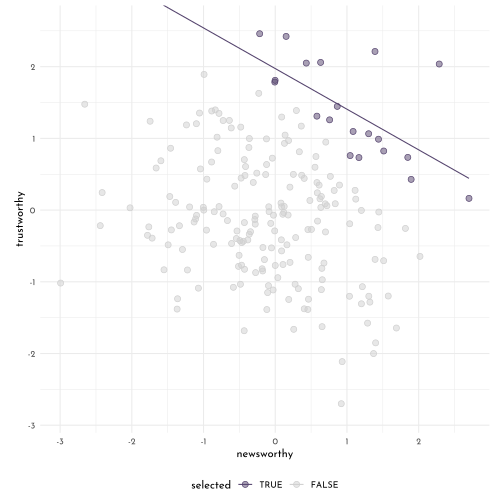
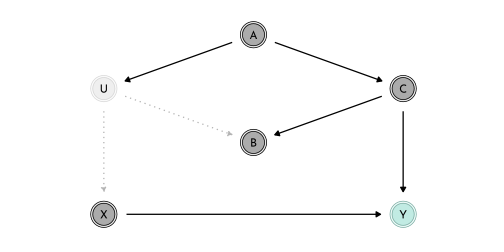
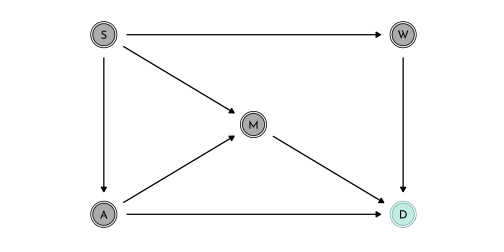
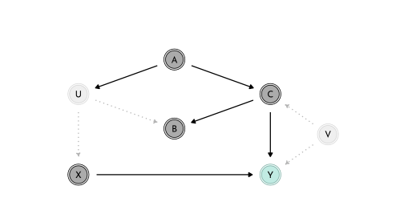
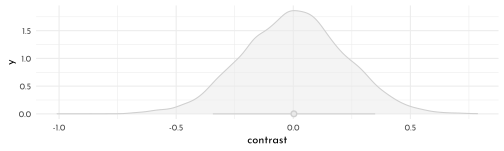
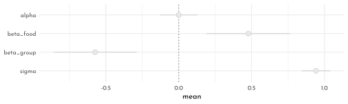
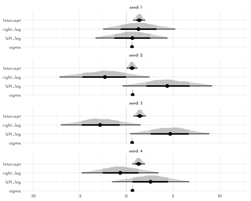

---
output:
  html_document:
  theme: yeti
pdf_document: default
editor_options: 
  chunk_output_type: console
---

# Rethinking: Chapter 6

**The Haunted DAG & Causal Terror**


by [Richard McElreath](https://xcelab.net/rm/statistical-rethinking/), building on the Summaries by [Solomon Kurz](https://bookdown.org/content/4857/) and [Jake Thompson](https://sr2-solutions.wjakethompson.com/linear-models.html).

Simulating section-distortion (*Berkson's paradox*)


```r
n <- 200
p <- .1
set.seed(42)

data_sim <- tibble(newsworthy = rnorm(n),
       trustworthy = rnorm(n),
       score = newsworthy + trustworthy,
       treshold = quantile(score, 1 - p),
       selected = score >= treshold)

data_sim %>% 
  ggplot(aes(x = newsworthy, y = trustworthy, color = selected)) +
  geom_smooth(data = data_sim %>% filter(selected),
              method = "lm", se = FALSE, fullrange = TRUE, size = .5) +
  geom_point(aes(fill = after_scale(clr_alpha(color))), shape = 21, size = 2.5) +
  scale_color_manual(values = c(`TRUE` = clr1, `FALSE` = clr0d))+
  coord_cartesian(xlim = range(data_sim$newsworthy) * 1.05,
                  ylim = range(data_sim$trustworthy) * 1.05,
                  expand = 0) +
  coord_equal(ylim = range(data_sim$trustworthy) * 1.05) +
  theme(legend.position = "bottom")
```



## Multicolliniarity

Simulating multicollinear legs 


```r
library(rethinking)
n <- 100
set.seed(909)
data_legs <- tibble(
  height = rnorm(n = n, mean = 10, sd = 2),
  leg_proportion = runif(n, min = 0.4, max = 0.5),
  left_leg = leg_proportion * height + rnorm(n, 0, .02),
  right_leg = leg_proportion * height + rnorm(n, 0, .02),
)

model_legs_multicollinear <- quap(
  flist = alist(
    height ~ dnorm(mu, sigma),
    mu <- alpha + beta_left * left_leg + beta_right * right_leg,
    alpha ~ dnorm(10, 100),
    beta_left ~ dnorm(2, 10),
    beta_right ~ dnorm(2, 10),
    sigma ~ dexp(1)
  ),
  data = data_legs
)

precis(model_legs_multicollinear) %>% 
  as.matrix() %>% 
  round(digits = 2) %>% 
  knitr::kable()
```


|           | mean|   sd|  5.5%| 94.5%|
|:----------|----:|----:|-----:|-----:|
|alpha      | 0.98| 0.28|  0.53|  1.44|
|beta_left  | 0.21| 2.53| -3.83|  4.25|
|beta_right | 1.78| 2.53| -2.26|  5.83|
|sigma      | 0.62| 0.04|  0.55|  0.69|

```r
precis(model_legs_multicollinear, depth = 2) %>% 
  as_tibble_rn() %>%
  ggplot(aes(y = param)) +
  geom_vline(xintercept = 0, lty = 3, color = rgb(0,0,0,.6)) +
  geom_linerange(aes(xmin = `5.5%`,
                     xmax =`94.5%`), color = clr0d) +
  geom_point(aes(x = mean),
             shape = 21, size = 3 ,
             color = clr0d, fill = clr0) +
  scale_y_discrete(limits = c("sigma", "beta_right", "beta_left", "alpha")) +
  theme(axis.title.y = element_blank())
```


```r
leg_posterior_samples <- extract.samples(model_legs_multicollinear) %>% as_tibble()

p_cor <- leg_posterior_samples %>% 
  ggplot(aes(x = beta_right, y = beta_left)) +
  geom_point(color = clr0d, fill = clr0, shape = 21, alpha = .5)

p_sum <- leg_posterior_samples %>% 
  ggplot(aes(x = beta_right + beta_left)) +
  geom_vline(xintercept = 1/mean(data_legs$leg_proportion), color = clr_dark, linetype = 3) +
  geom_density(color = clr0d, fill = clr0, alpha = .5, adjust = .4)

p_cor + p_sum
```


Milk example


```r
data(milk)
data_milk <- milk %>% 
  as_tibble() %>% 
  drop_na(kcal.per.g:perc.lactose) %>%
  mutate(across(where(is.double), standardize,
                .names = "{str_remove(str_remove(.col,'perc.'),'.per.g')}_std"))
```

Model *fat only*


```r
model_milk_fat <- quap(
  flist = alist(
    kcal_std ~ dnorm(mu, sigma),
    mu <- alpha + beta_fat * fat_std,
    alpha ~ dnorm(0,.2),
    beta_fat ~ dnorm(0,.5),
    sigma ~ dexp(1)
  ),
  data = data_milk
)

precis(model_milk_fat) %>% 
  as.matrix() %>% 
  round(digits = 2) %>% 
  knitr::kable()
```


|         | mean|   sd|  5.5%| 94.5%|
|:--------|----:|----:|-----:|-----:|
|alpha    | 0.00| 0.08| -0.12|  0.12|
|beta_fat | 0.86| 0.08|  0.73|  1.00|
|sigma    | 0.45| 0.06|  0.36|  0.54|

Model *lactose only*


```r
model_milk_lactose <- quap(
  flist = alist(
    kcal_std ~ dnorm(mu, sigma),
    mu <- alpha + beta_lactose * lactose_std,
    alpha ~ dnorm(0,.2),
    beta_lactose ~ dnorm(0,.5),
    sigma ~ dexp(1)
  ),
  data = data_milk
)

precis(model_milk_lactose) %>% 
  as.matrix() %>% 
  round(digits = 2) %>% 
  knitr::kable()
```


|             |  mean|   sd|  5.5%| 94.5%|
|:------------|-----:|----:|-----:|-----:|
|alpha        |  0.00| 0.07| -0.11|  0.11|
|beta_lactose | -0.90| 0.07| -1.02| -0.79|
|sigma        |  0.38| 0.05|  0.30|  0.46|

Multicollinear model


```r
model_milk_multicollinear <- quap(
  flist = alist(
    kcal_std ~ dnorm(mu, sigma),
    mu <- alpha + beta_fat * fat_std + beta_lactose * lactose_std,
    alpha ~ dnorm(0,.2),
    beta_fat ~ dnorm(0,.5),
    beta_lactose ~ dnorm(0,.5),
    sigma ~ dexp(1)
  ),
  data = data_milk
)

precis(model_milk_multicollinear) %>% 
  as.matrix() %>% 
  round(digits = 2) %>% 
  knitr::kable()
```


|             |  mean|   sd|  5.5%| 94.5%|
|:------------|-----:|----:|-----:|-----:|
|alpha        |  0.00| 0.07| -0.11|  0.11|
|beta_fat     |  0.24| 0.18| -0.05|  0.54|
|beta_lactose | -0.68| 0.18| -0.97| -0.38|
|sigma        |  0.38| 0.05|  0.30|  0.46|


```r
data_milk %>% 
  dplyr::select(kcal_std, fat_std, lactose_std) %>% 
  ggpairs(
    lower = list(continuous = wrap(ggally_points, colour = clr0d, size = 1.5, alpha = .7)),
    diag = list(continuous = wrap("densityDiag", fill = fll0, color = clr0d, adjust = .9)),
    upper = list(continuous = wrap(ggally_cor, size = 5, color = "black", family = "Josefin sans"))
  )
```


```r
dagify(K ~ L + F,
       L ~ D,
       F ~ D,
       coords = tibble(name = c("K", "L", "F", "D"),
                     x = c(.5, 0, 1, .5),
                     y = c(.6, 1, 1, 1))) %>%
  fortify() %>% 
  mutate(stage = if_else(name == "K", "response",
                         if_else(name %in% c("L", "F"),
                                 "predictor", "confounds"))) %>% 
  plot_dag(clr_in = clr3) + 
  scale_y_continuous(limits = c(.55, 1.05)) +
  scale_x_continuous(limits = c(-.05, 1.05)) +
  coord_equal()
```


Simulating Multicollinearity


```r
simluate_collinearity <- function(seed = 42, r = .9, data = data_milk ){
  data <- data %>% 
    mutate(x = rnorm(n = nrow(cur_data()),
                     mean = `perc.fat` * r,
                     sd = sqrt((1 - r ^ 2) * var(`perc.fat`))))
  mod <- lm(kcal.per.g ~ perc.fat + x, data = data)
  sqrt( diag( vcov(mod) ))[2]
}

# reapeat_simulation <- function(r = .9, n = 100){
#   stddev <- replicate( n, simluate_collinearity(r))
#   tibble(r = r, stddev_mean = mean(stddev), stddev_sd = sd(stddev))
# }

n_seed <- 100
n_rho  <- 60

simulation_means <- crossing(seed = 1:n_seed,
                             rho  = seq(from = 0, to = .99, length.out = n_rho))  %>% 
  mutate(parameter_sd = purrr::map2_dbl(seed, rho, simluate_collinearity)) %>% 
  group_by(rho) %>% 
  summarise(mean = mean(parameter_sd),
            ll   = quantile(parameter_sd, prob = .025),
            ul   = quantile(parameter_sd, prob = .975))

simulation_means %>%
  ggplot(aes(x = rho, y = mean, ymin = ll, ymax = ul)) +
  geom_smooth(stat = 'identity', size = .6, color = clr0d, fill = fll0)
```


## Post-treatment bias

Simulating fungus data


```r
n <- 100
set.seed(71)
data_fungus <- tibble(
  h_0 = rnorm(n, 10, 2),
  treatment = rep(0:1, each = n/2),
  fungus = rbinom(n = n, size = 1, prob = .5 - treatment * .4 ),
  h_1 = h_0 + rnorm(n, 5 - 3 * fungus)
)

precis(data_fungus) %>% 
  knit_precis()
```


|param     |  mean|   sd|  5.5%| 94.5%|histogram    |
|:---------|-----:|----:|-----:|-----:|:------------|
|h_0       |  9.96| 2.10|  6.57| 13.08|▁▂▂▂▇▃▂▃▁▁▁▁ |
|treatment |  0.50| 0.50|  0.00|  1.00|▇▁▁▁▁▁▁▁▁▇   |
|fungus    |  0.23| 0.42|  0.00|  1.00|▇▁▁▁▁▁▁▁▁▂   |
|h_1       | 14.40| 2.69| 10.62| 17.93|▁▁▃▇▇▇▁▁     |

selecting a prior


```r
precis(tibble(sim_p = rlnorm(1e4, 0, .25))) %>% 
  knit_precis()
```


|param | mean|   sd| 5.5%| 94.5%|histogram    |
|:-----|----:|----:|----:|-----:|:------------|
|sim_p | 1.04| 0.26| 0.67|   1.5|▁▁▃▇▇▃▁▁▁▁▁▁ |

$$
\begin{array}{rclr}
h_{1,i} & \sim & Normal( \mu_i, \sigma) & \textrm{[likelihood]}\\
\mu_i & = & h_{0,i} \times p & \textrm{[linear model]}\\
p & \sim & Log-Normal(0, 0.25) & \textrm{[$p$ prior]}\\
\sigma & \sim & Exponential(1)  & \textrm{[$\sigma$ prior]}
\end{array}
$$

$\rightarrow$ the main mass of the prior is between 40% shrinkage and 50% growth.

Model *without treatment*


```r
model_fungus_no_treatment <- quap(
  flist = alist(
    h_1 ~ dnorm( mu, sigma ),
    mu <- h_0 * p,
    p ~ dlnorm( 0, .25 ),
    sigma ~ dexp( 1 )
  ),
  data = data_fungus
)


precis(model_fungus_no_treatment) %>% 
  knit_precis()
```


|param | mean|   sd| 5.5%| 94.5%|
|:-----|----:|----:|----:|-----:|
|p     | 1.43| 0.02| 1.40|  1.45|
|sigma | 1.79| 0.13| 1.59|  1.99|

Model *with treatment* and *fungus* (post-treatment variable)

$$
\begin{array}{rclr}
h_{1,i} & \sim & Normal( \mu_i, \sigma) & \textrm{[likelihood]}\\
\mu_i & = & h_{0,i} \times p & \textrm{[linear model]}\\
p & = & \alpha + \beta_{T} T_{i} + \beta_{F} F_{i} & \textrm{[linear model]}\\
\alpha & \sim & Log-Normal(0, 0.25) & \textrm{[$\alpha$ prior]}\\
\beta_{T} & \sim & Normal(0, 0.5) & \textrm{[$\beta_{T}$ prior]}\\
\beta_{F} & \sim & Normal(0, 0.5) & \textrm{[$\beta_{F}$ prior]}\\
\sigma & \sim & Exponential(1) & \textrm{[$\sigma$ prior]}
\end{array}
$$


```r
model_fungus_post_treatment <- quap(
  flist = alist(
    h_1 ~ dnorm( mu, sigma ),
    mu <- h_0 * p,
    p <- alpha + beta_treatment * treatment + beta_fungus * fungus,
    alpha ~ dlnorm( 0, .2 ),
    beta_treatment ~ dnorm(0,.5),
    beta_fungus ~ dnorm(0,.5),
    sigma ~ dexp( 1 )
  ),
  data = data_fungus
)

precis(model_fungus_post_treatment) %>% 
  knit_precis()
```


|param          |  mean|   sd|  5.5%| 94.5%|
|:--------------|-----:|----:|-----:|-----:|
|alpha          |  1.48| 0.02|  1.44|  1.52|
|beta_treatment |  0.00| 0.03| -0.05|  0.05|
|beta_fungus    | -0.27| 0.04| -0.33| -0.21|
|sigma          |  1.41| 0.10|  1.25|  1.57|

Model *with treatment* but without *fungus*

$$
\begin{array}{rclr}
h_{1,i} & \sim & Normal( \mu_i, \sigma) & \textrm{[likelihood]}\\
\mu_i & = & h_{0,i} \times p & \textrm{[linear model]}\\
p & = & \alpha + \beta_{T} T_{i} & \textrm{[linear model]}\\
\alpha & \sim & Log-Normal(0, 0.25) & \textrm{[$\alpha$ prior]}\\
\beta_{T} & \sim & Normal(0, 0.5) & \textrm{[$\beta_{T}$ prior]}\\
\sigma & \sim & Exponential(1) & \textrm{[$\sigma$ prior]}
\end{array}
$$


```r
model_fungus_only_treatment <- quap(
  flist = alist(
    h_1 ~ dnorm( mu, sigma ),
    mu <- h_0 * p,
    p <- a + beta_treatment * treatment,
    a ~ dlnorm( 0, .25 ),
    beta_treatment ~ dnorm(0,.5),
    sigma ~ dexp( 1 )
  ),
  data = data_fungus
)

precis(model_fungus_only_treatment) %>% 
  knit_precis()
```


|param          | mean|   sd| 5.5%| 94.5%|
|:--------------|----:|----:|----:|-----:|
|a              | 1.38| 0.03| 1.34|  1.42|
|beta_treatment | 0.08| 0.03| 0.03|  0.14|
|sigma          | 1.75| 0.12| 1.55|  1.94|

d-separation


```r
dagify("H_1" ~ H_0 + F,
       F ~ T,
       coords = tibble(name = c("H_0", "H_1", "F", "T"),
                     x = c(0, .5, .75, 1),
                     y = c(0, 0, 0, 0))) %>%
  fortify() %>% 
  mutate(stage = if_else(name == "H_1", "response",
                         if_else(name %in% c("H_0", "F", "T"),
                                 "predictor", "confounds")),
         name = str_replace(name, "([A-Z])_([0-9])", "\\1\\[\\2\\]")) %>% 
  plot_dag(clr_in = clr3) + 
  scale_y_continuous(limits = c(-.05, .05)) +
  scale_x_continuous(limits = c(-.05, 1.05)) +
  coord_equal()
```


*Directional Separation* of `H_1` and `T` occurs after conditioning on `F`:


```r
library(dagitty)
impliedConditionalIndependencies("dag{ H_0 -> H_1 <- F <- T}")
```

```
#> F _||_ H_0
#> H_0 _||_ T
#> H_1 _||_ T | F
```


```r
dagify(H_1 ~ H_0 + M,
       F ~ T,
       F ~ M,
       coords = tibble(name = c("H_0", "H_1", "M" , "F", "T"),
                     x = c(0, .5, .75,  1, 1.5),
                     y = c(1, 1, .7, 1, 1))) %>%
  fortify() %>% 
  mutate(stage = if_else(name == "H_1", "response",
                         if_else(name %in% c("H_0", "F", "T"),
                                 "predictor", "confounds")),
         name = str_replace(name, "([A-Z])_([0-9])", "\\1\\[\\2\\]")) %>% 
  plot_dag(clr_in = clr3) + 
  scale_y_continuous(limits = c(.65, 1.05)) +
  scale_x_continuous(limits = c(-.05, 1.55)) +
  coord_equal()
```


```r
n <- 1e4
set.seed(71)
data_moisture <- tibble(
  h_0 = rnorm(n, 10, 2),
  treatment = rep(0:1, each = n/2),
  moisture = rbern(n),
  fungus = rbinom(n = n, size = 1, prob = .5 - treatment * .4 + moisture * .4),
  h_1 = h_0 + rnorm(n, 5 + 3 * moisture)
)

precis(data_moisture) %>% 
  knit_precis()
```


|param     |  mean|   sd|  5.5%| 94.5%|histogram  |
|:---------|-----:|----:|-----:|-----:|:----------|
|h_0       | 10.04| 2.01|  6.81| 13.22|▁▁▁▂▇▇▂▁▁  |
|treatment |  0.50| 0.50|  0.00|  1.00|▇▁▁▁▁▁▁▁▁▇ |
|moisture  |  0.50| 0.50|  0.00|  1.00|▇▁▁▁▁▁▁▁▁▇ |
|fungus    |  0.50| 0.50|  0.00|  1.00|▇▁▁▁▁▁▁▁▁▇ |
|h_1       | 16.55| 2.69| 12.22| 20.84|▁▁▁▃▇▇▅▂▁▁ |

Moisture-Model *with treatment* and *fungus* (post-treatment variable)


```r
model_moisture_post_treatment <- quap(
  flist = alist(
    h_1 ~ dnorm( mu, sigma ),
    mu <- h_0 * p,
    p <- alpha + beta_treatment * treatment + beta_fungus * fungus,
    alpha ~ dlnorm( 0, .2 ),
    beta_treatment ~ dnorm(0,.5),
    beta_fungus ~ dnorm(0,.5),
    sigma ~ dexp( 1 )
  ),
  data = data_moisture
)

precis(model_moisture_post_treatment) %>% 
  knit_precis()
```


|param          | mean|   sd| 5.5%| 94.5%|
|:--------------|----:|----:|----:|-----:|
|alpha          | 1.53| 0.00| 1.52|  1.54|
|beta_treatment | 0.05| 0.00| 0.05|  0.06|
|beta_fungus    | 0.13| 0.00| 0.12|  0.14|
|sigma          | 2.13| 0.02| 2.11|  2.16|

Moisture-Model *with treatment* but without *fungus* 


```r
model_moisture_only_treatment <- quap(
  flist = alist(
    h_1 ~ dnorm( mu, sigma ),
    mu <- h_0 * p,
    p <- a + beta_treatment * treatment,
    a ~ dlnorm( 0, .25 ),
    beta_treatment ~ dnorm(0,.5),
    sigma ~ dexp( 1 )
  ),
  data = data_moisture
)

precis(model_moisture_only_treatment) %>% 
  knit_precis()
```


|param          | mean|   sd| 5.5%| 94.5%|
|:--------------|----:|----:|----:|-----:|
|a              | 1.62| 0.00| 1.62|  1.63|
|beta_treatment | 0.00| 0.00| 0.00|  0.01|
|sigma          | 2.22| 0.02| 2.19|  2.25|

## Collider Bias


```r
# data_happy <- sim_happiness(seed = 1977, N_years = 66) %>%
#   as_tibble()

progress_year <- function(data, year, max_age = 65, n_births = 20, aom = 18){
  new_cohort <- tibble(
    age = 1,
    married = as.integer(0),
    happiness = seq(from = -2, to = 2, length.out = n_births),
    year_of_birth = year)
  
  data %>% 
    mutate(age = age + 1) %>% 
    bind_rows(., new_cohort) %>% 
    mutate(married = if_else(age >= aom & married == 0,
                             rbern(n(), inv_logit(happiness - 4)),
                             married )) %>% 
    filter(age <= max_age)
}

sim_tidy <- function(seed = 1977, n_years = 1000, max_age = 65, n_births = 20, aom = 18){
  set.seed(seed)
  
  empty_tibble <- tibble(age = double(),
       married = integer(),
       happiness = double())
  
  1:n_years %>% 
    reduce(.f = progress_year,
           .init = empty_tibble,
           max_age = max_age, n_births = n_births, aom = aom)
}

data_married <- sim_tidy(seed = 2021, n_years = 65, n_births = 21)

data_married %>% 
  mutate(married = factor(married,
                          labels = c("unmarried", "married"))) %>% 
  
  ggplot(aes(x = age, y = happiness, color = married)) +
  geom_point(size = 1.75, shape = 21, 
             aes(fill = after_scale(clr_alpha(color)))) +
  scale_color_manual(NULL, values = c(married = clr2, unmarried = clr0d)) +
  scale_x_continuous(expand = c(.015, .015)) +
  theme(panel.grid = element_blank(),
        legend.position = "bottom")
```


$$
\begin{array}{rclr}
happyness_{i} & \sim & Normal( \mu_i, \sigma) & \textrm{[likelihood]}\\
\mu_i & = & \alpha_{married[i]} + \beta_{age} age_{i} & \textrm{[linear model]}\\
\end{array}
$$


```r
data_married_adults <- data_married %>% 
  filter(age >= 18) %>% 
  mutate(age_trans = (age - 18)/ diff(c(18, 65)),
         married_idx = married + 1L)

model_happy_married <- quap(
  flist = alist(
    happiness ~ dnorm(mu, sigma),
    mu <- alpha[married_idx] + beta_age * age_trans,
    alpha[married_idx] ~ dnorm( 0, 1 ),
    beta_age ~ dnorm( 0, 2 ),
    sigma ~ dexp( 1 )
  ),
  data = data_married_adults
)

precis(model_happy_married, depth = 2) %>% 
  knit_precis()
```


|param    |  mean|   sd|  5.5%| 94.5%|
|:--------|-----:|----:|-----:|-----:|
|alpha[1] | -0.21| 0.06| -0.31| -0.11|
|alpha[2] |  1.33| 0.08|  1.20|  1.47|
|beta_age | -0.81| 0.11| -0.99| -0.64|
|sigma    |  0.97| 0.02|  0.94|  1.01|

```r
model_happy <- quap(
  flist = alist(
    happiness ~ dnorm(mu, sigma),
    mu <- alpha + beta_age * age_trans,
    alpha ~ dnorm( 0, 1 ),
    beta_age ~ dnorm( 0, 2 ),
    sigma ~ dexp( 1 )
  ),
  data = data_married_adults
)

precis(model_happy, depth = 2) %>% 
  knit_precis()
```


|param    | mean|   sd|  5.5%| 94.5%|
|:--------|----:|----:|-----:|-----:|
|alpha    | 0.00| 0.07| -0.12|  0.12|
|beta_age | 0.00| 0.13| -0.21|  0.21|
|sigma    | 1.21| 0.03|  1.17|  1.25|

### The haunted DAG

Education example (including Grandparents, Parents, Children and the *unobserved* Neighborhood)


```r
p_dag1 <- dagify(C ~ P + G,
       P ~ G,
       coords = tibble(name = c("G", "P", "C"),
                     x = c(0, 1.5, 1.5),
                     y = c(1, 1, 0))) %>%
  fortify() %>% 
  mutate(stage = if_else(name == "C", "response",
                         if_else(name %in% c("P", "G"),
                                 "predictor", "confounds"))) %>% 
  plot_dag(clr_in = clr3) + 
  scale_y_continuous(limits = c(-.05, 1.05)) +
  scale_x_continuous(limits = c(-.05, 1.55)) +
  coord_equal()

p_dag2 <- dagify(C ~ P + G + U,
       P ~ G + U,
       coords = tibble(name = c("G", "P", "C", "U"),
                     x = c(0, 1.5, 1.5, 2),
                     y = c(1, 1, 0, .5))) %>%
  fortify() %>% 
  mutate(stage = if_else(name == "C", "response",
                         if_else(name %in% c("P", "G"),
                                 "predictor", "confounds"))) %>% 
  plot_dag(clr_in = clr3) + 
  scale_y_continuous(limits = c(-.05, 1.05)) +
  scale_x_continuous(limits = c(-.05, 2.05)) +
  coord_equal()

p_dag1 + p_dag2 + plot_annotation(tag_levels = "a") & theme(plot.tag = element_text(family = fnt_sel))
```


```r
n <- 200
beta_gp <- 1 # direct effect of G -> P
beta_gc <- 0 # direct effect of G -> C
beta_pc <- 1 # direct effect of P -> C
beta_U <- 2  # direct effect of U on both C and P

set.seed(1)
data_education <- tibble(
  unobserved = 2 * rbern(n, .5) - 1,
  grandparents = rnorm( n ),
  parents = rnorm( n, beta_gp * grandparents + beta_U * unobserved),
  children = rnorm( n, beta_gc * grandparents + beta_pc * parents + beta_U * unobserved)
)

model_education <- quap(
  flist = alist(
    children ~ dnorm(mu, sigma),
    mu <- alpha + beta_pc * parents + beta_gc * grandparents,
    alpha ~ dnorm( 0, 1 ),
    c( beta_pc, beta_gc) ~ dnorm( 0, 1 ),
    sigma ~ dexp(1)
  ),
  data = data_education
)

precis(model_education) %>% 
  knit_precis()
```


|param   |  mean|   sd|  5.5%| 94.5%|
|:-------|-----:|----:|-----:|-----:|
|alpha   | -0.12| 0.10| -0.28|  0.04|
|beta_pc |  1.79| 0.04|  1.72|  1.86|
|beta_gc | -0.84| 0.11| -1.01| -0.67|
|sigma   |  1.41| 0.07|  1.30|  1.52|


```r
data_education_plot <- data_education %>% 
  mutate(across(grandparents:children,
                standardize,
                .names = "{.col}_std")) %>%
  mutate(parents_inner = between(parents_std,
                                 left = quantile(parents_std, probs = .45),
                                 right = quantile(parents_std, probs = .60)))
data_education_plot %>% 
  ggplot(aes(x = grandparents_std, y = children_std)) +
  geom_smooth(data = data_education_plot %>% filter(parents_inner),
              method = "lm", se = FALSE, size = .5, color = clr_dark, fullrange = TRUE) +
  geom_point(aes(color = factor(unobserved),
                 fill = after_scale(clr_alpha(color,.8)),
                 shape = parents_inner),
             size = 2.5) +
  scale_color_manual(values = c(clr0d, clr2), guide = "none") +
  scale_shape_manual(values = c(`FALSE` = 1, `TRUE` = 21), guide = "none") +
  coord_equal()
```


```r
model_education_resolved <- quap(
  flist = alist(
    children ~ dnorm(mu, sigma),
    mu <- alpha + beta_pc * parents + beta_gc * grandparents + beta_u * unobserved,
    alpha ~ dnorm( 0, 1 ),
    c( beta_pc, beta_gc, beta_u ) ~ dnorm( 0, 1 ),
    sigma ~ dexp(1)
  ),
  data = data_education
)

precis(model_education_resolved) %>% 
  knit_precis()
```


|param   |  mean|   sd|  5.5%| 94.5%|
|:-------|-----:|----:|-----:|-----:|
|alpha   | -0.12| 0.07| -0.24| -0.01|
|beta_pc |  1.01| 0.07|  0.91|  1.12|
|beta_gc | -0.04| 0.10| -0.20|  0.11|
|beta_u  |  2.00| 0.15|  1.76|  2.23|
|sigma   |  1.02| 0.05|  0.94|  1.10|

### Shutting the Backdoor

The four elements that construct DAGs:


```r
p_dag1 <- dagify(
  X ~ Z,
  Y ~ Z,
  coords = tibble(name = c("X", "Y", "Z"),
                  x = c(0, 1, .5),
                  y = c(1, 1, 0))) %>%
  fortify() %>% 
  mutate(stage = if_else(name == "", "response",
                         if_else(name %in% c("X", "Y", "Z"),
                                 "predictor", "confounds"))) %>% 
  plot_dag(clr_in = clr3) + 
  ggtitle("Fork")

p_dag2 <- dagify(
  Z ~ X,
  Y ~ Z,
  coords = tibble(name = c("X", "Y", "Z"),
                  x = c(0, 1, .5),
                  y = c(1, 0, .5))) %>%
  fortify() %>% 
  mutate(stage = if_else(name == "", "response",
                         if_else(name %in% c("X", "Y", "Z"),
                                 "predictor", "confounds"))) %>% 
  plot_dag(clr_in = clr3) + 
  ggtitle("Pipe")

p_dag3 <- dagify(
  Z ~ X + Y,
  coords = tibble(name = c("X", "Y", "Z"),
                  x = c(0, 1, .5),
                  y = c(0, 0 , 1))) %>%
  fortify() %>% 
  mutate(stage = if_else(name == "", "response",
                         if_else(name %in% c("X", "Y", "Z"),
                                 "predictor", "confounds"))) %>% 
  plot_dag(clr_in = clr3) + 
  ggtitle("Collider")

p_dag4 <- dagify(
  Z ~ X + Y,
  D ~ Z,
  coords = tibble(name = c("X", "Y", "Z", "D"),
                  x = c(0, 1, .5, .5),
                  y = c(0, 0 , 1, 0))) %>%
  fortify() %>% 
  mutate(stage = if_else(name == "", "response",
                         if_else(name %in% c("X", "Y", "Z", "D"),
                                 "predictor", "confounds"))) %>% 
  plot_dag(clr_in = clr3) + 
  ggtitle("Collider")

p_dag1 +
  p_dag2 +
  p_dag3 +
  p_dag4  +
  plot_annotation(tag_levels = "a") +
  plot_layout(nrow = 1) &
  coord_fixed(ratio = .6) &
  scale_y_continuous(limits = c(-.1, 1.1)) &
  scale_x_continuous(limits = c(-.1, 1.1)) &
  theme(plot.title = element_text(hjust = .5, family = fnt_sel),
        plot.tag = element_text(family = fnt_sel))
```


- **a. Fork**: $X \perp \!\!\! \perp Y | Z$
- **b. Pipe**: $X \perp \!\!\! \perp Y | Z$
- **c. Collider**: $X \perp \!\!\! \perp Y$, but $X \not\!\perp\!\!\!\perp Y | Z$
- **d. Descendant**: $X \perp \!\!\! \perp Y$, but $X \not\!\perp\!\!\!\perp Y | Z$ (to a lesser extent)

### Two Roads


```r
dag_roads <- dagify(
  U ~ A,
  X ~ U,
  Y ~ X + C,
  C ~ A,
  B ~ U + C,
  exposure = "X",
  outcome = "Y",
  coords = tibble(name = c("U", "A", "B", "C", "X", "Y"),
                  x = c(0, .5, .5, 1, 0, 1),
                  y = c(.7, 1, .4 , .7, 0, 0)))

dag_roads %>%
  fortify() %>% 
  mutate(stage = if_else(name == "Y", "response",
                         if_else(name %in% c("X", "A", "B", "C"),
                                 "predictor", "confounds"))) %>% 
  plot_dag(clr_in = clr3) +
  coord_fixed(ratio = .6) &
  scale_y_continuous(limits = c(-.1, 1.1)) &
  scale_x_continuous(limits = c(-.1, 1.1)) &
  theme(plot.title = element_text(hjust = .5, family = fnt_sel),
        plot.tag = element_text(family = fnt_sel))
```



```r
adjustmentSets(dag_roads,exposure = "X", outcome = "Y")
```

```
#> { C }
#> { A }
#> { U }
```

```r
dag_roads <- dagitty( "dag {
         U [unobserved]
         X -> Y
         X <- U <- A -> C -> Y
         U -> B <- C
}" )

adjustmentSets(dag_roads,exposure = "X", outcome = "Y")
```

```
#> { C }
#> { A }
```


### Backdoor Waffles


```r
dag_waffles <- dagify(
  D ~ A + M + W,
  A ~ S,
  M ~ A + S,
  W ~ S,
  exposure = "W",
  outcome = "D",
  coords = tibble(name = c("S", "A", "M", "W", "D"),
                  x = c(0, 0, .5, 1, 1),
                  y = c(1, 0, .5 , 1, 0)))

dag_waffles %>%
  fortify() %>% 
  mutate(stage = if_else(name == "D", "response",
                         if_else(name %in% c("W", "A", "M", "S"),
                                 "predictor", "confounds"))) %>% 
  plot_dag(clr_in = clr3) +
  coord_fixed(ratio = .6) &
  scale_y_continuous(limits = c(-.1, 1.1)) &
  scale_x_continuous(limits = c(-.1, 1.1)) &
  theme(plot.title = element_text(hjust = .5, family = fnt_sel),
        plot.tag = element_text(family = fnt_sel))
```



```r
adjustmentSets(dag_waffles)
```

```
#> { A, M }
#> { S }
```

Test the implications of the DAG by investigating the *conditional independencies* implied by the DAG in the real data (by conditioning on the respective variables):


```r
impliedConditionalIndependencies(dag_waffles)
```

```
#> A _||_ W | S
#> D _||_ S | A, M, W
#> M _||_ W | S
```

Exporting models and data for re-use


```r
library(rlang)
chapter6_models <- env(
  data_legs = data_legs,
  model_legs_multicollinear = model_legs_multicollinear,
  data_milk = data_milk,
  model_milk_fat = model_milk_fat,
  model_milk_lactose = model_milk_lactose,
  model_milk_multicollinear = model_milk_multicollinear,
  data_fungus = data_fungus,
  model_fungus_no_treatment = model_fungus_no_treatment,
  model_fungus_post_treatment = model_fungus_post_treatment,
  model_fungus_only_treatment = model_fungus_only_treatment,
  data_moisture = data_moisture,
  model_moisture_post_treatment = model_moisture_post_treatment,
  model_moisture_only_treatment = model_moisture_only_treatment,
  data_married_adults = data_married_adults,
  model_happy_married = model_happy_married,
  model_happy = model_happy,
  data_education = data_education,
  model_education = model_education,
  model_education_resolved = model_education_resolved
)

write_rds(chapter6_models, "envs/chapter6_models.rds")
```


## Homework

**E1**

- multicollinearity (including two highly correlated predictors, so that a *ridge of explanatory combinations* prevents the precise estimate of both)
- post-treatment bias (masking an association by assuming all efects are caused by an intermediate descendant)
- collider bias (introducing an association as a *selection effect*)

**E2**

Fruit mass as a function of FF *and* crown area

FF $\rightarrow$ Fruit mass $\leftarrow$ crown area

**E3**

In all cases, we wonder about the influence of $X$ on $Y$.
The elemental confounds influence how conditioning on $Z$ (or $D$) effects our inference.

- The Fork ($X \leftarrow Z \rightarrow Y$): $X \perp \!\!\! \perp Y | Z$, but $X \not\!\perp\!\!\!\perp Y$
- The Pipe ($X \rightarrow Z \rightarrow Y$): $X \perp \!\!\! \perp Y | Z$, but $X \not\!\perp\!\!\!\perp Y$
- The Collider ($X \rightarrow Z \leftarrow Y$): $X \perp \!\!\! \perp Y$, but $X \not\!\perp\!\!\!\perp Y | Z$
- The Descendant ($X \rightarrow Z \leftarrow Y; Z \rightarrow D$, $X \rightarrow Z \rightarrow Y; Z \rightarrow D$): conditioning on $D$ has the same (slightly weaker) effect like conditioning on $Z$

**E4**

As bias sample acts like selection for a specific value of a trait (eg. an article *was selected* for publication).
This is implicitly conditioning on a third variable (also like eg. the 45-60 percentile of parents).

**M1**


```r
dag_roads_v <- dagify(
  U ~ A,
  X ~ U,
  Y ~ X + C + V,
  C ~ A + V,
  B ~ U + C,
  exposure = "X",
  outcome = "Y",
  coords = tibble(name = c("U", "A", "B", "C", "X", "Y", "V"),
                  x = c(0, .5, .5, 1, 0, 1, 1.3),
                  y = c(.7, 1, .4 , .7, 0, 0, .35)))

dag_roads_v %>%
  fortify() %>% 
  mutate(stage = if_else(name == "Y", "response",
                         if_else(name %in% c("X", "A", "B", "C"),
                                 "predictor", "confounds"))) %>% 
  plot_dag(clr_in = clr3) +
  coord_fixed(ratio = .6) &
  scale_y_continuous(limits = c(-.1, 1.4)) &
  scale_x_continuous(limits = c(-.1, 1.4)) &
  theme(plot.title = element_text(hjust = .5, family = fnt_sel),
        plot.tag = element_text(family = fnt_sel))
```



```r
adjustmentSets(dag_roads_v, exposure = "X", outcome = "Y")
```

```
#> { C, V }
#> { A }
#> { U }
```

```r
dag_roads_v <- dagitty( "dag {
         U [unobserved]
         V [unobserved]
         X -> Y
         X <- U <- A -> C -> Y
         U -> B <- C
         Y <- V -> C
}" )

adjustmentSets(dag_roads_v, exposure = "X", outcome = "Y")
```

```
#> { A }
```

... there are now $x + 1$ paths.

Condition on `A`, since conditioning on `C` would open the collider between `A` and `V` allowing for the flow of information through the backdoor `V`.

**M2**


```r
dagify(
  Z ~ X,
  Y ~ Z,
  exposure = "X",
  outcome = "Y",
  coords = tibble(name = c("X", "Y", "Z"),
                  x = c(0, 1, .5),
                  y = c(0, 0, 0))) %>%
  fortify() %>% 
  mutate(stage = if_else(name == "Y", "response",
                         if_else(name %in% c("X", "Z"),
                                 "predictor", "confounds"))) %>% 
  plot_dag(clr_in = clr3) +
  coord_fixed(ratio = .6) &
  scale_y_continuous(limits = c(-.1, .1)) &
  scale_x_continuous(limits = c(-.1, 1.1)) &
  theme(plot.title = element_text(hjust = .5, family = fnt_sel),
        plot.tag = element_text(family = fnt_sel))
```


```r
n <- 1e4
data_sim_multicol <- tibble(x = rnorm(n),
                   z = rnorm(n, mean = x, sd = .05),
                   y = rnorm(n, mean = z))

data_sim_multicol %>% 
  ggpairs(
    lower = list(continuous = wrap(ggally_points, colour = clr0d, size = 1.5, alpha = .7)),
    diag = list(continuous = wrap("densityDiag", fill = fll0, color = clr0d, adjust = .9)),
    upper = list(continuous = wrap(ggally_cor, size = 5, color = "black", family = "Josefin sans"))
  )
```


```r
model_sim_multicol <- quap(
  flist = alist(
    y ~ dnorm(mu, sigma),
    mu <- alpha + beta_x * x + beta_z * z,
    alpha ~ dnorm( 0, .2 ),
    beta_x ~ dnorm( 0, .5),
    beta_z ~ dnorm( 0, .5),
    sigma ~ dexp(1)
  ),
  data = data_sim_multicol
)

precis(model_sim_multicol) %>% 
  knit_precis()
```


|param  |  mean|   sd|  5.5%| 94.5%|
|:------|-----:|----:|-----:|-----:|
|alpha  | -0.01| 0.01| -0.03|  0.00|
|beta_x | -0.10| 0.17| -0.38|  0.17|
|beta_z |  1.12| 0.17|  0.84|  1.39|
|sigma  |  1.00| 0.01|  0.98|  1.01|


```r
precis(model_sim_multicol, depth = 2) %>% 
  as_tibble_rn() %>%
  ggplot(aes(y = param)) +
  geom_vline(xintercept = 0, lty = 3, color = rgb(0,0,0,.6)) +
  geom_linerange(aes(xmin = `5.5%`,
                     xmax =`94.5%`), color = clr0d) +
  geom_point(aes(x = mean),
             shape = 21, size = 3 ,
             color = clr0d, fill = clr0) +
  scale_y_discrete(limits = c("sigma", "beta_z", "beta_x", "alpha")) +
  theme(axis.title.y = element_blank())
```


Here the effect of $Z$ on $Y$ is not obscured by including $X$.
The difference is that here we are breaking a pipe by conditioning on $Z$.

**M3**


```r
dag_h1 <- dagify(
  X ~ Z,
  Y ~ X + Z + A,
  Z ~ A,
  exposure = "X",
  outcome = "Y",
  coords = tibble(name = c("X", "Y", "Z", "A"),
                  x = c(0, 1, .5, 1),
                  y = c(0, 0, .7, .7)))

dag_h2 <- dagify(
  Z ~ X,
  Y ~ X + Z + A,
  Z ~ A,
  exposure = "X",
  outcome = "Y",
  coords = tibble(name = c("X", "Y", "Z", "A"),
                  x = c(0, 1, .5, 1),
                  y = c(0, 0, .7, .7)))

dag_h3 <- dagify(
  X ~ A,
  Y ~ X,
  Z ~ X + Y + A,
  exposure = "X",
  outcome = "Y",
  coords = tibble(name = c("X", "Y", "Z", "A"),
                  x = c(0, 1, .5, 0),
                  y = c(0, 0, .7, .7)))

dag_h4 <- dagify(
  X ~ A,
  Y ~ X + Z,
  Z ~ X + A,
  exposure = "X",
  outcome = "Y",
  coords = tibble(name = c("X", "Y", "Z", "A"),
                  x = c(0, 1, .5, 0),
                  y = c(0, 0, .7, .7)))

list(dag_h1, dag_h2,
     dag_h3, dag_h4) %>% 
  purrr::map(.f = function(dag){ 
    dag %>%
  fortify() %>% 
  mutate(stage = if_else(name == "Y", "response",
                         if_else(name %in% c("X", "Z", "A"),
                                 "predictor", "confounds")))}) %>% 
  purrr::map(plot_dag, clr_in = clr3)  %>% 
    wrap_plots() +
  plot_annotation(tag_levels = "a") &
  coord_fixed(ratio = .6) &
  scale_y_continuous(limits = c(-.1, .8)) &
  scale_x_continuous(limits = c(-.1, 1.1)) &
  theme(plot.title = element_text(hjust = .5, family = fnt_sel),
        plot.tag = element_text(family = fnt_sel))
```


- **a.** condition on $Z$ to close both backdoor paths into $Y$
- **b.** none (the information flow through $Z$ is causal and thus desired, and $A$ is blocked by the collider in $Z$)
- **c.** none - there are no open backdoors into $Y$
- **d.** condition on $A$ to enable the information from desired (causal) information from $Z$ while removing the undesired information from $A$


```r
list(dag_h1, dag_h2,
     dag_h3, dag_h4) %>% 
  purrr::map(adjustmentSets)
```

```
#> [[1]]
#> { Z }
#> 
#> [[2]]
#>  {}
#> 
#> [[3]]
#>  {}
#> 
#> [[4]]
#> { A }
```

**H1**


```r
data(WaffleDivorce)

data_waffle <- WaffleDivorce %>%
  as_tibble() %>% 
  drop_na(everything()) %>%
  mutate(across(where(is.double), standardize,
                .names = "{str_to_lower(.col)}_std"),
         waffle_std = standardize(WaffleHouses)) %>% 
  dplyr::select(Location,MedianAgeMarriage, Marriage, Divorce, WaffleHouses, South,
                medianagemarriage_std, marriage_std, divorce_std, waffle_std)

dag_waffles <- dagify(D ~ A + M + W,
       M ~ A + S,
       A ~ S,
       W ~ S,
       exposure = "W",
       outcome = "D",
       coords = tibble(name = c("S", "A", "M", "D", "W"),
                     x = c(0, 0, .5, 1, 1),
                     y = c(1, 0, .5, 0, 1)))

dag_waffles %>%
  fortify() %>% 
  mutate(stage = if_else(name == "D", "response",
                         if_else(name %in% c("A", "M", "S", "W"),
                                 "predictor", "confounds"))) %>% 
  plot_dag(clr_in = clr3) + 
  scale_y_continuous(limits = c(-.1, 1.1)) +
  coord_fixed(ratio = .6)
```


```r
adjustmentSets(dag_waffles)
```

```
#> { A, M }
#> { S }
```

$\rightarrow$ there are four paths from $W$ to $D$ - the only causal one being $W \rightarrow D$.
To close the other three, we can condition on $S$ which will close two different forks, efectiffley removing all non-causaul backdoor paths.


```r
model_waffle <- quap(
  flist = alist(
    divorce_std ~ dnorm(mu, sigma),
    mu <- alpha[South] + beta_w * waffle_std,
    alpha[South] ~ dnorm(0, .5),
    beta_w ~ dnorm(0, .5),
    sigma ~ dexp(1)
  ),
  data = data_waffle
)

precis(model_waffle, depth = 2) %>% 
  knit_precis()
```


|param    | mean|   sd|  5.5%| 94.5%|
|:--------|----:|----:|-----:|-----:|
|alpha[1] | 0.00| 0.13| -0.21|  0.21|
|alpha[2] | 0.00| 0.50| -0.80|  0.80|
|beta_w   | 0.24| 0.13|  0.03|  0.45|
|sigma    | 0.95| 0.09|  0.80|  1.10|

```r
precis(model_waffle, depth = 2) %>% 
  as_tibble_rn() %>%
  ggplot(aes(y = param)) +
  geom_vline(xintercept = 0, lty = 3, color = rgb(0,0,0,.6)) +
  geom_linerange(aes(xmin = `5.5%`,
                     xmax =`94.5%`), color = clr0d) +
  geom_point(aes(x = mean),
             shape = 21, size = 3 ,
             color = clr0d, fill = clr0) +
  scale_y_discrete(limits = c("sigma", "beta_w", "alpha[2]", "alpha[1]")) +
  theme(axis.title.y = element_blank())
```


$\rightarrow$ The total causal influence of $W$ on $D$ should be in the order of 0.24 standard deviations.

**H2**


```r
impliedConditionalIndependencies(dag_waffles)
```

```
#> A _||_ W | S
#> D _||_ S | A, M, W
#> M _||_ W | S
```


```r
model_waffel_test1 <- quap(
  flist = alist(
    medianagemarriage_std ~ dnorm(mu, sigma),
    mu <- alpha[South] + beta_w * waffle_std,
    alpha[South] ~ dnorm(0, .2),
    beta_w ~ dnorm(0, .5),
    sigma ~ dexp(1)
  ),
  data = data_waffle
)
precis(model_waffel_test1, depth = 2) %>% 
  knit_precis()
```


|param    |  mean|   sd|  5.5%| 94.5%|
|:--------|-----:|----:|-----:|-----:|
|alpha[1] |  0.00| 0.11| -0.18|  0.18|
|alpha[2] |  0.00| 0.20| -0.32|  0.32|
|beta_w   | -0.11| 0.13| -0.32|  0.10|
|sigma    |  0.97| 0.10|  0.82|  1.13|

$\rightarrow$ the influence of $W$ on $A$ is moderate (-0.11), with a wide posterior distribution both on either side of zero (-0.32, 0.1).
Based on this we can not find a definitive influence from $W$ on $A$,


```r
model_waffel_test2 <- quap(
  flist = alist(
    divorce_std ~ dnorm(mu, sigma),
    mu <- alpha[South] +  beta_a * medianagemarriage_std + beta_m * marriage_std + beta_w * waffle_std,
    alpha[South] ~ dnorm(0, .2),
    c(beta_a, beta_m, beta_w) ~ dnorm(0, .5),
    sigma ~ dexp(1)
  ),
  data = data_waffle
)

precis(model_waffel_test2, depth = 2) %>% 
  knit_precis()
```


|param    |  mean|   sd|  5.5%| 94.5%|
|:--------|-----:|----:|-----:|-----:|
|alpha[1] |  0.00| 0.10| -0.15|  0.15|
|alpha[2] |  0.00| 0.20| -0.32|  0.32|
|beta_a   | -0.58| 0.15| -0.82| -0.35|
|beta_m   | -0.05| 0.15| -0.29|  0.19|
|beta_w   |  0.18| 0.11|  0.01|  0.35|
|sigma    |  0.77| 0.08|  0.64|  0.89|


```r
waffel_test2_samples <- extract.samples(model_waffel_test2) %>% 
  as_tibble() %>% 
  mutate(contrast = alpha[,1] - alpha[,2])

waffel_test2_samples_quantiles <- tibble(x = quantile(waffel_test2_samples$contrast, prob = c(.055, .5, .945)),
                                   percentile = c("lower", "median", "upper")) %>% 
  pivot_wider(names_from = "percentile", values_from = "x")

waffel_test2_samples %>% 
  ggplot(aes(x = contrast)) +
  geom_density(color = clr0d, fill = fll0) +
  geom_pointrange(data = waffel_test2_samples_quantiles, 
                  aes(xmin = lower, x = median, xmax = upper, y = 0), color = clr0d, fill = clr0, shape = 21)
```



$\rightarrow$ the influence of $S$ on $D$ is moderate after conditioning on $A$, $M$ and $W$ (median of the contrast effect: 0.0026)


```r
model_waffel_test3 <- quap(
  flist = alist(
    marriage_std ~ dnorm(mu, sigma),
    mu <- alpha[South] + beta_w * waffle_std,
    alpha[South] ~ dnorm(0, .2),
    beta_w ~ dnorm(0, .5),
    sigma ~ dexp(1)
  ),
  data = data_waffle
)

precis(model_waffel_test3, depth = 2) %>% 
  knit_precis()
```


|param    | mean|   sd|  5.5%| 94.5%|
|:--------|----:|----:|-----:|-----:|
|alpha[1] | 0.00| 0.11| -0.18|  0.18|
|alpha[2] | 0.00| 0.20| -0.32|  0.32|
|beta_w   | 0.03| 0.13| -0.19|  0.24|
|sigma    | 0.98| 0.10|  0.83|  1.13|

$\rightarrow$ the influence of $W$ on $M$ is moderate (0.03), with a wide posterior distribution both on either side of zero (-0.19, 0.24).
Based on this we can not find a definitive influence from $W$ on $M$,

**H3**


From Wikipedia:

> Weights range from 2.2–14 kg 


```r
data(foxes)

data_fox <- foxes %>%
  as_tibble() %>% 
  drop_na(everything()) %>%
  mutate(across(-group, standardize,
                .names = "{str_to_lower(.col)}_std"))

fox_weight_range <- tibble(weight = c(2.2, 14),
                           weight_std = (weight - mean(data_fox$weight))/ sd(data_fox$weight))

dag_fox <- dagify(
  W ~ F + G,
  G ~ F,
  F ~ A,
  exposure = "A",
  outcome = "W",
  coords = tibble(name = c("W", "F", "G", "A"),
                  x = c(.5, 0, 1, .5),
                  y = c(0, .5, .5, 1)))

dag_fox %>%
  fortify() %>% 
  mutate(stage = if_else(name == "W", "response",
                         if_else(name %in% c("A", "F", "G"),
                                 "predictor", "confounds"))) %>% 
  plot_dag(clr_in = clr2) + 
  scale_y_continuous(limits = c(-.1, 1.1)) +
  coord_fixed(ratio = .6)
```


```r
adjustmentSets(dag_fox)
```

```
#>  {}
```


```r
model_fox_area <- quap(
  flist = alist(
    weight_std ~ dnorm(mu, sigma),
    mu <- alpha + beta_area * area_std,
    alpha ~ dnorm(0,.2),
    beta_area ~ dnorm(0, .25),
    sigma ~ dexp(1)
  ),
  data = data_fox
)

extract.prior(model_fox_area) %>% 
  as_tibble() %>% 
  filter(row_number() < 150) %>% 
  ggplot() +
  geom_abline(aes(slope = beta_area, intercept = alpha), color = clr_alpha(clr0d)) +
  geom_hline(data = fox_weight_range, aes(yintercept = weight_std),
             color = clr_dark, linetype = 3) +
  scale_x_continuous(limits = c(-3,3)) +
  scale_y_continuous(limits = c(-3,3)) +
  labs(x = "area_std", y = "weight_std")
```


```r
precis(model_fox_area) %>% 
  knit_precis()
```


|param     | mean|   sd|  5.5%| 94.5%|
|:---------|----:|----:|-----:|-----:|
|alpha     | 0.00| 0.08| -0.13|  0.13|
|beta_area | 0.02| 0.09| -0.12|  0.16|
|sigma     | 0.99| 0.06|  0.89|  1.09|

The slope of area very close to zero with the posterior distribution heavy on either side 🤷

**H4**


```r
adjustmentSets(dag_fox, exposure = "F", outcome = "W")
```

```
#>  {}
```

```r
model_fox_food <- quap(
  flist = alist(
    weight_std ~ dnorm(mu, sigma),
    mu <- alpha + beta_food * avgfood_std,
    alpha ~ dnorm(0,.2),
    beta_food ~ dnorm(0, .25),
    sigma ~ dexp(1)
  ),
  data = data_fox
)

precis(model_fox_food, depth = 2) %>% 
  knit_precis()
```


|param     |  mean|   sd|  5.5%| 94.5%|
|:---------|-----:|----:|-----:|-----:|
|alpha     |  0.00| 0.08| -0.13|  0.13|
|beta_food | -0.02| 0.09| -0.16|  0.12|
|sigma     |  0.99| 0.06|  0.89|  1.09|

**H5**


```r
adjustmentSets(dag_fox, exposure = "G", outcome = "W")
```

```
#> { F }
```

... we need to condition on $F$.


```r
model_fox_group <- quap(
  flist = alist(
    weight_std ~ dnorm(mu, sigma),
    mu <- alpha + beta_food * avgfood_std + beta_group * groupsize_std,
    alpha ~ dnorm(0,.2),
    c(beta_food, beta_group) ~ dnorm(0, .5),
    sigma ~ dexp(1)
  ),
  data = data_fox
)

precis(model_fox_group, depth = 2) %>% 
  knit_precis()
```


|param      |  mean|   sd|  5.5%| 94.5%|
|:----------|-----:|----:|-----:|-----:|
|alpha      |  0.00| 0.08| -0.13|  0.13|
|beta_food  |  0.48| 0.18|  0.19|  0.76|
|beta_group | -0.57| 0.18| -0.86| -0.29|
|sigma      |  0.94| 0.06|  0.84|  1.04|


```r
precis(model_fox_group, depth = 2) %>% 
  as_tibble_rn() %>%
  ggplot(aes(y = param)) +
  geom_vline(xintercept = 0, lty = 3, color = rgb(0,0,0,.6)) +
  geom_linerange(aes(xmin = `5.5%`,
                     xmax =`94.5%`), color = clr0d) +
  geom_point(aes(x = mean),
             shape = 21, size = 3 ,
             color = clr0d, fill = clr0) +
  scale_y_discrete(limits = c("sigma", "beta_group", "beta_food", "alpha")) +
  theme(axis.title.y = element_blank())
```



**H6**


```r
dag <- dagify(
  OD ~ FD + GS + DD,
  FD ~ DD + FF,
  exposure = "FD",
  outcome = "OD",
  coords = tibble(name = c("FF", "FD", "DD", "OD", "GS"),
                  x = c(0, .5, 0, 1, 1.5),
                  y = c(1, .5, 0, .5, .5)))
dag %>% 
  tidy_dagitty() %>%
  mutate(stage = if_else(name == "OD", "response",
                         "predictor")) %>% 
  plot_dag(clr_in = clr3) +
  coord_fixed(ratio = .6)
```


```r
adjustmentSets(dag)
```

```
#> { DD }
```

```r
impliedConditionalIndependencies(dag)
```

```
#> DD _||_ FF
#> DD _||_ GS
#> FD _||_ GS
#> FF _||_ GS
#> FF _||_ OD | DD, FD
```

**H7**


```r
n <- 1e4

data_fruit <- tibble(
  fruitfall = rnorm(n),
  dipteryx_density = rnorm(n),
  fruit_density = rnorm(n, mean = fruitfall + dipteryx_density),
  group_size = rnorm(n),
  od_area = rlnorm(n = n, meanlog = fruit_density + dipteryx_density - group_size)) %>% 
  mutate(across(everything(), standardize, .names = "{.col}_std"))

model_fruit <- quap(
  flist = alist(
    od_area_std ~ dnorm(mu, sigma),
    mu <- alpha + beta_fd * fruit_density_std + beta_dd * dipteryx_density_std,
    alpha ~ dnorm(0, .2),
    c(beta_fd, beta_dd) ~ dnorm(0, .5),
    sigma ~ dexp(1)
  ),
  data = data_fruit
)

precis(model_fruit) %>% 
  knit_precis()
```


|param   | mean|   sd|  5.5%| 94.5%|
|:-------|----:|----:|-----:|-----:|
|alpha   | 0.00| 0.01| -0.02|  0.02|
|beta_fd | 0.12| 0.01|  0.10|  0.14|
|beta_dd | 0.05| 0.01|  0.04|  0.07|
|sigma   | 0.99| 0.01|  0.98|  1.00|


## {brms} section

### Multicolliniarity

Legs Model


```r
brms_c6_model_legs_multicollinear <- brm(
  data = data_legs, 
  family = gaussian,
  height ~ 1 + left_leg + right_leg,
  prior = c(prior(normal(10, 100), class = Intercept),
            prior(normal(2, 10), class = b),
            prior(exponential(1), class = sigma)),
  iter = 2000, warmup = 1000, 
  sample_prior = TRUE,
  chains = 4, cores = 4,
  seed = 42,
  file = "brms/brms_c6_model_legs_multicollinear")
```


```r
library(tidybayes)
library(ggdist)
as_draws_df(brms_c6_model_legs_multicollinear) %>% 
  dplyr::select(starts_with("b"), sigma) %>% 
  as_tibble() %>% 
  set_names(x = . , nm = names(.) %>% str_remove("b_")) %>% 
  pivot_longer(everything()) %>% 
  ggplot(aes(x = value, y = reorder(name, value))) +
  geom_vline(xintercept = 0, color = clr_dark, linetype = 3) +
  stat_pointinterval(color = clr0dd, fill = clr0, shape = 21) +
  scale_y_discrete(limits = c("sigma", "left_leg", "Intercept")) +
  theme_minimal(base_family = fnt_sel) +
  theme(axis.title = element_blank())
```


Check various seeds to illustrate the difficulty to fit the legs jointly:


```r
simulate_leg_data <- function(seed = 42){
  n <- 100
  set.seed(seed)
  data_legs <- tibble(
    height = rnorm(n = n, mean = 10, sd = 2),
    leg_proportion = runif(n, min = 0.4, max = 0.5),
    left_leg = leg_proportion * height + rnorm(n, 0, .02),
    right_leg = leg_proportion * height + rnorm(n, 0, .02),
  )
  
  tibble(seed = seed,
         fit = list(update(brms_c6_model_legs_multicollinear,
                           newdata = data_legs,
                           seed = 42, refresh = 0))) 
}

1:4 %>% 
  map_dfr(simulate_leg_data) %>%
  mutate(posterior = purrr::map(fit, as_draws_df )) %>%
  unnest(cols = posterior) %>% 
  dplyr::select(seed, starts_with("b"), sigma) %>% 
  set_names(x = . , nm = names(.) %>% str_remove("b_")) %>% 
  pivot_longer(-seed) %>% 
  ggplot(aes(x = value, y = reorder(name, value))) +
  geom_vline(xintercept = 0, color = clr_dark, linetype = 3) +
  stat_halfeye(aes(fill_ramp = stat(cut_cdf_qi(cdf, .width = c(0.66, 0.95,1)))),
               fill = fll0dd, adjust = .7, normalize = "groups", height = .8) +
  scale_fill_ramp_discrete(range = c(.85, 0.15), guide = "none") +
  scale_y_discrete(limits = c("sigma", "left_leg", "right_leg", "Intercept")) +
  coord_cartesian(ylim = c(0.9, 5),
                  expand = 0) +
  facet_wrap(seed ~ ., ncol = 1, labeller = label_both) +
  theme_minimal(base_family = fnt_sel) +
  theme(axis.title = element_blank())
```




```r
p_ridge <- as_draws_df(brms_c6_model_legs_multicollinear) %>% 
  as_tibble() %>% 
  dplyr::select(starts_with("b"), sigma) %>% 
  set_names(x = . , nm = names(.) %>% str_remove("b_")) %>% 
  ggplot(aes(x = left_leg, y = right_leg)) +
  geom_point(color = clr0d, fill = fll0, shape = 21, size = .6)

p_sum <- as_draws_df(brms_c6_model_legs_multicollinear) %>% 
  as_tibble() %>% 
  dplyr::select(starts_with("b"), sigma) %>% 
  set_names(x = . , nm = names(.) %>% str_remove("b_")) %>% 
  ggplot(aes(x = left_leg + right_leg)) +
   stat_halfeye(aes(fill_ramp = stat(cut_cdf_qi(cdf, .width = c(0.66, 0.95,1)))),
               fill = fll0dd, adjust = .7, normalize = "groups", height = .8) +
  scale_fill_ramp_discrete(range = c(.85, 0.15), guide = "none") 
  
p_ridge + p_sum
```


Model single leg


```r
brms_c6_model_model_leg <- brm(
  data = data_legs, 
  family = gaussian,
  height ~ 1 + left_leg,
  prior = c(prior(normal(10, 100), class = Intercept),
            prior(normal(2, 10), class = b),
            prior(exponential(1), class = sigma)),
  iter = 2000, warmup = 1000, 
  sample_prior = TRUE,
  chains = 4, cores = 4,
  seed = 42,
  file = "brms/brms_c6_model_leg")

as_draws_df(brms_c6_model_model_leg) %>% 
  dplyr::select(starts_with("b"), sigma) %>% 
  as_tibble() %>% 
  set_names(x = . , nm = names(.) %>% str_remove("b_")) %>% 
  pivot_longer(everything()) %>% 
  ggplot(aes(x = value, y = reorder(name, value))) +
  geom_vline(xintercept = 0, color = clr_dark, linetype = 3) +
  stat_pointinterval(color = clr0dd, fill = clr0, shape = 21) +
  scale_y_discrete(limits = c("sigma", "left_leg", "Intercept")) +
  theme_minimal(base_family = fnt_sel) +
  theme(axis.title = element_blank())
```


Multicollinear milk model


```r
brms_c6_model_milk_multicollinear_1 <- brm(
  data = data_milk,
  family = gaussian,
  kcal_std ~ 1 + lactose_std,
  prior = c(prior(normal(0, 0.2), class = Intercept),
                prior(normal(0, 0.5), class = b),
                prior(exponential(1), class = sigma)),
  iter = 2000, warmup = 1000, 
  chains = 4, cores = 4,
  seed = 42,
  file = "brms/brms_c6_model_milk_multicollinear1"
)

brms_c6_model_milk_multicollinear_2 <- update(
  brms_c6_model_milk_multicollinear_1,
  newdata = data_milk,
  formula = kcal_std ~ 1 + fat_std,
  seed = 42,
  file = "brms/brms_c6_model_milk_multicollinear2"
)

brms_c6_model_milk_multicollinear_3 <- update(
  brms_c6_model_milk_multicollinear_1,
  newdata = data_milk,
  formula = kcal_std ~ 1 + lactose_std + fat_std,
  seed = 42,
  file = "brms/brms_c6_model_milk_multicollinear3"
)

posterior_summary(brms_c6_model_milk_multicollinear_3) %>% 
  round(digits = 2) %>% 
  knitr::kable()
```


|              | Estimate| Est.Error|   Q2.5|  Q97.5|
|:-------------|--------:|---------:|------:|------:|
|b_Intercept   |     0.00|      0.07|  -0.15|   0.14|
|b_lactose_std |    -0.67|      0.20|  -1.06|  -0.27|
|b_fat_std     |     0.25|      0.20|  -0.15|   0.65|
|sigma         |     0.41|      0.06|   0.32|   0.55|
|lp__          |   -17.30|      1.51| -21.09| -15.42|

### Post-treatment bias


```r
brms_c6_model_fungus_no_treatment <- brm(
  data = data_fungus,
  family = gaussian,
  h_1 ~ 0 + h_0,
  prior = c(prior(lognormal(0, 0.25), class = b, lb = 0),
                prior(exponential(1), class = sigma)),
  iter = 2000, warmup = 1000, 
  chains = 4, cores = 4,
  seed = 42,
  file = "brms/brms_c6_model_fungus_no_treatment"
)

mixedup::summarise_model(brms_c6_model_fungus_no_treatment)
```

```
#>     Group Effect Variance   SD SD_2.5 SD_97.5 Var_prop
#>  Residual            3.33 1.82   1.58    2.10     1.00
#>  Term Value   SE Lower_2.5 Upper_97.5
#>   h_0  1.43 0.02      1.39       1.46
```


To fit the original model also in {brms}, we are translating

$$
\begin{array}{rclr}
\mu_i & = & h_{0,i} \times p & \textrm{[linear model]}\\
p & = & \alpha + \beta_{T} T_{i} + \beta_{F} F_{i} & \textrm{[linear model]}\\
\end{array}
$$

into

$$
\begin{array}{rclr}
\mu_i & = & h_{0,i} \times ( \alpha + \beta_{T} T_{i} + \beta_{F} F_{i}) & \textrm{[linear model]}\\
\end{array}
$$

$\rightarrow$ beware of the [non-linear {brms} syntax](https://cran.r-project.org/web/packages/brms/vignettes/brms_nonlinear.html) used here!


```r
brms_c6_model_fungus_post_treatment <- brm(
  data = data_fungus,
  family = gaussian,
  bf(h_1 ~ h_0 * (a + t * treatment + f * fungus),
     a + t + f ~ 1,
     nl = TRUE),
  prior = c(prior(lognormal(0, 0.2), nlpar = a, lb = 0),
            prior(normal(0, 0.5), nlpar = t),
            prior(normal(0, 0.5), nlpar = f),
            prior(exponential(1), class = sigma)),
  iter = 2000, warmup = 1000, 
  chains = 4, cores = 4,
  seed = 42,
  file = "brms/brms_c6_model_fungus_post_treatment"
)

mixedup::summarise_model(brms_c6_model_fungus_post_treatment)
```

```
#>     Group Effect Variance   SD SD_2.5 SD_97.5 Var_prop
#>  Residual            2.09 1.45   1.26    1.67     1.00
#>         Term Value   SE Lower_2.5 Upper_97.5
#>  a_Intercept  1.48 0.03      1.43       1.53
#>  t_Intercept  0.00 0.03     -0.05       0.06
#>  f_Intercept -0.27 0.04     -0.34      -0.19
```

omitting `fungus` from the model:


```r
brms_c6_model_fungus_only_treatment <- brm(
  data = data_fungus,
  family = gaussian,
  bf(h_1 ~ h_0 * (a + t * treatment),
     a + t ~ 1,
     nl = TRUE),
  prior = c(prior(lognormal(0, 0.2), nlpar = a, lb = 0),
            prior(normal(0, 0.5), nlpar = t),
            prior(exponential(1), class = sigma)),
  iter = 2000, warmup = 1000, 
  chains = 4, cores = 4,
  seed = 42,
  file = "brms/brms_c6_model_fungus_only_treatment"
)

mixedup::summarise_model(brms_c6_model_fungus_only_treatment)
```

```
#>     Group Effect Variance   SD SD_2.5 SD_97.5 Var_prop
#>  Residual            3.18 1.78   1.56    2.04     1.00
#>         Term Value   SE Lower_2.5 Upper_97.5
#>  a_Intercept  1.38 0.03      1.33       1.43
#>  t_Intercept  0.09 0.04      0.02       0.16
```

including `moisture` as a fork:


```r
brms_c6_model_moisture_post_treatment <- update(
  brms_c6_model_fungus_post_treatment,
  newdata = data_moisture,
  seed = 42,
  file = "brms/brms_c6_model_moisture_post_treatment"
)

mixedup::summarise_model(brms_c6_model_moisture_post_treatment)
```

```
#>     Group Effect Variance   SD SD_2.5 SD_97.5 Var_prop
#>  Residual            4.54 2.13   2.10    2.16     1.00
#>         Term Value   SE Lower_2.5 Upper_97.5
#>  a_Intercept  1.53 0.00      1.52       1.54
#>  t_Intercept  0.05 0.00      0.05       0.06
#>  f_Intercept  0.13 0.00      0.12       0.14
```

```r
brms_c6_model_moisture_only_treatment <- update(
  brms_c6_model_fungus_only_treatment,
  newdata = data_moisture,
  seed = 42,
  file = "brms/brms_c6_model_moisture_only_treatment"
)

mixedup::summarise_model(brms_c6_model_moisture_only_treatment)
```

```
#>     Group Effect Variance   SD SD_2.5 SD_97.5 Var_prop
#>  Residual            4.93 2.22   2.19    2.25     1.00
#>         Term Value   SE Lower_2.5 Upper_97.5
#>  a_Intercept  1.62 0.00      1.61       1.63
#>  t_Intercept  0.00 0.00     -0.01       0.01
```

### Collider Bias


```r
data_married_factor <- data_married_adults %>% 
  mutate(married_f = c("single", "married")[married + 1] %>% factor())

brms_c6_model_happy_married <-brm(
  data = data_married_factor, 
  family = gaussian,
  happiness ~ 0 + married_f + age_trans,
  prior = c(prior(normal(0, 1), class = b, coef = married_fmarried),
            prior(normal(0, 1), class = b, coef = married_fsingle),
            prior(normal(0, 2), class = b, coef = age_trans),
            prior(exponential(1), class = sigma)),
  iter = 2000, warmup = 1000,
  chains = 4, cores = 4,
  seed = 42,
  file = "brms/brms_c6_model_happy_married")

mixedup::summarise_model(brms_c6_model_happy_married)
```

```
#>     Group Effect Variance   SD SD_2.5 SD_97.5 Var_prop
#>  Residual            0.96 0.98   0.94    1.02     1.00
#>              Term Value   SE Lower_2.5 Upper_97.5
#>  married_fmarried  1.34 0.08      1.18       1.50
#>   married_fsingle -0.21 0.06     -0.33      -0.09
#>         age_trans -0.81 0.11     -1.03      -0.61
```


```r
brms_c6_model_happy <-brm(
  data = data_married_factor, 
  family = gaussian,
  happiness ~ 0 + Intercept + age_trans,
  prior = c(prior(normal(0, 1), class = b, coef = Intercept),
            prior(normal(0, 2), class = b, coef = age_trans),
            prior(exponential(1), class = sigma)),
  iter = 2000, warmup = 1000,
  chains = 4, cores = 4,
  seed = 42,
  file = "brms/brms_c6_model_happy")

mixedup::summarise_model(brms_c6_model_happy)
```

```
#>     Group Effect Variance   SD SD_2.5 SD_97.5 Var_prop
#>  Residual            1.47 1.21   1.16    1.27     1.00
#>       Term Value   SE Lower_2.5 Upper_97.5
#>  age_trans  0.00 0.07     -0.13       0.13
```

**The haunted DAG**


```r
brms_c6_model_education <-brm(
  data = data_education, 
  family = gaussian,
  children ~ 0 + Intercept + parents + grandparents,
  prior = c(prior(normal(0, 1), class = b),
                prior(exponential(1), class = sigma)),
  iter = 2000, warmup = 1000,
  chains = 4, cores = 4,
  seed = 42,
  file = "brms/brms_c6_model_education")

mixedup::summarise_model(brms_c6_model_education)
```

```
#>     Group Effect Variance   SD SD_2.5 SD_97.5 Var_prop
#>  Residual            2.04 1.43   1.30    1.58     1.00
#>          Term Value   SE Lower_2.5 Upper_97.5
#>     Intercept -0.12 0.10     -0.32       0.08
#>       parents  1.79 0.04      1.70       1.88
#>  grandparents -0.83 0.11     -1.04      -0.63
```


```r
brms_c6_model_education_resolved <- update(
  brms_c6_model_education,
  newdata = data_education, 
  formula = children ~ 0 + Intercept + parents + grandparents + unobserved,
  seed = 42,
  file = "brms/brms_c6_model_education_resolved"
)

mixedup::summarise_model(brms_c6_model_education_resolved)
```

```
#>     Group Effect Variance   SD SD_2.5 SD_97.5 Var_prop
#>  Residual            1.07 1.04   0.94    1.15     1.00
#>          Term Value   SE Lower_2.5 Upper_97.5
#>     Intercept -0.12 0.07     -0.26       0.02
#>       parents  1.01 0.07      0.88       1.15
#>  grandparents -0.04 0.10     -0.24       0.15
#>    unobserved  2.00 0.15      1.70       2.27
```

### Summary


```r
data_waffle <- data_waffle %>% mutate(south_f = factor(South))

brms_c6_model_waffle_1 <- brm(
  data = data_waffle, 
  family = gaussian,
  divorce_std ~ 1 + waffle_std,
  prior = c(prior(normal(0, 0.2), class = Intercept),
            prior(normal(0, 0.5), class = b),
            prior(exponential(1), class = sigma)),
  iter = 2000, warmup = 1000, 
  chains = 4, cores = 4,
  seed = 42,
  file = "brms/brms_c6_model_waffle_1")

brms_c6_model_waffle_2 <- brm(
  data = data_waffle, 
  family = gaussian,
  divorce_std ~ 1 + waffle_std + south_f,
  prior = c(prior(normal(0, 0.2), class = Intercept),
            prior(normal(0, 0.5), class = b),
            prior(exponential(1), class = sigma)),
  iter = 2000, warmup = 1000, 
  chains = 4, cores = 4,
  seed = 42,
  file = "brms/brms_c6_model_waffle_2")

brms_c6_model_waffle_3 <- brm(
  data = data_waffle, 
  family = gaussian,
  divorce_std ~ 1 + waffle_std + medianagemarriage_std + marriage_std,
  prior = c(prior(normal(0, 0.2), class = Intercept),
            prior(normal(0, 0.5), class = b),
            prior(exponential(1), class = sigma)),
  iter = 2000, warmup = 1000, 
  chains = 4, cores = 4,
  seed = 42,
  file = "brms/brms_c6_model_waffle_3")

brms_c6_model_waffle_4 <- brm(
  data = data_waffle, 
  family = gaussian,
  divorce_std ~ 1 + waffle_std + medianagemarriage_std,
  prior = c(prior(normal(0, 0.2), class = Intercept),
            prior(normal(0, 0.5), class = b),
            prior(exponential(1), class = sigma)),
  iter = 2000, warmup = 1000, 
  chains = 4, cores = 4,
  seed = 42,
  file = "brms/brms_c6_model_waffle_4")

brms_c6_model_waffle_5 <- brm(
  data = data_waffle, 
  family = gaussian,
  divorce_std ~ 1 + waffle_std + marriage_std,
  prior = c(prior(normal(0, 0.2), class = Intercept),
            prior(normal(0, 0.5), class = b),
            prior(exponential(1), class = sigma)),
  iter = 2000, warmup = 1000, 
  chains = 4, cores = 4,
  seed = 42,
  file = "brms/brms_c6_model_waffle_5")
```


```r
formula <- c(glue("d {mth('\U007E')} 1 + w"), 
             glue("d {mth('\U007E')} 1 + w + s"), 
             glue("d {mth('\U007E')} 1 + w + a + m"), 
             glue("d {mth('\U007E')} 1 + w + a"), 
             glue("d {mth('\U007E')} 1 + w + m"))

tibble(model = 1:5,
       fit = str_c("brms_c6_model_waffle_", model)) %>% 
  mutate(y = str_c(model, ": ", formula),
         post = purrr::map(fit, ~get(.) %>% 
                               as_draws_df() %>% 
                               dplyr::select(waffle_std = b_waffle_std))) %>% 
  unnest(post) %>% 
  ggplot(aes(x = waffle_std, y = y,
             color = fit %in% c("brms_c6_model_waffle_2", "brms_c6_model_waffle_3"))) +
  geom_vline(xintercept = 0, color = clr_dark, linetype = 3) +
  stat_pointinterval(aes(fill = after_scale(clr_lighten(color))), shape = 21) +
  scale_color_manual(values = c(clr0dd, clr2)) +
  labs(x = str_c("*",mth("\U03B2"),"<sub>w</sub>*"),
       y = NULL) +
  coord_cartesian(xlim = c(-0.4, 0.6)) +
  theme(axis.text.y = element_markdown(hjust = 0),
        axis.title.x = element_markdown(),
        legend.position = "none")
```


## pymc3 section

---

<div id="myModal" class="modal">
  <span class="close">&times;</span>
  
  <div id="caption"></div>
</div>

<script src="./js/zoom.js"></script>
