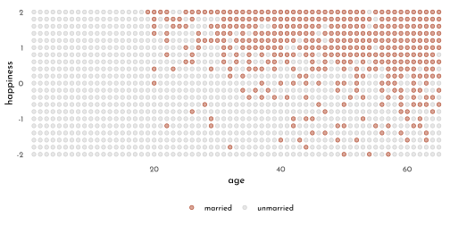

---
output:
  html_document:
  theme: yeti
pdf_document: default
editor_options: 
  chunk_output_type: console
---

# Rethinking: Chapter 6

**The Haunted DAG & Causal Terror**


by [Richard McElreath](https://xcelab.net/rm/statistical-rethinking/), building on the Summaries by [Solomon Kurz](https://bookdown.org/content/4857/) and [Jake Thompson](https://sr2-solutions.wjakethompson.com/linear-models.html).

Simulating section-distortion (*Berkson's paradox*)


```r
n <- 200
p <- .1

data_sim <- tibble(newsworthy = rnorm(n),
       trustworthy = rnorm(n),
       score = newsworthy + trustworthy,
       treshold = quantile(score, 1 - p),
       selected = score >= treshold)

data_sim %>% 
  ggplot(aes(x = newsworthy, y = trustworthy, color = selected)) +
  geom_smooth(data = data_sim %>% filter(selected),
              method = "lm", se = FALSE, fullrange = TRUE, size = .5) +
  geom_point(aes(fill = after_scale(clr_alpha(color))), shape = 21, size = 2.5) +
  scale_color_manual(values = c(`TRUE` = clr1, `FALSE` = clr0d))+
  coord_cartesian(xlim = range(data_sim$newsworthy) * 1.05,
                  ylim = range(data_sim$trustworthy) * 1.05,
                  expand = 0) +
  coord_equal(ylim = range(data_sim$trustworthy) * 1.05)
```


## Multicolliniarity

Simulating multicollinear legs 


```r
library(rethinking)
n <- 100
set.seed(909)
data_legs <- tibble(
  height = rnorm(n = n, mean = 10, sd = 2),
  leg_proportion = runif(n, min = 0.4, max = 0.5),
  left_leg = leg_proportion * height + rnorm(n, 0, .02),
  right_leg = leg_proportion * height + rnorm(n, 0, .02),
)

model_legs_multicollinear <- quap(
  flist = alist(
    height ~ dnorm(mu, sigma),
    mu <- alpha + beta_left * left_leg + beta_right * right_leg,
    alpha ~ dnorm(10, 100),
    beta_left ~ dnorm(2, 10),
    beta_right ~ dnorm(2, 10),
    sigma ~ dexp(1)
  ),
  data = data_legs
)

precis(model_legs_multicollinear) %>% 
  as.matrix() %>% 
  round(digits = 2) %>% 
  knitr::kable()
```


|           | mean|   sd|  5.5%| 94.5%|
|:----------|----:|----:|-----:|-----:|
|alpha      | 0.98| 0.28|  0.53|  1.44|
|beta_left  | 0.21| 2.53| -3.83|  4.25|
|beta_right | 1.78| 2.53| -2.26|  5.83|
|sigma      | 0.62| 0.04|  0.55|  0.69|

```r
precis(model_legs_multicollinear, depth = 2) %>% 
  as_tibble_rn() %>%
  ggplot(aes(y = param)) +
  geom_vline(xintercept = 0, lty = 3, color = rgb(0,0,0,.6)) +
  geom_linerange(aes(xmin = `5.5%`,
                     xmax =`94.5%`), color = clr0d) +
  geom_point(aes(x = mean),
             shape = 21, size = 3 ,
             color = clr0d, fill = clr0) +
  scale_y_discrete(limits = c("sigma", "beta_right", "beta_left", "alpha")) +
  theme(axis.title.y = element_blank())
```


```r
leg_posterior_samples <- extract.samples(model_legs_multicollinear) %>% as_tibble()

p_cor <- leg_posterior_samples %>% 
  ggplot(aes(x = beta_right, y = beta_left)) +
  geom_point(color = clr0d, fill = clr0, shape = 21, alpha = .5)

p_sum <- leg_posterior_samples %>% 
  ggplot(aes(x = beta_right + beta_left)) +
  geom_vline(xintercept = 1/mean(data_legs$leg_proportion), color = clr_dark, linetype = 3) +
  geom_density(color = clr0d, fill = clr0, alpha = .5, adjust = .4)

p_cor + p_sum
```


Milk example


```r
data(milk)
data_milk <- milk %>% 
  as_tibble() %>% 
  drop_na(kcal.per.g:perc.lactose) %>%
  mutate(across(where(is.double), standardize,
                .names = "{str_remove(str_remove(.col,'perc.'),'.per.g')}_std"))
```

Model *fat only*


```r
model_milk_fat <- quap(
  flist = alist(
    kcal_std ~ dnorm(mu, sigma),
    mu <- alpha + beta_fat * fat_std,
    alpha ~ dnorm(0,.2),
    beta_fat ~ dnorm(0,.5),
    sigma ~ dexp(1)
  ),
  data = data_milk
)

precis(model_milk_fat) %>% 
  as.matrix() %>% 
  round(digits = 2) %>% 
  knitr::kable()
```


|         | mean|   sd|  5.5%| 94.5%|
|:--------|----:|----:|-----:|-----:|
|alpha    | 0.00| 0.08| -0.12|  0.12|
|beta_fat | 0.86| 0.08|  0.73|  1.00|
|sigma    | 0.45| 0.06|  0.36|  0.54|

Model *lactose only*


```r
model_milk_lactose <- quap(
  flist = alist(
    kcal_std ~ dnorm(mu, sigma),
    mu <- alpha + beta_lactose * lactose_std,
    alpha ~ dnorm(0,.2),
    beta_lactose ~ dnorm(0,.5),
    sigma ~ dexp(1)
  ),
  data = data_milk
)

precis(model_milk_lactose) %>% 
  as.matrix() %>% 
  round(digits = 2) %>% 
  knitr::kable()
```


|             |  mean|   sd|  5.5%| 94.5%|
|:------------|-----:|----:|-----:|-----:|
|alpha        |  0.00| 0.07| -0.11|  0.11|
|beta_lactose | -0.90| 0.07| -1.02| -0.79|
|sigma        |  0.38| 0.05|  0.30|  0.46|

Multicollinear model


```r
model_milk_multicollinear <- quap(
  flist = alist(
    kcal_std ~ dnorm(mu, sigma),
    mu <- alpha + beta_fat * fat_std + beta_lactose * lactose_std,
    alpha ~ dnorm(0,.2),
    beta_fat ~ dnorm(0,.5),
    beta_lactose ~ dnorm(0,.5),
    sigma ~ dexp(1)
  ),
  data = data_milk
)

precis(model_milk_multicollinear) %>% 
  as.matrix() %>% 
  round(digits = 2) %>% 
  knitr::kable()
```


|             |  mean|   sd|  5.5%| 94.5%|
|:------------|-----:|----:|-----:|-----:|
|alpha        |  0.00| 0.07| -0.11|  0.11|
|beta_fat     |  0.24| 0.18| -0.05|  0.54|
|beta_lactose | -0.68| 0.18| -0.97| -0.38|
|sigma        |  0.38| 0.05|  0.30|  0.46|


```r
data_milk %>% 
  dplyr::select(kcal_std, fat_std, lactose_std) %>% 
  ggpairs(
    lower = list(continuous = wrap(ggally_points, colour = clr0d, size = 1.5, alpha = .7)),
    diag = list(continuous = wrap("densityDiag", fill = fll0, color = clr0d, adjust = .9)),
    upper = list(continuous = wrap(ggally_cor, size = 5, color = "black", family = "Josefin sans"))
  )
```


```r
dagify(K ~ L + F,
       L ~ D,
       F ~ D,
       coords = tibble(name = c("K", "L", "F", "D"),
                     x = c(.5, 0, 1, .5),
                     y = c(.6, 1, 1, 1))) %>%
  fortify() %>% 
  mutate(stage = if_else(name == "K", "response",
                         if_else(name %in% c("L", "F"),
                                 "predictor", "confounds"))) %>% 
  plot_dag(clr_in = clr3) + 
  scale_y_continuous(limits = c(.55, 1.05)) +
  scale_x_continuous(limits = c(-.05, 1.05)) +
  coord_equal()
```


Simulating Multicollinearity


```r
simluate_collinearity <- function(seed = 42, r = .9, data = data_milk ){
  data <- data %>% 
    mutate(x = rnorm(n = nrow(cur_data()),
                     mean = `perc.fat` * r,
                     sd = sqrt((1 - r ^ 2) * var(`perc.fat`))))
  mod <- lm(kcal.per.g ~ perc.fat + x, data = data)
  sqrt( diag( vcov(mod) ))[2]
}

# reapeat_simulation <- function(r = .9, n = 100){
#   stddev <- replicate( n, simluate_collinearity(r))
#   tibble(r = r, stddev_mean = mean(stddev), stddev_sd = sd(stddev))
# }

n_seed <- 100
n_rho  <- 60

simulation_means <- crossing(seed = 1:n_seed,
                             rho  = seq(from = 0, to = .99, length.out = n_rho))  %>% 
  mutate(parameter_sd = purrr::map2_dbl(seed, rho, simluate_collinearity)) %>% 
  group_by(rho) %>% 
  summarise(mean = mean(parameter_sd),
            ll   = quantile(parameter_sd, prob = .025),
            ul   = quantile(parameter_sd, prob = .975))

simulation_means %>%
  ggplot(aes(x = rho, y = mean, ymin = ll, ymax = ul)) +
  geom_smooth(stat = 'identity', size = .6, color = clr0d, fill = fll0)
```


## Post-treatment bias

Simulating fungus data


```r
n <- 100
set.seed(71)
data_fungus <- tibble(
  h_0 = rnorm(n, 10, 2),
  treatment = rep(0:1, each = n/2),
  fungus = rbinom(n = n, size = 1, prob = .5 - treatment * .4 ),
  h_1 = h_0 + rnorm(n, 5 - 3 * fungus)
)

precis(data_fungus) %>% 
  knit_precis()
```


|param     |  mean|   sd|  5.5%| 94.5%|histogram    |
|:---------|-----:|----:|-----:|-----:|:------------|
|h_0       |  9.96| 2.10|  6.57| 13.08|▁▂▂▂▇▃▂▃▁▁▁▁ |
|treatment |  0.50| 0.50|  0.00|  1.00|▇▁▁▁▁▁▁▁▁▇   |
|fungus    |  0.23| 0.42|  0.00|  1.00|▇▁▁▁▁▁▁▁▁▂   |
|h_1       | 14.40| 2.69| 10.62| 17.93|▁▁▃▇▇▇▁▁     |

$$
\begin{array}{rclr}
h_{1,i} & \sim & Normal( \mu_i, \sigma) & \textrm{[likelihood]}\\
\mu_i & = & h_{0,i} \times p & \textrm{[linear model]}\\
\end{array}
$$

selecting a prior


```r
precis(tibble(sim_p = rlnorm(1e4, 0, .25))) %>% 
  knit_precis()
```


|param | mean|   sd| 5.5%| 94.5%|histogram    |
|:-----|----:|----:|----:|-----:|:------------|
|sim_p | 1.04| 0.26| 0.67|   1.5|▁▁▃▇▇▃▁▁▁▁▁▁ |

$\rightarrow$ the main mass of the prior is between 40% shrinkage and 50% growth.

Model *without treatment*


```r
model_fungus_no_treatment <- quap(
  flist = alist(
    h_1 ~ dnorm( mu, sigma ),
    mu <- h_0 * p,
    p ~ dlnorm( 0, .25 ),
    sigma ~ dexp( 1 )
  ),
  data = data_fungus
)

precis(model_fungus_no_treatment) %>% 
  knit_precis()
```


|param | mean|   sd| 5.5%| 94.5%|
|:-----|----:|----:|----:|-----:|
|p     | 1.43| 0.02| 1.40|  1.45|
|sigma | 1.79| 0.13| 1.59|  1.99|


Model *with treatment* and *fungus* (post-treatment variable)

$$
\begin{array}{rclr}
h_{1,i} & \sim & Normal( \mu_i, \sigma) & \textrm{[likelihood]}\\
\mu_i & = & h_{0,i} \times p & \textrm{[linear model]}\\
p & = & \alpha + \beta_{T} T_{i} + \beta_{F} F_{i} & \textrm{[linear model]}\\
\alpha & \sim & Log-Normal(0, 0.25) & \textrm{[$\alpha$ prior]}\\
\beta_{T} & \sim & Normal(0, 0.5) & \textrm{[$\beta_{T}$ prior]}\\
\beta_{F} & \sim & Normal(0, 0.5) & \textrm{[$\beta_{F}$ prior]}\\
\sigma & \sim & Exponential(1) & \textrm{[$\sigma$ prior]}
\end{array}
$$


```r
model_fungus_post_treatment <- quap(
  flist = alist(
    h_1 ~ dnorm( mu, sigma ),
    mu <- h_0 * p,
    p <- alpha + beta_treatment * treatment + beta_fungus * fungus,
    alpha ~ dlnorm( 0, .2 ),
    beta_treatment ~ dnorm(0,.5),
    beta_fungus ~ dnorm(0,.5),
    sigma ~ dexp( 1 )
  ),
  data = data_fungus
)

precis(model_fungus_post_treatment) %>% 
  knit_precis()
```


|param          |  mean|   sd|  5.5%| 94.5%|
|:--------------|-----:|----:|-----:|-----:|
|alpha          |  1.48| 0.02|  1.44|  1.52|
|beta_treatment |  0.00| 0.03| -0.05|  0.05|
|beta_fungus    | -0.27| 0.04| -0.33| -0.21|
|sigma          |  1.41| 0.10|  1.25|  1.57|

Model *with treatment* but without *fungus*


```r
model_fungus_only_treatment <- quap(
  flist = alist(
    h_1 ~ dnorm( mu, sigma ),
    mu <- h_0 * p,
    p <- a + beta_treatment * treatment,
    a ~ dlnorm( 0, .25 ),
    beta_treatment ~ dnorm(0,.5),
    sigma ~ dexp( 1 )
  ),
  data = data_fungus
)

precis(model_fungus_only_treatment) %>% 
  knit_precis()
```


|param          | mean|   sd| 5.5%| 94.5%|
|:--------------|----:|----:|----:|-----:|
|a              | 1.38| 0.03| 1.34|  1.42|
|beta_treatment | 0.08| 0.03| 0.03|  0.14|
|sigma          | 1.75| 0.12| 1.55|  1.94|

d-separation


```r
dagify("H_1" ~ H_0 + F,
       F ~ T,
       coords = tibble(name = c("H_0", "H_1", "F", "T"),
                     x = c(0, .5, .75, 1),
                     y = c(0, 0, 0, 0))) %>%
  fortify() %>% 
  mutate(stage = if_else(name == "H_1", "response",
                         if_else(name %in% c("H_0", "F", "T"),
                                 "predictor", "confounds")),
         name = str_replace(name, "([A-Z])_([0-9])", "\\1\\[\\2\\]")) %>% 
  plot_dag(clr_in = clr3) + 
  scale_y_continuous(limits = c(-.05, .05)) +
  scale_x_continuous(limits = c(-.05, 1.05)) +
  coord_equal()
```


*Directional Separation* of `H_1` and `T` occurs after conditioning on `F`:


```r
library(dagitty)
impliedConditionalIndependencies("dag{ H_0 -> H_1 <- F <- T}")
```

```
#> F _||_ H_0
#> H_0 _||_ T
#> H_1 _||_ T | F
```


```r
dagify(H_1 ~ H_0 + M,
       F ~ T,
       F ~ M,
       coords = tibble(name = c("H_0", "H_1", "M" , "F", "T"),
                     x = c(0, .5, .75,  1, 1.5),
                     y = c(1, 1, .7, 1, 1))) %>%
  fortify() %>% 
  mutate(stage = if_else(name == "H_1", "response",
                         if_else(name %in% c("H_0", "F", "T"),
                                 "predictor", "confounds")),
         name = str_replace(name, "([A-Z])_([0-9])", "\\1\\[\\2\\]")) %>% 
  plot_dag(clr_in = clr3) + 
  scale_y_continuous(limits = c(.65, 1.05)) +
  scale_x_continuous(limits = c(-.05, 1.55)) +
  coord_equal()
```


```r
n <- 1e4
set.seed(71)
data_moisture <- tibble(
  h_0 = rnorm(n, 10, 2),
  treatment = rep(0:1, each = n/2),
  moisture = rbern(n),
  fungus = rbinom(n = n, size = 1, prob = .5 - treatment * .4 + moisture * .4),
  h_1 = h_0 + rnorm(n, 5 + 3 * moisture)
)

precis(data_moisture) %>% 
  knit_precis()
```


|param     |  mean|   sd|  5.5%| 94.5%|histogram  |
|:---------|-----:|----:|-----:|-----:|:----------|
|h_0       | 10.04| 2.01|  6.81| 13.22|▁▁▁▂▇▇▂▁▁  |
|treatment |  0.50| 0.50|  0.00|  1.00|▇▁▁▁▁▁▁▁▁▇ |
|moisture  |  0.50| 0.50|  0.00|  1.00|▇▁▁▁▁▁▁▁▁▇ |
|fungus    |  0.50| 0.50|  0.00|  1.00|▇▁▁▁▁▁▁▁▁▇ |
|h_1       | 16.55| 2.69| 12.22| 20.84|▁▁▁▃▇▇▅▂▁▁ |

Moisture-Model *with treatment* and *fungus* (post-treatment variable)


```r
model_moisture_post_treatment <- quap(
  flist = alist(
    h_1 ~ dnorm( mu, sigma ),
    mu <- h_0 * p,
    p <- alpha + beta_treatment * treatment + beta_fungus * fungus,
    alpha ~ dlnorm( 0, .2 ),
    beta_treatment ~ dnorm(0,.5),
    beta_fungus ~ dnorm(0,.5),
    sigma ~ dexp( 1 )
  ),
  data = data_moisture
)

precis(model_moisture_post_treatment) %>% 
  knit_precis()
```


|param          | mean|   sd| 5.5%| 94.5%|
|:--------------|----:|----:|----:|-----:|
|alpha          | 1.53| 0.00| 1.52|  1.54|
|beta_treatment | 0.05| 0.00| 0.05|  0.06|
|beta_fungus    | 0.13| 0.00| 0.12|  0.14|
|sigma          | 2.13| 0.02| 2.11|  2.16|

Moisture-Model *with treatment* but without *fungus* 


```r
model_moisture_only_treatment <- quap(
  flist = alist(
    h_1 ~ dnorm( mu, sigma ),
    mu <- h_0 * p,
    p <- a + beta_treatment * treatment,
    a ~ dlnorm( 0, .25 ),
    beta_treatment ~ dnorm(0,.5),
    sigma ~ dexp( 1 )
  ),
  data = data_moisture
)

precis(model_moisture_only_treatment) %>% 
  knit_precis()
```


|param          | mean|   sd| 5.5%| 94.5%|
|:--------------|----:|----:|----:|-----:|
|a              | 1.62| 0.00| 1.62|  1.63|
|beta_treatment | 0.00| 0.00| 0.00|  0.01|
|sigma          | 2.22| 0.02| 2.19|  2.25|

## Collider Bias


```r
# data_happy <- sim_happiness(seed = 1977, N_years = 66) %>%
#   as_tibble()

progress_year <- function(data, year, max_age = 65, n_births = 20, aom = 18){
  new_cohort <- tibble(
    age = 1,
    married = as.integer(0),
    happiness = seq(from = -2, to = 2, length.out = n_births),
    year_of_birth = year)
  
  data %>% 
    mutate(age = age + 1) %>% 
    bind_rows(., new_cohort) %>% 
    mutate(married = if_else(age >= aom & married == 0,
                             rbern(n(), inv_logit(happiness - 4)),
                             married )) %>% 
    filter(age <= max_age)
}

sim_tidy <- function(seed = 1977, n_years = 1000, max_age = 65, n_births = 20, aom = 18){
  set.seed(seed)
  
  empty_tibble <- tibble(age = double(),
       married = integer(),
       happiness = double())
  
  1:n_years %>% 
    reduce(.f = progress_year,
           .init = empty_tibble,
           max_age = max_age, n_births = n_births, aom = aom)
}

data_married <- sim_tidy(seed = 1977, n_years = 65, n_births = 21)

data_married %>% 
  mutate(married = factor(married,
                          labels = c("unmarried", "married"))) %>% 
  
  ggplot(aes(x = age, y = happiness, color = married)) +
  geom_point(size = 1.75, shape = 21, 
             aes(fill = after_scale(clr_alpha(color)))) +
  scale_color_manual(NULL, values = c(married = clr2, unmarried = clr0d)) +
  scale_x_continuous(expand = c(.015, .015)) +
  theme(panel.grid = element_blank(),
        legend.position = "bottom")
```



```r
data_married_adults <- data_married %>% 
  filter(age >= 18) %>% 
  mutate(age_trans = (age - 18)/ diff(c(18, 65)),
         married_idx = married + 1L)

model_happy_married <- quap(
  flist = alist(
    happiness ~ dnorm(mu, sigma),
    mu <- alpha[married_idx] + beta_age * age_trans,
    alpha[married_idx] ~ dnorm( 0, 1 ),
    beta_age ~ dnorm( 0, 2 ),
    sigma ~ dexp( 1 )
  ),
  data = data_married_adults
)

precis(model_happy_married, depth = 2) %>% 
  knit_precis()
```


|param    |  mean|   sd|  5.5%| 94.5%|
|:--------|-----:|----:|-----:|-----:|
|alpha[1] | -0.24| 0.06| -0.34| -0.14|
|alpha[2] |  1.20| 0.08|  1.07|  1.33|
|beta_age | -0.70| 0.11| -0.88| -0.53|
|sigma    |  1.00| 0.02|  0.96|  1.04|

```r
model_happy <- quap(
  flist = alist(
    happiness ~ dnorm(mu, sigma),
    mu <- alpha + beta_age * age_trans,
    alpha ~ dnorm( 0, 1 ),
    beta_age ~ dnorm( 0, 2 ),
    sigma ~ dexp( 1 )
  ),
  data = data_married_adults
)

precis(model_happy, depth = 2) %>% 
  knit_precis()
```


|param    | mean|   sd|  5.5%| 94.5%|
|:--------|----:|----:|-----:|-----:|
|alpha    | 0.00| 0.07| -0.12|  0.12|
|beta_age | 0.00| 0.13| -0.21|  0.21|
|sigma    | 1.21| 0.03|  1.17|  1.25|

### The haunted DAG

Education example (including Grandparents, Parents, Children and the *unobserved* Neighborhood)


```r
p_dag1 <- dagify(C ~ P + G,
       P ~ G,
       coords = tibble(name = c("G", "P", "C"),
                     x = c(0, 1.5, 1.5),
                     y = c(1, 1, 0))) %>%
  fortify() %>% 
  mutate(stage = if_else(name == "C", "response",
                         if_else(name %in% c("P", "G"),
                                 "predictor", "confounds"))) %>% 
  plot_dag(clr_in = clr3) + 
  scale_y_continuous(limits = c(-.05, 1.05)) +
  scale_x_continuous(limits = c(-.05, 1.55)) +
  coord_equal()

p_dag2 <- dagify(C ~ P + G + U,
       P ~ G + U,
       coords = tibble(name = c("G", "P", "C", "U"),
                     x = c(0, 1.5, 1.5, 2),
                     y = c(1, 1, 0, .5))) %>%
  fortify() %>% 
  mutate(stage = if_else(name == "C", "response",
                         if_else(name %in% c("P", "G"),
                                 "predictor", "confounds"))) %>% 
  plot_dag(clr_in = clr3) + 
  scale_y_continuous(limits = c(-.05, 1.05)) +
  scale_x_continuous(limits = c(-.05, 2.05)) +
  coord_equal()

p_dag1 + p_dag2 + plot_annotation(tag_levels = "a") & theme(plot.tag = element_text(family = fnt_sel))
```


```r
n <- 200
beta_gp <- 1 # direct effect of G -> P
beta_gc <- 0 # direct effect of G -> C
beta_pc <- 1 # direct effect of P -> C
beta_U <- 2  # direct effect of U on both C and P

set.seed(1)
data_education <- tibble(
  unobserved = 2 * rbern(n, .5) - 1,
  grandparents = rnorm( n ),
  parents = rnorm( n, beta_gp * grandparents + beta_U * unobserved),
  children = rnorm( n, beta_gc * grandparents + beta_pc * parents + beta_U * unobserved)
)

model_education <- quap(
  flist = alist(
    children ~ dnorm(mu, sigma),
    mu <- alpha + beta_pc * parents + beta_gc * grandparents,
    alpha ~ dnorm( 0, 1 ),
    c( beta_pc, beta_gc) ~ dnorm( 0, 1 ),
    sigma ~ dexp(1)
  ),
  data = data_education
)

precis(model_education) %>% 
  knit_precis()
```


|param   |  mean|   sd|  5.5%| 94.5%|
|:-------|-----:|----:|-----:|-----:|
|alpha   | -0.12| 0.10| -0.28|  0.04|
|beta_pc |  1.79| 0.04|  1.72|  1.86|
|beta_gc | -0.84| 0.11| -1.01| -0.67|
|sigma   |  1.41| 0.07|  1.30|  1.52|


```r
data_education_plot <- data_education %>% 
  mutate(across(grandparents:children,
                standardize,
                .names = "{.col}_std")) %>%
  mutate(parents_inner = between(parents_std,
                                 left = quantile(parents_std, probs = .45),
                                 right = quantile(parents_std, probs = .60)))
data_education_plot %>% 
  ggplot(aes(x = grandparents_std, y = children_std)) +
  geom_smooth(data = data_education_plot %>% filter(parents_inner),
              method = "lm", se = FALSE, size = .5, color = clr_dark, fullrange = TRUE) +
  geom_point(aes(color = factor(unobserved),
                 fill = after_scale(clr_alpha(color,.8)),
                 shape = parents_inner),
             size = 2.5) +
  scale_color_manual(values = c(clr0d, clr2), guide = "none") +
  scale_shape_manual(values = c(`FALSE` = 1, `TRUE` = 21), guide = "none") +
  coord_equal()
```


```r
model_education_resolved <- quap(
  flist = alist(
    children ~ dnorm(mu, sigma),
    mu <- alpha + beta_pc * parents + beta_gc * grandparents + beta_u * unobserved,
    alpha ~ dnorm( 0, 1 ),
    c( beta_pc, beta_gc, beta_u ) ~ dnorm( 0, 1 ),
    sigma ~ dexp(1)
  ),
  data = data_education
)

precis(model_education_resolved) %>% 
  knit_precis()
```


|param   |  mean|   sd|  5.5%| 94.5%|
|:-------|-----:|----:|-----:|-----:|
|alpha   | -0.12| 0.07| -0.24| -0.01|
|beta_pc |  1.01| 0.07|  0.91|  1.12|
|beta_gc | -0.04| 0.10| -0.20|  0.11|
|beta_u  |  2.00| 0.15|  1.76|  2.23|
|sigma   |  1.02| 0.05|  0.94|  1.10|

### Shutting the Backdoor

The four elements that construct DAGs:


```r
p_dag1 <- dagify(
  X ~ Z,
  Y ~ Z,
  coords = tibble(name = c("X", "Y", "Z"),
                  x = c(0, 1, .5),
                  y = c(1, 1, 0))) %>%
  fortify() %>% 
  mutate(stage = if_else(name == "", "response",
                         if_else(name %in% c("X", "Y", "Z"),
                                 "predictor", "confounds"))) %>% 
  plot_dag(clr_in = clr3) + 
  ggtitle("Fork")

p_dag2 <- dagify(
  Z ~ X,
  Y ~ Z,
  coords = tibble(name = c("X", "Y", "Z"),
                  x = c(0, 1, .5),
                  y = c(1, 0, .5))) %>%
  fortify() %>% 
  mutate(stage = if_else(name == "", "response",
                         if_else(name %in% c("X", "Y", "Z"),
                                 "predictor", "confounds"))) %>% 
  plot_dag(clr_in = clr3) + 
  ggtitle("Pipe")

p_dag3 <- dagify(
  Z ~ X + Y,
  coords = tibble(name = c("X", "Y", "Z"),
                  x = c(0, 1, .5),
                  y = c(0, 0 , 1))) %>%
  fortify() %>% 
  mutate(stage = if_else(name == "", "response",
                         if_else(name %in% c("X", "Y", "Z"),
                                 "predictor", "confounds"))) %>% 
  plot_dag(clr_in = clr3) + 
  ggtitle("Collider")

p_dag4 <- dagify(
  Z ~ X + Y,
  D ~ Z,
  coords = tibble(name = c("X", "Y", "Z", "D"),
                  x = c(0, 1, .5, .5),
                  y = c(0, 0 , 1, 0))) %>%
  fortify() %>% 
  mutate(stage = if_else(name == "", "response",
                         if_else(name %in% c("X", "Y", "Z", "D"),
                                 "predictor", "confounds"))) %>% 
  plot_dag(clr_in = clr3) + 
  ggtitle("Collider")

p_dag1 +
  p_dag2 +
  p_dag3 +
  p_dag4  +
  plot_annotation(tag_levels = "a") +
  plot_layout(nrow = 1) &
  coord_fixed(ratio = .6) &
  scale_y_continuous(limits = c(-.1, 1.1)) &
  scale_x_continuous(limits = c(-.1, 1.1)) &
  theme(plot.title = element_text(hjust = .5, family = fnt_sel),
        plot.tag = element_text(family = fnt_sel))
```


- **a. Fork**: $X \perp \!\!\! \perp Y | Z$
- **b. Pipe**: $X \perp \!\!\! \perp Y | Z$
- **c. Collider**: $X \perp \!\!\! \perp Y$, but $X \not\!\perp\!\!\!\perp Y | Z$
- **d. Descendant**: $X \perp \!\!\! \perp Y$, but $X \not\!\perp\!\!\!\perp Y | Z$ (to a lesser extent)

## Homework

**E1**

**E2**

**E3**

**E4**

**M1**

**M2**

**M3**

**H1**

**H2**

**H3**

**H4**

**H5**

**H6**

**H7**

## {brms} section

## pymc3 section

---

<div id="myModal" class="modal">
  <span class="close">&times;</span>
  
  <div id="caption"></div>
</div>

<script src="./js/zoom.js"></script>
