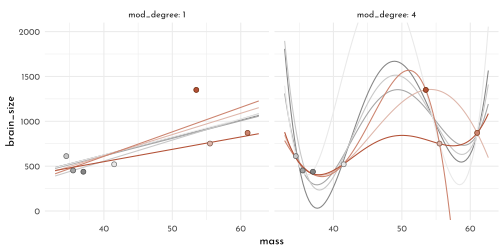
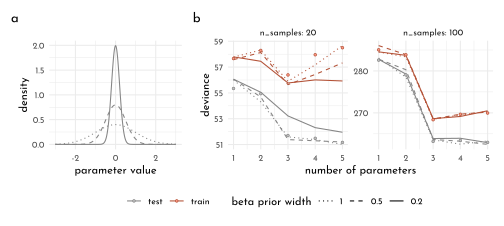
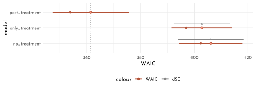
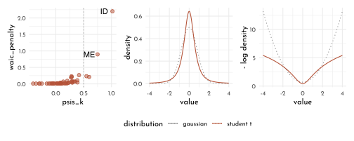
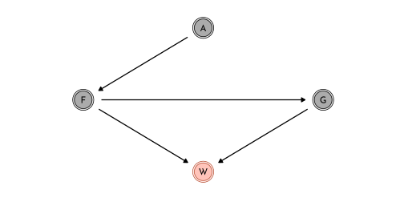
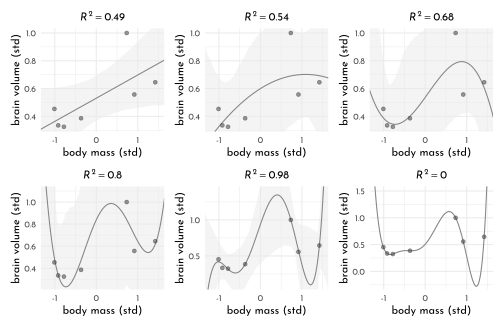
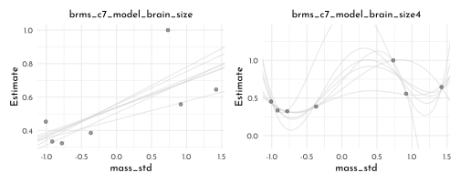

---
output:
  html_document:
  theme: yeti
pdf_document: default
editor_options: 
  chunk_output_type: console
---

# Rethinking: Chapter 7

**Ulysses' Compass**


by [Richard McElreath](https://xcelab.net/rm/statistical-rethinking/), building on the Summaries by [Solomon Kurz](https://bookdown.org/content/4857/) and [Jake Thompson](https://sr2-solutions.wjakethompson.com/linear-models.html).

<div class="figure" style="text-align: center">

<p class="caption">(\#fig:unnamed-chunk-1)<i>Between Scylla and Charybdis</i> by <a href='https://commons.wikimedia.org/wiki/File:Adolf_Hiremy-Hirschl_-_Zwischen_Skylla_und_Charybdis.jpg'>Adolf Hirémy-Hirschl</a> (1910). </p>
</div>

## The Problem with Parameters


```r
library(rethinking)
data_brainsize <- tibble(
  species = c("afarensis", "africanus", "habilis", "boisei", "rudolfensis", "ergaster", "sapiens"), 
  brain_size = c(438, 452, 612, 521, 752, 871, 1350), 
  mass = c(37.0, 35.5, 34.5, 41.5, 55.5, 61.0, 53.5)) %>% 
  mutate(brain_size_scl = brain_size/ max(brain_size),
         mass_std = standardize(mass))

data_brainsize %>% 
  ggplot(aes(x = mass, y = brain_size)) +
  geom_point(shape = 21, color = clr2, fill = fll2, size = 3) +
  ggrepel::geom_text_repel(aes(label = species),
                           force = 30, min.segment.length = unit(.1, "npc"),
                           family = fnt_sel, fontface = "italic") +
  coord_fixed(ratio = .03)
```


### The burial of R<sup>2</sup>

$$
R^{2} = \frac{var(outcome) - var(residuals)}{var(outcome)} = 1 - \frac{var(residuals)}{var(outcome)}
$$

#### Linear Model

$$
\begin{array}{rclr}
b_{i} & \sim & Normal( \mu_i, \sigma) & \textrm{[likelihood]}\\
\mu_i & = & \alpha + \beta_{m} m_{i} & \textrm{[linear model]}\\
\alpha & \sim & Normal(0.5, 1) & \textrm{[$\alpha$ prior]}\\
\beta_{m} & \sim & Normal(0, 10) & \textrm{[$\beta_{T}$ prior]}\\
\sigma & \sim & Log-Normal(0, 1) & \textrm{[$\sigma$ prior]}
\end{array}
$$


```r
model_brain_size <- quap(
  flist = alist(
    brain_size_scl ~ dnorm(mu, exp(log_sigma)),
    mu <- alpha + beta_m * mass_std,
    alpha ~ dnorm(0.5, 1),
    beta_m ~ dnorm(0, 10),
    log_sigma ~ dnorm( 0, 1 )
  ),
  data = data_brainsize
)

precis(model_brain_size) %>% 
  knit_precis()
```


|param     |  mean|   sd|  5.5%| 94.5%|
|:---------|-----:|----:|-----:|-----:|
|alpha     |  0.53| 0.07|  0.42|  0.64|
|beta_m    |  0.17| 0.07|  0.05|  0.29|
|log_sigma | -1.71| 0.29| -2.18| -1.24|


```r
extract_r2 <- function(quap_fit, decimals = 5){
  data <- sim(quap_fit) %>% 
  as_tibble() %>% 
  set_names(nm = data_brainsize$species) %>% 
  summarise(across(everything(), mean, .names = "{.col}")) %>% 
  pivot_longer(everything(), names_to = "species", values_to = "mean_brainsize") %>% 
  mutate(brain_size_scl = data_brainsize$brain_size_scl,
         diff = mean_brainsize - brain_size_scl)

  round(1 - var2(data$diff) / var2(data$brain_size_scl), digits = decimals)
}

set.seed(12)
extract_r2(model_brain_size)
```

```
#> [1] 0.47746
```

### Higher order polynomials

$$
\begin{array}{rclcr} 
b_i & {\sim} & Normal(\mu_i, \sigma) & &\textrm{[likelihood]}\\
\mu_i & = & \alpha + \beta_{1} m_{i} + \beta_{2} m_{i}^2 & &\textrm{[linear model]}\\
\alpha & \sim & Normal(0.5, 1) & & \textrm{[$\alpha$ prior]}\\
\beta_{j} & \sim & Normal(0, 10) & \textrm{for}~j = 1..2 & \textrm{[$\beta$ prior]}\\
\sigma & \sim & Log-Normal(0, 1) & &\textrm{[$\sigma$ prior]}
\end{array}
$$


```r
model_brain_size2 <- quap(
  flist = alist(
    brain_size_scl ~ dnorm(mu, exp(log_sigma)),
    mu <- alpha + 
      beta_m[1] * mass_std + 
      beta_m[2] * mass_std ^ 2,
    alpha ~ dnorm(0.5, 1),
    beta_m ~ dnorm(0, 10),
    log_sigma ~ dnorm( 0, 1 )
  ),
  data = data_brainsize,
  start = list(beta_m = rep(0, 2))
)

model_brain_size3 <- quap(
  flist = alist(
    brain_size_scl ~ dnorm(mu, exp(log_sigma)),
    mu <- alpha + 
      beta_m[1] * mass_std + 
      beta_m[2] * mass_std ^ 2 + 
      beta_m[3] * mass_std ^ 3,
    alpha ~ dnorm(0.5, 1),
    beta_m ~ dnorm(0, 10),
    log_sigma ~ dnorm( 0, 1 )
  ),
  data = data_brainsize,
  start = list(beta_m = rep(0, 3))
)

model_brain_size4 <- quap(
  flist = alist(
    brain_size_scl ~ dnorm(mu, exp(log_sigma)),
    mu <- alpha + 
      beta_m[1] * mass_std + 
      beta_m[2] * mass_std ^ 2 + 
      beta_m[3] * mass_std ^ 3 + 
      beta_m[4] * mass_std ^ 4,
    alpha ~ dnorm(0.5, 1),
    beta_m ~ dnorm(0, 10),
    log_sigma ~ dnorm( 0, 1 )
  ),
  data = data_brainsize,
  start = list(beta_m = rep(0, 4))
)

model_brain_size5 <- quap(
  flist = alist(
    brain_size_scl ~ dnorm(mu, exp(log_sigma)),
    mu <- alpha + 
      beta_m[1] * mass_std + 
      beta_m[2] * mass_std ^ 2 + 
      beta_m[3] * mass_std ^ 3 + 
      beta_m[4] * mass_std ^ 4 + 
      beta_m[5] * mass_std ^ 5,
    alpha ~ dnorm(0.5, 1),
    beta_m ~ dnorm(0, 10),
    log_sigma ~ dnorm( 0, 1 )
  ),
  data = data_brainsize,
  start = list(beta_m = rep(0, 5))
)

model_brain_size6 <- quap(
  flist = alist(
    brain_size_scl ~ dnorm(mu, exp(log_sigma)),
    mu <- alpha + 
      beta_m[1] * mass_std + 
      beta_m[2] * mass_std ^ 2 + 
      beta_m[3] * mass_std ^ 3 + 
      beta_m[4] * mass_std ^ 4 + 
      beta_m[5] * mass_std ^ 5 + 
      beta_m[6] * mass_std ^ 6,
    alpha ~ dnorm(0.5, 1),
    beta_m ~ dnorm(0, 10),
    log_sigma ~ dnorm( 0, 1 )
  ),
  data = data_brainsize,
  start = list(beta_m = rep(0, 6))
)
```


```r
mass_seq <- seq( from = min(data_brainsize$mass_std) - .15,
                 to = max(data_brainsize$mass_std) + .15,
                 length.out = 101)

plot_poly <- function(mod, ylim){
  model_posterior_samples <- extract.samples(mod) %>% 
    as.data.frame() %>% 
    as_tibble()
  
  model_posterior_prediction_samples <- link(mod, data = tibble(mass_std = mass_seq)) %>% 
    as_tibble() %>% 
    set_names(nm = mass_seq) %>% 
    pivot_longer(cols = everything(), names_to = "mass_std", values_to = "brain_size_scl") %>% 
    mutate(mass_std = as.numeric(mass_std)) 
  
  model_posterior_prediction_pi <- model_posterior_prediction_samples %>% 
    group_by(mass_std) %>% 
    summarise(mean = mean(brain_size_scl),
              PI_lower = PI(brain_size_scl)[1],
              PI_upper = PI(brain_size_scl)[2]) %>% 
    ungroup()
  
  p <- ggplot(mapping = aes(x = mass_std * sd(data_brainsize$mass) + mean(data_brainsize$mass))) +
    geom_smooth(data = model_posterior_prediction_pi, stat = "identity",
                aes(y = mean * max(data_brainsize$brain_size),
                    ymin = PI_lower  * max(data_brainsize$brain_size),
                    ymax = PI_upper * max(data_brainsize$brain_size)),
                color = clr2, fill = fll2, size = .2) +
    geom_point(data = data_brainsize, aes(y = brain_size_scl * max(data_brainsize$brain_size)),
               color = rgb(0,0,0,.5), size = 1) +
    labs(x = "mass",
         y = "brain_size",
         title = glue("*R<sup>2</sup>:* {extract_r2(mod, decimals = 2)}")) +
    coord_cartesian(ylim = ylim) +
    theme(plot.title = element_markdown())
  
  if(identical(mod, model_brain_size6)) {
    p <- p +
    geom_hline(yintercept = 0, color = clr_dark, linetype = 3 )
  }
  
  p
}

list(model_brain_size, model_brain_size2,model_brain_size3,
     model_brain_size4, model_brain_size5, model_brain_size6) %>% 
  purrr::map2(.y = list(c(420, 1400), c(420, 1400), c(420, 1400),
                        c(300, 1950), c(300, 1950), c(-400, 1500)),
              plot_poly) %>% 
  wrap_plots() +
  plot_annotation(tag_levels = "a")
```


### Underfitting

*Leave one out* (LOO)


```r
model_loo <- function(idx = 0, mod_degree = 1){
  data <- data_brainsize[-idx, ]
  
  if(mod_degree == 1){
    current_mod <- quap(
      flist = alist(
        brain_size_scl ~ dnorm(mu, exp(log_sigma)),
        mu <- alpha + 
          beta_m[1] * mass_std,
        alpha ~ dnorm(0.5, 1),
        beta_m ~ dnorm(0, 10),
        log_sigma ~ dnorm( 0, 1 )
      ),
      data = data,
      start = list(beta_m = rep(0, 1))
    )
  } else if(mod_degree == 4) {
    current_mod <- quap(
      flist = alist(
        brain_size_scl ~ dnorm(mu, exp(log_sigma)),
        mu <- alpha + 
          beta_m[1] * mass_std + 
          beta_m[2] * mass_std ^ 2 + 
          beta_m[3] * mass_std ^ 3 + 
          beta_m[4] * mass_std ^ 4,
        alpha ~ dnorm(0.5, 1),
        beta_m ~ dnorm(0, 10),
        log_sigma ~ dnorm( 0, 1 )
      ),
      data = data,
      start = list(beta_m = rep(0, 4))
    )
  } else { stop("`mod_degree` needs to be either 1 or 4") }
  
  model_posterior_prediction_samples <- link(current_mod, data = tibble(mass_std = mass_seq)) %>% 
    as_tibble() %>% 
    set_names(nm = mass_seq) %>% 
    pivot_longer(cols = everything(), names_to = "mass_std", values_to = "brain_size_scl") %>% 
    mutate(mass_std = as.numeric(mass_std)) 
  
  model_posterior_prediction_pi <- model_posterior_prediction_samples %>% 
    group_by(mass_std) %>% 
    summarise(mean = mean(brain_size_scl)) %>% 
    ungroup() %>% 
    mutate(idx = idx, mod_degree = mod_degree)
  
  model_posterior_prediction_pi
}

cross_df(list(idx = seq_along(data_brainsize$species),
              mod_degree = c(1, 4))) %>% 
  pmap_dfr(model_loo) %>% 
  ggplot(mapping = aes(x = mass_std * sd(data_brainsize$mass) + mean(data_brainsize$mass))) +
    geom_line(aes(y = mean * max(data_brainsize$brain_size),
                    group = factor(idx),
                  color = idx)) +
    geom_point(data = data_brainsize %>% mutate(idx = row_number()),
               aes(y = brain_size_scl * max(data_brainsize$brain_size),
                   fill = idx, color = after_scale(clr_darken(fill))),
               size = 2, shape = 21) +
    labs(x = "mass",
         y = "brain_size") +
  facet_wrap(mod_degree ~ ., labeller = label_both) +
  scale_color_gradientn(colors = c(clr0dd, clr0, clr2), guide = "none") +
  scale_fill_gradientn(colors = c(clr0dd, clr0, clr2), guide = "none") +
  coord_cartesian(ylim = c(0, 2e3)) +
  theme(plot.title = element_markdown())
```



## Entropy and Accuracy

### Entropy

Definition of *Information Entropy*

$$
H(p) = - E~\textrm{log}(p_{i}) = - \sum_{i = 1}^n p_{i}~\textrm{log}(p_{i})
$$

or verbally:

> *The uncertainty contained in a probability distribution is the average log-probability of an event.*

which fulfills the requirements:

- uncertainty should be continuous
- uncertainty should increase with the number of possible events
- uncertainty should be additive

Example for $p_1 = 0.3$ and $p_2 = 0.7$:

$$
H(p) = - \big( p_{1} \textrm{log}(p_{1}) + p_{2} \textrm{log}(p_{2}) \big) \approx 0.61
$$


```r
p <- c( .3, .7 )
- sum( p * log(p) )
```

```
#> [1] 0.6108643
```

Compared to Abu Dhabi (*"it hardly ever rains"*)


```r
p <- c( .01, .99 )
- sum( p * log(p) )
```

```
#> [1] 0.05600153
```

Entropy increases with th dimensionality of the prediction problem (eg. predicting 🌧/ 🌨 / ☀️)


```r
p <- c( .15, .5, .7 )
- sum( p * log(p) )
```

```
#> [1] 0.880814
```

### Accuracy

> *Divergence: The additional uncertainty induced by using probabilities from one distribution to describe another distribution.*

The *Kullback-Leibler Divergence* (KL):

$$
D_{KL}(p, q) = \sum_{i} p_{i} \big( \textrm{log}(p_{i}) - \textrm{log}(q_{i})\big) = \sum_{i} p_{i} \textrm{log}\left(\frac{p_{i}}{q_{i}}\right)
$$


```r
tibble(p1 = .3,
       p2 = .7,
       q1 = seq(from = .01, to = .99, by = .01),
       q2 = 1 - q1,
       d_kl = p1 * log(p1 / q1) + p2 * log(p2 / q2)) %>% 
  ggplot(aes(x = q1, y = d_kl)) +
  geom_line(color = clr2) +
  geom_vline(xintercept = .3, color = clr_dark, linetype = 3)
```


### Estimating Divergence

*Log-probability score* to compare the predictive accuracy of different models:

$$
S(q) = \sum_{i} \textrm(log) (q_{i})
$$

where $i$ indexes each case and $q_{i}$ is the likelihood for each case.

A (re-scaled) equivalent is given with the *deviance*:

$$
D(q) = -2 \sum_{i} \textrm(log) (q_{i})
$$

and it's Bayesian version the *Log-pointwise-predictive density*:

$$
lppd(y, \Theta) = \sum_{i} \textrm{log} \frac{1}{S} \sum_{s} p (y_{i} | \Theta_{s}) 
$$

where $S$ is the number of samples and $\Theta_{s}$ is the s-th set of sampled parameter values in the posterior distribution.


```r
# lppd <- function (fit, ...) {
#     ll <- sim(fit, ll = TRUE, ...)
#     n <- ncol(ll)
#     ns <- nrow(ll)
#     f <- function(i) log_sum_exp(ll[, i]) - log(ns)
#     lppd <- sapply(1:n, f)
#     return(lppd)
# }
set.seed(1)
lppd(model_brain_size, n = 1e4)
```

```
#> [1]  0.6098668  0.6483438  0.5496093  0.6234934  0.4648143  0.4347605 -0.8444632
```

### Scoring the right data


```r
tibble(model_degree = 1:6,
       model = list(model_brain_size, model_brain_size2,
                    model_brain_size3, model_brain_size4,
                    model_brain_size5, model_brain_size6)) %>% 
  mutate(log_prob_score = map_dbl(model, .f = function(mod){sum(lppd(mod))}))
```

```
#> # A tibble: 6 × 3
#>   model_degree model  log_prob_score
#>          <int> <list>          <dbl>
#> 1            1 <map>            2.42
#> 2            2 <map>            2.65
#> 3            3 <map>            3.69
#> 4            4 <map>            5.32
#> 5            5 <map>           14.1 
#> 6            6 <map>           39.6
```


```r
n_cores <- 8

run_sim <- function(k, n_samples, n_sim = 1e3, b_sigma = 100){
  mcreplicate(n_sim, sim_train_test(N = n_samples, k = k, b_sigma = b_sigma),
              mc.cores = n_cores) %>% 
    t() %>% 
    as_tibble() %>% 
    summarise(mean_p = mean(V1),
              mean_q = mean(V2),
              sd_p = sd(V1),
              sd_q = sd(V2)) %>% 
    mutate(k = k, n_samples = n_samples, b_sigma = b_sigma)
}

tictoc::tic()
data_sim <- cross_df(list(k = 1:5,
                          n_samples = c(20, 100))) %>% 
  pmap_dfr(run_sim)
tictoc::toc()
write_rds(data_sim, "data/rethinking_c6_data_sim.Rds")

tictoc::tic()
data_sim_var_beta <- crossing(k = 1:5,
         n_samples = c(20, 100),
         b_sigma = c(1, 0.5, 0.2)) %>% 
  pmap_dfr(run_sim)
tictoc::toc()
write_rds(data_sim_var_beta, "data/rethinking_c6_data_sim_var_beta.Rds")
```


```r
data_sim <- read_rds("data/rethinking_c6_data_sim.Rds")
x_dodge <- .3
data_sim %>% 
  ggplot() +
  geom_pointrange(aes(x = k - .5 * x_dodge,
                      ymin = mean_p - sd_p, y = mean_p, ymax = mean_p + sd_p,
                      color = "train", fill = after_scale(clr_lighten(color))),
                  shape = 21) +
    geom_pointrange(aes(x = k + .5 * x_dodge,
                      ymin = mean_q - sd_q, y = mean_q, ymax = mean_q + sd_q,
                      color = "test", fill = after_scale(clr_lighten(color))),
                  shape = 21) +
  scale_color_manual("", values = c(train = clr0dd, test = clr2)) +
  facet_wrap(n_samples ~ ., scales = "free", label = label_both) +
  labs(x = "number of parameters", y = "deviance") +
  theme(legend.position = "bottom")
```


```r
p_curves <- ggplot() +
  stat_function(fun = function(x){dnorm(x = x, mean = 0, sd = .2)},
                color = clr0dd, linetype = 1, xlim = c(-3, 3), n = 301) +
  stat_function(fun = function(x){dnorm(x = x, mean = 0, sd = .5)},
                color = clr0dd, linetype = 2, xlim = c(-3, 3), n = 301) +
  stat_function(fun = function(x){dnorm(x = x, mean = 0, sd = 1)},
                color = clr0dd, linetype = 3, xlim = c(-3, 3), n = 501) +
  labs(x = "parameter value", y = "density")

data_sim_var_beta <- read_rds("data/rethinking_c6_data_sim_var_beta.Rds")

p_lines <- data_sim_var_beta %>%
  dplyr::select(mean_p, mean_q,k:b_sigma) %>% 
  pivot_longer(cols = mean_p:mean_q, names_to = "set", values_to = "mean") %>% 
  ggplot() +
  geom_line(aes(x = k,
                y = mean,
                linetype = factor(b_sigma),
                color = set)) +
  geom_point(data = data_sim %>%
               dplyr::select(mean_p, mean_q,k:b_sigma) %>% 
               pivot_longer(cols = mean_p:mean_q, names_to = "set", values_to = "mean"),
             aes(x = k,
                 y = mean,
                 color = set,
                 fill = after_scale(clr_lighten(color))),
             shape = 21, size = .9) +
  scale_color_manual("", 
                     values = c(mean_p = clr0dd, mean_q = clr2),
                     labels = c(mean_p = "test", mean_q = "train")) +
  scale_linetype_manual("beta prior width",
                        values = c(`1` = 3, `0.5` = 2, `0.2` = 1)) +
  facet_wrap(n_samples ~ ., scales = "free", label = label_both) +
  labs(x = "number of parameters", y = "deviance") +
  theme(legend.position = "bottom")

p_curves + p_lines + 
  plot_annotation(tag_levels = "a") +
  plot_layout(widths = c(.5, 1), guides = "collect") &
  theme(legend.position = "bottom")
```



## Golem taming: regularization

### Cross-validataion

- *leave-one-out cross-validataion* (loocv): dropping one data point in each *fold* (resulting in $n$ test sets, so $n$ refits of the model and $n$ posterior distributions)
- *Pareto-smoothed importance sampling cross-validataion* (PSIS): approximates loocv by sampling from the original posterior while taking the *importance*/*weight* of each data point into account (provides feedback about it's ow reliability, no model re-fitting necessary)

$$
s_{PSIS} = \sqrt{N~\textrm{var}(\textrm{psis}_{i})}
$$

The importance sampling estimate of out-of-sample lppd:

$$
lppd_{IS} = \sum_{i=1}^{N} \textrm{log} \frac{\Sigma_{s=1}^{S} r(\theta_{s}p(y_{i}|\theta_{s}))}{\sigma_{s=1}^{S} r(\theta_{s})}
$$

The *Pareto distribution*

$$
p(r | u, \sigma, k) = \sigma^{-1} \big(1 + k (r - u) \sigma ^{-1}\big)^{-\frac{1}{k}-1}
$$


```r
ggplot() +
  stat_function(fun = function(x){dpareto(x = x, xmin = 1, alpha = 1)},aes(color = "1"), xlim = c(0, 5), n = 201)+
  stat_function(fun = function(x){dpareto(x = x, xmin = 1, alpha = .7)},aes(color = "0.7"), xlim = c(0, 5), n = 201)+
  stat_function(fun = function(x){dpareto(x = x, xmin = 1, alpha = .3)},aes(color = "0.3"), xlim = c(0, 5), n = 201)+
  stat_function(fun = function(x){dpareto(x = x, xmin = 1, alpha = .1)},aes(color = "0.1"), xlim = c(0, 5),  n = 201) +
  scale_color_manual("alpha", values = c(`1` = clr0dd, `0.7` = clr1, `0.3` = clr2, `0.1` = clr3)) +
  coord_cartesian(ylim = c(-.1, 15), expand = 0) +
  theme(legend.position = "bottom")
```


### Information Criteria

#### Akaike information criterion

Only for legacy reasons

$$
AIC = D_{train} + 2p = -2 lppd + 2p
$$

AIC is an approximation that depends on 

- flat priors
- posterior distribution is $\sim$ gaussian
- sample size $N$ is much greater than numbers of parameters $k$

#### Widely Applicable Information Criterion

$$
WAIC(y, \Theta) = -2 (lppd - \underbrace{\sum_{i} \textrm{var}_{\theta}~\textrm{log}~p(y_{i}|\theta)}_{\textrm{penalty term}})
$$

WAIC calculations


```r
data(cars)

set.seed(94)
model_cars <- quap(
  flist = alist(
    dist ~ dnorm(mu, sigma),
    mu <- alpha + beta_speed * speed,
    alpha ~ dnorm(0, 100),
    beta_speed ~ dnorm(0, 10),
    sigma ~ dexp(1)
  ),
  data = cars
)

set.seed(94)
n_samples <- 1e3
n_cases <-  nrow(cars)

cars_posterior_predictive_samples <- extract.samples(model_cars, n =  n_samples) %>% 
  as_tibble()

logprob <- sapply(1:n_samples,
                  function(idx){ 
  mu <- cars_posterior_predictive_samples$alpha[idx] + cars_posterior_predictive_samples$beta_speed[idx] * cars$speed
  dnorm( cars$dist, mean = mu, sd = cars_posterior_predictive_samples$sigma[idx], log = TRUE)})

lppd <- sapply(1:n_cases, function(i){log_sum_exp(logprob[i,]) - log(n_samples)})
pWAIC <- sapply(1:n_cases, function(i){var(logprob[i,])})

-2 * (sum(lppd) - sum(pWAIC))
```

```
#> [1] 423.3127
```

```r
waic_vec <- -2 * (lppd - pWAIC)
sqrt(n_cases * var(waic_vec))  
```

```
#> [1] 17.81271
```


### Comparing CV, PSIS and WAIC


```r
make_sim <- function(n, k, b_sigma) {
  
  r <- mcreplicate(n_sim, 
                   sim_train_test(N = n,
                                  k = k,
                                  b_sigma = b_sigma,
                                  WAIC = TRUE,
                                  LOOCV = TRUE, 
                                  LOOIC = TRUE),
                   mc.cores = n_cores)
  
  t <- tibble(
      deviance_os = mean(unlist(r[2, ])),
      deviance_w = mean(unlist(r[3, ])),
      deviance_p = mean(unlist(r[11, ])),
      deviance_c = mean(unlist(r[19, ])),
      error_w = mean(unlist(r[7, ])),
      error_p = mean(unlist(r[15, ])),
      error_c = mean(unlist(r[20, ]))
      )
  
  return(t)
}

n_sim <- 1e3
n_cores <- 8

tictoc::tic()
data_sim_scores <- crossing(n = c(20, 100),
                            k = 1:5,
                            b_sigma = c(0.5, 100)) %>%
  mutate(sim = pmap(list(n, k, b_sigma), make_sim)) %>% 
  unnest(sim)
tictoc::toc()
# 119984.727 sec elapsed

write_rds(data_sim_scores, "data/rethinking_c6_data_sim_scores.Rds")
```


```r
data_sim_scores <- read_rds("data/rethinking_c6_data_sim_scores.Rds")

data_sim_scores %>% 
  pivot_longer(deviance_w:deviance_c) %>% 
  mutate(criteria = ifelse(name == "deviance_w", "WAIC",
                           ifelse(name == "deviance_p", "PSIS", "CV"))) %>% 
  ggplot(aes(x = k)) +
  geom_line(aes(y = value, color = criteria)) +
  geom_point(aes(y = deviance_os, shape = factor(b_sigma)), size = 1.5) +
  scale_shape_manual("sigma", values = c(19, 1)) +
  scale_color_manual(values = c(clr0dd, clr1, clr2)) +
  labs(x = "number of parameters (k)",
       y = "average deviance") +
  facet_grid(n ~ b_sigma, scales = "free_y", labeller = label_both)+
  theme(legend.position = "bottom")
```


## Model comparison

### Model mis-selection


```r
chapter6_models <- read_rds("envs/chapter6_models.rds")

set.seed(11)
WAIC(chapter6_models$model_fungus_post_treatment)
```

```
#>       WAIC      lppd  penalty  std_err
#> 1 361.4511 -177.1724 3.553198 14.17033
```


```r
set.seed(77)
comp_waic <- compare(chapter6_models$model_fungus_post_treatment,
        chapter6_models$model_fungus_no_treatment,
        chapter6_models$model_fungus_only_treatment,
        func = WAIC) %>% 
  as_tibble_rn() %>% 
  mutate(model = str_remove(param,".*\\$"),
         mod = model %>%  purrr::map(.f = function(m){chapter6_models[[m]]}),
         deviance = mod %>% 
          purrr::map_dbl(.f = rethinking::deviance),
        model = str_remove(model,"model_fungus_")) %>% 
  dplyr::select(-param)

comp_waic %>% 
  dplyr::select(-mod) %>%
  dplyr::select(model, everything())
```

```
#> # A tibble: 3 × 8
#>   model           WAIC    SE dWAIC   dSE pWAIC   weight deviance
#>   <chr>          <dbl> <dbl> <dbl> <dbl> <dbl>    <dbl>    <dbl>
#> 1 post_treatment  361.  14.2   0    NA    3.57 1.00e+ 0     354.
#> 2 only_treatment  403.  11.3  41.3  10.5  2.65 1.08e- 9     397.
#> 3 no_treatment    406.  11.8  44.7  12.2  1.70 1.98e-10     402.
```

WAIC and PSIS result in similar values:


```r
compare(chapter6_models$model_fungus_post_treatment,
        chapter6_models$model_fungus_no_treatment,
        chapter6_models$model_fungus_only_treatment,
        func = PSIS) %>% 
  as_tibble_rn()
```

```
#> # A tibble: 3 × 7
#>    PSIS    SE dPSIS   dSE pPSIS   weight param                                  
#>   <dbl> <dbl> <dbl> <dbl> <dbl>    <dbl> <chr>                                  
#> 1  362.  14.3   0    NA    3.93 1.00e+ 0 chapter6_models$model_fungus_post_trea…
#> 2  403.  11.3  40.6  10.4  2.69 1.50e- 9 chapter6_models$model_fungus_only_trea…
#> 3  406.  11.7  43.9  12.2  1.63 2.99e-10 chapter6_models$model_fungus_no_treatm…
```


```r
tibble(post_treatment = WAIC(chapter6_models$model_fungus_post_treatment, pointwise = TRUE)$WAIC,
       only_treatment = WAIC(chapter6_models$model_fungus_only_treatment, pointwise = TRUE)$WAIC,
       no_treatment = WAIC(chapter6_models$model_fungus_no_treatment, pointwise = TRUE)$WAIC) %>% 
  mutate(model_difference_post_only = post_treatment - only_treatment,
         model_difference_no_only = no_treatment - only_treatment) %>% 
  summarise(`post-only` = sqrt(n()[[1]] * var(model_difference_post_only)),
            `no-only` = sqrt(n()[[1]] * var(model_difference_no_only))) %>% 
  pivot_longer(everything(),
               names_to = "comparison",
               values_to = "se_of_model_differnce")
```

```
#> # A tibble: 2 × 2
#>   comparison se_of_model_differnce
#>   <chr>                      <dbl>
#> 1 post-only                  10.5 
#> 2 no-only                     4.90
```

$\rightarrow$ compare to WAIC table `$dSE[[2]]` 

estimating the model difference for a *z-score* of $\sim$ 2.6 (99%)"


```r
comp_waic$dWAIC[[2]] + c(-1, 1) * comp_waic$dSE[[2]] * 2.6
```

```
#> [1] 14.12572 68.47753
```


```r
library(tidybayes)
comp_waic %>% 
  ggplot() +
  geom_vline(xintercept = comp_waic$WAIC[[1]], color = clr_dark, linetype = 3) +
  geom_pointinterval(aes(y = model, x = WAIC, xmin = WAIC - SE, xmax = WAIC + SE,
                      color = "WAIC", fill = after_scale(clr_lighten(color))), 
                     shape = 21, size = 2.5) +
  geom_point(aes(y = model, x = deviance, color = "WAIC")) +
  geom_pointinterval(data = comp_waic %>% filter(row_number() > 1),
                     aes(y = as.numeric(factor(model)) + .25, 
                         x = WAIC, xmin = WAIC - dSE, xmax = WAIC + dSE,
                         color = "dSE"), 
                     shape = 17, size = .9) +
  scale_color_manual(values = c(WAIC = clr2, dSE = clr0dd)) +
  theme(legend.position = "bottom")
```




```r
set.seed(93)
compare(chapter6_models$model_fungus_post_treatment,
        chapter6_models$model_fungus_no_treatment,
        chapter6_models$model_fungus_only_treatment)@dSE %>%
  round(digits = 2) %>% 
  as_tibble() %>% 
  set_names(., nm =  names(.) %>% str_remove(pattern = ".*model_fungus_")) %>% 
  mutate(` ` = comp_waic$model) %>% 
  dplyr::select(` `, everything()) %>% 
  knitr::kable()
```


|               | post_treatment| no_treatment| only_treatment|
|:--------------|--------------:|------------:|--------------:|
|post_treatment |             NA|        12.22|          10.49|
|only_treatment |          12.22|           NA|           4.86|
|no_treatment   |          10.49|         4.86|             NA|

Weight of a model (last column of `compare()`, the relative support for each model):

$$
w_{i} = \frac{\textrm{exp}(-0.5\Delta_{i})}{\Sigma_{j}\textrm{exp}(-0.5\Delta_{j})}
$$

These weights are important for *model averaging*.

### Outliers and other illusions


```r
chapter5_models <- read_rds("envs/chapter5_models.rds")

set.seed(24071847)
compare(chapter5_models$model_age,
        chapter5_models$model_marriage,
        chapter5_models$model_multiple) %>% 
  as_tibble_rn()
```

```
#> # A tibble: 3 × 7
#>    WAIC    SE dWAIC    dSE pWAIC   weight param                         
#>   <dbl> <dbl> <dbl>  <dbl> <dbl>    <dbl> <chr>                         
#> 1  127.  14.2  0    NA      4.41 0.679    chapter5_models$model_age     
#> 2  129.  14.4  1.51  0.883  5.48 0.320    chapter5_models$model_multiple
#> 3  141.  11.0 13.5  10.4    3.71 0.000805 chapter5_models$model_marriage
```

```r
psis_k <- tibble(waic_penalty = (function(){set.seed(set.seed(23)); WAIC(chapter5_models$model_multiple, pointwise = TRUE)$penalty})(),
       psis_k = (function(){set.seed(set.seed(23)); PSIS(chapter5_models$model_multiple, pointwise = TRUE)$k})(),
       location = chapter5_models$data_waffle$Loc)

p_psis_k <- psis_k %>% 
  ggplot(aes(x = psis_k ,y = waic_penalty)) +
  geom_vline(xintercept = .5, color = clr_dark, linetype = 3) +
  geom_point(shape = 21, size = 2, color = clr2, fill = fll2) +
  geom_text(data = psis_k %>%  filter(location %in% c("ME", "ID")),
            aes(x = psis_k - .15, label = location))

p_dens <- ggplot() +
  stat_function(fun = function(x){dnorm(x = x, sd = .8)}, xlim = c(-4, 4), n = 201, aes(color = "gaussian"), linetype = 3)+
  stat_function(fun = function(x){dstudent(x = x, nu = 2, sigma = .55)}, xlim = c(-4, 4), n = 201, aes(color = "student t")) +
  labs(y = "density", x = "value")

p_logdens <- ggplot() +
  stat_function(fun = function(x){-log(dnorm(x = x, sd = .8))}, xlim = c(-4, 4), n = 201, aes(color = "gaussian"), linetype = 3)+
  stat_function(fun = function(x){-log(dstudent(x = x, nu = 2, sigma = .55))}, xlim = c(-4, 4), n = 201, aes(color = "student t")) +
  labs(y = "- log density", x = "value")


p_psis_k + p_dens + p_logdens +
  plot_layout(guides = "collect") &
  scale_color_manual("distribution", values = c(gaussian = clr0dd, `student t` = clr2)) &
  theme(legend.position = "bottom")
```




```r
chapter5_models$model_multiple
```

```
#> 
#> Quadratic approximate posterior distribution
#> 
#> Formula:
#> divorce_std ~ dnorm(mu, sigma)
#> mu <- alpha + beta_M * marriage_std + beta_A * median_age_std
#> alpha ~ dnorm(0, 0.2)
#> beta_A ~ dnorm(0, 0.5)
#> beta_M ~ dnorm(0, 0.5)
#> sigma ~ dexp(1)
#> 
#> Posterior means:
#>         alpha        beta_A        beta_M         sigma 
#> -2.484974e-08 -6.135134e-01 -6.538068e-02  7.851183e-01 
#> 
#> Log-likelihood: -59.24
```

```r
model_multiple_sudent <- quap(
  flist = alist(
    divorce_std ~ dstudent(2, mu, sigma),
    mu <- alpha + beta_M * marriage_std + beta_A * median_age_std,
    alpha ~ dnorm(0, 0.2),
    beta_A ~ dnorm(0, 0.5),
    beta_M ~ dnorm(0, 0.5),
    sigma ~ dexp(1)
  ),
  data = chapter5_models$data_waffle
)
```


```r
PSIS(chapter5_models$model_multiple)
```

```
#>       PSIS      lppd  penalty  std_err
#> 1 130.2264 -65.11318 6.373124 15.15747
```

With the *Student T* distribution as a the likelihood, $k$ is reduced as there is more mass in the tails of the distribution (thus, Idaho is less *surprising*)


```r
PSIS(model_multiple_sudent)
```

```
#>       PSIS      lppd  penalty  std_err
#> 1 133.7128 -66.85638 6.890912 11.90639
```


```r
precis(chapter5_models$model_multiple) %>% 
  knit_precis()
```


|param  |  mean|   sd|  5.5%| 94.5%|
|:------|-----:|----:|-----:|-----:|
|alpha  |  0.00| 0.10| -0.16|  0.16|
|beta_A | -0.61| 0.15| -0.85| -0.37|
|beta_M | -0.07| 0.15| -0.31|  0.18|
|sigma  |  0.79| 0.08|  0.66|  0.91|

```r
precis(model_multiple_sudent) %>% 
  knit_precis()
```


|param  |  mean|   sd|  5.5%| 94.5%|
|:------|-----:|----:|-----:|-----:|
|alpha  |  0.02| 0.10| -0.14|  0.17|
|beta_A | -0.70| 0.13| -0.91| -0.49|
|beta_M |  0.00| 0.21| -0.33|  0.34|
|sigma  |  0.55| 0.08|  0.42|  0.68|

Also, as the influence of Idaho is reduced, the estimate of `beta_A` is decreased in the updated model.


```r
library(rlang)
chapter7_models <- env(
  data_brainsize = data_brainsize,
  model_brain_size = model_brain_size,
  model_brain_size2 = model_brain_size2,
  model_brain_size3 = model_brain_size3,
  model_brain_size4 = model_brain_size4,
  model_brain_size5 = model_brain_size5,
  model_brain_size6 = model_brain_size6,
  cars = cars,
  model_cars = model_cars
)
```

## Homework

**E1**

Criteria defining information entropy

1. *The measure of uncertainty should be continuous* (so there should be sudden shifts in the change of uncertainty for minor changes in the underlying probabilities)
2. *The measure of uncertainty should increase with the number of possible events* (higher uncertainties are expected as the dimensionality of the underlying possibility increases)
3. *The measure of uncertainty should be additive* (the sum of the uncertainty of all sub-events should result exactly in total uncertainty)

**E2**

recall *Information Entropy*

$$
H(p) = - \sum_{i=1}^{n} p_i \textrm{log}(p_i) = -\big( p_1 \textrm{log}(p_1) +  p_2 \textrm{log}(p_2) \big)
$$


```r
p_coin <- c(tails = .3, heads = .7)
-sum(p_coin * log(p_coin))
```

```
#> [1] 0.6108643
```

**E3**


```r
p_die <- c(`1` = .2, `2` = .25, `3` = .25, `4` = .3)
-sum(p_die * log(p_die))
```

```
#> [1] 1.376227
```

**E4**

using *L'Hôpital's Rule* for the limit $\textrm{lim}_{p_{i}\rightarrow\infty} p_{i} \textrm{log}(p_i) =0$:


```r
p_die <- c(`1` = 1/3, `2` = 1/3, `3` = 1/3, `4` = 0)
-sum(c(p_die[1:3] * log(p_die[1:3]), 0))
```

```
#> [1] 1.098612
```

**M1**

$$
\begin{array}{rcl} 
AIC & = & D_{train} + 2p\\
 &  = & -2 lppd + 2p \\
 &&\\
WAIC(y, \Theta) & = &-2 (lppd - \underbrace{\sum_{i} \textrm{var}_{\theta}~\textrm{log}~p(y_{i}|\theta)}_{\textrm{penalty term}})\\
 & = & -2 lppd + 2 \sum_{i} \textrm{var}_{\theta}~\textrm{log}~p(y_{i}|\theta)\\
\end{array}
$$

$AIC = WAIC$ if:

$$
\begin{array}{rcl} 
 p & = & \sum_{i} \textrm{var}_{\theta}~\textrm{log}~p(y_{i}|\theta)\\
\end{array}
$$

We can expect the more general criterion (WAIC) to match the more specific one (AIC), if:

- the priors are flat and overwhelmed by the likelihood
- the posterior distribution is approximately gaussian
- the number of samples ($n$) is much larger than the number of parameters ($k$)

**M2**

Both *model selection* and *model comparison* list the WAIC of a suite of models.
For model selection however, all but the best performing models are discarded, while in model comparison the distribution of the criterion and the relative performance can be used to investigate subtle influences on the individual influences on the models.
This provides much more context for the following inferences.

**M3**

The magnitude of information criteria are dependent on the number of observations.
models fitted to different data sets are thus not comparable:


```r
sim_waic <- tibble(sample_size = rep(c(100, 500, 1e3), each = 100)) %>% 
  mutate(data = purrr::map(
    sample_size,
    .f = function(sample_size){
      tibble(x = rnorm(n = sample_size),
             y = rnorm(n = sample_size, .5 + .75 * x)) %>% 
        mutate(across(everything(), standardize),)
    }),
    model = purrr::map(
      data,
      function(data){
        quap(
          flist = alist(
            y ~ dnorm(mu, sigma),
            mu <- alpha + beta * x,
            alpha ~ dnorm(0, .2),
            beta ~ dnorm(0, .5),
            sigma ~ dexp(1)
          ), 
          data = data,
          start = list(alpha = 0, beta = 0, sigma = .2))
      }
    ),
    lppd = map_dbl(model, ~sum(rethinking::lppd(.x))),
    information_criterion = purrr:::map(
      model,
      function(model){
        tibble(WAIC = rethinking::WAIC(model)$WAIC,
               PSIS = suppressMessages(rethinking::PSIS(model)$PSIS))
      }
    )) %>% 
  unnest(information_criterion)
```


```r
sim_waic %>% 
  dplyr::select(sample_size, lppd:PSIS) %>% 
  pivot_longer(cols = lppd:PSIS,
               names_to = "information_criterion") %>% 
  ggplot(aes(x = value, y = factor(sample_size), color = information_criterion)) +
  stat_slab(slab_type = "pdf",
            aes(fill = after_scale(clr_alpha(color))), 
            size = .5,
            trim = FALSE, n = 301) +
  scale_color_manual(values = c(clr0dd, clr2, clr3),
                     guide = "none") +
  labs(y = "sample_size") +
  facet_wrap(information_criterion ~ .,
             scales = "free") +
  theme(axis.title.x = element_blank())
```


**M4**

Given the WAIC formula

A *more concentrated* prior translates to less variation in the prior (thus a smaller variance).
Given the formula for $WAIC$, where the *effective number of parameters* ($p_{WAIC}$) is represented by the penalty term $\sum_{i} \textrm{var}_{\theta}~\textrm{log}~p(y_{i}|\theta)$:

$$
WAIC(y, \Theta) = -2 (lppd - \underbrace{\sum_{i} \textrm{var}_{\theta}~\textrm{log}~p(y_{i}|\theta)}_{\textrm{penalty term}})
$$

A smaller $\textrm{var}_{\theta}$ will also decrease the entire $p_{WAIC}$


```r
library(cli)
quap_prior_var <- function(df, p_idx) {
  if(p_idx == prior_widths[[1]]){
  mod <- quap(
    flist = alist(
      y ~ dnorm(mu, sigma),
      mu <- alpha + beta_1 * x1 + beta_2 * x2 + beta_3 * x3,
      alpha ~ dnorm(0, .2),
      c(beta_1, beta_2, beta_3) ~ dnorm(0, prior_widths[[1]]),
      sigma ~ dexp(1)
    ), 
    data = df,
    start = list(alpha = 0, beta_1 = 0, beta_2 = 0,
                 beta_3 = 0, sigma = .2)   
  )
  } else if(p_idx == prior_widths[[2]]){
  mod <- quap(
    flist = alist(
      y ~ dnorm(mu, sigma),
      mu <- alpha + beta_1 * x1 + beta_2 * x2 + beta_3 * x3,
      alpha ~ dnorm(0, .2),
      c(beta_1, beta_2, beta_3) ~ dnorm(0, prior_widths[[2]]),
      sigma ~ dexp(1)
    ), 
    data = df,
    start = list(alpha = 0, beta_1 = 0, beta_2 = 0,
                 beta_3 = 0, sigma = .2))
    } else if(p_idx == prior_widths[[3]]){
  mod <- quap(
    flist = alist(
      y ~ dnorm(mu, sigma),
      mu <- alpha + beta_1 * x1 + beta_2 * x2 + beta_3 * x3,
      alpha ~ dnorm(0, .2),
      c(beta_1, beta_2, beta_3) ~ dnorm(0, prior_widths[[3]]),
      sigma ~ dexp(1)
    ), 
    data = df,
    start = list(alpha = 0, beta_1 = 0, beta_2 = 0,
                 beta_3 = 0, sigma = .2))
    } else if(p_idx == prior_widths[[4]]){
  mod <- quap(
    flist = alist(
      y ~ dnorm(mu, sigma),
      mu <- alpha + beta_1 * x1 + beta_2 * x2 + beta_3 * x3,
      alpha ~ dnorm(0, .2),
      c(beta_1, beta_2, beta_3) ~ dnorm(0, prior_widths[[4]]),
      sigma ~ dexp(1)
    ), 
    data = df,
    start = list(alpha = 0, beta_1 = 0, beta_2 = 0,
                 beta_3 = 0, sigma = .2)   
  )
    } else { 
      stop(glue::glue("p_idx needs to be one of ({prior_widths[[1]]}, {prior_widths[[2]]}, {prior_widths[[3]]} or {prior_widths[[4]]})"))
      }
  cli_progress_update(.envir = .GlobalEnv)
  
  tibble(model = list(mod)) %>% 
    mutate(lppd = sum(rethinking::lppd(mod)),
           WAIC = rethinking::WAIC(mod)$WAIC,
           PSIS = suppressMessages(rethinking::PSIS(mod)$PSIS))
}

set.seed(42)
prior_widths <- c(.1, .32, 1, 3.2)
n <- 75
cli_progress_bar("Simulate | Prior Width", total = n * length(prior_widths))
prior_sim <- tibble(prior_sd = rep(prior_widths, each = n)) %>%
  mutate(
    sample_data = purrr::map(1:n(),
                             function(x, prior_sd) {
                               n <- 20
                               tibble(x1 = rnorm(n = n),
                                      x2 = rnorm(n = n),
                                      x3 = rnorm(n = n)) %>%
                                 mutate(y = rnorm(n = n, mean = 0.3 + 0.8 * x1 +
                                                    0.6 * x2 + 1.2 * x3),
                                        across(everything(), standardize))
                             }),
    mod = map2(sample_data, prior_sd, quap_prior_var)) %>% 
  unnest(mod) %>% 
  mutate(p_waic = .5 * (WAIC + 2 * lppd))

prior_sim %>%
  ggplot(aes(x = p_waic, y = factor(prior_sd))) +
   stat_slab(slab_type = "pdf",
            fill = fll0,
            color = clr0dd,
            size = .5,
            adjust = .5,
            trim = FALSE, 
            n = 501) +
  labs(y = "prior_sd")
```


**M5**

Informative priors prevent overfitting because the prevent the model from simply encoding the data.

**M6**

Overly informative priors result in underfitting because the likelihood has only a marginal influence on the posterior.
As a result, the posterior simply resembles the prior.

**H1**


```r
data(Laffer)
data_laffer <- Laffer %>% 
  as_tibble() %>% 
  mutate(dplyr::across(everything(), standardize, .names = "{.col}_std"),
         tax_rate_std_sq = tax_rate_std ^ 2)

model_laffer_0 <- quap(
  flist = alist(
    tax_revenue_std ~ dnorm(mu, simga),
    mu <- alpha + 0 * tax_rate_std,
    alpha ~ dnorm(0, .2),
    simga ~ dexp(1)
  ),
  data = data_laffer
)


tax_seq <- seq(from = min(data_laffer$tax_rate_std) - .05 * diff(range(data_laffer$tax_rate_std)),
               to = max(data_laffer$tax_rate_std) + .05 * diff(range(data_laffer$tax_rate_std)),
               length.out = 101)

tax_model_0_posterior_prediction_samples <- link(model_laffer_0,
                                               data = data.frame(tax_rate_std = tax_seq)) %>% 
  as_tibble() %>% 
  set_names(nm = tax_seq) %>% 
  pivot_longer(cols = everything(), names_to = "tax_rate_std", values_to = "tax_revenue_std") %>% 
  mutate(tax_rate_std = as.numeric(tax_rate_std),
         tax_revenue = tax_revenue_std * sd(data_laffer$tax_revenue_std) + mean(data_laffer$tax_revenue_std),
         tax_rate = tax_rate_std * sd(data_laffer$tax_rate) + mean(data_laffer$tax_rate)) 

tax_model_0_posterior_prediction_pi <- tax_model_0_posterior_prediction_samples %>% 
  group_by(tax_rate) %>% 
  summarise(mean = mean(tax_revenue_std),
            PI_lower = PI(tax_revenue_std)[1],
            PI_upper = PI(tax_revenue_std)[2]) %>% 
  ungroup()

model_laffer_1 <- quap(
  flist = alist(
    tax_revenue_std ~ dnorm(mu, simga),
    mu <- alpha + beta_1 * tax_rate_std,
    alpha ~ dnorm(0, .2),
    beta_1 ~ dnorm(0, .5),
    simga ~ dexp(1)
  ),
  data = data_laffer
)

tax_model_1_posterior_prediction_samples <- link(model_laffer_1,
                                               data = data.frame(tax_rate_std = tax_seq)) %>% 
  as_tibble() %>% 
  set_names(nm = tax_seq) %>% 
  pivot_longer(cols = everything(), names_to = "tax_rate_std", values_to = "tax_revenue_std") %>% 
  mutate(tax_rate_std = as.numeric(tax_rate_std),
         tax_revenue = tax_revenue_std * sd(data_laffer$tax_revenue_std) + mean(data_laffer$tax_revenue_std),
         tax_rate = tax_rate_std * sd(data_laffer$tax_rate) + mean(data_laffer$tax_rate)) 

tax_model_1_posterior_prediction_pi <- tax_model_1_posterior_prediction_samples %>% 
  group_by(tax_rate) %>% 
  summarise(mean = mean(tax_revenue_std),
            PI_lower = PI(tax_revenue_std)[1],
            PI_upper = PI(tax_revenue_std)[2]) %>% 
  ungroup()

model_laffer_2 <- quap(
  flist = alist(
    tax_revenue_std ~ dnorm(mu, simga),
    mu <- alpha + beta_1 * tax_rate_std + beta_2 * tax_rate_std ^ 2,
    alpha ~ dnorm(0, .2),
    c(beta_1, beta_2) ~ dnorm(0, .5),
    simga ~ dexp(1)
  ),
  data = data_laffer
)

tax_model_2_posterior_prediction_samples <- link(model_laffer_2,
                                               data = data.frame(tax_rate_std = tax_seq)) %>% 
  as_tibble() %>% 
  set_names(nm = tax_seq) %>% 
  pivot_longer(cols = everything(), names_to = "tax_rate_std", values_to = "tax_revenue_std") %>% 
  mutate(tax_rate_std = as.numeric(tax_rate_std),
         tax_revenue = tax_revenue_std * sd(data_laffer$tax_revenue_std) + mean(data_laffer$tax_revenue_std),
         tax_rate = tax_rate_std * sd(data_laffer$tax_rate) + mean(data_laffer$tax_rate)) 

tax_model_2_posterior_prediction_pi <- tax_model_2_posterior_prediction_samples %>% 
  group_by(tax_rate) %>% 
  summarise(mean = mean(tax_revenue_std),
            PI_lower = PI(tax_revenue_std)[1],
            PI_upper = PI(tax_revenue_std)[2]) %>% 
  ungroup() 

n_knots <- 5
knot_list <- quantile(data_laffer$tax_rate_std, probs = seq(0, 1, length.out = n_knots))
library(splines)
b_spline_laffer <- bs(data_laffer$tax_rate_std,
                      knots = knot_list[-c(1, n_knots)],
                      degree = 3,
                      intercept = TRUE)

model_laffer_3 <- quap(
  flist = alist(
    tax_revenue_std ~ dnorm(mu, sigma),
    mu <- alpha + B %*% w,
    alpha ~ dnorm(0, .5),
    w ~ dnorm(0, .5),
    sigma ~ dexp(1)
  ),
  data = list(tax_revenue_std = data_laffer$tax_revenue_std,
              B = b_spline_laffer),
  start = list(w = rep(0, ncol(b_spline_laffer)))
)

b_spline_tax <- bs(tax_seq,
                   knots = knot_list[-c(1, n_knots)],
                   degree = 3,
                   intercept = TRUE)

tax_model_3_posterior_prediction_samples <- link(model_laffer_3, data = list(B = b_spline_tax)) %>% 
  as_tibble() %>% 
  set_names(nm = tax_seq) %>% 
  pivot_longer(cols = everything(), names_to = "tax_rate_std", values_to = "tax_revenue_std") %>% 
  mutate(tax_rate_std = as.numeric(tax_rate_std),
         tax_revenue = tax_revenue_std * sd(data_laffer$tax_revenue_std) + mean(data_laffer$tax_revenue_std),
         tax_rate = tax_rate_std * sd(data_laffer$tax_rate) + mean(data_laffer$tax_rate)) 

tax_model_3_posterior_prediction_pi <- tax_model_3_posterior_prediction_samples %>% 
  group_by(tax_rate) %>% 
  summarise(mean = mean(tax_revenue_std),
            PI_lower = PI(tax_revenue_std)[1],
            PI_upper = PI(tax_revenue_std)[2]) %>% 
  ungroup() 


rethinking::compare(model_laffer_0,
                    model_laffer_1,
                    model_laffer_2,
                    model_laffer_3,
                    func = WAIC) %>% 
  knit_precis(param_name = "model")
```


|model          |  WAIC|    SE| dWAIC|  dSE| pWAIC| weight|
|:--------------|-----:|-----:|-----:|----:|-----:|------:|
|model_laffer_1 | 89.18| 22.74|  0.00|   NA|  6.14|   0.33|
|model_laffer_2 | 89.46| 25.26|  0.28| 3.03|  7.35|   0.29|
|model_laffer_0 | 90.05| 21.21|  0.87| 3.44|  5.19|   0.22|
|model_laffer_3 | 90.67| 23.47|  1.49| 2.49|  7.93|   0.16|

First of all, all models do share a substantial share of the weight within the model comparison making it hard to opt for one in particular.
Although the model with the lowest $WAIC$ is in fact the quadratic one, the data falls almost exclusively inside the rising part of the parabola - the situation for the spline is similar.

There might be a saturation effect after an initial increase, but since even the flat model (`model_laffer_0`) rrecives a substantial share of the weight ($\sim$ 22 %), the other models might just be over fitting the outliers while actually there tax revenue and tax rate might be independent.

**H2**


```r
model_laffer_0_student <- quap(
  flist = alist(
    tax_revenue_std ~ dstudent(2, mu, sigma),
    mu <- alpha + 0 * tax_rate_std,
    alpha ~ dnorm(0, 0.2),
    sigma ~ dexp(1)
  ),
  data = data_laffer
)

tax_model_0_student_posterior_prediction_samples <- link(model_laffer_0_student,
                                               data = data.frame(tax_rate_std = tax_seq)) %>% 
  as_tibble() %>% 
  set_names(nm = tax_seq) %>% 
  pivot_longer(cols = everything(), names_to = "tax_rate_std", values_to = "tax_revenue_std") %>% 
  mutate(tax_rate_std = as.numeric(tax_rate_std),
         tax_revenue = tax_revenue_std * sd(data_laffer$tax_revenue_std) + mean(data_laffer$tax_revenue_std),
         tax_rate = tax_rate_std * sd(data_laffer$tax_rate) + mean(data_laffer$tax_rate)) 

tax_model_0_student_posterior_prediction_pi <- tax_model_0_student_posterior_prediction_samples %>% 
  group_by(tax_rate) %>% 
  summarise(mean = mean(tax_revenue_std),
            PI_lower = PI(tax_revenue_std)[1],
            PI_upper = PI(tax_revenue_std)[2]) %>% 
  ungroup()

model_laffer_1_student <- quap(
  flist = alist(
    tax_revenue_std ~ dstudent(2, mu, sigma),
    mu <- alpha + beta_1 * tax_rate_std,
    alpha ~ dnorm(0, 0.2),
    beta_1 ~ dnorm(0, .5),
    sigma ~ dexp(1)
  ),
  data = data_laffer
)

tax_model_1_student_posterior_prediction_samples <- link(model_laffer_1_student,
                                               data = data.frame(tax_rate_std = tax_seq)) %>% 
  as_tibble() %>% 
  set_names(nm = tax_seq) %>% 
  pivot_longer(cols = everything(), names_to = "tax_rate_std", values_to = "tax_revenue_std") %>% 
  mutate(tax_rate_std = as.numeric(tax_rate_std),
         tax_revenue = tax_revenue_std * sd(data_laffer$tax_revenue_std) + mean(data_laffer$tax_revenue_std),
         tax_rate = tax_rate_std * sd(data_laffer$tax_rate) + mean(data_laffer$tax_rate)) 

tax_model_1_student_posterior_prediction_pi <- tax_model_1_student_posterior_prediction_samples %>% 
  group_by(tax_rate) %>% 
  summarise(mean = mean(tax_revenue_std),
            PI_lower = PI(tax_revenue_std)[1],
            PI_upper = PI(tax_revenue_std)[2]) %>% 
  ungroup()

model_laffer_2_student <- quap(
  flist = alist(
    tax_revenue_std ~ dstudent(2, mu, sigma),
    mu <- alpha + beta_1 * tax_rate_std + beta_2 * tax_rate_std ^ 2,
    alpha ~ dnorm(0, 0.2),
    c(beta_1, beta_2) ~ dnorm(0, .5),
    sigma ~ dexp(1)
  ),
  data = data_laffer
)

tax_model_2_student_posterior_prediction_samples <- link(model_laffer_2_student,
                                               data = data.frame(tax_rate_std = tax_seq)) %>% 
  as_tibble() %>% 
  set_names(nm = tax_seq) %>% 
  pivot_longer(cols = everything(), names_to = "tax_rate_std", values_to = "tax_revenue_std") %>% 
  mutate(tax_rate_std = as.numeric(tax_rate_std),
         tax_revenue = tax_revenue_std * sd(data_laffer$tax_revenue_std) + mean(data_laffer$tax_revenue_std),
         tax_rate = tax_rate_std * sd(data_laffer$tax_rate) + mean(data_laffer$tax_rate)) 

tax_model_2_student_posterior_prediction_pi <- tax_model_2_student_posterior_prediction_samples %>% 
  group_by(tax_rate) %>% 
  summarise(mean = mean(tax_revenue_std),
            PI_lower = PI(tax_revenue_std)[1],
            PI_upper = PI(tax_revenue_std)[2]) %>% 
  ungroup() 

model_laffer_3_student <- quap(
  flist = alist(
    tax_revenue_std ~ dstudent(2, mu, sigma),
    mu <- alpha + B %*% w,
    alpha ~ dnorm(0, .5),
    w ~ dnorm(0, .5),
    sigma ~ dexp(1)
  ),
  data = list(tax_revenue_std = data_laffer$tax_revenue_std,
              B = b_spline_laffer),
  start = list(w = rep(0, ncol(b_spline_laffer)))
)

tax_model_3_student_posterior_prediction_samples <- link(model_laffer_3_student, 
                                                         data = list(B = b_spline_tax)) %>% 
  as_tibble() %>% 
  set_names(nm = tax_seq) %>% 
  pivot_longer(cols = everything(), names_to = "tax_rate_std", values_to = "tax_revenue_std") %>% 
  mutate(tax_rate_std = as.numeric(tax_rate_std),
         tax_revenue = tax_revenue_std * sd(data_laffer$tax_revenue_std) + mean(data_laffer$tax_revenue_std),
         tax_rate = tax_rate_std * sd(data_laffer$tax_rate) + mean(data_laffer$tax_rate)) 

tax_model_3_student_posterior_prediction_pi <- tax_model_3_student_posterior_prediction_samples %>% 
  group_by(tax_rate) %>% 
  summarise(mean = mean(tax_revenue_std),
            PI_lower = PI(tax_revenue_std)[1],
            PI_upper = PI(tax_revenue_std)[2]) %>% 
  ungroup()
```


```r
get_psis_and_waic <- function(model, model_type,  m_idx){
  PSIS(model, pointwise = TRUE) %>% 
    as_tibble() %>% 
    dplyr::select(PSIS = PSIS, lppd_psis = lppd, `psis-k` = k) %>% 
    set_names(nm = names(.) %>% str_c(., "_",model_type,"_m",m_idx)) %>% 
    bind_cols(WAIC(model, pointwise = TRUE) %>% 
    as_tibble() %>% 
          dplyr::select(WAIC = WAIC, lppd_waic = lppd, `waic-penalty` = penalty) %>% 
    set_names(nm = names(.) %>% str_c(., "_",model_type,"_m",m_idx)))
}

data_laffer_waic <- tibble(model = list(model_laffer_0, model_laffer_1, model_laffer_2, model_laffer_3,
                                        model_laffer_0_student, model_laffer_1_student,
                                        model_laffer_2_student, model_laffer_3_student),
       model_type = rep(c("norm", "student"), each = 4),
       m_idx = c(0:3, 0:3)) %>% 
  pmap(get_psis_and_waic) %>% 
  reduce(bind_cols, .init = data_laffer) %>% 
  mutate(rn = row_number())
```


```r
p0 <- ggplot(mapping = aes(x = tax_rate)) +
  geom_smooth(data = tax_model_0_posterior_prediction_pi,
              stat = "identity",
              aes(y = mean, ymin = PI_lower, ymax = PI_upper,
                  color = "normal", fill = after_scale(clr_alpha(color))),
              size = .2) +
  geom_point(data = data_laffer_waic,
             aes(y = tax_revenue_std, size = WAIC_norm_m0),
             color = clr_dark, fill = fll0, shape = 21) +
  geom_text(data = data_laffer_waic %>%
              filter(rn %in% c(1, 11, 12)), 
            aes(y = tax_revenue_std, label = rn), family = fnt_sel) +
  labs(subtitle = "0: flat")

p1 <- ggplot(mapping = aes(x = tax_rate)) +
  geom_smooth(data = tax_model_1_posterior_prediction_pi,
              stat = "identity",
              aes(y = mean, ymin = PI_lower, ymax = PI_upper,
                  color = "normal", fill = after_scale(clr_alpha(color))),
              size = .2) +
    geom_point(data = data_laffer_waic,
             aes(y = tax_revenue_std, size = WAIC_norm_m1),
             color = clr_dark, fill = fll0, shape = 21) +
  labs(subtitle = "1: linear")

p2 <- ggplot(mapping = aes(x = tax_rate)) +
  geom_smooth(data = tax_model_2_posterior_prediction_pi,
              stat = "identity",
              aes(y = mean, ymin = PI_lower, ymax = PI_upper,
                  color = "normal", fill = after_scale(clr_alpha(color))),
              size = .2) +
  geom_point(data = data_laffer_waic,
             aes(y = tax_revenue_std, size = WAIC_norm_m2),
             color = clr_dark, fill = fll0, shape = 21) +
    labs(subtitle = "2: quadratic")

p3 <- ggplot(mapping = aes(x = tax_rate)) +
  geom_smooth(data = tax_model_3_posterior_prediction_pi,
              stat = "identity",
              aes(y = mean, ymin = PI_lower, ymax = PI_upper,
                  color = "normal", fill = after_scale(clr_alpha(color))),
              size = .2) +
    geom_point(data = data_laffer_waic,
             aes(y = tax_revenue_std, size = WAIC_norm_m3),
             color = clr_dark, fill = fll0, shape = 21) +
  labs(subtitle = "3: spline")

p0s <- ggplot(mapping = aes(x = tax_rate)) +
  geom_smooth(data = tax_model_0_student_posterior_prediction_pi,
              stat = "identity",
              aes(y = mean, ymin = PI_lower, ymax = PI_upper,
                  color = "student", fill = after_scale(clr_alpha(color))),
              size = .2) +
  geom_point(data = data_laffer_waic,
             aes(y = tax_revenue_std, size = WAIC_student_m0),
             color = clr_dark, fill = fll0, shape = 21) +
  labs(subtitle = "0: flat")

p1s <- ggplot(mapping = aes(x = tax_rate)) +
  geom_smooth(data = tax_model_1_student_posterior_prediction_pi,
              stat = "identity",
              aes(y = mean, ymin = PI_lower, ymax = PI_upper,
                  color = "student", fill = after_scale(clr_alpha(color))),
              size = .2) +
    geom_point(data = data_laffer_waic,
             aes(y = tax_revenue_std, size = WAIC_student_m1),
             color = clr_dark, fill = fll0, shape = 21) +
  labs(subtitle = "1: linear")

p2s <- ggplot(mapping = aes(x = tax_rate)) +
  geom_smooth(data = tax_model_2_student_posterior_prediction_pi,
              stat = "identity",
              aes(y = mean, ymin = PI_lower, ymax = PI_upper,
                  color = "student", fill = after_scale(clr_alpha(color))),
              size = .2) +
  geom_point(data = data_laffer_waic,
             aes(y = tax_revenue_std, size = WAIC_student_m2),
             color = clr_dark, fill = fll0, shape = 21) +
    labs(subtitle = "2: quadratic")

p3s <- ggplot(mapping = aes(x = tax_rate)) +
  geom_smooth(data = tax_model_3_student_posterior_prediction_pi,
              stat = "identity",
              aes(y = mean, ymin = PI_lower, ymax = PI_upper,
                  color = "student", fill = after_scale(clr_alpha(color))),
              size = .2) +
    geom_point(data = data_laffer_waic,
             aes(y = tax_revenue_std, size = WAIC_student_m3),
             color = clr_dark, fill = fll0, shape = 21) +
  labs(subtitle = "3: spline")


waic_range <- data_laffer_waic %>%
  pivot_longer(cols = starts_with("WAIC")) %>% 
  .$value %>%
  range()

p0 + p1 + p2 + p3  +
  p0s + p1s + p2s + p3s +
  plot_layout(nrow = 2, guides = "collect")  &
  theme(plot.subtitle = element_text(hjust = .5), legend.position = "bottom") &
  scale_size_continuous("WAIC",
                        breaks = c(5,10,15,20),
                        range =  c(.5, 7), limits = waic_range) &
  scale_color_manual("Prior Type", values = c(normal = clr0d, student = clr1)) &
  labs(y = "tax_revenue")
```


```r
data_laffer_waic %>% 
  dplyr::select(c(starts_with("waic",ignore.case = FALSE),
                  starts_with("psis",ignore.case = FALSE))) %>% 
  mutate(rn = row_number()) %>% 
  pivot_longer(-rn) %>% 
  separate(name, into = c("statistic", "model_type", "model"), sep = "_") %>% 
  pivot_wider(names_from = "statistic", values_from = "value") %>% 
  ggplot(aes(x = `psis-k`, y = `waic-penalty`)) +
  geom_vline(xintercept = .5, linetype = 3, color = clr_dark) +
  geom_point(aes(color = model_type, fill = after_scale(clr_alpha(color))),
             shape = 21, size = 1.5) +
  ggrepel::geom_text_repel(data = . %>% filter(rn %in% c(1, 11, 12)), 
                           aes(label = rn), family = fnt_sel) +
  facet_grid(model_type ~ model, scales = "free")+
  scale_color_manual("Prior Type", values = c(normal = clr0d, student = clr1)) +
  theme(legend.position = "bottom",
        panel.background = element_rect(fill = "transparent", color = clr0d))
```


**H3**


```r
data_birds <- tibble(
  island = 1:3,
  species_a = c(.2, .8, .05),
  species_b = c(.2, .1, .15),
  species_c = c(.2, .05, .7),
  species_d = c(.2, .025, .05),
  species_e = c(.2, .025, .05)
)

data_birds %>% 
  group_by(island) %>% 
  mutate(total = sum(across(starts_with("species"))),
         entropy = -sum(across(starts_with("species"),
                              .fns = ~(function(x){x * log(x)})(.x)))) %>% 
  ungroup()
```

```
#> # A tibble: 3 × 8
#>   island species_a species_b species_c species_d species_e total entropy
#>    <int>     <dbl>     <dbl>     <dbl>     <dbl>     <dbl> <dbl>   <dbl>
#> 1      1      0.2       0.2       0.2      0.2       0.2       1   1.61 
#> 2      2      0.8       0.1       0.05     0.025     0.025     1   0.743
#> 3      3      0.05      0.15      0.7      0.05      0.05      1   0.984
```

The entropy in island 1 is highest as all bird species are equally common.
In contrast island 2 has the lowest entropy which translates to the most irregular bird distribution.


```r
data_birds_compact <- tibble(island = 1:3,
                          birds = list(data_birds[1, 2:6] %>% unlist(),
                                       data_birds[2, 2:6] %>% unlist(),
                                       data_birds[3, 2:6] %>% unlist()))


kl_div <- function(p,q){
  sum(p * log(p/q))
}

kl_birds <- function(i1, i2){
  kl_div(p = data_birds_compact[i1,]$birds[[1]],
         q = data_birds_compact[i2,]$birds[[1]])
}

cross_df(list(i1 = 1:3, i2 = 1:3 )) %>% 
  mutate(kl_divergence = map2_dbl(i1, i2,.f = kl_birds)) %>% 
  ggplot(aes(x = i1, y = i2, fill = kl_divergence)) +
  geom_tile() +
  geom_text(aes(label = round(kl_divergence, digits = 2)),
            color = "white", family = fnt_sel) +
  scale_fill_gradientn(colours = c(clr0d, clr1)) +
  coord_equal()
```


Islands 1 and 3 predict each other reasonably well - these are the islands that have the highest entropy to begin with and which are thus not *easily surprised*.
Using Island 1 as predictor (`i2` / `q`) does generally produce the lowest KL divergences.


**H4**


```r
dagify(M ~ A + H,
       coords = tibble(name = c("M", "A", "H"),
                     x = c(.5, 0, 1),
                     y = c(0, 1, 1))) %>%
  fortify() %>% 
  mutate(stage = if_else(name == "M", "response",
                         if_else(name %in% c("A", "H"),
                                 "predictor", "confounds"))) %>% 
  plot_dag(clr_in = clr3) + 
  scale_y_continuous(limits = c(-.05, 1.05)) +
  scale_x_continuous(limits = c(-.05, 1.05)) +
  coord_fixed(ratio = .6)
```


```r
chapter6_models$model_happy
```

```
#> 
#> Quadratic approximate posterior distribution
#> 
#> Formula:
#> happiness ~ dnorm(mu, sigma)
#> mu <- alpha + beta_age * age_trans
#> alpha ~ dnorm(0, 1)
#> beta_age ~ dnorm(0, 2)
#> sigma ~ dexp(1)
#> 
#> Posterior means:
#>         alpha      beta_age         sigma 
#>  1.028282e-07 -1.313332e-07  1.210334e+00 
#> 
#> Log-likelihood: -1623.32
```

```r
chapter6_models$model_happy
```

```
#> 
#> Quadratic approximate posterior distribution
#> 
#> Formula:
#> happiness ~ dnorm(mu, sigma)
#> mu <- alpha + beta_age * age_trans
#> alpha ~ dnorm(0, 1)
#> beta_age ~ dnorm(0, 2)
#> sigma ~ dexp(1)
#> 
#> Posterior means:
#>         alpha      beta_age         sigma 
#>  1.028282e-07 -1.313332e-07  1.210334e+00 
#> 
#> Log-likelihood: -1623.32
```

```r
rethinking::compare(chapter6_models$model_happy,
                    chapter6_models$model_happy_married,
                    func = WAIC) %>% 
  knit_precis(param_name = "model")
```


|model                               |    WAIC|    SE|  dWAIC|   dSE| pWAIC| weight|
|:-----------------------------------|-------:|-----:|------:|-----:|-----:|------:|
|chapter6_models$model_happy_married | 2817.31| 41.49|   0.00|    NA|  3.74|      1|
|chapter6_models$model_happy         | 3252.08| 28.37| 434.77| 38.87|  2.41|      0|

The model comparison very strongly favors the model including age as predictor of happiness (`model_happy_married`).
This is probably due to the effect that conditioning on marriage opens this collider and introduces a spurious correlation.
This correlation can be used to predict inside the *small world* despite not having any causal justification.

**H5**


```r
data(foxes)

data_fox <- foxes %>%
  as_tibble() %>% 
  drop_na(everything()) %>%
  mutate(across(-group, standardize,
                .names = "{str_to_lower(.col)}_std"))

fox_weight_range <- tibble(weight = c(2.2, 14),
                           weight_std = (weight - mean(data_fox$weight))/ sd(data_fox$weight))

dag_fox <- dagify(
  W ~ F + G,
  G ~ F,
  F ~ A,
  exposure = "A",
  outcome = "W",
  coords = tibble(name = c("W", "F", "G", "A"),
                  x = c(.5, 0, 1, .5),
                  y = c(0, .5, .5, 1)))

dag_fox %>%
  fortify() %>% 
  mutate(stage = if_else(name == "W", "response",
                         if_else(name %in% c("A", "F", "G"),
                                 "predictor", "confounds"))) %>% 
  plot_dag(clr_in = clr2) + 
  scale_y_continuous(limits = c(-.1, 1.1)) +
  coord_fixed(ratio = .6)
```



```r
model_fox_1 <- quap(
  flist = alist(
    weight_std ~ dnorm(mu, sigma),
    mu <- alpha + beta_food * avgfood_std + beta_groupsize * groupsize_std + beta_area * area_std,
    alpha ~ dnorm(0,.2),
    c(beta_food, beta_groupsize, beta_area) ~ dnorm(0, .5),
    sigma ~ dexp(1)
  ),
  data = data_fox
)

model_fox_2 <- quap(
  flist = alist(
    weight_std ~ dnorm(mu, sigma),
    mu <- alpha + beta_food * avgfood_std + beta_groupsize * groupsize_std,
    alpha ~ dnorm(0,.2),
    c(beta_food, beta_groupsize) ~ dnorm(0, .5),
    sigma ~ dexp(1)
  ),
  data = data_fox
)

model_fox_3 <- quap(
  flist = alist(
    weight_std ~ dnorm(mu, sigma),
    mu <- alpha + beta_groupsize * groupsize_std + beta_area * area_std,
    alpha ~ dnorm(0,.2),
    c(beta_groupsize, beta_area) ~ dnorm(0, .5),
    sigma ~ dexp(1)
  ),
  data = data_fox
)

model_fox_4 <- quap(
  flist = alist(
    weight_std ~ dnorm(mu, sigma),
    mu <- alpha + beta_food * avgfood_std,
    alpha ~ dnorm(0,.2),
    beta_food ~ dnorm(0, .5),
    sigma ~ dexp(1)
  ),
  data = data_fox
)

model_fox_5 <- quap(
  flist = alist(
    weight_std ~ dnorm(mu, sigma),
    mu <- alpha + beta_area * area_std,
    alpha ~ dnorm(0,.2),
    beta_area ~ dnorm(0, .5),
    sigma ~ dexp(1)
  ),
  data = data_fox
)

compare(model_fox_1,
        model_fox_2,
        model_fox_3,
        model_fox_4,
        model_fox_5,
        func = WAIC) %>% 
  knit_precis(param_name = "model")
```


|model       |   WAIC|    SE| dWAIC|  dSE| pWAIC| weight|
|:-----------|------:|-----:|-----:|----:|-----:|------:|
|model_fox_1 | 323.46| 16.32|  0.00|   NA|  4.96|   0.39|
|model_fox_2 | 323.77| 16.09|  0.31| 3.62|  3.67|   0.34|
|model_fox_3 | 324.26| 15.79|  0.80| 2.96|  3.89|   0.26|
|model_fox_4 | 333.54| 13.85| 10.08| 7.22|  2.46|   0.00|
|model_fox_5 | 333.89| 13.80| 10.43| 7.27|  2.72|   0.00|

There are two groups of models (A: `model_fox_1-3` ans B: `model_fox_4-5`).
The group A closes all the backdoor paths into $W$.
Also in group B, conditioning on A or F is basically equivalent because F is a descendant of A and an intermediate between A and the rest of the DAG. 

## {brms} section

### The problem with parameters

#### More parameters (almost) always improve fit.


```r
brms_c7_model_brain_size <- brm(
  data = data_brainsize,
  family = gaussian,
  brain_size_scl ~ 1 + mass_std,
  prior = c(prior(normal(0.5, 1), class = Intercept),
            prior(normal(0, 10), class = b),
            prior(lognormal(0, 1), class = sigma)),
  iter = 2000, warmup = 1000,
  chains = 4, cores = 4,
  seed = 42,
  file = "brms/brms_c7_model_brain_size"
)

mixedup::summarise_model(brms_c7_model_brain_size)
```

```
#>     Group Effect Variance   SD SD_2.5 SD_97.5 Var_prop
#>  Residual            0.07 0.27   0.13    0.60     1.00
#>       Term Value   SE Lower_2.5 Upper_97.5
#>  Intercept  0.53 0.11      0.32       0.76
#>   mass_std  0.17 0.12     -0.07       0.41
```


```r
brms_R2_is_bad <- function(brm_fit, seed = 7, ...) {
  
  set.seed(seed)
  p <- brms:::predict.brmsfit(brm_fit, summary = F, ...)
  r <- apply(p, 2, mean) - data_brainsize$brain_size_scl
  1 - rethinking::var2(r) / rethinking::var2(data_brainsize$brain_size_scl)
}

brms_R2_is_bad(brms_c7_model_brain_size)
```

```
#> [1] 0.4873914
```


```r
brms_c7_model_brain_size2 <- update(
  brms_c7_model_brain_size,
  newdata = data_brainsize, 
  formula = brain_size_scl ~ 1 + mass_std + I(mass_std^2),
  iter = 2000, warmup = 1000,
  chains = 4, cores = 4,
  seed = 42,
  file = "brms/brms_c7_model_brain_size2")

brms_c7_model_brain_size3 <- update(
  brms_c7_model_brain_size,
  newdata = data_brainsize, 
  formula = brain_size_scl ~ 1 + mass_std + I(mass_std^2) + I(mass_std^3),
  iter = 2000, warmup = 1000,
  chains = 4, cores = 4,
  seed = 42,
  control = list(adapt_delta = .995),
  file = "brms/brms_c7_model_brain_size3")

brms_c7_model_brain_size4 <- update(
  brms_c7_model_brain_size,
  newdata = data_brainsize, 
  formula = brain_size_scl ~ 1 + mass_std + I(mass_std^2) + I(mass_std^3) + I(mass_std^4),
  iter = 2000, warmup = 1000,
  chains = 4, cores = 4,
  seed = 42,
  control = list(adapt_delta = .9995, max_treedepth = 15),
  file = "brms/brms_c7_model_brain_size4")

brms_c7_model_brain_size5 <- update(
  brms_c7_model_brain_size,
  newdata = data_brainsize, 
  formula = brain_size_scl ~ 1 + mass_std + I(mass_std^2) + I(mass_std^3) + I(mass_std^5),
  iter = 2000, warmup = 1000,
  chains = 4, cores = 4,
  seed = 42,
  control = list(adapt_delta = .99995, max_treedepth = 15),
  file = "brms/brms_c7_model_brain_size5")
```

defining a [custom response](https://cran.r-project.org/web/packages/brms/vignettes/brms_customfamilies.html) distribution (setting $\sigma$ to a constant value to be in line with the model of the sixth order polynomial).


```r
custom_normal <- custom_family(
  "custom_normal", dpars = "mu",
  links = "identity",
  type = "real"
)

stan_funs  <- "real custom_normal_lpdf(real y, real mu) {
  return normal_lpdf(y | mu, 0.001);
}
real custom_normal_rng(real mu) {
  return normal_rng(mu, 0.001);
}
" 

stanvars <- stanvar(scode = stan_funs, block = "functions")
```


```r
brms_c7_model_brain_size6 <- brm(
  data = data_brainsize, 
  family = custom_normal,
  brain_size_scl ~ 1 + mass_std + I(mass_std^2) + I(mass_std^3) + I(mass_std^4) + 
    I(mass_std^5) + I(mass_std^6),
  prior = c(prior(normal(0.5, 1), class = Intercept),
            prior(normal(0, 10), class = b)),
  iter = 2000, warmup = 1000, chains = 4, cores = 4,
  seed = 42,
  stanvars = stanvars,
  control = list(max_treedepth = 15),
  file = "brms/brms_c7_model_brain_size6")
```

Defining custom functions to work with the special case for the last model (which includes `family = custom_normal`)


```r
expose_functions(brms_c7_model_brain_size6, vectorize = TRUE)

posterior_epred_custom_normal <- function(prep) {
  mu <- prep$dpars$mu
  mu 
}

posterior_predict_custom_normal <- function(i, prep, ...) {
  mu <- prep$dpars$mu
  mu 
  custom_normal_rng(mu)
}

log_lik_custom_normal <- function(i, prep) {
  mu <- prep$dpars$mu
  y <- prep$data$Y[i]
  custom_normal_lpdf(y, mu)
}
```


```r
make_r2_figure <- function(brms_fit, ylim = range(data_brainsize$brain_size_scl)) {
  
  # compute the R2
  r2 <- brms_R2_is_bad(brms_fit)
  
  # define the new data 
  nd <- tibble(mass_std = seq(from = -2, to = 2, length.out = 200))
  
  # simulate and wrangle
  fitted(brms_fit, newdata = nd, probs = c(.055, .945)) %>% 
    data.frame() %>% 
    bind_cols(nd) %>% 
    
    # plot!  
    ggplot(aes(x = mass_std)) +
    geom_lineribbon(aes(y = Estimate, ymin = Q5.5, ymax = Q94.5),
                    color = clr0dd, size = 1/2, 
                    fill = fll0) +
    geom_point(data = data_brainsize,
               aes(y = brain_size_scl),
               color = clr_dark) +
    labs(subtitle = bquote(italic(R)^2==.(round(r2, digits = 2))),
         x = "body mass (std)",
         y = "brain volume (std)") +
    coord_cartesian(xlim = c(-1.2, 1.5),
                    ylim = ylim)
}

tibble(brms_fit = list(brms_c7_model_brain_size, brms_c7_model_brain_size2,
                       brms_c7_model_brain_size3, brms_c7_model_brain_size4,
                       brms_c7_model_brain_size5, brms_c7_model_brain_size6),
       ylim = list(range(data_brainsize$brain_size_scl),range(data_brainsize$brain_size_scl),
                   range(data_brainsize$brain_size_scl), c(.25, 1.1),
                    c(.1, 1.4), c(-0.25, 1.5))) %>% 
  pmap(make_r2_figure) %>% 
  wrap_plots(nrow = 2)
```



#### Too few parameters hurts, too


```r
brain_loo_lines <- function(brms_fit, row, ...) {
  
  nd <- tibble(mass_std = seq(from = -2, to = 2, length.out = 200))
  
  # refit the model
  new_fit <- 
    update(brms_fit,
           newdata = filter(data_brainsize, row_number() != row), 
           iter = 2000, warmup = 1000, chains = 4, cores = 4,
           seed = 7,
           refresh = 0,
           ...)
  
  # pull the lines values
  fitted(new_fit, 
         newdata = nd) %>% 
    data.frame() %>% 
    select(Estimate) %>% 
    bind_cols(nd)
  
}

poly1_fits <- tibble(row = 1:7) %>% 
  mutate(post = purrr::map(row, ~brain_loo_lines(brms_fit = brms_c7_model_brain_size,
                                                 row = .))) %>% 
  unnest(post)

poly4_fits <- tibble(row = 1:7) %>% 
  mutate(post = purrr::map(row, ~brain_loo_lines(brms_fit = brms_c7_model_brain_size4, 
                                                 row = ., 
                                                 control = list(adapt_delta = .9995)))) %>% 
  unnest(post)
```


```r
p1 <- poly1_fits %>% 
  ggplot(aes(x = mass_std, y = Estimate)) +
  coord_cartesian(xlim = range(data_brainsize$mass_std),
                  ylim = range(data_brainsize$brain_size_scl)) +
  labs(subtitle = "brms_c7_model_brain_size") 

p2 <- poly4_fits %>% 
  ggplot(aes(x = mass_std, y = Estimate)) +
  coord_cartesian(xlim = range(data_brainsize$mass_std),
                  ylim =  c(-0.1, 1.4)) +
  labs(subtitle = "brms_c7_model_brain_size4") 

p1 + p2 &
    geom_line(aes(group = row),
            color = clr0d, size = 1/2, alpha = 1/2) &
  geom_point(data = data_brainsize,
             aes(y = brain_size_scl),
             color = clr_dark)
```



### Entropy and accuracy

#### Firing the weatherperson

Current weatherperson


```r
weatherperson <- tibble(prediction = rep(c(1,.6), c(3,7)),
       observed = rep(c(emo::ji("cloud_with_rain"), emo::ji("sunny")), c(3,7)))

weatherperson %>% 
  t() %>% 
  knitr::kable(col.names = 1:10)
```


|           |1   |2   |3   |4   |5   |6   |7   |8   |9   |10  |
|:----------|:---|:---|:---|:---|:---|:---|:---|:---|:---|:---|
|prediction |1.0 |1.0 |1.0 |0.6 |0.6 |0.6 |0.6 |0.6 |0.6 |0.6 |
|observed   |🌧   |🌧   |🌧   |☀️   |☀️   |☀️   |☀️   |☀️   |☀️   |☀️   |

newcomer


```r
newcomer <- tibble(prediction = rep(0, 10),
       observed = rep(c(emo::ji("cloud_with_rain"), emo::ji("sunny")), c(3,7)))

newcomer %>% 
  t() %>% 
  knitr::kable(col.names = 1:10)
```


|           |1  |2  |3  |4  |5  |6  |7  |8  |9  |10 |
|:----------|:--|:--|:--|:--|:--|:--|:--|:--|:--|:--|
|prediction |0  |0  |0  |0  |0  |0  |0  |0  |0  |0  |
|observed   |🌧  |🌧  |🌧  |☀️  |☀️  |☀️  |☀️  |☀️  |☀️  |☀️  |


```r
weather_happy <- weatherperson %>% 
  rename(weatherperson = "prediction") %>% 
  mutate(newcomer = newcomer$prediction,
         observed_code = if_else(observed == emo::ji("cloud_with_rain"),
                                 1, 0),
         day = row_number()) %>% 
  pivot_longer(c(weatherperson, newcomer), names_to = "person", values_to = "prediction") %>% 
  mutate(hit = ifelse(prediction == observed_code, 1, 1 - prediction - observed_code),
         happy = if_else(prediction == observed_code, 
                         if_else(observed_code == 1, -1, 0), 
                         if_else(observed_code == 1,
                                 -5 * (observed_code - prediction),
                                 -1 * (prediction - observed_code))))

weather_happy  %>% 
  pivot_wider(id_cols = observed:day, names_from = "person", values_from = prediction:happy) %>% 
  dplyr::select(-day) %>% 
  t() %>% 
  knitr::kable(col.names = 1:10)
```


|                         |1    |2    |3    |4    |5    |6    |7    |8    |9    |10   |
|:------------------------|:----|:----|:----|:----|:----|:----|:----|:----|:----|:----|
|observed                 |🌧    |🌧    |🌧    |☀️    |☀️    |☀️    |☀️    |☀️    |☀️    |☀️    |
|observed_code            |1    |1    |1    |0    |0    |0    |0    |0    |0    |0    |
|prediction_weatherperson |1.0  |1.0  |1.0  |0.6  |0.6  |0.6  |0.6  |0.6  |0.6  |0.6  |
|prediction_newcomer      |0    |0    |0    |0    |0    |0    |0    |0    |0    |0    |
|hit_weatherperson        |1.0  |1.0  |1.0  |0.4  |0.4  |0.4  |0.4  |0.4  |0.4  |0.4  |
|hit_newcomer             |0    |0    |0    |1    |1    |1    |1    |1    |1    |1    |
|happy_weatherperson      |-1.0 |-1.0 |-1.0 |-0.6 |-0.6 |-0.6 |-0.6 |-0.6 |-0.6 |-0.6 |
|happy_newcomer           |-5   |-5   |-5   |0    |0    |0    |0    |0    |0    |0    |

```r
weather_happy %>% 
  group_by(person) %>% 
  summarise(total_hit = sum(hit),
            total_happy = sum(happy))
```

```
#> # A tibble: 2 × 3
#>   person        total_hit total_happy
#>   <chr>             <dbl>       <dbl>
#> 1 newcomer            7         -15  
#> 2 weatherperson       5.8        -7.2
```

```r
weather_happy %>% count(person, hit) %>% 
  mutate(power = hit ^ n) %>% 
  group_by(person) %>% 
  summarise(joint_likelihood = prod(power))
```

```
#> # A tibble: 2 × 2
#>   person        joint_likelihood
#>   <chr>                    <dbl>
#> 1 newcomer               0      
#> 2 weatherperson          0.00164
```

#### Divergence depends upon direction 


```r
tibble(direction = c("Earth to Mars", "Mars to Earth"),
       p_1       = c(.01, .7),
       q_1       = c(.7, .01)) %>% 
  mutate(p_2 = 1 - p_1,
         q_2 = 1 - q_1) %>%
  mutate(d_kl = (p_1 * log(p_1 / q_1)) + (p_2 * log(p_2 / q_2)))
```

```
#> # A tibble: 2 × 6
#>   direction       p_1   q_1   p_2   q_2  d_kl
#>   <chr>         <dbl> <dbl> <dbl> <dbl> <dbl>
#> 1 Earth to Mars  0.01  0.7   0.99  0.3   1.14
#> 2 Mars to Earth  0.7   0.01  0.3   0.99  2.62
```

*log-pointwise-predictive-density* (lppd) with {brms} (not included, we have to do it manually)


```r
(lppd_by_sepc <- brms_c7_model_brain_size %>%
  log_lik() %>%
  as_tibble() %>% 
  set_names(pull(data_brainsize, species)) %>% 
  pivot_longer(everything(),
               names_to = "species",
               values_to = "log_prob") %>% 
  mutate(prob = exp(log_prob)) %>% 
  group_by(species) %>% 
  summarise(log_probability_score = mean(prob) %>% log()) %>% 
  ungroup())
```

```
#> # A tibble: 7 × 2
#>   species     log_probability_score
#>   <chr>                       <dbl>
#> 1 afarensis                   0.379
#> 2 africanus                   0.406
#> 3 boisei                      0.392
#> 4 ergaster                    0.225
#> 5 habilis                     0.325
#> 6 rudolfensis                 0.264
#> 7 sapiens                    -0.593
```

```r
lppd_by_sepc %>% 
  summarise(total_log_probability_score = sum(log_probability_score))
```

```
#> # A tibble: 1 × 1
#>   total_log_probability_score
#>                         <dbl>
#> 1                        1.40
```

#### Computing the lppd


```r
brms_log_prob <- brms_c7_model_brain_size %>%
  log_lik() %>%
  as_tibble()

brms_prob <- brms_log_prob %>%
  set_names(pull(data_brainsize, species)) %>% 
  # add an s iteration index, for convenience
  mutate(s = 1:n()) %>% 
  # make it long
  pivot_longer(-s,
               names_to = "species",
               values_to = "log_prob") %>% 
  # compute the probability scores
  mutate(prob = exp(log_prob))

brms_prob_score <- brms_prob %>% 
  group_by(species) %>% 
  summarise(log_probability_score = mean(prob) %>% log()) %>% 
  ungroup()

brms_prob_score %>%
  summarise(total_log_probability_score = sum(log_probability_score))
```

```
#> # A tibble: 1 × 1
#>   total_log_probability_score
#>                         <dbl>
#> 1                        1.40
```

#### Scoring the right data


```r
brms_lppd <- function(brms_fit) {
  
  log_lik(brms_fit) %>% 
    data.frame() %>% 
    pivot_longer(everything(),
                 values_to = "log_prob") %>% 
    mutate(prob = exp(log_prob)) %>% 
    group_by(name) %>% 
    summarise(log_probability_score = mean(prob) %>% log()) %>% 
    summarise(total_log_probability_score = sum(log_probability_score))
  
}

tibble(name = str_c("brms_c7_model_brain_size", c("",2:6))) %>% 
  mutate(brms_fit = purrr::map(name, get)) %>% 
  mutate(lppd = purrr::map(brms_fit, ~brms_lppd(.))) %>% 
  unnest(lppd)
```

```
#> # A tibble: 6 × 3
#>   name                      brms_fit  total_log_probability_score
#>   <chr>                     <list>                          <dbl>
#> 1 brms_c7_model_brain_size  <brmsfit>                       1.40 
#> 2 brms_c7_model_brain_size2 <brmsfit>                       0.557
#> 3 brms_c7_model_brain_size3 <brmsfit>                       0.608
#> 4 brms_c7_model_brain_size4 <brmsfit>                      -0.213
#> 5 brms_c7_model_brain_size5 <brmsfit>                       5.87 
#> 6 brms_c7_model_brain_size6 <brmsfit>                      26.0
```

### Information criteria

#### WAIC calculation


```r
brms_c7_model_cars <- brm(data = cars, 
      family = gaussian,
      dist ~ 1 + speed,
      prior = c(prior(normal(0, 100), class = Intercept),
                prior(normal(0, 10), class = b),
                prior(exponential(1), class = sigma)),
      iter = 2000, warmup = 1000,
      chains = 4, cores = 4,
      seed = 42,
      file = "brms/brms_c7_model_cars")
```


```r
n_cases <- nrow(cars)

log_likelihood_i <- log_lik(brms_c7_model_cars) %>%
  as_tibble() %>%
  set_names(str_pad(1:n_cases,width = 2, pad = 0))

dim(log_likelihood_i)
```

```
#> [1] 4000   50
```

```r
log_mu_l <- log_likelihood_i %>% 
  pivot_longer(everything(),
               names_to = "i",
               values_to = "log_likelihood") %>% 
  mutate(likelihood = exp(log_likelihood)) %>% 
  group_by(i) %>% 
  summarise(log_mean_likelihood = mean(likelihood) %>% log())

(
  cars_lppd <- log_mu_l %>% 
  summarise(lppd = sum(log_mean_likelihood)) %>% 
  pull(lppd) 
)
```

```
#> [1] -206.62
```

computing $p_{WAIC}$ and $V(y_{i})$ (varinace in the log-likelihood)


```r
v_i <- log_likelihood_i %>% 
  pivot_longer(everything(),
               names_to = "i",
               values_to = "log_likelihood") %>% 
  group_by(i) %>% 
  summarise(var_loglikelihood = var(log_likelihood))

pwaic <- v_i %>%
  summarise(pwaic = sum(var_loglikelihood)) %>% 
  pull()

pwaic
```

```
#> [1] 4.080994
```

$WAIC = -2 (lppd - p_{WAIC})$


```r
-2 * (cars_lppd - pwaic)
```

```
#> [1] 421.402
```

{brms} function:


```r
waic(brms_c7_model_cars)
```

```
#> 
#> Computed from 4000 by 50 log-likelihood matrix
#> 
#>           Estimate   SE
#> elpd_waic   -210.7  8.2
#> p_waic         4.1  1.5
#> waic         421.4 16.4
#> 
#> 2 (4.0%) p_waic estimates greater than 0.4. We recommend trying loo instead.
```

Pointwise values:


```r
waic(brms_c7_model_cars)$pointwise %>% 
  as_tibble()
```

```
#> # A tibble: 50 × 3
#>    elpd_waic p_waic  waic
#>        <dbl>  <dbl> <dbl>
#>  1     -3.65 0.0217  7.30
#>  2     -4.02 0.0949  8.05
#>  3     -3.68 0.0209  7.37
#>  4     -4.00 0.0597  7.99
#>  5     -3.59 0.0102  7.18
#>  6     -3.74 0.0210  7.48
#>  7     -3.60 0.0103  7.21
#>  8     -3.62 0.0110  7.23
#>  9     -3.98 0.0351  7.96
#> 10     -3.77 0.0171  7.54
#> # … with 40 more rows
```

### Model comparison

#### Model mis-selection


```r
brms_c6_model_fungus_post_treatment <- read_rds("brms/brms_c6_model_fungus_post_treatment.rds")
brms_c6_model_fungus_no_treatment <- read_rds("brms/brms_c6_model_fungus_no_treatment.rds")
brms_c6_model_fungus_only_treatment <- read_rds("brms/brms_c6_model_fungus_only_treatment.rds")
```


```r
brms_c6_model_fungus_post_treatment <- add_criterion(brms_c6_model_fungus_post_treatment, 
                                                     criterion = "waic") 
brms_c6_model_fungus_no_treatment <- add_criterion(brms_c6_model_fungus_no_treatment, 
                                                     criterion = "waic") 
brms_c6_model_fungus_only_treatment <- add_criterion(brms_c6_model_fungus_only_treatment, 
                                                     criterion = "waic") 

brms_fungus_compare <- loo_compare(brms_c6_model_fungus_post_treatment,
                                   brms_c6_model_fungus_no_treatment,
                                   brms_c6_model_fungus_only_treatment,
                                   criterion = "waic")

print(brms_fungus_compare, simplify = FALSE)
```

```
#>                                     elpd_diff se_diff elpd_waic se_elpd_waic
#> brms_c6_model_fungus_post_treatment    0.0       0.0  -180.7       6.7      
#> brms_c6_model_fungus_only_treatment  -20.6       4.9  -201.3       5.4      
#> brms_c6_model_fungus_no_treatment    -22.3       5.8  -203.0       5.7      
#>                                     p_waic se_p_waic waic   se_waic
#> brms_c6_model_fungus_post_treatment    3.4    0.5     361.4   13.5 
#> brms_c6_model_fungus_only_treatment    2.5    0.3     402.7   10.8 
#> brms_c6_model_fungus_no_treatment      1.6    0.2     406.0   11.4
```

> With respect to the output, notice the `elpd_diff` column and the adjacent `se_diff` column. Those are our WAIC differences in the elpd metric. The models have been rank ordered from the highest (i.e., `brms_c6_model_fungus_post_treatment`) to the lowest (i.e., `brms_c6_model_fungus_no_treatment`). The scores listed are the differences of `brms_c6_model_fungus_post_treatment` minus the comparison model. Since `brms_c6_model_fungus_post_treatment` is the comparison model in the top row, the values are naturally 0 (i.e., $x−x=0$). But now here’s another critical thing to understand: Since the {brms} version 2.8.0 update, WAIC and LOO differences are no longer reported in the $−2\times x$ metric. Remember how multiplying `(lppd - pwaic)` by -2 is a historic artifact associated with the frequentist $\chi^2$ test? We’ll, the makers of the {loo} package aren’t fans and they no longer support the conversion.
>
> So here’s the deal. The substantive interpretations of the differences presented in an `elpd_diff` metric will be the same as if presented in a WAIC metric. But if we want to compare our `elpd_diff` results to those in the text, we will have to multiply them by -2. And also, if we want the associated standard error in the same metric, we’ll need to multiply the `se_diff` column by 2


```r
brms_c6_model_fungus_post_treatment <- add_criterion(brms_c6_model_fungus_post_treatment, 
                                                     criterion = "loo") 
brms_c6_model_fungus_no_treatment <- add_criterion(brms_c6_model_fungus_no_treatment, 
                                                     criterion = "loo") 
brms_c6_model_fungus_only_treatment <- add_criterion(brms_c6_model_fungus_only_treatment, 
                                                     criterion = "loo") 

loo_compare(brms_c6_model_fungus_post_treatment,
            brms_c6_model_fungus_no_treatment,
            brms_c6_model_fungus_only_treatment,
            criterion = "loo") %>% 
  print(simplify = FALSE)
```

```
#>                                     elpd_diff se_diff elpd_loo se_elpd_loo
#> brms_c6_model_fungus_post_treatment    0.0       0.0  -180.7      6.7     
#> brms_c6_model_fungus_only_treatment  -20.6       4.9  -201.3      5.4     
#> brms_c6_model_fungus_no_treatment    -22.3       5.8  -203.0      5.7     
#>                                     p_loo  se_p_loo looic  se_looic
#> brms_c6_model_fungus_post_treatment    3.4    0.5    361.5   13.5  
#> brms_c6_model_fungus_only_treatment    2.6    0.3    402.7   10.8  
#> brms_c6_model_fungus_no_treatment      1.6    0.2    406.0   11.4
```

computing the standard error of the WAIC difference for `brms_c6_model_fungus_post_treatment` and `brms_c6_model_fungus_only_treatment`


```r
n <- length(brms_c6_model_fungus_no_treatment$criteria$waic$pointwise[, "waic"])

tibble(waic_no_treatment = brms_c6_model_fungus_no_treatment$criteria$waic$pointwise[, "waic"],
       waic_post_treatment = brms_c6_model_fungus_post_treatment$criteria$waic$pointwise[, "waic"]) %>% 
  mutate(diff = waic_no_treatment - waic_post_treatment) %>% 
  summarise(diff_se = sqrt(n * var(diff)))
```

```
#> # A tibble: 1 × 1
#>   diff_se
#>     <dbl>
#> 1    11.6
```

```r
brms_fungus_compare[2, 2] * 2
```

```
#> [1] 9.840665
```

```r
(brms_fungus_compare[2, 1] * -2) + c(-1, 1) * (brms_fungus_compare[2, 2] * 2) * 2.6
```

```
#> [1] 15.65820 66.82966
```


```r
brms_fungus_compare[, 7:8] %>% 
  data.frame() %>% 
  rownames_to_column("model_name") %>% 
  as_tibble() %>% 
  mutate(model_name = fct_reorder(model_name, waic, .desc = TRUE)) %>%
  ggplot(aes(x = waic, y = model_name, 
             xmin = waic - se_waic, 
             xmax = waic + se_waic)) +
  geom_pointrange(color = clr0dd, 
                  fill = clr0, shape = 21) +
  labs(title = "custom WAIC plot",
       x = NULL, y = NULL) +
  theme(axis.ticks.y = element_blank())
```


in {brms}, weights need to be computed explicitly for the models


```r
model_weights(brms_c6_model_fungus_post_treatment,
            brms_c6_model_fungus_no_treatment,
            brms_c6_model_fungus_only_treatment,
            weights = "waic") %>% 
  round(digits = 2)
```

```
#> brms_c6_model_fungus_post_treatment   brms_c6_model_fungus_no_treatment 
#>                                   1                                   0 
#> brms_c6_model_fungus_only_treatment 
#>                                   0
```

### Outliers and other illusions


```r
brms_c5_model_age <- read_rds("brms/brms_c5_model_age.rds") %>% 
   add_criterion(criterion = "loo") 

brms_c5_model_marriage <- read_rds("brms/brms_c5_model_marriage.rds") %>% 
   add_criterion(criterion = "loo") 

brms_c5_model_multiple <- read_rds("brms/brms_c5_model_multiple.rds") %>% 
   add_criterion(criterion = "loo") 

loo_compare(brms_c5_model_age,
            brms_c5_model_marriage,
            brms_c5_model_multiple,
            criterion = "loo") %>% 
  print(simplify = FALSE)
```

```
#>                        elpd_diff se_diff elpd_loo se_elpd_loo p_loo se_p_loo
#> brms_c5_model_age        0.0       0.0   -63.0      6.5         3.7   1.8   
#> brms_c5_model_multiple  -0.8       0.4   -63.8      6.4         4.7   1.9   
#> brms_c5_model_marriage  -6.8       4.7   -69.7      5.0         3.0   0.9   
#>                        looic se_looic
#> brms_c5_model_age      125.9  12.9   
#> brms_c5_model_multiple 127.5  12.8   
#> brms_c5_model_marriage 139.4  10.0
```


```r
loo(brms_c5_model_multiple)
```

```
#> 
#> Computed from 4000 by 50 log-likelihood matrix
#> 
#>          Estimate   SE
#> elpd_loo    -63.8  6.4
#> p_loo         4.7  1.9
#> looic       127.5 12.8
#> ------
#> Monte Carlo SE of elpd_loo is 0.1.
#> 
#> All Pareto k estimates are good (k < 0.5).
#> See help('pareto-k-diagnostic') for details.
```


```r
library(loo)

loo(brms_c5_model_multiple) %>% 
  pareto_k_ids(threshold = 0.4)
```

```
#> [1] 13 20
```

```r
chapter5_models$data_waffle %>% 
  slice(13) %>% 
  select(Location:Loc)
```

```
#> # A tibble: 1 × 2
#>   Location Loc  
#>   <fct>    <fct>
#> 1 Idaho    ID
```

```r
pareto_k_values(loo(brms_c5_model_multiple))[13]
```

```
#> [1] 0.4485035
```

```r
brms_c5_model_multiple <- add_criterion(brms_c5_model_multiple, "waic", 
                                        file = "brms/brms_c5_model_multiple")
```


```r
p1 <- tibble(pareto_k = brms_c5_model_multiple$criteria$loo$diagnostics$pareto_k,
       p_waic = brms_c5_model_multiple$criteria$waic$pointwise[, "p_waic"],
       Loc = pull(chapter5_models$data_waffle, Loc)) %>% 
  ggplot(aes(x = pareto_k, y = p_waic, color = Loc == "ID")) +
  geom_vline(xintercept = .5, linetype = 3, color = clr_dark) +
  geom_point(aes(shape = Loc == "ID")) +
  geom_text(data = . %>% filter(p_waic > 0.5),
            aes(x = pareto_k - 0.03, label = Loc),
            hjust = 1) +
  scale_color_manual(values = c(clr0dd, clr2)) +
  scale_shape_manual(values = c(1, 19)) +
  labs(subtitle = "Gaussian model (brms_c5_model_multiple)") +
  theme(legend.position = "none")
```


To use the Student-t distribution in {brms} set `family = student` (note the inclusion of $\nu$ in `bf()`)


```r
brms_c7_model_multiple <- brm(
  data = chapter5_models$data_waffle, 
  family = student,
  bf(divorce_std ~ 1 + marriage_std + median_age_std, nu = 2),
  prior = c(prior(normal(0, 0.2), class = Intercept),
            prior(normal(0, 0.5), class = b),
            prior(exponential(1), class = sigma)),
  iter = 2000, warmup = 1000,
  chains = 4, cores = 4,
  seed = 42,
  file = "brms/brms_c7_model_multiple")

brms_c7_model_multiple <- add_criterion(brms_c7_model_multiple,
                                        criterion = c("loo", "waic"))

p2 <- tibble(pareto_k = brms_c7_model_multiple$criteria$loo$diagnostics$pareto_k,
       p_waic   = brms_c7_model_multiple$criteria$waic$pointwise[, "p_waic"],
       Loc      = pull(chapter5_models$data_waffle, Loc)) %>% 
  ggplot(aes(x = pareto_k, y = p_waic, color = Loc == "ID")) +
  geom_vline(xintercept = .5, linetype = 3, color = clr_dark) +
  geom_point(aes(shape = Loc == "ID")) +
  geom_text(data = . %>% filter(p_waic > 0.5),
            aes(x = pareto_k - 0.03, label = Loc),
            hjust = 1) +
  scale_color_manual(values = c(clr0dd, clr2)) +
  scale_shape_manual(values = c(1, 19)) +
  labs(subtitle = "Student-t model (brms_c7_model_multiple)") +
  theme(legend.position = "none")

p1 + p2
```


```r
loo_compare(brms_c5_model_multiple, 
            brms_c7_model_multiple, 
            criterion = "waic") %>%
  print(simplify = FALSE)
```

```
#>                        elpd_diff se_diff elpd_waic se_elpd_waic p_waic
#> brms_c5_model_multiple   0.0       0.0   -63.7       6.4          4.6 
#> brms_c7_model_multiple  -2.7       3.0   -66.4       5.8          6.1 
#>                        se_p_waic waic  se_waic
#> brms_c5_model_multiple   1.8     127.3  12.7  
#> brms_c7_model_multiple   1.0     132.8  11.6
```


```r
bind_rows(as_draws_df(brms_c5_model_multiple),
          as_draws_df(brms_c7_model_multiple)) %>% 
  as_tibble() %>% 
  mutate(fit = rep(c("Gaussian (brms_c5_model_multiple)",
                     "Student-t (brms_c7_model_multiple)"), 
                   each = n() / 2)) %>% 
  pivot_longer(b_Intercept:sigma) %>% 
  mutate(name = factor(name,
                       levels = c("b_Intercept", "b_median_age_std", "b_marriage_std", "sigma"),
                       labels = c("alpha", "beta[a]", "beta[m]", "sigma"))) %>%
  ggplot(aes(x = value, y = fit, color = fit)) +
  stat_pointinterval(.width = .95, aes(fill = after_scale(clr_lighten(color))),
                     size = 3, shape = 21) +
  facet_wrap(~ name, ncol = 1)+
  scale_color_manual(values = c(clr0dd, clr2), guide = "none") +
  labs(x = "posterior", y = NULL)
```


### {brms} $r^2$
 

```r
bayes_R2(brms_c5_model_multiple) %>%
  round(digits = 3) %>% 
  as_tibble() %>% 
  knitr::kable()
```


| Estimate| Est.Error|  Q2.5| Q97.5|
|--------:|---------:|-----:|-----:|
|    0.329|     0.087| 0.149| 0.479|

```r
rbind(bayes_R2(brms_c5_model_multiple), 
      bayes_R2(brms_c5_model_age), 
      bayes_R2(brms_c5_model_marriage)) %>%
  as_tibble() %>%
  mutate(model = c("brms_c5_model_multiple", "brms_c5_model_age", "brms_c5_model_marriage"),
         r_square_posterior_mean = round(Estimate, digits = 3)) %>%
  select(model, r_square_posterior_mean)
```

```
#> # A tibble: 3 × 2
#>   model                  r_square_posterior_mean
#>   <chr>                                    <dbl>
#> 1 brms_c5_model_multiple                   0.329
#> 2 brms_c5_model_age                        0.326
#> 3 brms_c5_model_marriage                   0.13
```


```r
brms_r2 <- cbind(bayes_R2(brms_c5_model_multiple, summary = FALSE),
                 bayes_R2(brms_c5_model_age, summary = FALSE),
                 bayes_R2(brms_c5_model_marriage, summary = FALSE)) %>% 
  as_tibble() %>% 
  set_names(c("multiple", "age", "marriage"))

p1 <- brms_r2  %>% 
  pivot_longer(everything(),
               names_to = "model",
               values_to = "r2") %>% 
  ggplot() +
  geom_density(aes(x = r2, color = model, fill = after_scale(clr_alpha(color))),
               size = .5, adjust = .5) +
  scale_x_continuous(NULL, limits = c(0, 1)) +
  scale_y_continuous(NULL, breaks = NULL) +
  scale_color_manual(values = c(age = clr0, marriage = clr0dd, multiple = clr2)) +
  labs(subtitle = expression(italic(R)^2~distributions)) +
  facet_wrap(model ~ ., ncol = 1) +
  theme(legend.position = "none")

p2 <- brms_r2 %>%
  mutate(diff = multiple - marriage) %>% 
  ggplot(aes(x = diff, y = 0)) +
  stat_halfeye(point_interval = median_qi,
               .width = .95,
               shape = 21,
               fill = fll0, 
               color = clr0dd) +
  scale_y_continuous(NULL, breaks = NULL) +
  labs(subtitle = expression(italic(marriage)~has~lower~italic(R)^2~than~italic(multiple)),
       x = expression(Delta*italic(R)^2))

p1 + p2
```


## pymc3 section

---

<div id="myModal" class="modal">
  <span class="close">&times;</span>
  
  <div id="caption"></div>
</div>

<script src="./js/zoom.js"></script>
