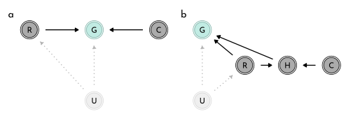
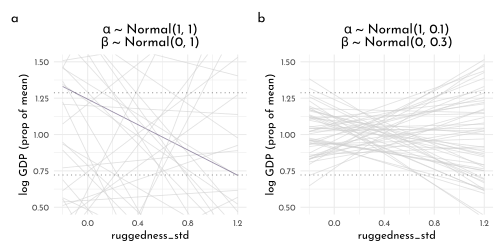
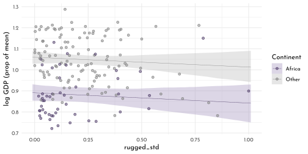
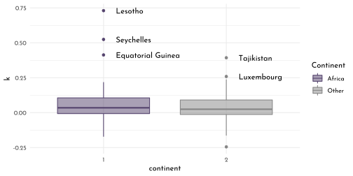
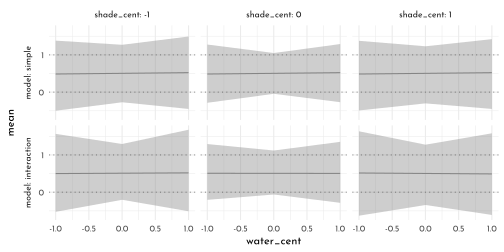
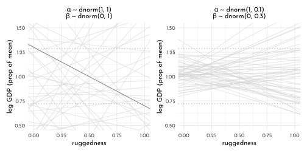
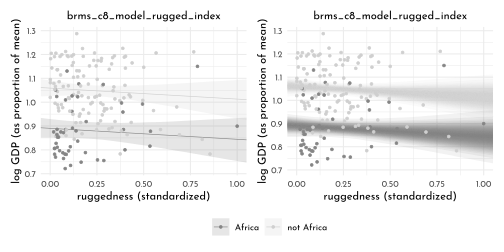
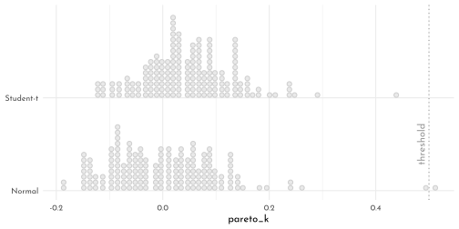

---
output:
  html_document:
  theme: yeti
pdf_document: default
editor_options: 
  chunk_output_type: console
---

# Rethinking: Chapter 8

**Conditional Manatees**


by [Richard McElreath](https://xcelab.net/rm/statistical-rethinking/), building on the Summaries by [Solomon Kurz](https://bookdown.org/content/4857/).

## Building an Interaction

Investigating how ruggedness influences countries GDP, conditional on whether the country is African or not.


```r
library(rethinking)
p_dag1 <- dagify(G ~ R + C + U,
                 R ~ U,
                 coords = tibble(name = c("R", "G", "C", "U"),
                                 x = c(0, .5, 1, .5),
                                 y = c(1, 1, 1, 0))) %>%
  fortify() %>% 
  mutate(stage = if_else(name == "G", "response",
                         if_else(name %in% c("R", "C"),
                                 "predictor", "confounds"))) %>% 
  plot_dag(clr_in = clr3) 

p_dag2 <- dagify(G ~ R + H + U,
                 R ~ U,
                 H ~ R + C,
                 coords = tibble(name = c("R", "G", "C", "H", "U"),
                                 x = c(.33, 0, 1, .66, 0),
                                 y = c(.5, 1, .5, .5, 0))) %>%
  fortify() %>% 
  mutate(stage = if_else(name == "G", "response",
                         if_else(name %in% c("R", "C", "H"),
                                 "predictor", "confounds"))) %>% 
  plot_dag(clr_in = clr3) 

p_dag1 +
  p_dag2 +
  plot_annotation(tag_levels = "a") &
  scale_y_continuous(limits = c(-.1, 1.1)) &
  scale_x_continuous(limits = c(-.05, 1.05)) &
  coord_fixed(ratio = .55) &
  theme(plot.tag = element_text(family = fnt_sel))
```



$\rightarrow$ the DAGs are agnostic to *interactions*: all they show is that in **a**, $G$ is a function of both $R$ and $C$ ($G = f(R, C)$) regardless of the existence of interaction between the two influences.

Importing the ruggedness data:


```r
data(rugged)

data_rugged <- rugged %>% 
  as_tibble() %>% 
  mutate(log_gdp = log(rgdppc_2000)) %>% 
  filter(complete.cases(rgdppc_2000)) %>% 
  mutate(log_gdp_std = log_gdp / mean(log_gdp),
         rugged_std = rugged / max(rugged),
         cont_idx = as.integer(2 - cont_africa))
```

First sketch of the model (without interaction)

$$
\begin{array}{rclr}
log(y_{i}) & \sim & Normal( \mu_{i}, \sigma) & \textrm{[likelihood]}\\
\mu_{i} & = & \alpha + \beta (r_{i} - \overline{r}) & \textrm{[linear model]}\\
\alpha & \sim & Normal(1, 1) & \textrm{[$\alpha$ prior]}\\
\beta & \sim & Normal(0, 1) & \textrm{[$\beta$ prior]}\\
\sigma & \sim & Exponential(1)  & \textrm{[$\sigma$ prior]}
\end{array}
$$


```r
(rugged_mean <- mean(data_rugged$rugged_std))
```

```
#> [1] 0.2149601
```

```r
model_rugged_draft <- quap(
  flist = alist(
    log_gdp_std ~ dnorm(mu, sigma),
    mu <- alpha + beta * ( rugged_std - 0.215 ),
    alpha ~ dnorm(1, 1),
    beta ~ dnorm(0, 1),
    sigma ~ dexp(1)
  ),
  data = data_rugged
)
```

Prior predictions


```r
set.seed(13)
rugged_priors <- extract.prior(model_rugged_draft) %>% 
  as_tibble()

prior_prediction_range <- c(-.2, 1.2)
rugged_prior_predictions <- link(model_rugged_draft,
                        post = rugged_priors,
                        data = list(rugged_std = prior_prediction_range)) %>% 
  as_tibble() %>% 
  set_names(nm = as.character(prior_prediction_range)) %>% 
  mutate(.draw = row_number())

p_prior_draft <- rugged_prior_predictions %>% 
  filter(.draw < 51) %>% 
  ggplot() +
  geom_segment(aes(x = -.2, xend = 1.2,
                   y = `-0.2`, yend = `1.2`,
                   group = .draw, color = .draw ==26),
               size = .4, alpha = .6) +
  labs(title = glue("{mth('\U03B1 \U007E')} Normal(1, 1)<br>{mth('\U03B2 \U007E')}  Normal(0, 1)"),
       x = "ruggedness_std", 
       y = "log GDP (prop of mean)") +
  scale_color_manual(values = c(`FALSE` = clr0d, `TRUE` = clr1), guide = "none")
```

Proportion of extreme slopes ($\gt 0.6$) within the prior:


```r
sum(abs(rugged_priors$beta) > .6) / length(rugged_priors$beta)
```

```
#> [1] 0.534
```

Restricting the priors for $\alpha$ and $\beta$ to more reasonable ranges:

$$
\begin{array}{rclr}
\alpha & \sim & Normal(1, 0.1) & \textrm{[$\alpha$ prior]}\\
\beta & \sim & Normal(0, 0.3) & \textrm{[$\beta$ prior]}\\
\end{array}
$$


```r
model_rugged_restricted <- quap(
  flist = alist(
    log_gdp_std ~ dnorm(mu, sigma),
    mu <- alpha + beta * ( rugged_std - 0.215 ),
    alpha ~ dnorm(1, 0.1),
    beta ~ dnorm(0, 0.3),
    sigma ~ dexp(1)
  ),
  data = data_rugged
)

rugged_restricted_priors <- extract.prior(model_rugged_restricted) %>% 
  as_tibble()

rugged_restricted_prior_predictions <- link(model_rugged_restricted,
                        post = rugged_restricted_priors,
                        data = list(rugged_std = prior_prediction_range)) %>% 
  as_tibble() %>% 
  set_names(nm = as.character(prior_prediction_range)) %>% 
  mutate(.draw = row_number())

p_prior_restricted <- rugged_restricted_prior_predictions %>% 
  filter(.draw < 51) %>% 
  ggplot()  +
  geom_segment(aes(x = -.2, xend = 1.2,
                   y = `-0.2`, yend = `1.2`),
               color = clr0d,
               size = .4, alpha = .6) +
  labs(title = glue("{mth('\U03B1 \U007E')} Normal(1, 0.1)<br>{mth('\U03B2 \U007E')}  Normal(0, 0.3)"),
       x = "ruggedness_std", 
       y = "log GDP (prop of mean)") 

p_prior_draft + p_prior_restricted +
  plot_annotation(tag_levels = "a") &
  geom_hline(yintercept = range(data_rugged$log_gdp_std), 
             linetype = 3, color = clr_dark) &
  coord_cartesian(ylim = c(.5, 1.5),
                  xlim = c(-.2, 1.2)) &
  theme(plot.title = element_markdown(),
        plot.tag = element_text(family = fnt_sel))
```




```r
precis(model_rugged_restricted) %>% 
  knit_precis()
```


|param | mean|   sd|  5.5%| 94.5%|
|:-----|----:|----:|-----:|-----:|
|alpha | 1.00| 0.01|  0.98|  1.02|
|beta  | 0.00| 0.05| -0.09|  0.09|
|sigma | 0.14| 0.01|  0.12|  0.15|

### Adding an index variable is not enough

Updating the model to include a index variable:

$$
\begin{array}{rclr}
\mu_{i} & = & \alpha_{CID[i]} + \beta (r_{i} - \overline{r}) & \textrm{[linear model]}\\
\end{array}
$$


```r
model_rugged_index <- quap(
   flist = alist(
    log_gdp_std ~ dnorm(mu, sigma),
    mu <- alpha[cont_idx] + beta * ( rugged_std - 0.215 ),
    alpha[cont_idx] ~ dnorm(1, 0.1),
    beta ~ dnorm(0, 0.3),
    sigma ~ dexp(1)
  ),
  data = data_rugged
)

compare(model_rugged_restricted,
        model_rugged_index)
```

```
#>                              WAIC       SE    dWAIC      dSE    pWAIC
#> model_rugged_index      -252.2759 15.30586  0.00000       NA 4.248819
#> model_rugged_restricted -188.8157 13.20582 63.46027 15.12848 2.665296
#>                              weight
#> model_rugged_index      1.00000e+00
#> model_rugged_restricted 1.65874e-14
```


```r
precis(model_rugged_index, depth = 2) %>% 
  knit_precis()
```


|param    |  mean|   sd|  5.5%| 94.5%|
|:--------|-----:|----:|-----:|-----:|
|alpha[1] |  0.88| 0.02|  0.85|  0.91|
|alpha[2] |  1.05| 0.01|  1.03|  1.07|
|beta     | -0.05| 0.05| -0.12|  0.03|
|sigma    |  0.11| 0.01|  0.10|  0.12|


```r
rugged_index_posterior <- extract.samples(model_rugged_index) %>% 
  as_tibble() %>% 
  mutate(diff = alpha[,1 ] - alpha[,2])

PI(rugged_index_posterior$diff)
```

```
#>         5%        94% 
#> -0.1996424 -0.1382548
```

```r
rugged_range <- seq(from = -.01, to = 1.01, length.out = 51)

draw_posterior_samples <- function(idx, model){
  link(model,
     data = tibble(cont_idx = idx, rugged_std = rugged_range)) %>% 
  as_tibble() %>% 
  set_names(nm = as.character(rugged_range)) %>% 
  pivot_longer(everything(),
               values_to = "log_gdp_std",
               names_to = "rugged_std") %>% 
  mutate(cont_idx = idx,
         rugged_std = as.numeric(rugged_std))
}

rugged_index_posterior <- bind_rows(draw_posterior_samples(1, model = model_rugged_index),
          draw_posterior_samples(2, model = model_rugged_index))

rugged_index_posterior_pi <- rugged_index_posterior %>% 
   group_by(rugged_std, cont_idx) %>% 
  summarise(mean = mean(log_gdp_std),
            PI_lower = PI(log_gdp_std, prob = .97)[1],
            PI_upper = PI(log_gdp_std, prob = .97)[2]) %>% 
  ungroup()

ggplot(mapping = aes(x = rugged_std)) +
  geom_smooth(data = rugged_index_posterior_pi, stat = "identity",
              aes(y = mean, ymin = PI_lower, ymax = PI_upper,
                 color = factor(cont_idx), 
                 fill = after_scale(clr_alpha(clr_lighten(color)))),
              size = .2) +
  geom_point(data = data_rugged,
             aes(y = log_gdp_std,
                 color = factor(cont_idx), 
                 fill = after_scale(clr_alpha(color))),
             size = 1.5, shape = 21) +
  labs(y = "log GDP (prop of mean)") +
  scale_color_manual("Continent",
                     values = c(`1` = clr1, `2` = clr0dd),
                     labels = c(`1` = "Africa", `2` = "Other"))
```



### Adding an interaction does work

Updating the model to also include a random slope:

$$
\begin{array}{rclr}
\mu_{i} & = & \alpha_{CID[i]} + \beta_{CID[i]} (r_{i} - \overline{r}) & \textrm{[linear model]}\\
\end{array}
$$


```r
model_rugged_slope <- quap(
   flist = alist(
    log_gdp_std ~ dnorm(mu, sigma),
    mu <- alpha[cont_idx] + beta[cont_idx] * ( rugged_std - 0.215 ),
    alpha[cont_idx] ~ dnorm(1, 0.1),
    beta[cont_idx] ~ dnorm(0, 0.3),
    sigma ~ dexp(1)
  ),
  data = data_rugged
)

precis(model_rugged_slope, depth = 2) %>% 
  knit_precis()
```


|param    |  mean|   sd|  5.5%| 94.5%|
|:--------|-----:|----:|-----:|-----:|
|alpha[1] |  0.89| 0.02|  0.86|  0.91|
|alpha[2] |  1.05| 0.01|  1.03|  1.07|
|beta[1]  |  0.13| 0.07|  0.01|  0.25|
|beta[2]  | -0.14| 0.05| -0.23| -0.06|
|sigma    |  0.11| 0.01|  0.10|  0.12|

```r
compare(model_rugged_restricted,
        model_rugged_index,
        model_rugged_slope,
        func = PSIS) %>% 
  knit_precis(param_name = "model")
```


|model                   |    PSIS|    SE| dPSIS|   dSE| pPSIS| weight|
|:-----------------------|-------:|-----:|-----:|-----:|-----:|------:|
|model_rugged_slope      | -258.72| 15.27|  0.00|    NA|  5.38|   0.96|
|model_rugged_index      | -252.31| 15.31|  6.41|  6.91|  4.21|   0.04|
|model_rugged_restricted | -188.75| 13.39| 69.97| 15.51|  2.71|   0.00|


```r
library(ggdist)
set.seed(42)
(data_rugged_psis <- PSIS(model_rugged_slope, pointwise = TRUE) %>% 
  as_tibble() %>%
  bind_cols(data_rugged)) %>% 
  ggplot(aes(x = factor(cont_idx), y = k)) +
    geom_boxplot(#adjust = 1,
                 aes(color = factor(cont_idx),
                             fill = after_scale(clr_alpha(color))))+
  geom_text(data = . %>% filter(k > .25),
            aes(x = cont_idx + .1, label = country),
            hjust = 0, family = fnt_sel) +
  scale_color_manual("Continent",
                     values = c(`1` = clr1, `2` = clr0dd),
                     labels = c(`1` = "Africa", `2` = "Other")) +
  labs(x = "continent")
```




```r
rugged_slope_posterior <- bind_rows(draw_posterior_samples(1, model = model_rugged_slope),
          draw_posterior_samples(2, model = model_rugged_slope))

rugged_slope_posterior_pi <- rugged_slope_posterior %>% 
   group_by(rugged_std, cont_idx) %>% 
  summarise(mean = mean(log_gdp_std),
            PI_lower = PI(log_gdp_std, prob = .97)[1],
            PI_upper = PI(log_gdp_std, prob = .97)[2]) %>% 
  ungroup()

ggplot(mapping = aes(x = rugged_std)) +
  geom_smooth(data = rugged_slope_posterior_pi, stat = "identity",
              aes(y = mean, ymin = PI_lower, ymax = PI_upper,
                 color = factor(cont_idx), 
                 fill = after_scale(clr_alpha(clr_lighten(color)))),
              size = .2) +
  geom_point(data = data_rugged,
             aes(y = log_gdp_std,
                 color = factor(cont_idx), 
                 fill = after_scale(clr_alpha(color))),
             size = 1.5, shape = 21) +
  ggrepel::geom_text_repel(data = data_rugged_psis %>%  filter(k > .25),
             aes(y = log_gdp_std,
                 x = rugged_std + .1,
                 label = country),
             force = 20,
            hjust = 0, family = fnt_sel) +
  labs(y = "log GDP (prop of mean)") +
  facet_wrap(cont_idx ~ .) +
  scale_color_manual("Continent",
                     values = c(`1` = clr1, `2` = clr0dd),
                     labels = c(`1` = "Africa", `2` = "Other"))
```


## Symetry of Interactions

Rewriting the linear model to highlight the symmetry between *conditional slope* and *conditional intercept*:

$$
\mu_{i} = \underbrace{(2 - CID_{i}) \big( \alpha_{1} + \beta_{1} (r_{i} - \overline{r}) \big)}_{CID[i] = 1} + \underbrace{(CID_{i} - 1) \big( \alpha_{2} + \beta_{2} (r_{i} - \overline{r}) \big)}_{CID[i] = 2}
$$

Plotting a counterfactual effect of comparing the association of *log GPD* with *being in Africa* while holding *ruggedness* constant:


```r
rugged_slope_posterior_delta <- rugged_slope_posterior %>% 
  group_by(cont_idx, rugged_std) %>% 
  mutate(.draw = row_number()) %>% 
  ungroup() %>% 
  pivot_wider(names_from = cont_idx,
              values_from = log_gdp_std,
              names_prefix = "log_gdp_std_") %>% 
  mutate(delta_log_gdp_std = log_gdp_std_1 - log_gdp_std_2)

rugged_slope_posterior_delta_pi <- rugged_slope_posterior_delta %>% 
  group_by(rugged_std) %>% 
  summarise(mean = mean(delta_log_gdp_std),
            PI_lower = PI(delta_log_gdp_std, prob = .97)[1],
            PI_upper = PI(delta_log_gdp_std, prob = .97)[2]) %>% 
  ungroup()


ggplot(mapping = aes(x = rugged_std)) +
  geom_hline(yintercept = 0, color = clr_dark, linetype = 3) +
  geom_smooth(data = rugged_slope_posterior_delta_pi, stat = "identity",
              aes(y = mean, ymin = PI_lower, ymax = PI_upper),
                 color = clr0d, 
                 fill = fll0,
              size = .2) +
  geom_text(data = tibble(y = .03 * c(-1,1),
                          lab = c("Africa lower GDP",
                                  "Africa higher GDP")),
                          aes(x = .01, y = y, label = lab),
                          family = fnt_sel, hjust = 0) +
  labs(y = "expected difference log GDP")
```


... it it simultaneously consistent with the data and the model, that *the influence of ruggedness depends on the continent* **and** that *the influence of the continent depends on ruggedness*.

## Continuous Interaction


```r
data(tulips)

precis(tulips) %>% 
  knit_precis()
```


|param  |   mean|    sd| 5.5%|  94.5%|histogram  |
|:------|------:|-----:|----:|------:|:----------|
|bed    |    NaN|    NA|   NA|     NA|           |
|water  |   2.00|  0.83| 1.00|   3.00|▇▁▁▁▇▁▁▁▁▇ |
|shade  |   2.00|  0.83| 1.00|   3.00|▇▁▁▁▇▁▁▁▁▇ |
|blooms | 128.99| 92.68| 4.31| 280.79|▅▇▇▂▃▁▁▁   |

```r
data_tulips <- tulips %>% 
  as_tibble() %>% 
  mutate(blooms_std = blooms / max(blooms),
         water_cent = water - mean(water),
         shade_cent = shade - mean(shade))
```


```r
dagify(B ~ S + W,
       coords = tibble(name = c("B", "W", "S"),
                       x = c(.5, 0, 1),
                       y = c(1, 1, 1))) %>%
  fortify() %>% 
  mutate(stage = if_else(name == "B", "response",
                         if_else(name %in% c("W", "S"),
                                 "predictor", "confounds"))) %>% 
  plot_dag(clr_in = clr3) +
  coord_fixed(ratio = .6,
              xlim = c(-.05, 1.05),
              ylim = c(.9, 1.1))
```


We are going to build two models, one *without any interaction* and one *with*.

### Model without Interaction

$$
\begin{array}{rclr}
B_{i} & \sim & Normal( \mu_{i}, \sigma) & \textrm{[likelihood]}\\
\mu_{i} & = & \alpha + \beta_{W} (W_{i} - \overline{W}) + \beta_{S} (S_{i} - \overline{S}) & \textrm{[linear model]}\\
\alpha & \sim & Normal(0.5, 0.25) & \textrm{[$\alpha$ prior]}\\
\beta_{W} & \sim & Normal(0, 0.25) & \textrm{[$\beta_{W}$ prior]}\\
\beta_{S} & \sim & Normal(0, 0.25) & \textrm{[$\beta_{S}$ prior]}\\
\sigma & \sim & Exponential(1)  & \textrm{[$\sigma$ prior]}
\end{array}
$$

:::think
**Considerations for the priors:**

Ranges assigned if we used $alpha = Normal(0.5, 1)$ instead:


```r
alpha <- rnorm(1e4, 0.5, 1);  sum(alpha < 0 | alpha > 1) / length(alpha)
```

```
#> [1] 0.6251
```

updating to a more restrictive prior (used in the model):


```r
alpha <- rnorm(1e4, 0.5, .25);  sum(alpha < 0 | alpha > 1) / length(alpha)
```

```
#> [1] 0.0498
```
:::


```r
model_tulips_simple <- quap(
  flist = alist(
    blooms_std ~ dnorm(mu, sigma),
    mu <- alpha + beta_w * water_cent + beta_s * shade_cent,
    alpha ~ dnorm(.5, .25),
    beta_w ~ dnorm(0,.25),
    beta_s ~ dnorm(0,.25),
    sigma ~ dexp(1)
  ),
  data = data_tulips
)

precis(model_tulips_simple) %>% 
  knit_precis()
```


|param  |  mean|   sd|  5.5%| 94.5%|
|:------|-----:|----:|-----:|-----:|
|alpha  |  0.36| 0.03|  0.31|  0.41|
|beta_w |  0.21| 0.04|  0.15|  0.26|
|beta_s | -0.11| 0.04| -0.17| -0.05|
|sigma  |  0.16| 0.02|  0.12|  0.19|


### Model with Interaction

Implementing the continuous interaction

$$
\begin{array}{rcl}
\mu_{i} & = & \alpha + \gamma_{W,i} \beta_{W} W_{i} + \beta_{S} S_{i} \\
\gamma_{W,i} & = & \beta_{W} + \beta_{WS} S_{i}\\
\end{array}
$$

which allows the substitution 

$$
\begin{array}{rcl}
\mu_{i} & = & \alpha + \underbrace{(\beta_{W} + \beta_{WS} S_{i})}_{\gamma_{W,i} } \beta_{W} W_{i}  + \beta_{S} S_{i} \\
& = & \alpha + \beta_{W} W_{i}  + \beta_{S} S_{i} + \beta_{WS} W_{i} S_{i}\\
\end{array}
$$


Using this for the complete model:

$$
\begin{array}{rclr}
B_{i} & \sim & Normal( \mu_{i}, \sigma) & \textrm{[likelihood]}\\
\mu_{i} & = & \alpha + \beta_{W} W_{i} + \beta_{S} S_{i} + \beta_{WS}  W_{i} S_{i} & \textrm{[linear model]} \\
\alpha & \sim & Normal(0.5, 0.25) & \textrm{[$\alpha$ prior]}\\
\beta_{W} & \sim & Normal(0, 0.25) & \textrm{[$\beta_{W}$ prior]}\\
\beta_{S} & \sim & Normal(0, 0.25) & \textrm{[$\beta_{S}$ prior]}\\
\beta_{WS} & \sim & Normal(0, 0.25) & \textrm{[$\beta_{S}$ prior]}\\
\sigma & \sim & Exponential(1)  & \textrm{[$\sigma$ prior]}
\end{array}
$$


```r
model_tulips_interaction <- quap(
   flist = alist(
    blooms_std ~ dnorm(mu, sigma),
    mu <- alpha + beta_w * water_cent + beta_s * shade_cent + beta_ws  * water_cent * shade_cent,
    alpha ~ dnorm(.5, .25),
    beta_w ~ dnorm(0,.25),
    beta_s ~ dnorm(0,.25),
    beta_ws ~ dnorm(0,.25),
    sigma ~ dexp(1)
  ),
  data = data_tulips
)

precis(model_tulips_interaction) %>% 
  knit_precis()
```


|param   |  mean|   sd|  5.5%| 94.5%|
|:-------|-----:|----:|-----:|-----:|
|alpha   |  0.36| 0.02|  0.32|  0.40|
|beta_w  |  0.21| 0.03|  0.16|  0.25|
|beta_s  | -0.11| 0.03| -0.16| -0.07|
|beta_ws | -0.14| 0.04| -0.20| -0.09|
|sigma   |  0.12| 0.02|  0.10|  0.15|

### Plotting the Posterior Predictions


```r
tulip_range <- cross_df(list(water_cent = -1:1,
                             shade_cent = -1:1)) %>% 
  mutate(rn = row_number())

tulips_simple_posterior <- link(model_tulips_simple, data = tulip_range) %>% 
  as_tibble() %>% 
  set_names(nm = 1:length(names(.))) %>% 
  mutate(.draw = row_number()) %>% 
  pivot_longer(-.draw, names_to = "rn", values_to = "blooms") %>% 
  mutate(rn = as.numeric(rn), model = "simple") %>% 
  left_join(tulip_range) 

tulips_interaction_posterior <- link(model_tulips_interaction, data = tulip_range) %>% 
  as_tibble() %>% 
  set_names(nm = 1:length(names(.))) %>% 
  mutate(.draw = row_number()) %>% 
  pivot_longer(-.draw, names_to = "rn", values_to = "blooms") %>% 
  mutate(rn = as.numeric(rn), model = "interaction") %>% 
  left_join(tulip_range) 

tulips_posterior <- tulips_simple_posterior %>% 
  bind_rows(tulips_interaction_posterior) %>% 
  mutate(model = factor(model, levels = c("simple", "interaction")))

tulips_posterior_pi <- tulips_posterior %>% 
  group_by(model, rn,water_cent, shade_cent ) %>% 
  summarise(mean = mean(blooms),
            PI_lower = PI(blooms, prob = .97)[1],
            PI_upper = PI(blooms, prob = .97)[2]) %>% 
  ungroup() 

tulips_posterior %>% 
  ggplot(aes(x = water_cent)) +
  geom_line(data = . %>% 
              filter(.draw < 21),
            aes(y = blooms ,
                group = .draw, color = .draw == 20)) +
  geom_point(data = data_tulips, aes(y = blooms_std),
             color = clr_dark) +
  facet_grid(model ~ shade_cent, labeller = label_both,switch = "y") +
  scale_color_manual(values = c(`FALSE` = fll0, `TRUE` = fll1)) +
  theme(legend.position = "bottom",
        strip.placement = "outside")
```


```r
tulips_posterior_pi %>% 
  ggplot(aes(x = water_cent)) +
  geom_point(data = data_tulips, aes(y = blooms_std),
             color = clr_dark) +
  geom_smooth(stat = "identity",
              aes(y = mean, ymin = PI_lower, ymax = PI_upper),
                 color = clr0dd, fill = clr_alpha(clr0dd), size = .5) +
  facet_grid(model ~ shade_cent, labeller = label_both,switch = "y") +
  theme(legend.position = "bottom",
        strip.placement = "outside")
```


### Plotting the Prior Predictions


```r
set.seed(5)
tulips_simple_prior <- extract.prior(model_tulips_simple,
                                     data = tulip_range) %>% 
  as_tibble() %>% 
  mutate(.draw = row_number(),
         grid = rep(list(cross_df(list(water_cent = -1:1,
                             shade_cent = -1:1))), n()),
          model = "simple") %>% 
  unnest(grid) %>% 
  mutate(blooms = alpha + beta_w * water_cent + beta_s * shade_cent)

tulips_interaction_prior <- extract.prior(model_tulips_interaction,
                                          data = tulip_range) %>% 
  as_tibble() %>% 
  mutate(.draw = row_number(),
         grid = rep(list(cross_df(list(water_cent = -1:1,
                             shade_cent = -1:1))), n()),
          model = "interaction") %>% 
  unnest(grid) %>% 
  mutate(blooms = alpha + beta_w * water_cent + beta_s * shade_cent + beta_ws  * water_cent * shade_cent)

tulips_prior <- tulips_simple_prior %>% 
  bind_rows(tulips_interaction_prior) %>% 
  mutate(model = factor(model, levels = c("simple", "interaction")))

tulips_prior_pi <- tulips_prior %>% 
  group_by(model, water_cent, shade_cent ) %>% 
  summarise(mean = mean(blooms),
            PI_lower = PI(blooms, prob = .97)[1],
            PI_upper = PI(blooms, prob = .97)[2]) %>% 
  ungroup() 

tulips_prior %>%
  ggplot(aes(x = water_cent)) +
  geom_line(data = . %>% 
              filter(.draw < 21),
            aes(y = blooms ,
                group = .draw, color = .draw == 20)) +
  geom_hline(yintercept = c(0, 1), linetype = 3, color = clr_dark) +
  facet_grid(model ~ shade_cent, labeller = label_both, switch = "y") +
  scale_color_manual(values = c(`FALSE` = clr_alpha(clr0d), `TRUE` = fll1)) +
  theme(legend.position = "bottom",
        strip.placement = "outside") +
  coord_cartesian(ylim = c(-.35,1.35))
```


```r
tulips_prior_pi %>% 
  ggplot(aes(x = water_cent)) +
  geom_smooth(stat = "identity",
              aes(y = mean, ymin = PI_lower, ymax = PI_upper),
                 color = clr0dd, fill = clr_alpha(clr0dd), size = .5) +
  geom_hline(yintercept = c(0, 1), linetype = 3, color = clr_dark) +
  facet_grid(model ~ shade_cent, labeller = label_both,switch = "y") +
  theme(legend.position = "bottom",
        strip.placement = "outside")
```




```r
library(rlang)
chapter8_models <- env(
  data_rugged = data_rugged,
  model_rugged_draft = model_rugged_draft,
  model_rugged_restricted = model_rugged_restricted,
  model_rugged_index = model_rugged_index,
  model_rugged_slope = model_rugged_slope,
  data_tulips = data_tulips
)

write_rds(chapter8_models, "envs/chapter8_models.rds")
```


## Homework

**E1**


**E2**


**E3**


**E4**


**M1**


**M2**


**M3**


**M4**


**M5**


**M6**


**H1**


**H2**


**H3**


**H4**


**H5**


## {brms} section

### Building an Interaction


```r
data_rugged_centered <- data_rugged %>% 
  mutate(rugged_std_centered = rugged_std - mean(rugged_std),
         cont_idx = factor(cont_idx))

brms_c8_model_rugged_draft <- brm(
  data = data_rugged_centered, 
  family = gaussian,
  log_gdp_std ~ 1 + rugged_std_centered,
  prior = c(prior(normal(1, 1), class = Intercept),
            prior(normal(0, 1), class = b),
            prior(exponential(1), class = sigma)),
  iter = 2000, warmup = 1000,
  chains = 4, cores = 4,
  seed = 42,
  sample_prior = TRUE,
  file = "brms/brms_c8_model_rugged_draft")
```


```r
prior_rugged_draft <- prior_draws(brms_c8_model_rugged_draft) %>%
  as_tibble()

set.seed(8)

p1 <- prior_rugged_draft %>% 
  slice_sample(n = 50) %>% 
  rownames_to_column() %>% 
  expand(nesting(rowname, Intercept, b),
         rugged_std_centered = c(-2, 2)) %>% 
  mutate(log_gdp_std = Intercept + b * rugged_std_centered,
         rugged_std  = rugged_std_centered + mean(data_rugged_centered$rugged_std)) %>% 
  
  ggplot(aes(x = rugged_std, y = log_gdp_std, group = rowname)) +
  geom_hline(yintercept = range(data_rugged_centered$log_gdp_std), 
             linetype = 3, color = clr_dark) +
  geom_line(color = clr_alpha(clr0d)) +
  geom_abline(intercept = 1.3, slope = -0.6,
              color = clr0dd) +
  labs(subtitle = glue("{mth('\U03B1 \U007E')} dnorm(1, 1)<br>{mth('\U03B2 \U007E')} dnorm(0, 1)"),
       x = "ruggedness",
       y = "log GDP (prop of mean)") +
  coord_cartesian(xlim = c(0, 1),
                  ylim = c(0.5, 1.5)) +
  theme(plot.subtitle = element_markdown())

prior_rugged_draft %>%
  summarise(a = sum(abs(b) > abs(-0.6)) / nrow(prior_rugged_draft))
```

```
#> # A tibble: 1 x 1
#>       a
#>   <dbl>
#> 1 0.552
```


```r
brms_c8_model_rugged_restricted <- brm(
  data = data_rugged_centered, 
  family = gaussian,
  log_gdp_std ~ 1 + rugged_std_centered,
  prior = c(prior(normal(1, 0.1), class = Intercept),
            prior(normal(0, .3), class = b),
            prior(exponential(1), class = sigma)),
  iter = 2000, warmup = 1000,
  chains = 4, cores = 4,
  seed = 42,
  sample_prior = TRUE,
  file = "brms/brms_c8_model_rugged_restricted")
```


```r
prior_rugged_restricted <- prior_draws(brms_c8_model_rugged_restricted) %>%
  as_tibble()

set.seed(8)

p2 <- prior_rugged_restricted %>% 
  slice_sample(n = 50) %>% 
  rownames_to_column() %>% 
  expand(nesting(rowname, Intercept, b),
         rugged_std_centered = c(-2, 2)) %>% 
  mutate(log_gdp_std = Intercept + b * rugged_std_centered,
         rugged_std  = rugged_std_centered + mean(data_rugged_centered$rugged_std)) %>% 
  
  ggplot(aes(x = rugged_std, y = log_gdp_std, group = rowname)) +
  geom_hline(yintercept = range(data_rugged_centered$log_gdp_std), 
             linetype = 3, color = clr_dark) +
  geom_line(color = clr_alpha(clr0d)) +
  labs(subtitle = glue("{mth('\U03B1 \U007E')} dnorm(1, 0.1)<br>{mth('\U03B2 \U007E')} dnorm(0, 0.3)"),
       x = "ruggedness",
       y = "log GDP (prop of mean)") +
  coord_cartesian(xlim = c(0, 1),
                  ylim = c(0.5, 1.5)) +
  theme(plot.subtitle = element_markdown())

prior_rugged_restricted %>%
  summarise(a = sum(abs(b) > abs(-0.6)) / nrow(prior_rugged_draft))
```

```
#> # A tibble: 1 x 1
#>        a
#>    <dbl>
#> 1 0.0382
```


```r
p1 + p2
```


```r
mixedup::summarize_model(brms_c8_model_rugged_restricted)
```

```
#>     Group Effect Variance   SD SD_2.5 SD_97.5 Var_prop
#>  Residual            0.02 0.14   0.12    0.15     1.00
#>                 Term Value   SE Lower_2.5 Upper_97.5
#>            Intercept  1.00 0.01      0.98       1.02
#>  rugged_std_centered  0.00 0.06     -0.11       0.12
```

#### Adding an indicator variable is not enough


```r
brms_c8_model_rugged_index <- brm(
  data = data_rugged_centered, 
  family = gaussian,
  log_gdp_std ~ 0 + cont_idx + rugged_std_centered,
  prior = c(prior(normal(1, 0.1), class = b, coef = cont_idx1),
            prior(normal(1, 0.1), class = b, coef = cont_idx2),
            prior(normal(0, 0.3), class = b, coef = rugged_std_centered),
            prior(exponential(1), class = sigma)),
  iter = 2000, warmup = 1000, chains = 4, cores = 4,
  seed = 42,
  file = "brms/brms_c8_model_rugged_index")
```


```r
brms_c8_model_rugged_restricted <- add_criterion(brms_c8_model_rugged_restricted, "waic")
brms_c8_model_rugged_index <- add_criterion(brms_c8_model_rugged_index, "waic")

loo_compare(brms_c8_model_rugged_restricted,
            brms_c8_model_rugged_index,
            criterion = "waic") %>%
  print(simplify = FALSE) %>% 
  as.data.frame() %>% 
  knit_precis(param_name = "model")
```

```
#>                                 elpd_diff se_diff elpd_waic se_elpd_waic p_waic
#> brms_c8_model_rugged_index         0.0       0.0   126.2       7.4          4.1
#> brms_c8_model_rugged_restricted  -31.8       7.3    94.4       6.5          2.6
#>                                 se_p_waic waic   se_waic
#> brms_c8_model_rugged_index         0.8    -252.4   14.8 
#> brms_c8_model_rugged_restricted    0.3    -188.8   13.0
```


|model                           | elpd_diff| se_diff| elpd_waic| se_elpd_waic| p_waic| se_p_waic|    waic| se_waic|
|:-------------------------------|---------:|-------:|---------:|------------:|------:|---------:|-------:|-------:|
|brms_c8_model_rugged_index      |      0.00|    0.00|    126.21|         7.41|   4.08|      0.80| -252.42|   14.81|
|brms_c8_model_rugged_restricted |    -31.81|    7.32|     94.40|         6.48|   2.61|      0.29| -188.80|   12.95|

```r
model_weights(brms_c8_model_rugged_restricted,
              brms_c8_model_rugged_index,
              weights = "waic") %>%
  round(digits = 3)
```

```
#> brms_c8_model_rugged_restricted      brms_c8_model_rugged_index 
#>                               0                               1
```


```r
mixedup::summarize_model(brms_c8_model_rugged_index)
```

```
#>     Group Effect Variance   SD SD_2.5 SD_97.5 Var_prop
#>  Residual            0.01 0.11   0.10    0.13     1.00
#>                 Term Value   SE Lower_2.5 Upper_97.5
#>            cont_idx1  0.88 0.02      0.85       0.91
#>            cont_idx2  1.05 0.01      1.03       1.07
#>  rugged_std_centered -0.05 0.05     -0.14       0.04
```


```r
posterior_rugged_index <- as_draws_df(brms_c8_model_rugged_index) %>%
  as_tibble() %>% 
  mutate(diff = b_cont_idx1 - b_cont_idx2)

library(tidybayes)

qi(posterior_rugged_index$diff, .width = .89) %>% as_tibble()
```

```
#> # A tibble: 1 x 2
#>       V1     V2
#>    <dbl>  <dbl>
#> 1 -0.200 -0.138
```


```r
new_data <- crossing(cont_idx = 1:2,
                     rugged_std = seq(from = -0.2, to = 1.2, length.out = 30)) %>% 
  mutate(rugged_std_centered = rugged_std - mean(data_rugged_centered$rugged_std))

fitted_rugged_index <- fitted(
  brms_c8_model_rugged_index, 
  newdata = new_data,
  probs = c(.015, .985)) %>%
  as_tibble() %>%
  bind_cols(new_data) %>%
  mutate(cont_africa = c("Africa", "not Africa")[cont_idx])

p1 <- data_rugged_centered %>%
  mutate(cont_africa = c("Africa", "not Africa")[cont_idx]) %>%
  ggplot(aes(x = rugged_std, fill = cont_africa, color = cont_africa)) +
  geom_smooth(data = fitted_rugged_index,
              aes(y = Estimate, ymin = Q1.5, ymax = Q98.5),
              stat = "identity",
              alpha = .2, size = .3) +
  geom_point(aes(y = log_gdp_std),
             size = 1) +
  scale_fill_manual(values = c(Africa = clr0dd, `not Africa` = clr0d)) +
  scale_colour_manual(values = c(Africa = clr0dd, `not Africa` = clr0d)) +
  labs(subtitle = "brms_c8_model_rugged_index",
       x = "ruggedness (standardized)",
       y = "log GDP (as proportion of mean)") +
  coord_cartesian(xlim = c(0, 1)) +
  theme(legend.background = element_blank(),
        legend.position = "bottom",
        legend.title = element_blank())
```

Using `stat_lineribbon()` since *'boundaries are meaningless'*:


```r
p2 <- fitted(brms_c8_model_rugged_index, 
       newdata = new_data,
       summary = FALSE) %>%
  as_tibble() %>%
  pivot_longer(everything()) %>% 
  bind_cols(
    expand(new_data, 
           iter = 1:4000,
           nesting(cont_idx, rugged_std))
  ) %>%
  mutate(cont_africa = c("Africa", "not Africa")[cont_idx]) %>% 
  ggplot(aes(x = rugged_std, y = value, fill = cont_africa, color = cont_africa)) +
  stat_lineribbon(.width = seq(from = .03, to = .99, by = .03),
                  alpha = .1, size = 0) +
  geom_point(data = data_rugged_centered %>% 
               mutate(cont_africa = c("Africa", "not Africa")[cont_idx]),
             aes(y = log_gdp_std),
             size = 1) +
  scale_fill_manual(values = c(Africa = clr0dd, `not Africa` = clr0d),
                    guide = "none") +
  scale_colour_manual(values = c(Africa = clr0dd, `not Africa` = clr0d),
                      guide = "none") +
  labs(subtitle = "brms_c8_model_rugged_index",
       x = "ruggedness (standardized)",
       y = "log GDP (as proportion of mean)") +
  coord_cartesian(xlim = c(0, 1)) +
  theme(legend.background = element_blank(),
        legend.position = "bottom",
        legend.title = element_blank())
```


```r
p1 + p2 + plot_layout(guides = "collect") & theme(legend.position = "bottom")
```


#### Adding an interaction does work

Remeber the [non-linear syntax](https://cran.r-project.org/web/packages/brms/vignettes/brms_nonlinear.html) for {brms} to use with index variables.


```r
brms_c8_model_rugged_slope <- brm(
  data = data_rugged_centered, 
  family = gaussian,
  bf(log_gdp_std ~ 0 + a + b * rugged_std_centered, 
     a ~ 0 + cont_idx, 
     b ~ 0 + cont_idx,
     nl = TRUE),
  prior = c(prior(normal(1, 0.1), class = b, coef = cont_idx1, nlpar = a),
            prior(normal(1, 0.1), class = b, coef = cont_idx2, nlpar = a),
            prior(normal(0, 0.3), class = b, coef = cont_idx1, nlpar = b),
            prior(normal(0, 0.3), class = b, coef = cont_idx2, nlpar = b),
            prior(exponential(1), class = sigma)),
  iter = 2000, warmup = 1000, 
  chains = 4, cores = 4,
  seed = 42,
  file = "brms/brms_c8_model_rugged_slope")
```


```r
mixedup::summarise_model(brms_c8_model_rugged_slope)
```

```
#>     Group Effect Variance   SD SD_2.5 SD_97.5 Var_prop
#>  Residual            0.01 0.11   0.10    0.12     1.00
#>         Term Value   SE Lower_2.5 Upper_97.5
#>  a_cont_idx1  0.89 0.02      0.86       0.92
#>  a_cont_idx2  1.05 0.01      1.03       1.07
#>  b_cont_idx1  0.13 0.07     -0.01       0.28
#>  b_cont_idx2 -0.14 0.06     -0.25      -0.03
```


```r
brms_c8_model_rugged_restricted <- add_criterion(brms_c8_model_rugged_restricted, "loo")
brms_c8_model_rugged_index <- add_criterion(brms_c8_model_rugged_index, "loo")
brms_c8_model_rugged_slope <- add_criterion(brms_c8_model_rugged_slope, c("loo", "waic"))

loo_compare(brms_c8_model_rugged_restricted,
            brms_c8_model_rugged_index,
            brms_c8_model_rugged_slope,
            criterion = "loo") %>%
  print(simplify = FALSE)
```

```
#>                                 elpd_diff se_diff elpd_loo se_elpd_loo p_loo 
#> brms_c8_model_rugged_slope         0.0       0.0   129.7      7.3         4.9
#> brms_c8_model_rugged_index        -3.5       3.2   126.2      7.4         4.1
#> brms_c8_model_rugged_restricted  -35.3       7.5    94.4      6.5         2.6
#>                                 se_p_loo looic  se_looic
#> brms_c8_model_rugged_slope         0.9   -259.3   14.7  
#> brms_c8_model_rugged_index         0.8   -252.4   14.8  
#> brms_c8_model_rugged_restricted    0.3   -188.8   13.0
```

```r
model_weights(brms_c8_model_rugged_restricted,
              brms_c8_model_rugged_index,
              brms_c8_model_rugged_slope,
              weights = "loo") %>%
  round(digits = 2)
```

```
#> brms_c8_model_rugged_restricted      brms_c8_model_rugged_index 
#>                            0.00                            0.03 
#>      brms_c8_model_rugged_slope 
#>                            0.97
```

```r
tibble(k = brms_c8_model_rugged_slope$criteria$loo$diagnostics$pareto_k,
       row = 1:170) %>% 
  arrange(desc(k))
```

```
#> # A tibble: 170 x 2
#>        k   row
#>    <dbl> <int>
#>  1 0.512   145
#>  2 0.494    93
#>  3 0.262    35
#>  4 0.240   133
#>  5 0.240    36
#>  6 0.195    27
#>  7 0.182   144
#>  8 0.149    67
#>  9 0.143    99
#> 10 0.139   107
#> # … with 160 more rows
```

Robust model variant using a student-t distribution as prior


```r
brms_c8_model_rugged_student <- brm(
  data = data_rugged_centered, 
  family = student,
  bf(log_gdp_std ~ 0 + a + b * rugged_std_centered, 
     a ~ 0 + cont_idx, 
     b ~ 0 + cont_idx,
     nl = TRUE),
  prior = c(prior(normal(1, 0.1), class = b, coef = cont_idx1, nlpar = a),
            prior(normal(1, 0.1), class = b, coef = cont_idx2, nlpar = a),
            prior(normal(0, 0.3), class = b, coef = cont_idx1, nlpar = b),
            prior(normal(0, 0.3), class = b, coef = cont_idx2, nlpar = b),
            prior(exponential(1), class = sigma)),
  iter = 2000, warmup = 1000, 
  chains = 4, cores = 4,
  seed = 42,
  file = "brms/brms_c8_model_rugged_student")

brms_c8_model_rugged_student <- add_criterion(brms_c8_model_rugged_student,
                                              c("loo", "waic"))


loo_compare(brms_c8_model_rugged_slope,
            brms_c8_model_rugged_student,
            criterion = "loo") %>%
  print(simplify = FALSE)
```

```
#>                              elpd_diff se_diff elpd_loo se_elpd_loo p_loo 
#> brms_c8_model_rugged_slope      0.0       0.0   129.7      7.3         4.9
#> brms_c8_model_rugged_student   -1.3       0.3   128.4      7.5         5.0
#>                              se_p_loo looic  se_looic
#> brms_c8_model_rugged_slope      0.9   -259.3   14.7  
#> brms_c8_model_rugged_student    0.8   -256.7   14.9
```

```r
tibble(Normal = brms_c8_model_rugged_slope$criteria$loo$diagnostics$pareto_k,
       `Student-t` = brms_c8_model_rugged_student$criteria$loo$diagnostics$pareto_k) %>% 
  pivot_longer(everything(),
               values_to = "pareto_k") %>% 
  ggplot(aes(x = pareto_k, y = name)) +
  geom_vline(xintercept = .5, linetype = 3, color = clr_dark) +
  stat_dots(slab_fill = clr0, 
            slab_color = clr0d) + 
  annotate(geom = "text",
           x = .485, y = 1.5, label = "threshold", angle = 90, 
           family = fnt_sel, color = clr_dark) +
  ylab(NULL) +
  coord_cartesian(ylim = c(1.5, 2.4))
```




```r
fixef(brms_c8_model_rugged_slope) %>%
  round(digits = 2) %>% 
  data.frame() %>% 
  knit_precis()
```


|param       | Estimate| Est.Error|  Q2.5| Q97.5|
|:-----------|--------:|---------:|-----:|-----:|
|a_cont_idx1 |     0.89|      0.02|  0.86|  0.92|
|a_cont_idx2 |     1.05|      0.01|  1.03|  1.07|
|b_cont_idx1 |     0.13|      0.07| -0.01|  0.28|
|b_cont_idx2 |    -0.14|      0.06| -0.25| -0.03|

```r
fixef(brms_c8_model_rugged_student) %>%
  round(digits = 2) %>% 
  data.frame() %>% 
  knit_precis()
```


|param       | Estimate| Est.Error|  Q2.5| Q97.5|
|:-----------|--------:|---------:|-----:|-----:|
|a_cont_idx1 |     0.88|      0.02|  0.85|  0.92|
|a_cont_idx2 |     1.05|      0.01|  1.03|  1.07|
|b_cont_idx1 |     0.13|      0.08| -0.02|  0.29|
|b_cont_idx2 |    -0.15|      0.06| -0.26| -0.03|

### Plotting the Interaction


```r
countries <- c("Equatorial Guinea", "South Africa", "Seychelles", "Swaziland",
               "Lesotho", "Rwanda", "Burundi", "Luxembourg", "Greece",
               "Switzerland", "Lebanon", "Yemen", "Tajikistan", "Nepal")

fitted_rugged_slope <- fitted(brms_c8_model_rugged_slope, 
         newdata = new_data,
         probs = c(.015, .985)) %>%
  data.frame() %>%
  bind_cols(new_data) %>%
  mutate(cont_africa = c("Africa", "not Africa")[cont_idx])


data_rugged_centered %>%
  mutate(cont_africa = c("Africa", "not Africa")[cont_idx]) %>%
  ggplot(aes(x = rugged_std, y = log_gdp_std,
             fill = cont_africa, color = cont_africa)) +
  geom_smooth(data = fitted_rugged_slope,
              aes(y = Estimate, ymin = Q1.5, ymax = Q98.5),
              stat = "identity",
              alpha = .2, size = .4) +
  ggrepel::geom_text_repel(data = . %>% filter(country %in% countries),  
                  aes(label = country), 
                  size = 3, seed = 8, 
                  segment.color = clr_dark,
                  min.segment.length = 0) +
  geom_point(aes(y = log_gdp_std),
             size = 1) +
  scale_fill_manual(values = c(Africa = clr0dd, `not Africa` = clr0d)) +
  scale_colour_manual(values = c(Africa = clr0dd, `not Africa` = clr0d)) +
  labs(x = "ruggedness (standardized)",
       y = "log GDP (as proportion of mean)") +
  facet_wrap(. ~ cont_africa) +
  coord_cartesian(xlim = c(0, 1)) +
  theme(legend.position = "none")
```


### Symetry of Interactions


```r
fitted(brms_c8_model_rugged_slope,
       newdata = new_data,
       summary = FALSE) %>%
  data.frame() %>%
  pivot_longer(everything()) %>% 
  bind_cols(expand(new_data,
                   iter = 1:4000,
                   nesting(cont_idx, rugged_std))) %>% 
  select(-name) %>% 
  pivot_wider(names_from = cont_idx, values_from = value) %>% 
  mutate(delta = `1` - `2`) %>% 
  ggplot(aes(x = rugged_std, y = delta)) +
  stat_lineribbon(.width = .95, fill = fll0, color = clr0d, size = .3) +
  geom_hline(yintercept = 0, linetype = 3, color = clr_dark) +
  annotate(geom = "text",
           x = .2, y = 0,
           label = "Africa higher GDP\nAfrica lower GDP",
           family = fnt_sel) +
  labs(x = "ruggedness (standardized)",
       y = "expected difference log GDP") +
  coord_cartesian(xlim = c(0, 1),
                  ylim = c(-0.3, 0.2))
```


### Continuous Interactions

Tulip model without interaction


```r
brms_c8_model_tulips_simple <- brm(
  data = data_tulips, 
  family = gaussian,
  blooms_std ~ 1 + water_cent + shade_cent,
  prior = c(prior(normal(0.5, 0.25), class = Intercept),
            prior(normal(0, 0.25), class = b, coef = water_cent),
            prior(normal(0, 0.25), class = b, coef = shade_cent),
            prior(exponential(1), class = sigma)),
  iter = 2000, warmup = 1000, chains = 4, cores = 4,
  seed = 42,
  file = "brms/brms_c8_model_tulips_simple")

mixedup::summarize_model(brms_c8_model_tulips_simple)
```

```
#>     Group Effect Variance   SD SD_2.5 SD_97.5 Var_prop
#>  Residual            0.03 0.18   0.13    0.24     1.00
#>        Term Value   SE Lower_2.5 Upper_97.5
#>   Intercept  0.36 0.03      0.29       0.43
#>  water_cent  0.20 0.04      0.12       0.28
#>  shade_cent -0.11 0.04     -0.19      -0.03
```

Tulip model with interaction

\begin{align*}
\mu_{i} & = \alpha + \color{#B35136}{\gamma_{W, i}} \text{W}_{i} + \beta_{S} \text{S}_i \\
\color{#B35136}{\gamma_{W, i}} & = \color{#B35136}{\beta_{W} + \beta_{WS} \text{S}_{i}},
\end{align*}


\begin{align*}
\mu_{i} & = \alpha + \color{#B35136}{\underbrace{(\beta_{W} + \beta_{WS} \text{S}_i)}_{\gamma_{W, i}}} \text{W}_i + \beta_{S} \text{S}_{i} \\
        & = \alpha + \color{#B35136}{\beta_{W}}  \text{W}_{i} + (\color{#B35136}{\beta_{WS} \text{S}_i} \cdot \text{W}_{i}) + \beta_{S} \text{S}_{i} \\
        & = \alpha + \color{#B35136}{\beta_{W}} \text{W}_{i} + \beta_{S} \text{S}_{i}  + \color{#B35136}{\beta_{WS}} (\color{#B35136}{\text{S}_{i}} \cdot \text{W}_{i}),
\end{align*}


```r
brms_c8_model_tulips_interaction <- brm(
  data = data_tulips, 
  family = gaussian,
  blooms_std ~ 1 + water_cent + shade_cent + water_cent:shade_cent,
  prior = c(prior(normal(0.5, 0.25), class = Intercept),
            prior(normal(0, 0.25), class = b, coef = water_cent),
            prior(normal(0, 0.25), class = b, coef = shade_cent),
            prior(normal(0, 0.25), class = b, coef = "water_cent:shade_cent"),
            prior(exponential(1), class = sigma)),
  iter = 2000, warmup = 1000,
  chains = 4, cores = 4,
  seed = 42,
  file = "brms/brms_c8_model_tulips_interaction")

mixedup::summarize_model(brms_c8_model_tulips_interaction)
```

```
#>     Group Effect Variance   SD SD_2.5 SD_97.5 Var_prop
#>  Residual            0.02 0.14   0.11    0.20     1.00
#>                   Term Value   SE Lower_2.5 Upper_97.5
#>              Intercept  0.36 0.03      0.31       0.42
#>             water_cent  0.21 0.03      0.14       0.27
#>             shade_cent -0.11 0.03     -0.18      -0.04
#>  water_cent:shade_cent -0.14 0.04     -0.22      -0.06
```

### Plotting the Posterior Predictions


```r
set.seed(42)
new_data <- crossing(shade_cent = -1:1, 
                     water_cent = c(-1, 1))


rbind(fitted(brms_c8_model_tulips_simple, newdata = new_data,
             summary = FALSE, ndraws = 20),
      fitted(brms_c8_model_tulips_interaction, newdata = new_data,
             summary = FALSE, ndraws = 20)) %>%
  as_tibble() %>%
  set_names(mutate(new_data,
                   name = str_c(shade_cent, water_cent, sep = "_")) %>% pull()) %>%
  mutate(row = 1:n(),
         model = rep(c("simple", "interaction"), each = n() / 2) %>% 
           factor(., levels = c("simple", "interaction"))) %>%
  pivot_longer(-c(row:model), values_to = "blooms_std") %>%
  separate(name, into = c("shade_cent", "water_cent"),
           sep = "_", convert = TRUE) %>%
  ggplot(aes(x = water_cent, y = blooms_std)) +
  geom_point(data = data_tulips, color = clr_dark) +
  geom_line(aes(group = row, color = row %in% c(20,40)),
            size = .3) +
  facet_grid(model ~ shade_cent, labeller = label_both) +
  scale_color_manual(values = c(`FALSE` = clr_alpha(clr0d),
                                `TRUE` = clr_alpha(clr_dark)),
                     guide = "none") +
  coord_cartesian(xlim = c(-1, 1),
                  ylim = c(0, 1)) 
```


### Plotting Prior Predictions


```r
brms_c8_model_tulips_simple_prior <- update(
  brms_c8_model_tulips_simple,
  sample_prior = "only",
  iter = 2000, warmup = 1000,
  chains = 4, cores = 4,
  seed = 42,
  file = "brms/brms_c8_model_tulips_simple_prior")

brms_c8_model_tulips_interaction_prior <- update(
  brms_c8_model_tulips_interaction,
  sample_prior = "only",
  iter = 2000, warmup = 1000,
  chains = 4, cores = 4,
  seed = 42,
  file = "brms/brms_c8_model_tulips_interaction_prior")
```


```r
set.seed(42)

rbind(fitted(brms_c8_model_tulips_simple_prior, newdata = new_data,
             summary = FALSE, ndraws = 20),
      fitted(brms_c8_model_tulips_interaction_prior, newdata = new_data,
             summary = FALSE, ndraws = 20)) %>%
  as_tibble() %>%
  set_names(mutate(new_data, name = str_c(shade_cent, water_cent, sep = "_")) %>% 
              pull()) %>%
  mutate(row = rep(1:20, times = 2),
         model = rep(c("simple", "interaction"), each = n() / 2) %>% 
           factor(., levels = c("simple", "interaction"))) %>%
  pivot_longer(-c(row:model), values_to = "blooms_std") %>%
  separate(name, into = c("shade_cent", "water_cent"), sep = "_",convert = TRUE) %>%
  ggplot(aes(x = water_cent, y = blooms_std, group = row)) +
  geom_hline(yintercept = 0:1, linetype = 3, color = clr_dark) +
  geom_line(aes(group = row, color = row %in% c(20,40)),
            size = .3) +
  facet_grid(model ~ shade_cent, labeller = label_both) +
  scale_color_manual(values = c(`FALSE` = clr_alpha(clr0d),
                                `TRUE` = clr_alpha(clr_dark)),
                     guide = "none") +
  coord_cartesian(xlim = c(-1, 1),
                  ylim = c(-0.5, 1.5),
                  expand = 0) 
```



### {brms} `conditional_effects()`

specifically for simple two-way interactions

Simple univariate model:


```r
brms_c8_model_rugged_restricted$formula
```

```
#> log_gdp_std ~ 1 + rugged_std_centered
```


```r
c_eff <- conditional_effects(brms_c8_model_rugged_restricted, plot = FALSE)

p1 <- plot(c_eff,
           line_args = list(color = clr0dd, size = .4),
           plot = FALSE)[[1]] 
p2 <- plot(c_eff,
           line_args = list(color = clr0dd, size = .4),
           point_args = c(color = clr_dark),
           points = TRUE, plot = FALSE)[[1]]

c_eff <- conditional_effects(brms_c8_model_rugged_restricted,
                    spaghetti = TRUE, 
                    ndraws = 200, plot = FALSE)

p3 <- plot(c_eff, points = TRUE,
       point_args = c(color = clr_dark),
       line_args = c(colour = "black"),
       spaghetti_args = c(colour = clr_alpha(clr0dd, .1)),
       plot = FALSE)[[1]]
  
p1 + p2 + p3
```


Simple bi-variate model, no interaction:


```r
brms_c8_model_rugged_index$formula
```

```
#> log_gdp_std ~ 0 + cont_idx + rugged_std_centered
```


```r
c_eff <- conditional_effects(brms_c8_model_rugged_index, plot = FALSE)

p <- plot(c_eff, points = TRUE,
       point_args = c(color = clr_dark),
       line_args = c(colour = "black"), plot = FALSE)

p[[1]] + p[[2]]
```



Non-linear interaction model:


```r
brms_c8_model_rugged_slope$formula
```

```
#> log_gdp_std ~ 0 + a + b * rugged_std_centered 
#> a ~ 0 + cont_idx
#> b ~ 0 + cont_idx
```


```r
c_eff <- conditional_effects(brms_c8_model_rugged_slope, plot = FALSE)

p <- plot(c_eff, points = TRUE,
       point_args = c(color = clr_dark),
       line_args = c(colour = "black"),
       plot = FALSE)

p[[1]] + p[[2]]
```


```r
c_eff <- conditional_effects(brms_c8_model_rugged_slope,
                    effects = "rugged_std_centered:cont_idx", plot = FALSE)
  
p <- plot(c_eff, plot = FALSE) 


p[[1]] + 
  scale_color_manual(values = c(`1` = clr1, `2` = clr0dd)) +
  scale_fill_manual(values = c(`1` = fll1, `2` = clr_alpha(clr0dd))) +
  theme(legend.position = "bottom")
```


```r
c_eff <- conditional_effects(brms_c8_model_rugged_slope, 
                             effects = "cont_idx:rugged_std_centered",
                             plot = FALSE)

plot(c_eff, plot = FALSE)[[1]] +
  scale_color_manual(values = c(clr1, clr0d, clr_dark)) +
  scale_fill_manual(values = c(clr1, clr0d, clr_dark) %>% clr_lighten()) +
  theme(legend.position = "bottom")
```


```r
brms_c8_model_rugged_slope$data %>% 
  summarize(mean = mean(rugged_std_centered),
            `mean + 1 sd` = mean(rugged_std_centered) + sd(rugged_std_centered),
            `mean - 1 sd` = mean(rugged_std_centered) - sd(rugged_std_centered)) %>% 
  mutate_all(round, digits = 2)
```

```
#>   mean mean + 1 sd mean - 1 sd
#> 1    0        0.19       -0.19
```

Interaction models with two variables


```r
brms_c8_model_tulips_interaction$formula
```

```
#> blooms_std ~ 1 + water_cent + shade_cent + water_cent:shade_cent
```


```r
c_eff <- conditional_effects(brms_c8_model_tulips_interaction,
                    effects = "water_cent:shade_cent",
                      int_conditions = list(shade_cent = -1:1),
                    plot = FALSE)

plot(c_eff,
     points = TRUE,
     plot = FALSE)[[1]] +
  scale_fill_manual(values = c(clr3, clr0d, clr_dark), guide = "none") +
  scale_colour_manual(values = c(clr3, clr0d, clr_dark), guide = "none") +
  scale_x_continuous(breaks = -1:1) +
  facet_wrap(~ shade_cent, labeller = label_both)
```


## pymc3 section

---

<div id="myModal" class="modal">
  <span class="close">&times;</span>
  
  <div id="caption"></div>
</div>

<script src="./js/zoom.js"></script>
