---
output:
  html_document:
  theme: yeti
pdf_document: default
editor_options: 
  chunk_output_type: console
---

# Rethinking: Chapter 9

**Markov Chain Monte Carlo**


by [Richard McElreath](https://xcelab.net/rm/statistical-rethinking/), building on the Summaries by [Solomon Kurz](https://bookdown.org/content/4857/) and [Jake Thompson](https://sr2-solutions.wjakethompson.com/linear-models.html).


## The island Kingdom


```r
set.seed(42)
n_weeks <- 1e5
positions <-  rep(0, n_weeks)

current <- 10
for( i in seq_along(positions)){
  # record the current position
  positions[i] <- current
  
  # flip the coin to get the proposal
  proposal <- current + sample(c(-1, 1), size = 1)
  # connecting the edges to make the archipelago circular
  if(proposal == 0){proposal <- 10}
  if(proposal == 11){proposal <- 1}
  # decide whether to move
  prob_move <- proposal/current
  current <- ifelse(runif(1) < prob_move, proposal, current)
}

data_markov <- tibble(
  week = seq_along(positions),
  position = positions)

p1 <- data_markov %>% 
  filter(week < 101) %>% 
  ggplot(aes(x = week, y = position)) +
  geom_point(shape = 21, color = clr0dd, fill = fll0)

p2 <- data_markov %>% 
  ggplot(aes(x = position)) +
  geom_histogram(breaks = 0:10, color = clr0dd, fill = fll0) +
  scale_x_continuous(breaks = .5 + 0:9, labels = 1:10) +
  theme(panel.grid.major.x = element_blank())

p1 + p2
```

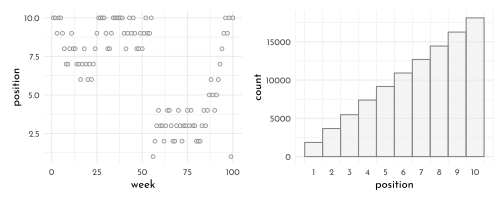

## Metropolis algotithms

> bivariate distribution “with a strong negative correlation of -0.9”

\begin{align*}
\begin{bmatrix} \text a_1 \\ \text a_2 \end{bmatrix} & \sim \operatorname{MVNormal} \left (\begin{bmatrix} 0 \\ 0 \end{bmatrix}, \mathbf \Sigma \right) \\
\mathbf \Sigma & = \mathbf{SRS} \\
\mathbf S & = \begin{bmatrix} 0.22 & 0 \\ 0 & 0.22 \end{bmatrix} \\
\mathbf R & = \begin{bmatrix} 1 & -.9 \\ -.9 & 1 \end{bmatrix},
\end{align*}


```r
# mean vector
mu <- c(0, 0)

# variance/covariance matrix
sd_a1 <- 0.22
sd_a2 <- 0.22
rho   <- -.9

Sigma <- matrix(data = c(sd_a1^2,
                         rho * sd_a1 * sd_a2,
                         rho * sd_a1 * sd_a2,
                         sd_a2^2),
                nrow = 2)

# sample from the distribution with the `mvtnorm::rmvnorm()` function
set.seed(9)

my_samples <- mvtnorm::rmvnorm(n = 1e3, mean = mu, sigma = Sigma)
```


```r
# just for demo - not actually used
data.frame(a = my_samples) %>% 
  as_tibble() %>% 
  set_names(str_c("a", 1:2)) %>% 
  summarise(rho = cor(a1, a2))
```

```
#> # A tibble: 1 × 1
#>      rho
#>    <dbl>
#> 1 -0.911
```


```r
# define the function
x_y_grid <- function(x_start = -1.6,
                     x_stop = 1.6,
                     x_length = 101,
                     y_start = -1.6,
                     y_stop = 1.6,
                     y_length = 101) {
  
  x_domain <- seq(from = x_start, to = x_stop, length.out = x_length)
  y_domain <- seq(from = y_start, to = y_stop, length.out = y_length)
  
  x_y_grid_tibble <- tidyr::expand_grid(a1 = x_domain, a2 = y_domain)
  
  return(x_y_grid_tibble)
  
}


# simulate
contour_plot_dat <- x_y_grid() %>% 
  mutate(d = mvtnorm::dmvnorm(as.matrix(.),
                              mean = mu, sigma = Sigma))
```


```r
p0 <- contour_plot_dat %>% 
  ggplot() + 
  geom_contour(aes(x = a1, y = a2, z = d), 
               size = 1/8, color = clr_dark,
               breaks = 9^(-(10 * 1:25))) +
  scale_x_continuous(expand = c(0, 0)) +
  scale_y_continuous(expand = c(0, 0))  +
  scale_shape_manual(values = c(21, 19)) +
  scale_color_manual(values = c(`FALSE` = clr0, `TRUE` = clr2)) +
  theme(panel.border = element_rect(color = clr_dark, fill = "transparent"))

metropolis <- function(num_proposals = 50,
                       step_size = 0.1,
                       starting_point = c(-1, 1),
                       seed = 42) {
  set.seed(seed)
  # Initialize vectors where we will keep track of relevant
  candidate_x_history <- rep(-Inf, num_proposals)
  candidate_y_history <- rep(-Inf, num_proposals)
  did_move_history <- rep(FALSE, num_proposals)
  
  # Prepare to begin the algorithm...
  current_point <- starting_point
  
  for(i in 1:num_proposals) {
    
    # "Proposals are generated by adding random Gaussian noise
    # to each parameter"
    
    noise <- rnorm(n = 2, mean = 0, sd = step_size)
    candidate_point <- current_point + noise
    
    # store coordinates of the proposal point
    candidate_x_history[i] <- candidate_point[1]
    candidate_y_history[i] <- candidate_point[2]
    
    # evaluate the density of our posterior at the proposal point
    candidate_prob <- mvtnorm::dmvnorm(candidate_point, mean = mu, sigma = Sigma)
    
    # evaluate the density of our posterior at the current point
    current_prob <- mvtnorm::dmvnorm(current_point, mean = mu, sigma = Sigma)
    
    # Decide whether or not we should move to the candidate point
    acceptance_ratio <- candidate_prob / current_prob
    should_move <- ifelse(runif(n = 1) < acceptance_ratio, TRUE, FALSE)
    
    # Keep track of the decision
    did_move_history[i] <- should_move
    
    # Move if necessary
    if(should_move) {
      current_point <- candidate_point
    }
  }
  
  # once the loop is complete, store the relevant results in a tibble
  results <- tibble::tibble(
    candidate_x = candidate_x_history,
    candidate_y = candidate_y_history,
    accept = did_move_history
  )
  
  # compute the "acceptance rate" by dividing the total number of "moves"
  # by the total number of proposals
  
  number_of_moves <- results %>% dplyr::pull(accept) %>% sum(.)
  acceptance_rate <- number_of_moves/num_proposals
  
  return(list(results = results, acceptance_rate = acceptance_rate))
  
}


round_1 <- metropolis(num_proposals = 50,
                      step_size = 0.1,
                      starting_point = c(-1,1))


round_2 <- metropolis(num_proposals = 50,
                      step_size = 0.25,
                      starting_point = c(-1,1))

p1 <- p0 + 
  geom_point(data = round_1$results,
             mapping = aes(x = candidate_x, y = candidate_y, 
                           color = accept, fill = after_scale(clr_alpha(color,.2))), shape = 21) +
  labs(subtitle = str_c("step size 0.1,\naccept rate ",
                        round_1$acceptance_rate), x = "a1")

p2 <- p0 + 
  geom_point(data = round_2$results,
             mapping = aes(x = candidate_x, y = candidate_y, 
                           color = accept, fill = after_scale(clr_alpha(color,.2))), shape = 21) +
  scale_y_continuous(NULL, breaks = NULL, expand = c(0, 0)) +
  labs(subtitle = str_c("step size 0.25,\naccept rate ",
                        round_2$acceptance_rate), x = "a1")

p1 + p2 + plot_layout(guides = "collect")
```

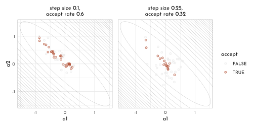


```r
concentration_sim <- function(dimensions = 1, t = 1e3, seed = 42) {
  
  set.seed(seed)
  
  y <- rethinking::rmvnorm(t, rep(0, dimensions), diag(dimensions))
  rad_dist <- function(y) sqrt(sum(y^2))
  rd <- sapply(1:t, function(i) rad_dist( y[i, ])) 
}

data_concentration <- tibble(dimensions = c(1, 10, 100, 1000)) %>% 
  mutate(con = map(dimensions, concentration_sim)) %>% 
  unnest(con) %>% 
  mutate(`# dimensions` = factor(dimensions)) 

data_concentration  %>% 
  ggplot(aes(x = con, fill = `# dimensions`)) +
  geom_density(size = .4, adjust = .6,
               aes(color = after_scale(clr_alpha(fill, 1)))) +
  scale_fill_manual(values = scales::colour_ramp(colors = c(clr0d, clr2) %>% clr_alpha())((0:3)/3)) +
  xlab("Radial distance from mode") +
  theme(legend.position = "bottom")
```


##  Hamiltonian Monte Carlo


```r
U <- function( q, a = 0, b = 1, k = 0, d = 1){
  muy <- q[1]
  mux <- q[2]
  U <- sum( dnorm(y , muy, 1, log = TRUE)) + sum( dnorm(x , mux, 1, log = TRUE)) +
   dnorm(muy, a, b, log = TRUE) + dnorm(mux, k, d, log = TRUE)
  return(-U)
}

U_gradient <- function(
  q , a = 0, b = 1, k = 0, d = 1){
  muy <- q[1]
  mux <- q[2]
  G1 <- sum( y - muy ) + (a - muy) / b ^ 2 # dU/dmuy
  G2 <- sum( x - mux ) + (a - mux) / b ^ 2 # dU/dmux
  return(c(-G1, -G2))                      # negative because energy is neg-log-prob
}

U1d <- function( q, a = 0, b = 1, k = 0, d = 1){
  muy <- q[1]
  U <- sum( dnorm(y , muy, 1, log = TRUE)) +
   dnorm(muy, a, b, log = TRUE)
  return(-U)
}

U1d_gradient <- function(
  q , a = 0, b = 1, k = 0, d = 1){
  muy <- q[1]
  G1 <- sum( y - muy ) + (a - muy) / b ^ 2 # dU/dmuy
  return(-G1)                      # negative because energy is neg-log-prob
}
```


```r
library(shape)
library(rethinking)
library(ggforce)
library(ggnewscale)

import_trajs <- function(Q, idx,names = c("x", "y")){
  traj <- Q$traj %>% 
    as_tibble() %>% 
    set_names(nm = names) %>% 
    mutate(leapfrog_step = row_number())
  
  ptraj <- Q$ptraj %>% 
    as_tibble() %>% 
    set_names(nm = str_c(names, "_p"))
  
  tibble(sample = idx, traj = list(bind_cols(traj, ptraj)))
}


contour_plot_dat_gaus <- x_y_grid(x_start = -.35,x_stop = .35,
                                  y_start = -.35, y_stop = .35) %>% 
  mutate(d = mvtnorm::dmvnorm(as.matrix(.),
                              mean = c(0,0),
                              sigma = matrix(c(1,0,0,1),nrow = 2)))

y <- rnorm(50)
y <- as.numeric(scale(y))
```


```r
set.seed(42)
  S <- list()
  Q <- list()
  Q$q <- .15
  pr <- .3
  step <- .03
  n_samples <- 20
  L <- 11
  
  for(i in 1:n_samples){
    Q <- HMC2(U = U1d, grad_U = U1d_gradient, epsilon = step, L = L, current_q = Q$q)
    for(j in 1:L){
      K0 <- sum(Q$ptraj[j,] ^ 2)/2 # kinetic energy
    }
    S[[i]] <- Q
  }

sample_tib <- map2_dfr(S, seq_along(S), import_trajs, names = c("y")) %>% 
    unnest(traj) %>% 
    mutate(k = (y_p ^ 2 ) /2 ,
           t = 1 + cumsum(leapfrog_step != 1))

# determining the positions of the iso-lines
dnorminv <- function(y){ sqrt(-2 * log(sqrt(2 * pi) * y)) }
brks_y <- ((184:192) * .005)
brks_y <- ((46:55) * .02)
brks_x0 <- dnorminv(exp(-brks_y))
brks_x <- rep(c(-1,1), each = length(brks_y)) * c(rev(brks_x0), brks_x0)

sample_tib %>% 
  ggplot(aes(t, y)) +
  geom_hline(yintercept = brks_x,
             color = clr0) +
  geom_link2(aes(group = sample, size = k),
             color = clr_dag) +
  scale_size_continuous(range = c(.15,3.5), guide = "none")+
  new_scale(new_aes = "size")+
  geom_point(data = . %>% filter(leapfrog_step == (L + 1)),
             size = 2.5,
             color = clr2,
             fill = clr_lighten(clr2),
             shape = 21) +
  geom_point(data = sample_tib %>% filter(row_number() %in% c(1, nrow(sample_tib))),
             color = clr2,
             shape = 1,
             size = 4.5) +
  scale_y_continuous(limits = c(-.55,.55),breaks = c(-.46,.46),
                     labels = c("South", "North"))  +
  scale_size_manual(values = c(`TRUE` = 2.5, `FALSE` = .5)) +
  scale_color_manual(values = c(`TRUE` = clr2, `FALSE` = clr0dd)) +
  coord_cartesian(ylim = c(-.5, .5), 
                  xlim = c(-1, 3 + n_samples*L), expand = 0) +
  labs(x = "time", y = "position")+
  theme(panel.border = element_rect(color = clr_dark, fill = "transparent"),
        panel.grid.major.x = element_blank(),
        panel.grid.minor.x = element_blank(),
        panel.grid.major.y = element_blank(),
        panel.grid.minor.y = element_blank(),
        axis.text.y = element_text(angle = 90, hjust = .5))
```


```r
monty_plot <- function(L = 11,
                       n_samples = 4,
                       contour_plot_dat,
                       contour_breaks,
                       seed = 42,
                       start_point = c(-.1,.2)){
  set.seed(seed)
  S <- list()
  Q <- list()
  Q$q <- start_point
  pr <- .3
  step <- .03
  
  for(i in 1:n_samples){
    Q <- HMC2(U = U, grad_U = U_gradient, epsilon = step, L = L, current_q = Q$q)
    for(j in 1:L){
      K0 <- sum(Q$ptraj[j,] ^ 2)/2 # kinetic energy
    }
    S[[i]] <- Q
  }
  
  sample_tib <- map2_dfr(S, seq_along(S), import_trajs) %>% 
    unnest(traj) %>% 
    mutate(k = (x_p ^ 2 + y_p ^ 2 ) /2 )
  
  sample_tib %>% 
    ggplot(aes(x, y)) +
    geom_contour(data = contour_plot_dat,
                 aes(x = a1, y = a2, z = d), 
                 size = .2,
                 breaks = contour_breaks,
                 color = clr_dark) +
    scale_x_continuous(expand = c(0, 0)) +
    scale_y_continuous(expand = c(0, 0))  +
    geom_link2(aes(group = sample, size = k),
               color = clr_dag) +
    scale_size_continuous(range = c(.15,3.5), guide = "none")+
    new_scale(new_aes = "size")+
    geom_point(data = . %>% filter(leapfrog_step > 1),
               aes(size = leapfrog_step == (L + 1),
                   color = leapfrog_step == (L + 1),
                   fill = after_scale(clr_lighten(color,.3))),
               shape = 21) +
    geom_point(data = sample_tib %>% filter(row_number() %in% c(1, nrow(sample_tib))),
               color = clr2,
               shape = 1,
               size = 4.5) +
    scale_size_manual(values = c(`TRUE` = 2.5, `FALSE` = .5)) +
    scale_color_manual(values = c(`TRUE` = clr2, `FALSE` = clr0dd)) +
    theme(panel.border = element_rect(color = clr_dark, fill = "transparent"))
}
```


```r
x <- rnorm(50)
x <- as.numeric(scale(x))

monty_plot(contour_plot_dat = contour_plot_dat_gaus,
           contour_breaks = .001* seq(146,160, by = 2.5),
           seed = 23) +
monty_plot(L = 28,
           contour_plot_dat = contour_plot_dat_gaus,
           contour_breaks = .001* seq(146,160, by = 2.5),
           seed = 23) +
  theme(axis.title.y = element_blank(),
        axis.text.y = element_blank()) +
  plot_layout(guides = "collect") &
  theme(legend.position = "bottom")
```


## Easy HMC: `rethinking::ulam()`

Revisiting the ruggedness model:

$$
\begin{array}{rclr}
log(y_{i}) & \sim & Normal( \mu_{i}, \sigma) & \textrm{[likelihood]}\\
\mu_{i} & = & \alpha_{CID[i]} + \beta_{CID[i]} (r_{i} - \overline{r}) & \textrm{[linear model]}\\
\alpha & \sim & Normal(1, 0.1) & \textrm{[$\alpha$ prior]}\\
\beta & \sim & Normal(0, 0.3) & \textrm{[$\beta$ prior]}\\
\sigma & \sim & Exponential(1)  & \textrm{[$\sigma$ prior]}
\end{array}
$$


```r
data(rugged)

data_rugged <- rugged %>% 
  as_tibble() %>% 
  mutate(log_gdp = log(rgdppc_2000)) %>% 
  filter(complete.cases(rgdppc_2000)) %>% 
  mutate(log_gdp_std = log_gdp / mean(log_gdp),
         rugged_std = rugged / max(rugged),
         cont_idx = as.integer(2 - cont_africa))
```

The old way using `quap()`


```r
model_rugged_slope <- quap(
   flist = alist(
    log_gdp_std ~ dnorm(mu, sigma),
    mu <- alpha[cont_idx] + beta[cont_idx] * ( rugged_std - 0.215 ),
    alpha[cont_idx] ~ dnorm(1, 0.1),
    beta[cont_idx] ~ dnorm(0, 0.3),
    sigma ~ dexp(1)
  ),
  data = data_rugged
)

precis(model_rugged_slope, depth = 2) %>% 
  knit_precis()
```


|param    |  mean|   sd|  5.5%| 94.5%|
|:--------|-----:|----:|-----:|-----:|
|alpha[1] |  0.89| 0.02|  0.86|  0.91|
|alpha[2] |  1.05| 0.01|  1.03|  1.07|
|beta[1]  |  0.13| 0.07|  0.01|  0.25|
|beta[2]  | -0.14| 0.05| -0.23| -0.06|
|sigma    |  0.11| 0.01|  0.10|  0.12|

Using `Stan` / `ulam()`:


```r
data_rugged_list <- data_rugged %>% 
  dplyr::select(log_gdp_std:cont_idx) %>% 
  as.list()

model_rugged_slope_stan <- ulam(
   flist = alist(
    log_gdp_std ~ dnorm(mu, sigma),
    mu <- alpha[cont_idx] + beta[cont_idx] * ( rugged_std - 0.215 ),
    alpha[cont_idx] ~ dnorm(1, 0.1),
    beta[cont_idx] ~ dnorm(0, 0.3),
    sigma ~ dexp(1)
  ),
  data = data_rugged_list,
  chains = 4,
  cores = 4
)
```

Looking at the translated Stan code


```r
stancode(model_rugged_slope_stan)
```

```
#> data{
#>     vector[170] log_gdp_std;
#>     vector[170] rugged_std;
#>     int cont_idx[170];
#> }
#> parameters{
#>     vector[2] alpha;
#>     vector[2] beta;
#>     real<lower=0> sigma;
#> }
#> model{
#>     vector[170] mu;
#>     sigma ~ exponential( 1 );
#>     beta ~ normal( 0 , 0.3 );
#>     alpha ~ normal( 1 , 0.1 );
#>     for ( i in 1:170 ) {
#>         mu[i] = alpha[cont_idx[i]] + beta[cont_idx[i]] * (rugged_std[i] - 0.215);
#>     }
#>     log_gdp_std ~ normal( mu , sigma );
#> }
```

The model summaries


```r
show(model_rugged_slope_stan)
```

```
#> Hamiltonian Monte Carlo approximation
#> 2000 samples from 4 chains
#> 
#> Sampling durations (seconds):
#>         warmup sample total
#> chain:1   0.04   0.03  0.07
#> chain:2   0.04   0.03  0.07
#> chain:3   0.04   0.03  0.06
#> chain:4   0.04   0.03  0.06
#> 
#> Formula:
#> log_gdp_std ~ dnorm(mu, sigma)
#> mu <- alpha[cont_idx] + beta[cont_idx] * (rugged_std - 0.215)
#> alpha[cont_idx] ~ dnorm(1, 0.1)
#> beta[cont_idx] ~ dnorm(0, 0.3)
#> sigma ~ dexp(1)
```

```r
precis(model_rugged_slope_stan, depth = 2) %>% 
  knit_precis()
```


|param    |  mean|   sd|  5.5%| 94.5%|   n_eff| Rhat4|
|:--------|-----:|----:|-----:|-----:|-------:|-----:|
|alpha[1] |  0.89| 0.02|  0.86|  0.91| 2435.26|     1|
|alpha[2] |  1.05| 0.01|  1.03|  1.07| 3005.13|     1|
|beta[1]  |  0.13| 0.08|  0.01|  0.25| 2783.03|     1|
|beta[2]  | -0.14| 0.05| -0.23| -0.06| 2377.51|     1|
|sigma    |  0.11| 0.01|  0.10|  0.12| 3068.93|     1|


```r
extract.samples(model_rugged_slope_stan) %>% 
  as.data.frame() %>% 
  as_tibble() %>% 
  ggpairs(
     lower = list(continuous = wrap(my_lower)),
        diag = list(continuous = wrap("densityDiag", fill = fll0,
                                      color = clr0d, adjust = .7)),
        upper = list(continuous = wrap(my_upper ,
          size = 5, color = "black", family = "Josefin sans")) ) +
    theme(panel.border = element_rect(color = clr_dark, fill = "transparent"))
```


The density for $\sigma$ is skewed, which is expected.

### Checking the Chain

**Trace plot**


```r
library(ggmcmc)

rugged_pars <- c("alpha[1]", "alpha[2]", "beta[1]", "beta[2]")
clr_chains <- function(n = 4, alpha = .7, col = clr2){scales::colour_ramp(colors = c(clr0dd, col))(seq(0,1,length.out = n))%>% clr_lighten(.2) %>% clr_alpha(alpha = alpha)}

ggs(model_rugged_slope_stan@stanfit, inc_warmup = TRUE) %>%
  mutate(chain = factor(Chain)) %>% 
  filter(Parameter != "sigma") %>% 
  ggplot(aes(x = Iteration, y = value)) +
  annotate(geom = "rect", 
           xmin = 0, xmax = 500, ymin = -Inf, ymax = Inf,
           fill = clr0d, alpha = .3, size = 0) +
  geom_line(aes(color = chain),
            size = .15) +
  scale_color_manual(values = clr_chains() ) +
  facet_wrap(~ Parameter, scales = "free_y") +
    labs(title = "custom trace plots with warmups via ggmcmc::ggs()",
       x = NULL, y = NULL) +
  theme(legend.position = "bottom") 
```

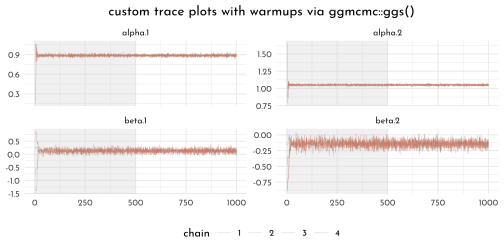

**Trace Rank plot**


```r
library(bayesplot)
model_rugged_slope_stan@stanfit %>% 
  mcmc_rank_overlay(pars = vars(`alpha[1]`:`beta[2]`), n_bins = 60) +
  scale_color_manual(values = clr_chains() ) +
  ggtitle("custom trank plots") +
  # coord_cartesian(ylim = c(0, NA)) +
  theme(legend.position = "bottom")
```


## Care and feeding of your Markov Chain


```r
set.seed(11)
model_flat <- ulam(
  flist = alist(
    y ~ dnorm( mu, sigma ),
    mu <- alpha,
    alpha ~ dnorm( 0, 1000 ),
    sigma ~ dexp( 0.0001 )
  ),
  data = list(y = c(-1, 1)),
  chains = 3
)
```


```r
precis(model_flat) %>% 
  knit_precis()
```


|param |   mean|      sd|    5.5%|   94.5%|  n_eff| Rhat4|
|:-----|------:|-------:|-------:|-------:|------:|-----:|
|alpha | -30.28|  334.06| -622.79|  381.89| 116.47|  1.03|
|sigma | 626.24| 1475.25|    6.93| 2764.99| 106.15|  1.05|


```r
p1 <- ggs(model_flat@stanfit, inc_warmup = TRUE) %>%
  mutate(chain = factor(Chain)) %>% 
  ggplot(aes(x = Iteration, y = value)) +
  annotate(geom = "rect", 
           xmin = 0, xmax = 500, ymin = -Inf, ymax = Inf,
           fill = clr0d, alpha = .3, size = 0) +
  geom_line(aes(color = chain),
            size = .25) +
  scale_color_manual(values = clr_chains(alpha = 1), guide ="none") +
  facet_wrap(~ Parameter, scales = "free_y") +
    labs(x = NULL, y = NULL)

p2 <- model_flat@stanfit %>% 
  mcmc_rank_overlay(pars = vars(`alpha`:`sigma`), n_bins = 60) +
  scale_color_manual(values = clr_chains(), guide ="none")

p1 / p2
```


```r
extract.samples(model_flat) %>% 
  as.data.frame() %>% 
  as_tibble() %>% 
  ggpairs(
     lower = list(continuous = wrap(my_lower)),
        diag = list(continuous = wrap("densityDiag", fill = fll0,
                                      color = clr0d, adjust = .7)),
        upper = list(continuous = wrap(my_upper ,
          size = 5, color = "black", family = "Josefin sans")) ) +
    theme(panel.border = element_rect(color = clr_dark, fill = "transparent"))
```


```r
set.seed(11)
model_less_flat <- ulam(
  flist = alist(
    y ~ dnorm( mu, sigma ),
    mu <- alpha,
    alpha ~ dnorm( 1, 10 ),
    sigma ~ dexp( 1 )
  ),
  data = list(y = c(-1, 1)),
  chains = 3
)

precis(model_less_flat) %>% 
  knit_precis()
```


```r
p1 <- ggs(model_less_flat@stanfit, inc_warmup = TRUE) %>%
  mutate(chain = factor(Chain)) %>% 
  ggplot(aes(x = Iteration, y = value)) +
  annotate(geom = "rect", 
           xmin = 0, xmax = 500, ymin = -Inf, ymax = Inf,
           fill = clr0d, alpha = .3, size = 0) +
  geom_line(aes(color = chain),
            size = .25) +
  scale_color_manual(values = clr_chains(alpha = 1), guide ="none") +
  facet_wrap(~ Parameter, scales = "free_y") +
    labs(x = NULL, y = NULL)

p2 <- model_less_flat@stanfit %>% 
  mcmc_rank_overlay(pars = vars(`alpha`:`sigma`), n_bins = 60) +
  scale_color_manual(values = clr_chains(), guide ="none")

p1 / p2
```

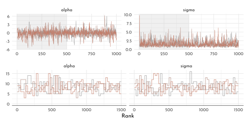


```r
less_flat_draws <- as_draws_df(model_less_flat@stanfit) %>% 
  as_tibble() %>% 
  dplyr::select(alpha, sigma)

p1 <- less_flat_draws %>% 
  ggplot(aes(x = alpha)) +
  geom_density(aes(color = "posterior", fill = after_scale(clr_alpha(color)))) +
  stat_function(fun = function(x){dnorm(x, 1 , 10)},
                linetype = 2, aes(color = "prior")) +
  scale_x_continuous(limits = c(-15, 15))

p2 <- less_flat_draws %>% 
  ggplot(aes(x = sigma)) +
  geom_density(aes(color = "posterior", fill = after_scale(clr_alpha(color)))) +
  stat_function(fun = function(x){dexp(x, 1)},
                linetype = 2, aes(color = "prior")) +
  scale_x_continuous(limits = c(0, 10)) 

p1 + p2  +
  plot_layout(guides = "collect") & 
  scale_color_manual("", values = c(prior = clr_dark, posterior = clr2)) & 
  labs(y = "density") &
  theme(legend.position = "bottom")
```


### Non-identifiable parameters


```r
set.seed(41)
y <- rnorm(n = 100, mean = 0, sd = 1)
```

$$
\begin{array}{rclr}
y_{i} & \sim & Normal( \mu_{i}, \sigma) & \textrm{[likelihood]}\\
\mu_{i} & = & \alpha_{1} + \alpha_{2} & \textrm{[linear model]}\\
\alpha_{1} & \sim & Normal(1, 1000) & \textrm{[$\alpha_{1}$ prior]}\\
\alpha_{2} & \sim & Normal(1, 1000) & \textrm{[$\alpha_{2}$ prior]}\\
\sigma & \sim & Exponential(1)  & \textrm{[$\sigma$ prior]}
\end{array}
$$


```r
model_non_identifiable <- ulam(
  flist = alist(
    y ~ dnorm(mu, sigma),
    mu <- alpha_1 + alpha_2,
    alpha_1 ~ dnorm(0, 1000),
    alpha_2 ~ dnorm(0, 1000),
    sigma ~ dexp(1)
  ),
  data = list(y = y ),
  chains = 3
)
```


```r
precis(model_non_identifiable) %>% 
  knit_precis()
```


|param   |   mean|     sd|    5.5%|  94.5%| n_eff| Rhat4|
|:-------|------:|------:|-------:|------:|-----:|-----:|
|alpha_1 | -28.50| 242.64| -395.39| 439.07|  6.75|  1.71|
|alpha_2 |  28.69| 242.64| -438.94| 395.54|  6.75|  1.71|
|sigma   |   1.03|   0.06|    0.94|   1.11| 76.61|  1.02|

Suspicious estimates, and terrible `n_eff` (should be close to number of iterations) and `Rhat` (should be 1).


```r
p1 <- ggs(model_non_identifiable@stanfit, inc_warmup = TRUE) %>%
  mutate(chain = factor(Chain)) %>% 
  ggplot(aes(x = Iteration, y = value)) +
  annotate(geom = "rect", 
           xmin = 0, xmax = 500, ymin = -Inf, ymax = Inf,
           fill = clr0d, alpha = .3, size = 0) +
  geom_line(aes(color = chain),
            size = .25) +
  scale_color_manual(values = clr_chains(alpha = 1), guide ="none") +
  facet_wrap(~ Parameter, scales = "free_y") +
    labs(x = NULL, y = NULL)

p2 <- model_non_identifiable@stanfit %>% 
  mcmc_rank_overlay(pars = vars(`alpha_1`:`sigma`), n_bins = 60) +
  scale_color_manual(values = clr_chains(), guide ="none")

p1 / p2
```

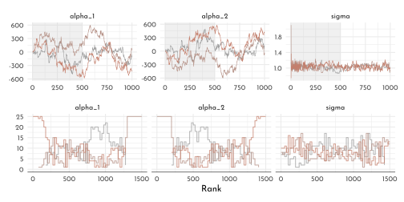


```r
extract.samples(model_non_identifiable) %>% 
  as.data.frame() %>% 
  as_tibble() %>% 
  ggpairs(
     lower = list(continuous = wrap(my_lower)),
        diag = list(continuous = wrap("densityDiag", fill = fll0,
                                      color = clr0d, adjust = .7)),
        upper = list(continuous = wrap(my_upper ,
          size = 5, color = "black", family = "Josefin sans")) ) +
    theme(panel.border = element_rect(color = clr_dark, fill = "transparent"))
```

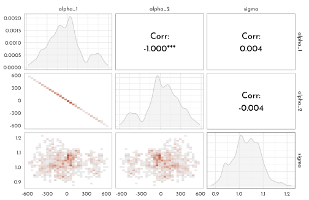

Adding weakly regularizing priors

$$
\begin{array}{rclr}
\alpha_{1} & \sim & Normal(1, 10) & \textrm{[$\alpha_{1}$ prior]}\\
\alpha_{2} & \sim & Normal(1, 10) & \textrm{[$\alpha_{2}$ prior]}\\
\end{array}
$$


```r
model_non_identifiable_regularized <- ulam(
  flist = alist(
    y ~ dnorm(mu, sigma),
    mu <- alpha_1 + alpha_2,
    alpha_1 ~ dnorm(0, 10),
    alpha_2 ~ dnorm(0, 10),
    sigma ~ dexp(1)
  ),
  data = list(y = y ),
  chains = 3
)
```


```r
precis(model_non_identifiable_regularized) %>% 
  knit_precis()
```


|param   |  mean|   sd|   5.5%| 94.5%|  n_eff| Rhat4|
|:-------|-----:|----:|------:|-----:|------:|-----:|
|alpha_1 |  0.23| 6.99| -11.04| 11.13| 330.16|     1|
|alpha_2 | -0.04| 6.99| -10.89| 11.25| 329.91|     1|
|sigma   |  1.04| 0.07|   0.94|  1.18| 616.54|     1|


```r
p1 <- ggs(model_non_identifiable_regularized@stanfit, inc_warmup = TRUE) %>%
  mutate(chain = factor(Chain)) %>% 
  ggplot(aes(x = Iteration, y = value)) +
  annotate(geom = "rect", 
           xmin = 0, xmax = 500, ymin = -Inf, ymax = Inf,
           fill = clr0d, alpha = .3, size = 0) +
  geom_line(aes(color = chain),
            size = .25) +
  scale_color_manual(values = clr_chains(alpha = .6, col = clr3), guide ="none") +
  facet_wrap(~ Parameter, scales = "free_y") +
    labs(x = NULL, y = NULL)

p2 <- model_non_identifiable_regularized@stanfit %>% 
  mcmc_rank_overlay(pars = vars(`alpha_1`:`sigma`), n_bins = 60) +
  scale_color_manual(values = clr_chains(col = clr3), guide ="none")

p1 / p2
```


```r
extract.samples(model_non_identifiable_regularized) %>% 
  as.data.frame() %>% 
  as_tibble() %>% 
  ggpairs(
     lower = list(continuous = wrap(my_lower, col = clr3)),
        diag = list(continuous = wrap("densityDiag", fill = fll0,
                                      color = clr0d, adjust = .7)),
        upper = list(continuous = wrap(my_upper ,
          size = 5, color = "black", family = "Josefin sans")) ) +
    theme(panel.border = element_rect(color = clr_dark, fill = "transparent"))
```


---


```r
library(rlang)
chapter9_models <- env(
  model_flat = model_flat,
  model_less_flat = model_less_flat,
  model_non_identifiable = model_non_identifiable,
  model_non_identifiable_regularized = model_non_identifiable_regularized,
  model_rugged_slope = model_rugged_slope,
  model_rugged_slope_stan = model_rugged_slope_stan,
  data_rugged = data_rugged,
  data_rugged_list = data_rugged_list,
  data_concentration = data_concentration,
  data_markov = data_markov
)

write_rds(chapter9_models, "envs/chapter9_models.rds")
```

## Homework

**E1**

For the Metropolis algorithm, the following requirements need to hold:

- ~~the parameters must be discrete~~
- the likelihood function must be Gaussian
- the the proposal function must be symmetric

**E2**

Gibbs sampling can be more efficient because it used additional information.
It applies *adaptive sampling* with the use of *conjugated priors* (combination of prior distributions and and likelihoods).

**E3**

Hamiltonian Monte Carlo can not handle discrete parameters, since the length of a step within a chain needs to be of random length (it needs to *glide through* the parameter).

**E4**

The effective number of samples (`n_eff`) represents the length on a Markov Chain with no autocorrelation that would provide the same quality of estimates as the provided one.
The `n_eff` can even be longer than the actual Markov Chain used to sample, provided it displays anti-correlation (following E.T. Jaynes quote).

**E5**

$\hat{R}$ should approach 1 to indicate proper sampling (it can indicate presence issues, but much less their absence).

**E6**

The trace plot should indicate *stationarity*, *convergence* and *coverage*.
This means, the average of the chains should not drift, separate chains should wiggle around the same mean and explore (zig-zag) the a large parameter space (aka. *good mixing*).
So, if the chain is wandering around the parameter space, if different chains seem to disagree or if regions of the parameter space are not covered, this indicates issues with the Markov chain.

**E7**

The trace rank plot should indicate that all chains should receive a uniform and equal distribution of ranks - if one is systematically displaying higher or lower ranks in a region, this indicates problems. 

**M1**


```r
model_rugged_slope_unif <- ulam(
   flist = alist(
    log_gdp_std ~ dnorm(mu, sigma),
    mu <- alpha[cont_idx] + beta[cont_idx] * ( rugged_std - 0.215 ),
    alpha[cont_idx] ~ dnorm(1, 0.1),
    beta[cont_idx] ~ dnorm(0, 0.3),
    sigma ~ dunif(0, 1)
  ),
  data = data_rugged_list,
  chains = 4,
  cores = 4
)
```


```r
precis(model_rugged_slope_unif, depth = 2) %>% 
  knit_precis()
```


|param    |  mean|   sd|  5.5%| 94.5%|   n_eff| Rhat4|
|:--------|-----:|----:|-----:|-----:|-------:|-----:|
|alpha[1] |  0.89| 0.02|  0.86|  0.91| 2571.83|     1|
|alpha[2] |  1.05| 0.01|  1.03|  1.07| 2934.16|     1|
|beta[1]  |  0.13| 0.08|  0.01|  0.25| 2244.02|     1|
|beta[2]  | -0.14| 0.06| -0.23| -0.05| 2156.33|     1|
|sigma    |  0.11| 0.01|  0.10|  0.12| 2430.06|     1|

$\rightarrow$ There is no detectable influence of changing the $\sigma$ prior.
This is likely because there is enough data to overwrite the prior (and the Uniform prior does not go to infinity and is thus more informative than the previous flat prior examples).


**M2**


```r
model_rugged_slope_beta_off <- ulam(
   flist = alist(
    log_gdp_std ~ dnorm(mu, sigma),
    mu <- alpha[cont_idx] + beta[cont_idx] * ( rugged_std - 0.215 ),
    alpha[cont_idx] ~ dnorm(1, 0.1),
    beta[cont_idx] ~ dexp(0.3),
    sigma ~ dexp(1)
  ),
  data = data_rugged_list,
  chains = 4,
  cores = 4
)
```


```r
precis(model_rugged_slope_beta_off, depth = 2) %>% 
  knit_precis()
```


|param    | mean|   sd| 5.5%| 94.5%|   n_eff| Rhat4|
|:--------|----:|----:|----:|-----:|-------:|-----:|
|alpha[1] | 0.89| 0.02| 0.86|  0.91| 1791.63|     1|
|alpha[2] | 1.05| 0.01| 1.03|  1.06| 2045.17|     1|
|beta[1]  | 0.15| 0.08| 0.03|  0.27|  750.24|     1|
|beta[2]  | 0.02| 0.02| 0.00|  0.05| 1837.84|     1|
|sigma    | 0.11| 0.01| 0.10|  0.13| 1956.89|     1|

$\rightarrow$ $\beta_{[2]}$ is now forced to be positive, despite the fact that the unconstrained model estimated it to be negative.
This also influences $\beta_{[1]}$, but the estimates for $\alpha$ and $\sigma$ stay unchanged (`n_eff` is always lower though).

**M3**


```r
check_warmpup <- function(w){
  model_rugged_slope_stan_w <- ulam(
    flist = alist(
      log_gdp_std ~ dnorm(mu, sigma),
      mu <- alpha[cont_idx] + beta[cont_idx] * ( rugged_std - 0.215 ),
      alpha[cont_idx] ~ dnorm(1, 0.1),
      beta[cont_idx] ~ dnorm(0, 0.3),
      sigma ~ dexp(1)
    ),
    data = data_rugged_list,
    chains = 4,
    cores = 4,
    warmup = w,
    iter = 1e3
  )
  
  precis(model_rugged_slope_stan_w, depth = 2) %>% 
    as.matrix() %>% 
    as.data.frame() %>% 
    rownames_to_column() %>% 
    mutate(w = w)
}

check_warmpup_output <- c(10, 30, 75) %>% 
  map_dfr(check_warmpup) %>% 
  mutate(across(mean:Rhat4, ~ round(.x, digits = 2)))
```


```r
check_warmpup_output %>% 
  knitr::kable()
```


|rowname  |  mean|   sd|  5.5%| 94.5%|   n_eff| Rhat4|  w|
|:--------|-----:|----:|-----:|-----:|-------:|-----:|--:|
|alpha[1] |  0.89| 0.02|  0.86|  0.91|  585.97|  1.01| 10|
|alpha[2] |  1.05| 0.01|  1.04|  1.07|  576.64|  1.01| 10|
|beta[1]  |  0.13| 0.10|  0.00|  0.27|   54.79|  1.09| 10|
|beta[2]  | -0.14| 0.06| -0.23| -0.05|  314.01|  1.00| 10|
|sigma    |  0.11| 0.01|  0.10|  0.12|  310.73|  1.01| 10|
|alpha[1] |  0.89| 0.02|  0.86|  0.91| 3824.28|  1.00| 30|
|alpha[2] |  1.05| 0.01|  1.03|  1.07| 4638.37|  1.00| 30|
|beta[1]  |  0.13| 0.08|  0.01|  0.25| 1624.62|  1.00| 30|
|beta[2]  | -0.14| 0.06| -0.23| -0.05| 2445.98|  1.00| 30|
|sigma    |  0.11| 0.01|  0.10|  0.12| 2337.22|  1.00| 30|
|alpha[1] |  0.89| 0.02|  0.86|  0.91| 3803.35|  1.00| 75|
|alpha[2] |  1.05| 0.01|  1.03|  1.07| 4143.25|  1.00| 75|
|beta[1]  |  0.13| 0.08|  0.00|  0.25| 1438.09|  1.00| 75|
|beta[2]  | -0.14| 0.06| -0.23| -0.05| 2507.07|  1.00| 75|
|sigma    |  0.11| 0.01|  0.10|  0.12| 2239.18|  1.00| 75|

$\rightarrow$ 30 iterations for the warm-up already is a massive jump in terms of `n_eff` compared to 10.

**H1**


```r
ggplot() +
  stat_function(fun = function(x){dcauchy(x,location = 0 ,scale = 1)},
                xlim = c(-9, 9), n = 301, geom = "area", 
                color = clr0d, fill = fll0) +
    stat_function(fun = function(x){dnorm(x, mean = 0, sd = 1)},
                xlim = c(-9, 9), n = 301, geom = "line", 
                color = clr_dark, linetype = 3) +
  labs(subtitle = "location: 0\nscale: 1",
       y = "density")
```

<div class="figure" style="text-align: center">
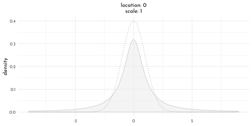
<p class="caption">(\#fig:unnamed-chunk-39)the Cauchy distribution (compared to a normal distribution).</p>
</div>


```r
set.seed(42)
model_cauchy <- ulam(
  flist = alist(
    a ~ dnorm(0, 1),
    b ~ dcauchy(0, 1)
  ),
  data = list( y = 1),
  chains = 1
)
```


```r
precis(model_cauchy) %>% 
  knit_precis()
```


|param | mean|    sd|   5.5%| 94.5%|  n_eff| Rhat4|
|:-----|----:|-----:|------:|-----:|------:|-----:|
|a     | 0.11|  1.07|  -1.48|  1.80|  44.92|     1|
|b     | 0.49| 22.75| -14.75|  9.06| 164.30|     1|


```r
ggs(model_cauchy@stanfit, inc_warmup = TRUE) %>%
  ggplot(aes(x = Iteration, y = value)) +
  annotate(geom = "rect", 
           xmin = 0, xmax = 500, ymin = -Inf, ymax = Inf,
           fill = clr0d, alpha = .3, size = 0) +
  geom_line(size = .25, color = clr_alpha(clr2,.7)) +
  scale_color_manual(values = clr_chains(alpha = .6, col = clr3), guide ="none") +
  facet_wrap(~ Parameter, scales = "free_y") +
    labs(x = NULL, y = NULL)
```

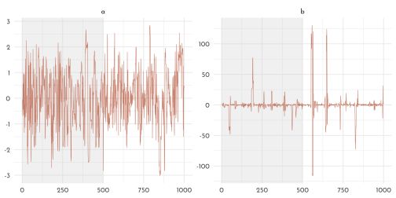

$\rightarrow$ The Cauchy distribution does have much wider tails than the normal distribution. This makes the prior somewhat more flat and less regularizing, which allows the chain to make more excursions to the more extreme parameter space ($> 10$).


**H2**


```r
chapter5_models <- read_rds("envs/chapter5_models.rds")
```


```r
data_waffle_age_list <- chapter5_models$data_waffle %>% 
  dplyr::select(divorce_std, median_age_std) %>% 
  as.list()

model_age_stan <- ulam(
  flist = alist(
    divorce_std ~ dnorm( mu, sigma ) ,
    mu <- alpha + beta_A * median_age_std ,
    alpha ~ dnorm( 0, 0.2 ),
    beta_A ~ dnorm( 0, 0.5 ),
    sigma ~ dexp( 1 )
  ),
  data = data_waffle_age_list,
  chains = 4, cores = 4,
  log_lik = TRUE
)

data_waffle_marriage_list <- chapter5_models$data_waffle %>% 
  dplyr::select(divorce_std, marriage_std) %>% 
  as.list()

model_marriage_stan <- ulam(
  flist = alist(
    divorce_std ~ dnorm( mu, sigma ) ,
    mu <- alpha + beta_M * marriage_std ,
    alpha ~ dnorm( 0, 0.2 ),
    beta_M ~ dnorm( 0, 0.5 ),
    sigma ~ dexp( 1 )
  ),
  data = data_waffle_marriage_list,
  chains = 4, cores = 4,
  log_lik = TRUE
)

data_waffle_multiple_list <- chapter5_models$data_waffle %>% 
  dplyr::select(divorce_std, median_age_std, marriage_std) %>% 
  as.list()

model_multiple_stan <- ulam(
  flist = alist(
      divorce_std ~ dnorm( mu, sigma ) ,
    mu <- alpha + beta_M * marriage_std + beta_A * median_age_std,
    alpha ~ dnorm( 0, 0.2 ),
    beta_A ~ dnorm( 0, 0.5 ),
    beta_M ~ dnorm( 0, 0.5 ),
    sigma ~ dexp( 1 )
  ),
  data = data_waffle_multiple_list,
  chains = 4, cores = 4,
  log_lik = TRUE
)
```

comparing the fits with `ulam()`


```r
compare(model_age_stan,
        model_marriage_stan,
        model_multiple_stan)
```

as reference the old fits with `quap()`


```r
compare(chapter5_models$model_age,
        chapter5_models$model_marriage,
        chapter5_models$model_multiple)
```

```
#>                                    WAIC       SE    dWAIC        dSE    pWAIC
#> chapter5_models$model_age      127.2710 14.41392  0.00000         NA 4.596311
#> chapter5_models$model_multiple 129.1756 14.48622  1.90464  0.9901551 5.820602
#> chapter5_models$model_marriage 140.1808 10.89342 12.90978 10.7806058 3.512297
#>                                     weight
#> chapter5_models$model_age      0.720763509
#> chapter5_models$model_multiple 0.278102866
#> chapter5_models$model_marriage 0.001133625
```


$\rightarrow$ The weight is shared between the *age only* and the *age & marriage status* models, which are also close but distinct in terms of WAIC.
There seems to be a slight preference for the *age only* model, but that would be debatable --- in any case it seems to be the case that `age` does the heavy lifting in terms of prediction.

**H3**


```r
n <- 100
set.seed(909)
data_legs_list <- tibble(
  height = rnorm(n = n, mean = 10, sd = 2),
  leg_proportion = runif(n, min = 0.4, max = 0.5),
  left_leg = leg_proportion * height + rnorm(n, 0, .02),
  right_leg = leg_proportion * height + rnorm(n, 0, .02)) %>% 
  dplyr::select(height, left_leg, right_leg) %>% 
  as.list()

model_legs_multicollinear_stan <- ulam(
  flist = alist(
    height ~ dnorm(mu, sigma),
    mu <- alpha + beta_left * left_leg + beta_right * right_leg,
    alpha ~ dnorm(10, 100),
    beta_left ~ dnorm(2, 10),
    beta_right ~ dnorm(2, 10),
    sigma ~ dexp(1)
  ),
  data = data_legs_list,
  chains = 4,
  cores = 4,
  log_lik = TRUE,
  start = list(alpha = 10,
               beta_left = 0,
               beta_right = 0,
               sigma = 1)
)

model_legs_multicollinear_stan_constrained <- ulam(
  flist = alist(
    height ~ dnorm(mu, sigma),
    mu <- alpha + beta_left * left_leg + beta_right * right_leg,
    alpha ~ dnorm(10, 100),
    beta_left ~ dnorm(2, 10),
    beta_right ~ dnorm(2, 10),
    sigma ~ dexp(1)
  ),
  data = data_legs_list,
  chains = 4,
  cores = 4,
  log_lik = TRUE,
  constraints = list(beta_right = "lower=0"),
  start = list(alpha = 10,
               beta_left = 0,
               beta_right = 0.1,
               sigma = 1)
)
```


```r
wrap_elements(ggmatrix_gtable(posterior_pairs(model_legs_multicollinear_stan,
                                              col = clr2,
                                              title = "unconstrained"))) +
wrap_elements(ggmatrix_gtable(posterior_pairs(model_legs_multicollinear_stan_constrained,
                                              col = clr2,
                                              title = "constrained")))
```


$\rightarrow$ containing $\beta_{right}$ to be positive forces $\beta_{left}$ to be (mostly) negative.


**H4**


```r
compare(model_legs_multicollinear_stan,
        model_legs_multicollinear_stan_constrained)
```

```
#>                                                WAIC       SE     dWAIC
#> model_legs_multicollinear_stan_constrained 194.3730 11.24082 0.0000000
#> model_legs_multicollinear_stan             195.2634 11.24420 0.8903366
#>                                                  dSE    pWAIC    weight
#> model_legs_multicollinear_stan_constrained        NA 2.834342 0.6094898
#> model_legs_multicollinear_stan             0.6242321 3.243090 0.3905102
```


```r
precis(model_legs_multicollinear_stan)
```

```
#>                 mean         sd       5.5%     94.5%     n_eff     Rhat4
#> alpha      0.9789570 0.27922534  0.5176528 1.4083767 1047.2334 1.0022109
#> beta_left  0.2314571 2.68796128 -4.0451582 4.5062469  843.6087 1.0006904
#> beta_right 1.7642327 2.69026759 -2.5084165 6.0744526  844.8523 1.0007602
#> sigma      0.6343543 0.04710884  0.5641138 0.7106078 1049.2715 0.9995547
```


```r
precis(model_legs_multicollinear_stan_constrained)
```

```
#>                  mean         sd       5.5%     94.5%    n_eff    Rhat4
#> alpha       0.9826006 0.29685701  0.5183266 1.4524584 899.3052 1.002881
#> beta_left  -0.7046059 1.79741498 -4.0328126 1.7363541 479.4671 1.001801
#> beta_right  2.7001266 1.80259942  0.2397091 6.0168358 479.8602 1.001750
#> sigma       0.6328119 0.04528771  0.5634368 0.7100542 993.9975 1.000004
```

$\rightarrow$ The constrained model has only about half the `n_eff` compared to the unconstrained one - probably, that is because half of the parameter space is problematic.
Particularly in the high density area of 0.

**H5**


```r
set.seed(42)
n_weeks <- 1e5
positions <-  rep(0, n_weeks)
populations <- sample(1:10,size = 10)

current <- 10
for( i in seq_along(positions)){
  # record the current position
  positions[i] <- current
  
  # flip the coin to get the proposal
  proposal <- current + sample(c(-1, 1), size = 1)
  # connecting the edges to make the archipelago circular
  if(proposal == 0){proposal <- 10}
  if(proposal == 11){proposal <- 1}
  
  # decide whether to move
  prob_move <- populations[proposal]/populations[current]
  current <- ifelse(runif(1) < prob_move, proposal, current)
}

data_markov <- tibble(
  week = seq_along(positions),
  position = positions)

data_markov_max <- data_markov %>% 
  group_by(position) %>% 
  count() %>% 
  .$n %>% 
  max()

p1 <- data_markov %>% 
  filter(week < 101) %>% 
  ggplot(aes(x = week, y = position)) +
  geom_point(shape = 21, color = clr0dd, fill = fll0)

p2 <- data_markov %>% 
  ggplot(aes(x = position)) +
  geom_histogram(breaks = 0:10, color = clr0dd, fill = fll0) +
  geom_point(data = tibble(position = 1:10 - .5,
                      population = populations,
                      pop_scaled = population / 10 * data_markov_max),
             aes(y = pop_scaled), shape = 1, color = clr2) + 
  scale_x_continuous(breaks = .5 + 0:9, labels = 1:10) +
  labs(y = "pop_scaled,  n_visits")+
  theme(panel.grid.major.x = element_blank())

p1 + p2
```

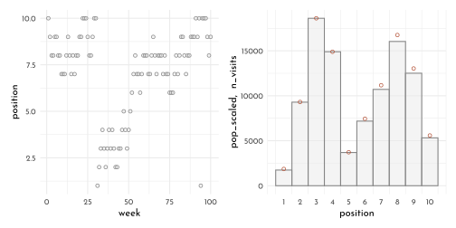

**H6**

we kind of did that already 🤔


```r
manual_mcmc <- function(W = 6, L = 3, n_samples = 1e4, p_start = .5, seed = 42){
  set.seed(seed)
  
  p <- rep( NA, n_samples )
  p[1] <- p_start
  
  for ( i in 2:n_samples ) {
  # create a symmetric proposal
  p_new <- rnorm( n = 1, mean = p[ i - 1], sd =  0.1)
  
  if ( p_new < 0 ){ p_new <- abs( p_new ) }
  if ( p_new > 1 ){ p_new <- 2 - p_new }
  
  # compare probabilities of current vs. proposal
  q0 <- dbinom( W, W + L, p[ i - 1 ] )
  q1 <- dbinom( W, W + L, p_new )
  
  # decide whether to move
  p[i] <- if_else( runif(1) < q1 / q0, p_new, p[i - 1] )
  }
  p
}

p <- manual_mcmc()
p_36 <- manual_mcmc(W = 24, L = 12)

p_p <- tibble(x = p) %>% 
  ggplot() +
  stat_function(fun = function(x){ dbeta( shape1 =  6 + 1, shape2 = 3 + 1, x =  x ) / 
      integrate(f = function(x){ dbeta( shape1 = 6 + 1, shape2 = 3 + 1, x = x )},
                lower = 0, upper = 1)[[1]] },
      xlim = c(0,1), n = 500, geom = "area",
      aes(color = "posterior", fill = after_scale(clr_alpha(color))))+
  geom_density(aes(x = x, color = "MCMC")) +
  scale_color_manual("approach", values = c(posterior = clr0, MCMC = clr2)) +
  labs(y = "density", x = "proportion water", title = "n = 12") 


p_p36 <- tibble(x = p_36) %>% 
  ggplot() +
  stat_function(fun = function(x){ dbeta( shape1 =  24 + 1, shape2 = 12 + 1, x =  x ) / 
      integrate(f = function(x){ dbeta( shape1 = 24 + 1, shape2 = 12 + 1, x = x )},
                lower = 0, upper = 1)[[1]] },
      xlim = c(0,1), n = 500, geom = "area",
      aes(color = "posterior", fill = after_scale(clr_alpha(color))))+
  geom_density(aes(x = x, color = "MCMC")) +
  scale_color_manual("approach", values = c(posterior = clr0, MCMC = clr2)) +
  labs(y = "density", x = "proportion water", title = "n = 36")

p_p + p_p36 +
  plot_layout(guides = "collect") & 
  theme(legend.position = "bottom")
```


**H7**

Hmm - I'll pass for now... 🤷

## {brms} section

### Easy HMC: `brm{}`


```r
data_rugged_brms <- data_rugged %>%
  mutate(cont_idx = factor(cont_idx)) %>% 
  dplyr::select(log_gdp_std, rugged_std, cont_idx) 

brms_c9_model_rugged_slope <- brm(
  data = data_rugged_brms, 
  family = gaussian,
  bf(log_gdp_std ~ 0 + a + b * (rugged_std - 0.215), 
     a ~ 0 + cont_idx, 
     b ~ 0 + cont_idx,
     nl = TRUE),
  prior = c(prior(normal(1, 0.1), class = b, coef = cont_idx1, nlpar = a),
            prior(normal(1, 0.1), class = b, coef = cont_idx2, nlpar = a),
            prior(normal(0, 0.3), class = b, coef = cont_idx1, nlpar = b),
            prior(normal(0, 0.3), class = b, coef = cont_idx2, nlpar = b),
            prior(exponential(1), class = sigma)),
  chains = 1, cores = 1,
  seed = 42,
  file = "brms/brms_c9_model_rugged_slope")
```


```r
library(tidybayes)

as_draws_df(brms_c9_model_rugged_slope)  %>% 
  pivot_longer(-lp__) %>% 
  group_by(name) %>% 
  mean_hdi(value, .width = .89)
```

```
#> # A tibble: 8 × 7
#>   name            value  .lower   .upper .width .point .interval
#>   <chr>           <dbl>   <dbl>    <dbl>  <dbl> <chr>  <chr>    
#> 1 .chain          1      1        1        0.89 mean   hdi      
#> 2 .draw         500.     1      891        0.89 mean   hdi      
#> 3 .iteration    500.     1      891        0.89 mean   hdi      
#> 4 b_a_cont_idx1   0.887  0.859    0.908    0.89 mean   hdi      
#> 5 b_a_cont_idx2   1.05   1.03     1.07     0.89 mean   hdi      
#> 6 b_b_cont_idx1   0.133  0.0166   0.252    0.89 mean   hdi      
#> 7 b_b_cont_idx2  -0.140 -0.220   -0.0565   0.89 mean   hdi      
#> 8 sigma           0.112  0.102    0.121    0.89 mean   hdi
```

> {brms} now returns two columns: `Bulk_ESS` and `Tail_ESS`. These originate from the same Vehtari, Gelman, et al. (2019) paper that introduced the upcoming change to the $\hat{R}$. 

> If you plan to report quantile estimates or posterior intervals, we strongly suggest assessing the convergence of the chains for these quantiles. In Section 4.3 we show that convergence of Markov chains is not uniform across the parameter space and propose diagnostics and effective sample sizes specifically for extreme quantiles. This is *different* from the standard ESS estimate (which we refer to as the “bulk-ESS”), which mainly assesses how well the centre of the distribution is resolved. Instead, these “tail-ESS” measures allow the user to estimate the MCSE for interval estimates. (p. 5, emphasis in the original)


```r
parallel::detectCores()
```

```
#> [1] 8
```

```r
brms_c9_model_rugged_slope_parallel <- update(
  brms_c9_model_rugged_slope, 
  chains = 4, cores = 4,
  seed = 42,
  file = "brms/brms_c9_model_rugged_slope_parallel")
```


```r
vcov(brms_c9_model_rugged_slope_parallel,
     correlation = TRUE) %>%
  round(digits = 2)
```

$$\begin{bmatrix} 1 &0.01 &0.14 &0.03 \\0.01 &1 &0.01 &-0.09 \\0.14 &0.01 &1 &0.02 \\0.03 &-0.09 &0.02 &1 \\ \end{bmatrix}$$


```r
as_draws_df(brms_c9_model_rugged_slope_parallel) %>%
  select(b_a_cont_idx1:sigma) %>% 
  general_pairs(col = clr_dark)
```

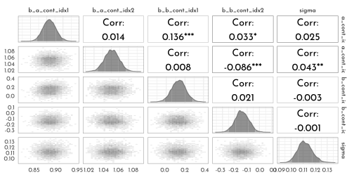


```r
ggs(brms_c9_model_rugged_slope_parallel, inc_warmup = TRUE) %>%
  mutate(chain = factor(Chain)) %>% 
  filter(Parameter != "sigma") %>% 
  ggplot(aes(x = Iteration, y = value)) +
  annotate(geom = "rect", 
           xmin = 0, xmax = 1000, ymin = -Inf, ymax = Inf,
           fill = clr0d, alpha = .3, size = 0) +
  geom_line(aes(color = chain),
            size = .15) +
  scale_color_manual(values = clr_chains(col = clr_dark) ) +
  facet_wrap(~ Parameter, scales = "free_y") +
    labs(title = "custom trace plots with warmups via ggmcmc::ggs()",
       x = NULL, y = NULL) +
  theme(legend.position = "bottom") 
```

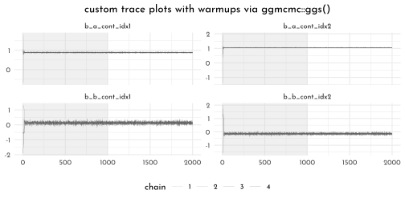


```r
brms_c9_model_rugged_slope_parallel %>% 
  mcmc_rank_overlay(pars = vars(`b_a_cont_idx1`:`b_b_cont_idx2`), n_bins = 60) +
  scale_color_manual(values = clr_chains(col = clr_dark) ) +
  ggtitle("custom trank plots") +
  # coord_cartesian(ylim = c(0, NA)) +
  theme(legend.position = "bottom")
```

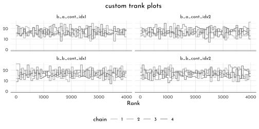


```r
brms::stancode(brms_c9_model_rugged_slope_parallel)
```

```
#> // generated with brms 2.16.1
#> functions {
#> }
#> data {
#>   int<lower=1> N;  // total number of observations
#>   vector[N] Y;  // response variable
#>   int<lower=1> K_a;  // number of population-level effects
#>   matrix[N, K_a] X_a;  // population-level design matrix
#>   int<lower=1> K_b;  // number of population-level effects
#>   matrix[N, K_b] X_b;  // population-level design matrix
#>   // covariate vectors for non-linear functions
#>   vector[N] C_1;
#>   int prior_only;  // should the likelihood be ignored?
#> }
#> transformed data {
#> }
#> parameters {
#>   vector[K_a] b_a;  // population-level effects
#>   vector[K_b] b_b;  // population-level effects
#>   real<lower=0> sigma;  // dispersion parameter
#> }
#> transformed parameters {
#> }
#> model {
#>   // likelihood including constants
#>   if (!prior_only) {
#>     // initialize linear predictor term
#>     vector[N] nlp_a = X_a * b_a;
#>     // initialize linear predictor term
#>     vector[N] nlp_b = X_b * b_b;
#>     // initialize non-linear predictor term
#>     vector[N] mu;
#>     for (n in 1:N) {
#>       // compute non-linear predictor values
#>       mu[n] = 0 + nlp_a[n] + nlp_b[n] * (C_1[n] - 0.215);
#>     }
#>     target += normal_lpdf(Y | mu, sigma);
#>   }
#>   // priors including constants
#>   target += normal_lpdf(b_a[1] | 1, 0.1);
#>   target += normal_lpdf(b_a[2] | 1, 0.1);
#>   target += normal_lpdf(b_b[1] | 0, 0.3);
#>   target += normal_lpdf(b_b[2] | 0, 0.3);
#>   target += exponential_lpdf(sigma | 1);
#> }
#> generated quantities {
#> }
```

### Care and feeding of your Markov chain


```r
brms_c9_model_flat <- brm(
  data = list(y = c(-1, 1)), 
      family = gaussian,
      y ~ 1,
      prior = c(prior(normal(0, 1000), class = Intercept),
                prior(exponential(0.0001), class = sigma)),
      iter = 2000, warmup = 1000,
      chains = 3,
      seed = 42,
      file = "brms/brms_c9_model_flat")
```


```r
print(brms_c9_model_flat)
```

```
#>  Family: gaussian 
#>   Links: mu = identity; sigma = identity 
#> Formula: y ~ 1 
#>    Data: list(y = c(-1, 1)) (Number of observations: 2) 
#>   Draws: 3 chains, each with iter = 2000; warmup = 1000; thin = 1;
#>          total post-warmup draws = 3000
#> 
#> Population-Level Effects: 
#>           Estimate Est.Error l-95% CI u-95% CI Rhat Bulk_ESS Tail_ESS
#> Intercept     3.95    317.70  -774.17   805.16 1.02      602      459
#> 
#> Family Specific Parameters: 
#>       Estimate Est.Error l-95% CI u-95% CI Rhat Bulk_ESS Tail_ESS
#> sigma   547.18   1330.76    19.32  3759.47 1.04       98       63
#> 
#> Draws were sampled using sampling(NUTS). For each parameter, Bulk_ESS
#> and Tail_ESS are effective sample size measures, and Rhat is the potential
#> scale reduction factor on split chains (at convergence, Rhat = 1).
```

Inspection help for **divergent transitions**:


```r
nuts_params(brms_c9_model_flat) %>% 
  distinct(Parameter)
```

```
#>       Parameter
#> 1 accept_stat__
#> 2    stepsize__
#> 3   treedepth__
#> 4  n_leapfrog__
#> 5   divergent__
#> 6      energy__
```

```r
nuts_params(brms_c9_model_flat) %>% 
  filter(Parameter == "divergent__") %>% 
  count(Value)
```

```
#>   Value    n
#> 1     0 2682
#> 2     1  318
```


```r
posterior <- as_draws_df(brms_c9_model_flat, add_chain = TRUE) %>% 
  as_tibble() %>% 
  rename(chain = ".chain")

p1 <- posterior %>% 
  mcmc_trace(pars = vars(b_Intercept:sigma),
             size = .25)

p2 <- posterior %>% 
  mcmc_rank_overlay(pars = vars(b_Intercept:sigma), n_bins = 50)

(
  (p1 / p2) &
    scale_color_manual(values = clr_chains(col = clr_dark) ) &
    theme(legend.position = "none")
) +
  plot_annotation(subtitle = "These chains are not healthy")
```


```r
brms_c9_model_less_flat <- brm(
  data = list(y = c(-1, 1)), 
  family = gaussian,
  y ~ 1,
  prior = c(prior(normal(1, 10), class = Intercept),
            prior(exponential(1), class = sigma)),
  iter = 2000, warmup = 1000,
  chains = 3,
  seed = 42,
  file = "brms/brms_c9_model_less_flat")
```


```r
posterior <- as_draws_df(brms_c9_model_less_flat, add_chain = TRUE) %>% 
  as_tibble() %>% 
  rename(chain = ".chain")

p1 <- posterior %>% 
  mcmc_trace(pars = vars(b_Intercept:sigma),
             size = .25)

p2 <- posterior %>% 
  mcmc_rank_overlay(pars = vars(b_Intercept:sigma), n_bins = 50)

(
  (p1 / p2) &
    scale_color_manual(values = clr_chains(col = clr_dark) ) &
    theme(legend.position = "none")
) +
  plot_annotation(subtitle = "Weakly informative priors cleared up the condition right away")
```


### Non-identifiable parameters


```r
set.seed(42)
y <- rnorm(100, mean = 0, sd = 1)

brms_c9_model_non_identifiable <- brm(
  data = list(y  = y,
              a1 = 1,
              a2 = 1), 
  family = gaussian,
  y ~ 0 + a1 + a2,
  prior = c(prior(normal(0, 1000), class = b),
            prior(exponential(1), class = sigma)),
  iter = 2000, warmup = 1000,
  chains = 3,
  seed = 42,
  file = "brms/brms_c9_model_non_identifiable")
```


```r
posterior <- as_draws_df(brms_c9_model_non_identifiable, add_chain = TRUE) %>% 
  as_tibble() %>% 
  rename(chain = ".chain")

p1 <- posterior %>% 
  mcmc_trace(pars = vars(b_a1:sigma),
             size = .25)

p2 <- posterior %>% 
  mcmc_rank_overlay(pars = vars(b_a1:sigma), n_bins = 50)

(
  (p1 / p2) &
    scale_color_manual(values = clr_chains(col = clr_dark) ) &
    theme(legend.position = "none")
) +
  plot_annotation(subtitle = "non identifiable parameter")
```

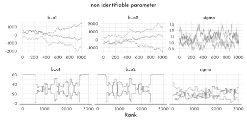


```r
brms_c9_model_non_identifiable_regularized <- brm(
  data = list(y  = y,
              a1 = 1,
              a2 = 1), 
  family = gaussian,
  y ~ 0 + a1 + a2,
  prior = c(prior(normal(0, 10), class = b),
            prior(exponential(1), class = sigma)),
  iter = 2000, warmup = 1000, chains = 3,
  seed = 9,
  file = "brms/brms_c9_model_non_identifiable_regularized")
```


```r
posterior <- as_draws_df(brms_c9_model_non_identifiable_regularized,
                         add_chain = TRUE) %>% 
  as_tibble() %>% 
  rename(chain = ".chain")

p1 <- posterior %>% 
  mcmc_trace(pars = vars(b_a1:sigma),
             size = .25)

p2 <- posterior %>% 
  mcmc_rank_overlay(pars = vars(b_a1:sigma), n_bins = 50)

(
  (p1 / p2) &
    scale_color_manual(values = clr_chains(col = clr_dark) ) &
    theme(legend.position = "none")
) +
  plot_annotation(subtitle = "non identifiable parameter (regularized)")
```


## pymc3 section

---

<div id="myModal" class="modal">
  <span class="close">&times;</span>
  
  <div id="caption"></div>
</div>

<script src="./js/zoom.js"></script>
