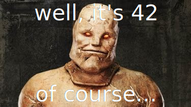

# Rethinking: Chapter 1

```{r setup, include = FALSE}
knitr::opts_chunk$set(echo = TRUE, 
                      dev = "svg",         # for html rendering
                      # dev = "cairo_pdf", # for pdf rendering
                      fig.asp = .5, 
                      fig.align = "center",
                      message = FALSE,
                      warning = FALSE
)
source("bayesian_settings.R")
```

by [Richard McElreath](https://xcelab.net/rm/statistical-rethinking/), building on the Summary by [Solomon Kurz](https://bookdown.org/content/4857/)

```{r, echo = FALSE, out.width = 650}

```

---

<div id="myModal" class="modal">
  <span class="close">&times;</span>
  
  <div id="caption"></div>
</div>

<script src="./js/zoom.js"></script>